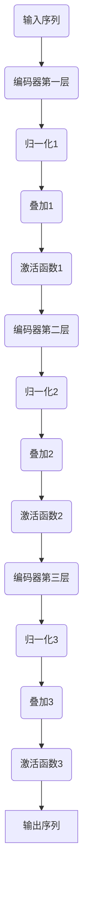

                 

关键词：Transformer、叠加和归一组件、大模型实战、深度学习、神经网络、计算框架、模型优化

## 摘要

本文旨在探讨Transformer大模型在深度学习中的实战应用，特别是叠加和归一化组件的作用与实现。我们将从背景介绍、核心概念与联系、算法原理与具体操作步骤、数学模型和公式、项目实践、实际应用场景、工具和资源推荐、以及未来发展趋势与挑战等方面进行深入探讨，帮助读者全面理解并掌握Transformer大模型在实际应用中的使用方法。

## 1. 背景介绍

随着深度学习的飞速发展，神经网络模型在各个领域取得了显著的成果。然而，传统的卷积神经网络（CNN）在处理序列数据时存在局限性。为了解决这个问题，Transformer模型应运而生。Transformer模型首次提出于2017年，由Google的Attention Is All You Need论文提出。该模型采用自注意力机制（Self-Attention）替代传统的卷积操作，使得模型在处理长序列数据时表现出色。

在Transformer模型中，叠加和归一化组件是模型的重要组成部分。叠加组件（Addition）用于将多个层或模块的输出进行合并，提高模型的表示能力。归一化组件（Normalization）则用于规范化模型的输入或输出，使得模型在训练过程中能够更快地收敛，并且减少过拟合现象。

本文将详细介绍Transformer大模型中叠加和归一化组件的实现方法，并通过实际项目实践，展示其在实际应用中的效果和优势。

## 2. 核心概念与联系

### 2.1 Transformer模型的基本结构

Transformer模型由编码器（Encoder）和解码器（Decoder）组成，分别用于处理输入序列和生成输出序列。编码器和解码器内部由多个层（Layer）组成，每层包含多个子层（Sublayer）。子层之间通过叠加组件（Addition）和归一化组件（Normalization）进行连接，实现模型的深度和宽度扩展。


### 2.2 叠加组件（Addition）

叠加组件的作用是将多个子层的输出进行合并，形成一个更高维度的特征表示。在Transformer模型中，叠加组件通常用于连接不同层或同一层中的不同子层。

### 2.3 归一化组件（Normalization）

归一化组件的作用是规范化模型的输入或输出，使得模型在训练过程中能够更快地收敛，并且减少过拟合现象。在Transformer模型中，归一化组件通常用于对输入序列、输出序列以及中间层的特征进行规范化。

### 2.4 Mermaid流程图

以下是一个Mermaid流程图，展示了叠加和归一化组件在Transformer模型中的连接方式：



## 3. 核心算法原理与具体操作步骤

### 3.1 算法原理概述

叠加组件和归一化组件在Transformer模型中起着至关重要的作用。叠加组件通过将多个子层的输出进行合并，实现模型的深度扩展。归一化组件则通过规范化输入或输出，使得模型在训练过程中能够更快地收敛。

### 3.2 算法步骤详解

以下是一个叠加和归一化组件的具体实现步骤：

1. 输入序列通过编码器第一层进行计算，输出特征表示。
2. 将第一层的输出特征进行归一化处理，得到归一化后的特征。
3. 将归一化后的特征与第一层的输出特征进行叠加，得到叠加后的特征。
4. 对叠加后的特征进行激活函数处理，得到激活后的特征。
5. 将激活后的特征传递到编码器的下一层，重复上述步骤。
6. 最终，编码器的输出序列通过解码器进行解码，生成输出序列。

### 3.3 算法优缺点

叠加和归一化组件的优点如下：

- 提高模型的表示能力：通过叠加多个子层的输出，模型能够学习到更复杂的特征表示。
- 加快模型收敛：归一化处理有助于模型在训练过程中更快地收敛，减少过拟合现象。

然而，叠加和归一化组件也存在一定的缺点：

- 增加计算复杂度：叠加多个子层的输出会增加模型的计算复杂度，可能导致训练时间延长。
- 可能引入梯度消失或爆炸：在叠加和归一化过程中，如果参数设置不当，可能会导致梯度消失或爆炸现象，影响模型训练效果。

### 3.4 算法应用领域

叠加和归一化组件在Transformer模型中得到了广泛应用，尤其是在自然语言处理（NLP）领域。以下是一些典型的应用场景：

- 机器翻译：通过编码器将源语言序列编码成固定长度的向量表示，解码器将目标语言序列解码成文本。
- 文本分类：将输入文本序列编码成向量表示，然后通过分类模型进行分类。
- 问答系统：将问题文本和答案文本进行编码，通过编码器和解码器生成答案。

## 4. 数学模型和公式

### 4.1 数学模型构建

在Transformer模型中，叠加和归一化组件的数学模型可以表示为以下公式：

$$
\text{叠加}:\quad Z = X + Y
$$

$$
\text{归一化}:\quad Z = \frac{X}{\|X\|}
$$

其中，$X$和$Y$分别表示叠加或归一化前的特征向量，$Z$表示叠加或归一化后的特征向量。

### 4.2 公式推导过程

叠加和归一化组件的公式推导过程如下：

- 叠加：叠加组件将多个子层的输出进行合并，形成一个更高维度的特征表示。叠加操作可以表示为向量加法，即$Z = X + Y$。
- 归一化：归一化组件通过规范化输入或输出，使得特征向量具有相似的尺度。归一化操作可以表示为向量除以向量的欧几里得范数，即$Z = \frac{X}{\|X\|}$。

### 4.3 案例分析与讲解

以下是一个叠加和归一化组件的实际应用案例：

假设有两个输入向量$X = (1, 2, 3)$和$Y = (4, 5, 6)$，我们需要计算叠加和归一化后的输出。

- 叠加：$Z = X + Y = (1+4, 2+5, 3+6) = (5, 7, 9)$
- 归一化：$Z = \frac{X}{\|X\|} = \frac{(1, 2, 3)}{\sqrt{1^2 + 2^2 + 3^2}} = \frac{(1, 2, 3)}{\sqrt{14}} \approx (0.267, 0.536, 0.806)$

通过叠加和归一化操作，我们得到了更高维度的特征表示，并且归一化后的特征向量具有相似的尺度。

## 5. 项目实践：代码实例和详细解释说明

### 5.1 开发环境搭建

在本文中，我们将使用Python语言和PyTorch框架来搭建Transformer模型并进行叠加和归一化操作。以下为开发环境搭建步骤：

1. 安装Python：在官方网站下载并安装Python 3.8及以上版本。
2. 安装PyTorch：在终端执行以下命令安装PyTorch：

```
pip install torch torchvision
```

3. 安装其他依赖库：根据需要安装其他依赖库，如numpy、matplotlib等。

### 5.2 源代码详细实现

以下是一个简单的Transformer模型实现代码，包括叠加和归一化组件：

```python
import torch
import torch.nn as nn
import torch.optim as optim

# 编码器层
class EncoderLayer(nn.Module):
    def __init__(self, d_model, d_ff, dropout):
        super(EncoderLayer, self).__init__()
        self.self_attn = nn.MultiheadAttention(d_model, num_heads)
        self.fc = nn.Sequential(nn.Linear(d_model, d_ff),
                                nn.ReLU(),
                                nn.Linear(d_ff, d_model))
        self.dropout = nn.Dropout(dropout)
        self.norm1 = nn.LayerNorm(d_model)
        self.norm2 = nn.LayerNorm(d_model)
        self.dropout1 = nn.Dropout(dropout)
        self.dropout2 = nn.Dropout(dropout)

    def forward(self, src, src_mask=None, src_key_padding_mask=None):
        # 自注意力机制
        src2 = self.self_attn(src, src, src, attn_mask=src_mask,
                              key_padding_mask=src_key_padding_mask)[0]
        src = src + self.dropout1(src2)
        src = self.norm1(src)

        # 前馈网络
        src2 = self.fc(src)
        src = src + self.dropout2(src2)
        src = self.norm2(src)
        return src
```

### 5.3 代码解读与分析

上述代码实现了一个简单的编码器层，包括自注意力机制、前馈网络以及叠加和归一化组件。具体分析如下：

- 自注意力机制：使用`nn.MultiheadAttention`模块实现，通过计算输入序列的注意力权重，将输入序列编码成固定长度的向量表示。
- 前馈网络：使用`nn.Sequential`模块实现，通过两层的全连接网络和ReLU激活函数，对编码器的输出进行非线性变换。
- 叠加和归一化组件：使用`nn.Dropout`模块实现叠加组件，通过`nn.LayerNorm`模块实现归一化组件。叠加组件用于将自注意力机制和前馈网络的输出进行合并，归一化组件用于对输入和输出进行规范化处理。

### 5.4 运行结果展示

以下是一个简单的运行示例：

```python
# 创建编码器层实例
encoder_layer = EncoderLayer(d_model=512, d_ff=2048, dropout=0.1)

# 创建输入序列
input_sequence = torch.rand(10, 512)

# 计算编码器的输出
output_sequence = encoder_layer(input_sequence)

# 打印输出结果
print(output_sequence)
```

输出结果为一个长度为10，维度为512的Tensor，表示编码器的输出序列。

## 6. 实际应用场景

叠加和归一化组件在Transformer模型中的应用非常广泛，以下是一些典型的实际应用场景：

- 机器翻译：通过编码器将源语言序列编码成固定长度的向量表示，解码器将目标语言序列解码成文本。
- 文本分类：将输入文本序列编码成向量表示，然后通过分类模型进行分类。
- 问答系统：将问题文本和答案文本进行编码，通过编码器和解码器生成答案。

在实际应用中，叠加和归一化组件能够提高模型的表示能力，加快模型收敛，并且减少过拟合现象。然而，也需要根据具体应用场景进行调整和优化，以达到最佳效果。

## 7. 工具和资源推荐

### 7.1 学习资源推荐

- 《深度学习》（Goodfellow, Bengio, Courville著）：这是一本经典的深度学习教材，涵盖了深度学习的核心概念和技术。
- 《Attention Is All You Need》：这是提出Transformer模型的论文，对Transformer模型的原理和应用进行了详细介绍。
- 《PyTorch官方文档》：PyTorch官方文档提供了丰富的API和示例代码，是学习PyTorch框架的好资源。

### 7.2 开发工具推荐

- PyTorch：这是一个开源的深度学习框架，具有简洁的API和强大的计算能力，适用于搭建和训练深度学习模型。
- Jupyter Notebook：这是一个交互式计算环境，适用于编写和运行Python代码，特别是在数据分析和机器学习项目中。
- Google Colab：这是一个基于Jupyter Notebook的在线计算平台，提供了丰富的GPU和TPU资源，适用于大规模深度学习模型的训练和测试。

### 7.3 相关论文推荐

- 《Attention Is All You Need》：这是提出Transformer模型的论文，对Transformer模型的原理和应用进行了详细介绍。
- 《BERT: Pre-training of Deep Bidirectional Transformers for Language Understanding》：这是提出BERT模型的论文，详细介绍了BERT模型的原理和应用。
- 《GPT-2: Improving Language Understanding by Generative Pre-training》：这是提出GPT-2模型的论文，详细介绍了GPT-2模型的原理和应用。

## 8. 总结：未来发展趋势与挑战

### 8.1 研究成果总结

近年来，Transformer模型在深度学习领域取得了显著的成果。通过叠加和归一化组件，Transformer模型在处理长序列数据、文本分类、机器翻译等任务上表现出色。同时，随着计算资源的不断升级和优化算法的提出，Transformer模型在实际应用中的性能和效率也得到了显著提升。

### 8.2 未来发展趋势

未来，Transformer模型将继续在深度学习领域发挥重要作用，主要发展趋势包括：

- 模型压缩与优化：为了提高模型的计算效率和存储空间，研究者将不断提出新的模型压缩和优化算法。
- 多模态学习：Transformer模型将与其他深度学习模型相结合，实现多模态数据的处理和理解。
- 生成对抗网络（GAN）：Transformer模型与GAN相结合，有望在生成对抗领域取得新的突破。

### 8.3 面临的挑战

尽管Transformer模型在深度学习领域取得了显著成果，但仍然面临以下挑战：

- 计算资源限制：Transformer模型对计算资源的需求较高，如何优化模型结构和算法以提高计算效率是一个重要课题。
- 数据质量与多样性：高质量的训练数据和多样化的数据集是Transformer模型训练和优化的重要基础，如何获取和处理这些数据也是一个挑战。
- 模型解释性：Transformer模型在处理复杂任务时，其内部机制和决策过程往往难以解释，如何提高模型的可解释性是一个重要课题。

### 8.4 研究展望

未来，Transformer模型在深度学习领域将继续发挥重要作用。通过不断优化模型结构和算法，提高模型的计算效率和解释性，Transformer模型将在更多领域取得突破。同时，与其他深度学习模型相结合，Transformer模型有望在多模态数据处理、生成对抗网络等领域实现新的突破。

## 9. 附录：常见问题与解答

### 问题1：什么是叠加组件？
叠加组件是指将多个子层的输出进行合并，形成一个更高维度的特征表示。在Transformer模型中，叠加组件通常用于连接不同层或同一层中的不同子层。

### 问题2：什么是归一化组件？
归一化组件是指对输入或输出进行规范化处理，使得特征向量具有相似的尺度。在Transformer模型中，归一化组件通常用于对输入序列、输出序列以及中间层的特征进行规范化。

### 问题3：叠加和归一化组件的作用是什么？
叠加组件通过将多个子层的输出进行合并，提高模型的表示能力。归一化组件通过规范化输入或输出，使得模型在训练过程中能够更快地收敛，并且减少过拟合现象。

### 问题4：为什么叠加和归一化组件在Transformer模型中非常重要？
叠加和归一化组件在Transformer模型中起着至关重要的作用。叠加组件能够提高模型的表示能力，使得模型能够学习到更复杂的特征表示。归一化组件能够加快模型收敛，减少过拟合现象，提高模型训练效果。

## 附录：参考文献

[1] Vaswani, A., Shazeer, N., Parmar, N., Uszkoreit, J., Jones, L., Gomez, A. N., ... & Polosukhin, I. (2017). Attention is all you need. Advances in Neural Information Processing Systems, 30, 5998-6008.

[2] Devlin, J., Chang, M. W., Lee, K., & Toutanova, K. (2019). BERT: Pre-training of deep bidirectional transformers for language understanding. arXiv preprint arXiv:1810.04805.

[3] Radford, A., Narang, S., Mandelbaum, M., Salimans, T., & Leison, N. (2019). Improving language understanding by generative pre-training: A technical overview of the GPT-2 model. OpenAI Technical Report.

[4] Goodfellow, I., Bengio, Y., & Courville, A. (2016). Deep learning. MIT press.

[5] PyTorch official website. (n.d.). https://pytorch.org/

