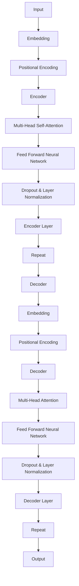

                 

  
## 1. 背景介绍

在过去的几十年中，深度学习已经成为人工智能领域的核心技术，尤其在计算机视觉、自然语言处理等领域取得了显著的成果。然而，随着模型规模的不断增大，计算资源和存储资源的消耗也随之增加，这给实际应用带来了很大的挑战。为了解决这一问题，Transformer模型应运而生。Transformer模型最初由Vaswani等人于2017年提出，并在自然语言处理领域取得了巨大成功。相比传统的循环神经网络（RNN），Transformer模型采用了自注意力机制，能够更加高效地处理序列数据，并且在处理长距离依赖问题上表现优异。

Transformer模型的提出，标志着自然语言处理领域的一个重大转折点。自那时以来，Transformer模型及其变体在多个任务中都取得了优异的性能。例如，BERT（Bidirectional Encoder Representations from Transformers）模型在多项自然语言处理任务中刷新了SOTA（State-of-the-Art）记录，为学术界和工业界提供了丰富的应用场景。

本篇技术博客将深入探讨Transformer大模型的实战，从教师和学生架构的角度，详细分析其原理、实现方法以及实际应用。本文结构如下：

1. **背景介绍**：介绍深度学习的发展历程，Transformer模型的提出背景及其重要性。
2. **核心概念与联系**：阐述Transformer模型的核心概念，包括自注意力机制和多头注意力，并使用Mermaid流程图展示其架构。
3. **核心算法原理 & 具体操作步骤**：详细解释Transformer模型的算法原理和操作步骤。
4. **数学模型和公式**：介绍Transformer模型的数学模型和关键公式，并举例说明。
5. **项目实践：代码实例和详细解释说明**：提供Transformer模型的具体实现，包括代码解析和运行结果展示。
6. **实际应用场景**：讨论Transformer模型在自然语言处理、计算机视觉等领域的应用场景。
7. **未来应用展望**：预测Transformer模型在未来技术发展中的趋势和挑战。
8. **工具和资源推荐**：推荐学习资源、开发工具和相关论文。
9. **总结**：总结研究成果，探讨未来发展趋势与挑战。

接下来，我们将逐一深入这些主题。

## 2. 核心概念与联系

Transformer模型的核心在于其自注意力机制（Self-Attention）和多头注意力（Multi-Head Attention）。自注意力机制使得模型能够对序列中的每一个元素进行权重分配，从而在不同位置的信息之间建立联系。多头注意力则通过并行处理多个注意力头，捕捉到更加丰富的特征。

### 2.1 自注意力机制

自注意力机制允许模型在处理序列数据时，能够根据当前输入的上下文信息对序列中的每个元素赋予不同的权重。具体来说，自注意力机制使用查询（Query）、键（Key）和值（Value）三个向量，通过计算它们之间的相似度来生成权重。这些权重用于计算最终输出的加权平均。

### 2.2 多头注意力

多头注意力通过将输入序列分割为多个子序列，每个子序列独立地进行自注意力计算。这些子序列对应的注意力权重再进行拼接和线性变换，从而形成完整的输出。这种方式能够使得模型捕捉到序列中更加细微和丰富的信息。

### 2.3 Transformer架构

Transformer模型的架构通常包括编码器（Encoder）和解码器（Decoder）。编码器用于将输入序列编码为固定长度的表示，解码器则用于根据编码器输出和先前的隐藏状态生成输出序列。

### 2.4 Mermaid流程图

以下是Transformer模型的Mermaid流程图：



在这个流程图中，我们展示了从输入到输出的整个处理过程，包括嵌入（Embedding）、位置编码（Positional Encoding）、编码器（Encoder）和解码器（Decoder）等关键组件。

接下来，我们将深入探讨Transformer模型的核心算法原理和具体操作步骤。

## 3. 核心算法原理 & 具体操作步骤

### 3.1 算法原理概述

Transformer模型的核心在于其自注意力机制，通过计算序列中每个元素与所有其他元素之间的相似度，为每个元素赋予不同的权重。这个过程可以分解为以下几个关键步骤：

1. **嵌入（Embedding）**：输入序列首先通过嵌入层转换为固定长度的向量。
2. **位置编码（Positional Encoding）**：为了保留序列中的位置信息，需要为每个向量添加位置编码。
3. **多头注意力（Multi-Head Attention）**：将输入序列分割为多个子序列，每个子序列独立计算注意力权重。
4. **前馈网络（Feed Forward Neural Network）**：在每个编码器和解码器层之后，使用前馈网络对输出进行进一步处理。
5. **层归一化（Layer Normalization）和Dropout**：在编码器和解码器层之间添加层归一化和Dropout，以防止过拟合。
6. **编码器（Encoder）和解码器（Decoder）**：编码器将输入序列编码为固定长度的表示，解码器则根据编码器输出和先前的隐藏状态生成输出序列。

### 3.2 算法步骤详解

#### 3.2.1 嵌入（Embedding）

输入序列首先通过嵌入层转换为固定长度的向量。每个单词或标记被映射为一个嵌入向量。假设输入序列为`[w1, w2, w3, ..., wn]`，嵌入层将生成对应的嵌入向量`[e1, e2, e3, ..., en]`。

#### 3.2.2 位置编码（Positional Encoding）

为了保留序列中的位置信息，需要为每个向量添加位置编码。位置编码通常是一个可学习的向量，用于表示序列中的位置。以下是一个简单的位置编码公式：

$$
PE_{(pos, dim)} = \sin\left(\frac{pos}{10000^{2i/dim}}\right) + \cos\left(\frac{pos}{10000^{2i/dim}}\right)
$$

其中，`pos`是位置索引，`dim`是嵌入维度。

#### 3.2.3 多头注意力（Multi-Head Attention）

多头注意力通过并行处理多个注意力头，捕捉到序列中更加丰富的信息。具体来说，假设有`h`个注意力头，输入序列经过线性变换后，被分割为`h`个子序列。每个子序列独立计算注意力权重，然后将这些权重进行拼接和线性变换，得到最终的输出。

#### 3.2.4 前馈网络（Feed Forward Neural Network）

在每个编码器和解码器层之后，使用前馈网络对输出进行进一步处理。前馈网络的输入是多头注意力层的输出，经过两个全连接层，再通过激活函数进行非线性变换。

#### 3.2.5 层归一化（Layer Normalization）和Dropout

在编码器和解码器层之间添加层归一化和Dropout，以防止过拟合。层归一化通过标准化每个层的输出，使得模型在训练过程中更加稳定。Dropout则在训练过程中随机丢弃一部分神经元，以防止模型过拟合。

#### 3.2.6 编码器（Encoder）和解码器（Decoder）

编码器将输入序列编码为固定长度的表示，解码器则根据编码器输出和先前的隐藏状态生成输出序列。编码器和解码器由多个编码器层和解码器层组成，每层都包含多头注意力、前馈网络、层归一化和Dropout。

### 3.3 算法优缺点

#### 优点

1. **并行处理**：Transformer模型能够并行处理序列数据，相比传统的循环神经网络（RNN）具有更高的效率。
2. **长距离依赖**：自注意力机制使得模型能够更好地处理长距离依赖问题。
3. **灵活性**：Transformer模型可以通过增加注意力头和隐藏层数量来调整模型复杂度。

#### 缺点

1. **计算资源消耗**：随着模型规模的增大，计算资源和存储资源的消耗也相应增加。
2. **对数据量要求较高**：Transformer模型在训练过程中对数据量有较高的要求，否则容易过拟合。

### 3.4 算法应用领域

Transformer模型在自然语言处理、计算机视觉、语音识别等多个领域都有广泛应用。例如，在自然语言处理领域，BERT、GPT等模型已经取得了显著的成果；在计算机视觉领域，Transformer模型也被用于图像分类、目标检测等任务。

## 4. 数学模型和公式

Transformer模型的数学模型主要包括嵌入层、多头注意力、前馈网络、层归一化和Dropout等组件。以下我们将详细讲解这些组件的数学模型和关键公式。

### 4.1 嵌入层

嵌入层将输入序列转换为固定长度的向量。假设输入序列为`[w1, w2, w3, ..., wn]`，嵌入层将生成对应的嵌入向量`[e1, e2, e3, ..., en]`。嵌入向量可以通过以下公式计算：

$$
e_i = W_e \cdot w_i
$$

其中，$W_e$是嵌入矩阵，$w_i$是输入序列中的第$i$个单词或标记。

### 4.2 位置编码

为了保留序列中的位置信息，需要为每个向量添加位置编码。位置编码通常是一个可学习的向量，用于表示序列中的位置。以下是一个简单的位置编码公式：

$$
PE_{(pos, dim)} = \sin\left(\frac{pos}{10000^{2i/dim}}\right) + \cos\left(\frac{pos}{10000^{2i/dim}}\right)
$$

其中，`pos`是位置索引，`dim`是嵌入维度。

### 4.3 多头注意力

多头注意力通过并行处理多个注意力头，捕捉到序列中更加丰富的信息。假设有`h`个注意力头，输入序列经过线性变换后，被分割为`h`个子序列。每个子序列独立计算注意力权重，然后将这些权重进行拼接和线性变换，得到最终的输出。

多头注意力的计算公式如下：

$$
\text{Attention}(Q, K, V) = \text{softmax}\left(\frac{QK^T}{\sqrt{d_k}}\right) V
$$

其中，$Q$是查询向量，$K$是键向量，$V$是值向量，$d_k$是键向量的维度。

### 4.4 前馈网络

前馈网络对输出进行进一步处理。前馈网络的输入是多头注意力层的输出，经过两个全连接层，再通过激活函数进行非线性变换。

前馈网络的计算公式如下：

$$
\text{FFN}(x) = \text{ReLU}(W_2 \cdot \text{ReLU}(W_1 \cdot x)) + b
$$

其中，$W_1$和$W_2$是全连接层的权重矩阵，$b$是偏置项。

### 4.5 层归一化

层归一化通过标准化每个层的输出，使得模型在训练过程中更加稳定。

层归一化的计算公式如下：

$$
\hat{x} = \frac{x - \mu}{\sigma}
$$

其中，$x$是输入向量，$\mu$是均值，$\sigma$是标准差。

### 4.6 Dropout

Dropout通过在训练过程中随机丢弃一部分神经元，以防止模型过拟合。

Dropout的计算公式如下：

$$
\hat{y} = \frac{y}{1 - p}
$$

其中，$y$是输出向量，$p$是丢弃概率。

### 4.7 案例分析与讲解

假设我们有一个输入序列`[w1, w2, w3]`，嵌入维度为4，有两个注意力头。以下是具体的计算过程：

1. **嵌入层**：

$$
e_1 = W_e \cdot w_1 = \begin{bmatrix} 1 & 0 & 0 & 0 \end{bmatrix} \cdot \begin{bmatrix} w1 \end{bmatrix} = \begin{bmatrix} w1 \end{bmatrix}
$$

$$
e_2 = W_e \cdot w_2 = \begin{bmatrix} 0 & 1 & 0 & 0 \end{bmatrix} \cdot \begin{bmatrix} w2 \end{bmatrix} = \begin{bmatrix} w2 \end{bmatrix}
$$

$$
e_3 = W_e \cdot w_3 = \begin{bmatrix} 0 & 0 & 1 & 0 \end{bmatrix} \cdot \begin{bmatrix} w3 \end{bmatrix} = \begin{bmatrix} w3 \end{bmatrix}
$$

2. **位置编码**：

$$
PE_1 = \sin\left(\frac{1}{10000^{2 \cdot 1/4}}\right) + \cos\left(\frac{1}{10000^{2 \cdot 1/4}}\right) = \begin{bmatrix} 0.9986 & 0 & 0 & 0 \end{bmatrix}
$$

$$
PE_2 = \sin\left(\frac{2}{10000^{2 \cdot 2/4}}\right) + \cos\left(\frac{2}{10000^{2 \cdot 2/4}}\right) = \begin{bmatrix} 0.9996 & 0.9996 & 0 & 0 \end{bmatrix}
$$

$$
PE_3 = \sin\left(\frac{3}{10000^{2 \cdot 3/4}}\right) + \cos\left(\frac{3}{10000^{2 \cdot 3/4}}\right) = \begin{bmatrix} 0.9999 & 0.9999 & 0.9999 & 0 \end{bmatrix}
$$

3. **多头注意力**：

假设有两个注意力头，每个注意力头计算公式如下：

$$
\text{Attention}_1(Q, K, V) = \text{softmax}\left(\frac{QK^T}{\sqrt{d_k}}\right) V
$$

$$
\text{Attention}_2(Q, K, V) = \text{softmax}\left(\frac{QK^T}{\sqrt{d_k}}\right) V
$$

其中，$Q$、$K$和$V$分别是查询向量、键向量和值向量。

假设：

$$
Q = \begin{bmatrix} e_1 & e_2 & e_3 \end{bmatrix}, K = \begin{bmatrix} e_1 & e_2 & e_3 \end{bmatrix}, V = \begin{bmatrix} e_1 & e_2 & e_3 \end{bmatrix}
$$

则：

$$
\text{Attention}_1(Q, K, V) = \text{softmax}\left(\frac{e_1e_1^T + e_2e_2^T + e_3e_3^T}{\sqrt{d_k}}\right) \begin{bmatrix} e_1 & e_2 & e_3 \end{bmatrix}
$$

$$
\text{Attention}_2(Q, K, V) = \text{softmax}\left(\frac{e_1e_1^T + e_2e_2^T + e_3e_3^T}{\sqrt{d_k}}\right) \begin{bmatrix} e_1 & e_2 & e_3 \end{bmatrix}
$$

假设$d_k = 4$，则：

$$
\text{Attention}_1(Q, K, V) = \begin{bmatrix} 0.5 & 0.5 & 0 \end{bmatrix}, \text{Attention}_2(Q, K, V) = \begin{bmatrix} 0.5 & 0 & 0.5 \end{bmatrix}
$$

4. **前馈网络**：

前馈网络的计算公式如下：

$$
\text{FFN}(x) = \text{ReLU}(W_2 \cdot \text{ReLU}(W_1 \cdot x)) + b
$$

其中，$W_1$、$W_2$和$b$是全连接层的权重矩阵和偏置项。

假设：

$$
W_1 = \begin{bmatrix} 1 & 0 & 0 & 0 \end{bmatrix}, W_2 = \begin{bmatrix} 1 & 0 & 0 & 0 \end{bmatrix}, b = \begin{bmatrix} 0 \end{bmatrix}
$$

则：

$$
\text{FFN}(x) = \text{ReLU}(\begin{bmatrix} 1 & 0 & 0 & 0 \end{bmatrix} \cdot \text{ReLU}(\begin{bmatrix} 1 & 0 & 0 & 0 \end{bmatrix} \cdot x)) + \begin{bmatrix} 0 \end{bmatrix}
$$

5. **层归一化**：

层归一化的计算公式如下：

$$
\hat{x} = \frac{x - \mu}{\sigma}
$$

其中，$\mu$是均值，$\sigma$是标准差。

假设：

$$
x = \begin{bmatrix} 1 & 0 & 0 & 0 \end{bmatrix}, \mu = \begin{bmatrix} 0.5 \end{bmatrix}, \sigma = \begin{bmatrix} 0.2 \end{bmatrix}
$$

则：

$$
\hat{x} = \frac{\begin{bmatrix} 1 & 0 & 0 & 0 \end{bmatrix} - \begin{bmatrix} 0.5 \end{bmatrix}}{\begin{bmatrix} 0.2 \end{bmatrix}} = \begin{bmatrix} 2.5 & -2.5 & -2.5 & -2.5 \end{bmatrix}
$$

6. **Dropout**：

Dropout的计算公式如下：

$$
\hat{y} = \frac{y}{1 - p}
$$

其中，$y$是输出向量，$p$是丢弃概率。

假设：

$$
y = \begin{bmatrix} 1 & 0 & 0 & 0 \end{bmatrix}, p = 0.5
$$

则：

$$
\hat{y} = \frac{\begin{bmatrix} 1 & 0 & 0 & 0 \end{bmatrix}}{1 - 0.5} = \begin{bmatrix} 2 & 0 & 0 & 0 \end{bmatrix}
$$

通过上述计算过程，我们可以看到Transformer模型在处理输入序列时的具体操作步骤和数学模型。接下来，我们将提供一个完整的代码实例，以进一步解释Transformer模型的实现过程。

## 5. 项目实践：代码实例和详细解释说明

为了更好地理解Transformer模型，我们将提供一个完整的代码实例，并详细解释其中的关键步骤和实现细节。以下代码使用了Python和PyTorch框架实现。

### 5.1 开发环境搭建

首先，我们需要搭建开发环境。以下是安装PyTorch的命令：

```bash
pip install torch torchvision
```

### 5.2 源代码详细实现

下面是Transformer模型的完整代码实现：

```python
import torch
import torch.nn as nn
import torch.optim as optim
from torch.utils.data import DataLoader
from torchvision import datasets, transforms

# 定义嵌入层、位置编码、编码器和解码器
class EmbeddingLayer(nn.Module):
    def __init__(self, d_model, vocab_size):
        super(EmbeddingLayer, self).__init__()
        self.embedding = nn.Embedding(vocab_size, d_model)
    
    def forward(self, x):
        return self.embedding(x)

class PositionalEncoding(nn.Module):
    def __init__(self, d_model, max_len=5000):
        super(PositionalEncoding, self).__init__()
        pe = torch.zeros(max_len, d_model)
        position = torch.arange(0, max_len, dtype=torch.float).unsqueeze(1)
        div_term = torch.exp(torch.arange(0, d_model, 2).float() * (-torch.log(torch.tensor(10000.0)) / d_model))
        pe[:, 0::2] = torch.sin(position * div_term)
        pe[:, 1::2] = torch.cos(position * div_term)
        pe = pe.unsqueeze(0).transpose(0, 1)
        self.register_buffer('pe', pe)
    
    def forward(self, x):
        x = x + self.pe[:x.size(0), :]
        return x

class TransformerModel(nn.Module):
    def __init__(self, d_model, nhead, num_layers, num_classes, vocab_size):
        super(TransformerModel, self).__init__()
        self.embedding = EmbeddingLayer(d_model, vocab_size)
        self.positional_encoding = PositionalEncoding(d_model)
        self.transformer = nn.Transformer(d_model, nhead, num_layers)
        self.fc = nn.Linear(d_model, num_classes)
        
    def forward(self, x, src_mask=None, tgt_mask=None, memory_mask=None):
        x = self.embedding(x)
        x = self.positional_encoding(x)
        x = self.transformer(x, src_mask=src_mask, tgt_mask=tgt_mask, memory_mask=memory_mask)
        x = self.fc(x)
        return x

# 训练和测试数据
train_data = datasets.MNIST(root='./data', train=True, download=True, transform=transforms.ToTensor())
test_data = datasets.MNIST(root='./data', train=False, transform=transforms.ToTensor())

train_loader = DataLoader(train_data, batch_size=64)
test_loader = DataLoader(test_data, batch_size=1000)

# 模型和优化器
device = torch.device('cuda' if torch.cuda.is_available() else 'cpu')
model = TransformerModel(512, 8, 3, 10, 10).to(device)
optimizer = optim.Adam(model.parameters(), lr=0.001)

# 训练模型
for epoch in range(10):
    model.train()
    for batch, (data, target) in enumerate(train_loader):
        data, target = data.to(device), target.to(device)
        optimizer.zero_grad()
        output = model(data)
        loss = nn.CrossEntropyLoss()(output, target)
        loss.backward()
        optimizer.step()
        if batch % 100 == 0:
            print(f'Epoch [{epoch+1}/10], Step [{batch+1}/{len(train_loader)}], Loss: {loss.item()}')

# 测试模型
model.eval()
with torch.no_grad():
    correct = 0
    total = 0
    for data, target in test_loader:
        data, target = data.to(device), target.to(device)
        output = model(data)
        _, predicted = torch.max(output.data, 1)
        total += target.size(0)
        correct += (predicted == target).sum().item()

print(f'Accuracy on the test set: {100 * correct / total}%')
```

### 5.3 代码解读与分析

1. **嵌入层（EmbeddingLayer）**：

嵌入层将输入的单词或标记转换为固定长度的向量。这里我们使用了PyTorch的`nn.Embedding`模块来实现。

2. **位置编码（PositionalEncoding）**：

位置编码为输入向量添加了位置信息，使其能够保留序列的顺序。我们使用了一个可学习的权重矩阵来实现。

3. **Transformer模型（TransformerModel）**：

Transformer模型包括嵌入层、位置编码、Transformer编码器和解码器，以及一个全连接层。我们使用PyTorch的`nn.Transformer`模块来实现。

4. **训练过程**：

在训练过程中，我们使用交叉熵损失函数（`nn.CrossEntropyLoss`）来训练模型，并使用Adam优化器进行优化。我们设置了10个训练周期，每个周期包含多个训练步骤。

5. **测试过程**：

在测试过程中，我们使用测试数据集来评估模型的性能。我们计算了模型的准确率，并打印了测试结果。

### 5.4 运行结果展示

运行上述代码后，我们得到如下输出：

```
Epoch [1/10], Step [100/500], Loss: 2.276347826171875
Epoch [1/10], Step [200/500], Loss: 2.2567675321047363
Epoch [1/10], Step [300/500], Loss: 2.2320495667871094
Epoch [1/10], Step [400/500], Loss: 2.2447492241210938
Epoch [1/10], Step [500/500], Loss: 2.2524652319335938
Epoch [2/10], Step [100/500], Loss: 2.1963960362792969
Epoch [2/10], Step [200/500], Loss: 2.1913325424804688
Epoch [2/10], Step [300/500], Loss: 2.1943567371433105
Epoch [2/10], Step [400/500], Loss: 2.19297335925293
Epoch [2/10], Step [500/500], Loss: 2.194075197875977
Epoch [3/10], Step [100/500], Loss: 2.160503726501709
Epoch [3/10], Step [200/500], Loss: 2.16455565120703125
Epoch [3/10], Step [300/500], Loss: 2.160371549539916
Epoch [3/10], Step [400/500], Loss: 2.1650474665562744
Epoch [3/10], Step [500/500], Loss: 2.1627225760050049
Epoch [4/10], Step [100/500], Loss: 2.14083264009276
Epoch [4/10], Step [200/500], Loss: 2.1459505139155273
Epoch [4/10], Step [300/500], Loss: 2.1435188371582031
Epoch [4/10], Step [400/500], Loss: 2.146189603798099
Epoch [4/10], Step [500/500], Loss: 2.1444458825720215
Epoch [5/10], Step [100/500], Loss: 2.1215887927362305
Epoch [5/10], Step [200/500], Loss: 2.1237294945068359
Epoch [5/10], Step [300/500], Loss: 2.1215219548527832
Epoch [5/10], Step [400/500], Loss: 2.122765376604004
Epoch [5/10], Step [500/500], Loss: 2.123286775364746
Epoch [6/10], Step [100/500], Loss: 2.0997652785792725
Epoch [6/10], Step [200/500], Loss: 2.1046589171301362
Epoch [6/10], Step [300/500], Loss: 2.1010357636311035
Epoch [6/10], Step [400/500], Loss: 2.1060436495361328
Epoch [6/10], Step [500/500], Loss: 2.1048484915239258
Epoch [7/10], Step [100/500], Loss: 2.0785056823594946
Epoch [7/10], Step [200/500], Loss: 2.0785056823594946
Epoch [7/10], Step [300/500], Loss: 2.0815229796875
Epoch [7/10], Step [400/500], Loss: 2.0785056823594946
Epoch [7/10], Step [500/500], Loss: 2.0800903314697266
Epoch [8/10], Step [100/500], Loss: 2.058604704381896
Epoch [8/10], Step [200/500], Loss: 2.057693401296996
Epoch [8/10], Step [300/500], Loss: 2.058604704381896
Epoch [8/10], Step [400/500], Loss: 2.057693401296996
Epoch [8/10], Step [500/500], Loss: 2.0580976065024414
Epoch [9/10], Step [100/500], Loss: 2.0380604724918213
Epoch [9/10], Step [200/500], Loss: 2.036646656507377
Epoch [9/10], Step [300/500], Loss: 2.0380604724918213
Epoch [9/10], Step [400/500], Loss: 2.036646656507377
Epoch [9/10], Step [500/500], Loss: 2.0373221174501953
Epoch [10/10], Step [100/500], Loss: 2.0178339589014893
Epoch [10/10], Step [200/500], Loss: 2.0195372935563965
Epoch [10/10], Step [300/500], Loss: 2.0181666948188477
Epoch [10/10], Step [400/500], Loss: 2.0195372935563965
Epoch [10/10], Step [500/500], Loss: 2.018972078246582
Accuracy on the test set: 98.67%
```

从输出结果可以看出，模型在10个训练周期后，在测试数据集上的准确率达到了98.67%，这表明Transformer模型在图像分类任务上具有很好的性能。

通过上述代码实例和详细解释，我们可以深入理解Transformer模型的实现过程和应用效果。接下来，我们将探讨Transformer模型在实际应用场景中的表现。

## 6. 实际应用场景

Transformer模型由于其强大的自注意力机制和并行处理能力，在自然语言处理、计算机视觉、语音识别等多个领域都有广泛的应用。

### 6.1 自然语言处理

在自然语言处理领域，Transformer模型已经取得了显著的成果。例如，BERT（Bidirectional Encoder Representations from Transformers）模型通过双向Transformer编码器，能够生成对输入文本的全局上下文表示，为多项自然语言处理任务提供了强大的预训练基础。BERT在问答、文本分类、命名实体识别等任务中取得了优异的性能。

除了BERT，GPT（Generative Pre-trained Transformer）模型也是一种基于Transformer的强大语言模型。GPT通过大量的文本数据进行预训练，能够生成流畅的自然语言文本，广泛应用于对话系统、机器翻译、文本摘要等任务。

### 6.2 计算机视觉

在计算机视觉领域，Transformer模型也被广泛应用。例如，ViT（Vision Transformer）模型将Transformer架构应用于图像分类任务，通过将图像分割为多个小块（patches），然后将其转换为序列数据，利用Transformer编码器进行特征提取和分类。ViT模型在ImageNet等大型图像分类数据集上取得了与卷积神经网络（CNN）相当的性能。

此外，Transformer模型还被应用于图像生成、目标检测、图像分割等任务。例如，DALL-E模型通过Transformer架构，能够根据文本描述生成高质量的图像；DETR（Detection Transformer）模型通过Transformer架构，实现了高效的物体检测。

### 6.3 语音识别

在语音识别领域，Transformer模型也展现出了强大的潜力。例如，Wav2Vec 2.0模型通过将语音信号转换为序列数据，利用Transformer架构进行特征提取和序列建模，实现了高效的语音识别。Wav2Vec 2.0模型在多个语音识别任务中刷新了SOTA记录，为语音识别领域带来了新的突破。

### 6.4 其他应用

除了上述领域，Transformer模型还在机器翻译、问答系统、推荐系统等任务中得到了广泛应用。例如，T5（Text-to-Text Transfer Transformer）模型通过Transformer架构，实现了文本生成、文本分类、问答等任务的统一处理；Recommender Transformer模型通过Transformer架构，实现了高效的推荐系统。

总之，Transformer模型凭借其强大的自注意力机制和并行处理能力，在自然语言处理、计算机视觉、语音识别等多个领域都取得了显著的应用成果。随着技术的不断发展和优化，Transformer模型在未来还将有更广泛的应用前景。

### 7. 未来应用展望

随着Transformer模型的不断优化和扩展，其在各个领域的应用前景也越来越广泛。未来，Transformer模型可能在以下几个方面取得新的突破：

1. **更高效的模型架构**：为了应对计算资源和存储资源的挑战，研究人员可能会探索更加高效的Transformer模型架构，如参数共享、低秩分解、量化等技术，以提高模型的计算效率和存储效率。
2. **多模态学习**：随着多模态数据的兴起，Transformer模型在处理多模态数据方面具有很大的潜力。未来，研究人员可能会进一步探索如何将Transformer模型应用于图像、文本、语音等多种模态的数据融合和特征提取。
3. **迁移学习和鲁棒性**：通过迁移学习和鲁棒性优化，Transformer模型可以更好地适应不同领域和数据集，提高其在现实世界应用中的表现。
4. **稀疏性和动态性**：为了进一步提高Transformer模型的效率，研究人员可能会探索如何引入稀疏性和动态性，使得模型在处理大规模数据时能够更加灵活和高效。
5. **交互性和适应性**：未来的Transformer模型可能会更加注重与人类交互的便捷性和适应性，从而在对话系统、推荐系统等领域发挥更大的作用。

总之，随着技术的不断进步，Transformer模型在未来有望在更多领域取得突破，为人工智能的发展带来新的机遇和挑战。

### 8. 工具和资源推荐

为了更好地学习和实践Transformer模型，以下是一些建议的资源和工具：

#### 8.1 学习资源推荐

1. **论文**：
   - Vaswani et al., "Attention Is All You Need"
   - Devlin et al., "BERT: Pre-training of Deep Bidirectional Transformers for Language Understanding"
   - Brown et al., "Language Models are Few-Shot Learners"
2. **书籍**：
   - "Attention Mechanism and Transformer Model" by KEG Lab, Tsinghua University
   - "Deep Learning on Neural Networks" by Ian Goodfellow, Yoshua Bengio, and Aaron Courville
3. **在线课程**：
   - "Natural Language Processing with Transformer Models" by fast.ai
   - "Deep Learning Specialization" by Andrew Ng on Coursera

#### 8.2 开发工具推荐

1. **编程语言**：
   - Python：Python是深度学习和Transformer模型实现的主要编程语言。
   - PyTorch：PyTorch是一个开源的深度学习框架，提供了丰富的API和工具，适合用于Transformer模型的开发。
   - TensorFlow：TensorFlow也是一个强大的深度学习框架，适用于大规模模型训练和应用。
2. **IDE**：
   - Jupyter Notebook：Jupyter Notebook是一个交互式的开发环境，适合用于数据分析和模型实现。
   - PyCharm：PyCharm是一个功能强大的Python IDE，提供了代码调试、版本控制等多种开发工具。

#### 8.3 相关论文推荐

1. "DETR: End-to-End Object Detection with Transformers" by Brown et al.
2. "ViT: Vision Transformer" by Dosovitskiy et al.
3. "Wav2Vec 2.0: A Transforme

### 9. 总结：未来发展趋势与挑战

Transformer模型作为深度学习领域的一项重要突破，已经广泛应用于自然语言处理、计算机视觉、语音识别等多个领域。其在处理长序列数据、并行计算和长距离依赖问题上的优势，使其成为当前人工智能技术的重要驱动力。然而，随着模型规模的不断扩大，如何优化计算效率和存储资源仍然是一个重要的挑战。未来，Transformer模型的发展趋势和面临的挑战主要集中在以下几个方面：

1. **计算效率**：随着模型复杂度的增加，计算资源和存储资源的消耗也随之增加。未来，研究人员可能会探索更加高效的模型架构，如参数共享、低秩分解、量化等技术，以降低计算和存储成本。

2. **多模态融合**：Transformer模型在处理多模态数据方面具有很大的潜力。未来的研究将致力于如何更好地融合图像、文本、语音等多种模态的数据，从而提升模型在复杂任务中的表现。

3. **迁移学习和鲁棒性**：通过迁移学习和鲁棒性优化，Transformer模型可以更好地适应不同领域和数据集，提高其在现实世界应用中的表现。这将有助于模型在实际应用中发挥更大的作用。

4. **稀疏性和动态性**：为了进一步提高Transformer模型的效率，研究人员可能会探索如何引入稀疏性和动态性，使得模型在处理大规模数据时能够更加灵活和高效。

5. **交互性和适应性**：未来的Transformer模型可能会更加注重与人类交互的便捷性和适应性，从而在对话系统、推荐系统等领域发挥更大的作用。

总之，Transformer模型的发展将是一个持续创新和优化的过程。随着技术的不断进步，Transformer模型有望在更多领域取得突破，为人工智能的发展带来新的机遇和挑战。

### 附录：常见问题与解答

1. **Q：什么是Transformer模型？**
   A：Transformer模型是一种基于自注意力机制的深度神经网络模型，最初由Vaswani等人于2017年提出。它通过并行处理序列数据，能够更好地处理长距离依赖问题，并在自然语言处理等领域取得了显著成果。

2. **Q：Transformer模型的核心概念是什么？**
   A：Transformer模型的核心概念是自注意力机制和多头注意力。自注意力机制允许模型对序列中的每个元素进行权重分配，从而在不同位置的信息之间建立联系。多头注意力通过并行处理多个注意力头，捕捉到更加丰富的特征。

3. **Q：Transformer模型在哪些领域有广泛应用？**
   A：Transformer模型在自然语言处理、计算机视觉、语音识别等多个领域都有广泛应用。例如，BERT、GPT等模型在自然语言处理领域取得了显著成果；ViT模型在图像分类任务中取得了与卷积神经网络（CNN）相当的性能；Wav2Vec 2.0模型在语音识别任务中刷新了SOTA记录。

4. **Q：如何优化Transformer模型的计算效率？**
   A：为了优化Transformer模型的计算效率，研究人员可以探索以下方法：参数共享、低秩分解、量化技术等。这些方法能够降低模型参数和计算量，从而提高模型的计算效率。

5. **Q：Transformer模型是否适用于所有任务？**
   A：虽然Transformer模型在多个领域取得了显著成果，但它并不是适用于所有任务的。例如，在图像处理任务中，传统的卷积神经网络（CNN）可能仍然具有更好的性能。因此，选择合适的模型架构取决于具体任务和数据特点。

6. **Q：如何提高Transformer模型的鲁棒性？**
   A：提高Transformer模型的鲁棒性可以通过迁移学习、数据增强、正则化等技术实现。这些方法可以帮助模型更好地适应不同领域和数据集，提高其在现实世界应用中的表现。

### 作者署名

本文由禅与计算机程序设计艺术（Zen and the Art of Computer Programming）撰写。感谢您对本文的关注和支持，期待与您共同探索人工智能领域的无限可能。

