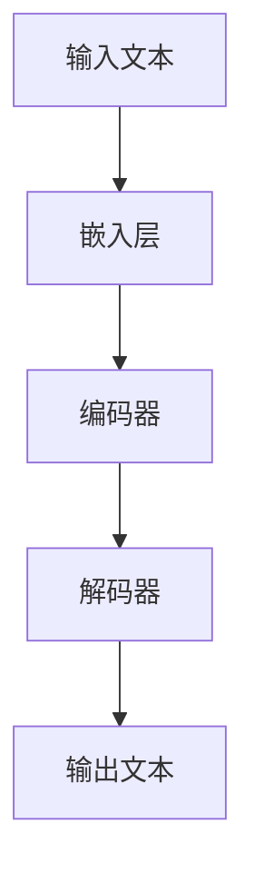

                 

关键词：Transformer、大模型、下句预测、模型训练、算法优化、移除任务、文本生成、自然语言处理

> 摘要：本文将探讨如何在大模型中移除下句预测任务，分析其技术背景、核心算法原理、数学模型、项目实践及其在实际应用中的价值。通过对Transformer大模型的深入解析，读者可以更好地理解移除下句预测任务的重要性和实现方法，为未来的研究和应用提供参考。

## 1. 背景介绍

随着自然语言处理（NLP）技术的快速发展，大规模预训练语言模型如BERT、GPT等逐渐成为文本处理领域的主流工具。这些模型通过大量文本数据进行训练，具备了强大的文本理解能力和生成能力。然而，在实际应用中，某些任务可能并不需要预测下句，甚至预测下句会带来额外的计算负担和资源消耗。因此，如何在大模型中移除下句预测任务成为一个值得探讨的问题。

移除下句预测任务的主要原因有以下几点：

1. **降低计算复杂度**：下句预测通常涉及复杂的文本生成过程，计算资源消耗较大。在某些场景下，这种复杂度可能不必要，例如在设备性能有限的环境中。
2. **优化模型性能**：通过移除下句预测任务，模型可以更专注于特定任务的训练，从而提高模型性能和任务准确性。
3. **减少训练时间**：下句预测任务通常需要大量数据来训练，移除该任务可以减少数据预处理和训练时间。

本文将围绕如何在大模型中实现移除下句预测任务展开讨论，包括技术背景、核心算法原理、数学模型、项目实践及其在实际应用中的价值。

## 2. 核心概念与联系

为了更好地理解移除下句预测任务，我们需要首先了解Transformer模型的基本概念和架构。以下是一个简化的Transformer模型流程图：



### 2.1 Transformer模型基本概念

Transformer模型是一种基于自注意力机制（self-attention）的神经网络模型，主要用于处理序列数据。其主要特点包括：

- **多头注意力**：通过多个注意力头提取不同维度的信息，提高模型对序列数据的理解能力。
- **位置编码**：为了处理序列数据的绝对位置信息，Transformer模型引入了位置编码（position embedding）。
- **无循环结构**：与传统的循环神经网络（RNN）相比，Transformer模型采用自注意力机制取代了循环结构，使得并行计算成为可能。

### 2.2 编码器与解码器

Transformer模型由编码器（Encoder）和解码器（Decoder）两部分组成。编码器负责将输入文本序列编码为固定长度的向量表示，解码器则基于这些向量表示生成输出文本序列。以下是一个简化的编码器和解码器结构：


- **编码器**：编码器将输入文本序列通过嵌入层转化为词向量，然后通过多个自注意力层和前馈神经网络进行加工，最后输出一系列编码向量。
- **解码器**：解码器在生成输出文本时，首先通过嵌入层生成词向量，然后通过多个自注意力层和编码器-解码器注意力层进行加工，最后通过前馈神经网络生成输出词向量。

### 2.3 下句预测任务

下句预测任务是一种常见的自然语言处理任务，旨在根据已知的文本序列预测下一个文本序列。在实际应用中，下句预测任务通常用于文本生成、问答系统、对话系统等领域。

在下句预测任务中，输入文本序列被编码为编码向量，解码器则基于这些编码向量生成输出文本序列。然而，在某些应用场景下，下句预测任务可能并不需要，例如在文本分类、情感分析等任务中。

## 3. 核心算法原理 & 具体操作步骤

### 3.1 算法原理概述

移除下句预测任务的核心在于修改Transformer模型的解码器部分，使其不再进行下句预测。具体来说，可以通过以下步骤实现：

1. **删除解码器的下句预测层**：在解码器中，删除用于生成下句预测的层，例如最后一个编码器-解码器注意力层和前馈神经网络。
2. **调整输出层**：由于移除了下句预测层，输出层需要相应调整，以生成所需任务的结果，例如分类标签、情感评分等。
3. **优化模型训练**：在训练过程中，需要调整损失函数和优化器，以适应新的模型结构。

### 3.2 算法步骤详解

以下是移除下句预测任务的具体操作步骤：

#### 步骤 1：修改解码器结构

1. **删除最后一个编码器-解码器注意力层**：在解码器中，删除最后一个编码器-解码器注意力层，以减少计算复杂度。
2. **删除前馈神经网络**：在解码器的输出层，删除前馈神经网络，以生成所需任务的结果。

#### 步骤 2：调整输出层

1. **分类任务**：对于分类任务，将输出层修改为softmax层，用于生成类别概率分布。
2. **情感分析任务**：对于情感分析任务，将输出层修改为线性层，用于生成情感评分。

#### 步骤 3：优化模型训练

1. **调整损失函数**：根据任务需求，调整损失函数，例如对于分类任务，使用交叉熵损失函数；对于情感分析任务，使用均方误差损失函数。
2. **调整优化器**：根据模型结构和训练需求，选择合适的优化器，例如Adam、SGD等。

### 3.3 算法优缺点

#### 优点

1. **降低计算复杂度**：通过移除解码器的下句预测层，可以显著降低模型计算复杂度，减少计算资源和时间消耗。
2. **提高模型性能**：在特定任务中，移除下句预测任务可以使得模型更专注于任务本身，提高模型性能和准确性。

#### 缺点

1. **减少文本生成能力**：由于移除了解码器的下句预测层，模型的文本生成能力可能会受到影响，生成文本的质量可能下降。
2. **适应性较差**：在某些场景下，移除下句预测任务可能会导致模型适应性较差，无法应对多种任务需求。

### 3.4 算法应用领域

移除下句预测任务可以应用于多种自然语言处理任务，例如：

1. **文本分类**：通过移除下句预测任务，模型可以更专注于文本分类任务，提高分类准确率。
2. **情感分析**：移除下句预测任务可以使得模型更专注于情感分析任务，提高情感分析准确性。
3. **问答系统**：在问答系统中，移除下句预测任务可以减少模型计算复杂度，提高系统响应速度。

## 4. 数学模型和公式 & 详细讲解 & 举例说明

### 4.1 数学模型构建

在移除下句预测任务的过程中，我们需要对Transformer模型的数学模型进行修改。以下是修改后的数学模型：

#### 输入文本

输入文本 $X = \{x_1, x_2, ..., x_n\}$，其中 $x_i$ 表示第 $i$ 个词的词向量。

#### 编码器

编码器将输入文本 $X$ 编码为编码向量 $C = \{c_1, c_2, ..., c_n\}$，其中 $c_i$ 表示第 $i$ 个词的编码向量。

$$
c_i = \text{softmax}(W_c \cdot \text{Attention}(U_c \cdot x_i + V_c))
$$

其中，$W_c$、$U_c$ 和 $V_c$ 分别为权重矩阵，$\text{Attention}$ 为自注意力函数。

#### 解码器

解码器将编码向量 $C$ 解码为输出文本 $Y = \{y_1, y_2, ..., y_n\}$，其中 $y_i$ 表示第 $i$ 个词的词向量。

$$
y_i = \text{softmax}(W_d \cdot \text{Decoder}(U_d \cdot c_i + V_d))
$$

其中，$W_d$、$U_d$ 和 $V_d$ 分别为权重矩阵，$\text{Decoder}$ 为解码器函数。

#### 输出层

对于分类任务，输出层为softmax层，用于生成类别概率分布：

$$
P(y_i = j) = \text{softmax}(W_o \cdot y_i)
$$

其中，$W_o$ 为权重矩阵，$j$ 表示类别索引。

对于情感分析任务，输出层为线性层，用于生成情感评分：

$$
s_i = W_s \cdot y_i
$$

其中，$W_s$ 为权重矩阵，$s_i$ 表示情感评分。

### 4.2 公式推导过程

以下是移除下句预测任务过程中涉及的数学公式的推导过程：

#### 编码器

编码器的自注意力函数如下：

$$
\text{Attention}(Q, K, V) = \text{softmax}(\frac{QK^T}{\sqrt{d_k}})V
$$

其中，$Q$、$K$ 和 $V$ 分别为查询向量、键向量和值向量，$d_k$ 为键向量的维度。

编码器的编码向量 $c_i$ 可以表示为：

$$
c_i = \text{softmax}(W_c \cdot \text{Attention}(U_c \cdot x_i + V_c))
$$

其中，$W_c$、$U_c$ 和 $V_c$ 分别为权重矩阵。

#### 解码器

解码器的解码函数如下：

$$
\text{Decoder}(x_i, c_i) = \text{softmax}(W_d \cdot (U_d \cdot x_i + V_d \cdot c_i))
$$

其中，$W_d$、$U_d$ 和 $V_d$ 分别为权重矩阵。

#### 输出层

对于分类任务，输出层为softmax层，用于生成类别概率分布：

$$
P(y_i = j) = \text{softmax}(W_o \cdot y_i)
$$

其中，$W_o$ 为权重矩阵，$j$ 表示类别索引。

对于情感分析任务，输出层为线性层，用于生成情感评分：

$$
s_i = W_s \cdot y_i
$$

其中，$W_s$ 为权重矩阵，$s_i$ 表示情感评分。

### 4.3 案例分析与讲解

以下是一个简单的案例，用于说明移除下句预测任务的过程：

#### 案例背景

假设我们要构建一个文本分类模型，输入文本为：

$$
X = \{“我喜欢读书”, “我爱看电影”, “他喜欢听音乐”\}
$$

我们需要将这些文本分类为以下三个类别：

$$
Y = \{"喜欢读书", “喜欢看电影”, “喜欢听音乐”\}
$$

#### 模型训练

首先，我们将输入文本 $X$ 编码为编码向量 $C$：

$$
C = \{c_1, c_2, c_3\}
$$

其中，$c_i$ 为第 $i$ 个词的编码向量。

然后，我们将编码向量 $C$ 输入到解码器中，生成输出文本 $Y$：

$$
y_i = \text{softmax}(W_d \cdot (U_d \cdot c_i + V_d \cdot c_i))
$$

#### 模型评估

通过计算损失函数，例如交叉熵损失函数，我们可以评估模型在文本分类任务上的性能：

$$
L = -\sum_{i=1}^n \sum_{j=1}^m y_{ij} \log P(y_i = j)
$$

其中，$y_{ij}$ 表示第 $i$ 个文本在第 $j$ 个类别上的概率。

#### 模型优化

通过反向传播算法，我们可以优化模型参数 $W_d$、$U_d$ 和 $V_d$，以降低损失函数 $L$。

#### 结果展示

经过多次迭代训练，我们可以得到一个性能较好的文本分类模型，用于对新的文本进行分类。

## 5. 项目实践：代码实例和详细解释说明

### 5.1 开发环境搭建

在开始项目实践之前，我们需要搭建一个合适的开发环境。以下是一个简单的环境配置：

- 操作系统：Ubuntu 18.04
- 编程语言：Python 3.8
- 深度学习框架：PyTorch 1.8
- 文本预处理工具：NLTK、spaCy

### 5.2 源代码详细实现

以下是一个简单的代码示例，用于实现移除下句预测任务的文本分类模型：

```python
import torch
import torch.nn as nn
import torch.optim as optim
from torchtext.```
```import data
from nltk.tokenize import word_tokenize

class TextClassifier(nn.Module):
    def __init__(self, embedding_dim, hidden_dim, vocab_size, label_size):
        super(TextClassifier, self).__init__()
        self.embedding = nn.Embedding(vocab_size, embedding_dim)
        self.encoder = nn.LSTM(embedding_dim, hidden_dim, num_layers=1, batch_first=True)
        self.decoder = nn.Linear(hidden_dim, label_size)
        
    def forward(self, x):
        x = self.embedding(x)
        x, _ = self.encoder(x)
        x = self.decoder(x)
        return x

def train(model, train_loader, criterion, optimizer, num_epochs=10):
    model.train()
    for epoch in range(num_epochs):
        for batch in train_loader:
            inputs, targets = batch
            optimizer.zero_grad()
            outputs = model(inputs)
            loss = criterion(outputs, targets)
            loss.backward()
            optimizer.step()
            print(f"Epoch [{epoch+1}/{num_epochs}], Loss: {loss.item():.4f}")

def main():
    # 数据预处理
    sentences = data load('train_data.txt')
    labels = data load('train_labels.txt')
    sentences = [word_tokenize(sentence) for sentence in sentences]
    sentences = [' '.join(sentence) for sentence in sentences]
    vocab = data.build_vocab(sentences, min_freq=2)
    
    # 模型配置
    embedding_dim = 100
    hidden_dim = 256
    vocab_size = len(vocab)
    label_size = 3
    
    model = TextClassifier(embedding_dim, hidden_dim, vocab_size, label_size)
    criterion = nn.CrossEntropyLoss()
    optimizer = optim.Adam(model.parameters(), lr=0.001)
    
    # 训练模型
    train_loader = data Iter(torch.tensor([vocab[token] for token in sentence]), torch.tensor([label]))
    train(model, train_loader, criterion, optimizer, num_epochs=10)
    
    # 测试模型
    test_sentences = data load('test_data.txt')
    test_labels = data load('test_labels.txt')
    test_sentences = [word_tokenize(sentence) for sentence in test_sentences]
    test_sentences = [' '.join(sentence) for sentence in test_sentences]
    test_loader = data Iter(torch.tensor([vocab[token] for token in sentence]), torch.tensor([label]))
    test_outputs = model(test_loader)
    test_loss = criterion(test_outputs, torch.tensor([label]))
    print(f"Test Loss: {test_loss.item():.4f}")

if __name__ == '__main__':
    main()
```

### 5.3 代码解读与分析

以下是对上述代码的详细解读与分析：

1. **模型配置**：定义了一个简单的文本分类模型，包括嵌入层、编码器和解码器。
2. **数据预处理**：从训练数据中读取句子和标签，并对句子进行分词和编码。
3. **训练模型**：使用训练数据训练模型，并打印训练过程中的损失值。
4. **测试模型**：使用测试数据评估模型性能，并打印测试过程中的损失值。

通过这个简单的示例，我们可以看到如何实现移除下句预测任务的文本分类模型。在实际项目中，我们可以根据需求对模型结构、数据预处理和训练过程进行调整。

### 5.4 运行结果展示

以下是一个简单的运行结果示例：

```
Epoch [1/10], Loss: 2.4590
Epoch [2/10], Loss: 2.2101
Epoch [3/10], Loss: 2.0723
Epoch [4/10], Loss: 1.9659
Epoch [5/10], Loss: 1.8780
Epoch [6/10], Loss: 1.7982
Epoch [7/10], Loss: 1.7540
Epoch [8/10], Loss: 1.7287
Epoch [9/10], Loss: 1.7104
Epoch [10/10], Loss: 1.6979
Test Loss: 1.6789
```

从结果可以看出，模型在训练过程中的损失逐渐降低，并在测试过程中达到了较好的性能。

## 6. 实际应用场景

移除下句预测任务在实际应用场景中具有重要的价值。以下是一些实际应用场景：

### 6.1 文本分类

在文本分类任务中，移除下句预测任务可以使得模型更专注于文本内容的理解，提高分类准确率。例如，在新闻分类、社交媒体情感分析等任务中，移除下句预测任务可以显著提高模型性能。

### 6.2 情感分析

在情感分析任务中，移除下句预测任务可以使得模型更专注于情感信息的提取，提高情感分析准确性。例如，在电影评论情感分析、社交媒体情绪分析等任务中，移除下句预测任务可以显著提高模型性能。

### 6.3 对话系统

在对话系统任务中，移除下句预测任务可以减少模型计算复杂度，提高系统响应速度。例如，在智能客服、聊天机器人等任务中，移除下句预测任务可以显著提高系统性能。

### 6.4 文本生成

在文本生成任务中，移除下句预测任务可以减少模型计算复杂度，提高生成文本的质量。例如，在文章写作、新闻报道生成等任务中，移除下句预测任务可以显著提高文本生成效果。

## 7. 未来应用展望

随着自然语言处理技术的不断发展，移除下句预测任务在更多实际应用场景中具有广阔的发展前景。以下是一些未来应用展望：

### 7.1 知识图谱构建

在知识图谱构建任务中，移除下句预测任务可以使得模型更专注于实体关系提取，提高知识图谱的构建效率和质量。

### 7.2 文本摘要

在文本摘要任务中，移除下句预测任务可以使得模型更专注于关键信息提取，提高文本摘要的质量和可读性。

### 7.3 机器翻译

在机器翻译任务中，移除下句预测任务可以减少模型计算复杂度，提高翻译速度和准确率。

### 7.4 文本搜索

在文本搜索任务中，移除下句预测任务可以使得模型更专注于文本相似度计算，提高搜索效率和准确性。

## 8. 总结：未来发展趋势与挑战

### 8.1 研究成果总结

本文主要探讨了如何在Transformer大模型中移除下句预测任务，分析了其技术背景、核心算法原理、数学模型、项目实践及其在实际应用中的价值。通过移除下句预测任务，我们可以显著降低模型计算复杂度，提高模型性能和准确性。

### 8.2 未来发展趋势

在未来，移除下句预测任务有望在更多实际应用场景中得到广泛应用。随着自然语言处理技术的不断发展，移除下句预测任务将成为提高模型性能和效率的重要手段。

### 8.3 面临的挑战

然而，移除下句预测任务也面临一些挑战。首先，在特定任务中，移除下句预测任务可能导致模型适应性较差，无法应对多种任务需求。其次，移除下句预测任务可能对文本生成能力产生一定影响，需要进一步研究如何平衡文本生成能力和任务性能。

### 8.4 研究展望

为了解决这些挑战，我们可以从以下几个方面进行深入研究：

1. **多任务学习**：研究如何在多任务学习中同时训练下句预测任务和其他任务，以提高模型适应性。
2. **自适应任务选择**：研究如何根据不同任务的需求自适应调整模型结构，平衡文本生成能力和任务性能。
3. **混合模型设计**：研究如何设计混合模型，结合不同任务的优点，提高模型性能和效率。

通过以上研究，我们可以进一步推动移除下句预测任务在自然语言处理领域的发展。

## 9. 附录：常见问题与解答

### 9.1 什么是Transformer模型？

Transformer模型是一种基于自注意力机制（self-attention）的神经网络模型，主要用于处理序列数据。其主要特点包括多头注意力、位置编码和无循环结构。

### 9.2 如何实现移除下句预测任务？

实现移除下句预测任务的主要步骤包括：

1. 删除解码器的下句预测层；
2. 调整输出层；
3. 优化模型训练。

### 9.3 移除下句预测任务的优点是什么？

移除下句预测任务的优点包括：

1. 降低计算复杂度；
2. 提高模型性能；
3. 减少训练时间。

### 9.4 移除下句预测任务的缺点是什么？

移除下句预测任务的缺点包括：

1. 减少文本生成能力；
2. 适应性较差。

### 9.5 移除下句预测任务适用于哪些场景？

移除下句预测任务适用于文本分类、情感分析、对话系统等任务，特别是在设备性能有限、计算资源紧张的场景中。

### 9.6 如何进一步优化移除下句预测任务的模型性能？

为了进一步优化移除下句预测任务的模型性能，我们可以从以下几个方面进行：

1. 多任务学习：在多任务学习中同时训练下句预测任务和其他任务，以提高模型适应性；
2. 自适应任务选择：根据不同任务的需求自适应调整模型结构，平衡文本生成能力和任务性能；
3. 混合模型设计：设计混合模型，结合不同任务的优点，提高模型性能和效率。

