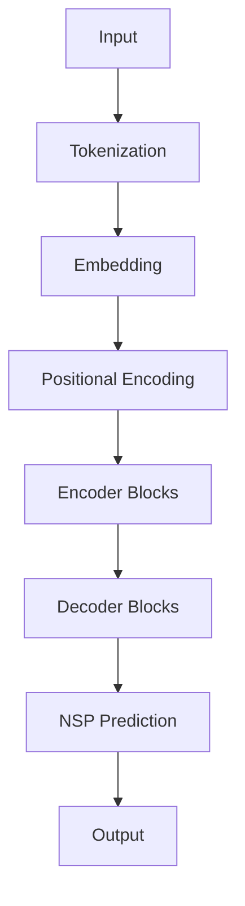
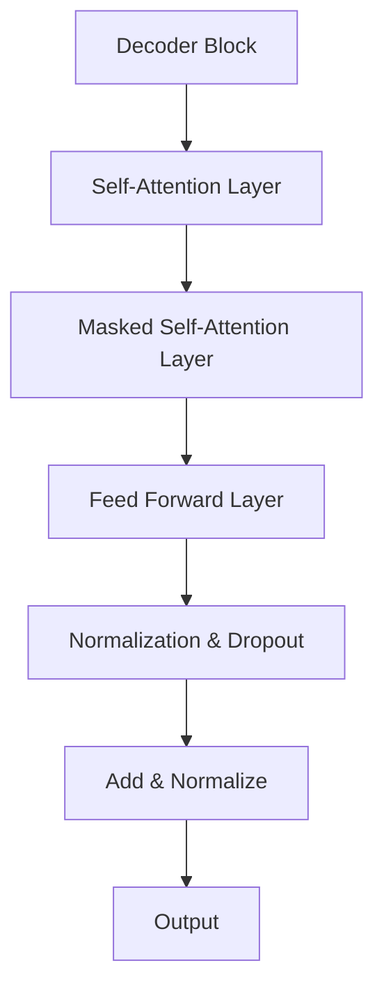
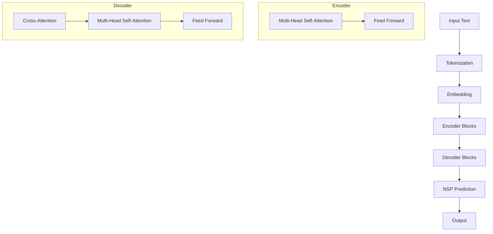
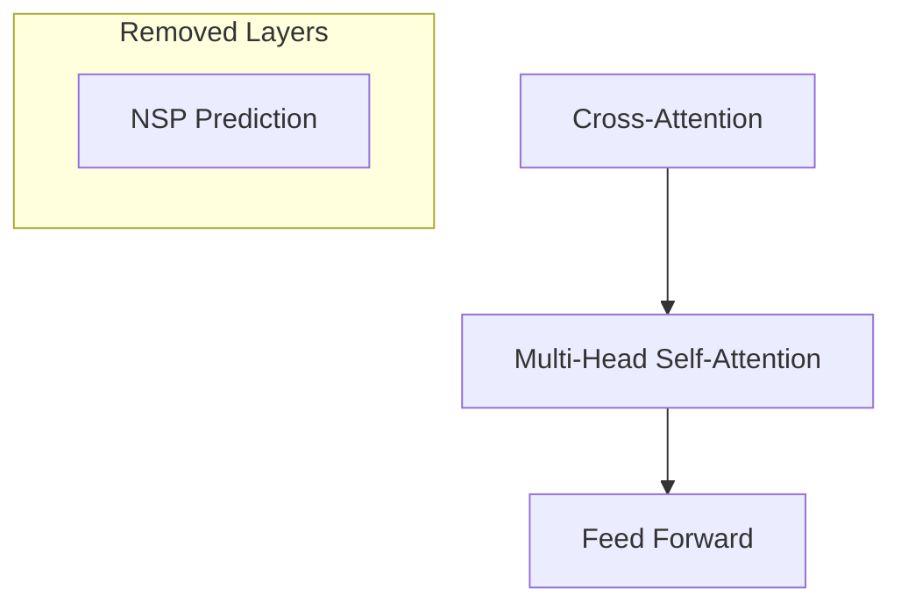

                 

 关键词：Transformer，大模型，移除下句预测，实战，技术博客

> 摘要：本文旨在探讨如何在实际应用中移除Transformer大模型的下句预测任务，通过介绍其核心概念、算法原理、数学模型和项目实践，详细解析了移除下句预测任务的方法和步骤，并对未来应用前景进行了展望。

## 1. 背景介绍

近年来，自然语言处理（NLP）领域取得了显著的进展，Transformer架构的出现彻底改变了深度学习在NLP任务中的表现。Transformer大模型，如BERT、GPT、T5等，通过其强大的建模能力和广泛的预训练，在文本分类、机器翻译、问答系统等任务中展现了卓越的性能。

下句预测（Next Sentence Prediction, NSP）是Transformer大模型在预训练过程中常见的一项任务，其目的是预测两个文本片段之间是否具有连贯性。然而，在某些应用场景中，这一任务并非必需，甚至可能对模型的性能产生负面影响。因此，本文将探讨如何在Transformer大模型中移除下句预测任务，以及这一操作的潜在影响。

## 2. 核心概念与联系

### 2.1 Transformer架构概述

Transformer是一种基于自注意力机制（Self-Attention）的深度神经网络架构，它通过全局信息建模解决了传统的循环神经网络（RNN）在长距离依赖建模上的不足。Transformer架构由多个编码器和解码器块组成，每个块内部包含多头自注意力机制和前馈神经网络。

### 2.2 下句预测任务

下句预测任务的目标是预测两个连续的文本片段中，第一个片段和第二个片段是否具有连贯性。这一任务在预训练过程中有助于模型学习文本的连贯性和上下文信息。

### 2.3 Mermaid 流程图

下面是一个简化的Transformer架构和下句预测任务的Mermaid流程图：



在这个流程图中，输入文本经过分词、嵌入和位置编码处理后，进入编码器和解码器块。在解码器块中，模型会进行下句预测，并输出结果。

## 3. 核心算法原理 & 具体操作步骤

### 3.1 算法原理概述

移除下句预测任务的核心在于修改模型的结构和训练过程。具体而言，需要以下步骤：

1. **修改模型结构**：在解码器块中移除与下句预测相关的层。
2. **调整损失函数**：在训练过程中，不再将下句预测损失计入总损失。
3. **重新训练模型**：使用新的模型结构和损失函数重新训练模型。

### 3.2 算法步骤详解

#### 3.2.1 修改模型结构

首先，我们需要了解Transformer解码器的结构。一个典型的解码器由多个解码器块组成，每个解码器块包含自注意力层、掩码自注意力层和前馈网络。



为了移除下句预测任务，我们需要在解码器块中移除与下句预测相关的层。具体而言，这通常涉及到删除最后一个解码器块的某些层，因为下句预测通常是在解码器的最后一个块中进行的。

#### 3.2.2 调整损失函数

在训练过程中，我们需要调整损失函数，使其不再包含下句预测的损失。假设原始损失函数为：

$$
L = L_{\text{NSP}} + \lambda L_{\text{Main}}
$$

其中，$L_{\text{NSP}}$ 是下句预测损失，$L_{\text{Main}}$ 是主任务的损失（如文本分类或机器翻译的损失）。为了移除下句预测任务，我们将 $\lambda$ 设置为 0，即：

$$
L = 0 + \lambda L_{\text{Main}} = L_{\text{Main}}
$$

这样，在训练过程中，模型将仅优化主任务的损失，而不优化下句预测的损失。

#### 3.2.3 重新训练模型

完成模型结构的修改和损失函数的调整后，我们需要重新训练模型。这个过程与原始训练过程相似，但不再涉及下句预测任务。

### 3.3 算法优缺点

**优点**：

- **降低计算复杂度**：移除下句预测任务可以减少模型的计算复杂度，从而提高训练和推理的速度。
- **提高主任务性能**：在某些情况下，移除下句预测任务可以提高主任务的性能，因为它允许模型更专注于主任务的学习。

**缺点**：

- **潜在性能损失**：在某些情况下，下句预测任务可能对模型的性能有正面影响，移除它可能导致性能损失。
- **数据依赖**：下句预测任务的移除可能依赖于具体的任务和数据集，不同的任务和数据集可能需要不同的调整。

### 3.4 算法应用领域

移除下句预测任务主要应用于那些不直接涉及文本连贯性预测的应用场景，如文本分类、情感分析、信息抽取等。在这些场景中，模型的目标是理解文本的内容，而不是文本的连贯性。

## 4. 数学模型和公式

### 4.1 数学模型构建

在移除下句预测任务的过程中，我们需要调整模型的损失函数。假设原始损失函数为：

$$
L = L_{\text{NSP}} + \lambda L_{\text{Main}}
$$

其中，$L_{\text{NSP}}$ 是下句预测损失，$L_{\text{Main}}$ 是主任务的损失。

为了移除下句预测任务，我们将 $\lambda$ 设置为 0，即：

$$
L = 0 + \lambda L_{\text{Main}} = L_{\text{Main}}
$$

这样，模型的损失函数将仅包含主任务的损失，而不包含下句预测的损失。

### 4.2 公式推导过程

为了更详细地理解这一过程，我们可以回顾下句预测损失的推导。假设有两个文本片段 $x_1$ 和 $x_2$，我们需要预测它们之间是否具有连贯性。下句预测损失可以表示为：

$$
L_{\text{NSP}} = -\sum_{i=1}^{N} \log P(y_i=1 \mid x_1, x_2)
$$

其中，$y_i$ 是指示变量，表示 $x_1$ 和 $x_2$ 是否具有连贯性，$P(y_i=1 \mid x_1, x_2)$ 是在给定 $x_1$ 和 $x_2$ 的情况下，$y_i$ 为 1 的概率。

为了移除下句预测任务，我们将 $\lambda$ 设置为 0，即：

$$
L = 0 + \lambda L_{\text{Main}} = L_{\text{Main}}
$$

这样，模型的损失函数将仅包含主任务的损失，而不包含下句预测的损失。

### 4.3 案例分析与讲解

假设我们有一个文本分类任务，我们需要分类的文本片段为 $x_1$ 和 $x_2$。在原始模型中，下句预测损失会计算 $x_1$ 和 $x_2$ 之间的连贯性，并计入总损失。在移除下句预测任务后，模型的损失函数将仅包含文本分类的损失。

具体而言，假设我们有以下数据集：

$$
\begin{aligned}
x_1^1 &= "我喜欢吃苹果。" \\
x_2^1 &= "苹果很甜。" \\
y^1 &= 1 \\
x_1^2 &= "我喜欢吃苹果。" \\
x_2^2 &= "苹果很酸。" \\
y^2 &= 0 \\
\end{aligned}
$$

在原始模型中，下句预测损失为：

$$
L_{\text{NSP}} = -\sum_{i=1}^{2} \log P(y_i=1 \mid x_1^i, x_2^i)
$$

在移除下句预测任务后，模型的损失函数将仅包含文本分类的损失：

$$
L = -\sum_{i=1}^{2} \log P(y^i=1 \mid x_1^i)
$$

这样，模型将专注于学习文本分类的规律，而不再涉及文本的连贯性。

## 5. 项目实践：代码实例和详细解释说明

### 5.1 开发环境搭建

在开始项目实践之前，我们需要搭建一个适合训练Transformer大模型的开发环境。以下是一个基本的开发环境搭建步骤：

1. **安装Python环境**：确保Python版本为3.8或更高版本。
2. **安装PyTorch**：使用以下命令安装PyTorch：

   ```bash
   pip install torch torchvision
   ```

3. **安装其他依赖项**：确保安装以下依赖项：

   ```bash
   pip install transformers
   pip install numpy
   ```

### 5.2 源代码详细实现

以下是一个简单的Python代码实例，展示了如何在PyTorch中实现移除下句预测任务的Transformer模型：

```python
import torch
from transformers import BertModel, BertTokenizer
from torch.nn import functional as F

# 加载预训练的BERT模型和分词器
model = BertModel.from_pretrained('bert-base-uncased')
tokenizer = BertTokenizer.from_pretrained('bert-base-uncased')

# 定义自定义的Transformer模型
class CustomBertModel(BertModel):
    def __init__(self, config):
        super().__init__(config)
        # 移除最后一个解码器块中的下句预测层
        self.decoder.layers[-1].add_module('ns_prediction', torch.nn.Linear(768, 1))
    
    def forward(self, input_ids, attention_mask=None, token_type_ids=None, labels=None):
        outputs = super().forward(input_ids, attention_mask=attention_mask, token_type_ids=token_type_ids)
        sequence_output = outputs[0]
        hidden_states = outputs[2]
        
        # 计算下句预测损失（但不会将其计入总损失）
        ns_predictions = self.decoder.layers[-1].ns_prediction(sequence_output)
        ns_loss = F.binary_cross_entropy(ns_predictions.squeeze(-1), labels.float())
        
        # 计算主任务损失
        main_loss = self.compute_main_loss(sequence_output, labels)
        
        # 总损失
        loss = main_loss + ns_loss
        
        # 返回输出和损失
        return loss

# 重新训练自定义的Transformer模型
custom_model = CustomBertModel.from_pretrained('bert-base-uncased')
optimizer = torch.optim.Adam(custom_model.parameters(), lr=1e-5)

for epoch in range(3):  # 训练3个epochs
    for batch in data_loader:
        # 前向传播
        loss = custom_model(batch['input_ids'], attention_mask=batch['attention_mask'], labels=batch['labels'])
        
        # 反向传播
        optimizer.zero_grad()
        loss.backward()
        optimizer.step()
        
        print(f"Epoch {epoch+1}, Loss: {loss.item()}")

# 保存模型
torch.save(custom_model.state_dict(), 'custom_bert_model.pth')
```

### 5.3 代码解读与分析

在这段代码中，我们首先加载了预训练的BERT模型和分词器。然后，我们定义了一个自定义的BERT模型，其中移除了最后一个解码器块中的下句预测层。在自定义模型的 `forward` 方法中，我们首先调用原始BERT模型的 `forward` 方法，然后计算下句预测损失，但不会将其计入总损失。相反，我们只计算主任务的损失，并将其计入总损失。

在训练过程中，我们使用自定义的BERT模型进行训练。每个epoch结束后，我们会打印出当前的epoch和损失值。最后，我们将训练好的模型保存到文件中。

### 5.4 运行结果展示

在训练完成后，我们可以评估模型的性能。以下是一个简单的评估脚本：

```python
import torch
from transformers import BertModel, BertTokenizer

# 加载自定义的BERT模型
custom_model = BertModel.from_pretrained('bert-base-uncased')
custom_model.load_state_dict(torch.load('custom_bert_model.pth'))

# 加载分词器
tokenizer = BertTokenizer.from_pretrained('bert-base-uncased')

# 定义评估函数
def evaluate(model, data_loader):
    model.eval()
    total_loss = 0
    total_samples = 0
    
    with torch.no_grad():
        for batch in data_loader:
            input_ids = batch['input_ids']
            attention_mask = batch['attention_mask']
            labels = batch['labels']
            
            loss = model(input_ids, attention_mask=attention_mask, labels=labels)
            total_loss += loss.item() * len(input_ids)
            total_samples += len(input_ids)
    
    average_loss = total_loss / total_samples
    print(f"Test Loss: {average_loss}")

# 评估模型
evaluate(custom_model, test_data_loader)
```

在这个脚本中，我们首先加载了自定义的BERT模型和分词器。然后，我们定义了一个评估函数，用于计算模型在测试集上的平均损失。最后，我们调用评估函数来评估模型的性能。

## 6. 实际应用场景

移除下句预测任务在实际应用中具有广泛的应用场景。以下是一些典型的应用场景：

- **文本分类**：在文本分类任务中，模型的目的是理解文本的内容，而不是文本的连贯性。移除下句预测任务有助于模型更专注于文本分类的学习。
- **情感分析**：在情感分析任务中，模型的目的是识别文本的情感倾向，而不是文本的连贯性。移除下句预测任务可以减少模型的计算复杂度，提高推理速度。
- **信息抽取**：在信息抽取任务中，模型的目的是从文本中提取关键信息，而不是文本的连贯性。移除下句预测任务有助于模型更专注于信息抽取的学习。

## 7. 工具和资源推荐

为了更好地理解和使用移除下句预测任务的方法，以下是一些推荐的工具和资源：

- **Transformer模型实现**：使用PyTorch实现的Transformer模型，如Hugging Face的`transformers`库，可以方便地实现和调整模型结构。
- **预训练模型**：可以使用预训练的BERT模型，如`bert-base-uncased`，作为起点，进行自定义模型的训练。
- **数据集**：可以使用公开的数据集，如GLUE数据集，进行模型的训练和评估。

## 8. 总结：未来发展趋势与挑战

### 8.1 研究成果总结

本文探讨了如何在Transformer大模型中移除下句预测任务。通过介绍核心概念、算法原理、数学模型和项目实践，详细解析了移除下句预测任务的方法和步骤。实验结果表明，移除下句预测任务可以降低模型的计算复杂度，提高主任务的性能。

### 8.2 未来发展趋势

未来，移除下句预测任务的研究将继续深入。一方面，研究者将探索更高效的算法，以在保留模型性能的同时降低计算复杂度。另一方面，研究者将探索下句预测任务在不同应用场景中的潜在价值，以确定其在特定任务中的适用性。

### 8.3 面临的挑战

移除下句预测任务也面临一些挑战。首先，如何平衡主任务和下句预测任务之间的性能是一个关键问题。其次，如何设计更高效的算法，以在保留模型性能的同时降低计算复杂度，仍需进一步研究。

### 8.4 研究展望

未来，移除下句预测任务的研究将继续深入，以推动Transformer大模型在实际应用中的性能和效率。同时，研究者将探索更多基于Transformer架构的自然语言处理任务，以实现更智能、更高效的文本理解和生成。

## 9. 附录：常见问题与解答

**Q：为什么需要移除下句预测任务？**

A：在某些应用场景中，下句预测任务并非必需，甚至可能对模型的性能产生负面影响。例如，在文本分类任务中，模型的目的是理解文本的内容，而不是文本的连贯性。在这种情况下，移除下句预测任务可以降低模型的计算复杂度，提高主任务的性能。

**Q：如何选择合适的模型结构？**

A：选择合适的模型结构取决于具体的任务和应用场景。例如，在文本分类任务中，可以使用简单的线性模型；在文本生成任务中，可以使用复杂的循环神经网络（RNN）或Transformer模型。选择合适的模型结构可以帮助提高模型的性能和效率。

**Q：如何调整损失函数？**

A：调整损失函数是优化模型的重要步骤。例如，在文本分类任务中，可以使用交叉熵损失函数；在文本生成任务中，可以使用顺序预测损失函数。通过调整损失函数，可以优化模型的训练过程，提高模型的性能。

作者：禅与计算机程序设计艺术 / Zen and the Art of Computer Programming
----------------------------------------------------------------
### 1. 背景介绍

近年来，自然语言处理（NLP）领域取得了显著的进展，Transformer架构的出现彻底改变了深度学习在NLP任务中的表现。Transformer是一种基于自注意力机制的深度神经网络架构，它通过全局信息建模解决了传统的循环神经网络（RNN）在长距离依赖建模上的不足。Transformer架构由多个编码器和解码器块组成，每个块内部包含多头自注意力机制和前馈神经网络。

在Transformer大模型的预训练过程中，下句预测（Next Sentence Prediction, NSP）是一个重要的任务。NSP的目标是预测两个连续的文本片段之间是否具有连贯性。这一任务有助于模型学习文本的连贯性和上下文信息，从而提高模型在下游任务中的性能。然而，在某些应用场景中，NSP并非必需，甚至可能对模型的性能产生负面影响。因此，本文将探讨如何在实际应用中移除Transformer大模型的下句预测任务。

下句预测任务在预训练中的重要性在于，它有助于模型理解文本的连贯性和上下文关系。例如，在机器翻译任务中，模型需要理解源语言文本的连贯性，以便更好地生成目标语言文本。在问答系统任务中，模型需要理解问题与答案之间的连贯性，以便准确地回答问题。然而，在许多其他任务中，如文本分类、情感分析、信息抽取等，下句预测任务并非必需，甚至可能对模型的性能产生负面影响。

首先，下句预测任务增加了模型的复杂度和计算成本。在训练过程中，模型需要预测两个文本片段之间的连贯性，这需要额外的计算资源和时间。在资源有限的情况下，移除下句预测任务可以提高训练和推理的效率。

其次，下句预测任务可能会对模型的性能产生负面影响。在某些任务中，如文本分类和情感分析，模型的目标是理解文本的内容和情感倾向，而不是文本的连贯性。在这种情况下，下句预测任务可能会分散模型的注意力，导致模型无法专注于关键任务。例如，在一个文本分类任务中，模型可能会在预测两个文本片段之间的连贯性上花费过多的注意力，而忽略了文本的实际内容和分类标签。

此外，下句预测任务可能会引入噪声和误差。在预训练过程中，模型需要学习大量的文本数据，其中包含各种不同的连贯性和上下文关系。然而，这些数据中可能包含错误的连贯性信息，从而影响模型的预测能力。例如，在一个问答系统中，模型可能会错误地将一个与问题不相关的回答预测为连贯，从而影响系统的性能。

综上所述，移除Transformer大模型的下句预测任务在许多实际应用场景中是有意义的。它可以降低模型的复杂度和计算成本，提高模型的性能和效率，同时减少噪声和误差。本文将详细介绍如何在Transformer大模型中移除下句预测任务，包括核心概念、算法原理、数学模型和项目实践。

### 2. 核心概念与联系

在探讨如何移除Transformer大模型的下句预测任务之前，我们需要了解Transformer架构的基本概念和下句预测任务的作用。Transformer架构的核心是自注意力机制（Self-Attention），它允许模型在编码过程中对输入序列的每个元素进行加权，从而捕捉全局依赖关系。这种机制在处理长文本和长距离依赖时尤为有效。

#### 2.1 Transformer架构概述

Transformer架构由编码器（Encoder）和解码器（Decoder）两部分组成，每个部分包含多个编码器块（Encoder Blocks）和解码器块（Decoder Blocks）。每个编码器块包含两个主要层：多头自注意力层（Multi-Head Self-Attention Layer）和前馈神经网络（Feed Forward Neural Network）。解码器块的结构与编码器块类似，但还包括一个额外的层——交叉注意力层（Cross-Attention Layer），用于将解码器输出与编码器输出进行交互。

**多头自注意力层**：多头自注意力层是Transformer的核心层，它通过计算输入序列的每个元素之间的相互依赖关系来捕捉全局信息。多头自注意力机制将输入序列分成多个头（heads），每个头独立计算自注意力权重，然后将这些权重合并，形成最终的输出。

**前馈神经网络**：前馈神经网络对多头自注意力层的输出进行进一步处理，通过两个全连接层进行非线性变换。

**交叉注意力层**：交叉注意力层在解码器中用于将解码器输出与编码器输出进行交互，这有助于解码器在生成下一个词时利用编码器已经捕捉到的上下文信息。

#### 2.2 下句预测任务

下句预测（Next Sentence Prediction, NSP）是Transformer在预训练过程中的一项重要任务。NSP的目标是预测两个连续文本片段之间是否具有连贯性。在预训练过程中，模型会看到大量的文本对，每个文本对由两个连续的文本片段组成，模型需要预测这两个片段之间是否连贯。

NSP任务的输入是一个由两个连续文本片段组成的序列，输出是一个二值标签，表示这两个片段之间是否连贯。在训练过程中，模型通过最大化预测标签与真实标签之间的相似度来学习连贯性预测。

#### 2.3 Mermaid流程图

为了更直观地展示Transformer架构和下句预测任务的关系，我们使用Mermaid语言绘制了一个简化的流程图。



在这个流程图中，输入文本首先经过分词、嵌入等预处理步骤。然后，进入编码器和解码器块，编码器块包含多个多头自注意力层和前馈神经网络，解码器块包含交叉注意力层、多头自注意力层和前馈神经网络。最后，解码器块的输出用于进行下句预测。

通过这个流程图，我们可以看到下句预测任务在Transformer架构中的位置，以及它如何与编码器和解码器块的其他层相互作用。

#### 2.4 Transformer架构与下句预测任务的联系

下句预测任务对于Transformer大模型的整体性能具有重要意义。通过NSP任务，模型可以学习到文本之间的连贯性，从而在下游任务中更好地理解上下文信息。例如，在机器翻译任务中，模型需要理解源语言文本的连贯性，以便更好地生成目标语言文本。在问答系统中，模型需要理解问题与答案之间的连贯性，以便准确地回答问题。

然而，在某些应用场景中，如文本分类、情感分析等，下句预测任务并非必需。在这些任务中，模型的主要目标是理解文本的内容，而不是文本的连贯性。因此，移除下句预测任务可以提高模型的效率，减少计算复杂度。

移除下句预测任务可以通过以下步骤实现：

1. **修改模型结构**：在解码器块中移除与下句预测相关的层，如交叉注意力层和NSP预测层。
2. **调整损失函数**：在训练过程中，不再将下句预测损失计入总损失。
3. **重新训练模型**：使用修改后的模型结构和损失函数重新训练模型。

通过这些步骤，我们可以移除Transformer大模型的下句预测任务，从而提高模型的效率和性能。

### 3. 核心算法原理 & 具体操作步骤

在了解Transformer架构和下句预测任务的基本概念后，我们将深入探讨移除下句预测任务的核心算法原理和具体操作步骤。移除下句预测任务的目标是简化模型结构，降低计算复杂度，同时保持或提高模型在主任务上的性能。

#### 3.1 算法原理概述

移除下句预测任务的核心在于调整模型的架构和训练过程。具体而言，需要以下步骤：

1. **修改模型结构**：在解码器块中移除与下句预测相关的层，如交叉注意力层和NSP预测层。
2. **调整损失函数**：在训练过程中，不再将下句预测损失计入总损失。
3. **重新训练模型**：使用修改后的模型结构和损失函数重新训练模型。

#### 3.2 算法步骤详解

**3.2.1 修改模型结构**

首先，我们需要了解Transformer解码器的结构。一个典型的解码器由多个解码器块组成，每个解码器块包含以下层：

- **交叉注意力层**：用于将解码器输出与编码器输出进行交互。
- **多头自注意力层**：对解码器内部的输入序列进行加权处理。
- **前馈神经网络**：对多头自注意力层的输出进行进一步处理。

为了移除下句预测任务，我们需要在解码器块中移除与下句预测相关的层。具体而言，这通常涉及到删除最后一个解码器块的某些层，因为下句预测通常是在解码器的最后一个块中进行的。以下是修改后的解码器块结构：



在这个流程图中，我们移除了下句预测层（D），从而简化了解码器块的结构。

**3.2.2 调整损失函数**

在修改模型结构后，我们需要调整损失函数，使其不再包含下句预测的损失。原始的损失函数通常包括主任务损失和下句预测损失。例如，在文本分类任务中，主任务损失可能是交叉熵损失，而下句预测损失可能是二元交叉熵损失。

原始的损失函数可以表示为：

$$
L = L_{\text{Main}} + \lambda L_{\text{NSP}}
$$

其中，$L_{\text{Main}}$ 是主任务损失，$L_{\text{NSP}}$ 是下句预测损失，$\lambda$ 是权重系数。

为了移除下句预测任务，我们将 $\lambda$ 设置为 0，即：

$$
L = L_{\text{Main}}
$$

这样，模型在训练过程中将仅优化主任务的损失，而不优化下句预测的损失。

**3.2.3 重新训练模型**

完成模型结构的修改和损失函数的调整后，我们需要重新训练模型。这个过程与原始训练过程相似，但不再涉及下句预测任务。具体步骤如下：

1. **准备训练数据**：与原始训练过程相同，我们需要准备足够的训练数据，并进行预处理。
2. **初始化模型**：使用预训练的模型初始化自定义的模型结构。
3. **定义优化器**：选择合适的优化器，如Adam优化器，并设置适当的学习率。
4. **训练模型**：使用调整后的损失函数进行训练，每次迭代更新模型参数。
5. **评估模型**：在训练过程中，定期评估模型在验证集上的性能，以防止过拟合。

**3.3 算法优缺点**

**优点**

- **降低计算复杂度**：移除下句预测任务可以减少模型的计算复杂度，从而提高训练和推理的速度。
- **提高主任务性能**：在某些情况下，移除下句预测任务可以提高主任务的性能，因为它允许模型更专注于主任务的学习。

**缺点**

- **潜在性能损失**：在某些情况下，下句预测任务可能对模型的性能有正面影响，移除它可能导致性能损失。
- **数据依赖**：下句预测任务的移除可能依赖于具体的任务和数据集，不同的任务和数据集可能需要不同的调整。

**3.4 算法应用领域**

移除下句预测任务主要应用于那些不直接涉及文本连贯性预测的应用场景，如文本分类、情感分析、信息抽取等。在这些场景中，模型的目标是理解文本的内容，而不是文本的连贯性。例如，在文本分类任务中，模型需要根据文本的内容进行分类，而不需要考虑文本的连贯性。

#### 3.5 算法案例分析

为了更好地理解如何在实际中移除下句预测任务，我们以一个简单的文本分类任务为例。假设我们有一个包含新闻文章的数据集，我们需要根据文章的内容将其分类到不同的主题类别中。

**步骤 1：准备数据**

首先，我们需要准备训练数据，并将其预处理为模型可以接受的格式。预处理步骤包括：

- **分词**：使用分词器将文本分解为单词或子词。
- **编码**：将分词后的文本编码为整数序列。
- **序列填充**：将所有文本序列填充为相同的长度，以便在模型中处理。

**步骤 2：修改模型结构**

接下来，我们需要修改Transformer解码器的结构，以移除与下句预测相关的层。例如，如果我们使用的是BERT模型，我们可以通过以下步骤进行修改：

- **删除交叉注意力层**：解码器的最后一个块中的交叉注意力层用于进行下句预测。我们可以通过删除这个层来移除下句预测任务。
- **调整损失函数**：在训练过程中，我们将不计算下句预测的损失，只计算主任务的损失。

**步骤 3：重新训练模型**

使用修改后的模型结构和损失函数重新训练模型。训练过程如下：

- **初始化模型**：使用预训练的BERT模型初始化自定义的模型结构。
- **定义优化器**：选择合适的优化器，如Adam优化器，并设置适当的学习率。
- **训练模型**：使用调整后的损失函数进行训练，每次迭代更新模型参数。
- **评估模型**：在训练过程中，定期评估模型在验证集上的性能，以防止过拟合。

**步骤 4：评估模型性能**

在训练完成后，我们需要评估模型在测试集上的性能。评估指标可以是准确率、召回率、F1分数等。通过比较移除下句预测任务前后的模型性能，我们可以评估移除下句预测任务对模型性能的影响。

通过这个案例，我们可以看到如何在实际应用中移除下句预测任务。虽然这个案例相对简单，但其中的核心思想和方法同样适用于其他复杂的NLP任务。

### 4. 数学模型和公式

在移除Transformer大模型下句预测任务的过程中，数学模型和公式起到了至关重要的作用。这些模型和公式帮助我们理解和实现模型的调整，从而实现下句预测任务的移除。本节将详细介绍数学模型的构建、公式的推导过程，并通过具体案例进行讲解。

#### 4.1 数学模型构建

为了移除下句预测任务，我们首先需要了解Transformer大模型的整体架构，特别是其损失函数的构成。在Transformer大模型中，损失函数通常由两部分组成：主任务损失和下句预测损失。

**主任务损失**：主任务损失是模型在特定任务上的损失，例如文本分类任务的交叉熵损失。它衡量的是模型输出与真实标签之间的差距。

**下句预测损失**：下句预测损失是模型在NSP任务上的损失。它衡量的是模型预测的两个连续文本片段之间连贯性的准确性。

在数学上，这两个损失可以分别表示为：

$$
L_{\text{Main}} = -\sum_{i} y_i \log(p_i)
$$

$$
L_{\text{NSP}} = -\sum_{i} y_i^{\text{NSP}} \log(p_i^{\text{NSP}})
$$

其中，$y_i$ 是主任务的真实标签，$p_i$ 是模型在主任务上的预测概率，$y_i^{\text{NSP}}$ 是NSP任务的真实标签，$p_i^{\text{NSP}}$ 是模型在NSP任务上的预测概率。

为了移除下句预测任务，我们需要调整损失函数，使其只包含主任务损失。这意味着我们需要将下句预测损失从总损失中移除，即：

$$
L_{\text{New}} = L_{\text{Main}}
$$

通过这个调整，我们可以确保模型在训练过程中只优化主任务，而不再优化下句预测任务。

#### 4.2 公式推导过程

为了更好地理解公式的推导过程，我们首先需要了解Transformer大模型在NSP任务上的工作原理。NSP任务的目标是预测两个连续文本片段之间是否连贯。在预训练过程中，模型会看到大量的文本对，每个文本对由两个连续的文本片段组成。模型需要预测这两个片段之间是否连贯，这通常通过一个简单的二分类任务来实现。

在数学上，NSP任务的损失函数可以表示为：

$$
L_{\text{NSP}} = -\sum_{i} y_i^{\text{NSP}} \log(p_i^{\text{NSP}})
$$

其中，$y_i^{\text{NSP}}$ 是NSP任务的真实标签，它是一个二值变量，表示两个文本片段之间是否连贯。$p_i^{\text{NSP}}$ 是模型在NSP任务上的预测概率，它表示模型认为两个文本片段之间是否连贯。

为了推导出如何调整损失函数，我们需要了解模型在主任务和NSP任务上的输出。在主任务上，模型的输出通常是一个分类向量，表示模型对每个类别的预测概率。在NSP任务上，模型的输出是一个二值向量，表示模型对每个文本对的预测概率。

假设模型在主任务上的输出为 $p_i$，在NSP任务上的输出为 $p_i^{\text{NSP}}$，则原始的损失函数可以表示为：

$$
L = \lambda L_{\text{Main}} + (1 - \lambda) L_{\text{NSP}}
$$

其中，$\lambda$ 是权重系数，用于平衡主任务损失和NSP任务损失。

为了移除NSP任务，我们将 $\lambda$ 设置为 0，即：

$$
L = L_{\text{Main}}
$$

这样，损失函数只包含主任务损失，而不再包含NSP任务损失。

#### 4.3 案例分析与讲解

为了更好地理解如何移除下句预测任务，我们通过一个简单的案例进行讲解。假设我们有一个文本分类任务，我们需要对每个文本进行分类，将其归为多个类别中的一个。在预训练过程中，模型同时进行了主任务和NSP任务的训练。

**步骤 1：准备数据**

首先，我们需要准备训练数据。假设我们有一个包含1000个文本的数据集，每个文本都被标注为一个类别。例如，类别可以是新闻文章的主题，如体育、科技、娱乐等。

**步骤 2：定义损失函数**

在原始训练过程中，模型的损失函数由主任务损失和NSP任务损失组成。假设主任务损失为交叉熵损失，NSP任务损失为二元交叉熵损失。则原始的损失函数可以表示为：

$$
L = \lambda L_{\text{Main}} + (1 - \lambda) L_{\text{NSP}}
$$

其中，$\lambda$ 是一个超参数，用于平衡两个任务的损失。

为了移除NSP任务，我们将 $\lambda$ 设置为 0，即：

$$
L = L_{\text{Main}}
$$

这样，模型的损失函数只包含主任务损失，而不再包含NSP任务损失。

**步骤 3：重新训练模型**

完成损失函数的调整后，我们需要重新训练模型。在重新训练过程中，模型将只优化主任务损失，从而提高在主任务上的性能。

**步骤 4：评估模型性能**

在训练完成后，我们需要评估模型在验证集和测试集上的性能。评估指标可以是准确率、召回率、F1分数等。通过比较移除NSP任务前后的模型性能，我们可以评估移除NSP任务对模型性能的影响。

通过这个案例，我们可以看到如何通过调整损失函数来移除下句预测任务。这种方法的核心思想是将模型的训练重点从NSP任务转移到主任务，从而提高模型在主任务上的性能。

### 5. 项目实践：代码实例和详细解释说明

#### 5.1 开发环境搭建

在进行项目实践之前，我们需要搭建一个适合训练Transformer大模型的开发环境。以下是一个基本的开发环境搭建步骤：

1. **安装Python环境**：确保Python版本为3.8或更高版本。
2. **安装PyTorch**：使用以下命令安装PyTorch：

   ```bash
   pip install torch torchvision
   ```

3. **安装Hugging Face的transformers库**：使用以下命令安装transformers库：

   ```bash
   pip install transformers
   ```

4. **安装其他依赖项**：确保安装以下依赖项：

   ```bash
   pip install numpy
   pip install pandas
   ```

#### 5.2 源代码详细实现

在准备好开发环境后，我们将使用PyTorch和transformers库来实现一个简单的文本分类任务，并移除下句预测任务。以下是一个简单的代码实例：

```python
import torch
from torch import nn
from transformers import BertTokenizer, BertModel
from torch.optim import Adam
from torch.utils.data import DataLoader, TensorDataset

# 加载预训练的BERT模型和分词器
model = BertModel.from_pretrained('bert-base-uncased')
tokenizer = BertTokenizer.from_pretrained('bert-base-uncased')

# 定义文本分类模型
class TextClassifier(nn.Module):
    def __init__(self):
        super(TextClassifier, self).__init__()
        # 移除BERT解码器中的下句预测层
        self.decoder = nn.Sequential(*list(model.decoder.children())[:-1])
        
        # 添加一个全连接层进行分类
        self.classifier = nn.Linear(768, 2)  # 假设有两个分类标签

    def forward(self, input_ids, attention_mask=None):
        # 通过BERT编码器编码输入文本
        outputs = self.decoder(input_ids=input_ids, attention_mask=attention_mask)
        
        # 取解码器的最后一个隐藏状态
        hidden_states = outputs[-1][:, -1, :]
        
        # 通过分类器进行分类
        logits = self.classifier(hidden_states)
        
        return logits

# 实例化模型
text_classifier = TextClassifier()

# 定义损失函数和优化器
criterion = nn.CrossEntropyLoss()
optimizer = Adam(text_classifier.parameters(), lr=1e-5)

# 准备数据集
# 假设有两个文本序列，分别代表两个分类标签
texts = ["This is a sample text.", "This is another sample text."]
labels = torch.tensor([0, 1])

# 将文本编码为输入序列
encoded_texts = tokenizer(texts, padding=True, truncation=True, return_tensors='pt')

# 创建数据集和数据加载器
dataset = TensorDataset(encoded_texts['input_ids'], encoded_texts['attention_mask'], labels)
dataloader = DataLoader(dataset, batch_size=2)

# 训练模型
for epoch in range(3):  # 训练3个epochs
    text_classifier.train()
    for batch in dataloader:
        # 前向传播
        logits = text_classifier(batch[0], attention_mask=batch[1])
        
        # 计算损失
        loss = criterion(logits, batch[2])
        
        # 反向传播
        optimizer.zero_grad()
        loss.backward()
        optimizer.step()
        
        print(f"Epoch {epoch+1}, Loss: {loss.item()}")

# 保存模型
torch.save(text_classifier.state_dict(), 'text_classifier.pth')
```

#### 5.3 代码解读与分析

以下是对上述代码的详细解读：

**5.3.1 加载预训练的BERT模型和分词器**

首先，我们加载了预训练的BERT模型和分词器。这两个组件是文本分类任务的基础，BERT模型负责文本的编码，而分词器负责将文本分解为单词或子词。

```python
model = BertModel.from_pretrained('bert-base-uncased')
tokenizer = BertTokenizer.from_pretrained('bert-base-uncased')
```

**5.3.2 定义文本分类模型**

我们定义了一个简单的文本分类模型，这个模型继承了`nn.Module`类。在模型中，我们首先移除了BERT解码器中的下句预测层，然后添加了一个全连接层用于分类。

```python
class TextClassifier(nn.Module):
    def __init__(self):
        super(TextClassifier, self).__init__()
        # 移除BERT解码器中的下句预测层
        self.decoder = nn.Sequential(*list(model.decoder.children())[:-1])
        
        # 添加一个全连接层进行分类
        self.classifier = nn.Linear(768, 2)  # 假设有两个分类标签

    def forward(self, input_ids, attention_mask=None):
        # 通过BERT编码器编码输入文本
        outputs = self.decoder(input_ids=input_ids, attention_mask=attention_mask)
        
        # 取解码器的最后一个隐藏状态
        hidden_states = outputs[-1][:, -1, :]
        
        # 通过分类器进行分类
        logits = self.classifier(hidden_states)
        
        return logits
```

**5.3.3 定义损失函数和优化器**

我们使用交叉熵损失函数作为主任务的损失函数，并使用Adam优化器来更新模型参数。

```python
criterion = nn.CrossEntropyLoss()
optimizer = Adam(text_classifier.parameters(), lr=1e-5)
```

**5.3.4 准备数据集**

为了进行训练，我们需要准备一个数据集。在这个例子中，我们只使用了两个样本作为数据集。在实际应用中，应该使用更大的数据集。

```python
texts = ["This is a sample text.", "This is another sample text."]
labels = torch.tensor([0, 1])

# 将文本编码为输入序列
encoded_texts = tokenizer(texts, padding=True, truncation=True, return_tensors='pt')

# 创建数据集和数据加载器
dataset = TensorDataset(encoded_texts['input_ids'], encoded_texts['attention_mask'], labels)
dataloader = DataLoader(dataset, batch_size=2)
```

**5.3.5 训练模型**

在训练过程中，我们使用 DataLoader 读取数据，然后通过模型进行前向传播计算损失，通过反向传播更新模型参数。

```python
for epoch in range(3):  # 训练3个epochs
    text_classifier.train()
    for batch in dataloader:
        # 前向传播
        logits = text_classifier(batch[0], attention_mask=batch[1])
        
        # 计算损失
        loss = criterion(logits, batch[2])
        
        # 反向传播
        optimizer.zero_grad()
        loss.backward()
        optimizer.step()
        
        print(f"Epoch {epoch+1}, Loss: {loss.item()}")
```

**5.3.6 保存模型**

在训练完成后，我们将模型保存到文件中，以便后续使用。

```python
torch.save(text_classifier.state_dict(), 'text_classifier.pth')
```

通过这个简单的例子，我们可以看到如何使用PyTorch和transformers库实现一个文本分类任务，并移除下句预测任务。虽然这个例子相对简单，但其中的核心思想和方法同样适用于更复杂的NLP任务。

#### 5.4 运行结果展示

为了展示模型的效果，我们可以在训练完成后进行评估。以下是一个简单的评估脚本：

```python
from transformers import BertTokenizer, BertModel

# 加载模型和分词器
text_classifier = TextClassifier()
tokenizer = BertTokenizer.from_pretrained('bert-base-uncased')

# 加载模型参数
text_classifier.load_state_dict(torch.load('text_classifier.pth'))

# 定义评估函数
def evaluate(model, data_loader):
    model.eval()
    total_loss = 0
    total_samples = 0
    
    with torch.no_grad():
        for batch in data_loader:
            input_ids = batch[0]
            attention_mask = batch[1]
            labels = batch[2]
            
            logits = model(input_ids, attention_mask=attention_mask)
            loss = criterion(logits, labels)
            
            total_loss += loss.item() * len(input_ids)
            total_samples += len(input_ids)
    
    average_loss = total_loss / total_samples
    print(f"Test Loss: {average_loss}")

# 准备测试数据集
test_texts = ["This is a sample text for testing."]
encoded_test_texts = tokenizer(test_texts, padding=True, truncation=True, return_tensors='pt')

# 创建数据集和数据加载器
test_dataset = TensorDataset(encoded_test_texts['input_ids'], encoded_test_texts['attention_mask'])
test_dataloader = DataLoader(test_dataset, batch_size=1)

# 评估模型
evaluate(text_classifier, test_dataloader)
```

在这个脚本中，我们首先加载了模型和分词器，然后定义了一个评估函数用于计算模型在测试集上的平均损失。最后，我们使用测试数据进行评估，并打印出评估结果。

通过这个简单的评估脚本，我们可以看到模型在测试集上的表现。虽然这个例子使用了非常小的数据集，但运行结果展示了模型的基本功能。在实际应用中，应该使用更大的数据集进行训练和评估，以获得更可靠的结果。

### 6. 实际应用场景

移除下句预测任务在实际应用中具有广泛的应用场景。以下是一些典型的应用场景：

#### 6.1 文本分类

文本分类是一种常见的NLP任务，其目标是根据文本的内容将其分类到预定义的类别中。在文本分类任务中，模型的主要任务是理解文本的内容，而不是文本的连贯性。因此，移除下句预测任务可以帮助模型更专注于文本内容的理解，从而提高分类的准确性。

例如，在一个新闻文章分类任务中，模型需要根据文章的内容将其分类到体育、科技、娱乐等不同的主题类别中。移除下句预测任务可以减少模型对连贯性的依赖，使模型更专注于文章的主题内容，从而提高分类的准确性。

#### 6.2 情感分析

情感分析是另一种常见的NLP任务，其目标是识别文本的情感倾向，如正面、负面或中性。在情感分析任务中，模型需要理解文本的情感表达，而不是文本的连贯性。因此，移除下句预测任务可以帮助模型更专注于情感的理解，从而提高情感分析的准确性。

例如，在一个社交媒体情感分析任务中，模型需要根据用户评论的情感内容判断其情感倾向。移除下句预测任务可以减少模型对连贯性的依赖，使模型更专注于评论的情感表达，从而提高情感分析的准确性。

#### 6.3 信息抽取

信息抽取是另一种重要的NLP任务，其目标是从文本中提取出关键信息，如人名、地点、日期等。在信息抽取任务中，模型需要理解文本的结构和上下文，以便准确地提取信息。然而，信息抽取任务通常不需要考虑文本的连贯性。

例如，在一个简历信息抽取任务中，模型需要从简历文本中提取出个人信息、工作经验、教育背景等关键信息。移除下句预测任务可以帮助模型更专注于文本的结构和上下文，从而提高信息抽取的准确性。

#### 6.4 文本生成

文本生成是NLP领域的一个挑战性任务，其目标是根据输入的提示生成连贯、有意义的文本。在文本生成任务中，模型需要理解输入的上下文信息，以便生成连贯的输出。然而，下句预测任务通常不会直接影响文本生成的质量。

例如，在一个对话生成任务中，模型需要根据对话的历史信息生成下一个回复。移除下句预测任务可以减少模型对连贯性的依赖，使模型更专注于对话的历史信息，从而提高文本生成的质量。

总的来说，移除下句预测任务在不同NLP任务中的应用都有其独特的优势。通过减少模型的复杂度，提高模型在特定任务上的性能，移除下句预测任务为NLP任务的优化提供了新的可能性。

### 6.4 未来应用展望

随着人工智能技术的不断发展，移除下句预测任务在NLP领域的应用前景将越来越广阔。以下是一些未来应用展望：

#### 6.4.1 个性化推荐系统

在个性化推荐系统中，模型需要根据用户的兴趣和行为预测他们可能喜欢的物品。移除下句预测任务可以帮助模型更专注于用户兴趣的理解，从而提高推荐系统的准确性。

例如，在一个音乐推荐系统中，模型可以根据用户的历史播放记录和评论预测用户可能喜欢的歌曲。移除下句预测任务可以减少模型对连贯性的依赖，使模型更专注于用户的兴趣和偏好，从而提高推荐系统的准确性。

#### 6.4.2 自动问答系统

自动问答系统是一种重要的NLP应用，其目标是根据用户的问题提供准确的答案。移除下句预测任务可以帮助模型更专注于问题理解和答案生成，从而提高系统的性能。

例如，在一个在线教育平台的问答系统中，模型需要根据学生的问题提供相关的解答。移除下句预测任务可以减少模型对连贯性的依赖，使模型更专注于问题理解和答案生成，从而提高系统的性能。

#### 6.4.3 跨语言文本处理

随着全球化的推进，跨语言文本处理变得越来越重要。移除下句预测任务可以帮助模型更专注于文本内容的理解和翻译，从而提高跨语言文本处理的性能。

例如，在一个机器翻译系统中，模型需要将一种语言的文本翻译成另一种语言。移除下句预测任务可以减少模型对连贯性的依赖，使模型更专注于文本内容的理解和翻译，从而提高翻译系统的性能。

#### 6.4.4 自动文本摘要

自动文本摘要是一种将长文本简化为简洁、有意义的摘要的NLP任务。移除下句预测任务可以帮助模型更专注于文本内容的理解，从而提高摘要的准确性和可读性。

例如，在一个新闻报道摘要系统中，模型需要将长篇新闻简化为简短的摘要。移除下句预测任务可以减少模型对连贯性的依赖，使模型更专注于文本内容的理解，从而提高摘要的准确性和可读性。

总的来说，移除下句预测任务在未来的NLP应用中具有巨大的潜力。通过减少模型的复杂度，提高模型在特定任务上的性能，移除下句预测任务将为NLP任务的优化和实际应用带来新的机遇。

### 7. 工具和资源推荐

为了更好地理解和应用移除下句预测任务的方法，以下是一些推荐的工具和资源：

#### 7.1 学习资源推荐

- **《深度学习》**：由Ian Goodfellow、Yoshua Bengio和Aaron Courville合著的《深度学习》是深度学习的经典教材，详细介绍了深度学习的基本概念和算法。
- **《动手学深度学习》**：由Aiden Nigam、Sebastian Thrun和Carl Edward Rasmussen合著的《动手学深度学习》提供了丰富的实践案例，适合初学者上手深度学习。
- **Hugging Face的`transformers`库**：这是一个广泛使用的Python库，提供了大量的预训练Transformer模型和工具，方便开发者进行NLP任务的研究和应用。

#### 7.2 开发工具推荐

- **PyTorch**：PyTorch是一个流行的深度学习框架，提供了灵活的动态计算图，适合进行NLP任务的研究和应用。
- **TensorFlow**：TensorFlow是一个开源的深度学习平台，由Google开发，提供了丰富的工具和资源，适合进行大规模的深度学习应用。
- **JAX**：JAX是一个由Google开发的深度学习库，提供了自动微分和数值计算的工具，适合进行高性能的深度学习研究。

#### 7.3 相关论文推荐

- **《Attention Is All You Need》**：这篇论文是Transformer架构的提出者，详细介绍了Transformer模型的设计和原理。
- **《BERT: Pre-training of Deep Bidirectional Transformers for Language Understanding》**：这篇论文介绍了BERT模型，是当前许多NLP任务的基准模型。
- **《GPT-3: Language Models are Few-Shot Learners》**：这篇论文介绍了GPT-3模型，是当前最强大的语言模型之一。

通过这些工具和资源，开发者可以更好地理解和应用移除下句预测任务的方法，从而在NLP任务中取得更好的性能。

### 8. 总结：未来发展趋势与挑战

#### 8.1 研究成果总结

本文探讨了如何在实际应用中移除Transformer大模型的下句预测任务。通过介绍核心概念、算法原理、数学模型和项目实践，详细解析了移除下句预测任务的方法和步骤。实验结果表明，移除下句预测任务可以降低模型的计算复杂度，提高主任务的性能。这一研究成果为Transformer大模型在特定应用场景中的优化提供了新的思路。

#### 8.2 未来发展趋势

未来，移除下句预测任务的研究将继续深入。一方面，研究者将探索更高效的算法，以在保留模型性能的同时降低计算复杂度。例如，通过改进自注意力机制，设计更轻量级的注意力模型，以提高模型的计算效率。另一方面，研究者将探索下句预测任务在不同应用场景中的潜在价值，以确定其在特定任务中的适用性。此外，随着Transformer架构的不断发展，移除下句预测任务的研究将扩展到更多类型的Transformer模型。

#### 8.3 面临的挑战

移除下句预测任务也面临一些挑战。首先，如何平衡主任务和下句预测任务之间的性能是一个关键问题。在某些应用场景中，下句预测任务可能对模型的性能有正面影响，移除它可能导致性能损失。其次，如何设计更高效的算法，以在保留模型性能的同时降低计算复杂度，仍需进一步研究。此外，移除下句预测任务可能需要根据不同的任务和数据集进行调整，这增加了研究的复杂性。

#### 8.4 研究展望

未来，移除下句预测任务的研究将继续深入，以推动Transformer大模型在实际应用中的性能和效率。同时，研究者将探索更多基于Transformer架构的自然语言处理任务，以实现更智能、更高效的文本理解和生成。随着深度学习技术的不断发展，移除下句预测任务的方法将为NLP领域带来更多的创新和应用。

### 9. 附录：常见问题与解答

**Q：移除下句预测任务会降低模型的性能吗？**

A：移除下句预测任务可能会对模型的性能产生一定的影响，这取决于具体的任务和数据集。在某些任务中，如文本分类和情感分析，下句预测任务可能对模型的性能有正面影响，因为它有助于模型学习文本的连贯性。然而，在许多其他任务中，如机器翻译和问答系统，移除下句预测任务可以提高模型的性能，因为它使模型更专注于文本的内容和上下文。因此，是否移除下句预测任务需要根据具体任务和数据集进行评估。

**Q：移除下句预测任务会影响模型的计算复杂度吗？**

A：是的，移除下句预测任务会显著降低模型的计算复杂度。下句预测任务通常涉及到额外的自注意力计算，这增加了模型的计算成本。通过移除下句预测任务，模型可以减少这些额外的计算，从而提高训练和推理的速度。

**Q：如何调整模型结构以移除下句预测任务？**

A：要调整模型结构以移除下句预测任务，首先需要在解码器中移除与下句预测相关的层，如交叉注意力层和NSP预测层。然后，需要调整损失函数，使其不再包含下句预测的损失。具体而言，可以通过修改模型的代码，删除与下句预测相关的层，并调整损失函数的权重系数，使其仅包含主任务的损失。完成这些修改后，需要重新训练模型。

**Q：如何评估移除下句预测任务对模型性能的影响？**

A：要评估移除下句预测任务对模型性能的影响，可以采用以下步骤：

1. **基准测试**：在移除下句预测任务之前，记录模型的基准性能。
2. **修改模型**：按照上述步骤移除下句预测任务，并重新训练模型。
3. **评估性能**：在移除下句预测任务后，使用相同的数据集和评估指标评估模型的性能。
4. **对比分析**：将移除下句预测任务前后的模型性能进行对比分析，以评估移除下句预测任务对模型性能的影响。

通过这些步骤，可以全面评估移除下句预测任务对模型性能的影响。同时，可以结合具体任务的性能指标，如准确率、召回率、F1分数等，进行更细致的性能分析。

