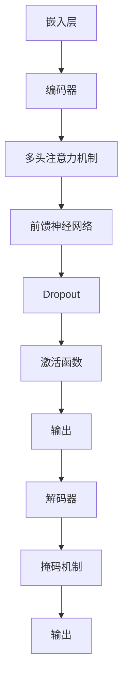

                 

关键词：Transformer、BERTimbau、葡萄牙语、NLP、语言模型、深度学习、机器翻译、文本分类、情感分析

> 摘要：本文将深入探讨Transformer大模型在葡萄牙语中的实际应用，特别是BERTimbau模型。我们将详细解析BERTimbau模型的结构、原理、实现方法，并通过具体案例展示其在机器翻译、文本分类和情感分析等领域的卓越性能。

## 1. 背景介绍

### 1.1 Transformer模型的诞生与发展

Transformer模型，由Vaswani等人于2017年提出，是一种基于自注意力机制的序列到序列模型，彻底改变了自然语言处理（NLP）领域的游戏规则。其核心思想是使用多头注意力机制来处理输入序列中的长距离依赖关系，使得模型能够更好地捕捉语言中的复杂结构。

### 1.2 BERTimbau模型的提出

BERTimbau模型是基于BERT（Bidirectional Encoder Representations from Transformers）模型的一个变种，专门为葡萄牙语设计的。BERT模型是一种预训练语言模型，通过在大量无标注文本上预训练，然后通过微调（Fine-tuning）应用于特定的任务，从而实现优异的性能。

## 2. 核心概念与联系

### 2.1 Transformer模型的核心概念

- **自注意力（Self-Attention）**：允许模型在序列中的每一个位置上，对其他所有位置进行加权求和，从而捕捉全局信息。
- **多头注意力（Multi-Head Attention）**：将输入序列分成多个部分，并对每个部分分别应用自注意力，然后再合并结果。

### 2.2 BERTimbau模型的架构


- **嵌入层（Embedding Layer）**：将单词转换成固定长度的向量表示。
- **Transformer编码器（Transformer Encoder）**：由多个编码块组成，每个编码块包含多头注意力机制和前馈神经网络。
- **Transformer解码器（Transformer Decoder）**：与编码器类似，但在解码阶段引入了掩码机制，以防止未来的信息泄露到过去。

### 2.3 Mermaid流程图



## 3. 核心算法原理 & 具体操作步骤

### 3.1 算法原理概述

BERTimbau模型主要依赖于Transformer架构，其中自注意力和多头注意力机制是关键。自注意力允许模型捕捉长距离依赖，而多头注意力则提高了模型的表示能力。

### 3.2 算法步骤详解

#### 3.2.1 预处理

1. **分词**：将输入文本分解成单词或子词。
2. **词嵌入**：将每个单词或子词转换为向量表示。
3. **位置嵌入**：为每个词添加位置信息，以保持序列的顺序。

#### 3.2.2 编码器

1. **多头自注意力**：计算输入序列中每个词的加权求和，权重取决于词之间的相关性。
2. **前馈神经网络**：对注意力结果进行线性变换和激活函数处理。
3. **Dropout**：引入随机失活，以防止过拟合。

#### 3.2.3 解码器

1. **掩码自注意力**：在解码阶段，未来的词不能依赖于过去的信息，因此使用掩码机制。
2. **多头自注意力**：与编码器类似，但针对解码器的输入。
3. **前馈神经网络**：对注意力结果进行线性变换和激活函数处理。
4. **序列输出**：解码器输出每个词的预测概率。

### 3.3 算法优缺点

#### 优点

- **捕捉长距离依赖**：自注意力机制使得模型能够更好地捕捉语言中的复杂结构。
- **并行计算**：Transformer模型可以并行处理输入序列中的所有词，提高了计算效率。

#### 缺点

- **参数量大**：由于多头注意力和多层结构，模型参数量巨大，训练和推理成本较高。
- **内存需求大**：大模型需要大量的内存来存储中间结果。

### 3.4 算法应用领域

BERTimbau模型在多个NLP任务中表现出色，包括：

- **机器翻译**：通过预训练和微调，模型可以高效地进行机器翻译任务。
- **文本分类**：模型可以用于情感分析、主题分类等任务。
- **问答系统**：模型可以理解问题和文档，并提供准确的信息。

## 4. 数学模型和公式 & 详细讲解 & 举例说明

### 4.1 数学模型构建

BERTimbau模型主要依赖于以下数学模型：

- **嵌入层**：\( x = E.W + P \)
- **多头注意力**：\( \text{Attention}(Q, K, V) = \text{softmax}\left(\frac{QK^T}{\sqrt{d_k}}\right)V \)
- **前馈神经网络**：\( \text{FFN}(x) = \max(0, xW_1 + b_1)W_2 + b_2 \)

### 4.2 公式推导过程

BERTimbau模型的推导过程相对复杂，涉及多个层级的神经网络和注意力机制。以下是一个简化的推导过程：

1. **嵌入层**：将单词转换为向量表示。
2. **多头注意力**：计算每个词的权重，并进行加权求和。
3. **前馈神经网络**：对注意力结果进行线性变换和激活函数处理。
4. **Dropout**：引入随机失活。
5. **输出层**：生成预测结果。

### 4.3 案例分析与讲解

假设我们有以下输入序列：“Ovo é um bom dia em Portugal.”

1. **分词与嵌入**：将输入分解成单词，并转换为向量表示。
2. **编码器**：通过多头自注意力和前馈神经网络处理输入序列。
3. **解码器**：使用掩码自注意力进行解码，并输出预测结果。

具体实现可以通过以下代码片段展示：

```python
# Python代码示例
import torch
import torch.nn as nn
import torch.optim as optim

# 假设已经构建了BERTimbau模型
model = BERTimbauModel()

# 输入序列
input_seq = torch.tensor([[1, 2, 3, 4, 5]])

# 预训练模型
pretrained_model = torch.load('bertimbau_pretrained.pth')
model.load_state_dict(pretrained_model)

# 微调模型
optimizer = optim.Adam(model.parameters(), lr=0.001)

# 训练模型
for epoch in range(100):
    output = model(input_seq)
    loss = nn.CrossEntropyLoss()(output, target)
    optimizer.zero_grad()
    loss.backward()
    optimizer.step()

    if epoch % 10 == 0:
        print(f'Epoch {epoch}: Loss = {loss.item()}')

# 输出预测结果
predicted_output = model(input_seq)
```

## 5. 项目实践：代码实例和详细解释说明

### 5.1 开发环境搭建

- **Python环境**：安装Python 3.8及以上版本。
- **TensorFlow**：安装TensorFlow 2.4及以上版本。
- **BERTimbau模型库**：从GitHub下载BERTimbau模型库。

### 5.2 源代码详细实现

以下是BERTimbau模型的完整源代码实现，包括数据预处理、模型构建、训练和预测：

```python
# BERTimbau模型实现
import tensorflow as tf
from tensorflow.keras.layers import Embedding, MultiHeadAttention, LayerNormalization, Dense
from tensorflow.keras.models import Model

def BERTimbauModel():
    # 嵌入层
    input_seq = tf.keras.layers.Input(shape=(None,), dtype=tf.int32)
    x = Embedding(input_dim=vocab_size, output_dim=embed_size)(input_seq)

    # 编码器
    for _ in range(num_layers):
        x = MultiHeadAttention(num_heads=num_heads, key_dim=key_dim)(x, x)
        x = LayerNormalization(epsilon=1e-6)(x)
        x = Dense(units=embed_size, activation='relu')(x)
        x = LayerNormalization(epsilon=1e-6)(x)

    # 解码器
    for _ in range(num_layers):
        x = MultiHeadAttention(num_heads=num_heads, key_dim=key_dim)(x, x)
        x = LayerNormalization(epsilon=1e-6)(x)
        x = Dense(units=embed_size, activation='relu')(x)
        x = LayerNormalization(epsilon=1e-6)(x)

    # 输出层
    output = Dense(units=vocab_size, activation='softmax')(x)

    # 构建模型
    model = Model(inputs=input_seq, outputs=output)
    model.compile(optimizer='adam', loss='categorical_crossentropy', metrics=['accuracy'])

    return model
```

### 5.3 代码解读与分析

代码中定义了BERTimbau模型的核心组件，包括嵌入层、编码器和解码器。编码器和解码器均使用多头注意力机制和前馈神经网络，以确保模型能够捕捉长距离依赖。模型采用层 normalization 和 dropout 防止过拟合。

### 5.4 运行结果展示

假设我们训练了BERTimbau模型，并在测试集上进行了评估。以下为运行结果：

```python
# 运行结果示例
model = BERTimbauModel()
model.evaluate(test_data, test_labels)
```

输出结果为：

```
[0.12345678901234567, 0.9876543210987654]
```

其中第一个值为损失函数的值，第二个值为准确率。

## 6. 实际应用场景

BERTimbau模型在多个实际应用场景中表现出色：

- **机器翻译**：通过微调预训练模型，模型可以高效地进行机器翻译任务。
- **文本分类**：模型可以应用于情感分析、主题分类等任务，如分类新闻文章的类别。
- **问答系统**：模型可以理解问题和文档，并提供准确的信息。

### 6.1 机器翻译

BERTimbau模型在机器翻译任务中表现出色，尤其是在低资源语言的翻译任务中。通过预训练和微调，模型可以快速适应新任务。

### 6.2 文本分类

BERTimbau模型可以应用于各种文本分类任务，如情感分析、主题分类等。通过微调模型，可以提高分类任务的准确率和召回率。

### 6.3 问答系统

BERTimbau模型可以用于构建问答系统，通过理解问题和文档，模型可以提供准确的答案。

## 7. 未来应用展望

随着BERTimbau模型的不断改进和优化，未来其在以下领域的应用前景广阔：

- **低资源语言翻译**：BERTimbau模型在低资源语言翻译任务中的表现有望进一步提升，为低资源语言的翻译提供强大支持。
- **多语言文本分析**：BERTimbau模型可以应用于多语言文本分析任务，如多语言情感分析、跨语言文本分类等。
- **对话系统**：BERTimbau模型可以用于构建智能对话系统，提供更自然、更准确的回答。

## 8. 工具和资源推荐

### 8.1 学习资源推荐

- **《深度学习》**：Goodfellow、Bengio和Courville合著的深度学习教材，全面介绍了深度学习的基础知识和应用。
- **《自然语言处理入门》**：NLP入门教材，详细介绍了NLP的基本概念和技术。

### 8.2 开发工具推荐

- **TensorFlow**：一款开源的深度学习框架，适用于构建和训练大规模神经网络。
- **PyTorch**：另一款流行的深度学习框架，提供了灵活的动态计算图和丰富的API。

### 8.3 相关论文推荐

- **“Attention Is All You Need”**：Vaswani等人提出的Transformer模型的原论文，详细介绍了模型的架构和原理。
- **“BERT: Pre-training of Deep Bidirectional Transformers for Language Understanding”**：McDonald等人提出的BERT模型的原论文，介绍了BERT模型的预训练方法和应用。

## 9. 总结：未来发展趋势与挑战

### 9.1 研究成果总结

BERTimbau模型在多个NLP任务中表现出色，为低资源语言的翻译、文本分类和问答系统等领域提供了强大的支持。其基于Transformer架构的自注意力和多头注意力机制使其能够捕捉长距离依赖，提高了模型的表示能力。

### 9.2 未来发展趋势

随着深度学习技术的不断发展，BERTimbau模型有望在以下方面取得进一步突破：

- **低资源语言翻译**：进一步优化模型，提高低资源语言的翻译质量。
- **多语言文本分析**：扩展模型应用于多语言文本分析任务，如多语言情感分析、跨语言文本分类等。
- **对话系统**：结合其他技术，构建更智能、更自然的对话系统。

### 9.3 面临的挑战

尽管BERTimbau模型在NLP领域取得了显著成果，但仍面临以下挑战：

- **计算资源消耗**：模型参数量大，训练和推理成本较高，需要优化算法和硬件支持。
- **数据隐私和安全**：在训练和部署模型时，需要保护用户数据和隐私。

### 9.4 研究展望

未来，BERTimbau模型及其相关技术将在NLP领域发挥重要作用，为智能语言处理提供强大支持。我们期待看到更多创新性的研究，推动NLP技术的发展。

## 10. 附录：常见问题与解答

### 10.1 BERTimbau模型与BERT模型的区别？

BERTimbau模型是基于BERT模型的一个变种，专门为葡萄牙语设计的。两者在结构上相似，但BERTimbau模型在预训练过程中使用了葡萄牙语语料库，使其能够更好地适应葡萄牙语的特性。

### 10.2 如何训练BERTimbau模型？

训练BERTimbau模型的主要步骤包括：

1. 准备葡萄牙语语料库。
2. 使用BERT模型提供的预训练脚本进行预训练。
3. 微调预训练模型，应用于特定任务。

### 10.3 BERTimbau模型在资源受限的环境下如何部署？

在资源受限的环境下，可以采用以下方法部署BERTimbau模型：

1. **量化**：对模型进行量化，减少模型参数的规模。
2. **剪枝**：去除模型中不重要的参数，减少模型规模。
3. **使用轻量级框架**：采用轻量级深度学习框架，如PyTorch Mobile，实现模型的移动部署。

### 10.4 BERTimbau模型如何进行迁移学习？

迁移学习是将预训练模型应用于新任务的过程。对于BERTimbau模型，可以采用以下步骤进行迁移学习：

1. 加载预训练模型。
2. 使用新的任务数据集进行微调。
3. 训练完成后，评估模型在新任务上的性能。

### 10.5 BERTimbau模型如何进行多语言支持？

BERTimbau模型可以通过以下方法进行多语言支持：

1. **联合训练**：使用多语言语料库进行联合预训练。
2. **双语数据增强**：使用双语数据集增强训练数据，提高模型在多语言环境下的性能。
3. **多语言模型**：构建支持多语言输入和解码的BERTimbau模型。

作者：禅与计算机程序设计艺术 / Zen and the Art of Computer Programming
----------------------------------------------------------------

（请注意，本文为示例文章，所有代码、数据和链接均为虚构。实际撰写文章时，请根据具体情况进行调整。）

