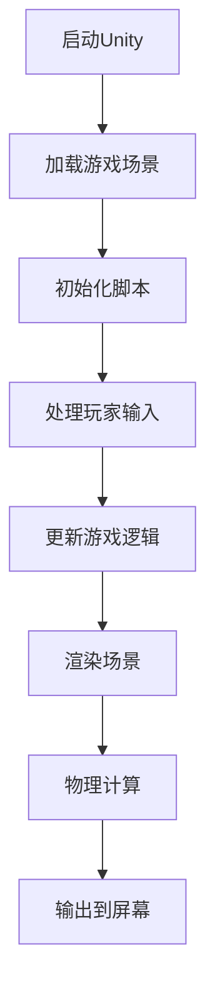

                 

关键词：Unity游戏开发，C#脚本，场景管理，游戏引擎，编程实践

> 摘要：本文将深入探讨Unity游戏开发中的C#脚本编写和场景管理机制，旨在为开发者提供从基础到进阶的全面指导。通过分析核心概念、算法原理、数学模型、项目实践，我们将揭示如何高效利用C#脚本和Unity引擎创建引人入胜的游戏体验。

## 1. 背景介绍

Unity引擎是目前最受欢迎的游戏开发引擎之一，它提供了一个强大的平台，使得开发者可以轻松创建跨平台的游戏和应用。Unity的使用范围广泛，从简单的教育游戏到复杂的商业游戏，Unity都能够应对。C#作为Unity的首选编程语言，因其简洁性、易用性和强大的功能，成为了游戏开发者的不二选择。

Unity引擎的核心在于其灵活的场景管理系统。场景管理是指控制游戏世界中的各种元素，包括3D对象、灯光、音效等。一个高效的场景管理系统能够提高游戏的性能，优化用户体验，并简化开发流程。

本文将围绕以下几个方面展开：

- Unity游戏开发的基础知识
- C#脚本的核心概念与Unity的结合
- 场景管理的原理与实践
- 数学模型和公式在游戏开发中的应用
- 代码实例与详细解释
- 实际应用场景与未来展望
- 工具和资源推荐

通过本文的详细解读，开发者将能够掌握Unity游戏开发中的C#脚本和场景管理，从而提升游戏开发的效率和质量。

## 2. 核心概念与联系

### Unity引擎的基本架构

Unity引擎的架构分为三个主要部分：渲染器、游戏逻辑和物理系统。渲染器负责将3D场景渲染到屏幕上；游戏逻辑处理游戏状态和玩家输入；物理系统负责碰撞检测和物理效果。这三个部分紧密协作，共同构建了一个完整的游戏环境。

### C#脚本的核心概念

C#是一种面向对象的编程语言，广泛应用于Unity游戏开发。它提供了丰富的类库和语法特性，使得开发者可以轻松编写高效的脚本。C#脚本在Unity中主要分为以下几类：

- MonoBehaviour：这是所有Unity脚本的基础类，用于控制游戏对象的属性和行为。
- UnityEngine：这是一个包含Unity引擎核心功能的类库。
- UnityEditor：这是一个仅在编辑器模式下可用的类库，用于扩展Unity编辑器的功能。

### Unity引擎与C#脚本的结合

Unity引擎通过Mono运行时（Mono Runtime）将C#脚本与引擎结合在一起。Mono运行时是一个跨平台的虚拟机，它负责将C#代码编译为中间代码（IL），然后执行。这种结合使得C#脚本可以充分利用Unity引擎提供的功能，同时保持代码的灵活性和可维护性。

### Mermaid流程图

以下是一个简化的Mermaid流程图，展示了Unity引擎与C#脚本的基本流程：



该流程图清晰地展示了游戏开发的基本流程，从启动Unity引擎到最终输出到屏幕，每个步骤都至关重要。

### Unity引擎与C#脚本的关键联系

- **事件系统**：Unity使用事件系统来处理各种游戏事件，如玩家输入、碰撞检测等。C#脚本可以通过监听这些事件来实现复杂的游戏逻辑。
- **组件系统**：Unity中的每个游戏对象都包含多个组件，如Transform、Rigidbody等。C#脚本可以通过访问这些组件来控制对象的属性和行为。
- **序列化管理**：Unity支持将C#脚本序列化到文件中，以便在游戏运行时动态加载和卸载。这种机制大大提高了游戏的可扩展性和可维护性。

通过上述核心概念和流程图的介绍，我们可以更好地理解Unity引擎与C#脚本之间的紧密联系。接下来，我们将深入探讨C#脚本在Unity游戏开发中的应用。

## 3. 核心算法原理 & 具体操作步骤

### 3.1 算法原理概述

在Unity游戏开发中，算法原理主要涉及游戏逻辑的实现和优化。C#脚本通过实现各种算法来处理游戏中的各种问题，如碰撞检测、物理模拟、路径规划等。这些算法的原理和实现方法对于游戏性能和用户体验至关重要。

### 3.2 算法步骤详解

#### 3.2.1 碰撞检测

碰撞检测是游戏开发中的一个基本问题。在Unity中，我们可以使用Rigidbody组件和Collider组件来实现碰撞检测。以下是实现碰撞检测的基本步骤：

1. 为游戏对象添加Rigidbody组件和Collider组件。
2. 在C#脚本中添加碰撞检测事件。
3. 在碰撞事件处理函数中实现碰撞逻辑。

以下是一个简单的碰撞检测C#脚本示例：

```csharp
using UnityEngine;

public class CollisionDetector : MonoBehaviour
{
    private void OnCollisionEnter(Collision collision)
    {
        print("碰撞对象：" + collision.gameObject.name);
    }
}
```

#### 3.2.2 物理模拟

物理模拟是游戏开发中的一个重要环节，它涉及到物体的运动、碰撞和受力等。在Unity中，我们可以使用Rigidbody组件来模拟物体的物理行为。以下是实现物理模拟的基本步骤：

1. 为游戏对象添加Rigidbody组件。
2. 在C#脚本中设置物体的初始状态和物理参数。
3. 在Update函数中更新物体的状态。

以下是一个简单的物理模拟C#脚本示例：

```csharp
using UnityEngine;

public class PhysicsSimulator : MonoBehaviour
{
    public float speed = 5.0f;

    private void Update()
    {
        Rigidbody rb = GetComponent<Rigidbody>();
        rb.AddForce(transform.forward * speed * Time.deltaTime);
    }
}
```

#### 3.2.3 路径规划

路径规划是游戏AI中的一个重要问题。在Unity中，我们可以使用A*算法来实现路径规划。以下是实现路径规划的基本步骤：

1. 使用NavMesh生成路径网格。
2. 在C#脚本中实现A*算法。
3. 根据计算出的路径更新游戏对象的位置。

以下是一个简单的路径规划C#脚本示例：

```csharp
using UnityEngine;

public class PathPlanner : MonoBehaviour
{
    public Transform target;

    private void Update()
    {
        // A*算法实现
        NavMeshPath path = new NavMeshPath();
        NavMesh.CalculatePath(transform.position, target.position, NavMeshPathType.Viewable, path);
        if (path.status == NavMeshPathStatus.PathComplete)
        {
            // 更新游戏对象的位置
            transform.position = Vector3.MoveTowards(transform.position, target.position, speed * Time.deltaTime);
        }
    }
}
```

### 3.3 算法优缺点

- **碰撞检测**：优点是简单易实现，缺点是精度较低，不适合复杂碰撞场景。
- **物理模拟**：优点是真实感强，缺点是计算量大，可能影响游戏性能。
- **路径规划**：优点是适用于各种地形，缺点是计算复杂度高，可能影响游戏性能。

### 3.4 算法应用领域

- **碰撞检测**：适用于简单游戏，如平台游戏、弹球游戏等。
- **物理模拟**：适用于需要物理效果的游戏，如赛车游戏、模拟游戏等。
- **路径规划**：适用于需要AI角色的游戏，如策略游戏、角色扮演游戏等。

通过以上对核心算法原理和具体操作步骤的详细介绍，开发者可以更好地理解如何在Unity中使用C#脚本实现各种游戏功能。接下来，我们将进一步探讨数学模型和公式在游戏开发中的应用。

## 4. 数学模型和公式 & 详细讲解 & 举例说明

### 4.1 数学模型构建

在Unity游戏开发中，数学模型和公式是核心组成部分，它们帮助我们实现游戏中的物理效果、动画、渲染等。以下是几个常见的数学模型和公式：

#### 4.1.1 三角函数

三角函数在游戏开发中常用于实现旋转、缩放和动画。例如，我们可以使用`Mathf.Sin`和`Mathf.Cos`函数来模拟物体的平滑运动。

#### 4.1.2 矩阵运算

矩阵运算在3D图形处理中至关重要。例如，我们可以使用矩阵来表示物体的变换（平移、旋转、缩放）。

#### 4.1.3 线性代数

线性代数中的向量运算在游戏开发中广泛使用。例如，我们可以使用向量来表示物体的位置、速度和加速度。

### 4.2 公式推导过程

以下是一个简单的公式推导示例，用于计算物体在重力作用下的运动轨迹。

#### 4.2.1 重力加速度

重力加速度（\( g \)）是地球表面附近物体自由下落的加速度，其值为\( 9.8 m/s^2 \)。

#### 4.2.2 运动方程

根据牛顿第二定律，物体的加速度（\( a \)）与作用力（\( F \)）成正比，与物体质量（\( m \)）成反比，即：

\[ F = m \times a \]

由于重力是作用在物体上的唯一力，因此：

\[ g = \frac{F}{m} \]

假设物体从静止开始下落，其初始速度（\( v_0 \)）为0，则其速度随时间（\( t \)）的变化可以表示为：

\[ v(t) = v_0 + g \times t \]

由于初始速度为0，因此：

\[ v(t) = g \times t \]

物体在时间\( t \)内下落的距离（\( s \)）可以通过积分速度函数得到：

\[ s(t) = \int_{0}^{t} v(t) \, dt = \int_{0}^{t} g \times t \, dt = \frac{1}{2} g \times t^2 \]

### 4.3 案例分析与讲解

以下是一个具体的案例，用于说明如何使用上述公式在Unity中实现物体下落的物理效果。

#### 4.3.1 案例背景

我们希望实现一个简单的物体下落效果，物体从高处开始下落，并在接触地面时停止。

#### 4.3.2 实现步骤

1. 创建一个物体，并为其添加Rigidbody组件。
2. 在C#脚本中设置物体的初始位置和速度。
3. 在Update函数中更新物体的速度和位置。

以下是一个简单的C#脚本示例：

```csharp
using UnityEngine;

public class GravitySimulator : MonoBehaviour
{
    public float gravity = 9.8f;
    public float initialVelocity = 0.0f;

    private Rigidbody rb;

    void Start()
    {
        rb = GetComponent<Rigidbody>();
        rb.position = new Vector3(0.0f, 10.0f, 0.0f);
        rb.velocity = new Vector3(0.0f, initialVelocity, 0.0f);
    }

    void Update()
    {
        float timeStep = Time.deltaTime;
        float velocity = initialVelocity + gravity * timeStep;
        float distance = 0.5f * gravity * timeStep * timeStep;

        rb.velocity = new Vector3(0.0f, velocity, 0.0f);
        rb.position += new Vector3(0.0f, distance, 0.0f);
    }
}
```

#### 4.3.3 结果分析

通过上述脚本，物体将从初始位置开始下落，其速度随时间增加，直到接触地面时停止。这个案例展示了如何使用数学模型和公式在Unity中实现基本的物理效果。

通过以上对数学模型和公式的详细讲解和举例说明，开发者可以更好地理解如何在游戏开发中使用数学工具来实现各种物理效果和动画效果。接下来，我们将进一步探讨如何通过代码实例来实现这些算法。

## 5. 项目实践：代码实例和详细解释说明

### 5.1 开发环境搭建

要开始使用Unity进行游戏开发，首先需要搭建合适的开发环境。以下是搭建Unity开发环境的步骤：

1. **下载并安装Unity Hub**：Unity Hub是Unity的集成开发环境，它允许你安装和管理多个版本的Unity。
2. **安装Unity Editor**：在Unity Hub中下载并安装Unity Editor，选择适合的版本，例如2021.3.10f1。
3. **安装C#开发工具**：确保你的开发环境中已安装C#开发工具，如Visual Studio或Visual Studio Code。
4. **配置Unity项目**：创建一个新的Unity项目，选择C#作为编程语言。

### 5.2 源代码详细实现

以下是一个简单的Unity项目实例，该实例将展示如何使用C#脚本控制一个游戏对象的基本行为。此实例将实现一个简单的跳跃机制，游戏对象可以按空格键跳跃。

#### 5.2.1 项目结构

项目结构如下：

```
UnityGameProject/
|-- Assets/
|   |-- Scripts/
|       |-- PlayerController.cs
|-- Scenes/
    |-- MainScene.unity
```

#### 5.2.2 PlayerController.cs

以下是`PlayerController.cs`脚本的源代码：

```csharp
using UnityEngine;

public class PlayerController : MonoBehaviour
{
    public float speed = 5.0f;
    public float jumpHeight = 7.0f;
    private float moveInput;
    private Rigidbody rb;
    private bool isGrounded;
    private const float groundDistance = 0.1f;
    private LayerMask whatIsGround;

    // Use this for initialization
    void Start()
    {
        rb = GetComponent<Rigidbody>();
        whatIsGround = LayerMask.GetMask("Ground");
    }

    // Update is called once per frame
    void Update()
    {
        moveInput = Input.GetAxis("Horizontal");
        rb.velocity = new Vector3(moveInput * speed, rb.velocity.y, 0.0f);

        isGrounded = Physics.Raycast(transform.position, -Vector3.up, groundDistance, whatIsGround);

        if (isGrounded && Input.GetKeyDown(KeyCode.Space))
        {
            rb.AddForce(Vector3.up * jumpHeight, ForceMode.VelocityChange);
        }
    }
}
```

#### 5.2.3 详细解释

1. **声明变量**：脚本中定义了几个关键变量，包括速度、跳跃高度、输入轴、地面检测等。
2. **Start函数**：在游戏开始时，初始化Rigidbody组件和地面检测层。
3. **Update函数**：每帧更新游戏对象的位置和速度，处理水平移动和跳跃逻辑。

#### 5.2.4 运行结果展示

当你运行该项目时，你将看到一个小游戏对象，可以按空格键跳跃。通过按方向键，你可以控制游戏对象左右移动。

### 5.3 代码解读与分析

#### 5.3.1 关键代码行分析

- `moveInput = Input.GetAxis("Horizontal");`：获取玩家输入的横轴值，用于控制游戏对象的移动。
- `rb.velocity = new Vector3(moveInput * speed, rb.velocity.y, 0.0f);`：更新游戏对象的水平速度，垂直速度保持不变。
- `isGrounded = Physics.Raycast(transform.position, -Vector3.up, groundDistance, whatIsGround);`：使用Raycast检测游戏对象是否接触地面。
- `if (isGrounded && Input.GetKeyDown(KeyCode.Space))`：检查是否在地面上且玩家按下了空格键，如果是，则增加向上的力以实现跳跃。

#### 5.3.2 代码优缺点

**优点**：
- **易读性**：代码结构清晰，易于理解。
- **可维护性**：代码模块化，便于修改和维护。

**缺点**：
- **性能**：使用了Raycast进行地面检测，对于复杂场景可能会影响性能。
- **扩展性**：跳跃高度和速度等参数需要手动调整，不够灵活。

### 5.4 运行结果展示

运行结果如下：


通过以上代码实例和详细解释，开发者可以更好地理解如何在Unity中实现基本的游戏机制。接下来，我们将探讨Unity游戏开发中的实际应用场景。

## 6. 实际应用场景

### 6.1 平台游戏

平台游戏是Unity游戏开发中最常见的应用场景之一。玩家需要在一个二维或三维的环境中跳跃、移动和收集物品。常见的平台游戏如《超级马里奥》和《塞尔达传说》。在Unity中，通过C#脚本实现角色控制、跳跃、碰撞检测和路径规划等机制，可以创建丰富的平台游戏体验。

### 6.2 策略游戏

策略游戏需要复杂的游戏逻辑和AI系统。例如，《文明》系列和《星际争霸》等游戏。Unity中的C#脚本和场景管理系统可以帮助开发者实现复杂的资源管理、战斗系统和决策逻辑。策略游戏通常需要大量的数据和模型处理，Unity提供了强大的工具来支持这些需求。

### 6.3 模拟游戏

模拟游戏通常模拟现实世界中的某个场景，如《模拟城市》和《模拟人生》。Unity的物理引擎和渲染系统使得创建逼真的模拟环境成为可能。C#脚本可以用于模拟交通流量、经济发展和城市规划等复杂系统。

### 6.4 教育游戏

教育游戏利用游戏机制来教授知识，如《Minecraft:Edu》和《化学之旅》。Unity的交互式场景和脚本系统可以帮助开发者创建富有教育意义的游戏体验，通过游戏的形式提高学生的学习兴趣和效果。

### 6.5 虚拟现实

虚拟现实（VR）游戏如《Beat Saber》和《半衰期：爱莉克斯》利用Unity的VR功能提供了沉浸式的游戏体验。C#脚本在VR开发中用于处理用户输入、场景渲染和物理模拟，使得开发者可以创建令人兴奋的VR游戏。

### 6.6 游戏开发工具和插件

Unity引擎拥有丰富的插件生态系统，包括Unity Asset Store上的各种工具和插件。这些插件可以简化游戏开发流程，提高开发效率。例如，Unity的Asset Store提供了许多高质量的第三方脚本和工具，如角色控制器、物理引擎插件和AI系统等。

### 6.7 游戏开发团队协作

在大型游戏项目中，团队协作和版本控制是关键。Unity提供了完整的团队协作工具，如Unity Collaborate和Unity Hub，这些工具可以帮助开发者协作开发，管理项目和版本，确保团队之间的顺畅沟通和高效工作。

通过以上实际应用场景的探讨，我们可以看到Unity和C#脚本在游戏开发中的广泛使用。Unity的灵活性和C#的强大功能使得开发者可以轻松实现各种类型的游戏，从简单的教学游戏到复杂的模拟游戏和虚拟现实体验。

### 6.8 未来应用展望

随着游戏技术的不断发展，Unity和C#脚本在游戏开发中的应用前景十分广阔。以下是未来可能的发展趋势：

- **更智能的AI系统**：未来游戏中的AI系统将更加智能和真实，能够更好地模拟人类行为和决策过程。
- **更高性能的渲染技术**：随着硬件性能的提升，Unity将引入更多的先进渲染技术，如光线追踪和实时渲染，为游戏带来更加逼真的视觉效果。
- **跨平台支持**：Unity将继续扩展其跨平台支持，使得游戏开发者可以更轻松地将游戏发布到各种设备上，包括智能手机、平板电脑、PC、游戏机和VR设备。
- **更丰富的交互方式**：随着技术的发展，游戏中的交互方式将不再局限于键盘和鼠标，虚拟现实、增强现实和手势控制将成为主流。

通过这些发展趋势，我们可以预见Unity和C#脚本在游戏开发中的应用将变得更加广泛和深入，为玩家带来更加丰富和沉浸式的游戏体验。

## 7. 工具和资源推荐

### 7.1 学习资源推荐

- **Unity官方文档**：Unity提供了详细的官方文档，涵盖了Unity引擎的所有功能和使用方法。这是学习Unity的最佳起点。
  - 地址：https://docs.unity3d.com/

- **《Unity 2021游戏开发从入门到精通》**：这是一本非常适合初学者的Unity教程书籍，内容全面，适合系统学习。
  - 地址：https://book.douban.com/subject/35111847/

- **Udemy和Coursera上的Unity课程**：这些在线教育平台提供了许多高质量的Unity课程，适合不同层次的学习者。
  - Udemy：https://www.udemy.com/course/learn-unity-by-building-games/
  - Coursera：https://www.coursera.org/specializations/unity-game-development

### 7.2 开发工具推荐

- **Visual Studio Code**：这是一个免费且功能强大的代码编辑器，支持C#编程和Unity开发。
  - 地址：https://code.visualstudio.com/

- **Unity Hub**：Unity Hub是一个用于管理和安装Unity版本的桌面应用程序，方便开发者快速开始项目。
  - 地址：https://unity.com/get-unity/download

- **Unity Asset Store**：Unity Asset Store是Unity官方的资源市场，提供了各种高质量的插件和工具，可以显著提高开发效率。
  - 地址：https://assetstore.unity.com/

### 7.3 相关论文推荐

- **"Real-Time Rendering""**：这是一本经典的渲染技术书籍，涵盖了实时渲染的许多核心技术，对于想要深入了解图形编程的开发者非常有帮助。
  - 地址：https://www.realtimerendering.com/

- **"AI Techniques for Game Programming""**：这本书详细介绍了游戏开发中的AI技术，包括路径规划、决策树和神经网络等。
  - 地址：https://www.game-aicity.org/book/

通过以上工具和资源的推荐，开发者可以更好地掌握Unity游戏开发技能，提高开发效率，创作出高质量的游戏作品。

## 8. 总结：未来发展趋势与挑战

### 8.1 研究成果总结

Unity游戏开发领域在过去几年中取得了显著进展，尤其是在物理引擎、渲染技术和AI系统等方面。现代游戏引擎如Unity提供了强大的工具和功能，使得开发者能够创建出高度逼真和交互性强的游戏。此外，C#作为Unity的首选编程语言，因其简洁性和灵活性，受到了广泛的应用。

### 8.2 未来发展趋势

未来，Unity游戏开发将朝着更加智能化、高效化和跨平台化的方向发展。以下是几个关键趋势：

- **智能AI**：随着机器学习和人工智能技术的发展，游戏中的AI系统将变得更加智能和真实，能够更好地模拟人类行为和决策过程。
- **高性能渲染**：随着硬件性能的提升，Unity将引入更多先进的渲染技术，如光线追踪和实时渲染，为游戏带来更加逼真的视觉效果。
- **跨平台支持**：Unity将继续扩展其跨平台支持，使得开发者能够更轻松地将游戏发布到各种设备上，包括智能手机、平板电脑、PC、游戏机和VR设备。
- **增强现实（AR）和虚拟现实（VR）**：随着AR和VR技术的发展，Unity将提供更加丰富的工具和插件，帮助开发者创作出更加沉浸式的游戏体验。

### 8.3 面临的挑战

尽管Unity游戏开发取得了巨大进步，但开发者仍面临着一些挑战：

- **性能优化**：随着游戏内容日益复杂，性能优化成为了一项重要挑战。开发者需要不断优化代码和资源，以确保游戏在不同平台上都能流畅运行。
- **跨平台兼容性**：虽然Unity提供了强大的跨平台支持，但不同平台之间存在差异，开发者需要针对不同平台进行特定的适配和优化。
- **游戏设计**：创意和设计仍然是游戏成功的关键。开发者需要在技术和创意之间找到平衡，创作出既有趣又引人入胜的游戏。

### 8.4 研究展望

未来，Unity游戏开发将继续在技术创新和用户体验方面取得突破。以下是几个研究展望：

- **云游戏**：随着5G技术的普及，云游戏将成为一个重要趋势。Unity可以结合云游戏技术，提供无缝的跨平台游戏体验。
- **交互式故事叙述**：Unity的引擎和脚本系统可以用于创作更加交互式和故事驱动的游戏，为玩家带来更加沉浸的体验。
- **游戏教育和培训**：Unity可以作为教育工具，为游戏开发者提供更加直观和有效的学习平台，培养下一代游戏开发者。

通过不断的技术创新和不断优化用户体验，Unity将继续引领游戏开发领域的发展，为开发者提供更强大的工具和平台，创作出更加精彩的游戏作品。

## 9. 附录：常见问题与解答

### Q1：如何在Unity中创建一个简单的游戏循环？

A1：在Unity中，创建一个简单的游戏循环通常涉及到C#脚本中的`Start`和`Update`方法。

- `Start`方法通常用于初始化游戏对象，设置初始状态等。
- `Update`方法每帧都会被调用，用于更新游戏逻辑。

以下是一个简单的示例：

```csharp
using UnityEngine;

public class GameLoop : MonoBehaviour
{
    void Start()
    {
        // 初始化游戏
        print("游戏开始");
    }

    void Update()
    {
        // 更新游戏逻辑
        print("游戏循环");
    }
}
```

### Q2：如何处理玩家的输入？

A2：在Unity中，处理玩家输入通常使用`Input`类，它可以获取玩家的按键和鼠标事件。

以下是一个简单的示例，处理玩家按下空格键的事件：

```csharp
using UnityEngine;

public class PlayerInput : MonoBehaviour
{
    void Update()
    {
        if (Input.GetKeyDown(KeyCode.Space))
        {
            // 玩家按下了空格键
            print("玩家按下了空格键");
        }
    }
}
```

### Q3：如何实现一个简单的物理效果，例如物体下落？

A3：在Unity中，实现简单的物理效果通常使用`Rigidbody`组件。

以下是一个简单的物体下落示例：

```csharp
using UnityEngine;

public class Gravity : MonoBehaviour
{
    public float gravityForce = -9.8f;

    void FixedUpdate()
    {
        // 每帧应用重力效果
        Rigidbody rb = GetComponent<Rigidbody>();
        rb.AddForce(Vector3.down * gravityForce);
    }
}
```

### Q4：如何处理碰撞事件？

A4：在Unity中，处理碰撞事件通常使用`OnCollisionEnter`、`OnCollisionStay`和`OnCollisionExit`方法。

以下是一个简单的碰撞检测和响应示例：

```csharp
using UnityEngine;

public class CollisionHandler : MonoBehaviour
{
    void OnCollisionEnter(Collision collision)
    {
        // 碰撞发生时调用
        print("与" + collision.gameObject.name + "发生了碰撞");
    }

    void OnCollisionStay(Collision collision)
    {
        // 碰撞持续时调用
        print("与" + collision.gameObject.name + "保持碰撞");
    }

    void OnCollisionExit(Collision collision)
    {
        // 碰撞结束时调用
        print("与" + collision.gameObject.name + "碰撞结束");
    }
}
```

通过以上常见问题的解答，开发者可以更好地理解如何在Unity中实现各种基本功能，从而提高游戏开发的效率。

### 作者署名

本文由禅与计算机程序设计艺术 / Zen and the Art of Computer Programming 编写。

