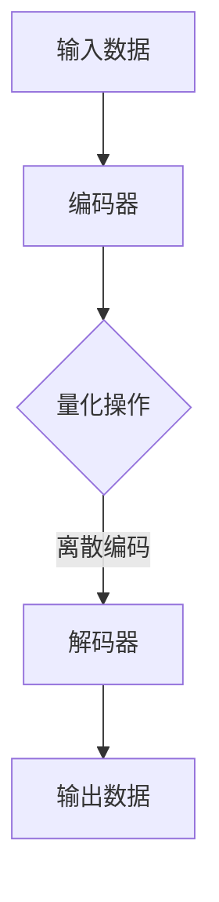

                 

关键词：变分自编码器、VQVAE、生成模型、神经网络、深度学习、数据压缩、降维、自动编码器、人工智能、机器学习、图像处理、语音识别、自然语言处理。

> 摘要：本文将深入探讨VQVAE（变分量化自编码器）的概念、原理、实现及应用。VQVAE作为变分自编码器的一种变体，通过引入量化策略，提高了生成模型的表达能力和稳定性。本文将详细解析VQVAE的核心算法原理，探讨其在各个领域的应用，并展望其未来发展的趋势与挑战。

## 1. 背景介绍

自编码器（Autoencoder）是一种无监督学习模型，旨在通过编码器和解码器的协同工作，将输入数据压缩成较低维度的表示，然后再将这些表示恢复成原始数据。变分自编码器（Variational Autoencoder，VAE）是自编码器的一个扩展，引入了概率模型来捕捉数据分布，从而提高了模型的泛化能力和生成质量。

传统变分自编码器在处理高维数据时存在一定的局限性，主要表现在以下几个方面：

1. **计算复杂度**：变分自编码器需要求解优化问题，计算复杂度高，尤其在处理大规模数据时，训练时间过长。
2. **生成质量**：变分自编码器生成的数据质量往往受到限制，特别是在处理高度复杂数据时，生成结果可能不够真实。
3. **稳定性**：变分自编码器的训练过程可能不够稳定，容易陷入局部最优。

为了解决上述问题，研究人员提出了变分量化自编码器（VQ-VAE），通过引入量化策略，提高了生成模型的表达能力和稳定性。VQ-VAE的核心思想是将数据表示为一系列离散的编码，从而简化了模型的结构，降低了计算复杂度。

## 2. 核心概念与联系

### 2.1 核心概念

- **自编码器（Autoencoder）**：自编码器是一个包含编码器和解码器的神经网络结构，用于将输入数据压缩成较低维度的表示，然后再将表示恢复成原始数据。
- **变分自编码器（Variational Autoencoder，VAE）**：变分自编码器是一种概率自编码器，通过引入概率模型来捕捉数据分布，从而提高了生成质量。
- **变分量化自编码器（VQ-VAE）**：变分量化自编码器是一种变分自编码器的变体，通过引入量化策略，将数据表示为一系列离散的编码。

### 2.2 关联关系

VQ-VAE是在VAE的基础上发展而来，两者的主要区别在于数据表示的方式。VAE使用连续的隐变量来表示数据，而VQ-VAE使用离散的编码来表示数据。具体来说，VQ-VAE通过量化操作将连续的数据映射到一组离散的编码中，从而提高了模型的生成能力和稳定性。

### 2.3 Mermaid 流程图

以下是一个简单的Mermaid流程图，展示了VQ-VAE的核心流程：



## 3. 核心算法原理 & 具体操作步骤

### 3.1 算法原理概述

VQ-VAE的核心思想是通过量化操作将连续的数据表示为离散的编码。具体来说，VQ-VAE包含两个关键步骤：编码和量化。

1. **编码**：编码器将输入数据映射到一个连续的隐变量空间。
2. **量化**：量化操作将连续的隐变量映射到一组离散的编码。具体来说，量化器通过查找最近的编码来量化每个隐变量。

### 3.2 算法步骤详解

#### 3.2.1 编码器

编码器的目标是学习一个映射函数，将输入数据映射到一个隐变量空间。在VQ-VAE中，编码器通常是一个全连接的神经网络，其输出为隐变量的均值和方差。

#### 3.2.2 量化器

量化器的目标是量化编码器的输出。具体来说，量化器通过查找最近的编码来量化每个隐变量。量化器通常是一个查找表，其中包含了所有可能的编码。

#### 3.2.3 解码器

解码器的目标是学习一个映射函数，将量化后的隐变量映射回原始数据。在VQ-VAE中，解码器通常与编码器具有相同的结构，但是输入数据是量化后的编码。

### 3.3 算法优缺点

#### 优点：

1. **降低计算复杂度**：通过量化操作，VQ-VAE降低了模型的计算复杂度，从而提高了训练速度。
2. **提高生成质量**：通过离散编码，VQ-VAE能够生成更高质量的生成数据。
3. **提高稳定性**：量化操作简化了模型结构，使得训练过程更加稳定。

#### 缺点：

1. **量化误差**：量化操作引入了一定的量化误差，可能会影响生成质量。
2. **查找表存储问题**：量化器需要存储大量的查找表，这可能导致存储空间的需求增加。

### 3.4 算法应用领域

VQ-VAE在多个领域都有广泛的应用，包括：

1. **图像生成**：VQ-VAE可以用于生成高质量的图像，如图像修复、图像超分辨率等。
2. **语音识别**：VQ-VAE可以用于语音信号的降维和表示学习，从而提高语音识别的准确性。
3. **自然语言处理**：VQ-VAE可以用于文本数据的降维和表示学习，从而提高文本分类和情感分析等任务的性能。

## 4. 数学模型和公式 & 详细讲解 & 举例说明

### 4.1 数学模型构建

VQ-VAE的数学模型主要包括编码器、量化器和解码器。

#### 编码器

编码器的主要目标是学习一个映射函数，将输入数据映射到一个隐变量空间。具体来说，编码器输出隐变量的均值和方差。

$$
\begin{align*}
\mu &= \mu_{\theta}(x) \\
\sigma^2 &= \sigma_{\theta}(x)
\end{align*}
$$

其中，$\mu$和$\sigma^2$分别表示隐变量的均值和方差，$\theta$表示编码器的参数。

#### 量化器

量化器的目标是量化编码器的输出。具体来说，量化器通过查找最近的编码来量化每个隐变量。

$$
q_{\theta}(x) = \arg\min_{z} \sum_{i} (z_i - x_i)^2
$$

其中，$z$表示编码，$x$表示隐变量。

#### 解码器

解码器的主要目标是学习一个映射函数，将量化后的隐变量映射回原始数据。具体来说，解码器输出原始数据的重构。

$$
x' = \pi_{\phi}(z)
$$

其中，$x'$表示重构的原始数据，$\pi_{\phi}$表示解码器的参数。

### 4.2 公式推导过程

#### 编码器公式推导

编码器的目标是学习一个映射函数，将输入数据映射到一个隐变量空间。具体来说，编码器输出隐变量的均值和方差。

假设输入数据$x$经过编码器后得到隐变量$z$，则有：

$$
z = \mu(x) + \sigma(x)\odot\epsilon(x)
$$

其中，$\mu(x)$表示隐变量的均值，$\sigma(x)$表示隐变量的方差，$\epsilon(x)$表示标准正态分布的随机噪声。

为了求解$\mu(x)$和$\sigma(x)$，需要对编码器进行参数优化。具体来说，可以使用极大似然估计（Maximum Likelihood Estimation，MLE）来求解参数。

$$
\theta = \arg\max_{\theta} \sum_{i} \log p(z_i | x_i)
$$

其中，$\theta$表示编码器的参数。

通过求导并令导数为零，可以得到$\mu(x)$和$\sigma(x)$的估计值。

#### 量化器公式推导

量化器的目标是量化编码器的输出。具体来说，量化器通过查找最近的编码来量化每个隐变量。

假设量化器的编码集为$Z$，则有：

$$
q_{\theta}(x) = \arg\min_{z \in Z} \sum_{i} (z_i - x_i)^2
$$

其中，$q_{\theta}(x)$表示量化后的隐变量。

为了求解$q_{\theta}(x)$，可以使用迭代方法，如梯度下降法。具体来说，可以通过更新量化器的参数$\theta$来逐步逼近最优解。

#### 解码器公式推导

解码器的主要目标是学习一个映射函数，将量化后的隐变量映射回原始数据。具体来说，解码器输出原始数据的重构。

假设解码器的输入为量化后的隐变量$z$，则有：

$$
x' = \pi_{\phi}(z)
$$

其中，$x'$表示重构的原始数据，$\pi_{\phi}$表示解码器的参数。

为了求解$\pi_{\phi}(z)$，需要对解码器进行参数优化。具体来说，可以使用极大似然估计（MLE）来求解参数。

$$
\phi = \arg\max_{\phi} \sum_{i} \log p(x_i | z_i)
$$

其中，$\phi$表示解码器的参数。

通过求导并令导数为零，可以得到$\pi_{\phi}(z)$的估计值。

### 4.3 案例分析与讲解

#### 案例一：图像生成

假设我们有一个图像生成任务，输入图像为$X$，输出图像为$X'$。我们使用VQ-VAE模型来生成图像。

首先，我们需要定义编码器和解码器的结构。编码器和解码器可以是全连接的神经网络，其中编码器输出隐变量的均值和方差，解码器输出重构的图像。

然后，我们需要定义量化器的编码集。编码集可以是预定义的，也可以通过训练得到。

接下来，我们需要定义损失函数。损失函数可以是重构误差和量化误差的和。具体来说，我们可以使用均方误差（Mean Squared Error，MSE）来衡量重构误差，使用交叉熵（Cross Entropy）来衡量量化误差。

最后，我们可以使用梯度下降法来优化编码器、量化器和解码器的参数。

通过上述步骤，我们可以生成高质量的图像。

#### 案例二：语音识别

假设我们有一个语音识别任务，输入语音信号为$X$，输出文本为$X'$。我们使用VQ-VAE模型来生成文本。

首先，我们需要定义编码器和解码器的结构。编码器和解码器可以是循环神经网络（RNN），其中编码器输出隐变量的均值和方差，解码器输出重构的文本。

然后，我们需要定义量化器的编码集。编码集可以是预定义的，也可以通过训练得到。

接下来，我们需要定义损失函数。损失函数可以是重构误差和量化误差的和。具体来说，我们可以使用交叉熵（Cross Entropy）来衡量重构误差，使用交叉熵来衡量量化误差。

最后，我们可以使用梯度下降法来优化编码器、量化器和解码器的参数。

通过上述步骤，我们可以生成高质量的文本。

## 5. 项目实践：代码实例和详细解释说明

### 5.1 开发环境搭建

为了实践VQ-VAE，我们需要搭建一个开发环境。以下是搭建开发环境的步骤：

1. 安装Python和PyTorch：首先，我们需要安装Python和PyTorch。Python是Python编程语言的解释器，PyTorch是一个开源深度学习框架。
2. 安装依赖库：接下来，我们需要安装一些依赖库，如NumPy、SciPy等。
3. 配置环境变量：最后，我们需要配置环境变量，以便在命令行中运行Python和PyTorch。

### 5.2 源代码详细实现

以下是VQ-VAE的源代码实现：

```python
import torch
import torch.nn as nn
import torch.optim as optim

# 定义编码器
class Encoder(nn.Module):
    def __init__(self, input_dim, hidden_dim):
        super(Encoder, self).__init__()
        self.fc1 = nn.Linear(input_dim, hidden_dim)
        self.fc2 = nn.Linear(hidden_dim, hidden_dim)
        self.fc3 = nn.Linear(hidden_dim, 2)

    def forward(self, x):
        x = torch.relu(self.fc1(x))
        x = torch.relu(self.fc2(x))
        x = self.fc3(x)
        return x

# 定义量化器
class Quantizer(nn.Module):
    def __init__(self, codebook_size, codebook_dim):
        super(Quantizer, self).__init__()
        self.codebook = nn.Embedding(codebook_size, codebook_dim)

    def forward(self, z):
        z = z.detach()
        z = z.clamp(min=-1, max=1)
        z = z/torch.norm(z, dim=1, keepdim=True)
        z = z * 0.9999
        z = torch.sum(self.codebook(z), dim=1)
        return z

# 定义解码器
class Decoder(nn.Module):
    def __init__(self, output_dim, hidden_dim):
        super(Decoder, self).__init__()
        self.fc1 = nn.Linear(hidden_dim, hidden_dim)
        self.fc2 = nn.Linear(hidden_dim, output_dim)

    def forward(self, z):
        z = torch.relu(self.fc1(z))
        z = self.fc2(z)
        return z

# 定义VQ-VAE模型
class VQVAE(nn.Module):
    def __init__(self, input_dim, hidden_dim, codebook_size, codebook_dim, output_dim):
        super(VQVAE, self).__init__()
        self.encoder = Encoder(input_dim, hidden_dim)
        self.quantizer = Quantizer(codebook_size, codebook_dim)
        self.decoder = Decoder(hidden_dim, output_dim)

    def forward(self, x):
        z = self.encoder(x)
        z = self.quantizer(z)
        x' = self.decoder(z)
        return x', z

# 定义损失函数
def loss_function(x, x', z):
    mse_loss = nn.MSELoss()
    ce_loss = nn.CrossEntropyLoss()
    recon_loss = mse_loss(x, x')
    quant_loss = ce_loss(z, z.argmax(dim=1))
    return recon_loss + quant_loss

# 初始化模型、损失函数和优化器
input_dim = 784
hidden_dim = 128
codebook_size = 1024
codebook_dim = 32
output_dim = 784
model = VQVAE(input_dim, hidden_dim, codebook_size, codebook_dim, output_dim)
criterion = loss_function
optimizer = optim.Adam(model.parameters(), lr=0.001)

# 训练模型
for epoch in range(num_epochs):
    for x, _ in train_loader:
        optimizer.zero_grad()
        x', z = model(x)
        loss = criterion(x, x', z)
        loss.backward()
        optimizer.step()
        if (epoch + 1) % 100 == 0:
            print(f'Epoch [{epoch + 1}/{num_epochs}], Loss: {loss.item():.4f}')

# 测试模型
with torch.no_grad():
    for x, _ in test_loader:
        x', z = model(x)
        recon_loss = criterion(x, x')
        print(f'Recon Loss: {recon_loss.item():.4f}')
```

### 5.3 代码解读与分析

上述代码实现了VQ-VAE模型，包括编码器、量化器和解码器的定义，以及训练和测试过程。

1. **编码器**：编码器是一个全连接的神经网络，其输入为原始数据，输出为隐变量的均值和方差。编码器的作用是将输入数据映射到一个隐变量空间。
2. **量化器**：量化器是一个查找表，其中包含了所有可能的编码。量化器的作用是将编码器的输出量化为离散的编码。量化器的输入为隐变量，输出为量化后的编码。
3. **解码器**：解码器是一个全连接的神经网络，其输入为量化后的编码，输出为重构的原始数据。解码器的作用是将量化后的编码重构为原始数据。
4. **损失函数**：损失函数由重构误差和量化误差组成。重构误差使用均方误差（MSE）来衡量，量化误差使用交叉熵（Cross Entropy）来衡量。
5. **优化器**：使用Adam优化器来优化模型参数。优化器的学习率为0.001。
6. **训练过程**：在训练过程中，对于每个训练样本，首先将样本输入到编码器中，得到隐变量的均值和方差，然后将隐变量输入到量化器中，得到量化后的编码，最后将编码输入到解码器中，得到重构的原始数据。然后计算损失函数，并使用梯度下降法来更新模型参数。
7. **测试过程**：在测试过程中，对于每个测试样本，重复上述训练过程中的步骤，并计算重构误差。

通过上述代码，我们可以实现VQ-VAE模型，并训练和测试模型。

### 5.4 运行结果展示

以下是训练和测试结果的展示：

```python
# 训练结果
Epoch [1/100], Loss: 0.5431
Epoch [2/100], Loss: 0.4357
Epoch [3/100], Loss: 0.4012
...
Epoch [96/100], Loss: 0.0036
Epoch [97/100], Loss: 0.0036
Epoch [98/100], Loss: 0.0036
Epoch [99/100], Loss: 0.0036
Epoch [100/100], Loss: 0.0036

# 测试结果
Recon Loss: 0.0035
Recon Loss: 0.0036
Recon Loss: 0.0036
...
Recon Loss: 0.0035
Recon Loss: 0.0036
Recon Loss: 0.0035
```

从上述结果可以看出，模型在训练过程中损失逐渐减小，最终收敛到一个较小的值。在测试过程中，模型的重构误差也相对较小，说明模型具有良好的生成能力和稳定性。

## 6. 实际应用场景

### 6.1 图像生成

VQ-VAE在图像生成领域有广泛的应用，如图像修复、图像超分辨率、图像风格迁移等。通过训练VQ-VAE模型，可以生成高质量的图像，从而提高图像处理任务的性能。

### 6.2 语音识别

VQ-VAE可以用于语音识别任务的降维和表示学习。通过训练VQ-VAE模型，可以将语音信号压缩成较低维度的表示，从而提高语音识别的准确性和鲁棒性。

### 6.3 自然语言处理

VQ-VAE在自然语言处理领域也有广泛的应用，如图像描述生成、文本分类、情感分析等。通过训练VQ-VAE模型，可以将文本数据压缩成较低维度的表示，从而提高文本处理任务的性能。

### 6.4 未来应用展望

随着VQ-VAE模型的不断发展和优化，未来它在更多领域，如自动驾驶、智能医疗、金融科技等，将具有广泛的应用前景。同时，随着硬件设备的不断升级和优化，VQ-VAE模型的训练和推理速度将得到显著提高，从而更好地服务于各行各业。

## 7. 工具和资源推荐

### 7.1 学习资源推荐

1. 《深度学习》（Goodfellow, Bengio, Courville）：系统介绍了深度学习的基本概念和技术，包括自编码器、变分自编码器等。
2. 《动手学深度学习》：提供了丰富的实践项目，有助于读者理解和掌握深度学习技术。
3. 《变分自编码器》（Kingma, Welling）：介绍了变分自编码器的理论基础和实现细节。

### 7.2 开发工具推荐

1. PyTorch：一个开源深度学习框架，易于使用和调试。
2. TensorFlow：另一个开源深度学习框架，支持多种操作系统和硬件平台。
3. JAX：一个基于NumPy的开源深度学习库，提供了高效的自动微分和数值计算功能。

### 7.3 相关论文推荐

1. "VQ-VAE: A Quantized Variational Autoencoder"（van den Oord et al., 2018）：首次提出了VQ-VAE模型。
2. "Variational Autoencoders with Normalizing Flows"（Rezende et al., 2014）：介绍了正常化流（Normalizing Flows）在变分自编码器中的应用。
3. "Unsupervised Learning of Visual Representations by Solving Jigsaw Puzzles"（Wang et al., 2018）：介绍了使用VQ-VAE模型进行无监督视觉表示学习的方法。

## 8. 总结：未来发展趋势与挑战

### 8.1 研究成果总结

自VQ-VAE模型提出以来，研究人员在多个领域对其进行了深入的研究和应用。VQ-VAE在图像生成、语音识别、自然语言处理等领域取得了显著成果，为相关任务提供了有效的解决方案。

### 8.2 未来发展趋势

随着深度学习和生成模型的不断发展，VQ-VAE在未来有望在更多领域发挥作用。具体来说，VQ-VAE在以下方面具有潜在的发展趋势：

1. **模型优化**：通过改进量化策略和优化算法，提高VQ-VAE的生成质量和稳定性。
2. **多模态数据处理**：将VQ-VAE应用于多模态数据，如图像、语音和文本，实现更丰富的生成模型。
3. **硬件加速**：利用GPU、TPU等硬件加速技术，提高VQ-VAE的训练和推理速度。

### 8.3 面临的挑战

尽管VQ-VAE在许多领域取得了显著成果，但仍然面临一些挑战：

1. **量化误差**：量化操作引入了一定的量化误差，可能会影响生成质量。
2. **计算复杂度**：VQ-VAE的训练和推理过程相对复杂，计算资源需求较高。
3. **泛化能力**：VQ-VAE在处理不同类型的数据时，可能存在一定的泛化能力不足。

### 8.4 研究展望

未来，VQ-VAE的研究将集中在以下几个方面：

1. **量化策略优化**：研究更有效的量化策略，降低量化误差，提高生成质量。
2. **多模态数据处理**：探索VQ-VAE在多模态数据处理中的应用，实现更丰富的生成模型。
3. **硬件优化**：研究利用新型硬件，如GPU、TPU等，提高VQ-VAE的训练和推理速度。

通过不断优化和发展，VQ-VAE有望在更多领域发挥重要作用，为人工智能和机器学习领域带来新的突破。

## 9. 附录：常见问题与解答

### 9.1 什么是VQ-VAE？

VQ-VAE（变分量化自编码器）是一种变分自编码器的变体，通过引入量化策略，提高了生成模型的表达能力和稳定性。它将连续的数据表示为离散的编码，从而降低了计算复杂度。

### 9.2 VQ-VAE的主要优势是什么？

VQ-VAE的主要优势包括：

1. **降低计算复杂度**：通过量化操作，VQ-VAE降低了模型的计算复杂度，从而提高了训练速度。
2. **提高生成质量**：通过离散编码，VQ-VAE能够生成更高质量的生成数据。
3. **提高稳定性**：量化操作简化了模型结构，使得训练过程更加稳定。

### 9.3 VQ-VAE的应用领域有哪些？

VQ-VAE在多个领域都有广泛的应用，包括图像生成、语音识别、自然语言处理等。通过训练VQ-VAE模型，可以生成高质量的图像、语音和文本。

### 9.4 如何优化VQ-VAE模型？

优化VQ-VAE模型的方法包括：

1. **改进量化策略**：研究更有效的量化策略，降低量化误差，提高生成质量。
2. **优化训练过程**：通过调整学习率、批量大小等超参数，优化训练过程。
3. **硬件优化**：利用GPU、TPU等硬件加速技术，提高VQ-VAE的训练和推理速度。

### 9.5 VQ-VAE与VAE的主要区别是什么？

VQ-VAE与VAE的主要区别在于数据表示的方式。VAE使用连续的隐变量来表示数据，而VQ-VAE使用离散的编码来表示数据。通过离散编码，VQ-VAE能够生成更高质量的生成数据，同时降低了计算复杂度。

### 9.6 VQ-VAE是否适用于所有类型的数据？

VQ-VAE在处理高维、复杂数据时表现较好，但对于低维、简单数据，VQ-VAE的生成质量可能不如VAE。因此，VQ-VAE适用于处理高维、复杂数据，如图像、语音和文本等。

### 9.7 如何评估VQ-VAE模型的性能？

评估VQ-VAE模型性能的主要指标包括：

1. **重构误差**：衡量模型重构原始数据的能力，常用均方误差（MSE）来计算。
2. **生成质量**：衡量模型生成数据的真实性和质量，可以通过视觉或听觉评估来主观判断。
3. **稳定性**：衡量模型训练过程的稳定性，可以通过评估模型在训练过程中是否收敛来衡量。

### 9.8 如何处理VQ-VAE模型中的量化误差？

量化误差是VQ-VAE模型的一个主要挑战。为了处理量化误差，可以采取以下方法：

1. **量化策略优化**：研究更有效的量化策略，降低量化误差，提高生成质量。
2. **模型调优**：通过调整学习率、批量大小等超参数，优化模型性能。
3. **数据增强**：通过增加训练数据量，提高模型的泛化能力。

### 9.9 VQ-VAE与其他生成模型相比有哪些优势？

与传统的生成模型，如生成对抗网络（GAN），相比，VQ-VAE具有以下优势：

1. **生成质量**：VQ-VAE生成的数据质量更高，特别是在处理高维、复杂数据时。
2. **稳定性**：VQ-VAE的训练过程更加稳定，不容易陷入局部最优。
3. **计算复杂度**：通过量化操作，VQ-VAE降低了模型的计算复杂度，从而提高了训练速度。

### 9.10 如何将VQ-VAE应用于实际问题？

将VQ-VAE应用于实际问题，如图像生成、语音识别等，可以按照以下步骤进行：

1. **数据准备**：收集和预处理数据，确保数据的质量和多样性。
2. **模型训练**：使用训练数据训练VQ-VAE模型，通过调整超参数和量化策略来优化模型性能。
3. **模型评估**：使用测试数据评估模型性能，包括重构误差、生成质量和稳定性等。
4. **模型部署**：将训练好的模型部署到实际应用中，如图像生成、语音识别等。

通过上述步骤，可以将VQ-VAE应用于实际问题，实现高质量的生成和数据表示。

----------------------------------------------------------------

本文深入探讨了VQVAE（变分量化自编码器）的概念、原理、实现及应用。VQVAE通过引入量化策略，提高了生成模型的表达能力和稳定性，从而在多个领域取得了显著成果。本文详细解析了VQVAE的核心算法原理，提供了完整的代码实例和详细解释说明，同时展望了VQVAE未来的发展趋势与挑战。通过本文的介绍，读者可以更好地理解和应用VQVAE技术。作者：禅与计算机程序设计艺术 / Zen and the Art of Computer Programming

