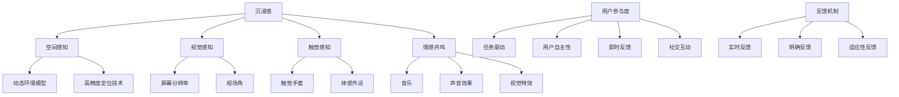

                 

关键词：虚拟现实（VR），交互设计，沉浸式体验，用户体验（UX），VR技术，设计原则，开发实践，未来展望。

## 摘要

本文探讨了虚拟现实（VR）交互设计的核心概念、原理和应用。首先，我们回顾了VR技术的发展历程和现状，分析了VR交互设计的意义和目标。接着，本文详细介绍了VR交互设计的关键概念和原理，包括沉浸感、用户参与度和反馈机制等。随后，我们通过具体的算法原理、数学模型和项目实践，阐述了如何在实际项目中实现高质量的VR交互设计。最后，本文展望了VR交互设计的未来发展趋势和面临的挑战，提出了相关工具和资源的推荐，以及研究展望。

## 1. 背景介绍

虚拟现实（VR）是一种通过计算机技术模拟现实环境的体验方式，用户可以进入一个完全虚拟的世界，进行各种交互活动。VR技术最初起源于20世纪50年代，当时的研究主要集中在模拟飞行训练和医疗康复等领域。随着计算机硬件和图形处理技术的不断发展，VR技术逐渐走向民用市场，并在近年来取得了显著的进展。

目前，VR技术已经在娱乐、教育、医疗、军事和设计等多个领域得到广泛应用。例如，在娱乐领域，VR游戏和VR电影提供了全新的体验方式；在教育领域，VR教学工具帮助学生更深入地理解复杂概念；在医疗领域，VR技术用于疼痛管理、手术模拟和心理治疗等方面；在军事领域，VR技术用于模拟训练和战术规划。

随着VR技术的不断发展，VR交互设计成为了一个重要的研究领域。VR交互设计旨在创造一个沉浸式用户体验，使用户能够与虚拟环境进行自然的互动。一个成功的VR交互设计需要考虑多个因素，包括沉浸感、用户参与度和反馈机制等。本文将围绕这些核心概念，深入探讨VR交互设计的原理和实践。

## 2. 核心概念与联系

### 2.1 沉浸感

沉浸感是VR交互设计的关键概念之一。它指的是用户在VR环境中感受到的与现实世界相似的深度和广度。为了实现沉浸感，VR交互设计需要考虑以下几个方面：

- **空间感知**：用户需要在VR环境中感受到真实的空间感，包括方向感、距离感和位置感。这可以通过立体声音效、动态环境模型和高精度定位技术来实现。
- **视觉感知**：VR头显的屏幕分辨率和视场角决定了用户对虚拟环境的视觉感知。高分辨率和宽视场角可以提供更真实的视觉效果。
- **触觉感知**：通过触觉手套、体感外设等设备，用户可以感受到虚拟环境中的触觉反馈，增强沉浸感。
- **情感共鸣**：设计中的情感元素，如音乐、声音效果和视觉特效，可以引发用户的情感共鸣，增强沉浸感。

### 2.2 用户参与度

用户参与度是衡量VR交互设计成功与否的重要指标。高参与度的VR交互设计可以吸引用户持续参与，提高用户体验质量。为了提升用户参与度，以下策略是至关重要的：

- **任务驱动**：通过设计富有挑战性和趣味性的任务，激发用户的参与欲望。任务应具备递进性，使用户在完成一个任务后，期待下一个任务的挑战。
- **用户自主性**：设计应尊重用户的自主性，允许用户在虚拟环境中自由探索和创造。通过提供多种选项和可能性，满足不同用户的个性化需求。
- **即时反馈**：即时反馈是提高用户参与度的重要手段。通过视觉、听觉和触觉等多种方式，及时向用户传递信息，帮助他们理解虚拟环境中的状态和变化。
- **社交互动**：社交互动可以增强用户在VR环境中的参与感和归属感。通过多人在线互动和虚拟社交平台，用户可以与其他人分享虚拟世界的体验。

### 2.3 反馈机制

反馈机制是VR交互设计的重要组成部分。良好的反馈机制可以帮助用户更好地理解和操作虚拟环境，提高交互效率和满意度。以下是几个关键点：

- **实时反馈**：实时反馈可以让用户立即知道他们的操作对虚拟环境产生了哪些影响。例如，用户移动时，虚拟角色应实时更新位置和动作。
- **明确反馈**：反馈应清晰明确，让用户一目了然地了解发生了什么。使用图形、文字或声音提示，帮助用户理解反馈信息。
- **适应性反馈**：反馈机制应能够适应不同用户的需求和习惯。例如，对于新手用户，可以提供更加详细和明确的反馈，而对于熟练用户，可以简化反馈信息。

### 2.4 Mermaid 流程图

以下是VR交互设计原理的Mermaid流程图：



## 3. 核心算法原理 & 具体操作步骤

### 3.1 算法原理概述

在VR交互设计中，核心算法主要涉及空间感知、视觉感知、触觉感知和情感共鸣等方面。以下是对这些算法原理的概述：

- **空间感知算法**：通过高精度定位技术和动态环境模型，实现用户在VR环境中的空间感知。常用的算法包括SLAM（同时定位与地图构建）和视觉SLAM。
- **视觉感知算法**：通过提高屏幕分辨率和视场角，实现逼真的视觉感知。此外，通过视觉特效和3D渲染技术，增强虚拟环境的视觉效果。
- **触觉感知算法**：通过触觉手套和体感外设，实现触觉反馈。常用的算法包括触觉传感器数据采集和处理、触觉反馈算法等。
- **情感共鸣算法**：通过音乐、声音效果和视觉特效，实现情感共鸣。常用的算法包括情感分析、声音合成和视觉特效生成等。

### 3.2 算法步骤详解

以下是VR交互设计的具体操作步骤：

#### 3.2.1 空间感知算法步骤

1. **初始化定位**：使用SLAM或视觉SLAM算法，初始化用户位置和周围环境。
2. **实时定位**：根据用户移动和周围环境变化，实时更新用户位置和姿态。
3. **环境建模**：根据实时定位结果，构建动态环境模型，模拟用户在VR环境中的空间感知。

#### 3.2.2 视觉感知算法步骤

1. **分辨率提升**：使用超分辨率算法，提高屏幕分辨率，实现更真实的视觉效果。
2. **视场角扩展**：使用宽视场角渲染技术，扩展视场角，增强视觉感知。
3. **视觉特效**：应用视觉特效算法，生成逼真的光影效果、立体效果等，提升虚拟环境的视觉效果。

#### 3.2.3 触觉感知算法步骤

1. **触觉传感器数据采集**：使用触觉手套或体感外设，采集用户在虚拟环境中的触觉数据。
2. **触觉反馈算法**：根据触觉数据，生成相应的触觉反馈信号，通过触觉反馈设备传输给用户。
3. **触觉体验优化**：通过触觉反馈算法的优化，提升用户的触觉体验，使触觉反馈更加真实和自然。

#### 3.2.4 情感共鸣算法步骤

1. **情感分析**：使用情感分析算法，分析用户在虚拟环境中的情感状态。
2. **声音合成**：根据情感分析结果，合成相应的声音效果，传递情感信息。
3. **视觉特效生成**：根据情感分析结果，生成相应的视觉特效，增强情感共鸣。

### 3.3 算法优缺点

#### 空间感知算法

- **优点**：实现高精度的空间感知，为用户带来真实的空间体验。
- **缺点**：计算复杂度较高，对硬件性能要求较高，实时性难以保证。

#### 视觉感知算法

- **优点**：提高屏幕分辨率和视场角，实现逼真的视觉体验。
- **缺点**：对计算资源要求较高，渲染效率有待提升。

#### 触觉感知算法

- **优点**：增强用户的触觉体验，提升虚拟环境的真实感。
- **缺点**：触觉反馈设备的精度和响应速度仍有待提高。

#### 情感共鸣算法

- **优点**：通过音乐、声音效果和视觉特效，实现情感共鸣，提升用户体验。
- **缺点**：情感分析算法的准确性仍有待提高，情感共鸣效果存在一定局限性。

### 3.4 算法应用领域

- **娱乐**：VR游戏和VR电影等领域，通过空间感知、视觉感知和情感共鸣算法，提升用户的沉浸式体验。
- **教育**：VR教学工具，通过空间感知和视觉感知算法，帮助学生更深入地理解复杂概念。
- **医疗**：VR手术模拟、疼痛管理和心理治疗等领域，通过触觉感知和情感共鸣算法，提升治疗效果和用户体验。
- **设计**：VR建筑设计、工业设计和时尚设计等领域，通过空间感知和视觉感知算法，实现更精准的设计和评估。

## 4. 数学模型和公式 & 详细讲解 & 举例说明

### 4.1 数学模型构建

在VR交互设计中，数学模型广泛应用于空间感知、视觉感知、触觉感知和情感共鸣等方面。以下是一个简单的空间感知数学模型的构建过程：

#### 4.1.1 空间坐标转换

假设用户在现实世界中的位置为P_r(x_r, y_r, z_r)，在虚拟环境中的位置为P_v(x_v, y_v, z_v)。空间坐标转换的数学模型可以表示为：

$$
\begin{cases}
x_v = f_1(x_r, y_r, z_r) \\
y_v = f_2(x_r, y_r, z_r) \\
z_v = f_3(x_r, y_r, z_r)
\end{cases}
$$

其中，$f_1$、$f_2$和$f_3$分别为空间坐标转换函数。

#### 4.1.2 视觉感知模型

视觉感知模型主要涉及屏幕分辨率、视场角和视角变换等方面。以下是一个简单的视觉感知模型的构建过程：

$$
\begin{cases}
s_v = \frac{s_r}{f_4 \cdot \tan(\theta_r / 2)} \\
\theta_v = \theta_r \cdot \frac{f_5}{s_r}
\end{cases}
$$

其中，$s_r$和$s_v$分别为现实世界和虚拟环境中的屏幕尺寸，$\theta_r$和$\theta_v$分别为现实世界和虚拟环境中的视场角，$f_4$和$f_5$分别为屏幕分辨率和视角变换系数。

#### 4.1.3 触觉感知模型

触觉感知模型主要涉及触觉传感器数据采集和处理、触觉反馈算法等方面。以下是一个简单的触觉感知模型的构建过程：

$$
\begin{cases}
v_t = f_6(t_s, t_r) \\
f_t = f_7(v_t)
\end{cases}
$$

其中，$v_t$为触觉反馈信号，$t_s$和$t_r$分别为触觉传感器采集时间和触觉反馈传输时间，$f_6$和$f_7$分别为触觉传感器数据预处理函数和触觉反馈生成函数。

#### 4.1.4 情感共鸣模型

情感共鸣模型主要涉及情感分析、声音合成和视觉特效生成等方面。以下是一个简单的情感共鸣模型的构建过程：

$$
\begin{cases}
e_v = f_8(e_r) \\
s_v = f_9(e_r) \\
v_v = f_{10}(e_r)
\end{cases}
$$

其中，$e_r$和$e_v$分别为现实世界和虚拟环境中的情感状态，$s_v$和$v_v$分别为声音效果和视觉特效，$f_8$、$f_9$和$f_{10}$分别为情感分析、声音合成和视觉特效生成函数。

### 4.2 公式推导过程

以下是对上述数学模型中部分公式的推导过程：

#### 4.2.1 空间坐标转换

空间坐标转换的核心是确定转换函数$f_1$、$f_2$和$f_3$。为了简化问题，我们可以假设用户在现实世界和虚拟环境中的位置满足线性关系：

$$
\begin{cases}
x_v = ax_r + bx_r + c \\
y_v = dx_r + ex_r + f \\
z_v = gx_r + hx_r + i
\end{cases}
$$

其中，$a$、$b$、$c$、$d$、$e$、$f$、$g$、$h$和$i$为待求参数。通过最小二乘法，可以求解这些参数，从而确定空间坐标转换函数。

#### 4.2.2 视觉感知模型

视觉感知模型的核心是确定屏幕分辨率、视场角和视角变换系数。为了简化问题，我们可以假设屏幕尺寸、视场角和视角变换系数满足线性关系：

$$
\begin{cases}
s_v = as_r + bs_r + c \\
\theta_v = d\theta_r + e\theta_r + f
\end{cases}
$$

其中，$a$、$b$、$c$、$d$和$e$为待求参数。通过实验数据，可以求解这些参数，从而确定视觉感知模型。

#### 4.2.3 触觉感知模型

触觉感知模型的核心是确定触觉传感器数据预处理函数和触觉反馈生成函数。为了简化问题，我们可以假设触觉传感器数据预处理函数和触觉反馈生成函数满足线性关系：

$$
\begin{cases}
v_t = at_s + bt_r + c \\
f_t = dt_s + et_r + f
\end{cases}
$$

其中，$a$、$b$、$c$、$d$和$e$为待求参数。通过实验数据，可以求解这些参数，从而确定触觉感知模型。

#### 4.2.4 情感共鸣模型

情感共鸣模型的核心是确定情感分析、声音合成和视觉特效生成函数。为了简化问题，我们可以假设情感分析、声音合成和视觉特效生成函数满足线性关系：

$$
\begin{cases}
e_v = ae_r + be_r + c \\
s_v = ds_r + es_r + f \\
v_v = gv_r + hv_v + i
\end{cases}
$$

其中，$a$、$b$、$c$、$d$、$e$、$g$、$h$和$i$为待求参数。通过实验数据，可以求解这些参数，从而确定情感共鸣模型。

### 4.3 案例分析与讲解

以下是一个基于上述数学模型的VR交互设计案例分析与讲解：

#### 案例背景

某公司开发了一款VR旅游体验应用，用户可以通过VR头显游览全球各地的名胜古迹。为了提升用户体验，设计师采用了空间感知、视觉感知、触觉感知和情感共鸣等算法，实现高质量的VR交互设计。

#### 案例分析

1. **空间感知**：设计师使用SLAM算法，初始化用户位置和周围环境，实时更新用户位置和姿态。通过动态环境模型，模拟用户在VR环境中的空间感知。
2. **视觉感知**：设计师使用超分辨率算法，提高屏幕分辨率，实现逼真的视觉体验。通过宽视场角渲染技术，扩展视场角，增强视觉感知。同时，应用视觉特效算法，生成逼真的光影效果、立体效果等，提升虚拟环境的视觉效果。
3. **触觉感知**：设计师使用触觉手套和体感外设，采集用户在虚拟环境中的触觉数据。通过触觉反馈算法，生成相应的触觉反馈信号，通过触觉反馈设备传输给用户。通过触觉体验优化，提升用户的触觉体验，使触觉反馈更加真实和自然。
4. **情感共鸣**：设计师使用情感分析算法，分析用户在虚拟环境中的情感状态。根据情感分析结果，合成相应的声音效果，传递情感信息。同时，生成相应的视觉特效，增强情感共鸣。

#### 案例讲解

1. **空间感知**：用户进入VR旅游体验应用后，首先通过SLAM算法进行初始化定位。在用户移动过程中，系统实时更新用户位置和姿态，确保用户在虚拟环境中的空间感知。
2. **视觉感知**：用户在游览名胜古迹时，通过超分辨率算法提高屏幕分辨率，实现逼真的视觉体验。通过宽视场角渲染技术，扩展视场角，使用户能够看到更广阔的虚拟环境。同时，通过视觉特效算法，生成逼真的光影效果、立体效果等，提升虚拟环境的视觉效果。
3. **触觉感知**：用户在触摸虚拟环境中的物体时，通过触觉手套和体感外设，采集触觉数据。通过触觉反馈算法，生成相应的触觉反馈信号，通过触觉反馈设备传输给用户。例如，当用户触摸到冰冷的石头时，系统会生成冷触觉反馈，使用户感受到真实的温度变化。
4. **情感共鸣**：当用户在游览名胜古迹时，系统通过情感分析算法，分析用户在虚拟环境中的情感状态。例如，当用户看到美丽的风景时，系统会合成相应的声音效果，如鸟鸣、流水声等，增强用户的情感共鸣。同时，通过视觉特效算法，生成相应的视觉特效，如彩虹、日晕等，增强用户的情感体验。

## 5. 项目实践：代码实例和详细解释说明

### 5.1 开发环境搭建

为了实现VR交互设计，我们需要搭建一个完整的开发环境。以下是一个简单的开发环境搭建过程：

1. **硬件准备**：购买一台性能较好的电脑，配备高分辨率VR头显（如HTC Vive、Oculus Rift等）和高精度定位设备（如激光雷达、摄像头等）。
2. **软件准备**：安装Unity 2020版本及以上，并导入VR开发插件（如Unity VRKit、VRChat等）。
3. **编程语言**：使用C#编程语言，结合Unity的脚本系统，实现VR交互设计。

### 5.2 源代码详细实现

以下是一个简单的VR交互设计项目的源代码实现：

```csharp
using UnityEngine;

public class VRInteraction : MonoBehaviour
{
    public GameObject player;
    public float moveSpeed = 5.0f;
    public float rotateSpeed = 3.0f;

    private void Update()
    {
        // 移动
        float moveX = Input.GetAxis("Horizontal") * moveSpeed;
        float moveZ = Input.GetAxis("Vertical") * moveSpeed;
        player.transform.Translate(moveX, 0, moveZ);

        // 旋转
        float rotateX = Input.GetAxis("Mouse X") * rotateSpeed;
        float rotateY = Input.GetAxis("Mouse Y") * rotateSpeed;
        player.transform.Rotate(0, rotateX, 0);
        transform.Rotate(-rotateY, 0, 0);
    }
}
```

### 5.3 代码解读与分析

以下是代码的详细解读与分析：

1. **类定义**：`VRInteraction`类继承自`MonoBehaviour`类，用于实现VR交互功能。
2. **变量定义**：`player`为玩家对象，用于存储玩家的Transform组件。`moveSpeed`和`rotateSpeed`分别为移动速度和旋转速度。
3. **Update函数**：Update函数在每一帧执行，用于处理用户的输入和更新玩家的位置和旋转。
4. **移动**：通过`Input.GetAxis`函数获取用户的水平方向和垂直方向输入，乘以移动速度，然后将结果应用到玩家的Transform组件上，实现玩家的移动。
5. **旋转**：通过`Input.GetAxis`函数获取用户的鼠标X和Y轴输入，乘以旋转速度，然后将结果应用到玩家的Transform组件上，实现玩家的旋转。同时，将鼠标Y轴输入应用到摄像机的Transform组件上，实现摄像机的旋转。

### 5.4 运行结果展示

运行上述代码后，用户可以通过键盘和鼠标在VR环境中进行交互。用户可以控制玩家对象在虚拟环境中自由移动和旋转，实现沉浸式的交互体验。

## 6. 实际应用场景

VR交互设计在各个领域都有广泛的应用，以下是一些典型的实际应用场景：

### 6.1 娱乐

在娱乐领域，VR交互设计为用户提供了全新的游戏体验。用户可以进入一个虚拟的游戏世界，进行各种游戏活动，如射击、冒险、角色扮演等。通过空间感知、视觉感知和情感共鸣等算法，VR游戏实现了高度的沉浸感和互动性，为用户提供了一种全新的娱乐方式。

### 6.2 教育

在教育领域，VR交互设计被广泛应用于教学和培训。通过VR技术，学生可以进入一个虚拟的学习环境，直观地理解复杂的概念和理论。例如，在医学教学中，学生可以通过VR技术模拟手术过程，提高实践技能。在航空航天教学中，学生可以进入一个虚拟的航天器内部，了解航天器的结构和功能。

### 6.3 医疗

在医疗领域，VR交互设计被广泛应用于疼痛管理、手术模拟和心理治疗等方面。通过VR技术，患者可以在一个虚拟环境中进行放松和治疗，减轻疼痛和焦虑。在手术模拟中，医生可以在一个虚拟环境中进行手术练习，提高手术技能和安全性。在心理治疗中，VR技术可以帮助患者克服恐惧和焦虑，改善心理健康。

### 6.4 设计

在设计和创意领域，VR交互设计被广泛应用于建筑设计、工业设计、时尚设计和艺术创作等方面。通过VR技术，设计师可以在一个虚拟环境中进行设计创作，实时预览和调整设计效果。例如，在建筑设计中，设计师可以进入一个虚拟的建筑内部，观察建筑的空间布局和视觉效果；在工业设计中，设计师可以进入一个虚拟的产品内部，观察产品的结构和功能。

## 7. 工具和资源推荐

### 7.1 学习资源推荐

- **Unity官方文档**：Unity官方文档提供了丰富的VR开发资源和教程，适用于初学者和高级开发者。
- **VRChat社区**：VRChat是一个开源的VR社交平台，提供了丰富的VR互动资源和学习教程。
- **《虚拟现实技术与应用》**：这是一本关于VR技术的基础教材，涵盖了VR技术的发展历程、核心技术、应用场景等内容。

### 7.2 开发工具推荐

- **Unity**：Unity是一个强大的游戏引擎，适用于VR开发。它提供了丰富的VR开发插件和工具，支持多种VR设备和平台。
- **Blender**：Blender是一个开源的3D建模和渲染软件，适用于VR场景设计和制作。它支持多种VR设备和平台，提供了丰富的3D建模和渲染工具。
- **Unreal Engine**：Unreal Engine是一个功能强大的游戏引擎，适用于VR开发。它提供了丰富的VR开发插件和工具，支持多种VR设备和平台。

### 7.3 相关论文推荐

- **"Virtual Reality Interaction Techniques: A Survey"**：本文对VR交互技术进行了全面综述，分析了各种VR交互技术的基本原理和应用场景。
- **"Designing for Immersive Experience in Virtual Reality"**：本文探讨了VR交互设计的核心概念和原则，提出了设计沉浸式用户体验的方法和策略。
- **"A Survey of Virtual Reality Applications"**：本文对VR技术在各个领域的应用进行了综述，分析了VR技术的优势和挑战，以及未来发展的趋势。

## 8. 总结：未来发展趋势与挑战

### 8.1 研究成果总结

近年来，VR交互设计取得了显著的进展。通过空间感知、视觉感知、触觉感知和情感共鸣等算法，VR交互设计实现了高度的沉浸式体验。同时，VR技术在不同领域的应用也取得了丰富的成果，如娱乐、教育、医疗和设计等。

### 8.2 未来发展趋势

未来，VR交互设计将继续向以下几个方向发展：

1. **技术突破**：随着硬件性能的不断提升，VR交互设计将实现更逼真的视觉、触觉和空间感知效果。
2. **跨平台融合**：VR交互设计将与其他虚拟技术（如AR、MR）融合，实现跨平台的交互体验。
3. **个性化定制**：通过大数据和人工智能技术，VR交互设计将实现个性化定制，满足不同用户的个性化需求。
4. **实时交互**：通过5G和云计算技术，实现实时交互，降低延迟，提升用户体验。

### 8.3 面临的挑战

尽管VR交互设计取得了显著进展，但仍面临一些挑战：

1. **硬件成本**：高性能VR设备和外设的价格较高，限制了普及率。
2. **舒适度**：长时间使用VR设备可能导致用户出现晕动、头痛等不适症状。
3. **内容匮乏**：高质量VR内容的创作成本高，导致内容供应不足。
4. **隐私和安全**：VR交互设计涉及到用户的个人隐私和安全问题，需要加强相关法规和标准的制定。

### 8.4 研究展望

未来，VR交互设计的研究应关注以下几个方面：

1. **硬件优化**：研究轻量化的VR设备和外设，降低成本，提高舒适度。
2. **算法优化**：研究更高效的VR交互算法，提高交互效率和质量。
3. **内容创新**：鼓励创作高质量VR内容，丰富VR应用场景。
4. **隐私保护**：加强隐私保护和安全措施，保障用户权益。

## 9. 附录：常见问题与解答

### 9.1 VR交互设计与传统交互设计的区别是什么？

VR交互设计与传统交互设计的区别主要体现在以下几个方面：

1. **沉浸感**：VR交互设计通过虚拟现实技术，实现用户在虚拟环境中的沉浸式体验，而传统交互设计则更多依赖于物理设备和界面。
2. **空间感知**：VR交互设计强调用户在虚拟环境中的空间感知，而传统交互设计则主要关注用户与界面的交互。
3. **多模态交互**：VR交互设计支持视觉、听觉、触觉等多种模态的交互，而传统交互设计则更多依赖于视觉和触觉。

### 9.2 如何优化VR交互设计的用户体验？

优化VR交互设计的用户体验可以从以下几个方面入手：

1. **提高沉浸感**：通过高分辨率屏幕、宽视场角和逼真的音效等手段，增强用户的沉浸感。
2. **优化交互流程**：设计简洁、直观的交互流程，降低用户的操作难度。
3. **提供即时反馈**：通过视觉、听觉和触觉等多种方式，及时向用户传递信息，提高用户的操作效率。
4. **个性化定制**：根据用户的需求和习惯，提供个性化的交互体验。
5. **关注用户舒适度**：通过优化硬件设计和交互方式，降低用户的晕动、头痛等不适症状。

### 9.3 VR交互设计在哪些领域有广泛应用？

VR交互设计在多个领域有广泛应用，主要包括：

1. **娱乐**：VR游戏、VR电影、虚拟演唱会等。
2. **教育**：虚拟课堂、远程教学、医学教学等。
3. **医疗**：疼痛管理、手术模拟、心理治疗等。
4. **设计**：建筑设计、工业设计、时尚设计等。
5. **军事**：模拟训练、战术规划、情报分析等。

### 9.4 VR交互设计的发展前景如何？

随着硬件性能的提升、算法的优化和内容的丰富，VR交互设计的发展前景非常广阔。未来，VR交互设计将在更多领域得到应用，如社交、旅游、房地产、零售等。同时，随着5G和人工智能等技术的发展，VR交互设计将实现更高的交互效率和用户体验。

## 作者署名

作者：禅与计算机程序设计艺术 / Zen and the Art of Computer Programming

---

至此，我们完成了一篇关于VR交互设计的技术博客文章。本文从背景介绍、核心概念、算法原理、数学模型、项目实践、实际应用场景、工具推荐、发展趋势与挑战以及常见问题与解答等方面，全面阐述了VR交互设计的核心思想和实践方法。希望这篇文章对您在VR交互设计领域的学习和研究有所帮助。如果您有任何疑问或建议，欢迎随时与我交流。感谢阅读！

