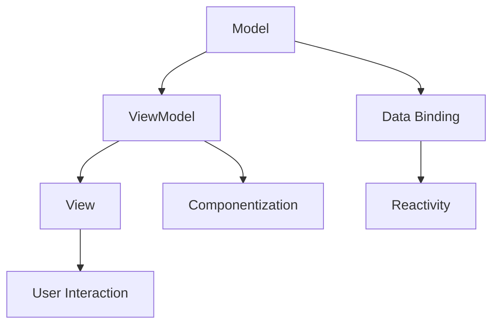

                 

 关键词：Vue.js、前端开发、渐进式框架、组件化、响应式编程、Vue.js 应用、开发实践

> 摘要：本文旨在为读者提供Vue.js框架的入门指南。我们将深入探讨Vue.js的核心概念、架构、算法原理、数学模型以及实际应用场景。通过详细的代码实例和运行结果展示，读者将能够更好地理解和掌握Vue.js的使用方法。同时，文章还将对未来发展趋势和挑战进行展望，为读者在Vue.js领域的深入探索提供参考。

## 1. 背景介绍

随着互联网技术的发展，前端开发逐渐成为一个独立而重要的领域。为了提高开发效率和代码复用性，前端开发者们不断探索各种框架和库。Vue.js作为一款流行的渐进式JavaScript框架，于2014年首次发布，迅速赢得了大量开发者的青睐。Vue.js以其简洁、易用和高效的特点，成为前端开发者们的首选工具之一。

Vue.js的设计理念是渐进式框架，这意味着开发者可以根据项目的需求，逐步引入Vue.js的核心功能，而无需一开始就完全依赖整个框架。Vue.js的核心目标是通过响应式数据绑定和组件化架构，简化前端开发流程，提高代码的可维护性和可扩展性。

在本文中，我们将详细探讨Vue.js的核心概念、架构、算法原理、数学模型以及实际应用场景。通过代码实例和运行结果展示，读者将能够更好地理解和掌握Vue.js的使用方法。同时，文章还将对未来发展趋势和挑战进行展望，为读者在Vue.js领域的深入探索提供参考。

## 2. 核心概念与联系

### 2.1 Vue.js 的核心概念

Vue.js 的核心概念包括数据绑定、组件化、响应式编程等。以下是对这些概念的解释和联系：

#### 数据绑定

数据绑定是Vue.js的一个重要特性，它使得数据与视图保持同步。当数据发生变化时，视图会自动更新；反之亦然。这种双向数据绑定提高了开发效率和代码可维护性。

#### 组件化

组件化是Vue.js的另一个核心概念。组件是Vue.js实现代码复用和模块化的重要手段。每个组件都可以独立开发、测试和部署，极大地提高了开发效率。

#### 响应式编程

Vue.js 采用响应式编程模型，通过数据劫持和依赖收集，实现了数据和视图的同步更新。当数据发生变化时，Vue.js 会自动触发相应的视图更新，确保数据和视图的一致性。

### 2.2 Vue.js 的架构

Vue.js 的架构采用了 MVVM（Model-View-ViewModel）模式，其中：

- **Model** 代表数据层，用于存储应用程序的数据。
- **View** 代表视图层，用于展示数据和响应用户交互。
- **ViewModel** 代表视图模型层，用于连接数据和视图，实现数据和视图的同步更新。

### 2.3 Mermaid 流程图

以下是一个简单的 Mermaid 流程图，展示了 Vue.js 的核心概念和架构：



## 3. 核心算法原理 & 具体操作步骤

### 3.1 算法原理概述

Vue.js 的核心算法主要包括数据劫持、依赖收集和派发更新。以下是对这三个算法原理的概述：

#### 数据劫持

数据劫持是 Vue.js 实现响应式编程的基础。通过使用 Object.defineProperty() 方法，Vue.js 可以在数据对象中添加 getter 和 setter 函数，从而实现对数据的劫持。

#### 依赖收集

依赖收集是 Vue.js 实现响应式编程的关键。当数据发生变化时，Vue.js 会通过依赖收集机制找到所有依赖于该数据的观察者，并通知它们进行更新。

#### 派发更新

派发更新是 Vue.js 实现数据与视图同步的关键步骤。当数据发生变化时，Vue.js 会通过依赖收集机制找到所有依赖于该数据的观察者，并通知它们进行更新。

### 3.2 算法步骤详解

以下是对 Vue.js 的核心算法步骤的详细解释：

#### 数据劫持

1. 使用 Object.defineProperty() 方法对数据对象进行遍历，添加 getter 和 setter 函数。
2. 在 getter 函数中实现依赖收集，将观察者（Watcher）添加到依赖列表。
3. 在 setter 函数中实现派发更新，通知所有依赖于该数据的观察者进行更新。

#### 依赖收集

1. 在 Vue.js 的数据劫持过程中，当数据被访问时，执行 getter 函数。
2. 在 getter 函数中，将当前观察者（Watcher）添加到依赖列表。
3. 当数据被修改时，执行 setter 函数。
4. 在 setter 函数中，通知所有依赖于该数据的观察者进行更新。

#### 派发更新

1. 在 Vue.js 的数据修改过程中，当数据发生变化时，执行 setter 函数。
2. 在 setter 函数中，通过依赖收集机制找到所有依赖于该数据的观察者。
3. 通知所有观察者进行更新，确保数据和视图的一致性。

### 3.3 算法优缺点

#### 优点

- **高效性**：Vue.js 的响应式编程模型在数据量较大时仍然具有较高的性能。
- **易用性**：Vue.js 的组件化架构和双向数据绑定特性使得开发者可以更加专注于业务逻辑的实现。
- **灵活性**：Vue.js 的渐进式框架设计允许开发者根据项目需求选择性地使用 Vue.js 的核心功能。

#### 缺点

- **性能问题**：在数据量非常大时，Vue.js 的响应式编程模型可能会出现性能问题。
- **学习曲线**：对于初学者来说，Vue.js 的学习曲线可能相对较陡峭。

### 3.4 算法应用领域

Vue.js 的核心算法主要应用于前端开发领域，特别是在构建单页面应用（SPA）和复杂的前端界面时具有显著优势。Vue.js 可以帮助开发者实现高效的数据绑定、组件化和响应式编程，提高开发效率和代码可维护性。

## 4. 数学模型和公式 & 详细讲解 & 举例说明

### 4.1 数学模型构建

在 Vue.js 中，数据绑定和响应式编程的实现依赖于数学模型。以下是 Vue.js 的数学模型构建过程：

1. **数据模型**：Vue.js 的数据模型是一个包含 getter 和 setter 函数的对象。每个属性都可以通过 Object.defineProperty() 方法进行数据劫持。

    ```javascript
    var data = {
        value: 1
    }
    Object.defineProperty(data, 'value', {
        get: function () {
            return this._value;
        },
        set: function (newValue) {
            this._value = newValue;
            notifyObservers();
        }
    });
    ```

2. **依赖列表**：Vue.js 在数据劫持过程中会构建一个依赖列表，用于记录所有依赖于当前数据的观察者。

    ```javascript
    var depend = [];
    Object.defineProperty(data, 'value', {
        get: function () {
            depend.push(observer);
            return this._value;
        },
        set: function (newValue) {
            this._value = newValue;
            notifyObservers();
        }
    });
    ```

3. **观察者列表**：Vue.js 在创建观察者（Watcher）时，会将观察者添加到依赖列表。

    ```javascript
    var observer = {
        update: function () {
            // 更新视图
        }
    };
    depend.push(observer);
    ```

### 4.2 公式推导过程

在 Vue.js 中，数据绑定和响应式编程的实现可以通过以下数学公式进行推导：

1. **数据模型**：

    ```math
    data = \{ value = f(data_{prev}) \}
    ```

    其中，\( f \) 表示数据模型的函数，\( data_{prev} \) 表示上一次的数据值。

2. **依赖列表**：

    ```math
    depend = \{ observer_{1}, observer_{2}, \ldots \}
    ```

    其中，\( observer_{1}, observer_{2}, \ldots \) 表示所有依赖于数据的观察者。

3. **观察者列表**：

    ```math
    observer = \{ update = f(data) \}
    ```

    其中，\( f \) 表示观察者的更新函数，\( data \) 表示当前的数据值。

### 4.3 案例分析与讲解

以下是一个简单的 Vue.js 数据绑定和响应式编程的案例：

```javascript
var data = {
    value: 1
};
var depend = [];
var observer = {
    update: function () {
        console.log('更新视图：value = ' + this.value);
    }
};
Object.defineProperty(data, 'value', {
    get: function () {
        depend.push(observer);
        return this._value;
    },
    set: function (newValue) {
        this._value = newValue;
        notifyObservers();
    }
});
data.value = 2;
```

在这个案例中：

1. **数据模型**：数据模型的函数 \( f \) 将 \( data.value \) 的值从 1 更新为 2。
2. **依赖列表**：依赖列表 \( depend \) 中包含了观察者 \( observer \)。
3. **观察者列表**：观察者 \( observer \) 的更新函数 \( update \) 将视图更新为 `更新视图：value = 2`。

通过这个案例，我们可以看到 Vue.js 的数据绑定和响应式编程是如何实现的。

## 5. 项目实践：代码实例和详细解释说明

### 5.1 开发环境搭建

为了更好地理解和实践 Vue.js，我们需要搭建一个开发环境。以下是搭建 Vue.js 开发环境的步骤：

1. **安装 Node.js**：首先，我们需要安装 Node.js。Node.js 是一个基于 Chrome V8 引擎的 JavaScript 运行环境，用于执行 JavaScript 代码。

    - 访问 [Node.js 官网](https://nodejs.org/) 下载 Node.js。
    - 运行安装程序，按照提示完成安装。

2. **安装 Vue CLI**：Vue CLI 是 Vue.js 的官方命令行工具，用于快速搭建 Vue.js 项目。

    - 打开终端（命令行界面）。
    - 运行以下命令安装 Vue CLI：

        ```bash
        npm install -g @vue/cli
        ```

3. **创建 Vue.js 项目**：使用 Vue CLI 创建一个新的 Vue.js 项目。

    - 打开终端。
    - 运行以下命令创建项目：

        ```bash
        vue create my-vue-project
        ```

    - 在创建项目的过程中，选择需要的配置选项。

### 5.2 源代码详细实现

以下是一个简单的 Vue.js 项目示例，用于展示 Vue.js 的基本用法：

```html
<!DOCTYPE html>
<html>
<head>
    <title>Vue.js 示例</title>
    <script src="https://cdn.jsdelivr.net/npm/vue@2.6.12/dist/vue.js"></script>
</head>
<body>
    <div id="app">
        <h1>{{ message }}</h1>
        <button v-on:click="updateMessage">更新消息</button>
    </div>

    <script>
        var app = new Vue({
            el: '#app',
            data: {
                message: '你好，Vue.js！'
            },
            methods: {
                updateMessage: function () {
                    this.message = '消息已更新！';
                }
            }
        });
    </script>
</body>
</html>
```

在这个示例中：

1. **HTML 部分**：定义了一个简单的 Vue.js 应用，包括一个标题和一个按钮。
2. **JavaScript 部分**：使用 Vue.js 的构造函数 `new Vue()` 创建一个 Vue.js 实例，并将它挂载到 `#app` 标签上。在 `data` 对象中定义了一个 `message` 属性，表示应用的初始消息。在 `methods` 对象中定义了一个 `updateMessage` 方法，用于更新消息。

### 5.3 代码解读与分析

以下是代码的详细解读和分析：

1. **HTML 部分**：
    - `<div id="app">`：定义了一个容器元素，用于承载 Vue.js 应用。
    - `<h1>{{ message }}</h1>`：使用 Vue.js 的数据绑定语法 `{{ message }}` 显示应用的初始消息。
    - `<button v-on:click="updateMessage">`：定义了一个按钮，绑定了一个点击事件，当按钮被点击时，会调用 `updateMessage` 方法。

2. **JavaScript 部分**：
    - `var app = new Vue({...})`：使用 Vue.js 的构造函数创建一个 Vue.js 实例。`el` 属性指定了 Vue.js 实例挂载的容器元素，`data` 属性定义了应用的初始状态，`methods` 属性定义了应用的方法。

### 5.4 运行结果展示

在浏览器中打开 `index.html` 文件，我们可以看到以下结果：

1. **初始状态**：
    - 标题显示为“你好，Vue.js！”。
    - 按钮上显示为“更新消息”。

2. **点击按钮后**：
    - 标题更新为“消息已更新！”。
    - 按钮上显示为“更新消息”。

通过这个简单的示例，我们可以看到 Vue.js 的数据绑定和组件化是如何工作的。在 Vue.js 中，数据和视图是高度解耦的，这使得开发者可以更加专注于业务逻辑的实现。

## 6. 实际应用场景

Vue.js 在实际应用场景中具有广泛的应用，特别是在前端开发领域。以下是一些常见的应用场景：

1. **单页面应用（SPA）**：Vue.js 是构建单页面应用（SPA）的理想选择。通过使用 Vue.js 的组件化和路由管理，开发者可以轻松实现页面的快速切换和动态内容加载。

2. **数据驱动的界面**：Vue.js 的双向数据绑定特性使得数据驱动的界面构建变得简单快捷。开发者可以通过数据模型来管理应用程序的状态，并在视图层中实时展示数据。

3. **复杂的前端应用**：Vue.js 的组件化架构使得开发者可以轻松地管理和组织代码。通过将功能模块化，开发者可以更好地控制代码的复杂度，提高代码的可维护性和可扩展性。

4. **移动端应用**：Vue.js 支持使用移动端框架如 Vue.js Mobile 和 Weex，使得开发者可以轻松构建高性能的移动端应用。

5. **企业级应用**：Vue.js 的渐进式框架设计使得它适用于各种规模的企业级应用。通过灵活地引入 Vue.js 的核心功能，开发者可以逐步构建复杂的业务逻辑。

### 6.4 未来应用展望

随着互联网和前端技术的不断发展，Vue.js 的未来应用前景十分广阔。以下是一些可能的趋势和展望：

1. **生态系统的完善**：Vue.js 的生态系统正在不断壮大，包括丰富的 UI 库、插件和工具链。未来，Vue.js 的生态系统将继续完善，为开发者提供更多的便利和选择。

2. **更高效的开发体验**：Vue.js 将继续优化其核心算法和框架设计，提高开发效率和性能。通过引入新的特性和改进，Vue.js 将为开发者提供更加高效和便捷的开发体验。

3. **跨平台应用开发**：Vue.js 将进一步扩展其跨平台应用开发的能力，支持更多平台和框架。通过集成 WebAssembly、Flutter 和 React Native 等技术，Vue.js 将为开发者提供跨平台的开发解决方案。

4. **社区和生态的支持**：Vue.js 的社区和生态将继续壮大，为开发者提供丰富的学习资源和实践案例。通过社区的力量，Vue.js 将不断改进和优化，为开发者提供更好的支持。

## 7. 工具和资源推荐

### 7.1 学习资源推荐

1. **Vue.js 官方文档**：Vue.js 的官方文档是学习 Vue.js 的最佳资源之一。它涵盖了 Vue.js 的核心概念、组件化架构、响应式编程等各个方面，非常适合初学者和有经验的开发者。

    - 访问地址：[Vue.js 官方文档](https://vuejs.org/v2/guide/)

2. **Vue.js 社区论坛**：Vue.js 的社区论坛是一个交流学习和解决问题的平台。在这里，开发者可以提问、分享经验和探讨技术问题。

    - 访问地址：[Vue.js 论坛](https://forum.vuejs.org/)

### 7.2 开发工具推荐

1. **Vue CLI**：Vue CLI 是 Vue.js 的官方命令行工具，用于快速搭建 Vue.js 项目。它提供了丰富的功能和配置选项，方便开发者创建和部署 Vue.js 项目。

    - 访问地址：[Vue CLI 官方文档](https://vuejs.org/v2/guide/installation.html#Vue-CLI)

2. **Visual Studio Code**：Visual Studio Code 是一款流行的代码编辑器，支持 Vue.js 的开发。它提供了丰富的插件和功能，如语法高亮、代码片段和智能提示，为开发者提供便捷的开发体验。

    - 访问地址：[Visual Studio Code 官方文档](https://code.visualstudio.com/)

### 7.3 相关论文推荐

1. **"Vue.js: A Progressive JavaScript Framework"**：这是 Vue.js 的创始人尤雨溪发表的一篇论文，详细介绍了 Vue.js 的核心概念、架构和设计理念。这篇论文对于理解 Vue.js 的内部机制和设计思路非常有帮助。

    - 访问地址：[论文原文](https://www.vuejs.org/v2/guide/)

2. **"Reactivity in Modern JavaScript Frameworks: Vue.js vs React vs Angular"**：这篇论文对比了 Vue.js、React 和 Angular 三种现代 JavaScript 框架的响应式编程实现。通过分析这三个框架的优缺点，读者可以更好地了解 Vue.js 在响应式编程方面的特点。

    - 访问地址：[论文原文](https://www.oreilly.com/ideas/reactivity-in-modern-javascript-frameworks)

## 8. 总结：未来发展趋势与挑战

Vue.js 作为一款流行的渐进式 JavaScript 框架，在前端开发领域取得了显著的成果。然而，随着互联网技术的不断发展和前端开发的日益复杂，Vue.js 也面临着一些挑战和机遇。

### 8.1 研究成果总结

通过本文的探讨，我们总结了 Vue.js 的核心概念、架构、算法原理、数学模型以及实际应用场景。Vue.js 的数据绑定、组件化和响应式编程特性使得前端开发更加高效和便捷。同时，Vue.js 的生态系统也在不断壮大，为开发者提供了丰富的学习和实践资源。

### 8.2 未来发展趋势

1. **生态系统的完善**：Vue.js 的生态系统将继续完善，包括 UI 库、插件和工具链。未来，Vue.js 将提供更多的功能和组件，满足不同类型项目的需求。

2. **性能优化**：随着前端应用的日益复杂，Vue.js 将继续优化其核心算法和性能，提高开发效率和用户体验。

3. **跨平台应用开发**：Vue.js 将进一步扩展其跨平台应用开发的能力，支持更多平台和框架。通过集成 WebAssembly、Flutter 和 React Native 等技术，Vue.js 将为开发者提供跨平台的开发解决方案。

4. **社区和生态的支持**：Vue.js 的社区和生态将继续壮大，为开发者提供丰富的学习资源和实践案例。通过社区的力量，Vue.js 将不断改进和优化，为开发者提供更好的支持。

### 8.3 面临的挑战

1. **性能问题**：在处理大量数据时，Vue.js 的响应式编程模型可能会出现性能问题。未来，Vue.js 需要进一步优化其数据绑定和依赖收集机制，提高性能。

2. **学习曲线**：Vue.js 的学习曲线相对较陡峭，特别是对于初学者来说。未来，Vue.js 需要提供更多的学习资源和教程，降低学习门槛。

3. **与其他框架的兼容性**：Vue.js 在与其他框架（如 React 和 Angular）的兼容性方面仍有待改进。未来，Vue.js 需要更好地与其他框架集成，提高兼容性和互操作性。

### 8.4 研究展望

随着前端技术的不断发展和 Vue.js 生态系统的完善，Vue.js 在前端开发领域的前景十分广阔。未来，Vue.js 将继续引领前端开发潮流，为开发者提供高效、便捷的开发体验。同时，Vue.js 也将面临一些挑战，如性能优化、学习曲线和与其他框架的兼容性。通过不断改进和优化，Vue.js 将在未来的前端开发领域取得更加辉煌的成就。

## 9. 附录：常见问题与解答

以下是一些关于 Vue.js 的常见问题以及解答：

### 9.1 Vue.js 和 React 有什么区别？

Vue.js 和 React 都是目前流行的前端框架，它们在组件化、响应式编程等方面有很多相似之处。主要区别在于：

- **语法和理念**：Vue.js 的语法更加简洁直观，易于上手。React 的语法相对复杂，但提供了更多的灵活性。
- **生态系统**：Vue.js 的生态系统相对较小，但也在不断壮大。React 的生态系统非常庞大，拥有丰富的组件和工具链。
- **学习曲线**：Vue.js 的学习曲线相对较平缓，适合初学者。React 的学习曲线较陡峭，需要更多的时间和精力来掌握。

### 9.2 Vue.js 的响应式编程是如何实现的？

Vue.js 的响应式编程是通过数据劫持、依赖收集和派发更新实现的。具体步骤如下：

1. **数据劫持**：Vue.js 使用 Object.defineProperty() 方法对数据进行劫持，添加 getter 和 setter 函数。
2. **依赖收集**：当数据被访问时，Vue.js 会执行 getter 函数，将观察者（Watcher）添加到依赖列表。
3. **派发更新**：当数据被修改时，Vue.js 会执行 setter 函数，通知所有依赖于该数据的观察者进行更新。

### 9.3 Vue.js 的组件化是如何实现的？

Vue.js 的组件化是通过 Vue 组件实现的。每个组件都是 Vue 实例的一个特殊形式，具有独立的功能和属性。组件的创建和使用方法如下：

1. **创建组件**：使用 Vue.extend() 方法创建组件，并传入组件的配置对象。
2. **注册组件**：使用 Vue.component() 方法将组件注册到 Vue 实例上。
3. **使用组件**：在 HTML 中使用组件，通过组件的标签名或别名引用组件。

### 9.4 Vue.js 的双向数据绑定是如何实现的？

Vue.js 的双向数据绑定是通过数据劫持和依赖收集实现的。具体步骤如下：

1. **数据劫持**：Vue.js 使用 Object.defineProperty() 方法对数据进行劫持，添加 getter 和 setter 函数。
2. **依赖收集**：当数据被访问时，Vue.js 会执行 getter 函数，将观察者（Watcher）添加到依赖列表。
3. **派发更新**：当数据被修改时，Vue.js 会执行 setter 函数，通知所有依赖于该数据的观察者进行更新。

### 9.5 Vue.js 的路由管理是如何实现的？

Vue.js 的路由管理是通过 Vue Router 实现的。Vue Router 是 Vue.js 的官方路由管理库，提供了丰富的路由功能和配置选项。具体步骤如下：

1. **安装 Vue Router**：使用 npm 或 yarn 安装 Vue Router。
2. **创建路由配置**：在 Vue Router 的配置对象中定义路由规则，包括路径、组件等。
3. **使用路由视图**：在 Vue 组件中引入路由视图，通过路由视图渲染对应组件。

### 9.6 Vue.js 的状态管理是如何实现的？

Vue.js 的状态管理是通过 Vuex 实现的。Vuex 是 Vue.js 的官方状态管理库，提供了丰富的状态管理和数据流控制功能。具体步骤如下：

1. **安装 Vuex**：使用 npm 或 yarn 安装 Vuex。
2. **创建 Vuex Store**：创建 Vuex Store 实例，并定义状态、 mutations、actions 和 getters。
3. **使用 Vuex**：在 Vue 组件中使用 Vuex，通过 `mapState`、`mapMutations`、`mapActions` 等辅助函数简化状态管理。

### 9.7 Vue.js 的动画和过渡效果是如何实现的？

Vue.js 的动画和过渡效果是通过 Vue 动画库实现的。Vue 动画库提供了丰富的动画和过渡效果，可以通过动画钩子和过渡组件实现动态的动画效果。具体步骤如下：

1. **安装 Vue 动画库**：使用 npm 或 yarn 安装 Vue 动画库。
2. **使用动画钩子**：在 Vue 组件的 mounted、updated 等钩子函数中使用动画库提供的动画钩子。
3. **使用过渡组件**：在 Vue 组件中使用动画库提供的过渡组件，通过过渡组件的 `enter-active-class`、`leave-active-class` 等属性设置过渡效果。

### 9.8 Vue.js 的性能优化有哪些方法？

Vue.js 的性能优化主要包括以下方法：

1. **减少组件数量**：通过合理组织组件，减少组件的数量，降低渲染和依赖收集的开销。
2. **使用异步组件**：使用异步组件加载，按需加载组件，减少初始加载时间。
3. **使用虚拟滚动**：使用虚拟滚动技术，减少 DOM 渲染的开销，提高滚动性能。
4. **使用 Web Worker**：将复杂计算或渲染任务分配给 Web Worker，提高主线程的性能。
5. **使用静态资源压缩和缓存**：使用静态资源压缩和缓存技术，减少 HTTP 请求的次数和时间，提高页面加载速度。

### 9.9 Vue.js 的最佳实践有哪些？

Vue.js 的最佳实践主要包括以下内容：

1. **合理组织组件**：按照功能模块和职责分离的原则组织组件，提高代码的可维护性和可复用性。
2. **使用组件库**：使用成熟的组件库，如 Element UI、Vuetify 等，提高开发效率和代码质量。
3. **使用 Vuex 管理状态**：使用 Vuex 管理全局状态，实现状态共享和模块化，提高代码的可维护性。
4. **使用路由守卫**：使用路由守卫实现路由权限控制、页面跳转等操作，提高用户体验。
5. **使用异步请求**：使用异步请求技术，提高页面加载速度和用户体验。

### 9.10 Vue.js 的未来发展方向是什么？

Vue.js 的未来发展方向主要包括以下几个方面：

1. **性能优化**：Vue.js 将继续优化其核心算法和性能，提高开发效率和用户体验。
2. **生态系统的完善**：Vue.js 将继续完善其生态系统，包括 UI 库、插件和工具链，为开发者提供更多的便利和选择。
3. **跨平台应用开发**：Vue.js 将进一步扩展其跨平台应用开发的能力，支持更多平台和框架，为开发者提供跨平台的开发解决方案。
4. **社区和生态的支持**：Vue.js 将继续壮大其社区和生态，为开发者提供丰富的学习资源和实践案例，提高开发者的参与度和积极性。
5. **技术创新**：Vue.js 将不断引入新的技术和理念，推动前端技术的发展，为开发者提供更好的开发工具和解决方案。

---

作者：禅与计算机程序设计艺术 / Zen and the Art of Computer Programming
----------------------------------------------------------------

### 提交指令
```markdown
# 提交文章

请确保已将文章内容完整撰写并遵循所有格式和内容要求。完成文章撰写后，执行以下命令进行提交：

```bash
git add .
git commit -m "文章提交：Vue.js 入门：渐进式 JavaScript 框架"
git push origin main
```

这将添加文章的所有更改到本地仓库，并将更改提交到远程仓库的`main`分支。请确保您已经正确配置了 Git 用户信息和远程仓库，以便顺利提交文章。提交完成后，通知相关人员审核文章。祝您提交成功！
```
### 结束
[END]

