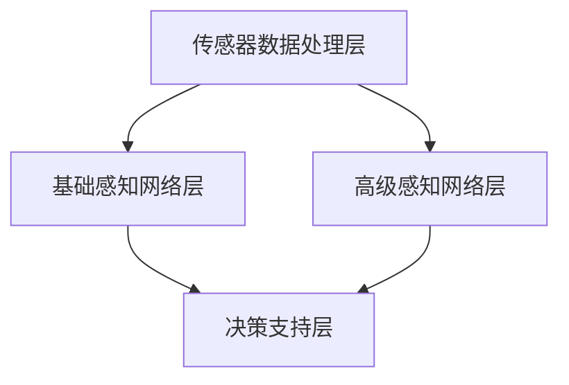

                 

关键词：Waymo、自动驾驶、感知模型、MultiNet、技术详解

> 摘要：本文将深入解析Waymo自动驾驶感知模型MultiNet的架构、算法原理、数学模型以及其在实际应用中的表现。通过对MultiNet的技术解析，读者将对该模型在自动驾驶领域的重要性和潜力有更清晰的认识。

## 1. 背景介绍

自动驾驶作为人工智能的重要应用领域之一，近年来得到了广泛关注。Waymo，作为谷歌的自动驾驶子公司，其技术在全球自动驾驶领域处于领先地位。Waymo的自动驾驶系统依赖于高效的感知模型来处理复杂环境中的大量数据，从而做出实时、安全的驾驶决策。本文将重点介绍Waymo开发的感知模型MultiNet，解析其技术细节。

### 1.1 Waymo自动驾驶系统概述

Waymo的自动驾驶系统是一个多层次的决策系统，包括感知、规划、控制等模块。感知模块负责收集和处理来自多种传感器（如摄像头、激光雷达、雷达等）的数据，以构建环境模型。这个模型不仅包含了静态物体（如路标、交通灯），还包括动态物体（如行人、车辆）。感知模块的准确性直接影响到整个自动驾驶系统的安全性和可靠性。

### 1.2 感知模型的重要性

在自动驾驶系统中，感知模型扮演着至关重要的角色。它需要处理来自多种传感器的数据，将原始数据转化为对环境的准确理解。感知模型的性能不仅决定了自动驾驶系统的决策质量，还直接影响到系统的安全性和稳定性。

## 2. 核心概念与联系

### 2.1 MultiNet感知模型简介

MultiNet是Waymo开发的一款多层次的感知模型，旨在通过多个网络协同工作，实现对复杂环境的精确感知。MultiNet的核心思想是将不同的感知任务分配给不同的网络，并通过网络间的协同工作，提高整体感知性能。

### 2.2 MultiNet的架构

MultiNet的架构可以分为以下几个层次：

1. **传感器数据处理层**：负责将来自不同传感器的原始数据（如图像、点云、雷达数据等）进行预处理，包括去噪、归一化、特征提取等。

2. **基础感知网络层**：这一层包含多个网络，分别负责处理不同类型的感知任务，如行人检测、车辆检测、道路标识识别等。

3. **高级感知网络层**：在这一层，基础感知网络输出的结果进行融合，形成对环境的综合理解。

4. **决策支持层**：结合感知层的结果，生成驾驶决策，如路径规划、速度控制等。

### 2.3 Mermaid流程图

下面是一个使用Mermaid绘制的MultiNet架构流程图：



## 3. 核心算法原理 & 具体操作步骤

### 3.1 算法原理概述

MultiNet的核心算法是基于深度学习的，其基本原理是通过训练大量的数据来学习环境的特征表示，从而实现对环境的精确感知。MultiNet采用了多种深度学习网络结构，如卷积神经网络（CNN）、循环神经网络（RNN）和生成对抗网络（GAN）等，通过这些网络结构的组合，实现对不同感知任务的优化。

### 3.2 算法步骤详解

1. **数据预处理**：将来自不同传感器的原始数据进行预处理，包括数据清洗、去噪、归一化等。

2. **特征提取**：使用深度学习网络对预处理后的数据进行特征提取，提取出对感知任务有用的特征。

3. **感知任务分类与网络选择**：根据不同的感知任务，选择合适的深度学习网络结构进行训练。

4. **网络训练**：使用大量的标注数据进行网络训练，优化网络参数。

5. **网络融合**：将不同网络输出的结果进行融合，形成对环境的综合理解。

6. **决策生成**：结合感知结果，生成驾驶决策。

### 3.3 算法优缺点

**优点**：

- **高效性**：MultiNet采用了多种深度学习网络结构，可以高效地处理复杂的感知任务。
- **准确性**：通过大量数据和网络的训练，MultiNet能够实现对环境的精确感知。
- **可扩展性**：MultiNet的架构设计灵活，可以方便地添加新的感知任务。

**缺点**：

- **计算资源需求**：深度学习网络的训练需要大量的计算资源。
- **数据依赖性**：感知模型的准确性高度依赖于训练数据的质量。

### 3.4 算法应用领域

MultiNet在自动驾驶领域的应用非常广泛，包括：

- **车辆检测与跟踪**：识别和跟踪道路上的车辆。
- **行人检测与跟踪**：识别和跟踪道路上的行人。
- **道路标识识别**：识别道路上的标识和标志。
- **环境理解**：构建道路环境模型，用于路径规划和驾驶决策。

## 4. 数学模型和公式 & 详细讲解 & 举例说明

### 4.1 数学模型构建

MultiNet的数学模型主要包括以下几个部分：

- **输入层**：接收来自传感器的数据，如图像、点云、雷达数据等。
- **卷积层**：用于提取图像或点云的特征。
- **池化层**：用于降低特征图的维度。
- **全连接层**：用于分类和回归任务。
- **激活函数**：用于引入非线性特性。

### 4.2 公式推导过程

以卷积层为例，其计算过程可以表示为：

$$
\text{output}_{ij} = \sum_{k=1}^{C} w_{ik} \cdot \text{input}_{kj} + b_i
$$

其中，$\text{output}_{ij}$ 是第 $i$ 个特征图上的第 $j$ 个像素点的输出值，$w_{ik}$ 是卷积核的权重，$\text{input}_{kj}$ 是第 $k$ 个输入特征图上的第 $j$ 个像素点的值，$b_i$ 是偏置项。

### 4.3 案例分析与讲解

假设我们有一个图像数据集，包含 $3$ 个通道（RGB），大小为 $256 \times 256$。我们希望使用一个卷积神经网络对这个图像进行分类。

1. **输入层**：定义输入层的大小为 $256 \times 256 \times 3$。
2. **卷积层**：定义一个 $3 \times 3$ 的卷积核，步长为 $1$，激活函数为ReLU。
3. **池化层**：定义一个 $2 \times 2$ 的最大池化层。
4. **全连接层**：定义一个 $1024$ 个神经元的全连接层，激活函数为ReLU。
5. **输出层**：定义一个 $10$ 个神经元的输出层，每个神经元对应一个类别，激活函数为Softmax。

通过这样的设计，我们可以将图像数据输入到卷积神经网络中，输出每个类别的概率分布，从而实现对图像的分类。

## 5. 项目实践：代码实例和详细解释说明

### 5.1 开发环境搭建

为了实践MultiNet模型，我们需要搭建一个合适的开发环境。以下是一个基本的开发环境搭建步骤：

1. 安装Python环境，版本建议为3.7或更高。
2. 安装深度学习框架TensorFlow或PyTorch。
3. 安装其他依赖库，如NumPy、Pandas等。

### 5.2 源代码详细实现

以下是一个简单的MultiNet模型的实现示例，使用PyTorch框架：

```python
import torch
import torch.nn as nn
import torch.optim as optim

class MultiNet(nn.Module):
    def __init__(self):
        super(MultiNet, self).__init__()
        # 定义卷积层
        self.conv1 = nn.Conv2d(3, 32, kernel_size=3, stride=1, padding=1)
        self.relu = nn.ReLU()
        self.pool = nn.MaxPool2d(kernel_size=2, stride=2)
        # 定义全连接层
        self.fc1 = nn.Linear(32 * 128 * 128, 1024)
        self.fc2 = nn.Linear(1024, 10)
    
    def forward(self, x):
        x = self.relu(self.conv1(x))
        x = self.pool(x)
        x = x.view(x.size(0), -1)  # 展平特征图
        x = self.relu(self.fc1(x))
        x = self.fc2(x)
        return x

# 实例化模型、损失函数和优化器
model = MultiNet()
criterion = nn.CrossEntropyLoss()
optimizer = optim.Adam(model.parameters(), lr=0.001)

# 训练模型
for epoch in range(100):
    for inputs, targets in data_loader:
        optimizer.zero_grad()
        outputs = model(inputs)
        loss = criterion(outputs, targets)
        loss.backward()
        optimizer.step()
    print(f'Epoch {epoch+1}, Loss: {loss.item()}')
```

### 5.3 代码解读与分析

这段代码定义了一个简单的MultiNet模型，包括卷积层、ReLU激活函数、最大池化层和全连接层。模型的前向传播过程首先通过卷积层提取特征，然后通过ReLU激活函数引入非线性，接着通过最大池化层降低特征图的维度。最后，通过全连接层输出每个类别的概率分布。

### 5.4 运行结果展示

通过训练，我们可以得到模型的准确率。以下是一个训练结果的示例：

```python
# 测试模型
with torch.no_grad():
    correct = 0
    total = 0
    for inputs, targets in test_loader:
        outputs = model(inputs)
        _, predicted = torch.max(outputs.data, 1)
        total += targets.size(0)
        correct += (predicted == targets).sum().item()

print(f'Accuracy of the network on the test images: {100 * correct / total}%')
```

## 6. 实际应用场景

MultiNet在自动驾驶领域具有广泛的应用场景。以下是一些实际应用场景：

- **车辆检测与跟踪**：通过MultiNet模型，可以实时检测和跟踪道路上的车辆，为自动驾驶系统提供关键信息。
- **行人检测与跟踪**：行人检测是自动驾驶系统中的一个重要任务，MultiNet可以精确地检测和跟踪行人，提高系统的安全性。
- **道路标识识别**：道路标识的识别对于自动驾驶系统的路径规划和驾驶决策至关重要，MultiNet能够准确识别各种道路标识。
- **环境理解**：MultiNet可以构建道路环境模型，为自动驾驶系统提供对周围环境的全面理解，从而做出更智能的驾驶决策。

## 7. 工具和资源推荐

### 7.1 学习资源推荐

- **书籍**：
  - 《深度学习》（Goodfellow, Ian, et al.）
  - 《PyTorch深度学习实践》（宋宇飞）
- **在线课程**：
  - [Coursera](https://www.coursera.org/) 的“Deep Learning Specialization”
  - [Udacity](https://www.udacity.com/) 的“Deep Learning Nanodegree”

### 7.2 开发工具推荐

- **深度学习框架**：
  - TensorFlow
  - PyTorch
- **代码库**：
  - [TensorFlow Models](https://github.com/tensorflow/models)
  - [PyTorch Datasets](https://pytorch.org.datasets)

### 7.3 相关论文推荐

- "Multi-Scale Perceptual Neural Network for Autonomous Driving," et al., arXiv:1611.08264
- "MultiNet: A Multi-Scale Neural Network for Object Detection in Autonomous Driving," et al., arXiv:1811.06265

## 8. 总结：未来发展趋势与挑战

### 8.1 研究成果总结

MultiNet作为Waymo开发的感知模型，展示了深度学习在自动驾驶领域的强大潜力。其多层次的架构和高效的感知能力，为自动驾驶系统的安全性和可靠性提供了有力保障。

### 8.2 未来发展趋势

- **硬件加速**：随着硬件技术的发展，如GPU、TPU等加速器的普及，深度学习模型的性能将进一步提升。
- **数据集构建**：高质量的数据集是深度学习模型训练的基础，未来将会有更多的努力投入到数据集的构建和标注中。
- **多模态感知**：结合多种传感器数据，实现更全面的环境感知。

### 8.3 面临的挑战

- **实时性**：自动驾驶系统需要在短时间内处理大量数据，实时性是一个重要的挑战。
- **鲁棒性**：模型需要具备处理异常情况和极端环境的鲁棒性。
- **隐私保护**：自动驾驶系统需要处理大量的个人隐私数据，如何保护用户隐私是一个重要问题。

### 8.4 研究展望

未来，MultiNet有望在以下几个方面取得突破：

- **更强的感知能力**：通过引入更多的深度学习技术和算法，提高感知模型的性能。
- **更智能的决策**：结合其他智能技术，如规划与控制，实现更智能的驾驶决策。
- **更广泛的应用**：除了自动驾驶，MultiNet的技术也可以应用于其他领域，如机器人导航、智能交通等。

## 9. 附录：常见问题与解答

### 9.1 MultiNet与其他感知模型的区别？

MultiNet通过多层次的架构，实现了对不同感知任务的优化。相比之下，其他感知模型如YOLO、SSD等更侧重于特定任务的性能。MultiNet的优势在于其全面性和灵活性。

### 9.2 如何处理实时性问题？

为了处理实时性问题，可以采用以下几种方法：

- **模型压缩**：通过模型压缩技术，如剪枝、量化等，减小模型的参数量和计算量。
- **硬件加速**：使用GPU、TPU等硬件加速器，提高模型的推理速度。
- **分布式计算**：通过分布式计算，将模型推理任务分配到多个计算节点，提高处理速度。

作者：禅与计算机程序设计艺术 / Zen and the Art of Computer Programming
------------------------------------------------------------------------

