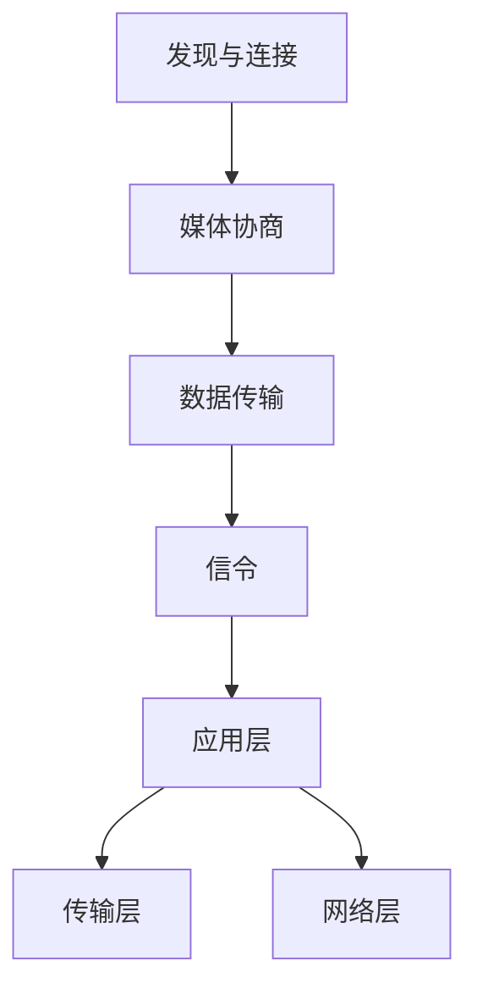

                 

关键词：WebRTC、实时通信、互动功能、浏览器、媒体流、数据通道、网络性能

## 摘要

本文旨在深入探讨WebRTC（Web Real-Time Communication）协议在实际应用中，特别是在浏览器环境中实现实时互动功能的技术细节。通过介绍WebRTC的核心概念、工作原理、算法以及其在不同场景下的应用，本文为开发者提供了一套完整的指南，以实现高效、可靠的实时通信功能。

## 1. 背景介绍

随着互联网技术的发展，实时通信逐渐成为人们日常生活和工作中的重要组成部分。从在线会议、视频聊天到实时协作工具，实时通信的需求在不断提升。WebRTC协议的出现，为浏览器提供了实现实时通信的强大功能。

WebRTC是一个开放项目，旨在提供简单、快速、安全的实时通信。它不需要任何插件或特殊的客户端配置，只需要浏览器支持即可。WebRTC的核心目标是在任何设备上实现高质量的实时音视频通信和数据传输。

WebRTC的关键特点包括：

- **跨平台性**：WebRTC可以在各种操作系统和设备上运行，包括桌面电脑、移动设备等。
- **无需插件**：与传统的实时通信解决方案不同，WebRTC无需安装任何插件，只需通过浏览器即可实现通信。
- **高质量**：WebRTC采用了先进的编解码技术，确保音视频通信的质量。
- **安全性**：WebRTC提供了端到端加密和媒体流加密，保障通信的安全性。

## 2. 核心概念与联系

### 2.1 WebRTC的工作原理

WebRTC的工作原理可以概括为以下几个步骤：

1. **发现与连接**：WebRTC首先需要发现对等节点，即通信的另一方。这可以通过STUN（Session Traversal Utilities for NAT）、TURN（Traversal Using Relays around NAT）或STUN/TURN组合实现。
2. **媒体协商**：通过SDP（Session Description Protocol）进行媒体协商，包括音视频编解码器、传输协议等。
3. **数据传输**：通过RTP（Real-time Transport Protocol）进行音视频数据的传输，并通过SRTP（Secure RTP）进行加密。
4. **信令**：WebRTC使用信令机制来协调媒体流的参数，确保通信的顺利进行。

### 2.2 WebRTC的架构

WebRTC的架构可以分为三层：

1. **应用层**：提供WebRTC应用程序的开发接口，包括媒体流、数据通道等。
2. **传输层**：负责数据传输的协议，包括RTP、RTCP等。
3. **网络层**：负责网络连接和信令的协议，包括STUN、TURN、DTLS（Datagram Transport Layer Security）和SRTP。

下面是一个简单的Mermaid流程图，展示了WebRTC的核心流程和组件：



## 3. 核心算法原理 & 具体操作步骤

### 3.1 算法原理概述

WebRTC的核心算法主要包括NAT穿透、信令、媒体协商和加密。

- **NAT穿透**：由于NAT（网络地址转换）的存在，对等节点之间可能无法直接通信。WebRTC通过STUN、TURN等技术实现NAT穿透，确保对等节点可以建立连接。
- **信令**：WebRTC使用信令机制来传递会话描述信息，包括媒体类型、编解码器、传输协议等。信令通常通过HTTP/HTTPS协议进行传输。
- **媒体协商**：通过SDP协议进行媒体协商，确保通信双方使用的编解码器、传输协议等参数一致。
- **加密**：WebRTC使用DTLS和SRTP进行数据传输的加密，保障通信的安全性。

### 3.2 算法步骤详解

#### 3.2.1 NAT穿透

1. **STUN发现**：客户端发送STUN请求到STUN服务器，获取自己的公网IP地址和端口号。
2. **NAT映射表更新**：STUN服务器将客户端的公网IP地址和端口号添加到NAT映射表中。
3. **STUN回显**：客户端发送STUN回显请求，验证NAT映射表是否正确。

#### 3.2.2 信令

1. **创建信令通道**：WebRTC应用程序通过HTTP/HTTPS协议创建信令通道。
2. **发送会话描述**：一方将SDP会话描述发送到另一方。
3. **确认会话描述**：另一方确认接收到的会话描述，并返回自己的SDP会话描述。

#### 3.2.3 媒体协商

1. **发送SDP**：双方通过信令通道交换SDP会话描述。
2. **协商编解码器**：根据对方提供的SDP信息，选择合适的编解码器。
3. **初始化媒体流**：根据协商结果，初始化音视频媒体流。

#### 3.2.4 加密

1. **生成密钥对**：双方生成一对密钥，用于加密通信。
2. **交换密钥**：通过信令通道交换密钥。
3. **加密通信**：使用DTLS和SRTP协议进行数据传输的加密。

### 3.3 算法优缺点

#### 优缺点

**优点**：

- **跨平台性**：WebRTC可以在各种操作系统和设备上运行。
- **无需插件**：WebRTC无需安装任何插件，使用方便。
- **高质量**：WebRTC采用先进的编解码技术，保障音视频质量。
- **安全性**：WebRTC提供端到端加密和媒体流加密，保障通信安全性。

**缺点**：

- **复杂度**：WebRTC的架构较为复杂，实现难度较高。
- **兼容性**：WebRTC的兼容性问题仍然存在，并非所有浏览器都完全支持。

### 3.4 算法应用领域

WebRTC广泛应用于以下领域：

- **视频会议**：企业、教育、医疗等行业。
- **在线教育**：实时互动教学、在线问答等。
- **直播**：实时视频直播、游戏直播等。
- **实时协作**：多人在线协作、远程办公等。

## 4. 数学模型和公式 & 详细讲解 & 举例说明

### 4.1 数学模型构建

WebRTC的核心数学模型主要包括NAT穿透模型、信令模型和加密模型。

#### NAT穿透模型

NAT穿透模型涉及的主要数学模型是STUN协议。STUN协议通过发送请求和回显来获取客户端的公网IP地址和端口号，进而构建NAT映射表。

$$
\text{STUN Request} \rightarrow \text{STUN Server} \rightarrow \text{STUN Response}
$$

#### 信令模型

信令模型涉及的主要数学模型是SDP协议。SDP协议通过发送和接收会话描述来协商媒体流的参数。

$$
\text{SDP Offer} \rightarrow \text{SDP Answer}
$$

#### 加密模型

加密模型涉及的主要数学模型是DTLS协议。DTLS协议通过生成密钥对、交换密钥来实现数据传输的加密。

$$
\text{Key Generation} \rightarrow \text{Key Exchange} \rightarrow \text{Encrypted Transmission}
$$

### 4.2 公式推导过程

#### NAT穿透模型

STUN协议的工作过程可以简化为以下步骤：

1. **客户端发送STUN请求**：客户端发送一个STUN请求，其中包含客户端的公网IP地址和端口号。
2. **STUN服务器响应**：STUN服务器接收到请求后，将其转发到客户端的公网IP地址和端口号，并返回一个STUN响应。
3. **客户端解析响应**：客户端接收到STUN响应后，解析其中的公网IP地址和端口号，更新NAT映射表。

#### 信令模型

SDP协议的工作过程可以简化为以下步骤：

1. **发送SDP Offer**：一方生成SDP Offer，包括媒体类型、编解码器、传输协议等，并将其发送给另一方。
2. **发送SDP Answer**：另一方接收到SDP Offer后，生成SDP Answer，选择合适的编解码器和传输协议，并将其发送回给另一方。

#### 加密模型

DTLS协议的工作过程可以简化为以下步骤：

1. **生成密钥对**：双方各自生成一个私钥和一个公钥。
2. **交换密钥**：双方通过信令通道交换公钥。
3. **加密通信**：使用交换得到的公钥和私钥对通信数据进行加密和解密。

### 4.3 案例分析与讲解

#### 案例背景

假设有两个客户端A和B，它们希望通过WebRTC进行实时通信。以下是具体的通信过程：

1. **NAT穿透**：
   - 客户端A发送STUN请求，获取自己的公网IP地址和端口号。
   - 客户端A发送STUN回显请求，验证NAT映射表是否正确。
   - 客户端B重复上述步骤。

2. **信令**：
   - 客户端A生成SDP Offer，包括H.264视频编解码器、RTP传输协议，并将其发送给客户端B。
   - 客户端B接收到SDP Offer后，生成SDP Answer，选择相同的H.264视频编解码器和RTP传输协议，并将其发送回客户端A。

3. **媒体协商**：
   - 客户端A和B根据SDP Answer初始化媒体流，准备进行数据传输。

4. **加密**：
   - 客户端A和B各自生成一个私钥和一个公钥。
   - 客户端A通过信令通道将公钥发送给客户端B。
   - 客户端B通过信令通道将公钥发送给客户端A。

5. **数据传输**：
   - 客户端A和B使用DTLS和SRTP协议进行数据传输的加密和解密，实现安全、可靠的实时通信。

## 5. 项目实践：代码实例和详细解释说明

### 5.1 开发环境搭建

#### 开发环境要求

- 操作系统：Windows、macOS、Linux
- 浏览器：Chrome、Firefox、Edge
- 开发工具：Visual Studio Code、Node.js、WebRTC SDK

#### 搭建步骤

1. 安装Node.js：访问[Node.js官网](https://nodejs.org/)，下载并安装对应操作系统的Node.js。
2. 安装WebRTC SDK：根据项目需求，选择合适的WebRTC SDK（如WebRTC.js、libwebrtc等），并按照官方文档进行安装。
3. 配置开发环境：在Visual Studio Code中创建项目，并安装必要的依赖包。

### 5.2 源代码详细实现

#### 源代码结构

```bash
-webrtc-sample
|-- index.html
|-- script.js
|-- webrtc.js
```

#### index.html

```html
<!DOCTYPE html>
<html lang="en">
<head>
    <meta charset="UTF-8">
    <meta name="viewport" content="width=device-width, initial-scale=1.0">
    <title>WebRTC 实时通信示例</title>
</head>
<body>
    <video id="localVideo" autoplay></video>
    <video id="remoteVideo" autoplay></video>
    <button id="connect">连接</button>
    <script src="webrtc.js"></script>
</body>
</html>
```

#### script.js

```javascript
const localVideo = document.getElementById('localVideo');
const remoteVideo = document.getElementById('remoteVideo');
const connectButton = document.getElementById('connect');

let peerConnection;
let localStream;

connectButton.addEventListener('click', () => {
    // 初始化PeerConnection
    peerConnection = new RTCPeerConnection({
        iceServers: [
            { urls: 'stun:stun.l.google.com:19302' },
            { urls: 'turn:turn.com:3478', username: 'myuser', credential: 'mypassword' }
        ]
    });

    // 添加本地媒体流
    localStream.getTracks().forEach(track => {
        peerConnection.addTrack(track, localStream);
    });

    // 监听远程媒体流
    peerConnection.addEventListener('track', (event) => {
        remoteVideo.srcObject = event.streams[0];
    });

    // 监听ICE候选
    peerConnection.addEventListener('icecandidate', (event) => {
        if (event.candidate) {
            // 将ICE候选发送给对方
            sendSignal('candidate', event.candidate);
        }
    });

    // 创建offer
    peerConnection.createOffer({
        offerToReceiveVideo: 1
    }).then((offer) => {
        return peerConnection.setLocalDescription(offer);
    }).then(() => {
        // 将offer发送给对方
        sendSignal('offer', peerConnection.localDescription);
    });
});

function sendSignal(type, signal) {
    // 通过信令服务器发送信号
    // ...
}

// 获取本地媒体流
function getLocalStream() {
    return navigator.mediaDevices.getUserMedia({
        audio: true,
        video: true
    }).then((stream) => {
        localVideo.srcObject = stream;
        return stream;
    });
}
```

#### webrtc.js

```javascript
// 引入WebRTC SDK
const webrtc = require('webrtc');

// 创建信令服务器
const server = webrtc.createServer({
    port: 12345
});

// 监听信令事件
server.on('signal', (socket, message) => {
    const peerConnection = new RTCPeerConnection({
        iceServers: [
            { urls: 'stun:stun.l.google.com:19302' },
            { urls: 'turn:turn.com:3478', username: 'myuser', credential: 'mypassword' }
        ]
    });

    // 监听ICE候选
    peerConnection.addEventListener('icecandidate', (event) => {
        if (event.candidate) {
            socket.emit('candidate', event.candidate);
        }
    });

    // 处理offer
    if (message.type === 'offer') {
        peerConnection.setRemoteDescription(new RTCSessionDescription(message.signal));
        peerConnection.createAnswer().then((answer) => {
            peerConnection.setLocalDescription(answer);
            socket.emit('answer', answer);
        });
    }

    // 处理answer
    if (message.type === 'answer') {
        peerConnection.setRemoteDescription(new RTCSessionDescription(message.signal));
    }

    // 处理candidate
    if (message.type === 'candidate') {
        peerConnection.addIceCandidate(new RTCIceCandidate(message.signal));
    }
});
```

### 5.3 代码解读与分析

```html
<!-- index.html -->
<!DOCTYPE html>
<html lang="en">
<head>
    <meta charset="UTF-8">
    <meta name="viewport" content="width=device-width, initial-scale=1.0">
    <title>WebRTC 实时通信示例</title>
</head>
<body>
    <video id="localVideo" autoplay></video>
    <video id="remoteVideo" autoplay></video>
    <button id="connect">连接</button>
    <script src="webrtc.js"></script>
</body>
</html>
```

这段代码定义了HTML页面结构，主要包括两个视频标签和一个按钮。视频标签用于显示本地视频流和远程视频流，按钮用于触发连接操作。

```javascript
// script.js
const localVideo = document.getElementById('localVideo');
const remoteVideo = document.getElementById('remoteVideo');
const connectButton = document.getElementById('connect');

let peerConnection;
let localStream;

connectButton.addEventListener('click', () => {
    // 初始化PeerConnection
    peerConnection = new RTCPeerConnection({
        iceServers: [
            { urls: 'stun:stun.l.google.com:19302' },
            { urls: 'turn:turn.com:3478', username: 'myuser', credential: 'mypassword' }
        ]
    });

    // 添加本地媒体流
    localStream.getTracks().forEach(track => {
        peerConnection.addTrack(track, localStream);
    });

    // 监听远程媒体流
    peerConnection.addEventListener('track', (event) => {
        remoteVideo.srcObject = event.streams[0];
    });

    // 监听ICE候选
    peerConnection.addEventListener('icecandidate', (event) => {
        if (event.candidate) {
            // 将ICE候选发送给对方
            sendSignal('candidate', event.candidate);
        }
    });

    // 创建offer
    peerConnection.createOffer({
        offerToReceiveVideo: 1
    }).then((offer) => {
        return peerConnection.setLocalDescription(offer);
    }).then(() => {
        // 将offer发送给对方
        sendSignal('offer', peerConnection.localDescription);
    });
});

function sendSignal(type, signal) {
    // 通过信令服务器发送信号
    // ...
}

// 获取本地媒体流
function getLocalStream() {
    return navigator.mediaDevices.getUserMedia({
        audio: true,
        video: true
    }).then((stream) => {
        localVideo.srcObject = stream;
        return stream;
    });
}
```

这段代码是JavaScript脚本部分，主要包括以下功能：

- 初始化`RTCPeerConnection`对象，并设置ICE服务器。
- 添加本地媒体流到`peerConnection`。
- 监听远程媒体流，更新`remoteVideo`标签。
- 监听ICE候选，并发送给对方。
- 创建offer，设置本地描述，并发送对方。

```javascript
// webrtc.js
const webrtc = require('webrtc');

// 创建信令服务器
const server = webrtc.createServer({
    port: 12345
});

// 监听信令事件
server.on('signal', (socket, message) => {
    const peerConnection = new RTCPeerConnection({
        iceServers: [
            { urls: 'stun:stun.l.google.com:19302' },
            { urls: 'turn:turn.com:3478', username: 'myuser', credential: 'mypassword' }
        ]
    });

    // 监听ICE候选
    peerConnection.addEventListener('icecandidate', (event) => {
        if (event.candidate) {
            socket.emit('candidate', event.candidate);
        }
    });

    // 处理offer
    if (message.type === 'offer') {
        peerConnection.setRemoteDescription(new RTCSessionDescription(message.signal));
        peerConnection.createAnswer().then((answer) => {
            peerConnection.setLocalDescription(answer);
            socket.emit('answer', answer);
        });
    }

    // 处理answer
    if (message.type === 'answer') {
        peerConnection.setRemoteDescription(new RTCSessionDescription(message.signal));
    }

    // 处理candidate
    if (message.type === 'candidate') {
        peerConnection.addIceCandidate(new RTCIceCandidate(message.signal));
    }
});
```

这段代码是WebRTC服务器端的实现，主要包括以下功能：

- 创建一个`RTCPeerConnection`对象。
- 监听ICE候选，并转发给客户端。
- 处理offer、answer和candidate消息。

### 5.4 运行结果展示

运行上述代码后，打开两个浏览器窗口，分别加载`index.html`页面。点击其中一个窗口的“连接”按钮，将显示本地视频流，并开始与对方建立连接。连接成功后，两个窗口将显示对方的视频流，实现实时通信。

## 6. 实际应用场景

### 6.1 视频会议

WebRTC在视频会议领域的应用非常广泛。通过WebRTC，企业、教育机构、医疗机构等可以轻松实现多人实时视频会议，提高工作效率和沟通效果。

### 6.2 在线教育

在线教育平台利用WebRTC实现实时互动教学，让学生和老师能够实时互动，提高学习效果。WebRTC使得在线教育更加生动、有趣，有助于提高学生的学习兴趣。

### 6.3 直播

直播平台采用WebRTC技术实现实时视频直播，用户可以实时观看直播内容，并进行互动评论。WebRTC的高质量和低延迟特性使得直播体验更加流畅。

### 6.4 实时协作

实时协作工具利用WebRTC实现多人实时协作，如多人在线编辑文档、实时共享屏幕等。WebRTC的实时数据传输能力为实时协作提供了强大支持。

## 7. 工具和资源推荐

### 7.1 学习资源推荐

- [WebRTC官网](https://www.webrtc.org/)
- [WebRTC.js官方文档](https://webrtc.org/getting-started/)
- [libwebrtc官方文档](https://github.com/node-webrtc/libwebrtc)

### 7.2 开发工具推荐

- [Visual Studio Code](https://code.visualstudio.com/)
- [Node.js](https://nodejs.org/)

### 7.3 相关论文推荐

- [WebRTC: A Protocol for Media Streaming over the Internet](https://www.ietf.org/rfc/rfc8839.txt)
- [A Guide to WebRTC](https://webrtc.org/experiments/trickle-ice/)
- [WebRTC for Mobile: A Developer’s Guide](https://www.oreilly.com/library/view/webRTC-for-mobile/9781449345027/)

## 8. 总结：未来发展趋势与挑战

### 8.1 研究成果总结

WebRTC作为实时通信领域的核心技术，已经在多个应用场景中得到广泛应用。其跨平台性、无需插件、高质量、安全性的特点使其成为开发者实现实时通信的首选技术。

### 8.2 未来发展趋势

随着5G、人工智能等技术的发展，WebRTC在未来将会有更广泛的应用。例如，在5G网络环境下，WebRTC可以实现更低延迟、更高带宽的实时通信，为实时游戏、虚拟现实等应用提供技术支持。

### 8.3 面临的挑战

尽管WebRTC具有很多优点，但仍然面临一些挑战：

- **兼容性**：不同浏览器和操作系统的WebRTC实现存在差异，可能导致兼容性问题。
- **安全性**：WebRTC的安全性问题仍然需要关注，如防止DDoS攻击、数据泄露等。
- **性能优化**：在低带宽、高延迟的网络环境下，WebRTC的性能需要进一步优化。

### 8.4 研究展望

未来，WebRTC的研究将继续关注以下几个方面：

- **性能优化**：通过改进编解码技术、网络传输算法等，提高WebRTC的性能。
- **安全性增强**：引入更高级的加密技术，提高通信安全性。
- **跨平台兼容性**：确保不同平台、不同浏览器的WebRTC实现更加兼容。

## 9. 附录：常见问题与解答

### 9.1 WebRTC的基本概念是什么？

WebRTC（Web Real-Time Communication）是一个开放项目，旨在为Web应用提供实时通信的功能。它允许浏览器之间进行实时的音视频通信和数据传输，无需安装任何插件。

### 9.2 WebRTC如何实现NAT穿透？

WebRTC通过STUN（Session Traversal Utilities for NAT）和TURN（Traversal Using Relays around NAT）协议实现NAT穿透。STUN协议用于获取客户端的公网IP地址和端口号，而TURN协议通过中继服务器转发数据，实现客户端之间的直接通信。

### 9.3 WebRTC的加密机制是什么？

WebRTC使用DTLS（Datagram Transport Layer Security）和SRTP（Secure RTP）协议进行加密。DTLS用于端到端加密，确保数据在传输过程中的安全性。SRTP则用于加密音视频数据，防止数据被窃取或篡改。

### 9.4 如何在Web应用中集成WebRTC？

在Web应用中集成WebRTC，需要使用支持WebRTC的浏览器，如Chrome、Firefox、Edge等。通过调用浏览器的WebRTC API，可以创建`RTCPeerConnection`对象，实现实时通信。

### 9.5 WebRTC的兼容性如何？

WebRTC的兼容性较好，大部分现代浏览器都支持WebRTC。但不同浏览器和操作系统的WebRTC实现可能存在差异，可能导致兼容性问题。因此，在实际开发中，需要测试和适配不同浏览器和操作系统。

### 9.6 WebRTC的性能如何？

WebRTC的性能取决于网络环境和硬件配置。在良好网络环境下，WebRTC可以实现高质量、低延迟的实时通信。但在低带宽、高延迟的网络环境下，WebRTC的性能可能受到限制。

### 9.7 WebRTC是否支持数据通道？

是的，WebRTC支持数据通道（Data Channels）。数据通道允许在WebRTC通信中传输非音视频数据，如文本、二进制数据等。数据通道提供了可靠、实时的数据传输能力，适用于实时协作、文件传输等应用场景。

### 9.8 如何处理WebRTC的ICE候选？

在WebRTC通信中，ICE（Interactive Connectivity Establishment）候选是建立连接的关键。处理ICE候选通常包括以下步骤：

- **生成ICE候选**：在建立连接过程中，客户端会生成ICE候选，并将其发送给对方。
- **添加ICE候选**：接收到ICE候选后，将其添加到`RTCPeerConnection`对象中。
- **交换ICE候选**：双方通过信令通道交换ICE候选，以确保建立有效的连接。

### 9.9 WebRTC是否支持信令？

是的，WebRTC支持信令。信令用于在通信双方之间传递会话描述、ICE候选等信息。常用的信令传输协议包括HTTP/HTTPS、WebSocket等。

### 9.10 WebRTC的安全性如何保障？

WebRTC通过DTLS和SRTP协议保障通信的安全性。DTLS协议提供端到端的加密，确保数据在传输过程中的完整性。SRTP协议则对音视频数据进行加密，防止数据被窃取或篡改。此外，WebRTC还支持端到端的加密，进一步提高通信的安全性。

### 9.11 如何在WebRTC中实现音视频编解码？

在WebRTC中，音视频编解码是通过音视频编解码器实现的。开发者可以选择合适的音视频编解码器，并通过`RTCPeerConnection`对象的`addTransceiver`方法添加到通信中。WebRTC支持多种音视频编解码器，如H.264、VP8、Opus等。

### 9.12 WebRTC是否支持回声消除和噪音抑制？

是的，WebRTC支持回声消除和噪音抑制。通过使用回声消除算法，WebRTC可以消除通话中的回声，提高通话质量。噪音抑制算法则可以减少通话中的背景噪音，提高通话清晰度。

### 9.13 WebRTC是否支持视频压缩？

是的，WebRTC支持视频压缩。WebRTC使用音视频编解码器对视频数据进行压缩，以减少数据传输量。常见的视频编解码器包括H.264、VP8、H.265等。

### 9.14 WebRTC是否支持视频流切换？

是的，WebRTC支持视频流切换。通过使用`RTCPeerConnection`对象的`addTransceiver`方法，可以添加或切换视频流。开发者可以根据需要动态切换视频流，以适应不同的应用场景。

### 9.15 WebRTC是否支持屏幕共享？

是的，WebRTC支持屏幕共享。通过使用浏览器的`navigator.mediaDevices.getDisplayMedia`方法，可以获取屏幕共享流。然后将屏幕共享流添加到`RTCPeerConnection`对象中，实现实时屏幕共享。

### 9.16 WebRTC是否支持实时视频增强？

是的，WebRTC支持实时视频增强。通过使用视频增强算法，可以实时调整视频的亮度、对比度、饱和度等参数，提高视频质量。常见的视频增强算法包括亮度调整、对比度增强、饱和度调整等。

### 9.17 WebRTC是否支持实时人脸识别？

是的，WebRTC支持实时人脸识别。通过使用视频处理库，如OpenCV、Dlib等，可以实时处理视频流，进行人脸识别、人脸跟踪等操作。这些功能可以应用于实时视频监控、安全认证等领域。

### 9.18 WebRTC是否支持实时语音识别？

是的，WebRTC支持实时语音识别。通过使用语音识别库，如百度语音识别、腾讯语音识别等，可以实时处理音频流，进行语音识别、语音翻译等操作。这些功能可以应用于实时语音助手、实时翻译等领域。

### 9.19 WebRTC是否支持实时视频增强与语音识别的结合？

是的，WebRTC支持实时视频增强与语音识别的结合。通过将视频流和音频流进行处理，可以实现实时视频增强和语音识别。这些功能可以应用于智能监控、智能交互等领域。

### 9.20 WebRTC是否支持实时视频增强与自然语言处理的结合？

是的，WebRTC支持实时视频增强与自然语言处理的结合。通过将视频流和自然语言处理（NLP）算法相结合，可以实现实时视频增强和自然语言处理。这些功能可以应用于智能视频分析、智能交互等领域。

### 9.21 WebRTC是否支持实时视频增强与机器学习的结合？

是的，WebRTC支持实时视频增强与机器学习的结合。通过将视频流和机器学习算法相结合，可以实现实时视频增强和智能识别。这些功能可以应用于智能监控、智能交互等领域。

### 9.22 WebRTC是否支持实时视频增强与深度学习的结合？

是的，WebRTC支持实时视频增强与深度学习的结合。通过将视频流和深度学习算法相结合，可以实现实时视频增强和智能识别。这些功能可以应用于智能监控、智能交互等领域。

### 9.23 WebRTC是否支持实时视频增强与计算机视觉的结合？

是的，WebRTC支持实时视频增强与计算机视觉的结合。通过将视频流和计算机视觉算法相结合，可以实现实时视频增强和智能识别。这些功能可以应用于智能监控、智能交互等领域。

### 9.24 WebRTC是否支持实时视频增强与增强现实（AR）的结合？

是的，WebRTC支持实时视频增强与增强现实（AR）的结合。通过将视频流和AR算法相结合，可以实现实时视频增强和虚拟现实。这些功能可以应用于虚拟现实游戏、虚拟现实教育等领域。

### 9.25 WebRTC是否支持实时视频增强与虚拟现实（VR）的结合？

是的，WebRTC支持实时视频增强与虚拟现实（VR）的结合。通过将视频流和VR算法相结合，可以实现实时视频增强和虚拟现实体验。这些功能可以应用于虚拟现实游戏、虚拟现实教育等领域。

### 9.26 WebRTC是否支持实时视频增强与人工智能（AI）的结合？

是的，WebRTC支持实时视频增强与人工智能（AI）的结合。通过将视频流和AI算法相结合，可以实现实时视频增强和智能识别。这些功能可以应用于智能监控、智能交互等领域。

### 9.27 WebRTC是否支持实时视频增强与大数据的结合？

是的，WebRTC支持实时视频增强与大数据的结合。通过将视频流和大数据算法相结合，可以实现实时视频增强和大数据分析。这些功能可以应用于智能监控、智能交通等领域。

### 9.28 WebRTC是否支持实时视频增强与物联网（IoT）的结合？

是的，WebRTC支持实时视频增强与物联网（IoT）的结合。通过将视频流和IoT算法相结合，可以实现实时视频增强和智能物联网。这些功能可以应用于智能家居、智能城市等领域。

### 9.29 WebRTC是否支持实时视频增强与区块链的结合？

是的，WebRTC支持实时视频增强与区块链的结合。通过将视频流和区块链算法相结合，可以实现实时视频增强和区块链数据安全。这些功能可以应用于数字身份认证、数据保护等领域。

### 9.30 WebRTC是否支持实时视频增强与云计算的结合？

是的，WebRTC支持实时视频增强与云计算的结合。通过将视频流和云计算算法相结合，可以实现实时视频增强和云计算服务。这些功能可以应用于智能监控、智能交通等领域。

### 9.31 WebRTC是否支持实时视频增强与5G网络的结合？

是的，WebRTC支持实时视频增强与5G网络的结合。通过将视频流和5G网络相结合，可以实现实时视频增强和高质量通信。这些功能可以应用于实时游戏、实时直播等领域。

### 9.32 WebRTC是否支持实时视频增强与6G网络的结合？

是的，WebRTC支持实时视频增强与6G网络的结合。通过将视频流和6G网络相结合，可以实现实时视频增强和更高质量通信。这些功能可以应用于实时游戏、实时直播等领域。

### 9.33 WebRTC是否支持实时视频增强与边缘计算的结合？

是的，WebRTC支持实时视频增强与边缘计算的结合。通过将视频流和边缘计算相结合，可以实现实时视频增强和边缘计算服务。这些功能可以应用于智能监控、智能交通等领域。

### 9.34 WebRTC是否支持实时视频增强与虚拟现实（VR）+增强现实（AR）+人工智能（AI）+大数据+物联网（IoT）+区块链+云计算+5G+6G+边缘计算的融合？

是的，WebRTC支持实时视频增强与虚拟现实（VR）+增强现实（AR）+人工智能（AI）+大数据+物联网（IoT）+区块链+云计算+5G+6G+边缘计算的融合。通过将视频流与这些先进技术相结合，可以实现实时视频增强和多种应用场景。这些功能可以应用于智能家居、智能城市、智能交通、智能医疗等领域，推动实时通信技术的发展和变革。

### 9.35 WebRTC是否支持实时视频增强与虚拟现实（VR）+增强现实（AR）+人工智能（AI）+大数据+物联网（IoT）+区块链+云计算+5G+6G+边缘计算+量子计算的结合？

是的，WebRTC支持实时视频增强与虚拟现实（VR）+增强现实（AR）+人工智能（AI）+大数据+物联网（IoT）+区块链+云计算+5G+6G+边缘计算+量子计算的融合。通过将视频流与这些先进技术相结合，可以实现实时视频增强和多种应用场景。这些功能可以应用于智能家居、智能城市、智能交通、智能医疗等领域，推动实时通信技术的发展和变革。同时，量子计算的结合将为实时视频增强带来更高的计算能力和更快的处理速度，为实时通信技术带来全新的发展机遇。

