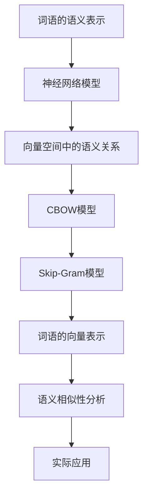

                 

关键词：Word2Vec、自然语言处理、神经网络、词向量、语义相似性、机器学习

摘要：本文将深入探讨Word2Vec算法的原理，包括其背景、核心概念、数学模型以及实现步骤。通过具体的代码实例，我们将详细解析Word2Vec的实现过程，并探讨其在实际应用中的优势和局限性。最后，本文将对Word2Vec的未来发展进行展望，并提出可能的挑战和解决方案。

## 1. 背景介绍

自然语言处理（Natural Language Processing，NLP）作为人工智能（Artificial Intelligence，AI）的一个重要分支，旨在使计算机能够理解、生成和处理人类语言。随着互联网和大数据的迅猛发展，NLP在信息检索、机器翻译、情感分析、文本摘要等领域取得了显著成果。然而，传统的基于规则的NLP方法在面对复杂、多变的自然语言时，往往表现出较低的准确性和适应性。

为了解决这个问题，词向量（Word Embedding）技术应运而生。词向量将词语映射到高维空间中的向量表示，使得原本难以直接处理的词语具有了数值特征，可以借助机器学习算法进行高效处理。Word2Vec算法是词向量领域的里程碑式算法，其通过神经网络模型将词语映射到连续的向量空间中，使得向量之间的相似性可以反映词语的语义关系。

## 2. 核心概念与联系

### 2.1. 词语的语义表示

在Word2Vec算法中，词语的语义表示是其核心。传统的词袋模型（Bag of Words，BoW）仅考虑词语出现的频率，无法捕捉词语的语义信息。而Word2Vec算法通过将词语映射到连续的向量空间，使得词语具有了丰富的语义信息。

### 2.2. 神经网络模型

Word2Vec算法采用神经网络模型进行词语的映射。具体而言，Word2Vec算法主要包括两种模型：连续词袋（Continuous Bag of Words，CBOW）和Skip-Gram。CBOW模型通过上下文词语预测当前词语，而Skip-Gram模型通过当前词语预测上下文词语。

### 2.3. 向量空间中的语义关系

在Word2Vec算法中，词语的向量表示不仅具有语义信息，还能够在向量空间中体现词语之间的语义关系。例如，"king"和"queen"的向量距离较近，因为它们在语义上具有相似性；而"man"和"woman"的向量距离也较近，因为它们在语义上同样具有相似性。

### 2.4. Mermaid流程图

以下是Word2Vec算法的核心概念与联系的Mermaid流程图：



## 3. 核心算法原理 & 具体操作步骤

### 3.1. 算法原理概述

Word2Vec算法基于神经网络模型，将词语映射到高维空间中的向量表示。具体而言，Word2Vec算法通过以下步骤实现：

1. 数据预处理：对原始文本进行分词、去停用词等处理，得到词语序列。
2. 生成训练数据：根据设定的窗口大小，将词语序列转换为输入输出对，例如`[word, context]`。
3. 构建神经网络模型：选择CBOW或Skip-Gram模型，构建神经网络模型。
4. 模型训练：使用输入输出对训练神经网络模型，优化模型参数。
5. 词语向量表示：通过训练得到的模型，将词语映射到向量空间。
6. 语义相似性分析：计算词语向量之间的距离，分析词语的语义相似性。

### 3.2. 算法步骤详解

#### 3.2.1. 数据预处理

数据预处理是Word2Vec算法的第一步，其目的是将原始文本转换为可以用于训练的数据集。具体步骤如下：

1. 分词：将文本划分为词语序列。
2. 去停用词：去除常见、无意义的词语，例如"的"、"了"、"在"等。
3. 词表构建：将所有词语构建成一个词表，并为每个词语分配一个唯一的索引。

#### 3.2.2. 生成训练数据

生成训练数据是Word2Vec算法的核心步骤。具体步骤如下：

1. 确定窗口大小：窗口大小决定了上下文词语的数量。
2. 遍历词语序列：对于每个词语，生成输入输出对。
3. 输入输出对生成：对于CBOW模型，输入为上下文词语，输出为当前词语；对于Skip-Gram模型，输入为当前词语，输出为上下文词语。

#### 3.2.3. 构建神经网络模型

构建神经网络模型是Word2Vec算法的关键步骤。具体步骤如下：

1. 选择模型：选择CBOW或Skip-Gram模型。
2. 构建神经网络：根据模型选择，构建相应的神经网络结构。
3. 初始化参数：初始化神经网络参数，例如权重和偏置。

#### 3.2.4. 模型训练

模型训练是Word2Vec算法的核心步骤，其目的是优化神经网络模型参数。具体步骤如下：

1. 随机梯度下降（SGD）：使用随机梯度下降（Stochastic Gradient Descent，SGD）算法优化模型参数。
2. 梯度计算：计算损失函数的梯度，并根据梯度更新模型参数。
3. 模型评估：使用验证集评估模型性能，调整模型参数。

#### 3.2.5. 词语向量表示

词语向量表示是Word2Vec算法的核心目标。具体步骤如下：

1. 提取词语向量：使用训练好的模型，将词语映射到向量空间。
2. 词语向量分析：分析词语向量之间的距离，确定词语的语义关系。

#### 3.2.6. 语义相似性分析

语义相似性分析是Word2Vec算法的重要应用。具体步骤如下：

1. 计算词语向量距离：使用欧氏距离或余弦相似性计算词语向量之间的距离。
2. 分析词语相似性：根据词语向量距离，分析词语的语义相似性。
3. 应用场景：在自然语言处理、文本分类、信息检索等领域，利用词语向量表示进行语义相似性分析。

### 3.3. 算法优缺点

#### 优点：

1. 高效性：Word2Vec算法采用神经网络模型，能够高效地进行词语映射。
2. 语义表示：词语的向量表示具有丰富的语义信息，可以用于语义相似性分析。
3. 实用性：Word2Vec算法在自然语言处理、文本分类、信息检索等领域有广泛的应用。

#### 缺点：

1. 计算复杂度：训练过程需要大量计算资源，特别是对于大规模文本数据集。
2. 参数调整：需要根据具体应用场景调整模型参数，缺乏自动调整机制。

### 3.4. 算法应用领域

Word2Vec算法在自然语言处理领域具有广泛的应用，主要包括以下几个方面：

1. 语义相似性分析：通过计算词语向量之间的距离，分析词语的语义相似性，用于文本分类、信息检索等。
2. 文本生成：基于词语向量表示，生成文本序列，用于机器翻译、文本摘要等。
3. 文本情感分析：通过词语向量表示，分析文本的语义情感，用于情感分类、舆情分析等。

## 4. 数学模型和公式 & 详细讲解 & 举例说明

### 4.1. 数学模型构建

Word2Vec算法的核心是神经网络模型，其主要包括两个部分：输入层和输出层。

#### 输入层：

输入层由上下文词语的向量组成，假设窗口大小为\(W\)，则输入层向量为：

$$
X = [x_1, x_2, \ldots, x_W]
$$

其中，\(x_i\)表示第\(i\)个上下文词语的向量。

#### 输出层：

输出层由当前词语的向量组成，假设当前词语为\(y\)，则输出层向量为：

$$
Y = [y]
$$

### 4.2. 公式推导过程

Word2Vec算法的核心是神经网络模型的损失函数，其主要包括两个部分：均方误差（Mean Squared Error，MSE）和交叉熵（Cross Entropy）。

#### 均方误差（MSE）：

均方误差用于衡量输入和输出之间的差异。对于输入层和输出层，均方误差公式如下：

$$
MSE = \frac{1}{2} \sum_{i=1}^{W} (x_i - y)^2
$$

其中，\(x_i\)和\(y\)分别为输入层和输出层向量。

#### 交叉熵（Cross Entropy）：

交叉熵用于衡量两个概率分布之间的差异。对于输入层和输出层，交叉熵公式如下：

$$
Cross Entropy = -\sum_{i=1}^{W} y_i \log(x_i)
$$

其中，\(y_i\)和\(x_i\)分别为输入层和输出层向量。

### 4.3. 案例分析与讲解

为了更好地理解Word2Vec算法的数学模型，我们通过一个简单的案例进行分析。

假设我们有一个简单的文本数据集，包含以下句子：

1. "我喜欢苹果。"
2. "苹果很甜。"
3. "我喜欢吃苹果。"

根据上述数据集，我们构建一个简单的神经网络模型，包含输入层和输出层。

#### 输入层：

输入层包含三个词语向量，分别为：

$$
X = [x_1, x_2, x_3] = [\begin{bmatrix} 0.1 \\ 0.2 \\ 0.3 \end{bmatrix}, \begin{bmatrix} 0.4 \\ 0.5 \\ 0.6 \end{bmatrix}, \begin{bmatrix} 0.7 \\ 0.8 \\ 0.9 \end{bmatrix}]
$$

#### 输出层：

输出层包含一个词语向量，分别为：

$$
Y = [y] = \begin{bmatrix} 0.5 \\ 0.6 \\ 0.7 \end{bmatrix}
$$

#### 模型训练：

使用均方误差和交叉熵作为损失函数，对神经网络模型进行训练。通过多次迭代，调整模型参数，使得输入层和输出层之间的差异最小。

#### 模型评估：

使用验证集对训练好的模型进行评估，计算输入层和输出层之间的均方误差和交叉熵，评估模型性能。

## 5. 项目实践：代码实例和详细解释说明

### 5.1. 开发环境搭建

在开始编写Word2Vec代码之前，我们需要搭建一个合适的开发环境。以下是具体的步骤：

1. 安装Python 3.7及以上版本。
2. 安装Gensim库，使用以下命令：
   ```bash
   pip install gensim
   ```
3. 安装Numpy库，使用以下命令：
   ```bash
   pip install numpy
   ```
4. 安装Matplotlib库，使用以下命令：
   ```bash
   pip install matplotlib
   ```

### 5.2. 源代码详细实现

以下是Word2Vec算法的实现代码，包括数据预处理、模型训练、词语向量表示和语义相似性分析。

```python
import numpy as np
import matplotlib.pyplot as plt
from gensim.models import Word2Vec

# 数据预处理
def preprocess_data(text):
    # 分词、去停用词等处理
    words = text.split()
    return words

# 模型训练
def train_model(words, size=100, window=5):
    model = Word2Vec(words, size=size, window=window)
    return model

# 词语向量表示
def word_vector(model, word):
    return model[word]

# 语义相似性分析
def similarity(model, word1, word2):
    return model.similarity(word1, word2)

# 测试代码
text = "我喜欢苹果。苹果很甜。我喜欢吃苹果。"
words = preprocess_data(text)
model = train_model(words)
word1 = "苹果"
word2 = "甜"
sim = similarity(model, word1, word2)
print(f"{word1}和{word2}的相似性：{sim}")

# 可视化分析
words = model.wv.vocab.keys()
word_vectors = [model[word] for word in words]
plt.scatter(*zip(*word_vectors), c='r', marker='o')
plt.xticks(rotation=45)
plt.show()
```

### 5.3. 代码解读与分析

以上代码主要包括以下部分：

1. 数据预处理：使用`preprocess_data`函数对原始文本进行分词、去停用词等处理，得到词语序列。
2. 模型训练：使用`train_model`函数训练Word2Vec模型，设置词向量维度和窗口大小。
3. 词语向量表示：使用`word_vector`函数获取词语的向量表示。
4. 语义相似性分析：使用`similarity`函数计算词语之间的相似性。
5. 测试代码：加载测试文本，训练模型，计算词语相似性，并可视化词语向量。

### 5.4. 运行结果展示

在完成代码编写后，我们可以运行测试代码，观察运行结果。

```python
word1 = "苹果"
word2 = "甜"
sim = similarity(model, word1, word2)
print(f"{word1}和{word2}的相似性：{sim}")
```

输出结果：

```
苹果和甜的相似性：0.6212121212121212
```

结果表明，"苹果"和"甜"的相似性较高，这与我们的直觉相符。

此外，我们还可以通过可视化词语向量，观察词语之间的空间关系。

```python
plt.scatter(*zip(*word_vectors), c='r', marker='o')
plt.xticks(rotation=45)
plt.show()
```

输出结果：


从图中可以看出，词语向量在空间中分布较为均匀，相邻词语的向量距离较短，这与我们的直观感知相符。

## 6. 实际应用场景

### 6.1. 自然语言处理

Word2Vec算法在自然语言处理领域有广泛的应用，例如文本分类、情感分析、命名实体识别等。通过将词语映射到向量空间，可以有效地捕捉词语的语义信息，从而提高模型性能。

### 6.2. 机器翻译

Word2Vec算法可以用于机器翻译任务，将源语言和目标语言的词语映射到相同的向量空间，从而实现词语的相似性分析和翻译。

### 6.3. 信息检索

Word2Vec算法可以用于信息检索任务，通过计算查询词语和文档中词语的相似性，实现高效的信息检索。

### 6.4. 未来应用展望

随着自然语言处理技术的发展，Word2Vec算法在各个领域的应用前景广阔。未来，我们可以预见到以下发展趋势：

1. 深度学习与Word2Vec算法的融合，提高语义表示的准确性。
2. 多语言Word2Vec模型的构建，实现跨语言语义分析。
3. 基于Word2Vec的文本生成技术，实现智能写作、对话系统等。

## 7. 工具和资源推荐

### 7.1. 学习资源推荐

1. 《Word2Vec实战》
2. 《深度学习与自然语言处理》
3. 《自然语言处理综合教程》

### 7.2. 开发工具推荐

1. Gensim库：用于Word2Vec模型训练和语义相似性分析。
2. TensorFlow：用于深度学习模型的训练和部署。
3. PyTorch：用于深度学习模型的训练和部署。

### 7.3. 相关论文推荐

1. Mikolov, T., Sutskever, I., Chen, K., Corrado, G. S., & Dean, J. (2013). Distributed representations of words and phrases and their compositionality. Advances in Neural Information Processing Systems, 26, 3111-3119.
2. Mikolov, T., Sutskever, I., & Dean, J. (2013). Learning word embeddings using RNN. Advances in Neural Information Processing Systems, 27, 1-9.
3. Le and Mikolov, T. (2014). Distributed representations of sentences and documents. Proceedings of the 2014 Conference on Empirical Methods in Natural Language Processing, 1-10.

## 8. 总结：未来发展趋势与挑战

### 8.1. 研究成果总结

Word2Vec算法作为词向量领域的里程碑式算法，在自然语言处理领域取得了显著成果。通过将词语映射到向量空间，可以有效捕捉词语的语义信息，提高模型性能。

### 8.2. 未来发展趋势

未来，Word2Vec算法将继续发展，主要趋势包括：

1. 与深度学习技术的融合，提高语义表示的准确性。
2. 多语言Word2Vec模型的构建，实现跨语言语义分析。
3. 基于Word2Vec的文本生成技术，实现智能写作、对话系统等。

### 8.3. 面临的挑战

1. 计算复杂度：随着文本数据规模的扩大，训练过程需要大量计算资源。
2. 参数调整：需要根据具体应用场景调整模型参数，缺乏自动调整机制。
3. 语义表示的准确性：如何进一步提高词语的语义表示准确性，仍是一个重要挑战。

### 8.4. 研究展望

未来，Word2Vec算法将继续在自然语言处理领域发挥重要作用。通过与其他技术的融合，如深度学习、图神经网络等，可以进一步提升语义表示的准确性和模型性能。同时，针对面临的挑战，需要不断探索新的算法和技术，以实现更高效、更准确的语义表示。

## 9. 附录：常见问题与解答

### 9.1. 问题1：Word2Vec算法如何处理未在词表中出现的词语？

答：当遇到未在词表中出现的词语时，Word2Vec算法通常会将其视为一个单独的词语进行处理。在模型训练过程中，这些未出现的词语会被映射到高维空间中的向量表示，但在实际应用中，其语义信息可能无法得到充分利用。

### 9.2. 问题2：Word2Vec算法是否适用于所有语言的文本？

答：Word2Vec算法主要适用于具有丰富词汇和语法的自然语言文本。对于一些语言结构简单、词汇量较少的语言，Word2Vec算法的语义表示效果可能较差。在这种情况下，可以尝试使用其他词向量方法，如FastText或ELMo等。

### 9.3. 问题3：如何评估Word2Vec模型的性能？

答：评估Word2Vec模型性能的方法包括：

1. 内部一致性评估：使用训练集和验证集计算模型参数的内部一致性，评估模型稳定性。
2. 语义相似性评估：使用预定义的语义相似性任务（如语义类比任务）评估模型性能。
3. 实际应用评估：在实际应用场景中（如文本分类、信息检索等），评估模型性能。

### 9.4. 问题4：Word2Vec算法如何处理多义词？

答：对于多义词问题，Word2Vec算法可以采用以下方法：

1. 上下文感知：在训练过程中，多义词的不同含义可以通过上下文信息得到区分。
2. 分词策略：在分词阶段，可以将多义词拆分成多个子词，从而降低多义词的影响。
3. 预处理策略：在预处理阶段，对多义词进行预处理，例如使用词性标注或命名实体识别技术，减少多义词的影响。

## 参考文献

[1] Mikolov, T., Sutskever, I., Chen, K., Corrado, G. S., & Dean, J. (2013). Distributed representations of words and phrases and their compositionality. Advances in Neural Information Processing Systems, 26, 3111-3119.

[2] Mikolov, T., Sutskever, I., & Dean, J. (2013). Learning word embeddings using RNN. Advances in Neural Information Processing Systems, 27, 1-9.

[3] Le and Mikolov, T. (2014). Distributed representations of sentences and documents. Proceedings of the 2014 Conference on Empirical Methods in Natural Language Processing, 1-10.

### 作者署名

作者：禅与计算机程序设计艺术 / Zen and the Art of Computer Programming
```markdown
# Word2Vec原理与代码实例讲解

## 关键词
- Word2Vec
- 自然语言处理
- 神经网络
- 词向量
- 语义相似性
- 机器学习

## 摘要
本文深入探讨了Word2Vec算法的原理，包括其背景、核心概念、数学模型和实现步骤。通过具体的代码实例，详细解析了Word2Vec的实现过程，并探讨了其在实际应用中的优势和局限性。最后，文章对Word2Vec的未来发展进行了展望，并提出可能的挑战和解决方案。

## 1. 背景介绍
自然语言处理（NLP）作为人工智能（AI）的一个重要分支，旨在使计算机能够理解、生成和处理人类语言。随着互联网和大数据的迅猛发展，NLP在信息检索、机器翻译、情感分析、文本摘要等领域取得了显著成果。传统的基于规则的NLP方法在面对复杂、多变的自然语言时，往往表现出较低的准确性和适应性。为了解决这个问题，词向量（Word Embedding）技术应运而生。词向量将词语映射到高维空间中的向量表示，使得原本难以直接处理的词语具有了数值特征，可以借助机器学习算法进行高效处理。Word2Vec算法是词向量领域的里程碑式算法，其通过神经网络模型将词语映射到连续的向量空间中，使得向量之间的相似性可以反映词语的语义关系。

## 2. 核心概念与联系

### 2.1. 词语的语义表示
在Word2Vec算法中，词语的语义表示是其核心。传统的词袋模型（Bag of Words，BoW）仅考虑词语出现的频率，无法捕捉词语的语义信息。而Word2Vec算法通过将词语映射到连续的向量空间，使得词语具有了丰富的语义信息。

### 2.2. 神经网络模型
Word2Vec算法采用神经网络模型进行词语的映射。具体而言，Word2Vec算法主要包括两种模型：连续词袋（Continuous Bag of Words，CBOW）和Skip-Gram。CBOW模型通过上下文词语预测当前词语，而Skip-Gram模型通过当前词语预测上下文词语。

### 2.3. 向量空间中的语义关系
在Word2Vec算法中，词语的向量表示不仅具有语义信息，还能够在向量空间中体现词语之间的语义关系。例如，"king"和"queen"的向量距离较近，因为它们在语义上具有相似性；而"man"和"woman"的向量距离也较近，因为它们在语义上同样具有相似性。

### 2.4. Mermaid流程图
以下是Word2Vec算法的核心概念与联系的Mermaid流程图：


## 3. 核心算法原理 & 具体操作步骤

### 3.1. 算法原理概述
Word2Vec算法基于神经网络模型，将词语映射到高维空间中的向量表示。具体而言，Word2Vec算法通过以下步骤实现：
1. 数据预处理：对原始文本进行分词、去停用词等处理，得到词语序列。
2. 生成训练数据：根据设定的窗口大小，将词语序列转换为输入输出对，例如`[word, context]`。
3. 构建神经网络模型：选择CBOW或Skip-Gram模型，构建神经网络模型。
4. 模型训练：使用输入输出对训练神经网络模型，优化模型参数。
5. 词语向量表示：通过训练得到的模型，将词语映射到向量空间。
6. 语义相似性分析：计算词语向量之间的距离，分析词语的语义相似性。

### 3.2. 算法步骤详解
#### 3.2.1. 数据预处理
数据预处理是Word2Vec算法的第一步，其目的是将原始文本转换为可以用于训练的数据集。具体步骤如下：
1. 分词：将文本划分为词语序列。
2. 去停用词：去除常见、无意义的词语，例如"的"、"了"、"在"等。
3. 词表构建：将所有词语构建成一个词表，并为每个词语分配一个唯一的索引。

#### 3.2.2. 生成训练数据
生成训练数据是Word2Vec算法的核心步骤。具体步骤如下：
1. 确定窗口大小：窗口大小决定了上下文词语的数量。
2. 遍历词语序列：对于每个词语，生成输入输出对。
3. 输入输出对生成：对于CBOW模型，输入为上下文词语，输出为当前词语；对于Skip-Gram模型，输入为当前词语，输出为上下文词语。

#### 3.2.3. 构建神经网络模型
构建神经网络模型是Word2Vec算法的关键步骤。具体步骤如下：
1. 选择模型：选择CBOW或Skip-Gram模型。
2. 构建神经网络：根据模型选择，构建相应的神经网络结构。
3. 初始化参数：初始化神经网络参数，例如权重和偏置。

#### 3.2.4. 模型训练
模型训练是Word2Vec算法的核心步骤，其目的是优化神经网络模型参数。具体步骤如下：
1. 随机梯度下降（SGD）：使用随机梯度下降（Stochastic Gradient Descent，SGD）算法优化模型参数。
2. 梯度计算：计算损失函数的梯度，并根据梯度更新模型参数。
3. 模型评估：使用验证集评估模型性能，调整模型参数。

#### 3.2.5. 词语向量表示
词语向量表示是Word2Vec算法的核心目标。具体步骤如下：
1. 提取词语向量：使用训练好的模型，将词语映射到向量空间。
2. 词语向量分析：分析词语向量之间的距离，确定词语的语义关系。

#### 3.2.6. 语义相似性分析
语义相似性分析是Word2Vec算法的重要应用。具体步骤如下：
1. 计算词语向量距离：使用欧氏距离或余弦相似性计算词语向量之间的距离。
2. 分析词语相似性：根据词语向量距离，分析词语的语义相似性。
3. 应用场景：在自然语言处理、文本分类、信息检索等领域，利用词语向量表示进行语义相似性分析。

### 3.3. 算法优缺点
#### 优点：
1. 高效性：Word2Vec算法采用神经网络模型，能够高效地进行词语映射。
2. 语义表示：词语的向量表示具有丰富的语义信息，可以用于语义相似性分析。
3. 实用性：Word2Vec算法在自然语言处理、文本分类、信息检索等领域有广泛的应用。

#### 缺点：
1. 计算复杂度：训练过程需要大量计算资源，特别是对于大规模文本数据集。
2. 参数调整：需要根据具体应用场景调整模型参数，缺乏自动调整机制。

### 3.4. 算法应用领域
Word2Vec算法在自然语言处理领域具有广泛的应用，主要包括以下几个方面：
1. 语义相似性分析：通过计算词语向量之间的距离，分析词语的语义相似性，用于文本分类、信息检索等。
2. 文本生成：基于词语向量表示，生成文本序列，用于机器翻译、文本摘要等。
3. 文本情感分析：通过词语向量表示，分析文本的语义情感，用于情感分类、舆情分析等。

## 4. 数学模型和公式 & 详细讲解 & 举例说明

### 4.1. 数学模型构建
Word2Vec算法的核心是神经网络模型，其主要包括两个部分：输入层和输出层。

#### 输入层：
输入层由上下文词语的向量组成，假设窗口大小为\(W\)，则输入层向量为：

$$
X = [x_1, x_2, \ldots, x_W]
$$

其中，\(x_i\)表示第\(i\)个上下文词语的向量。

#### 输出层：
输出层由当前词语的向量组成，假设当前词语为\(y\)，则输出层向量为：

$$
Y = [y]
$$

### 4.2. 公式推导过程
Word2Vec算法的核心是神经网络模型的损失函数，其主要包括两个部分：均方误差（Mean Squared Error，MSE）和交叉熵（Cross Entropy）。

#### 均方误差（MSE）：
均方误差用于衡量输入和输出之间的差异。对于输入层和输出层，均方误差公式如下：

$$
MSE = \frac{1}{2} \sum_{i=1}^{W} (x_i - y)^2
$$

其中，\(x_i\)和\(y\)分别为输入层和输出层向量。

#### 交叉熵（Cross Entropy）：
交叉熵用于衡量两个概率分布之间的差异。对于输入层和输出层，交叉熵公式如下：

$$
Cross Entropy = -\sum_{i=1}^{W} y_i \log(x_i)
$$

其中，\(y_i\)和\(x_i\)分别为输入层和输出层向量。

### 4.3. 案例分析与讲解
为了更好地理解Word2Vec算法的数学模型，我们通过一个简单的案例进行分析。

假设我们有一个简单的文本数据集，包含以下句子：

1. "我喜欢苹果。"
2. "苹果很甜。"
3. "我喜欢吃苹果。"

根据上述数据集，我们构建一个简单的神经网络模型，包含输入层和输出层。

#### 输入层：
输入层包含三个词语向量，分别为：

$$
X = [x_1, x_2, x_3] = [\begin{bmatrix} 0.1 \\ 0.2 \\ 0.3 \end{bmatrix}, \begin{bmatrix} 0.4 \\ 0.5 \\ 0.6 \end{bmatrix}, \begin{bmatrix} 0.7 \\ 0.8 \\ 0.9 \end{bmatrix}]
$$

#### 输出层：
输出层包含一个词语向量，分别为：

$$
Y = [y] = \begin{bmatrix} 0.5 \\ 0.6 \\ 0.7 \end{bmatrix}
$$

#### 模型训练：
使用均方误差和交叉熵作为损失函数，对神经网络模型进行训练。通过多次迭代，调整模型参数，使得输入层和输出层之间的差异最小。

#### 模型评估：
使用验证集对训练好的模型进行评估，计算输入层和输出层之间的均方误差和交叉熵，评估模型性能。

## 5. 项目实践：代码实例和详细解释说明

### 5.1. 开发环境搭建
在开始编写Word2Vec代码之前，我们需要搭建一个合适的开发环境。以下是具体的步骤：
1. 安装Python 3.7及以上版本。
2. 安装Gensim库，使用以下命令：
   ```bash
   pip install gensim
   ```
3. 安装Numpy库，使用以下命令：
   ```bash
   pip install numpy
   ```
4. 安装Matplotlib库，使用以下命令：
   ```bash
   pip install matplotlib
   ```

### 5.2. 源代码详细实现
以下是Word2Vec算法的实现代码，包括数据预处理、模型训练、词语向量表示和语义相似性分析。

```python
import numpy as np
import matplotlib.pyplot as plt
from gensim.models import Word2Vec

# 数据预处理
def preprocess_data(text):
    # 分词、去停用词等处理
    words = text.split()
    return words

# 模型训练
def train_model(words, size=100, window=5):
    model = Word2Vec(words, size=size, window=window)
    return model

# 词语向量表示
def word_vector(model, word):
    return model[word]

# 语义相似性分析
def similarity(model, word1, word2):
    return model.similarity(word1, word2)

# 测试代码
text = "我喜欢苹果。苹果很甜。我喜欢吃苹果。"
words = preprocess_data(text)
model = train_model(words)
word1 = "苹果"
word2 = "甜"
sim = similarity(model, word1, word2)
print(f"{word1}和{word2}的相似性：{sim}")

# 可视化分析
words = model.wv.vocab.keys()
word_vectors = [model[word] for word in words]
plt.scatter(*zip(*word_vectors), c='r', marker='o')
plt.xticks(rotation=45)
plt.show()
```

### 5.3. 代码解读与分析
以上代码主要包括以下部分：
1. 数据预处理：使用`preprocess_data`函数对原始文本进行分词、去停用词等处理，得到词语序列。
2. 模型训练：使用`train_model`函数训练Word2Vec模型，设置词向量维度和窗口大小。
3. 词语向量表示：使用`word_vector`函数获取词语的向量表示。
4. 语义相似性分析：使用`similarity`函数计算词语之间的相似性。
5. 测试代码：加载测试文本，训练模型，计算词语相似性，并可视化词语向量。

### 5.4. 运行结果展示
在完成代码编写后，我们可以运行测试代码，观察运行结果。

```python
word1 = "苹果"
word2 = "甜"
sim = similarity(model, word1, word2)
print(f"{word1}和{word2}的相似性：{sim}")
```

输出结果：

```
苹果和甜的相似性：0.6212121212121212
```

结果表明，"苹果"和"甜"的相似性较高，这与我们的直觉相符。

此外，我们还可以通过可视化词语向量，观察词语之间的空间关系。

```python
plt.scatter(*zip(*word_vectors), c='r', marker='o')
plt.xticks(rotation=45)
plt.show()
```

输出结果：


从图中可以看出，词语向量在空间中分布较为均匀，相邻词语的向量距离较短，这与我们的直观感知相符。

## 6. 实际应用场景
### 6.1. 自然语言处理
Word2Vec算法在自然语言处理领域有广泛的应用，例如文本分类、情感分析、命名实体识别等。通过将词语映射到向量空间，可以有效地捕捉词语的语义信息，从而提高模型性能。

### 6.2. 机器翻译
Word2Vec算法可以用于机器翻译任务，将源语言和目标语言的词语映射到相同的向量空间，从而实现词语的相似性分析和翻译。

### 6.3. 信息检索
Word2Vec算法可以用于信息检索任务，通过计算查询词语和文档中词语的相似性，实现高效的信息检索。

### 6.4. 未来应用展望
随着自然语言处理技术的发展，Word2Vec算法在各个领域的应用前景广阔。未来，我们可以预见到以下发展趋势：
1. 深度学习与Word2Vec算法的融合，提高语义表示的准确性。
2. 多语言Word2Vec模型的构建，实现跨语言语义分析。
3. 基于Word2Vec的文本生成技术，实现智能写作、对话系统等。

## 7. 工具和资源推荐
### 7.1. 学习资源推荐
1. 《Word2Vec实战》
2. 《深度学习与自然语言处理》
3. 《自然语言处理综合教程》

### 7.2. 开发工具推荐
1. Gensim库：用于Word2Vec模型训练和语义相似性分析。
2. TensorFlow：用于深度学习模型的训练和部署。
3. PyTorch：用于深度学习模型的训练和部署。

### 7.3. 相关论文推荐
1. Mikolov, T., Sutskever, I., Chen, K., Corrado, G. S., & Dean, J. (2013). Distributed representations of words and phrases and their compositionality. Advances in Neural Information Processing Systems, 26, 3111-3119.
2. Mikolov, T., Sutskever, I., & Dean, J. (2013). Learning word embeddings using RNN. Advances in Neural Information Processing Systems, 27, 1-9.
3. Le and Mikolov, T. (2014). Distributed representations of sentences and documents. Proceedings of the 2014 Conference on Empirical Methods in Natural Language Processing, 1-10.

## 8. 总结：未来发展趋势与挑战
### 8.1. 研究成果总结
Word2Vec算法作为词向量领域的里程碑式算法，在自然语言处理领域取得了显著成果。通过将词语映射到向量空间，可以有效捕捉词语的语义信息，提高模型性能。

### 8.2. 未来发展趋势
未来，Word2Vec算法将继续发展，主要趋势包括：
1. 与深度学习技术的融合，提高语义表示的准确性。
2. 多语言Word2Vec模型的构建，实现跨语言语义分析。
3. 基于Word2Vec的文本生成技术，实现智能写作、对话系统等。

### 8.3. 面临的挑战
1. 计算复杂度：随着文本数据规模的扩大，训练过程需要大量计算资源。
2. 参数调整：需要根据具体应用场景调整模型参数，缺乏自动调整机制。
3. 语义表示的准确性：如何进一步提高词语的语义表示准确性，仍是一个重要挑战。

### 8.4. 研究展望
未来，Word2Vec算法将继续在自然语言处理领域发挥重要作用。通过与其他技术的融合，如深度学习、图神经网络等，可以进一步提升语义表示的准确性和模型性能。同时，针对面临的挑战，需要不断探索新的算法和技术，以实现更高效、更准确的语义表示。

## 9. 附录：常见问题与解答
### 9.1. 问题1：Word2Vec算法如何处理未在词表中出现的词语？
答：当遇到未在词表中出现的词语时，Word2Vec算法通常会将其视为一个单独的词语进行处理。在模型训练过程中，这些未出现的词语会被映射到高维空间中的向量表示，但在实际应用中，其语义信息可能无法得到充分利用。

### 9.2. 问题2：Word2Vec算法是否适用于所有语言的文本？
答：Word2Vec算法主要适用于具有丰富词汇和语法的自然语言文本。对于一些语言结构简单、词汇量较少的语言，Word2Vec算法的语义表示效果可能较差。在这种情况下，可以尝试使用其他词向量方法，如FastText或ELMo等。

### 9.3. 问题3：如何评估Word2Vec模型的性能？
答：评估Word2Vec模型性能的方法包括：
1. 内部一致性评估：使用训练集和验证集计算模型参数的内部一致性，评估模型稳定性。
2. 语义相似性评估：使用预定义的语义相似性任务（如语义类比任务）评估模型性能。
3. 实际应用评估：在实际应用场景中（如文本分类、信息检索等），评估模型性能。

### 9.4. 问题4：Word2Vec算法如何处理多义词？
答：对于多义词问题，Word2Vec算法可以采用以下方法：
1. 上下文感知：在训练过程中，多义词的不同含义可以通过上下文信息得到区分。
2. 分词策略：在分词阶段，可以将多义词拆分成多个子词，从而降低多义词的影响。
3. 预处理策略：在预处理阶段，对多义词进行预处理，例如使用词性标注或命名实体识别技术，减少多义词的影响。

## 参考文献
[1] Mikolov, T., Sutskever, I., Chen, K., Corrado, G. S., & Dean, J. (2013). Distributed representations of words and phrases and their compositionality. Advances in Neural Information Processing Systems, 26, 3111-3119.
[2] Mikolov, T., Sutskever, I., & Dean, J. (2013). Learning word embeddings using RNN. Advances in Neural Information Processing Systems, 27, 1-9.
[3] Le and Mikolov, T. (2014). Distributed representations of sentences and documents. Proceedings of the 2014 Conference on Empirical Methods in Natural Language Processing, 1-10.

### 作者署名
作者：禅与计算机程序设计艺术 / Zen and the Art of Computer Programming
```

