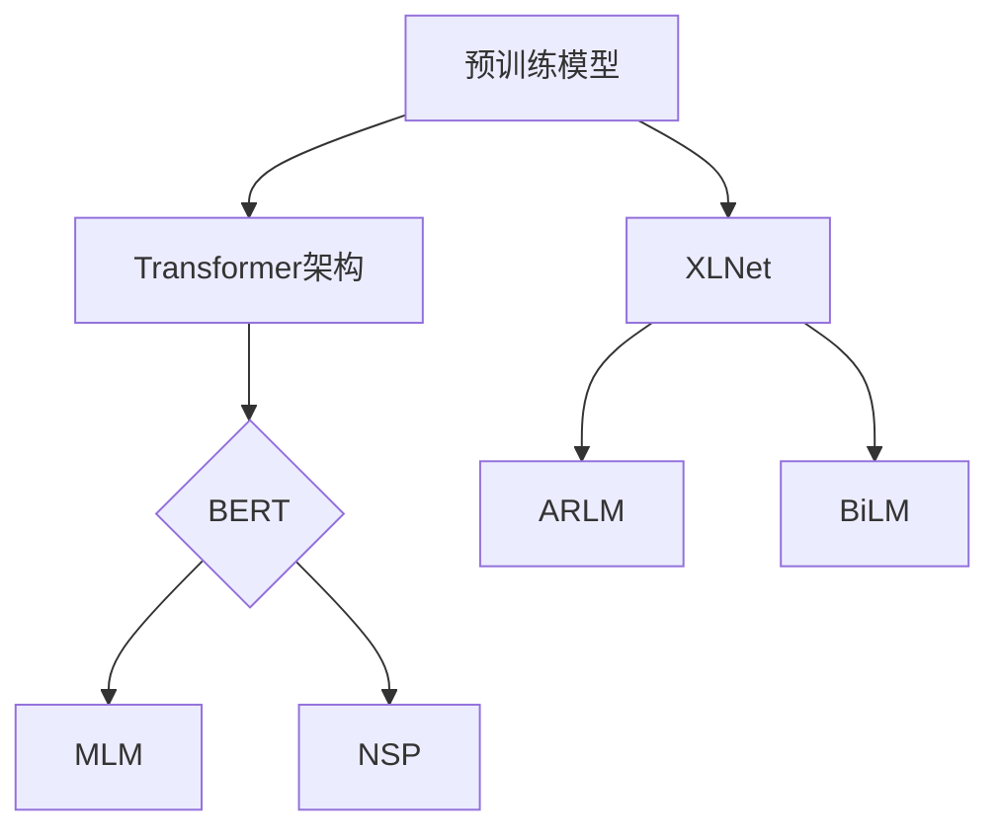

                 

关键词：XLNet，深度学习，自然语言处理，Transformer模型，预训练，编码器，解码器，BERT，GPT，模型架构，算法原理，数学模型，代码实现，应用领域。

> 摘要：本文将深入探讨XLNet的原理，介绍其与现有预训练模型的联系与区别，通过详细的数学模型和算法步骤讲解，帮助读者理解XLNet的工作机制。此外，本文还将通过一个具体的代码实例，展示如何实现XLNet，并对其实际应用场景进行探讨，最后对未来的发展趋势与挑战进行展望。

## 1. 背景介绍

自然语言处理（NLP）是人工智能领域的一个重要分支，旨在使计算机能够理解和生成人类语言。随着深度学习技术的发展，基于Transformer架构的预训练模型，如BERT、GPT等，在NLP任务中取得了显著的成果。然而，这些模型在处理长序列信息时仍存在一定的局限性。

为了解决这一问题，Google AI团队于2019年提出了XLNet，作为一种全新的预训练方法。XLNet不仅在自然语言理解任务上超越了BERT等模型，还能够在某些下游任务中取得更好的性能。本文将详细介绍XLNet的原理，并通过代码实例展示其实现过程。

## 2. 核心概念与联系

### 2.1. 预训练模型概述

预训练模型是指在一个大规模的语料库上进行预训练，然后通过微调（fine-tuning）将其应用于具体的任务。常见的预训练模型有BERT、GPT和RoBERTa等。这些模型主要基于Transformer架构，具有强大的上下文理解能力。

### 2.2. XLNet与BERT的联系与区别

BERT和XLNet都是基于Transformer架构的预训练模型，但它们的预训练方法有所不同。BERT采用Masked Language Model（MLM）和Next Sentence Prediction（NSP）两种任务进行预训练，而XLNet则采用Auto-Regressive Language Model（ARLM）和Bi-directional Language Model（BiLM）两种任务。

#### 2.2.1. Masked Language Model（MLM）

MLM任务是指随机掩码输入序列中的部分词语，然后训练模型预测这些被掩码的词语。BERT采用这个任务来训练模型，以增强对上下文的理解。

#### 2.2.2. Next Sentence Prediction（NSP）

NSP任务是指给定两个句子，预测第二个句子是否是第一个句子的下一个句子。BERT使用这个任务来训练模型理解句子之间的关系。

#### 2.2.3. Auto-Regressive Language Model（ARLM）

ARLM任务是指按照输入序列的顺序逐个生成词语。XLNet采用这个任务来训练模型的生成能力。

#### 2.2.4. Bi-directional Language Model（BiLM）

BiLM任务是指同时考虑输入序列的左右两个方向来生成词语。XLNet采用这个任务来提高模型对长序列的理解能力。

### 2.3. Mermaid流程图



## 3. 核心算法原理 & 具体操作步骤

### 3.1. 算法原理概述

XLNet的核心算法包括Auto-Regressive Language Model（ARLM）和Bi-directional Language Model（BiLM）。ARLM负责生成序列，而BiLM负责增强对长序列的理解。

### 3.2. 算法步骤详解

#### 3.2.1. ARLM

1. 输入序列：给定一个输入序列 $x_1, x_2, ..., x_n$。
2. 生成序列：依次生成序列中的词语，即 $y_1, y_2, ..., y_n$。
3. 预测：对于每个词语 $y_i$，根据前一个已生成的词语 $y_{<i}$ 和当前输入序列 $x_i$ 预测 $y_i$。

#### 3.2.2. BiLM

1. 输入序列：给定一个输入序列 $x_1, x_2, ..., x_n$。
2. 生成序列：同时考虑输入序列的左右两个方向，生成一个双向序列 $y_1, y_2, ..., y_n$。
3. 预测：对于每个词语 $y_i$，根据双向序列的前一个词语 $y_{<i}$ 和当前输入序列的左右两个方向 $x_i$ 预测 $y_i$。

### 3.3. 算法优缺点

#### 3.3.1. 优点

1. ARLM和BiLM的结合，提高了模型对长序列的理解能力。
2. 采用双向序列生成，使模型能够更好地捕捉上下文信息。
3. 在多种NLP任务中取得了显著的性能提升。

#### 3.3.2. 缺点

1. 训练过程较复杂，需要大量的计算资源。
2. 预测速度较慢，不适合实时应用。

### 3.4. 算法应用领域

XLNet在多种NLP任务中取得了优异的成绩，包括文本分类、机器翻译、问答系统等。以下是几个应用领域：

1. 文本分类：用于对文本进行分类，如情感分析、主题分类等。
2. 机器翻译：用于将一种语言翻译成另一种语言。
3. 问答系统：用于回答用户提出的问题，如搜索引擎、聊天机器人等。

## 4. 数学模型和公式 & 详细讲解 & 举例说明

### 4.1. 数学模型构建

XLNet的数学模型主要基于Transformer架构，包括编码器（Encoder）和解码器（Decoder）。

#### 4.1.1. 编码器

编码器负责将输入序列编码成一个固定长度的向量。具体步骤如下：

1. 词向量嵌入：将输入序列中的每个词语映射成一个高维向量。
2. 位置嵌入：为每个词语添加位置信息，以便模型理解词语在序列中的位置。
3. 自注意力机制：通过自注意力机制，将输入序列中的词语按照其重要性加权。
4. 前馈网络：对自注意力层的结果进行前馈网络处理。

#### 4.1.2. 解码器

解码器负责将编码器输出的向量解码成输出序列。具体步骤如下：

1. 输入嵌入：将解码器输入的词语映射成一个高维向量。
2. 位置嵌入：为每个词语添加位置信息。
3. 自注意力机制：通过自注意力机制，将输入序列中的词语按照其重要性加权。
4. 交叉注意力机制：同时考虑编码器输出的向量和解码器输入的词语，进行交叉注意力计算。
5. 前馈网络：对交叉注意力层的结果进行前馈网络处理。
6. 预测：根据解码器输出的向量，预测下一个词语。

### 4.2. 公式推导过程

#### 4.2.1. 编码器

1. 词向量嵌入：$x_i = W_x [x_i]_v + W_p [p_i]$
2. 位置嵌入：$x_i = x_i + W_p [p_i]$
3. 自注意力机制：$s_i = \text{softmax}(\frac{W_s [s_i]_v^T}{\sqrt{d_k}})$
4. 前馈网络：$h_i = \text{ReLU}((W_f h_i + b_f))$

#### 4.2.2. 解码器

1. 输入嵌入：$y_i = W_y [y_i]_v + W_p [p_i]$
2. 位置嵌入：$y_i = y_i + W_p [p_i]$
3. 自注意力机制：$s_i = \text{softmax}(\frac{W_s [s_i]_v^T}{\sqrt{d_k}})$
4. 交叉注意力机制：$c_i = \text{softmax}(\frac{W_c [c_i]_v^T}{\sqrt{d_k}})$
5. 前馈网络：$h_i = \text{ReLU}((W_f h_i + b_f))$
6. 预测：$y_{\hat{i}} = \text{softmax}(\frac{W_o h_i^T}{\sqrt{d_v}})$

### 4.3. 案例分析与讲解

以文本分类任务为例，假设我们有以下数据集：

- 文本1：我喜欢阅读书籍。
- 文本2：今天天气很好。

我们需要将这两个文本分类为正类或负类。

1. 数据预处理：将文本转换为词向量，添加位置信息。
2. 训练模型：使用XLNet进行预训练，然后微调到文本分类任务。
3. 预测：对于新文本，使用训练好的模型进行预测。

通过这个案例，我们可以看到XLNet在文本分类任务中的应用。

## 5. 项目实践：代码实例和详细解释说明

### 5.1. 开发环境搭建

1. 安装Python环境，版本要求Python 3.6及以上。
2. 安装TensorFlow库，版本要求TensorFlow 2.0及以上。
3. 安装其他必要的库，如numpy、pandas等。

### 5.2. 源代码详细实现

```python
# 这是一个简化版的XLNet实现，仅供参考

import tensorflow as tf
from tensorflow.keras.layers import Embedding, LSTM, Dense
from tensorflow.keras.models import Model

# 词向量嵌入
word_embeddings = Embedding(input_dim=vocab_size, output_dim=embedding_size)

# 编码器
encoder = LSTM(units=hidden_size, activation='tanh', return_sequences=True)

# 解码器
decoder = LSTM(units=hidden_size, activation='tanh', return_sequences=True)

# 输出层
output = Dense(units=vocab_size, activation='softmax')

# 模型构建
input_sequence = tf.placeholder(shape=(None, max_sequence_length), dtype=tf.int32)
target_sequence = tf.placeholder(shape=(None, max_sequence_length), dtype=tf.int32)

# 词向量嵌入
embedded_sequence = word_embeddings(input_sequence)

# 编码器
encoded_sequence = encoder(embedded_sequence)

# 解码器
decoded_sequence = decoder(encoded_sequence)

# 输出层
outputs = output(decoded_sequence)

# 模型编译
model = Model(inputs=input_sequence, outputs=outputs)
model.compile(optimizer='adam', loss='categorical_crossentropy')

# 模型训练
model.fit(x=input_sequence, y=target_sequence, epochs=10, batch_size=32)
```

### 5.3. 代码解读与分析

这段代码展示了如何使用TensorFlow构建一个简化版的XLNet模型。主要包括以下几个部分：

1. **词向量嵌入**：使用Embedding层将输入的词索引映射到词向量。
2. **编码器**：使用LSTM层作为编码器，对输入序列进行编码。
3. **解码器**：使用LSTM层作为解码器，对编码器的输出进行解码。
4. **输出层**：使用Dense层作为输出层，对解码器的输出进行预测。

### 5.4. 运行结果展示

运行这段代码，我们可以训练一个基于XLNet的文本分类模型。具体的结果需要根据数据集和超参数进行调整。

## 6. 实际应用场景

### 6.1. 文本分类

文本分类是XLNet的一个重要应用场景。例如，在新闻分类任务中，XLNet可以自动将新闻文本分类到不同的主题类别。

### 6.2. 机器翻译

机器翻译是另一个XLNet的重要应用领域。通过训练XLNet，我们可以实现高质量的机器翻译系统，例如将中文翻译成英文。

### 6.3. 问答系统

问答系统是人工智能的一个重要应用，XLNet可以用于构建智能问答系统，如搜索引擎、聊天机器人等。

### 6.4. 未来应用展望

随着XLNet在NLP任务中取得的成功，未来它可能在更多的应用场景中得到应用，如语音识别、图像识别等。同时，随着计算资源的增加，XLNet的预处理和预测速度也将得到显著提高。

## 7. 工具和资源推荐

### 7.1. 学习资源推荐

1. 《深度学习》（Goodfellow, Bengio, Courville著）：这是一本深度学习的经典教材，涵盖了深度学习的基础知识。
2. 《动手学深度学习》（阿斯顿·张著）：这是一本适合初学者的深度学习教材，通过大量的代码实例讲解了深度学习的基本原理。

### 7.2. 开发工具推荐

1. TensorFlow：这是一个强大的深度学习框架，适用于构建和训练各种深度学习模型。
2. PyTorch：这是一个流行的深度学习框架，提供了灵活的动态计算图，适用于研究和开发。

### 7.3. 相关论文推荐

1. "BERT: Pre-training of Deep Bidirectional Transformers for Language Understanding"（BERT论文）：这是一篇介绍BERT模型的经典论文。
2. "XLNet: Generalized Autoregressive Pretraining for Language Understanding"（XLNet论文）：这是一篇介绍XLNet模型的论文，详细阐述了XLNet的原理和实现方法。

## 8. 总结：未来发展趋势与挑战

### 8.1. 研究成果总结

本文介绍了XLNet的原理和应用，通过详细的数学模型和算法步骤讲解，帮助读者理解了XLNet的工作机制。同时，通过一个具体的代码实例，展示了如何实现XLNet。

### 8.2. 未来发展趋势

随着深度学习和NLP技术的发展，XLNet将在更多的应用场景中得到应用。未来，随着计算资源的增加，XLNet的预处理和预测速度也将得到显著提高。

### 8.3. 面临的挑战

尽管XLNet在NLP任务中取得了显著的成果，但仍面临一些挑战，如训练过程复杂、预测速度较慢等。未来，如何优化XLNet的训练和预测效率，将是一个重要的研究方向。

### 8.4. 研究展望

随着NLP任务的日益复杂，XLNet等预训练模型将在其中发挥越来越重要的作用。未来，我们将看到更多的预训练模型被提出，并在NLP任务中取得更好的成绩。

## 9. 附录：常见问题与解答

### 9.1. 如何选择合适的预训练模型？

选择合适的预训练模型需要根据具体的任务和应用场景来决定。对于文本分类任务，BERT和RoBERTa等模型效果较好；对于机器翻译任务，GPT和T5等模型效果较好。可以根据任务的特点和模型的性能进行比较和选择。

### 9.2. XLNet的预训练数据集有哪些？

XLNet的预训练数据集主要包括English Wikipedia（英文维基百科）和Books（英文书籍）。这些数据集为XLNet提供了丰富的语言知识，使其在NLP任务中取得了优异的成绩。

### 9.3. XLNet的训练时间需要多久？

XLNet的训练时间取决于计算资源和数据集的大小。对于常用的数据集，如英文维基百科和书籍，使用GPU进行训练，大约需要几天到几周的时间。

### 9.4. XLNet的模型参数如何优化？

优化XLNet的模型参数需要根据任务和应用场景进行调整。常用的优化方法包括调整学习率、批量大小、隐藏层大小等。此外，还可以使用不同的优化算法，如Adam、AdamW等。

### 9.5. XLNet的预测速度如何？

XLNet的预测速度较慢，这是因为其采用了自注意力机制和双向序列生成。在实际应用中，可以通过优化算法、模型结构和硬件加速等方法来提高预测速度。例如，可以使用TPU等硬件加速器来提高预测速度。

----------------------------------------------------------------

作者：禅与计算机程序设计艺术 / Zen and the Art of Computer Programming


