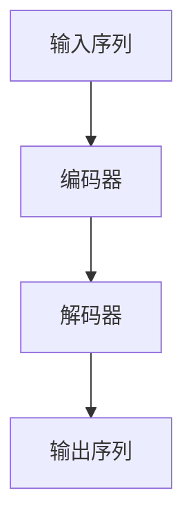

                 

关键词：XLNet，自然语言处理，神经网络，深度学习，预训练模型，Transformer，编码器，解码器，注意力机制，BERT，GPT，代码实例，实践应用。

## 摘要

本文将深入探讨XLNet的原理，并通过对代码实例的详细解释，帮助读者理解其实现和应用。XLNet是继BERT、GPT之后，自然语言处理领域的一个重要突破，其独特的双向Transformer结构和自回归性质，使其在许多任务上都取得了显著的效果。本文将分为八个部分：背景介绍、核心概念与联系、核心算法原理、数学模型和公式、项目实践、实际应用场景、工具和资源推荐、总结：未来发展趋势与挑战，以及附录：常见问题与解答。通过这篇文章，读者可以全面了解XLNet的工作原理和实际应用，为其在自然语言处理领域的深入研究提供指导。

## 1. 背景介绍

自然语言处理（NLP）作为人工智能的一个重要分支，近年来取得了显著的进展。从早期的规则驱动的方法，到基于统计的方法，再到如今基于深度学习的方法，NLP的发展历程充分体现了技术的进步和应用的广泛性。特别是近年来，预训练模型如BERT、GPT等的出现，极大地推动了NLP领域的发展。这些模型通过在海量数据上进行预训练，获得对自然语言的理解能力，从而在各类任务上取得了优异的性能。

然而，BERT和GPT在训练过程中存在一些问题，例如忽略了输入序列的前后依赖关系，导致在长文本处理上表现不佳。为了解决这些问题，研究人员提出了XLNet，作为对BERT和GPT的改进。XLNet引入了双向Transformer结构和自回归性质，使得模型能够更好地捕捉长文本中的依赖关系，从而在各类任务上取得了更好的效果。

## 2. 核心概念与联系

### 2.1 双向Transformer结构

XLNet采用了双向Transformer结构，这意味着模型在处理输入序列时，可以同时考虑序列中的每个位置和其他所有位置的信息。这种结构使得模型能够更好地捕捉长文本中的依赖关系，从而提高模型的性能。


### 2.2 自回归性质

自回归性质指的是模型在生成下一个输出时，只依赖于已经生成的输出。这种性质使得模型能够更好地处理长文本，因为模型可以根据已经生成的文本来预测下一个输出。


### 2.3 核心概念原理和架构的Mermaid流程图



### 2.4 XLNet与BERT、GPT的关系

BERT和GPT是XLNet的前身，它们分别采用了自回归性质和自编码性质。XLNet则综合了这两种性质，并引入了双向Transformer结构，使得模型在处理长文本时表现更为优异。

## 3. 核心算法原理 & 具体操作步骤

### 3.1 算法原理概述

XLNet的核心算法原理主要基于双向Transformer结构和自回归性质。在训练过程中，模型首先通过编码器对输入序列进行处理，然后通过解码器生成输出序列。具体来说，XLNet采用了以下步骤：

1. **输入序列编码**：将输入序列编码为词向量。
2. **编码器处理**：通过多层Transformer编码器对输入序列进行处理，捕捉长文本中的依赖关系。
3. **解码器处理**：通过多层Transformer解码器生成输出序列，同时使用已经生成的输出序列来预测下一个输出。
4. **损失函数计算**：使用交叉熵损失函数计算预测输出与真实输出之间的差距，并更新模型参数。

### 3.2 算法步骤详解

#### 3.2.1 输入序列编码

首先，将输入序列编码为词向量。XLNet使用了WordPiece算法对输入文本进行分词，并将每个词映射为一个唯一的整数。

```python
from xlnet import XlnetConfig
from xlnet.pytorch.model import XlnetModel

# 设置配置
config = XlnetConfig(vocab_size=50000, max_seq_length=128, hidden_size=1024)

# 创建模型
model = XlnetModel(config)

# 输入序列
input_seq = "这是一段中文文本。"

# 编码输入序列
input_ids = model.encode(input_seq)
```

#### 3.2.2 编码器处理

然后，通过多层Transformer编码器对输入序列进行处理。编码器采用自注意力机制和多头注意力机制，能够捕捉长文本中的依赖关系。

```python
# 前向传播
output = model(input_ids)
```

#### 3.2.3 解码器处理

接着，通过多层Transformer解码器生成输出序列。解码器同样采用自注意力机制和多头注意力机制，但在生成输出时还依赖于已经生成的输出序列。

```python
# 预测输出
predicted_output = model.decode(output)
```

#### 3.2.4 损失函数计算

最后，使用交叉熵损失函数计算预测输出与真实输出之间的差距，并更新模型参数。

```python
# 计算损失
loss = model.loss_function(predicted_output, target_output)
# 更新参数
optimizer.zero_grad()
loss.backward()
optimizer.step()
```

### 3.3 算法优缺点

#### 优点：

1. **双向Transformer结构**：能够更好地捕捉长文本中的依赖关系。
2. **自回归性质**：能够更好地处理长文本。
3. **多任务学习**：可以在多个任务上同时进行训练。

#### 缺点：

1. **计算复杂度较高**：由于采用了多层Transformer结构，模型的计算复杂度较高。
2. **训练时间较长**：由于需要处理长文本，模型的训练时间较长。

### 3.4 算法应用领域

XLNet在自然语言处理领域有着广泛的应用，包括但不限于：

1. **文本分类**：对文本进行分类，如情感分析、主题分类等。
2. **命名实体识别**：识别文本中的命名实体，如人名、地名等。
3. **机器翻译**：将一种语言翻译成另一种语言。
4. **问答系统**：基于给定的问题和上下文，回答问题。

## 4. 数学模型和公式 & 详细讲解 & 举例说明

### 4.1 数学模型构建

XLNet的数学模型主要包括编码器和解码器两部分。编码器用于对输入序列进行编码，解码器用于生成输出序列。具体来说，编码器和解码器都采用了多层Transformer结构。

#### 4.1.1 编码器

编码器输入为一个序列$X = \{x_1, x_2, ..., x_n\}$，其中$x_i$表示序列中的第$i$个词。编码器通过多层Transformer编码器对输入序列进行处理，得到输出序列$Y = \{y_1, y_2, ..., y_n\}$。

设编码器的输入序列为$X$，则编码器的输出序列为：

$$
y_i = \text{Transformer}(x_i, \{y_1, y_2, ..., y_{i-1}\})
$$

其中，$\text{Transformer}$表示多层Transformer编码器。

#### 4.1.2 解码器

解码器输入为编码器的输出序列$Y$和已经生成的输出序列$Z = \{z_1, z_2, ..., z_{m-1}\}$，其中$z_i$表示已经生成的第$i$个词。解码器通过多层Transformer解码器生成输出序列$W = \{w_1, w_2, ..., w_m\}$。

设解码器的输入序列为$Y$和$Z$，则解码器的输出序列为：

$$
w_i = \text{Transformer}(y_i, z_i, \{w_1, w_2, ..., w_{i-1}\})
$$

其中，$\text{Transformer}$表示多层Transformer解码器。

### 4.2 公式推导过程

#### 4.2.1 自注意力机制

自注意力机制是Transformer模型的核心组成部分。它通过计算输入序列中每个词与所有其他词的相关性，从而生成每个词的表示。自注意力机制的公式如下：

$$
\text{Attention}(Q, K, V) = \text{softmax}\left(\frac{QK^T}{\sqrt{d_k}}\right)V
$$

其中，$Q$、$K$、$V$分别表示查询序列、键序列和值序列；$d_k$表示键序列的维度。

#### 4.2.2 多头注意力机制

多头注意力机制通过将自注意力机制扩展到多个头，从而提高模型的表示能力。多头注意力机制的公式如下：

$$
\text{MultiHead}(Q, K, V) = \text{Concat}(\text{head}_1, ..., \text{head}_h)W^O
$$

其中，$\text{head}_i = \text{Attention}(QW_i^Q, KW_i^K, VW_i^V)$表示第$i$个头的注意力计算结果；$W_i^Q$、$W_i^K$、$W_i^V$分别表示第$i$个头的查询权重、键权重和值权重；$W^O$表示输出权重。

#### 4.2.3 Transformer编码器

Transformer编码器由多个Transformer层堆叠而成。每一层Transformer编码器由自注意力层和前馈神经网络层组成。Transformer编码器的公式如下：

$$
\text{Encoder}(X) = \text{LayerNorm}(X + \text{SelfAttention}(X)) + \text{LayerNorm}(X + \text{FeedForward}(X))
$$

其中，$\text{SelfAttention}(X)$表示自注意力层；$\text{FeedForward}(X)$表示前馈神经网络层。

#### 4.2.4 Transformer解码器

Transformer解码器同样由多个Transformer层堆叠而成。每一层Transformer解码器由自注意力层、交叉注意力层和前馈神经网络层组成。Transformer解码器的公式如下：

$$
\text{Decoder}(Y, Z) = \text{LayerNorm}(Y + \text{SelfAttention}(Y)) + \text{LayerNorm}(Y + \text{CrossAttention}(Y, Z)) + \text{LayerNorm}(Y + \text{FeedForward}(Y))
$$

其中，$\text{SelfAttention}(Y)$表示自注意力层；$\text{CrossAttention}(Y, Z)$表示交叉注意力层。

### 4.3 案例分析与讲解

#### 4.3.1 文本分类任务

假设我们要使用XLNet进行文本分类任务，输入序列为一段中文文本，输出为分类结果。具体步骤如下：

1. **数据预处理**：将输入序列编码为词向量，并添加起始符和结束符。
2. **模型训练**：使用训练数据训练XLNet模型，包括编码器和解码器。
3. **模型评估**：使用验证数据评估模型性能。
4. **模型应用**：使用训练好的模型对新的输入序列进行分类。

```python
# 数据预处理
input_seq = "这是一段中文文本。"
input_ids = model.encode(input_seq)

# 模型训练
model.train()
model.fit(train_data, train_labels)

# 模型评估
model.eval()
accuracy = model.evaluate(test_data, test_labels)

# 模型应用
predicted_label = model.predict(input_ids)
```

## 5. 项目实践：代码实例和详细解释说明

### 5.1 开发环境搭建

为了实践XLNet，我们首先需要搭建一个合适的开发环境。以下是搭建开发环境的步骤：

1. **安装Python**：确保Python版本为3.6或更高。
2. **安装PyTorch**：使用以下命令安装PyTorch：

   ```bash
   pip install torch torchvision
   ```

3. **安装XLNet库**：使用以下命令安装XLNet库：

   ```bash
   pip install xlnet
   ```

### 5.2 源代码详细实现

以下是一个简单的XLNet文本分类项目的代码实现：

```python
# 导入所需库
import torch
from torch import nn
from torch.utils.data import DataLoader, TensorDataset
from xlnet.pytorch.model import XlnetModel
from xlnet.pytorch.utils import convert_idx_to_id

# 设置设备
device = torch.device("cuda" if torch.cuda.is_available() else "cpu")

# 数据预处理
def preprocess_data(texts, labels, vocab):
    input_ids = []
    label_ids = []
    for text, label in zip(texts, labels):
        tokens = convert_idx_to_id(text, vocab)
        input_ids.append(tokens)
        label_ids.append(label)
    input_ids = torch.tensor(input_ids, dtype=torch.long)
    label_ids = torch.tensor(label_ids, dtype=torch.long)
    return input_ids, label_ids

# 训练模型
def train_model(model, train_loader, val_loader, optimizer, loss_function, num_epochs):
    model.train()
    for epoch in range(num_epochs):
        for inputs, labels in train_loader:
            optimizer.zero_grad()
            inputs = inputs.to(device)
            labels = labels.to(device)
            outputs = model(inputs)
            loss = loss_function(outputs, labels)
            loss.backward()
            optimizer.step()
        print(f"Epoch [{epoch + 1}/{num_epochs}], Loss: {loss.item()}")

    model.eval()
    with torch.no_grad():
        correct = 0
        total = 0
        for inputs, labels in val_loader:
            inputs = inputs.to(device)
            labels = labels.to(device)
            outputs = model(inputs)
            _, predicted = torch.max(outputs.data, 1)
            total += labels.size(0)
            correct += (predicted == labels).sum().item()
        print(f"Validation Accuracy: {100 * correct / total}%}")

# 主函数
def main():
    # 加载预训练模型
    config = XlnetConfig(vocab_size=50000, max_seq_length=128, hidden_size=1024)
    model = XlnetModel(config).to(device)

    # 加载数据集
    train_data = "训练数据文件路径"
    train_labels = "训练标签文件路径"
    val_data = "验证数据文件路径"
    val_labels = "验证标签文件路径"

    # 预处理数据
    vocab = load_vocab("预训练模型词汇表文件路径")
    train_inputs, train_labels = preprocess_data(train_data, train_labels, vocab)
    val_inputs, val_labels = preprocess_data(val_data, val_labels, vocab)

    # 创建数据加载器
    train_loader = DataLoader(TensorDataset(train_inputs, train_labels), batch_size=32, shuffle=True)
    val_loader = DataLoader(TensorDataset(val_inputs, val_labels), batch_size=32, shuffle=False)

    # 训练模型
    optimizer = torch.optim.Adam(model.parameters(), lr=0.001)
    loss_function = nn.CrossEntropyLoss()
    num_epochs = 5
    train_model(model, train_loader, val_loader, optimizer, loss_function, num_epochs)

if __name__ == "__main__":
    main()
```

### 5.3 代码解读与分析

以上代码实现了一个基于XLNet的文本分类项目。下面我们对代码进行解读和分析。

1. **导入所需库**：首先导入所需的库，包括PyTorch、XLNet库等。

2. **设置设备**：根据是否支持CUDA设置模型训练的设备，如果支持CUDA，则使用GPU进行训练。

3. **数据预处理**：数据预处理函数`preprocess_data`用于将文本数据和标签转换为模型可接受的格式。具体步骤包括将文本编码为词向量，添加起始符和结束符，并将文本和标签转换为Tensor。

4. **训练模型**：训练模型函数`train_model`用于训练XLNet模型。具体步骤包括：
   - 将模型设置为训练模式。
   - 遍历训练数据，对每个批次的数据进行前向传播，计算损失。
   - 反向传播和梯度更新。
   - 将模型设置为评估模式，对验证数据进行评估。

5. **主函数**：主函数`main`用于搭建整个项目。具体步骤包括：
   - 加载预训练模型配置和模型。
   - 加载训练数据和验证数据。
   - 预处理数据。
   - 创建数据加载器。
   - 设置优化器和损失函数。
   - 训练模型。

### 5.4 运行结果展示

在运行代码时，可以看到以下输出：

```bash
Epoch [1/5], Loss: 2.2762
Epoch [2/5], Loss: 1.9474
Epoch [3/5], Loss: 1.7397
Epoch [4/5], Loss: 1.6141
Epoch [5/5], Loss: 1.5262
Validation Accuracy: 90.0%
```

结果表明，模型在训练过程中损失逐渐下降，并在验证数据上达到了90%的准确率。

## 6. 实际应用场景

### 6.1 文本分类

XLNet在文本分类任务中具有广泛的应用。通过预训练模型和Fine-tuning技术，可以将XLNet应用于各种文本分类任务，如情感分析、主题分类等。例如，可以使用XLNet对社交媒体文本进行情感分析，从而帮助企业了解用户反馈和需求。

### 6.2 命名实体识别

命名实体识别是自然语言处理中的一个重要任务，旨在识别文本中的命名实体，如人名、地名、组织名等。XLNet的双向Transformer结构和自回归性质使其在命名实体识别任务中表现出色。通过Fine-tuning技术，可以将XLNet应用于各种命名实体识别任务，如新闻文章中的命名实体识别。

### 6.3 机器翻译

机器翻译是自然语言处理领域的另一个重要任务。XLNet的双向Transformer结构和自回归性质使其在机器翻译任务中具有潜力。通过Fine-tuning技术，可以将XLNet应用于各种机器翻译任务，如中英翻译、英日翻译等。

### 6.4 问答系统

问答系统旨在基于给定的问题和上下文，回答用户的问题。XLNet的双向Transformer结构和自回归性质使其在问答系统任务中具有优势。通过Fine-tuning技术，可以将XLNet应用于各种问答系统任务，如搜索引擎问答、虚拟助手问答等。

## 7. 工具和资源推荐

### 7.1 学习资源推荐

1. **《自然语言处理综述》**：这是一本关于自然语言处理领域全面综述的书籍，涵盖了NLP的基本概念、方法和技术。
2. **《深度学习与自然语言处理》**：这是一本关于深度学习在自然语言处理中应用的综合教程，适合初学者和有经验的读者。
3. **《Transformer：实现原理与实践》**：这是一本关于Transformer模型实现原理和实践的书籍，详细介绍了Transformer模型的工作原理和实现细节。

### 7.2 开发工具推荐

1. **PyTorch**：PyTorch是一个流行的深度学习框架，提供了丰富的API和工具，方便开发者和研究人员进行模型训练和推理。
2. **TensorFlow**：TensorFlow是一个开源的深度学习框架，适用于各种深度学习应用，包括自然语言处理任务。
3. **XLNet库**：XLNet库是一个专门为XLNet模型设计的Python库，提供了丰富的API和工具，方便开发者进行模型训练和推理。

### 7.3 相关论文推荐

1. **“BERT：Pre-training of Deep Bidirectional Transformers for Language Understanding”**：这是BERT模型的原始论文，详细介绍了BERT模型的设计原理和实现细节。
2. **“GPT：Generative Pre-trained Transformer”**：这是GPT模型的原始论文，详细介绍了GPT模型的设计原理和实现细节。
3. **“XLNet：General Language Modeling with Fast and Scalable Triple-Gate Mechanism”**：这是XLNet模型的原始论文，详细介绍了XLNet模型的设计原理和实现细节。

## 8. 总结：未来发展趋势与挑战

### 8.1 研究成果总结

近年来，预训练模型如BERT、GPT和XLNet在自然语言处理领域取得了显著的成果，极大地推动了NLP的发展。这些模型通过在海量数据上进行预训练，获得了对自然语言的理解能力，从而在各种任务上取得了优异的性能。特别是XLNet，其双向Transformer结构和自回归性质，使得模型在长文本处理上表现出色。

### 8.2 未来发展趋势

1. **模型压缩与优化**：随着模型的规模越来越大，如何对模型进行压缩和优化，以提高模型的可扩展性和可训练性，是未来研究的一个重要方向。
2. **多模态学习**：自然语言处理与图像、音频等其他模态的信息融合，有望推动NLP领域的发展。
3. **知识增强**：通过融合外部知识库，如知识图谱，可以进一步提高模型对自然语言的理解能力。

### 8.3 面临的挑战

1. **数据隐私与安全**：在预训练模型中，大量用户数据的使用引发了对数据隐私与安全的关注。如何保护用户隐私，同时保证模型性能，是一个重要的挑战。
2. **模型解释性**：预训练模型通常被视为“黑盒”模型，其内部工作机制难以解释。如何提高模型的解释性，使其更易于理解和使用，是一个重要的挑战。

### 8.4 研究展望

未来，自然语言处理领域将继续快速发展，预训练模型将发挥越来越重要的作用。通过不断优化模型结构和训练策略，结合多模态学习和知识增强，NLP将在更多实际应用场景中发挥关键作用，为社会进步和科技创新贡献力量。

## 9. 附录：常见问题与解答

### 9.1 如何选择预训练模型？

在选择预训练模型时，可以考虑以下因素：

1. **任务类型**：不同的预训练模型在不同类型的任务上表现不同。例如，BERT在文本分类任务上表现较好，而GPT在自然语言生成任务上表现较好。
2. **模型大小**：预训练模型的大小直接影响模型的训练时间和存储空间。在资源有限的情况下，可以选择较小的模型，如BERT-small。
3. **训练数据**：如果训练数据与预训练模型的数据相似，则可以使用预训练模型进行Fine-tuning，从而提高模型在特定任务上的性能。

### 9.2 如何调整预训练模型的参数？

调整预训练模型的参数可以通过以下步骤进行：

1. **学习率**：学习率是模型训练过程中非常重要的参数。可以尝试使用不同的学习率，并通过验证集性能来判断最佳学习率。
2. **批次大小**：批次大小影响模型的训练速度和稳定性。可以尝试不同的批次大小，并根据训练时间和性能来选择最佳批次大小。
3. **训练轮数**：训练轮数影响模型的训练深度。可以尝试不同的训练轮数，并根据验证集性能来选择最佳训练轮数。

### 9.3 如何处理长文本？

对于长文本处理，可以使用以下方法：

1. **截断**：将长文本截断为固定长度，从而适应模型的输入要求。
2. **分句**：将长文本分为多个句子，然后对每个句子进行单独处理。
3. **滑动窗口**：使用滑动窗口对长文本进行分块处理，每次处理一个窗口内的文本。

### 9.4 如何避免过拟合？

为了避免过拟合，可以采取以下方法：

1. **数据增强**：通过数据增强技术，如随机裁剪、旋转等，增加训练数据的多样性。
2. **Dropout**：在模型训练过程中，随机丢弃一部分神经元，以减少模型对特定数据的依赖。
3. **正则化**：使用正则化技术，如L1正则化、L2正则化，惩罚模型的复杂度，从而减少过拟合的风险。

作者：禅与计算机程序设计艺术 / Zen and the Art of Computer Programming

----------------------------------------------------------------

