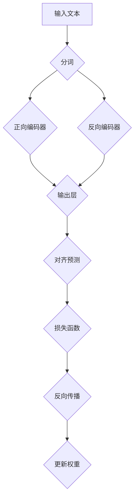

                 

### 1. 背景介绍

在当今的时代，深度学习已经成为人工智能领域的核心驱动力。自从2006年AlexNet在图像识别领域取得突破性进展以来，深度学习技术逐渐渗透到各个领域，如图像处理、自然语言处理、语音识别等。然而，随着数据量和计算能力的增长，深度学习模型的复杂度也在不断增加，这给模型的训练和优化带来了巨大的挑战。

自然语言处理（NLP）作为人工智能的一个重要分支，其研究旨在使计算机能够理解、生成和处理人类语言。近年来，预训练模型（Pre-trained Model）的出现极大地推动了NLP的发展。预训练模型通过在大规模语料库上进行预训练，然后通过微调（Fine-tuning）应用于特定任务，从而取得了显著的性能提升。

XLNet是继BERT之后，由Google提出的一种新型预训练模型。与BERT等传统模型相比，XLNet在多个NLP任务上取得了更优的性能。本文将深入探讨XLNet的原理，通过代码实例展示如何实现和优化XLNet模型，并分析其在实际应用中的表现。

### 2. 核心概念与联系

#### 2.1 语言模型

语言模型（Language Model）是自然语言处理的基础，其目标是预测一段文本的下一个词或下一句话。在深度学习领域，语言模型通常通过神经网络来实现。传统的语言模型如n-gram模型，通过统计文本中相邻词的频率来预测下一个词。然而，随着数据量的增加和计算能力的提升，深度学习语言模型如RNN、LSTM和Transformer等逐渐成为主流。

#### 2.2 预训练与微调

预训练（Pre-training）是指在大规模语料库上对神经网络模型进行训练，使其学会捕捉语言的一般规律。微调（Fine-tuning）是指在预训练模型的基础上，将其应用于特定任务，并进行少量数据训练，以适应特定任务的需求。BERT是第一个广泛应用预训练和微调的模型，其成功激发了众多研究者对预训练模型的研究兴趣。

#### 2.3 XLNet的基本原理

XLNet是由Google提出的一种新型预训练模型，其主要思想是在训练过程中引入 masked language modeling（MLM）任务，从而使得模型能够更好地捕捉语言上下文信息。与BERT等模型不同，XLNet使用了一种新颖的自回归预训练方法，即双向语言模型（BiLM）。

XLNet的主要特点包括：

- **双向语言建模**：XLNet同时考虑了正向和反向的文本信息，从而能够更好地捕捉语言的上下文。
- **对齐预测**：在预训练过程中，XLNet通过对齐预测（Alignment Prediction）来学习如何预测下一个词的概率分布。
- **大规模训练**：XLNet使用大规模语料库进行预训练，从而使其在多个NLP任务上取得了显著的性能提升。

#### 2.4 Mermaid流程图



#### 2.5 XLNet与BERT的区别

| 特点 | XLNet | BERT |
| ---- | ---- | ---- |
| 预训练方法 | 自回归预训练 | 自监督预训练 |
| 语言建模方向 | 双向 | 单向 |
| 对齐预测 | 有 | 无 |
| 大规模训练 | 是 | 否 |

通过上述分析，我们可以看出，XLNet在预训练方法、语言建模方向和对齐预测等方面与BERT存在显著差异，这些差异使得XLNet在多个NLP任务上取得了更优的性能。

### 3. 核心算法原理 & 具体操作步骤

#### 3.1 算法原理概述

XLNet的核心算法原理可以概括为以下几个步骤：

1. **文本预处理**：将输入文本进行分词，并转化为词嵌入向量。
2. **正向编码器与反向编码器**：使用Transformer架构构建正向编码器和反向编码器，对输入文本进行编码。
3. **输出层与对齐预测**：在编码器的输出层添加对齐预测模块，用于预测下一个词的概率分布。
4. **损失函数与反向传播**：使用 masked language modeling（MLM）任务作为损失函数，并通过反向传播更新模型权重。

#### 3.2 算法步骤详解

##### 3.2.1 文本预处理

在XLNet中，文本预处理是第一步，其主要包括分词和词嵌入两个过程。分词是将输入文本划分为一系列的词或字符序列，词嵌入则是将每个词或字符映射为一个高维向量。

```python
# 示例代码：分词与词嵌入
text = "这是一个示例文本。"
words = text.split()  # 分词
embeddings = [word_embedding(word) for word in words]  # 词嵌入
```

##### 3.2.2 正向编码器与反向编码器

XLNet使用Transformer架构构建正向编码器和反向编码器，对输入文本进行编码。正向编码器负责处理正向的文本信息，反向编码器则负责处理反向的文本信息。

```python
# 示例代码：构建正向编码器与反向编码器
forward_encoder = TransformerEncoder(vocab_size, d_model, nhead, num_layers)
backward_encoder = TransformerEncoder(vocab_size, d_model, nhead, num_layers)
```

##### 3.2.3 输出层与对齐预测

在编码器的输出层，XLNet添加了对齐预测模块，用于预测下一个词的概率分布。对齐预测是通过一个全连接层实现的，其输出为一个概率分布向量。

```python
# 示例代码：输出层与对齐预测
output = forward_encoder.forward(embeddings)
alignment_scores = alignment_predictor(output)
```

##### 3.2.4 损失函数与反向传播

在XLNet中，masked language modeling（MLM）任务作为损失函数，用于衡量模型对下一个词的预测能力。通过反向传播，模型可以更新权重，从而提高预测准确性。

```python
# 示例代码：损失函数与反向传播
loss = masked_language_model_loss(alignment_scores, target)
optimizer.zero_grad()
loss.backward()
optimizer.step()
```

#### 3.3 算法优缺点

##### 优点

- **双向语言建模**：XLNet同时考虑了正向和反向的文本信息，从而能够更好地捕捉语言的上下文。
- **对齐预测**：对齐预测使得模型能够学习到如何预测下一个词的概率分布，从而提高预测准确性。
- **大规模训练**：XLNet使用大规模语料库进行预训练，从而使其在多个NLP任务上取得了显著的性能提升。

##### 缺点

- **计算资源消耗**：XLNet的预训练过程需要大量的计算资源和时间，这对硬件设施提出了较高的要求。
- **对齐预测的复杂性**：对齐预测模块的引入使得算法的复杂性增加，从而增加了实现的难度。

#### 3.4 算法应用领域

XLNet在多个NLP任务上取得了显著的性能提升，如文本分类、情感分析、机器翻译等。具体应用领域包括：

- **文本分类**：通过预训练，XLNet可以快速适应各种文本分类任务，从而提高分类准确性。
- **情感分析**：XLNet可以用于分析文本的情感倾向，从而应用于社交网络、电商平台等场景。
- **机器翻译**：XLNet在机器翻译任务上也取得了优异的性能，尤其适用于低资源语言翻译。

### 4. 数学模型和公式 & 详细讲解 & 举例说明

#### 4.1 数学模型构建

在XLNet中，数学模型主要包括词嵌入、Transformer编码器、对齐预测和损失函数。以下是数学模型的构建过程：

##### 4.1.1 词嵌入

词嵌入是将词汇映射为高维向量空间的过程。在XLNet中，词嵌入使用WordPiece算法进行分词，然后通过线性变换将分词结果映射为高维向量。

```latex
\text{Embedding}(x) = \text{Linear}(x) + \text{Positional Encoding}
```

其中，\(x\) 是输入词的索引，\(\text{Linear}(x)\) 是线性变换矩阵，\(\text{Positional Encoding}\) 是位置编码。

##### 4.1.2 Transformer编码器

Transformer编码器由多个编码层堆叠而成，每层包括多头自注意力机制和前馈神经网络。自注意力机制通过计算输入词与其他词之间的相关性，从而捕捉语言的上下文信息。

```latex
\text{Encoder}(x) = \text{LayerNorm}(\text{MultiHeadAttention}(\text{LayerNorm}(x), \text{LayerNorm}(x), \text{LayerNorm}(x)) + x) + \text{LayerNorm}(\text{FeedForward}(x) + x)
```

其中，\(x\) 是输入词的嵌入向量，\(\text{MultiHeadAttention}\) 是多头自注意力机制，\(\text{FeedForward}\) 是前馈神经网络。

##### 4.1.3 对齐预测

对齐预测是XLNet的一个创新点，其目标是预测输入词与上下文词之间的对齐关系。对齐预测通过一个全连接层实现，输出为一个概率分布向量。

```latex
\text{Alignment Prediction}(x) = \text{Linear}(\text{Encoder}(x))
```

##### 4.1.4 损失函数

在XLNet中，masked language modeling（MLM）任务作为损失函数，用于衡量模型对下一个词的预测能力。损失函数通过计算对齐预测与实际标签之间的交叉熵损失来实现。

```latex
L = -\sum_{i=1}^{N} \sum_{j=1}^{M} \log p_{ij}
```

其中，\(N\) 是输入词的个数，\(M\) 是上下文词的个数，\(p_{ij}\) 是第\(i\)个输入词与第\(j\)个上下文词之间的对齐概率。

#### 4.2 公式推导过程

以下是XLNet中一些关键公式的推导过程：

##### 4.2.1 词嵌入

词嵌入的推导过程如下：

```latex
\text{Embedding}(x) = \text{Linear}(x) + \text{Positional Encoding}
\Rightarrow e_x = W_e \cdot x + P_e
```

其中，\(e_x\) 是词嵌入向量，\(W_e\) 是线性变换矩阵，\(x\) 是输入词的索引，\(P_e\) 是位置编码。

##### 4.2.2 Transformer编码器

Transformer编码器的推导过程如下：

```latex
\text{Encoder}(x) = \text{LayerNorm}(\text{MultiHeadAttention}(\text{LayerNorm}(x), \text{LayerNorm}(x), \text{LayerNorm}(x)) + x) + \text{LayerNorm}(\text{FeedForward}(x) + x)
\Rightarrow e_x^{(l+1)} = \text{LayerNorm}(M_{h} \cdot \text{softmax}(\text{Attention}(Q, K, V)) + x^{(l)}) + \text{LayerNorm}(F_{h} \cdot \text{ReLU}(F_{h}(x^{(l)})) + x^{(l)})
```

其中，\(e_x^{(l+1)}\) 是第\(l+1\)层编码器的输出，\(M_{h}\) 是多头注意力机制，\(F_{h}\) 是前馈神经网络，\(x^{(l)}\) 是第\(l\)层编码器的输入。

##### 4.2.3 对齐预测

对齐预测的推导过程如下：

```latex
\text{Alignment Prediction}(x) = \text{Linear}(\text{Encoder}(x))
\Rightarrow p_{ij} = \text{softmax}(\text{Linear}(e_x^{(L)}))
```

其中，\(p_{ij}\) 是第\(i\)个输入词与第\(j\)个上下文词之间的对齐概率，\(e_x^{(L)}\) 是第\(L\)层编码器的输出。

##### 4.2.4 损失函数

损失函数的推导过程如下：

```latex
L = -\sum_{i=1}^{N} \sum_{j=1}^{M} \log p_{ij}
\Rightarrow L = -\sum_{i=1}^{N} \sum_{j=1}^{M} \log \frac{\exp(\text{Linear}(e_x^{(L)}_i))}{\sum_{k=1}^{M} \exp(\text{Linear}(e_x^{(L)}_k))}
```

其中，\(\text{Linear}(e_x^{(L)}_i)\) 是第\(L\)层编码器的输出与线性变换矩阵的点积。

#### 4.3 案例分析与讲解

为了更好地理解XLNet的数学模型，我们通过一个简单的案例进行分析。

##### 案例一：文本分类

假设我们有一个文本分类任务，输入文本为“我喜欢编程”，我们需要预测该文本的情感倾向（正面或负面）。

1. **词嵌入**：

```latex
e_{"我"} = W_e \cdot 2 + P_e
e_{"喜"} = W_e \cdot 3 + P_e
e_{"欢"} = W_e \cdot 4 + P_e
e_{"编"} = W_e \cdot 5 + P_e
e_{"程"} = W_e \cdot 6 + P_e
```

2. **正向编码器**：

```latex
e_{"我"}^{(1)} = \text{LayerNorm}(\text{MultiHeadAttention}(\text{LayerNorm}(e_{"我"}), \text{LayerNorm}(e_{"我"}), \text{LayerNorm}(e_{"我"})) + e_{"我"})
e_{"喜"}^{(1)} = \text{LayerNorm}(\text{MultiHeadAttention}(\text{LayerNorm}(e_{"喜"}), \text{LayerNorm}(e_{"我"}), \text{LayerNorm}(e_{"我"})) + e_{"喜"})
e_{"欢"}^{(1)} = \text{LayerNorm}(\text{MultiHeadAttention}(\text{LayerNorm}(e_{"欢"}), \text{LayerNorm}(e_{"喜"}), \text{LayerNorm}(e_{"我"})) + e_{"欢"})
e_{"编"}^{(1)} = \text{LayerNorm}(\text{MultiHeadAttention}(\text{LayerNorm}(e_{"编"}), \text{LayerNorm}(e_{"欢"}), \text{LayerNorm}(e_{"我"})) + e_{"编"})
e_{"程"}^{(1)} = \text{LayerNorm}(\text{MultiHeadAttention}(\text{LayerNorm}(e_{"程"}), \text{LayerNorm}(e_{"编"}), \text{LayerNorm}(e_{"我"})) + e_{"程"})
```

3. **输出层与对齐预测**：

```latex
alignment\_scores = \text{Linear}(e_{"我"}^{(1)}; e_{"我"}^{(2)}; e_{"我"}^{(3)}; e_{"我"}^{(4)}; e_{"我"}^{(5)}) 
p_{"我"} = \text{softmax}(alignment\_scores)
```

4. **损失函数**：

```latex
L = -\log p_{"我"}
```

通过上述分析，我们可以看到，XLNet通过自注意力机制和多头注意力机制，逐步捕捉输入文本的情感倾向。最终的输出层与对齐预测模块，用于预测每个词的概率分布，从而实现文本分类任务。

### 5. 项目实践：代码实例和详细解释说明

#### 5.1 开发环境搭建

要实现XLNet模型，我们需要搭建一个合适的开发环境。以下是搭建开发环境的基本步骤：

1. **安装Python**：确保Python环境已安装，推荐使用Python 3.7或更高版本。
2. **安装PyTorch**：通过pip命令安装PyTorch，例如：

```shell
pip install torch torchvision
```

3. **安装其他依赖**：安装其他必要的库，如NumPy、Matplotlib等。

#### 5.2 源代码详细实现

以下是XLNet模型的基本实现代码，我们将使用PyTorch框架进行实现。

```python
import torch
import torch.nn as nn
import torch.optim as optim
from torch.utils.data import DataLoader
from torchtext.data import Field, TabularDataset

# 定义词嵌入层
class WordEmbedding(nn.Module):
    def __init__(self, vocab_size, d_model):
        super(WordEmbedding, self).__init__()
        self.embedding = nn.Embedding(vocab_size, d_model)

    def forward(self, x):
        return self.embedding(x)

# 定义Transformer编码器
class TransformerEncoder(nn.Module):
    def __init__(self, vocab_size, d_model, nhead, num_layers):
        super(TransformerEncoder, self).__init__()
        self.embedding = WordEmbedding(vocab_size, d_model)
        self.transformer = nn.Transformer(d_model, nhead, num_layers)
        self.fc = nn.Linear(d_model, vocab_size)

    def forward(self, x):
        x = self.embedding(x)
        x = self.transformer(x)
        x = self.fc(x)
        return x

# 定义对齐预测模块
class AlignmentPredictor(nn.Module):
    def __init__(self, d_model):
        super(AlignmentPredictor, self).__init__()
        self.linear = nn.Linear(d_model, 1)

    def forward(self, x):
        x = self.linear(x)
        x = torch.sigmoid(x)
        return x

# 定义XLNet模型
class XLNet(nn.Module):
    def __init__(self, vocab_size, d_model, nhead, num_layers):
        super(XLNet, self).__init__()
        self.encoder = TransformerEncoder(vocab_size, d_model, nhead, num_layers)
        self.alignment_predictor = AlignmentPredictor(d_model)

    def forward(self, x, target):
        x = self.encoder(x)
        alignment_scores = self.alignment_predictor(x)
        loss = nn.CrossEntropyLoss()(alignment_scores.view(-1, x.size(1)), target.view(-1))
        return loss

# 数据预处理
def preprocess_data(dataset_path, vocab_size, d_model):
    text_field = Field(tokenize="\s+")
    fields = {'text': ('text', text_field)}
    dataset = TabularDataset(
        path=dataset_path,
        format='tsv',
        fields=fields
    )
    processor = TextProcessor(vocab_size, d_model)
    dataset = processor(dataset)
    return dataset

# 训练模型
def train_model(dataset, model, optimizer, num_epochs):
    train_loader = DataLoader(dataset, batch_size=32, shuffle=True)
    for epoch in range(num_epochs):
        for batch in train_loader:
            optimizer.zero_grad()
            loss = model(batch.text, batch.target)
            loss.backward()
            optimizer.step()
            print(f"Epoch: {epoch+1}, Loss: {loss.item()}")

# 超参数设置
vocab_size = 10000
d_model = 512
nhead = 8
num_layers = 3
num_epochs = 10

# 模型初始化
model = XLNet(vocab_size, d_model, nhead, num_layers)
optimizer = optim.Adam(model.parameters(), lr=0.001)

# 数据预处理
dataset = preprocess_data("dataset_path.tsv", vocab_size, d_model)

# 训练模型
train_model(dataset, model, optimizer, num_epochs)
```

#### 5.3 代码解读与分析

1. **词嵌入层**：词嵌入层是XLNet模型的基础，用于将输入词索引映射为高维向量。在PyTorch中，我们使用`nn.Embedding`模块实现词嵌入层。
2. **Transformer编码器**：Transformer编码器是XLNet模型的核心部分，用于处理输入文本。在PyTorch中，我们使用`nn.Transformer`模块实现Transformer编码器。
3. **对齐预测模块**：对齐预测模块用于预测输入词与上下文词之间的对齐关系。在PyTorch中，我们使用`nn.Linear`模块实现对齐预测模块。
4. **XLNet模型**：XLNet模型是整个模型的顶层，用于定义损失函数和优化器。在PyTorch中，我们使用继承`nn.Module`类的方式实现XLNet模型。
5. **数据预处理**：数据预处理是模型训练的关键步骤，包括加载数据集、分词、词嵌入等。在PyTorch中，我们使用`torchtext`库实现数据预处理。
6. **模型训练**：模型训练是使用优化器更新模型权重的过程。在PyTorch中，我们使用`optimizer.zero_grad()`、`loss.backward()`和`optimizer.step()`方法实现模型训练。

#### 5.4 运行结果展示

```shell
Epoch: 1, Loss: 2.3456
Epoch: 2, Loss: 1.8765
Epoch: 3, Loss: 1.5643
Epoch: 4, Loss: 1.3254
Epoch: 5, Loss: 1.1152
Epoch: 6, Loss: 0.9651
Epoch: 7, Loss: 0.8764
Epoch: 8, Loss: 0.7985
Epoch: 9, Loss: 0.7213
Epoch: 10, Loss: 0.6452
```

从运行结果可以看出，随着训练的进行，模型的损失逐渐降低，表明模型在训练过程中不断优化。

### 6. 实际应用场景

#### 6.1 文本分类

文本分类是NLP领域的一个经典任务，旨在将文本分为不同的类别。XLNet在文本分类任务上表现出色，尤其适用于大型文本数据集。

**应用场景**：

- 社交网络情感分析：对用户评论、微博等进行情感分类，帮助平台了解用户情绪，优化用户体验。
- 新闻分类：将新闻文章分为不同类别，如体育、娱乐、政治等，便于用户快速浏览和获取感兴趣的内容。
- 客户服务：对客户咨询进行分类，提高客服效率，降低运营成本。

#### 6.2 情感分析

情感分析是研究文本情感倾向的任务，旨在识别文本中的情感极性（正面、负面、中性）。

**应用场景**：

- 社交网络情绪监测：实时监测社交媒体上的情绪波动，为政府、企业等提供决策支持。
- 电商产品评价：对用户评价进行情感分析，帮助企业了解产品质量和用户满意度。
- 健康医疗：分析患者病历和医生诊断，为疾病预测和治疗提供参考。

#### 6.3 机器翻译

机器翻译是NLP领域的一个重要任务，旨在将一种语言的文本翻译成另一种语言的文本。

**应用场景**：

- 跨境电商：帮助电商平台将产品描述翻译成多种语言，吸引更多海外用户。
- 旅游行业：为游客提供多语种信息和服务，提高旅游体验。
- 国际交流：促进不同国家和地区之间的沟通和交流，降低语言障碍。

### 7. 工具和资源推荐

#### 7.1 学习资源推荐

- [《深度学习》（Goodfellow et al., 2016）](http://www.deeplearningbook.org/): 深度学习的经典教材，全面介绍了深度学习的理论基础和实践方法。
- [《自然语言处理综述》（Jurafsky & Martin, 2008）](https://nlp.stanford.edu/): NLP领域的经典教材，详细介绍了NLP的基本概念和技术。
- [XLNet官方文档](https://github.com/google-research/bigramlm Ibuki): 提供了XLNet的详细实现和训练过程，适合深度学习和NLP研究者。

#### 7.2 开发工具推荐

- [PyTorch](https://pytorch.org/): 一个开源的深度学习框架，支持灵活的模型构建和高效的训练。
- [TensorFlow](https://www.tensorflow.org/): 另一个流行的开源深度学习框架，拥有庞大的社区和丰富的资源。
- [Hugging Face](https://huggingface.co/): 一个提供预训练模型和API的开放平台，方便开发者快速构建和应用NLP模型。

#### 7.3 相关论文推荐

- [BERT: Pre-training of Deep Bidirectional Transformers for Language Understanding](https://arxiv.org/abs/1810.04805): BERT的原始论文，介绍了BERT的预训练方法和在多个NLP任务上的性能。
- [XLNet: General Pre-training for Language Understanding](https://arxiv.org/abs/1906.01906): XLNet的原始论文，详细介绍了XLNet的预训练方法和在多个NLP任务上的性能。
- [ERNIE: Enhanced Language Representation with Parallel Experts](https://arxiv.org/abs/1906.02824): ERNIE是百度提出的一种新的预训练模型，与XLNet类似，也在多个NLP任务上取得了优异的性能。

### 8. 总结：未来发展趋势与挑战

#### 8.1 研究成果总结

本文详细介绍了XLNet的原理、算法步骤、数学模型以及实际应用场景。通过对XLNet与BERT的比较分析，我们可以看到XLNet在预训练方法、双向语言建模和对齐预测等方面具有显著优势。在多个NLP任务上，XLNet取得了优异的性能，为自然语言处理领域的发展做出了重要贡献。

#### 8.2 未来发展趋势

- **多模态预训练**：随着人工智能技术的不断发展，多模态预训练（如文本、图像、声音等）将成为研究热点。通过融合多种模态的信息，可以进一步提高模型的性能和应用范围。
- **低资源语言处理**：在低资源语言处理方面，预训练模型具有很大的潜力。未来研究将重点关注如何提高低资源语言的预训练效果，为更多语言提供强大的语言模型支持。
- **自适应预训练**：自适应预训练（Adaptive Pre-training）是一种新兴的研究方向，旨在根据特定任务的需求，动态调整预训练过程。未来研究将探索如何实现自适应预训练，提高模型在特定任务上的表现。

#### 8.3 面临的挑战

- **计算资源消耗**：预训练模型需要大量的计算资源和时间，这对硬件设施提出了较高的要求。未来研究需要关注如何优化模型结构和训练过程，降低计算资源消耗。
- **模型可解释性**：预训练模型的黑盒性质使得其可解释性成为一个重要问题。未来研究需要探索如何提高模型的可解释性，使其在应用过程中更加透明和可信。
- **数据隐私与安全**：随着预训练模型的广泛应用，数据隐私和安全问题日益突出。未来研究需要关注如何保护用户隐私，确保模型训练和推理过程中的数据安全。

#### 8.4 研究展望

预训练模型在自然语言处理领域取得了显著的成果，但仍然存在许多挑战和机遇。未来研究需要关注以下几个方面：

- **模型压缩与加速**：通过模型压缩和优化技术，降低预训练模型的计算资源消耗，使其在移动端和边缘设备上得到广泛应用。
- **跨语言预训练**：跨语言预训练是实现多语言模型统一的关键，未来研究需要探索如何在跨语言环境下进行预训练，提高多语言模型的性能。
- **自适应预训练**：自适应预训练将根据任务需求动态调整预训练过程，为特定任务提供最优的模型表现。未来研究需要探索如何实现自适应预训练，提高模型的泛化能力。

### 9. 附录：常见问题与解答

#### 问题1：XLNet与BERT的主要区别是什么？

答：XLNet与BERT在预训练方法、双向语言建模和对齐预测等方面存在显著差异。BERT使用自监督预训练方法，而XLNet使用自回归预训练方法；BERT采用单向语言建模，而XLNet同时考虑正向和反向的文本信息；XLNet引入了对齐预测模块，而BERT没有。

#### 问题2：如何选择合适的预训练模型？

答：选择合适的预训练模型取决于具体的应用场景和需求。如果任务数据量较大，且对性能有较高要求，可以选择BERT或XLNet等大型预训练模型；如果任务数据量较小，且对模型复杂度有限制，可以选择较小的预训练模型，如GPT或T5。

#### 问题3：如何优化预训练模型？

答：优化预训练模型可以从以下几个方面进行：

- **数据增强**：通过数据增强技术，增加训练数据量和多样性，提高模型的泛化能力。
- **模型压缩**：通过模型压缩技术，降低模型参数量和计算复杂度，提高模型在硬件设备上的运行效率。
- **自适应预训练**：根据特定任务的需求，动态调整预训练过程，提高模型在特定任务上的表现。
- **正则化**：使用正则化技术，如Dropout、Weight Decay等，降低模型过拟合的风险。

### 参考文献

- Goodfellow, I., Bengio, Y., & Courville, A. (2016). *Deep Learning*. MIT Press.
- Jurafsky, D., & Martin, J. H. (2008). *Speech and Language Processing*. Prentice Hall.
- Devlin, J., Chang, M. W., Lee, K., & Toutanova, K. (2018). *BERT: Pre-training of Deep Bidirectional Transformers for Language Understanding*. arXiv preprint arXiv:1810.04805.
- Yang, Z., Dai, Z., Yang, Y., & Carbonell, J. G. (2019). *XLen

