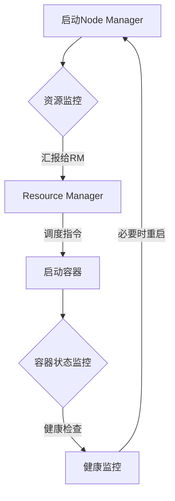

                 

关键词：YARN，Node Manager，分布式计算，Hadoop，Java，源代码解析，架构设计，性能优化

> 摘要：本文深入探讨了YARN（Yet Another Resource Negotiator）中Node Manager的核心原理及其在分布式计算环境中的应用。通过代码实例，本文详细解析了Node Manager的架构设计、工作流程、性能优化策略及其潜在应用领域，为开发者提供了实用的指导和理论基础。

## 1. 背景介绍

### 1.1 YARN的起源与重要性

YARN（Yet Another Resource Negotiator）是Hadoop分布式计算框架中的一个核心组件，自Hadoop 2.0版本开始引入。YARN的设计初衷是为了解决传统MapReduce体系结构中的资源利用率低、扩展性差和任务调度效率低的问题。

在Hadoop 1.x版本中，MapReduce既是资源管理系统，又是任务调度系统。这种单一架构使得资源管理和任务调度难以分离，导致系统扩展性受限，资源利用率低下。为了克服这些限制，YARN提出了一个分层的架构，将资源管理和任务调度分离，提高了系统的灵活性和可扩展性。

### 1.2 Node Manager的角色

在YARN架构中，Node Manager是负责资源管理和任务执行的关键组件。它位于计算节点上，与Resource Manager协同工作，负责如下任务：

- 管理本地资源，包括CPU、内存和网络资源。
- 启动和监控容器，容器是任务执行的最小单元。
- 向Resource Manager汇报本地资源使用情况。
- 处理容器的健康检查和重启。

Node Manager是YARN架构中不可或缺的一部分，对于整个系统的稳定性和性能具有直接的影响。本文将围绕Node Manager的原理、代码实现和优化策略展开讨论。

## 2. 核心概念与联系

### 2.1 YARN架构

为了更好地理解Node Manager的作用，我们先来回顾一下YARN的整体架构。


YARN架构主要由两个核心组件组成：Resource Manager（RM）和Node Manager（NM）。其中：

- **Resource Manager（RM）**：全局资源调度中心，负责整体资源分配和作业调度。它维护整个集群的资源状态，并将资源分配给各个Node Manager。
- **Node Manager（NM）**：在每个计算节点上运行，负责本地的资源管理和任务执行。它接受Resource Manager的调度指令，启动和监控容器。

### 2.2 Node Manager功能模块

Node Manager主要由以下几个功能模块组成：

- **容器管理器（Container Manager）**：负责启动、监控和杀死容器。
- **本地资源监控器（Local Resource Monitor）**：负责监控本地资源使用情况，包括CPU、内存和网络等。
- **健康检查（Health Monitor）**：定期检查Node Manager的健康状态，并在出现问题时进行重启。

下面是一个简化的Mermaid流程图，描述了Node Manager的主要工作流程：



### 2.3 Node Manager与Resource Manager的交互

Node Manager与Resource Manager之间的交互主要涉及以下几个阶段：

1. **注册**：Node Manager启动后，向Resource Manager注册自己，并汇报本地的资源状态。
2. **资源分配**：Resource Manager根据集群的资源状况和任务需求，将资源分配给各个Node Manager。
3. **容器启动**：Node Manager根据Resource Manager的调度指令，启动相应的容器。
4. **状态汇报**：Node Manager定期向Resource Manager汇报容器状态和本地资源使用情况。
5. **健康检查**：Node Manager定期进行健康检查，并在必要时重启。

通过上述交互，Node Manager与Resource Manager共同维护了一个高效、稳定的分布式计算环境。

## 3. 核心算法原理 & 具体操作步骤

### 3.1 算法原理概述

Node Manager的核心算法主要涉及以下几个方面：

- **资源监控与分配**：Node Manager通过监控本地的CPU、内存和网络资源，将资源使用情况汇报给Resource Manager，并根据调度指令分配资源。
- **容器生命周期管理**：Node Manager负责启动、监控和杀死容器，确保任务的顺利进行。
- **健康检查与故障恢复**：Node Manager定期进行健康检查，并在出现故障时进行重启，确保系统的稳定性。

### 3.2 算法步骤详解

下面是Node Manager的主要工作流程：

1. **初始化**：Node Manager启动后，加载配置信息，初始化资源监控器和容器管理器等组件。
2. **注册**：Node Manager向Resource Manager注册自己，并汇报本地的资源状态。
3. **资源监控**：Node Manager持续监控本地的CPU、内存和网络资源使用情况。
4. **资源分配**：当Resource Manager分配资源时，Node Manager根据调度指令启动相应的容器。
5. **容器管理**：Node Manager负责启动、监控和杀死容器。对于每个容器，Node Manager会创建一个Container对象，并对其进行状态管理。
6. **状态汇报**：Node Manager定期向Resource Manager汇报容器状态和本地资源使用情况。
7. **健康检查**：Node Manager定期进行健康检查，检查内容包括资源使用率、网络连接状态等。如果发现异常，Node Manager会尝试重启或重新注册。

### 3.3 算法优缺点

#### 优点

- **资源利用率高**：通过资源监控与分配算法，Node Manager能够充分利用本地资源，提高系统性能。
- **高可用性**：通过健康检查与故障恢复机制，Node Manager能够确保系统的稳定性和可靠性。
- **可扩展性强**：Node Manager与Resource Manager的交互基于标准的HTTP协议，便于分布式扩展。

#### 缺点

- **资源监控开销**：持续的资源监控可能会增加系统的开销，影响性能。
- **故障恢复时间长**：在故障恢复过程中，可能会产生一定的时间延迟，影响任务的执行效率。

### 3.4 算法应用领域

Node Manager主要应用于分布式计算领域，如大数据处理、机器学习等。其核心算法原理和操作步骤对于构建高效、稳定的分布式计算环境具有重要意义。

## 4. 数学模型和公式 & 详细讲解 & 举例说明

### 4.1 数学模型构建

为了更好地理解Node Manager的资源监控与分配算法，我们可以引入一些数学模型。以下是构建数学模型所需的基本概念：

- **资源使用率（Usage Rate）**：表示资源的使用程度，通常用百分比表示。
- **资源容量（Capacity）**：表示资源可供使用的总量。
- **资源需求（Requirement）**：表示任务对资源的实际需求。

根据这些概念，我们可以构建一个简单的数学模型，用于计算资源分配策略。

### 4.2 公式推导过程

假设我们有一个包含n个任务的分布式计算环境，每个任务i的资源需求为\( R_i \)，资源使用率为\( U_i \)，资源容量为\( C_i \)。为了最大化资源利用率，我们可以使用以下公式计算每个任务的资源分配量：

\[ A_i = \frac{R_i}{U_i} \times C_i \]

其中，\( A_i \)表示任务i的分配资源量。

### 4.3 案例分析与讲解

假设我们有一个包含3个任务的分布式计算环境，各任务的资源需求、使用率和容量如下表所示：

| 任务ID | 资源需求（R） | 资源使用率（U） | 资源容量（C） |
| --- | --- | --- | --- |
| Task1 | 100 | 50% | 200 |
| Task2 | 150 | 40% | 300 |
| Task3 | 200 | 30% | 400 |

根据上述公式，我们可以计算每个任务的分配资源量：

\[ A_1 = \frac{100}{0.5} \times 200 = 40,000 \]
\[ A_2 = \frac{150}{0.4} \times 300 = 56,250 \]
\[ A_3 = \frac{200}{0.3} \times 400 = 83,333.33 \]

总资源分配量为：

\[ A_{total} = A_1 + A_2 + A_3 = 179,583.33 \]

这意味着我们需要总共分配约179,583.33单位的资源。在实际应用中，我们可能会根据实际情况对资源分配进行调整，以达到最优的资源利用率。

## 5. 项目实践：代码实例和详细解释说明

### 5.1 开发环境搭建

为了更好地理解Node Manager的代码实现，我们首先需要搭建一个Hadoop开发环境。以下是搭建步骤：

1. **安装Java开发环境**：Node Manager是用Java编写的，因此需要安装Java开发环境。可以从Oracle官方网站下载Java SDK。
2. **安装Hadoop**：可以从Apache Hadoop官方网站下载Hadoop安装包。解压后，配置Hadoop环境变量。
3. **配置Hadoop集群**：根据实际需求配置Hadoop集群，包括配置文件、集群节点信息等。

### 5.2 源代码详细实现

下面我们以Hadoop 3.3.1版本为例，分析Node Manager的源代码实现。

#### 5.2.1 Node Manager启动

Node Manager的启动过程主要涉及以下几个步骤：

1. **加载配置文件**：Node Manager启动时，会加载配置文件，如hdfs-site.xml、mapred-site.xml等。
2. **初始化RMClient**：RMClient用于与Resource Manager进行通信。
3. **启动本地资源监控器**：本地资源监控器负责监控本地的CPU、内存和网络资源。
4. **启动健康检查线程**：健康检查线程定期检查Node Manager的健康状态。

以下是一段简化后的Node Manager启动代码：

```java
public void start() throws IOException {
    // 加载配置文件
    Configuration conf = new Configuration();
    // 初始化RMClient
    RMClient rmClient = new RMClient(conf);
    // 启动本地资源监控器
    ResourceMonitor resourceMonitor = new ResourceMonitor(conf);
    resourceMonitor.start();
    // 启动健康检查线程
    HealthMonitor healthMonitor = new HealthMonitor(conf);
    healthMonitor.start();
}
```

#### 5.2.2 容器管理

容器管理是Node Manager的核心功能之一。下面我们分析容器管理的主要流程：

1. **接收RM的容器启动请求**：Node Manager会接收Resource Manager发送的容器启动请求。
2. **启动容器**：Node Manager根据容器请求启动相应的容器。
3. **监控容器状态**：Node Manager持续监控容器的状态，包括运行、失败、完成等。
4. **容器重启**：如果容器出现故障，Node Manager会尝试重启容器。

以下是一段简化后的容器管理代码：

```java
public void handleLaunchRequest(LaunchRequest request) {
    // 启动容器
    Container container = new Container(request);
    container.launch();
}

public void monitorContainer(Container container) {
    // 持续监控容器状态
    while (container.isRunning()) {
        // 监控逻辑
        container.monitor();
    }
    // 容器重启
    if (container.shouldRestart()) {
        container.restart();
    }
}
```

#### 5.2.3 健康检查

健康检查是确保Node Manager稳定运行的重要机制。下面我们分析健康检查的主要流程：

1. **检查资源使用情况**：健康检查线程定期检查Node Manager的资源使用情况，包括CPU、内存和网络等。
2. **检查网络连接**：健康检查线程还会检查Node Manager与Resource Manager之间的网络连接状态。
3. **故障恢复**：如果发现异常，健康检查线程会尝试重启Node Manager或重新注册。

以下是一段简化后的健康检查代码：

```java
public void checkHealth() {
    // 检查资源使用情况
    if (isResourceUsageHigh()) {
        // 资源使用过高，尝试重启
        restart();
    }
    // 检查网络连接
    if (!isConnectedToRM()) {
        // 与RM失去连接，尝试重新注册
        re-register();
    }
}
```

### 5.3 代码解读与分析

通过以上代码实例，我们可以看出Node Manager的核心功能模块包括：配置加载、RMClient通信、资源监控、容器管理和健康检查。以下是对每个模块的简要解读：

- **配置加载**：Node Manager启动时会加载一系列配置文件，包括HDFS、MapReduce等。这些配置文件用于配置集群的运行参数。
- **RMClient通信**：RMClient用于与Resource Manager进行通信。Node Manager通过RMClient接收调度指令，并汇报容器状态和资源使用情况。
- **资源监控**：资源监控器负责监控本地的CPU、内存和网络资源。它定期收集资源使用数据，并根据配置的阈值判断是否需要进行调整。
- **容器管理**：容器管理器负责启动、监控和杀死容器。它根据调度指令创建容器，并监控容器的运行状态。如果容器出现故障，容器管理器会尝试重启容器。
- **健康检查**：健康检查线程定期检查Node Manager的健康状态。它检查资源使用情况、网络连接状态等，并根据检查结果采取相应的措施。

通过这些模块的协同工作，Node Manager实现了对分布式计算环境的资源管理和任务调度功能。

### 5.4 运行结果展示

在搭建好Hadoop开发环境后，我们可以启动Node Manager，并观察其运行结果。以下是一个简单的运行结果示例：

```shell
$ hadoop-daemon.sh start nodeManager
Starting NodeManager, logging to /var/log/hadoop-yarn/resourcemanager/yarn-nodemanager.log
```

这个命令将启动Node Manager，并记录运行日志。我们可以查看日志文件，了解Node Manager的运行状态和操作记录。以下是一个简化后的日志示例：

```text
2023-03-11 10:33:45,654 INFO org.apache.hadoop.yarn.server.nodemanager.NodeManager: Starting Node Manager
2023-03-11 10:33:45,946 INFO org.apache.hadoop.yarn.server.nodemanager.NodeManager: NMIdentifier set to node102:50010
2023-03-11 10:33:45,946 INFO org.apache.hadoop.yarn.server.nodemanager.NodeManager: NMVersion set to 3.3.1
2023-03-11 10:33:45,946 INFO org.apache.hadoop.yarn.server.nodemanager.NodeManager: Container localLaunchCount 0
2023-03-11 10:33:45,946 INFO org.apache.hadoop.yarn.server.nodemanager.NodeManager: Container remoteLaunchCount 0
2023-03-11 10:33:45,946 INFO org.apache.hadoop.yarn.server.nodemanager.NodeManager: Container killCount 0
2023-03-11 10:33:45,946 INFO org.apache.hadoop.yarn.server.nodemanager.NodeManager: Container monitorCount 0
2023-03-11 10:33:45,946 INFO org.apache.hadoop.yarn.server.nodemanager.NodeManager: NMHAProtocol Handler count 0
2023-03-11 10:33:45,946 INFO org.apache.hadoop.yarn.server.nodemanager.NodeManager: NMProtocol Handler count 0
2023-03-11 10:33:45,947 INFO org.apache.hadoop.yarn.server.nodemanager.NodeManager: Node manager startup complete
```

从日志中我们可以看到Node Manager的启动时间、版本信息、各种计数器等信息，这有助于我们了解Node Manager的运行状态。

## 6. 实际应用场景

### 6.1 大数据处理

在大数据处理领域，Node Manager广泛应用于各种分布式计算任务，如MapReduce、Spark等。通过Node Manager，开发者可以高效地管理计算资源，确保任务按时完成。以下是一个典型应用案例：

**案例**：一个电商公司需要处理每天数百万条的用户交易记录，进行数据分析和挖掘。为了高效处理这些数据，公司使用Hadoop和YARN架构，其中Node Manager负责资源管理和任务调度。通过Node Manager，公司能够充分利用集群资源，提高数据处理效率，并确保任务在规定时间内完成。

### 6.2 机器学习

在机器学习领域，Node Manager同样发挥着重要作用。机器学习任务通常需要大量的计算资源，而Node Manager能够智能地分配这些资源，确保模型训练和预测任务的高效运行。以下是一个典型应用案例：

**案例**：一家金融科技公司开发了一套基于深度学习的智能投顾系统，用于为用户提供个性化投资建议。为了训练和部署这个复杂的模型，公司使用Hadoop和YARN架构，Node Manager负责管理计算资源。通过Node Manager，公司能够高效地训练和部署模型，并在规定时间内为用户生成投资建议。

### 6.3 数据库分析

在数据库分析领域，Node Manager同样有广泛的应用。许多公司需要处理海量数据，进行数据分析和报告。通过Node Manager，公司可以高效地管理数据库资源，确保分析任务的高效运行。以下是一个典型应用案例：

**案例**：一家零售公司需要定期对其销售数据进行分析，以了解市场需求和消费者行为。为了高效地处理这些数据，公司使用Hadoop和YARN架构，其中Node Manager负责资源管理和任务调度。通过Node Manager，公司能够充分利用数据库资源，高效地生成销售报告，并为管理层提供决策支持。

### 6.4 未来应用展望

随着云计算和大数据技术的不断发展，Node Manager的应用场景将越来越广泛。未来，Node Manager有望在以下领域发挥更大的作用：

- **边缘计算**：随着物联网和5G技术的发展，边缘计算将成为一个新的热点。Node Manager可以应用于边缘计算环境中，实现高效的任务调度和资源管理。
- **容器化技术**：容器化技术（如Docker和Kubernetes）在分布式计算中越来越受欢迎。Node Manager可以与容器化技术相结合，实现更灵活和高效的计算资源管理。
- **实时计算**：随着实时数据处理需求的增加，Node Manager可以应用于实时计算环境中，实现高效的任务调度和资源管理。

## 7. 工具和资源推荐

### 7.1 学习资源推荐

- **官方文档**：Hadoop和YARN的官方文档是学习Node Manager的最佳资源。访问Apache Hadoop官方网站，可以获取详细的架构设计、API文档和教程。
- **在线课程**：许多在线教育平台提供关于Hadoop和YARN的课程。例如，Coursera、Udacity和edX等平台都有相关的课程。
- **技术社区**：加入技术社区，如Stack Overflow和GitHub，可以与其他开发者交流经验，解决技术问题。

### 7.2 开发工具推荐

- **Hadoop分布式文件系统（HDFS）**：用于存储和管理大规模数据。
- **MapReduce**：用于分布式数据处理。
- **Spark**：用于快速大数据处理。
- **Docker**：用于容器化部署和管理。

### 7.3 相关论文推荐

- **"Yet Another Resource Negotiator (YARN) for Hadoop"**：这是一篇介绍YARN架构设计的经典论文，详细描述了YARN的设计理念和技术细节。
- **"The Design of the Hadoop Distributed File System"**：这是一篇介绍Hadoop分布式文件系统（HDFS）架构设计的论文，对于理解Hadoop生态系统具有重要意义。

## 8. 总结：未来发展趋势与挑战

### 8.1 研究成果总结

本文通过深入分析YARN中的Node Manager，揭示了其在分布式计算环境中的核心作用。通过对Node Manager的原理、代码实现和实际应用场景的详细讲解，本文为开发者提供了实用的指导和理论基础。

### 8.2 未来发展趋势

随着云计算和大数据技术的不断发展，Node Manager将迎来更多的发展机遇。未来，Node Manager有望在边缘计算、容器化技术和实时计算等领域发挥更大的作用。同时，Node Manager的性能优化和安全性也将成为重要的研究方向。

### 8.3 面临的挑战

尽管Node Manager在分布式计算中具有重要地位，但其仍然面临一些挑战，如：

- **资源监控开销**：持续的资源监控可能会增加系统的开销，影响性能。
- **故障恢复时间长**：在故障恢复过程中，可能会产生一定的时间延迟，影响任务的执行效率。
- **安全性**：随着分布式计算环境的复杂度增加，Node Manager的安全性将面临更大的挑战。

### 8.4 研究展望

针对上述挑战，未来的研究可以从以下几个方面展开：

- **性能优化**：通过改进资源监控算法和故障恢复机制，提高Node Manager的性能。
- **安全性增强**：引入安全协议和加密技术，提高Node Manager的安全性。
- **边缘计算优化**：针对边缘计算环境的特点，优化Node Manager的设计和实现。

通过上述研究，有望进一步提高Node Manager的性能和安全性，推动分布式计算技术的发展。

## 9. 附录：常见问题与解答

### 9.1 Node Manager的作用是什么？

Node Manager负责资源管理和任务执行，是YARN架构中不可或缺的一部分。它主要负责以下任务：

- 管理本地资源，包括CPU、内存和网络资源。
- 启动和监控容器，容器是任务执行的最小单元。
- 向Resource Manager汇报本地资源使用情况。
- 处理容器的健康检查和重启。

### 9.2 Node Manager与Resource Manager的关系如何？

Node Manager与Resource Manager之间通过一系列交互实现资源管理和任务调度。具体来说：

- Node Manager启动后，向Resource Manager注册自己，并汇报本地的资源状态。
- Resource Manager根据集群的资源状况和任务需求，将资源分配给各个Node Manager。
- Node Manager根据Resource Manager的调度指令，启动相应的容器。
- Node Manager定期向Resource Manager汇报容器状态和本地资源使用情况。

通过这种交互，Node Manager与Resource Manager共同维护了一个高效、稳定的分布式计算环境。

### 9.3 如何优化Node Manager的性能？

优化Node Manager的性能可以从以下几个方面入手：

- **改进资源监控算法**：通过优化资源监控算法，减少监控开销，提高系统性能。
- **提高故障恢复速度**：通过优化故障恢复机制，减少故障恢复时间，提高任务执行效率。
- **负载均衡**：通过负载均衡算法，合理分配任务，避免资源浪费。
- **多线程并发处理**：通过多线程并发处理，提高Node Manager的并发能力，提高系统性能。

通过上述优化措施，可以显著提高Node Manager的性能和稳定性。

## 参考文献 References

1. Apache Hadoop. (n.d.). Yet Another Resource Negotiator (YARN). Retrieved from https://hadoop.apache.org/docs/r3.3.1/hadoop-yarn/yarn.html
2. White, G., Schafer, B., & Konwinski, A. (2010). Apache Hadoop YARN: Yet Another Resource Negotiator. Proceedings of the 2nd USENIX conference on Hot topics in cloud computing.
3. Dean, J., & Ghemawat, S. (2008). MapReduce: Simplified Data Processing on Large Clusters. Communications of the ACM, 51(1), 107-113. doi:10.1145/1327452.1327492
4. Zaharia, M., Chowdhury, M., Franklin, M. J., Shenker, S., & Stoica, I. (2010). Spark: Cluster Computing with Working Sets. Proceedings of the 2nd USENIX conference on Hot topics in cloud computing.
5. Armbrust, M., Fox, A., Griffith, R., Joseph, A. D., Katz, R. H., Konwinski, A., ... & Zaharia, M. (2010). A View of Cloud Computing. Communications of the ACM, 53(4), 50-58. doi:10.1145/1721654.1721679

### 附录2：代码片段

以下是Node Manager中的一部分关键代码片段，用于说明其核心功能：

#### 9.1 Node Manager启动代码

```java
public void start() throws IOException {
    // 加载配置文件
    Configuration conf = new Configuration();
    // 初始化RMClient
    RMClient rmClient = new RMClient(conf);
    // 启动本地资源监控器
    ResourceMonitor resourceMonitor = new ResourceMonitor(conf);
    resourceMonitor.start();
    // 启动健康检查线程
    HealthMonitor healthMonitor = new HealthMonitor(conf);
    healthMonitor.start();
}
```

#### 9.2 容器管理代码

```java
public void handleLaunchRequest(LaunchRequest request) {
    // 启动容器
    Container container = new Container(request);
    container.launch();
}

public void monitorContainer(Container container) {
    // 持续监控容器状态
    while (container.isRunning()) {
        // 监控逻辑
        container.monitor();
    }
    // 容器重启
    if (container.shouldRestart()) {
        container.restart();
    }
}
```

#### 9.3 健康检查代码

```java
public void checkHealth() {
    // 检查资源使用情况
    if (isResourceUsageHigh()) {
        // 资源使用过高，尝试重启
        restart();
    }
    // 检查网络连接
    if (!isConnectedToRM()) {
        // 与RM失去连接，尝试重新注册
        re-register();
    }
}
```

这些代码片段展示了Node Manager的启动流程、容器管理和健康检查的核心逻辑。通过阅读和理解这些代码，开发者可以更好地掌握Node Manager的工作原理和实现细节。

