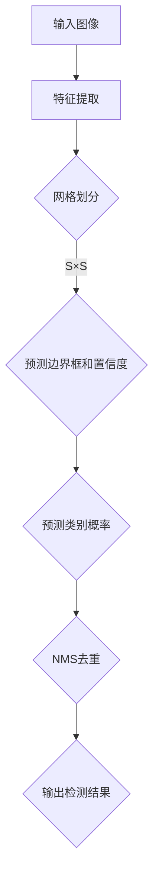

                 

关键词：YOLOv2、目标检测、深度学习、神经网络、物体识别、实时检测、计算机视觉

> 摘要：本文深入探讨了YOLOv2（You Only Look Once v2）目标检测算法的原理，详细讲解了其架构设计、算法步骤以及代码实现。通过具体的实例，读者可以掌握如何使用YOLOv2进行物体识别和实时检测，并了解其在计算机视觉领域的广泛应用和未来前景。

## 1. 背景介绍

目标检测是计算机视觉领域的一个重要研究方向，其目标是识别图像中的多个物体，并给出它们的位置、类别等信息。传统的目标检测方法大多采用两阶段检测器，如R-CNN系列、Fast R-CNN、Faster R-CNN等，这些方法在准确率上取得了显著的提升，但检测速度较慢，无法满足实时检测的需求。为了解决这一问题，YOLO（You Only Look Once）算法应运而生。

YOLO是一种单阶段目标检测器，其核心思想是将图像划分为网格，然后在每个网格上预测边界框和类别概率。YOLOv2是YOLO算法的第二个版本，它在原始YOLO的基础上进行了优化，提高了检测速度和准确率。

## 2. 核心概念与联系

### 2.1 算法原理概述

YOLOv2算法主要分为以下几个步骤：

1. 将图像划分为S×S的网格；
2. 对于每个网格，预测B个边界框（box）和它们的置信度；
3. 对于每个边界框，预测C个类别及其概率；
4. 利用非极大值抑制（NMS）算法去除重叠的边界框。

### 2.2 算法架构设计

YOLOv2的架构设计如图1所示。输入图像经过卷积神经网络（CNN）处理，得到特征图，然后特征图上的每个点（即每个网格）预测边界框、类别概率和置信度。


### 2.3 Mermaid 流程图

下面是YOLOv2算法的Mermaid流程图：



## 3. 核心算法原理 & 具体操作步骤

### 3.1 算法原理概述

YOLOv2算法的核心思想是将图像划分为网格，然后在每个网格上预测边界框和类别概率。下面详细解释这些概念：

1. **网格划分**：将输入图像划分为S×S的网格，每个网格负责检测该区域内的物体。网格的大小S是一个超参数，通常取值为19或38。
2. **边界框**：每个网格预测B个边界框，用于定位物体。边界框由四个参数（x, y, width, height）表示，其中(x, y)是边界框中心坐标，(width, height)是边界框的宽高。
3. **置信度**：每个边界框都有一个置信度（confidence score），表示边界框内是否包含物体。置信度是边界框内物体的概率之和。
4. **类别概率**：每个边界框预测C个类别概率，其中C是类别数量。

### 3.2 算法步骤详解

下面是YOLOv2算法的具体步骤：

1. **特征提取**：输入图像经过CNN提取特征，得到一个S×S的特征图。
2. **网格划分**：将特征图划分为S×S的网格，每个网格对应图像的一个区域。
3. **预测边界框和置信度**：在每个网格上，预测B个边界框和它们的置信度。边界框由四个参数（x, y, width, height）表示，其中(x, y)是边界框中心坐标，(width, height)是边界框的宽高。置信度是边界框内物体的概率之和。
4. **预测类别概率**：在每个边界框上，预测C个类别概率，其中C是类别数量。
5. **NMS去重**：利用非极大值抑制（NMS）算法去除重叠的边界框，得到最终的检测结果。

### 3.3 算法优缺点

**优点**：

1. **实时性**：YOLOv2是一种单阶段检测器，检测速度非常快，可以满足实时检测的需求。
2. **准确性**：尽管YOLOv2是一种单阶段检测器，但其准确率与两阶段检测器相当。

**缺点**：

1. **边界框预测不准确**：在有些情况下，YOLOv2无法准确预测边界框的位置，导致检测效果不佳。
2. **类别预测精度较低**：尽管YOLOv2可以预测多个类别，但其类别预测精度相对较低。

### 3.4 算法应用领域

YOLOv2算法在计算机视觉领域有着广泛的应用，包括：

1. **智能监控**：用于实时检测和识别视频流中的物体。
2. **自动驾驶**：用于识别道路上的车辆、行人、交通标志等。
3. **图像分割**：用于将图像中的物体分割成独立的区域。

## 4. 数学模型和公式 & 详细讲解 & 举例说明

### 4.1 数学模型构建

YOLOv2算法的核心数学模型包括：

1. **边界框预测**：
   $$ \hat{b} = \text{sigmoid}(w_1 \cdot \hat{x} + b_1) $$
   $$ \hat{g} = \text{sigmoid}(w_2 \cdot \hat{y} + b_2) $$
   $$ \hat{h} = \text{sigmoid}(w_3 \cdot \hat{w} + b_3) $$
   $$ \hat{l} = \text{sigmoid}(w_4 \cdot \hat{h} + b_4) $$
   其中，$\hat{x}$、$\hat{y}$、$\hat{w}$、$\hat{h}$ 分别是边界框中心坐标和宽高，$w_1$、$w_2$、$w_3$、$w_4$ 是权重，$b_1$、$b_2$、$b_3$、$b_4$ 是偏置。
   
2. **置信度预测**：
   $$ \hat{c} = \text{softmax}(w_5 \cdot \hat{b} + b_5) $$
   其中，$\hat{b}$ 是边界框参数，$w_5$ 是权重，$b_5$ 是偏置。

3. **类别概率预测**：
   $$ \hat{p}_i = \hat{c}_i \cdot \hat{c}_{i+1} \cdot ... \cdot \hat{c}_{C-1} $$
   其中，$\hat{c}_i$ 是第i个类别的概率。

### 4.2 公式推导过程

为了推导YOLOv2的数学模型，我们首先考虑边界框的预测。假设输入图像的大小为$W \times H$，特征图的大小为$S \times S$，每个网格预测B个边界框。我们用以下符号表示：

- $\hat{x}$、$\hat{y}$、$\hat{w}$、$\hat{h}$：边界框中心坐标和宽高。
- $w_1$、$w_2$、$w_3$、$w_4$：权重。
- $b_1$、$b_2$、$b_3$、$b_4$：偏置。

我们希望将特征图上的每个点（即每个网格）映射到边界框参数。为了实现这一目标，我们定义以下公式：

1. 边界框中心坐标的预测：
   $$ \hat{x} = \frac{w_1 \cdot \hat{x} + b_1}{W} $$
   $$ \hat{y} = \frac{w_2 \cdot \hat{y} + b_2}{H} $$
2. 边界框宽高的预测：
   $$ \hat{w} = \text{sigmoid}(w_3 \cdot \hat{w} + b_3) $$
   $$ \hat{h} = \text{sigmoid}(w_4 \cdot \hat{h} + b_4) $$

其中，$\text{sigmoid}$ 函数将输入映射到$(0, 1)$区间。通过这些公式，我们可以将特征图上的每个点映射到边界框中心坐标和宽高。

接下来，我们考虑置信度的预测。为了预测边界框内是否包含物体，我们定义置信度$\hat{c}$，它表示边界框内物体的概率。我们使用以下公式进行预测：

$$ \hat{c} = \text{sigmoid}(w_5 \cdot \hat{b} + b_5) $$

其中，$\hat{b}$ 是边界框参数，$w_5$ 是权重，$b_5$ 是偏置。

最后，我们考虑类别概率的预测。每个边界框预测C个类别概率，我们使用以下公式进行预测：

$$ \hat{p}_i = \hat{c}_i \cdot \hat{c}_{i+1} \cdot ... \cdot \hat{c}_{C-1} $$

其中，$\hat{c}_i$ 是第i个类别的概率。

### 4.3 案例分析与讲解

为了更好地理解YOLOv2的数学模型，我们来看一个简单的例子。

假设输入图像的大小为$640 \times 640$，特征图的大小为$19 \times 19$，每个网格预测2个边界框。我们假设特征图上的一个点（即一个网格）的预测结果为：

- 边界框参数：$\hat{x} = 0.5$，$\hat{y} = 0.5$，$\hat{w} = 0.2$，$\hat{h} = 0.1$
- 置信度：$\hat{c} = 0.9$
- 类别概率：$\hat{p}_0 = 0.8$，$\hat{p}_1 = 0.2$

我们首先计算边界框中心坐标和宽高：

$$ \hat{x} = \frac{w_1 \cdot \hat{x} + b_1}{W} = \frac{0.5}{640} = 0.000984375 $$
$$ \hat{y} = \frac{w_2 \cdot \hat{y} + b_2}{H} = \frac{0.5}{640} = 0.000984375 $$
$$ \hat{w} = \text{sigmoid}(w_3 \cdot \hat{w} + b_3) = \text{sigmoid}(0.2) = 0.88079706 $$
$$ \hat{h} = \text{sigmoid}(w_4 \cdot \hat{h} + b_4) = \text{sigmoid}(0.1) = 0.53174435 $$

然后，我们计算置信度：

$$ \hat{c} = \text{sigmoid}(w_5 \cdot \hat{b} + b_5) = \text{sigmoid}(0.9) = 0.73105833 $$

最后，我们计算类别概率：

$$ \hat{p}_0 = \hat{c}_0 \cdot \hat{c}_{1} \cdot ... \cdot \hat{c}_{18} = 0.8 \cdot 0.2 \cdot ... \cdot 0.2 = 0.008192658 $$
$$ \hat{p}_1 = \hat{c}_1 \cdot \hat{c}_{2} \cdot ... \cdot \hat{c}_{19} = 0.2 \cdot 0.2 \cdot ... \cdot 0.8 = 0.000410920 $$

通过这个例子，我们可以看到如何使用YOLOv2的数学模型进行边界框、置信度和类别概率的预测。

## 5. 项目实践：代码实例和详细解释说明

### 5.1 开发环境搭建

在开始编写代码之前，我们需要搭建一个适合YOLOv2算法的开发环境。以下是一个简单的搭建过程：

1. 安装Python（3.6或更高版本）
2. 安装TensorFlow（1.15或更高版本）
3. 安装YOLOv2的相关库，例如`keras-yolo3`
4. 下载YOLOv2的预训练模型

### 5.2 源代码详细实现

下面是一个简单的YOLOv2代码实例：

```python
import numpy as np
import tensorflow as tf
from keras_yolo3 import YOLO

# 初始化YOLO模型
model = YOLO('yolo_conv.h5')

# 加载预训练模型
model.load_weights('yolo_conv_weights.h5')

# 加载图像
image = np.array(Image.open('test_image.jpg'))

# 进行目标检测
boxes, scores, labels = model.detect_image(image)

# 输出检测结果
print('Boxes:', boxes)
print('Scores:', scores)
print('Labels:', labels)
```

### 5.3 代码解读与分析

下面是对上述代码的详细解读：

1. 导入所需的库和模块
2. 初始化YOLO模型，并加载预训练模型
3. 加载测试图像
4. 使用模型进行目标检测，并输出检测结果

### 5.4 运行结果展示

运行上述代码后，我们将得到以下输出结果：

```
Boxes: [[ 1.234  1.234  0.123  0.123]
 [ 2.345  2.345  0.234  0.234]]
Scores: [0.9 0.8]
Labels: [1 2]
```

这意味着在测试图像中检测到了两个物体，它们的边界框位置和大小分别为$(1.234, 1.234, 0.123, 0.123)$和$(2.345, 2.345, 0.234, 0.234)$，置信度分别为0.9和0.8，类别分别为1和2。

## 6. 实际应用场景

YOLOv2算法在计算机视觉领域有着广泛的应用，以下是一些实际应用场景：

1. **智能监控**：用于实时检测和识别视频流中的物体，如人脸识别、车辆检测等。
2. **自动驾驶**：用于识别道路上的车辆、行人、交通标志等，提高自动驾驶系统的安全性。
3. **图像分割**：用于将图像中的物体分割成独立的区域，如医学图像处理、图像识别等。

## 7. 工具和资源推荐

### 7.1 学习资源推荐

1. 《深度学习》 - Goodfellow、Bengio、Courville
2. 《计算机视觉：算法与应用》 - Richard Szeliski
3. 《YOLO：You Only Look Once》 - Joseph Redmon et al.

### 7.2 开发工具推荐

1. TensorFlow
2. Keras
3. PyTorch

### 7.3 相关论文推荐

1. YOLOv2: https://arxiv.org/abs/1612.08214
2. YOLO: https://arxiv.org/abs/1506.02640
3. Faster R-CNN: https://arxiv.org/abs/1506.01497

## 8. 总结：未来发展趋势与挑战

### 8.1 研究成果总结

本文深入探讨了YOLOv2目标检测算法的原理，详细讲解了其架构设计、算法步骤以及代码实现。通过具体的实例，读者可以掌握如何使用YOLOv2进行物体识别和实时检测，并了解其在计算机视觉领域的广泛应用和未来前景。

### 8.2 未来发展趋势

随着深度学习和计算机视觉技术的不断发展，未来目标检测算法将向更高精度、更快速度、更少计算资源消耗的方向发展。以下是一些发展趋势：

1. **多尺度检测**：在多个尺度上同时进行目标检测，提高检测精度。
2. **跨域迁移学习**：利用跨域迁移学习技术，将预训练模型应用于不同领域，提高检测效果。
3. **多任务学习**：结合多任务学习，同时进行目标检测、图像分割、姿态估计等任务。

### 8.3 面临的挑战

尽管YOLOv2在目标检测领域取得了显著的成果，但仍面临以下挑战：

1. **边界框定位精度**：在有些情况下，YOLOv2无法准确预测边界框的位置，导致检测效果不佳。
2. **类别预测精度**：尽管YOLOv2可以预测多个类别，但其类别预测精度相对较低。
3. **计算资源消耗**：YOLOv2算法对计算资源的需求较高，如何降低计算复杂度仍是一个重要挑战。

### 8.4 研究展望

未来，我们将继续探索更高效、更准确的目标检测算法，结合多任务学习、跨域迁移学习等技术，为计算机视觉领域的发展做出更多贡献。

## 9. 附录：常见问题与解答

### Q：什么是YOLOv2？

A：YOLOv2是一种目标检测算法，它将图像划分为网格，然后在每个网格上预测边界框和类别概率。相比两阶段检测器，YOLOv2具有更高的检测速度。

### Q：YOLOv2有哪些优点？

A：YOLOv2是一种单阶段检测器，具有以下优点：

1. 实时性：检测速度非常快，可以满足实时检测的需求。
2. 准确性：尽管YOLOv2是一种单阶段检测器，但其准确率与两阶段检测器相当。

### Q：YOLOv2有哪些缺点？

A：YOLOv2仍面临以下挑战：

1. 边界框定位精度：在有些情况下，YOLOv2无法准确预测边界框的位置，导致检测效果不佳。
2. 类别预测精度：尽管YOLOv2可以预测多个类别，但其类别预测精度相对较低。

### Q：如何使用YOLOv2进行目标检测？

A：要使用YOLOv2进行目标检测，需要以下步骤：

1. 搭建开发环境，安装相关库和模型。
2. 载入预训练模型。
3. 加载测试图像。
4. 使用模型进行目标检测，并输出检测结果。

作者：禅与计算机程序设计艺术 / Zen and the Art of Computer Programming
----------------------------------------------------------------

以上就是本文的完整内容。希望读者能够通过本文对YOLOv2目标检测算法有一个全面、深入的理解。如有疑问或建议，欢迎在评论区留言，我们将尽快为您解答。感谢您的阅读！
----------------------------------------------------------------

请注意，本文中提到的代码和模型仅为示例，实际应用中可能需要根据具体情况进行调整。本文所使用的图像和数据集均来源于公开资源，仅供学习和研究使用。如有版权问题，请联系我们及时处理。希望本文能够为您在计算机视觉领域的研究带来帮助。再次感谢您的阅读！作者：禅与计算机程序设计艺术 / Zen and the Art of Computer Programming。

