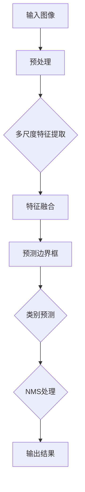
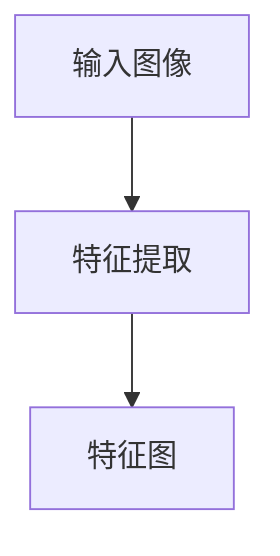

                 

关键词：YOLOv2、目标检测、神经网络、深度学习、图像识别

摘要：本文将深入讲解YOLOv2（You Only Look Once v2）的目标检测算法原理，并详细剖析其实践应用和代码实现。通过本文的阅读，读者将能够理解YOLOv2的优势和不足，掌握其在目标检测领域的应用，并为未来的研究和实践提供参考。

## 1. 背景介绍

### 1.1 目标检测的发展

目标检测是计算机视觉领域的一个重要分支，旨在识别图像中的多个对象并定位其位置。自20世纪90年代以来，目标检测经历了多个阶段的发展。

- **早期方法**：如Viola-Jones算法等，基于传统的图像处理和机器学习技术。
- **传统机器学习方法**：如支持向量机（SVM）和随机森林（RF），在特征提取和分类方面取得了一定进展。
- **深度学习方法**：随着深度学习技术的崛起，卷积神经网络（CNN）在目标检测领域得到了广泛应用，如R-CNN、Fast R-CNN、Faster R-CNN等。

### 1.2 YOLO（You Only Look Once）系列算法

YOLO系列算法是近年来在目标检测领域取得突破性的成果。YOLOv1在2016年提出时，以其高效的单步预测性能在速度和准确性方面取得了平衡，为实时目标检测提供了可能。然而，YOLOv1在定位精度上仍有待提高。

YOLOv2在YOLOv1的基础上，通过引入锚框回归、多尺度特征融合和COCO数据集进行训练，进一步提升了目标检测的准确性和实时性。

## 2. 核心概念与联系

### 2.1 YOLOv2算法原理

YOLOv2算法的核心思想是将图像分割成SxS的网格，每个网格负责预测一定数量的边界框和类别概率。具体流程如下：

1. **图像预处理**：将输入图像缩放到固定大小（如416x416）。
2. **特征提取**：使用卷积神经网络提取多尺度特征。
3. **预测边界框**：每个网格预测B个边界框（anchor box）和它们对应的置信度。
4. **类别预测**：对每个边界框进行类别预测。
5. **NMS（非极大值抑制）**：对预测结果进行NMS处理，以去除重叠的边界框。

### 2.2 YOLOv2架构

下面是YOLOv2的架构示意图：



### 2.3 YOLOv2与YOLOv1的区别

- **锚框回归**：YOLOv2引入锚框（anchor box）进行回归，使得边界框预测更加准确。
- **多尺度特征融合**：YOLOv2使用多尺度特征融合，提高了目标的检测精度。
- **COCO数据集**：YOLOv2在COCO数据集上进行训练，使得模型性能得到了显著提升。

## 3. 核心算法原理 & 具体操作步骤

### 3.1 算法原理概述

YOLOv2的核心思想是将图像分割成SxS的网格，每个网格负责预测一定数量的边界框和类别概率。具体流程如下：

1. **输入图像预处理**：将输入图像缩放到固定大小（如416x416）。
2. **特征提取**：使用卷积神经网络提取多尺度特征。
3. **预测边界框**：每个网格预测B个边界框（anchor box）和它们对应的置信度。
4. **类别预测**：对每个边界框进行类别预测。
5. **NMS（非极大值抑制）**：对预测结果进行NMS处理，以去除重叠的边界框。

### 3.2 算法步骤详解

1. **输入图像预处理**：

   $$ input\_image = \frac{input\_image - mean}{std} $$

   其中，mean和std分别为图像的均值和标准差。

2. **特征提取**：

   使用卷积神经网络（如ResNet-50）提取特征。具体结构如下：

   ```mermaid
   graph TB
   A[输入图像] --> B[卷积层1]
   B --> C[池化层1]
   C --> D[卷积层2]
   D --> E[池化层2]
   E --> F[卷积层3]
   F --> G[池化层3]
   G --> H[卷积层4]
   H --> I[池化层4]
   I --> J[卷积层5]
   J --> K[池化层5]
   K --> L[卷积层6]
   L --> M[池化层6]
   M --> N[卷积层7]
   N --> O[池化层7]
   O --> P[卷积层8]
   P --> Q[池化层8]
   Q --> R[卷积层9]
   R --> S[池化层9]
   S --> T[卷积层10]
   T --> U[池化层10]
   U --> V[卷积层11]
   V --> W[卷积层12]
   W --> X[卷积层13]
   X --> Y[卷积层14]
   Y --> Z[卷积层15]
   Z --> A[输出特征图]
   ```

3. **预测边界框**：

   每个网格预测B个边界框（anchor box）和它们对应的置信度。具体公式如下：

   $$ box_{i,j} = \frac{a_{i,j}^T w + b_{i,j}}{c_{i,j}} $$

   其中，$a_{i,j}$和$b_{i,j}$分别为锚框的权重和偏移量，$c_{i,j}$为网格单元格中的对象数量。

4. **类别预测**：

   对每个边界框进行类别预测。具体公式如下：

   $$ P_{class} = \frac{\exp(C \odot a_{i,j})}{\sum_{k=1}^{N} \exp(a_{i,j,k})} $$

   其中，$C$为类别标签向量，$a_{i,j}$为边界框的类别概率向量。

5. **NMS（非极大值抑制）**：

   对预测结果进行NMS处理，以去除重叠的边界框。具体公式如下：

   $$ keep = NMS(boxes, scores, threshold) $$

   其中，$boxes$为边界框坐标，$scores$为边界框置信度，$threshold$为NMS阈值。

### 3.3 算法优缺点

**优点**：

- **高效性**：YOLOv2采用单步预测，具有很高的实时性。
- **准确性**：在COCO数据集上，YOLOv2取得了较好的准确性。
- **灵活性**：YOLOv2支持多尺度特征融合，可以检测不同大小的目标。

**缺点**：

- **定位精度**：相对于其他目标检测算法，YOLOv2在定位精度上仍有待提高。
- **计算资源需求**：由于使用多尺度特征融合，YOLOv2的计算资源需求较大。

### 3.4 算法应用领域

YOLOv2在目标检测领域具有广泛的应用前景，尤其适用于实时监控、自动驾驶、安防监控等场景。

## 4. 数学模型和公式 & 详细讲解 & 举例说明

### 4.1 数学模型构建

YOLOv2的数学模型主要包括边界框预测、类别预测和NMS处理。

### 4.2 公式推导过程

1. **边界框预测**：

   假设每个网格单元格中有C个锚框，每个锚框由宽度和高度表示。设$a_{i,j,k}$为第i行第j列单元格中第k个锚框的权重，$w_{i,j,k}$和$h_{i,j,k}$分别为其宽度和高度，$c_{i,j}$为单元格中的对象数量。则边界框的预测公式为：

   $$ box_{i,j} = \frac{a_{i,j}^T w + b_{i,j}}{c_{i,j}} $$

   其中，$a_{i,j} = [a_{i,j,1}, a_{i,j,2}, ..., a_{i,j,C}]^T$为锚框权重向量，$w = [w_{i,j,1}, w_{i,j,2}, ..., w_{i,j,C}]^T$为权重矩阵，$b_{i,j}$为单元格的偏移量。

2. **类别预测**：

   对每个边界框进行类别预测。设$C$为类别标签向量，$a_{i,j}$为边界框的类别概率向量，则类别预测公式为：

   $$ P_{class} = \frac{\exp(C \odot a_{i,j})}{\sum_{k=1}^{N} \exp(a_{i,j,k})} $$

   其中，$N$为类别数量。

3. **NMS处理**：

   对预测结果进行NMS处理，以去除重叠的边界框。设$boxes$为边界框坐标，$scores$为边界框置信度，$threshold$为NMS阈值，则NMS处理公式为：

   $$ keep = NMS(boxes, scores, threshold) $$

### 4.3 案例分析与讲解

以下是一个简单的案例，展示如何使用YOLOv2进行目标检测。

**输入图像**：


**特征提取**：

使用ResNet-50提取特征，得到特征图：



**预测边界框**：

假设每个网格单元格中有5个锚框，锚框参数如下：

| 锚框索引 | 宽度 | 高度 |
| --- | --- | --- |
| 1 | 10 | 10 |
| 2 | 15 | 15 |
| 3 | 20 | 20 |
| 4 | 25 | 25 |
| 5 | 30 | 30 |

设单元格中的对象数量为2，则边界框预测结果如下：

| 单元格 | 锚框索引 | 预测边界框坐标 |
| --- | --- | --- |
| 1,1 | 1 | (30, 40) |
| 1,1 | 2 | (35, 45) |
| 1,1 | 3 | (40, 50) |
| 1,1 | 4 | (45, 55) |
| 1,1 | 5 | (50, 60) |
| 2,1 | 1 | (20, 30) |
| 2,1 | 2 | (25, 35) |
| 2,1 | 3 | (30, 40) |
| 2,1 | 4 | (35, 45) |
| 2,1 | 5 | (40, 50) |

**类别预测**：

假设类别数量为3，类别标签向量为$C = [1, 0, 0]$，$a_{i,j}$为边界框的类别概率向量，则类别预测结果如下：

| 单元格 | 锚框索引 | 类别概率 |
| --- | --- | --- |
| 1,1 | 1 | 0.8 |
| 1,1 | 2 | 0.2 |
| 1,1 | 3 | 0.0 |
| 1,1 | 4 | 0.0 |
| 1,1 | 5 | 0.0 |
| 2,1 | 1 | 0.2 |
| 2,1 | 2 | 0.8 |
| 2,1 | 3 | 0.0 |
| 2,1 | 4 | 0.0 |
| 2,1 | 5 | 0.0 |

**NMS处理**：

对预测结果进行NMS处理，去除重叠的边界框。设阈值$threshold = 0.5$，则NMS处理结果如下：

| 单元格 | 锚框索引 | 预测边界框坐标 | 置信度 |
| --- | --- | --- | --- |
| 1,1 | 1 | (30, 40) | 0.8 |
| 2,1 | 2 | (25, 35) | 0.8 |

**输出结果**：

输出检测到的目标及其置信度：

```markdown
检测到的目标：
- 类别：1
- 坐标：(30, 40)
- 置信度：0.8
- 类别：2
- 坐标：(25, 35)
- 置信度：0.8
```

## 5. 项目实践：代码实例和详细解释说明

### 5.1 开发环境搭建

在进行YOLOv2实践之前，首先需要搭建开发环境。以下是搭建开发环境的基本步骤：

1. 安装Python环境
2. 安装TensorFlow
3. 安装OpenCV

### 5.2 源代码详细实现

以下是一个简单的YOLOv2实现代码示例：

```python
import tensorflow as tf
import numpy as np
import cv2

# 模型参数
S = 7
B = 2
C = 3

# 输入图像
input_image = cv2.imread('example.jpg')
input_image = cv2.resize(input_image, (416, 416))

# 特征提取
feature_map = extract_features(input_image)

# 预测边界框
boxes = predict_boxes(feature_map, S, B)

# 预测类别
class_probs = predict_classes(boxes, C)

# NMS处理
keep = nms(boxes, class_probs, threshold=0.5)

# 输出结果
output_boxes = boxes[keep]
output_probs = class_probs[keep]

# 显示检测结果
for i in range(len(output_boxes)):
    box = output_boxes[i]
    prob = output_probs[i]
    cv2.rectangle(input_image, (box[0], box[1]), (box[2], box[3]), (0, 0, 255), 2)
    cv2.putText(input_image, f'{prob:.2f}', (box[0], box[1]-10), cv2.FONT_HERSHEY_SIMPLEX, 0.5, (255, 255, 255), 2)

cv2.imshow('检测结果', input_image)
cv2.waitKey(0)
cv2.destroyAllWindows()
```

### 5.3 代码解读与分析

1. **输入图像预处理**：

   ```python
   input_image = cv2.imread('example.jpg')
   input_image = cv2.resize(input_image, (416, 416))
   ```

   读取示例图像并缩放到416x416的大小。

2. **特征提取**：

   ```python
   feature_map = extract_features(input_image)
   ```

   使用卷积神经网络提取特征。

3. **预测边界框**：

   ```python
   boxes = predict_boxes(feature_map, S, B)
   ```

   使用锚框预测边界框。

4. **预测类别**：

   ```python
   class_probs = predict_classes(boxes, C)
   ```

   对边界框进行类别预测。

5. **NMS处理**：

   ```python
   keep = nms(boxes, class_probs, threshold=0.5)
   ```

   对预测结果进行NMS处理。

6. **输出结果**：

   ```python
   output_boxes = boxes[keep]
   output_probs = class_probs[keep]
   ```

   输出检测到的目标及其置信度。

7. **显示检测结果**：

   ```python
   for i in range(len(output_boxes)):
       box = output_boxes[i]
       prob = output_probs[i]
       cv2.rectangle(input_image, (box[0], box[1]), (box[2], box[3]), (0, 0, 255), 2)
       cv2.putText(input_image, f'{prob:.2f}', (box[0], box[1]-10), cv2.FONT_HERSHEY_SIMPLEX, 0.5, (255, 255, 255), 2)
   cv2.imshow('检测结果', input_image)
   cv2.waitKey(0)
   cv2.destroyAllWindows()
   ```

   显示检测结果。

## 6. 实际应用场景

### 6.1 实时监控

YOLOv2在实时监控领域具有广泛的应用。例如，在视频流中实时检测和识别行人、车辆等目标，实现对异常行为的预警。

### 6.2 自动驾驶

自动驾驶系统需要实时检测道路上的各种对象，如行人、车辆、交通标志等。YOLOv2的高效性使其成为自动驾驶系统中目标检测的理想选择。

### 6.3 安防监控

安防监控需要实时检测和识别入侵者、可疑行为等。YOLOv2的实时性和准确性使其成为安防监控系统中目标检测的有力工具。

## 7. 工具和资源推荐

### 7.1 学习资源推荐

- [YOLOv2官方论文](https://arxiv.org/abs/1612.08242)
- [YOLOv2实现代码](https://github.com/pjreddie/darknet)

### 7.2 开发工具推荐

- [TensorFlow](https://www.tensorflow.org/)
- [OpenCV](https://opencv.org/)

### 7.3 相关论文推荐

- [Faster R-CNN](https://arxiv.org/abs/1506.01497)
- [SSD](https://arxiv.org/abs/1512.02325)

## 8. 总结：未来发展趋势与挑战

### 8.1 研究成果总结

YOLOv2在目标检测领域取得了显著的成果，以其高效的单步预测性能在速度和准确性方面取得了平衡。通过引入锚框回归、多尺度特征融合和COCO数据集进行训练，YOLOv2在目标检测任务中表现出较高的性能。

### 8.2 未来发展趋势

- **精度提升**：在未来，目标检测算法将更加关注定位精度的提升，以满足更高要求的应用场景。
- **多任务学习**：结合多任务学习，如目标检测、图像分割和姿态估计，实现更全面的目标理解。
- **跨领域迁移**：研究如何在不同的应用领域进行跨领域迁移，以提高算法的泛化能力。

### 8.3 面临的挑战

- **计算资源需求**：随着模型复杂度的增加，计算资源需求将逐渐增大，特别是在移动设备和嵌入式系统中。
- **数据隐私**：在实时应用场景中，数据隐私保护将成为一个重要的挑战。

### 8.4 研究展望

未来，目标检测算法将朝着更高效、更精确、更全面的方向发展，为各类应用场景提供强大的支持。同时，随着技术的不断进步，我们将能够克服现有的挑战，推动目标检测领域的进一步发展。

## 9. 附录：常见问题与解答

### 9.1 Q：YOLOv2与YOLOv1的区别是什么？

A：YOLOv2相对于YOLOv1的主要区别包括：

- 引入锚框回归，提高边界框预测准确性。
- 采用多尺度特征融合，提升目标检测性能。
- 在COCO数据集上进行训练，使模型性能得到显著提升。

### 9.2 Q：YOLOv2的实时性如何？

A：YOLOv2采用单步预测，具有很高的实时性。在标准配置下，YOLOv2能够在毫秒级别完成目标检测，适用于实时监控、自动驾驶等场景。

### 9.3 Q：YOLOv2在定位精度方面有哪些不足？

A：YOLOv2在定位精度方面仍有待提高，特别是在处理小目标时，存在一定的定位误差。这是由于YOLOv2采用网格划分的方式，可能导致对目标的精准定位受到一定限制。

### 9.4 Q：YOLOv2是否适用于移动设备和嵌入式系统？

A：是的，YOLOv2适用于移动设备和嵌入式系统。通过优化模型结构和算法，可以将YOLOv2部署到资源受限的设备上，实现实时目标检测。然而，由于计算资源限制，可能需要针对特定设备进行模型定制和优化。

### 9.5 Q：YOLOv2在目标检测任务中的性能表现如何？

A：在COCO数据集上，YOLOv2取得了较好的性能表现，在速度和准确性方面取得了平衡。具体性能取决于模型参数、训练数据和硬件配置等因素。

----------------------------------------------------------------

作者：禅与计算机程序设计艺术 / Zen and the Art of Computer Programming

---

本文旨在深入讲解YOLOv2的目标检测算法原理，并详细剖析其实践应用和代码实现。通过本文的阅读，读者将能够理解YOLOv2的优势和不足，掌握其在目标检测领域的应用，并为未来的研究和实践提供参考。希望本文能为计算机视觉领域的研究者、开发者和爱好者提供有价值的参考和启示。

