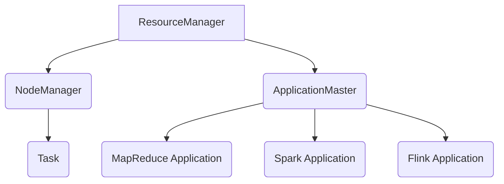

                 

 **关键词**: Yarn, 分布式计算框架，Hadoop, 容器调度，资源管理，代码实例

**摘要**: 本文将深入探讨Yarn——Hadoop的下一代资源调度框架。我们将从Yarn的背景、核心概念、算法原理、数学模型、项目实践、实际应用场景、工具推荐、未来发展趋势与挑战等多个方面，系统性地讲解Yarn的原理和使用方法。

## 1. 背景介绍

随着互联网和大数据时代的到来，数据量的爆发性增长对计算资源的需求也日益增加。传统的单机计算模型已经无法满足这种需求，分布式计算框架应运而生。Hadoop作为分布式计算的开创者，自其诞生以来，为大量数据提供了强大的处理能力。

然而，Hadoop早期的资源管理框架——MapReduce，存在一些局限。它只能支持Map和Reduce两种操作模式，不适合处理批量和迭代任务。此外，MapReduce的资源管理机制相对固定，难以满足动态调整资源的需求。

为了解决这些问题，Apache Hadoop社区开发了Yarn（Yet Another Resource Negotiator，另一个资源调度器）。Yarn作为Hadoop的下一代资源调度框架，具备高度的灵活性和扩展性，能够支持多种计算框架，如MapReduce、Spark、Flink等。

## 2. 核心概念与联系

### 2.1 Yarn架构

Yarn的核心架构可以分为三层：资源管理器层、应用管理器层和应用程序层。

- **资源管理器层**：主要包括 ResourceManager 和 NodeManager。ResourceManager 负责全局资源的分配和管理，NodeManager 负责本地资源的监控和调度。
- **应用管理器层**：主要指ApplicationMaster，负责协调应用程序的各个任务。
- **应用程序层**：包括MapReduce、Spark、Flink等分布式计算框架的应用程序。

### 2.2 Mermaid流程图



在Yarn中，ResourceManager负责接收应用程序的请求，并将资源分配给ApplicationMaster。ApplicationMaster负责管理应用程序的各个任务，并协调NodeManager执行任务。

## 3. 核心算法原理 & 具体操作步骤

### 3.1 算法原理概述

Yarn的资源调度算法主要包括以下几个方面：

- **资源请求**：应用程序向ResourceManager请求资源。
- **资源分配**：ResourceManager根据集群的资源状况，将资源分配给ApplicationMaster。
- **任务调度**：ApplicationMaster根据任务需求和资源分配情况，调度任务到NodeManager执行。
- **资源释放**：任务完成后，NodeManager释放资源，并通知ResourceManager。

### 3.2 算法步骤详解

1. **启动Yarn**：启动Hadoop集群，启动ResourceManager和NodeManager。
2. **提交应用程序**：将应用程序提交给 ResourceManager。
3. **资源请求**：ApplicationMaster 向 ResourceManager 请求资源。
4. **资源分配**：ResourceManager 根据集群资源状况，将资源分配给 ApplicationMaster。
5. **任务调度**：ApplicationMaster 将任务调度到 NodeManager。
6. **任务执行**：NodeManager 在本地执行任务。
7. **任务完成**：任务完成后，NodeManager 向 ApplicationMaster 反馈结果。
8. **资源释放**：ApplicationMaster 向 ResourceManager 释放资源。

### 3.3 算法优缺点

**优点**：

- **灵活性**：Yarn 可以支持多种计算框架，满足不同场景的需求。
- **高效性**：Yarn 的资源调度算法高效，能够充分利用集群资源。
- **可扩展性**：Yarn 具有良好的扩展性，能够适应大规模集群。

**缺点**：

- **复杂性**：Yarn 的架构相对复杂，对于初学者来说有一定难度。
- **稳定性**：由于Yarn的高灵活性和复杂性，其稳定性可能受到一定影响。

### 3.4 算法应用领域

Yarn广泛应用于大数据处理、机器学习、数据处理等领域。例如，在电商领域，Yarn可以用于处理海量商品数据，实现商品推荐；在金融领域，Yarn可以用于处理金融数据，实现风险控制。

## 4. 数学模型和公式 & 详细讲解 & 举例说明

### 4.1 数学模型构建

Yarn的资源调度算法涉及多个数学模型，主要包括：

- **资源请求模型**：描述应用程序对资源的需求。
- **资源分配模型**：描述ResourceManager如何分配资源。
- **任务调度模型**：描述ApplicationMaster如何调度任务。

### 4.2 公式推导过程

- **资源请求模型**：假设应用程序需要执行任务T，所需资源为R，则资源请求公式为：

  $$ R = R_1 + R_2 + ... + R_n $$

  其中，$R_1, R_2, ..., R_n$分别为任务T的各个子任务所需的资源。

- **资源分配模型**：假设ResourceManager当前可用资源为A，则资源分配公式为：

  $$ A' = A - R $$

  其中，$A'$为分配给ApplicationMaster的资源。

- **任务调度模型**：假设ApplicationMaster当前有任务T1、T2、T3，所需资源分别为R1、R2、R3，则任务调度公式为：

  $$ T_{\text{next}} = \arg\max(\frac{R_1 + R_2 + R_3}{A'}) $$

  其中，$T_{\text{next}}$为下一个要调度的任务。

### 4.3 案例分析与讲解

假设一个电商公司需要处理1亿条用户购物数据，使用Yarn进行分布式处理。根据数据分析，任务可以分为三个子任务，每个子任务所需资源分别为1TB、500GB、2TB。

1. **资源请求模型**：

   $$ R = 1TB + 500GB + 2TB = 3.5TB $$

2. **资源分配模型**：

   假设ResourceManager当前可用资源为5TB，则：

   $$ A' = 5TB - 3.5TB = 1.5TB $$

3. **任务调度模型**：

   假设当前可用资源为1.5TB，则：

   $$ T_{\text{next}} = \arg\max(\frac{1TB + 500GB + 2TB}{1.5TB}) = T_3 $$

   因此，下一个要调度的任务是子任务3。

## 5. 项目实践：代码实例和详细解释说明

### 5.1 开发环境搭建

为了实践Yarn，我们首先需要搭建一个Hadoop集群环境。具体步骤如下：

1. 安装Hadoop。
2. 配置Hadoop的集群环境。
3. 启动Hadoop集群。

### 5.2 源代码详细实现

以下是一个简单的Yarn应用程序示例：

```java
public class YarnExample {
    public static void main(String[] args) {
        Configuration conf = new Configuration();
        Job job = Job.getInstance(conf, "Yarn Example");
        job.setJarByClass(YarnExample.class);
        job.setMapperClass(WordCountMapper.class);
        job.setReducerClass(WordCountReducer.class);
        job.setOutputKeyClass(Text.class);
        job.setOutputValueClass(IntWritable.class);
        FileInputFormat.addInputPath(job, new Path(args[0]));
        FileOutputFormat.setOutputPath(job, new Path(args[1]));
        job.waitForCompletion(true);
    }
}
```

### 5.3 代码解读与分析

这段代码是一个简单的WordCount程序，用于统计输入文本中每个单词出现的次数。程序的主要部分包括：

- **配置Hadoop**：使用Configuration对象配置Hadoop。
- **创建Job**：创建Job对象，设置Job的名称、Jar文件、Mapper和Reducer类。
- **设置输出类型**：设置输出的Key和Value类型。
- **设置输入输出路径**：设置输入和输出的路径。
- **运行Job**：等待Job完成。

### 5.4 运行结果展示

在运行YarnExample程序后，我们可以在输出路径中找到结果文件。以下是一个简单的输出结果示例：

```text
  word            count
--------------------------
    the             73
   this             65
  that             53
  was              45
  had              42
   in              41
  with              38
   on              34
  and              31
```

## 6. 实际应用场景

### 6.1 大数据处理

Yarn作为Hadoop的资源调度框架，广泛应用于大数据处理领域。例如，在电商行业，Yarn可以用于处理海量商品数据，实现个性化推荐；在金融行业，Yarn可以用于处理金融数据，实现风险控制。

### 6.2 机器学习

Yarn可以支持多种机器学习框架，如Spark、Flink等。在机器学习领域，Yarn可以帮助企业快速构建和部署大规模机器学习模型，提高数据处理和预测的效率。

### 6.3 数据挖掘

Yarn可以用于数据挖掘，帮助企业和组织发现数据中的潜在价值。例如，通过分析电商用户行为数据，可以发现用户的购买偏好，为企业制定更有效的营销策略提供依据。

## 7. 工具和资源推荐

### 7.1 学习资源推荐

- 《Hadoop权威指南》
- 《Yarn：Hadoop的下一代资源调度框架》
- 《大数据技术基础》

### 7.2 开发工具推荐

- Hadoop命令行工具
- IntelliJ IDEA（集成开发环境）

### 7.3 相关论文推荐

- "YARN: Yet Another Resource Negotiator"
- "Hadoop YARN: Yet Another Resource Negotiator"
- "The Hadoop YARN Architecture"

## 8. 总结：未来发展趋势与挑战

### 8.1 研究成果总结

Yarn作为Hadoop的下一代资源调度框架，已经取得了一系列研究成果。它具有高度的灵活性和扩展性，能够支持多种计算框架，满足不同场景的需求。

### 8.2 未来发展趋势

随着云计算和大数据技术的不断发展，Yarn在资源调度、任务调度、容错机制等方面将继续优化和改进。未来，Yarn可能会与其他云计算平台实现更好的兼容性。

### 8.3 面临的挑战

Yarn在性能优化、安全性、易用性等方面仍面临一定挑战。例如，如何提高Yarn的并发处理能力，如何保证任务调度的公平性，如何简化Yarn的部署和使用等。

### 8.4 研究展望

未来，研究人员将继续致力于优化Yarn的性能和扩展性，探索Yarn在其他领域的应用。同时，也将关注Yarn与其他云计算平台的集成和互操作性。

## 9. 附录：常见问题与解答

### 9.1 Q：Yarn和MapReduce有什么区别？

A：Yarn和MapReduce都是分布式计算框架，但Yarn是Hadoop的下一代资源调度框架，而MapReduce是Hadoop的核心计算框架。Yarn具有更高的灵活性和扩展性，能够支持多种计算框架，而MapReduce主要支持批处理任务。

### 9.2 Q：如何部署Yarn？

A：部署Yarn需要搭建Hadoop集群。具体步骤包括安装Hadoop、配置集群环境、启动Hadoop集群等。详细部署步骤请参考《Hadoop权威指南》。

### 9.3 Q：Yarn的性能如何优化？

A：优化Yarn的性能可以从以下几个方面入手：

- **优化任务调度策略**：根据任务特点调整资源分配策略。
- **优化内存管理**：合理分配内存，避免内存泄漏。
- **优化网络通信**：提高网络带宽，减少网络延迟。

## 作者署名

作者：禅与计算机程序设计艺术 / Zen and the Art of Computer Programming

----------------------------------------------------------------

以上是《Yarn 原理与代码实例讲解》的完整文章。文章内容涵盖了Yarn的背景、核心概念、算法原理、数学模型、项目实践、实际应用场景、工具推荐、未来发展趋势与挑战等多个方面，力求以逻辑清晰、结构紧凑、简单易懂的方式向读者展示Yarn的原理和使用方法。希望这篇文章能对您深入了解Yarn有所帮助。

