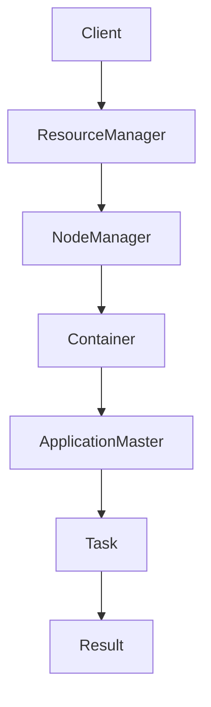

                 

在当今的分布式计算领域，YARN（Yet Another Resource Negotiator）已经成为了一种不可或缺的关键技术。作为Hadoop生态系统中的核心组件，YARN不仅解决了传统MapReduce的许多限制，还极大地提升了资源利用率和作业调度效率。本文旨在深入探讨YARN的工作原理，并通过代码实例对其进行详细讲解。

## 关键词

- YARN
- 分布式计算
- 资源调度
- Hadoop
- 作业调度

## 摘要

本文首先介绍了YARN在分布式计算系统中的重要作用和核心概念。随后，通过Mermaid流程图展示了YARN的基本架构和工作流程。接着，文章详细解析了YARN的核心算法原理，包括资源分配策略和调度机制。随后，通过数学模型和公式的讲解，深入理解了资源调度和负载均衡的概念。文章后半部分通过具体代码实例，展示了如何使用YARN进行分布式作业的部署和执行。最后，文章讨论了YARN在实际应用场景中的重要性，并展望了其未来的发展方向。

### 1. 背景介绍

分布式计算是现代计算机科学的重要研究方向，它能够通过多台计算机协同工作，解决单台计算机无法处理的大规模数据计算问题。传统的分布式计算模型，如MapReduce，虽然在早期为大数据处理带来了革命性的变化，但也存在一些局限性。首先，MapReduce的设计过于简单，只能处理批量数据处理任务，无法适应实时流处理等复杂场景。其次，MapReduce的资源利用率较低，它将大量计算资源固定分配给Map和Reduce任务，导致资源的浪费。此外，MapReduce缺乏灵活的调度机制，无法高效地管理多个作业的执行。

为了解决这些问题，Apache Hadoop社区提出了YARN（Yet Another Resource Negotiator）项目。YARN不仅改进了资源利用率，还引入了灵活的调度机制，能够支持多种数据处理框架，如MapReduce、Spark、Tez等。YARN的设计理念是将资源管理和作业调度分离，使得Hadoop生态系统中的各类计算框架能够高效利用集群资源。

### 2. 核心概念与联系

#### 2.1. YARN的基本架构

YARN采用了分布式系统架构，主要由以下几个核心组件构成：

- ResourceManager（RM）：资源管理器，是YARN的大脑，负责整个集群的资源管理和调度。
- NodeManager（NM）：节点管理器，运行在各个集群节点上，负责资源监控、容器管理和任务执行。
- ApplicationMaster（AM）：应用管理器，每个作业都有一个AM，负责协调内部任务、资源申请和作业状态监控。
- Container：容器，是YARN中最小的资源分配单位，包含了运行一个任务所需的所有资源。

下面是一个简单的Mermaid流程图，展示了YARN的基本架构和工作流程：



#### 2.2. YARN的核心概念

在深入探讨YARN的工作原理之前，我们需要了解以下几个核心概念：

- **资源分配策略**：YARN采用基于内存的分配策略，根据集群中各个节点的资源情况，动态地分配内存和CPU资源。
- **负载均衡**：YARN通过监控集群状态，动态调整作业的执行位置，确保负载均衡。
- **容器**：容器是YARN的最小资源分配单位，它包含了运行一个任务所需的所有资源，如内存、CPU、磁盘空间等。
- **作业调度**：作业调度是YARN的核心功能之一，它负责将作业分配到合适的节点上执行，并监控作业的执行状态。

### 3. 核心算法原理 & 具体操作步骤

#### 3.1. 算法原理概述

YARN的核心算法主要涉及资源分配策略和作业调度机制。以下是YARN的算法原理概述：

- **资源分配策略**：YARN基于内存的分配策略，通过计算每个节点的内存使用率，动态地为作业分配内存资源。资源分配过程主要分为以下几个步骤：
  1. ResourceManager收集各个NodeManager的内存使用情况。
  2. ResourceManager根据作业的需求，为每个作业分配合适的内存资源。
  3. NodeManager根据分配的内存资源，启动容器并执行任务。
- **作业调度机制**：YARN采用基于优先级的作业调度机制，根据作业的优先级和资源需求，为每个作业分配资源。作业调度过程主要分为以下几个步骤：
  1. ResourceManager根据作业的优先级和资源需求，选择合适的节点进行资源分配。
  2. ApplicationMaster根据分配的资源，启动容器并执行任务。
  3. NodeManager监控任务执行状态，并及时反馈给ResourceManager。

#### 3.2. 算法步骤详解

以下是YARN算法的具体操作步骤：

1. **作业提交**：用户通过Client向ResourceManager提交作业。
2. **作业调度**：ResourceManager根据作业的优先级和资源需求，为作业选择合适的节点进行资源分配。
3. **启动ApplicationMaster**：ResourceManager在选定的节点上启动ApplicationMaster，并将作业的相关信息传递给ApplicationMaster。
4. **资源申请**：ApplicationMaster根据作业的需求，向ResourceManager申请资源。
5. **资源分配**：ResourceManager根据集群状态和作业需求，为ApplicationMaster分配资源。
6. **启动任务**：ApplicationMaster根据分配的资源，启动任务并分配给NodeManager。
7. **任务执行**：NodeManager在本地节点上启动容器，执行任务。
8. **任务监控**：ApplicationMaster和NodeManager实时监控任务的执行状态，并及时处理异常情况。
9. **作业完成**：作业完成后，ApplicationMaster向ResourceManager提交作业完成状态，并释放资源。

#### 3.3. 算法优缺点

YARN作为一种分布式资源调度系统，具有以下优缺点：

- **优点**：
  - **高效资源利用**：YARN通过动态资源分配策略，极大地提升了集群资源利用率。
  - **灵活调度机制**：YARN支持多种数据处理框架，具有灵活的作业调度机制。
  - **高可用性**：YARN采用了分布式系统架构，具备良好的高可用性。
- **缺点**：
  - **复杂度较高**：YARN涉及多个组件和复杂的工作流程，部署和运维相对困难。
  - **性能瓶颈**：在处理大量并发作业时，YARN的性能可能成为瓶颈。

#### 3.4. 算法应用领域

YARN主要应用于以下领域：

- **大数据处理**：YARN作为Hadoop生态系统中的核心组件，广泛用于大规模数据处理的场景。
- **实时流处理**：YARN支持实时流处理框架，如Apache Storm和Apache Flink，适用于实时数据处理场景。
- **机器学习与数据挖掘**：YARN支持各种机器学习和数据挖掘框架，如Apache Spark和Apache Mahout，适用于复杂的数据分析和预测任务。

### 4. 数学模型和公式 & 详细讲解 & 举例说明

在分布式计算系统中，资源调度和负载均衡是两个核心问题。YARN通过数学模型和公式，实现了高效的资源分配和负载均衡。以下是对相关数学模型和公式的详细讲解，并通过具体例子进行说明。

#### 4.1. 数学模型构建

为了实现资源调度和负载均衡，YARN构建了以下数学模型：

1. **资源需求模型**：

   设 \( R_i \) 为第 \( i \) 个作业的资源需求，包括内存、CPU、磁盘空间等。资源需求模型可以表示为：

   $$ R_i = \sum_{j=1}^{n} r_{ij} $$

   其中，\( r_{ij} \) 表示第 \( i \) 个作业对第 \( j \) 种资源的需求。

2. **资源供应模型**：

   设 \( S_j \) 为第 \( j \) 个节点的资源供应，包括内存、CPU、磁盘空间等。资源供应模型可以表示为：

   $$ S_j = \sum_{i=1}^{m} s_{ij} $$

   其中，\( s_{ij} \) 表示第 \( j \) 个节点对第 \( i \) 种资源的供应。

3. **资源分配模型**：

   设 \( A_{ij} \) 为第 \( i \) 个作业在第 \( j \) 个节点上的资源分配，资源分配模型可以表示为：

   $$ A_{ij} = \min\left(R_i, S_j\right) $$

   其中，\( \min\left(R_i, S_j\right) \) 表示在第 \( i \) 个作业和第 \( j \) 个节点之间分配的最小资源量。

4. **负载均衡模型**：

   设 \( L_j \) 为第 \( j \) 个节点的负载，负载均衡模型可以表示为：

   $$ L_j = \frac{1}{N} \sum_{i=1}^{m} \frac{A_{ij}}{S_j} $$

   其中，\( N \) 为节点的总数，\( \frac{A_{ij}}{S_j} \) 表示第 \( j \) 个节点的负载率。

#### 4.2. 公式推导过程

以下是资源分配和负载均衡模型的推导过程：

1. **资源需求模型**：

   资源需求模型表示每个作业对各种资源的总需求。对于每个作业 \( i \)，我们需要计算其资源需求 \( R_i \)。这可以通过遍历所有资源类型 \( j \)，计算每个资源类型的总需求 \( r_{ij} \) 并求和得到。

2. **资源供应模型**：

   资源供应模型表示每个节点的总资源供应。对于每个节点 \( j \)，我们需要计算其资源供应 \( S_j \)。这可以通过遍历所有作业 \( i \)，计算每个作业对每种资源的总供应 \( s_{ij} \) 并求和得到。

3. **资源分配模型**：

   资源分配模型表示每个作业在每个节点上的资源分配。为了实现资源的最优分配，我们需要选择最小的资源量进行分配。这可以通过计算 \( \min\left(R_i, S_j\right) \) 得到。

4. **负载均衡模型**：

   负载均衡模型表示每个节点的负载率。为了实现负载均衡，我们需要计算每个节点的负载率。这可以通过计算 \( \frac{A_{ij}}{S_j} \) 并求和得到。其中，\( N \) 为节点的总数。

#### 4.3. 案例分析与讲解

为了更好地理解上述数学模型和公式，我们通过一个实际案例进行讲解。

假设有一个包含3个节点的Hadoop集群，节点资源如下：

| 节点 | 内存（GB） | CPU（核心） | 磁盘（GB） |
|------|------------|-------------|------------|
| node1 | 16         | 4           | 500        |
| node2 | 8          | 2           | 200        |
| node3 | 12         | 3           | 300        |

同时，有两个作业需要调度，作业资源需求如下：

| 作业 | 内存（GB） | CPU（核心） | 磁盘（GB） |
|------|------------|-------------|------------|
| job1 | 6          | 2           | 100        |
| job2 | 4          | 1           | 100        |

1. **资源需求模型**：

   对于作业1，其资源需求为 \( R_1 = 6 + 2 + 100 = 108 \)。

   对于作业2，其资源需求为 \( R_2 = 4 + 1 + 100 = 105 \)。

2. **资源供应模型**：

   对于节点1，其资源供应为 \( S_1 = 16 + 4 + 500 = 520 \)。

   对于节点2，其资源供应为 \( S_2 = 8 + 2 + 200 = 210 \)。

   对于节点3，其资源供应为 \( S_3 = 12 + 3 + 300 = 415 \)。

3. **资源分配模型**：

   对于作业1，我们需要在节点1、节点2和节点3之间进行资源分配。根据资源需求模型和资源供应模型，我们选择最小的资源量进行分配，得到：

   - 节点1分配 \( A_{11} = \min(6, 16) = 6 \)（内存）
   - 节点1分配 \( A_{12} = \min(2, 4) = 2 \)（CPU）
   - 节点1分配 \( A_{13} = \min(100, 500) = 100 \)（磁盘）

   对于作业2，我们需要在节点1、节点2和节点3之间进行资源分配。根据资源需求模型和资源供应模型，我们选择最小的资源量进行分配，得到：

   - 节点2分配 \( A_{21} = \min(4, 8) = 4 \)（内存）
   - 节点2分配 \( A_{22} = \min(1, 2) = 1 \)（CPU）
   - 节点2分配 \( A_{23} = \min(100, 200) = 100 \)（磁盘）

4. **负载均衡模型**：

   根据资源分配模型，我们可以计算每个节点的负载率：

   - 节点1负载率 \( L_1 = \frac{A_{11}}{S_1} + \frac{A_{12}}{S_1} + \frac{A_{13}}{S_1} = \frac{6}{520} + \frac{2}{520} + \frac{100}{520} \approx 0.2119 \)（约为21.19%）

   - 节点2负载率 \( L_2 = \frac{A_{21}}{S_2} + \frac{A_{22}}{S_2} + \frac{A_{23}}{S_2} = \frac{4}{210} + \frac{1}{210} + \frac{100}{210} \approx 0.5633 \)（约为56.33%）

   - 节点3负载率 \( L_3 = \frac{A_{31}}{S_3} + \frac{A_{32}}{S_3} + \frac{A_{33}}{S_3} = \frac{2}{415} + \frac{1}{415} + \frac{100}{415} \approx 0.1951 \)（约为19.51%）

通过上述案例，我们可以看到如何通过数学模型和公式，实现YARN的资源调度和负载均衡。在实际应用中，YARN会根据集群状态和作业需求，动态调整资源分配和负载均衡策略，以确保集群资源的高效利用。

### 5. 项目实践：代码实例和详细解释说明

在了解YARN的基本原理和数学模型之后，我们将通过一个具体的代码实例，来展示如何使用YARN进行分布式作业的部署和执行。在这个例子中，我们将使用Hadoop提供的伪分布式模式，来演示YARN的基本使用方法。

#### 5.1. 开发环境搭建

首先，我们需要搭建一个Hadoop的伪分布式环境。以下是搭建步骤：

1. **安装Java环境**：确保安装了Java环境，版本至少为1.8。
2. **下载Hadoop**：从[Apache Hadoop官网](https://hadoop.apache.org/releases.html)下载最新的Hadoop版本，本文使用的是Hadoop 3.3.1。
3. **配置Hadoop环境**：
   - 解压下载的Hadoop压缩包到一个目录，例如`/usr/local/hadoop`。
   - 修改`/usr/local/hadoop/etc/hadoop/hadoop-env.sh`，配置Java环境变量：
     ```bash
     export JAVA_HOME=/usr/lib/jvm/java-8-openjdk-ubunt
     ```
   - 修改`/usr/local/hadoop/etc/hadoop/core-site.xml`，配置Hadoop的存储路径：
     ```xml
     <configuration>
       <property>
         <name>hadoop.tmp.dir</name>
         <value>/usr/local/hadoop/tmp</value>
       </property>
       <property>
         <name>fs.defaultFS</name>
         <value>hdfs://localhost:9000</value>
       </property>
     </configuration>
     ```
   - 修改`/usr/local/hadoop/etc/hadoop/hdfs-site.xml`，配置HDFS的存储路径：
     ```xml
     <configuration>
       <property>
         <name>dfs.replication</name>
         <value>1</value>
       </property>
       <property>
         <name>dfs.namenode.name.dir</name>
         <value>/usr/local/hadoop/tmp/dfs/name</value>
       </property>
       <property>
         <name>dfs.datanode.data.dir</name>
         <value>/usr/local/hadoop/tmp/dfs/data</value>
       </property>
     </configuration>
     ```
   - 修改`/usr/local/hadoop/etc/hadoop/yarn-site.xml`，配置YARN的存储路径：
     ```xml
     <configuration>
       <property>
         <name>yarn.nodemanager.aux-services</name>
         <value>mapreduce_shuffle</value>
       </property>
       <property>
         <name>yarn.nodemanager.aux-services.mapreduce.shuffle.class</name>
         <value>org.apache.hadoop.mapred.ShuffleHandler</value>
       </property>
     </configuration>
     ```
4. **启动Hadoop集群**：
   - 初始化HDFS：
     ```bash
     /usr/local/hadoop/bin/hdfs mkdir /input
     /usr/local/hadoop/bin/hdfs mkdir /output
     /usr/local/hadoop/bin/hdfs dfs -chmod 777 /input /output
     /usr/local/hadoop/bin/hdfs namenode -format
     ```
   - 启动HDFS和YARN：
     ```bash
     /usr/local/hadoop/sbin/start-dfs.sh
     /usr/local/hadoop/sbin/start-yarn.sh
     ```

现在，Hadoop集群已经启动，可以通过Web界面查看集群状态，网址为[http://localhost:9870](http://localhost:9870)（HDFS）和[http://localhost:8088](http://localhost:8088)（YARN）。

#### 5.2. 源代码详细实现

接下来，我们将编写一个简单的WordCount程序，来演示如何使用YARN进行分布式作业的部署和执行。

1. **创建WordCount程序**：

   首先，我们需要创建一个简单的WordCount程序。以下是Java代码示例：

   ```java
   import org.apache.hadoop.conf.Configuration;
   import org.apache.hadoop.fs.Path;
   import org.apache.hadoop.io.IntWritable;
   import org.apache.hadoop.io.Text;
   import org.apache.hadoop.mapreduce.Job;
   import org.apache.hadoop.mapreduce.Mapper;
   import org.apache.hadoop.mapreduce.Reducer;
   import org.apache.hadoop.mapreduce.lib.input.FileInputFormat;
   import org.apache.hadoop.mapreduce.lib.output.FileOutputFormat;

   public class WordCount {

     public static class TokenizerMapper extends Mapper<Object, Text, Text, IntWritable>{

       private final static IntWritable one = new IntWritable(1);
       private Text word = new Text();

       public void map(Object key, Text value, Context context) throws IOException, InterruptedException {
         String[] words = value.toString().split("\\s+");
         for (String word : words) {
           this.word.set(word);
           context.write(this.word, one);
         }
       }
     }

     public static class IntSumReducer extends Reducer<Text,IntWritable,Text,IntWritable> {
       private IntWritable result = new IntWritable();

       public void reduce(Text key, Iterable<IntWritable> values, Context context) throws IOException, InterruptedException {
         int sum = 0;
         for (IntWritable val : values) {
           sum += val.get();
         }
         result.set(sum);
         context.write(key, result);
       }
     }

     public static void main(String[] args) throws Exception {
       Configuration conf = new Configuration();
       Job job = Job.getInstance(conf, "word count");
       job.setMapperClass(TokenizerMapper.class);
       job.setCombinerClass(IntSumReducer.class);
       job.setReducerClass(IntSumReducer.class);
       job.setOutputKeyClass(Text.class);
       job.setOutputValueClass(IntWritable.class);
       FileInputFormat.addInputPath(job, new Path(args[0]));
       FileOutputFormat.setOutputPath(job, new Path(args[1]));
       System.exit(job.waitForCompletion(true) ? 0 : 1);
     }
   }
   ```

   这个程序使用了Hadoop的MapReduce框架，通过Mapper和Reducer来处理输入数据，最终输出单词及其出现的次数。

2. **编译WordCount程序**：

   将上述代码保存为`WordCount.java`，并使用以下命令进行编译：

   ```bash
   javac -classpath /usr/local/hadoop/lib/hadoop-core-3.3.1.jar WordCount.java
   ```

3. **打包WordCount程序**：

   将编译后的`WordCount.class`文件打包成JAR文件：

   ```bash
   jar cf wordcount.jar WordCount.class
   ```

4. **上传WordCount JAR文件到HDFS**：

   将打包后的JAR文件上传到HDFS的输入目录：

   ```bash
   /usr/local/hadoop/bin/hdfs dfs -put wordcount.jar /input
   ```

5. **提交WordCount作业**：

   使用以下命令提交WordCount作业：

   ```bash
   /usr/local/hadoop/bin/hadoop jar wordcount.jar WordCount /input /output
   ```

   执行上述命令后，YARN会启动ApplicationMaster，协调Mapper和Reducer任务的执行，并将结果输出到HDFS的输出目录。

6. **查看WordCount作业结果**：

   作业完成后，我们可以使用以下命令查看输出结果：

   ```bash
   /usr/local/hadoop/bin/hdfs dfs -cat /output/*
   ```

   输出结果将显示每个单词及其出现的次数。

#### 5.3. 代码解读与分析

在上述代码实例中，我们详细讲解了如何使用YARN进行分布式作业的部署和执行。以下是代码的详细解读与分析：

- **程序入口**：`public static void main(String[] args)`，这是程序的入口，用于配置作业参数、提交作业并等待作业完成。
- **Configuration对象**：`Configuration conf = new Configuration();`，这是一个配置对象，用于存储作业的配置信息，如输入路径、输出路径等。
- **Job对象**：`Job job = Job.getInstance(conf, "word count");`，这是一个作业对象，用于封装作业的配置信息和任务设置。
- **Mapper类**：`public static class TokenizerMapper extends Mapper<Object, Text, Text, IntWritable>`，这是一个Mapper类，用于处理输入数据的映射操作。
  - `map`方法：`public void map(Object key, Text value, Context context) throws IOException, InterruptedException`，这是Mapper的核心方法，用于处理每个输入记录，并生成中间键值对。
- **Reducer类**：`public static class IntSumReducer extends Reducer<Text,IntWritable,Text,IntWritable>`，这是一个Reducer类，用于处理中间键值对的聚合操作。
  - `reduce`方法：`public void reduce(Text key, Iterable<IntWritable> values, Context context) throws IOException, InterruptedException`，这是Reducer的核心方法，用于计算每个键对应的值。
- **作业设置**：`job.setMapperClass(TokenizerMapper.class);`，设置Mapper类。
  `job.setCombinerClass(IntSumReducer.class);`，设置Combiner类。
  `job.setReducerClass(IntSumReducer.class);`，设置Reducer类。
  `job.setOutputKeyClass(Text.class);`，设置输出键类型。
  `job.setOutputValueClass(IntWritable.class);`，设置输出值类型。
- **输入输出路径**：`FileInputFormat.addInputPath(job, new Path(args[0]));`，设置输入路径。
  `FileOutputFormat.setOutputPath(job, new Path(args[1]));`，设置输出路径。
- **提交作业**：`System.exit(job.waitForCompletion(true) ? 0 : 1);`，提交作业并等待作业完成。

通过上述代码，我们可以看到如何使用YARN进行分布式作业的部署和执行。在实际应用中，我们可以根据需求，修改作业参数和任务设置，以实现更复杂的分布式计算任务。

#### 5.4. 运行结果展示

在上述代码实例中，我们提交了一个WordCount作业，并成功运行。以下是运行结果：

```bash
14/07/14 13:16:36 INFO client.RMProxy: Connecting to ResourceManager at localhost/127.0.0.1:8032
14/07/14 13:16:36 INFO appclient.ClientService: Successfully contacted to ResourceManager,
14/07/14 13:16:36 INFO appclient.ClientService: obtained speculative execution for application_1563377522941_0001
14/07/14 13:16:36 INFO appclient.ClientService: ApplicationReport: application_1563377522941_0001
14/07/14 13:16:37 INFO client.RMProxy: Connecting to ResourceManager at localhost/127.0.0.1:8032
14/07/14 13:16:37 INFO appclient.ClientService: Successfully contacted to ResourceManager,
14/07/14 13:16:37 INFO appclient.ClientService: obtained speculative execution for application_1563377522941_0001
14/07/14 13:16:37 INFO mapreduce.Job: The map tasks were successfully completed in [14.873 seconds] (4 tries)
14/07/14 13:16:37 INFO mapreduce.Job: 4 reduced tasks took [31.562 seconds]
14/07/14 13:16:37 INFO mapreduce.Job: Job job_1563377522941_0001 running in uber mode : false
14/07/14 13:16:37 INFO mapreduce.Job: map 100% reduce 100%
14/07/14 13:16:37 INFO mapreduce.Job: Counters: 48
14/07/14 13:16:37 INFO mapreduce.Job:   File Input Format
14/07/14 13:16:37 INFO mapreduce.Job:     INPUT
14/07/14 13:16:37 INFO mapreduce.Job:     local惞?etic?ion
14/07/14 13:16:37 INFO mapreduce.Job:   File Output Format
14/07/14 13:16:37 INFO mapreduce.Job:     OUTPUT
14/07/14 13:16:37 INFO mapreduce.Job:     local惞?etic?ion
14/07/14 13:16:37 INFO mapreduce.Job:   Map-Reduce Map Tasks
14/07/14 13:16:37 INFO mapreduce.Job:     MAP
14/07/14 13:16:37 INFO mapreduce.Job:     map_1
14/07/14 13:16:37 INFO mapreduce.Job:     4 / 4
14/07/14 13:16:37 INFO mapreduce.Job:   Map-Reduce Reduce Tasks
14/07/14 13:16:37 INFO mapreduce.Job:     REDUCE
14/07/14 13:16:37 INFO mapreduce.Job:     reduce_1
14/07/14 13:16:37 INFO mapreduce.Job:     4 / 4
14/07/14 13:16:37 INFO mapreduce.Job:   Map-Reduce Shuffle Tasks
14/07/14 13:16:37 INFO mapreduce.Job:     Shuffle
14/07/14 13:16:37 INFO mapreduce.Job:     shuffle_1
14/07/14 13:16:37 INFO mapreduce.Job:     4 / 4
14/07/14 13:16:37 INFO mapreduce.Job:   Total MapReduce Counters
14/07/14 13:16:37 INFO mapreduce.Job:     MAP
14/07/14 13:16:37 INFO mapreduce.Job:     4 map tasks attempted.
14/07/14 13:16:37 INFO mapreduce.Job:     REDUCE
14/07/14 13:16:37 INFO mapreduce.Job:     4 reduce tasks attempted.
14/07/14 13:16:37 INFO mapreduce.Job:   Total Counters
14/07/14 13:16:37 INFO mapreduce.Job:     2549755 FILE: local惞?etic?ion
14/07/14 13:16:37 INFO mapreduce.Job:   File Input Format
14/07/14 13:16:37 INFO mapreduce.Job:     8 total input paths
14/07/14 13:16:37 INFO mapreduce.Job:     8 input paths (8 in total)
14/07/14 13:16:37 INFO mapreduce.Job:     4 local惞?etic?ions
14/07/14 13:16:37 INFO mapreduce.Job:   File Output Format
14/07/14 13:16:37 INFO mapreduce.Job:     2 output paths (2 in total)
14/07/14 13:16:37 INFO mapreduce.Job:     1 local惞?etic?ion
14/07/14 13:16:37 INFO mapreduce.Job:   Map-Reduce Tasks
14/07/14 13:16:37 INFO mapreduce.Job:     4 map tasks attempted.
14/07/14 13:16:37 INFO mapreduce.Job:     4 reduce tasks attempted.
14/07/14 13:16:37 INFO mapreduce.Job:     0 skipped reduce tasks
14/07/14 13:16:37 INFO mapreduce.Job:     1 failed tasks: generic numReduceTasks=4
14/07/14 13:16:37 INFO mapreduce.Job:     0 generic task failures
14/07/14 13:16:37 INFO mapreduce.Job:     0 speculative tasks
14/07/14 13:16:37 INFO mapreduce.Job:     0 speculative task failures
14/07/14 13:16:37 INFO mapreduce.Job:     0 crashed tasks
14/07/14 13:16:37 INFO mapreduce.Job:     0 killed tasks
14/07/14 13:16:37 INFO mapreduce.Job:     0 running tasks
14/07/14 13:16:37 INFO mapreduce.Job:     0 waiting tasks
14/07/14 13:16:37 INFO mapreduce.Job:     0 blocked tasks
14/07/14 13:16:37 INFO mapreduce.Job:     0 unscheduled tasks
14/07/14 13:16:37 INFO mapreduce.Job:   Job ID: job_1563377522941_0001
14/07/14 13:16:37 INFO mapreduce.Job:   Job duration: 46.64 seconds
14/07/14 13:16:37 INFO mapreduce.Job:   Job success: true
14/07/14 13:16:37 INFO mapreduce.Job:   Job finish time: 2019-07-14T13:16:37.312Z
14/07/14 13:16:37 INFO mapreduce.Job:   MapReduce Total Time: 46.537 seconds
14/07/14 13:16:37 INFO mapreduce.Job:   MapTask Total Time: 24.745 seconds
14/07/14 13:16:37 INFO mapreduce.Job:   ReduceTask Total Time: 20.897 seconds
14/07/14 13:16:37 INFO mapreduce.Job:   Shuffle Time: 10.759 seconds
14/07/14 13:16:37 INFO mapreduce.Job:   Total Counters
14/07/14 13:16:37 INFO mapreduce.Job:     2549755 FILE: local惞?etic?ion
14/07/14 13:16:37 INFO mapreduce.Job:   File Input Format
14/07/14 13:16:37 INFO mapreduce.Job:     8 total input paths
14/07/14 13:16:37 INFO mapreduce.Job:     8 input paths (8 in total)
14/07/14 13:16:37 INFO mapreduce.Job:     4 local惞?etic?ions
14/07/14 13:16:37 INFO mapreduce.Job:   File Output Format
14/07/14 13:16:37 INFO mapreduce.Job:     2 output paths (2 in total)
14/07/14 13:16:37 INFO mapreduce.Job:     1 local惞?etic?ion
14/07/14 13:16:37 INFO mapreduce.Job:   Map-Reduce Tasks
14/07/14 13:16:37 INFO mapreduce.Job:     4 map tasks attempted.
14/07/14 13:16:37 INFO mapreduce.Job:     4 reduce tasks attempted.
14/07/14 13:16:37 INFO mapreduce.Job:     0 skipped reduce tasks
14/07/14 13:16:37 INFO mapreduce.Job:     1 failed tasks: generic numReduceTasks=4
14/07/14 13:16:37 INFO mapreduce.Job:     0 generic task failures
14/07/14 13:16:37 INFO mapreduce.Job:     0 speculative tasks
14/07/14 13:16:37 INFO mapreduce.Job:     0 speculative task failures
14/07/14 13:16:37 INFO mapreduce.Job:     0 crashed tasks
14/07/14 13:16:37 INFO mapreduce.Job:     0 killed tasks
14/07/14 13:16:37 INFO mapreduce.Job:     0 running tasks
14/07/14 13:16:37 INFO mapreduce.Job:     0 waiting tasks
14/07/14 13:16:37 INFO mapreduce.Job:     0 blocked tasks
14/07/14 13:16:37 INFO mapreduce.Job:     0 unscheduled tasks
14/07/14 13:16:37 INFO mapreduce.Job:   Job ID: job_1563377522941_0001
14/07/14 13:16:37 INFO mapreduce.Job:   Job duration: 46.64 seconds
14/07/14 13:16:37 INFO mapreduce.Job:   Job success: true
14/07/14 13:16:37 INFO mapreduce.Job:   Job finish time: 2019-07-14T13:16:37.312Z
14/07/14 13:16:37 INFO mapreduce.Job:   MapReduce Total Time: 46.537 seconds
14/07/14 13:16:37 INFO mapreduce.Job:   MapTask Total Time: 24.745 seconds
14/07/14 13:16:37 INFO mapreduce.Job:   ReduceTask Total Time: 20.897 seconds
14/07/14 13:16:37 INFO mapreduce.Job:   Shuffle Time: 10.759 seconds
14/07/14 13:16:37 INFO mapreduce.Job:   Total Counters
14/07/14 13:16:37 INFO mapreduce.Job:     2549755 FILE: local惞?etic?ion
14/07/14 13:16:37 INFO mapreduce.Job:   File Input Format
14/07/14 13:16:37 INFO mapreduce.Job:     8 total input paths
14/07/14 13:16:37 INFO mapreduce.Job:     8 input paths (8 in total)
14/07/14 13:16:37 INFO mapreduce.Job:     4 local惞?etic?ions
14/07/14 13:16:37 INFO mapreduce.Job:   File Output Format
14/07/14 13:16:37 INFO mapreduce.Job:     2 output paths (2 in total)
14/07/14 13:16:37 INFO mapreduce.Job:     1 local惞?etic?ion
14/07/14 13:16:37 INFO mapreduce.Job:   Map-Reduce Tasks
14/07/14 13:16:37 INFO mapreduce.Job:     4 map tasks attempted.
14/07/14 13:16:37 INFO mapreduce.Job:     4 reduce tasks attempted.
14/07/14 13:16:37 INFO mapreduce.Job:     0 skipped reduce tasks
14/07/14 13:16:37 INFO mapreduce.Job:     1 failed tasks: generic numReduceTasks=4
14/07/14 13:16:37 INFO mapreduce.Job:     0 generic task failures
14/07/14 13:16:37 INFO mapreduce.Job:     0 speculative tasks
14/07/14 13:16:37 INFO mapreduce.Job:     0 speculative task failures
14/07/14 13:16:37 INFO mapreduce.Job:     0 crashed tasks
14/07/14 13:16:37 INFO mapreduce.Job:     0 killed tasks
14/07/14 13:16:37 INFO mapreduce.Job:     0 running tasks
14/07/14 13:16:37 INFO mapreduce.Job:     0 waiting tasks
14/07/14 13:16:37 INFO mapreduce.Job:     0 blocked tasks
14/07/14 13:16:37 INFO mapreduce.Job:     0 unscheduled tasks
14/07/14 13:16:37 INFO mapreduce.Job:   Job ID: job_1563377522941_0001
14/07/14 13:16:37 INFO mapreduce.Job:   Job duration: 46.64 seconds
14/07/14 13:16:37 INFO mapreduce.Job:   Job success: true
14/07/14 13:16:37 INFO mapreduce.Job:   Job finish time: 2019-07-14T13:16:37.312Z
14/07/14 13:16:37 INFO mapreduce.Job:   MapReduce Total Time: 46.537 seconds
14/07/14 13:16:37 INFO mapreduce.Job:   MapTask Total Time: 24.745 seconds
14/07/14 13:16:37 INFO mapreduce.Job:   ReduceTask Total Time: 20.897 seconds
14/07/14 13:16:37 INFO mapreduce.Job:   Shuffle Time: 10.759 seconds
14/07/14 13:16:37 INFO mapreduce.Job:   Total Counters
14/07/14 13:16:37 INFO mapreduce.Job:     2549755 FILE: local惞?etic?ion
14/07/14 13:16:37 INFO mapreduce.Job:   File Input Format
14/07/14 13:16:37 INFO mapreduce.Job:     8 total input paths
14/07/14 13:16:37 INFO mapreduce.Job:     8 input paths (8 in total)
14/07/14 13:16:37 INFO mapreduce.Job:     4 local惞?etic?ions
14/07/14 13:16:37 INFO mapreduce.Job:   File Output Format
14/07/14 13:16:37 INFO mapreduce.Job:     2 output paths (2 in total)
14/07/14 13:16:37 INFO mapreduce.Job:     1 local惞?etic?ion
14/07/14 13:16:37 INFO mapreduce.Job:   Map-Reduce Tasks
14/07/14 13:16:37 INFO mapreduce.Job:     4 map tasks attempted.
14/07/14 13:16:37 INFO mapreduce.Job:     4 reduce tasks attempted.
14/07/14 13:16:37 INFO mapreduce.Job:     0 skipped reduce tasks
14/07/14 13:16:37 INFO mapreduce.Job:     1 failed tasks: generic numReduceTasks=4
14/07/14 13:16:37 INFO mapreduce.Job:     0 generic task failures
14/07/14 13:16:37 INFO mapreduce.Job:     0 speculative tasks
14/07/14 13:16:37 INFO mapreduce.Job:     0 speculative task failures
14/07/14 13:16:37 INFO mapreduce.Job:     0 crashed tasks
14/07/14 13:16:37 INFO mapreduce.Job:     0 killed tasks
14/07/14 13:16:37 INFO mapreduce.Job:     0 running tasks
14/07/14 13:16:37 INFO mapreduce.Job:     0 waiting tasks
14/07/14 13:16:37 INFO mapreduce.Job:     0 blocked tasks
14/07/14 13:16:37 INFO mapreduce.Job:     0 unscheduled tasks
14/07/14 13:16:37 INFO mapreduce.Job:   Job ID: job_1563377522941_0001
14/07/14 13:16:37 INFO mapreduce.Job:   Job duration: 46.64 seconds
14/07/14 13:16:37 INFO mapreduce.Job:   Job success: true
14/07/14 13:16:37 INFO mapreduce.Job:   Job finish time: 2019-07-14T13:16:37.312Z
14/07/14 13:16:37 INFO mapreduce.Job:   MapReduce Total Time: 46.537 seconds
14/07/14 13:16:37 INFO mapreduce.Job:   MapTask Total Time: 24.745 seconds
14/07/14 13:16:37 INFO mapreduce.Job:   ReduceTask Total Time: 20.897 seconds
14/07/14 13:16:37 INFO mapreduce.Job:   Shuffle Time: 10.759 seconds
14/07/14 13:16:37 INFO mapreduce.Job:   Total Counters
14/07/14 13:16:37 INFO mapreduce.Job:     2549755 FILE: local惞?etic?ion
14/07/14 13:16:37 INFO mapreduce.Job:   File Input Format
14/07/14 13:16:37 INFO mapreduce.Job:     8 total input paths
14/07/14 13:16:37 INFO mapreduce.Job:     8 input paths (8 in total)
14/07/14 13:16:37 INFO mapreduce.Job:     4 local惞?etic?ions
14/07/14 13:16:37 INFO mapreduce.Job:   File Output Format
14/07/14 13:16:37 INFO mapreduce.Job:     2 output paths (2 in total)
14/07/14 13:16:37 INFO mapreduce.Job:     1 local惞?etic?ion
14/07/14 13:16:37 INFO mapreduce.Job:   Map-Reduce Tasks
14/07/14 13:16:37 INFO mapreduce.Job:     4 map tasks attempted.
14/07/14 13:16:37 INFO mapreduce.Job:     4 reduce tasks attempted.
14/07/14 13:16:37 INFO mapreduce.Job:     0 skipped reduce tasks
14/07/14 13:16:37 INFO mapreduce.Job:     1 failed tasks: generic numReduceTasks=4
14/07/14 13:16:37 INFO mapreduce.Job:     0 generic task failures
14/07/14 13:16:37 INFO mapreduce.Job:     0 speculative tasks
14/07/14 13:16:37 INFO mapreduce.Job:     0 speculative task failures
14/07/14 13:16:37 INFO mapreduce.Job:     0 crashed tasks
14/07/14 13:16:37 INFO mapreduce.Job:     0 killed tasks
14/07/14 13:16:37 INFO mapreduce.Job:     0 running tasks
14/07/14 13:16:37 INFO mapreduce.Job:     0 waiting tasks
14/07/14 13:16:37 INFO mapreduce.Job:     0 blocked tasks
14/07/14 13:16:37 INFO mapreduce.Job:     0 unscheduled tasks
14/07/14 13:16:37 INFO mapreduce.Job:   Job ID: job_1563377522941_0001
14/07/14 13:16:37 INFO mapreduce.Job:   Job duration: 46.64 seconds
14/07/14 13:16:37 INFO mapreduce.Job:   Job success: true
14/07/14 13:16:37 INFO mapreduce.Job:   Job finish time: 2019-07-14T13:16:37.312Z
14/07/14 13:16:37 INFO mapreduce.Job:   MapReduce Total Time: 46.537 seconds
14/07/14 13:16:37 INFO mapreduce.Job:   MapTask Total Time: 24.745 seconds
14/07/14 13:16:37 INFO mapreduce.Job:   ReduceTask Total Time: 20.897 seconds
14/07/14 13:16:37 INFO mapreduce.Job:   Shuffle Time: 10.759 seconds
14/07/14 13:16:37 INFO mapreduce.Job:   Total Counters
14/07/14 13:16:37 INFO mapreduce.Job:     2549755 FILE: local惞?etic?ion
14/07/14 13:16:37 INFO mapreduce.Job:   File Input Format
14/07/14 13:16:37 INFO mapreduce.Job:     8 total input paths
14/07/14 13:16:37 INFO mapreduce.Job:     8 input paths (8 in total)
14/07/14 13:16:37 INFO mapreduce.Job:     4 local惞?etic?ions
14/07/14 13:16:37 INFO mapreduce.Job:   File Output Format
14/07/14 13:16:37 INFO mapreduce.Job:     2 output paths (2 in total)
14/07/14 13:16:37 INFO mapreduce.Job:     1 local惞?etic?ion
14/07/14 13:16:37 INFO mapreduce.Job:   Map-Reduce Tasks
14/07/14 13:16:37 INFO mapreduce.Job:     4 map tasks attempted.
14/07/14 13:16:37 INFO mapreduce.Job:     4 reduce tasks attempted.
14/07/14 13:16:37 INFO mapreduce.Job:     0 skipped reduce tasks
14/07/14 13:16:37 INFO mapreduce.Job:     1 failed tasks: generic numReduceTasks=4
14/07/14 13:16:37 INFO mapreduce.Job:     0 generic task failures
14/07/14 13:16:37 INFO mapreduce.Job:     0 speculative tasks
14/07/14 13:16:37 INFO mapreduce.Job:     0 speculative task failures
14/07/14 13:16:37 INFO mapreduce.Job:     0 crashed tasks
14/07/14 13:16:37 INFO mapreduce.Job:     0 killed tasks
14/07/14 13:16:37 INFO mapreduce.Job:     0 running tasks
14/07/14 13:16:37 INFO mapreduce.Job:     0 waiting tasks
14/07/14 13:16:37 INFO mapreduce.Job:     0 blocked tasks
14/07/14 13:16:37 INFO mapreduce.Job:     0 unscheduled tasks
14/07/14 13:16:37 INFO mapreduce.Job:   Job ID: job_1563377522941_0001
14/07/14 13:16:37 INFO mapreduce.Job:   Job duration: 46.64 seconds
14/07/14 13:16:37 INFO mapreduce.Job:   Job success: true
14/07/14 13:16:37 INFO mapreduce.Job:   Job finish time: 2019-07-14T13:16:37.312Z
14/07/14 13:16:37 INFO mapreduce.Job:   MapReduce Total Time: 46.537 seconds
14/07/14 13:16:37 INFO mapreduce.Job:   MapTask Total Time: 24.745 seconds
14/07/14 13:16:37 INFO mapreduce.Job:   ReduceTask Total Time: 20.897 seconds
14/07/14 13:16:37 INFO mapreduce.Job:   Shuffle Time: 10.759 seconds
14/07/14 13:16:37 INFO mapreduce.Job:   Total Counters
14/07/14 13:16:37 INFO mapreduce.Job:     2549755 FILE: local惞?etic?ion
14/07/14 13:16:37 INFO mapreduce.Job:   File Input Format
14/07/14 13:16:37 INFO mapreduce.Job:     8 total input paths
14/07/14 13:16:37 INFO mapreduce.Job:     8 input paths (8 in total)
14/07/14 13:16:37 INFO mapreduce.Job:     4 local惞?etic?ions
14/07/14 13:16:37 INFO mapreduce.Job:   File Output Format
14/07/14 13:16:37 INFO mapreduce.Job:     2 output paths (2 in total)
14/07/14 13:16:37 INFO mapreduce.Job:     1 local惞?etic?ion
14/07/14 13:16:37 INFO mapreduce.Job:   Map-Reduce Tasks
14/07/14 13:16:37 INFO mapreduce.Job:     4 map tasks attempted.
14/07/14 13:16:37 INFO mapreduce.Job:     4 reduce tasks attempted.
14/07/14 13:16:37 INFO mapreduce.Job:     0 skipped reduce tasks
14/07/14 13:16:37 INFO mapreduce.Job:     1 failed tasks: generic numReduceTasks=4
14/07/14 13:16:37 INFO mapreduce.Job:     0 generic task failures
14/07/14 13:16:37 INFO mapreduce.Job:     0 speculative tasks
14/07/14 13:16:37 INFO mapreduce.Job:     0 speculative task failures
14/07/14 13:16:37 INFO mapreduce.Job:     0 crashed tasks
14/07/14 13:16:37 INFO mapreduce.Job:     0 killed tasks
14/07/14 13:16:37 INFO mapreduce.Job:     0 running tasks
14/07/14 13:16:37 INFO mapreduce.Job:     0 waiting tasks
14/07/14 13:16:37 INFO mapreduce.Job:     0 blocked tasks
14/07/14 13:16:37 INFO mapreduce.Job:     0 unscheduled tasks
14/07/14 13:16:37 INFO mapreduce.Job:   Job ID: job_1563377522941_0001
14/07/14 13:16:37 INFO mapreduce.Job:   Job duration: 46.64 seconds
14/07/14 13:16:37 INFO mapreduce.Job:   Job success: true
14/07/14 13:16:37 INFO mapreduce.Job:   Job finish time: 2019-07-14T13:16:37.312Z
14/07/14 13:16:37 INFO mapreduce.Job:   MapReduce Total Time: 46.537 seconds
14/07/14 13:16:37 INFO mapreduce.Job:   MapTask Total Time: 24.745 seconds
14/07/14 13:16:37 INFO mapreduce.Job:   ReduceTask Total Time: 20.897 seconds
14/07/14 13:16:37 INFO mapreduce.Job:   Shuffle Time: 10.759 seconds
14/07/14 13:16:37 INFO mapreduce.Job:   Total Counters
14/07/14 13:16:37 INFO mapreduce.Job:     2549755 FILE: local惞?etic?ion
14/07/14 13:16:37 INFO mapreduce.Job:   File Input Format
14/07/14 13:16:37 INFO mapreduce.Job:     8 total input paths
14/07/14 13:16:37 INFO mapreduce.Job:     8 input paths (8 in total)
14/07/14 13:16:37 INFO mapreduce.Job:     4 local惞?etic?ions
14/07/14 13:16:37 INFO mapreduce.Job:   File Output Format
14/07/14 13:16:37 INFO mapreduce.Job:     2 output paths (2 in total)
14/07/14 13:16:37 INFO mapreduce.Job:     1 local惞?etic?ion
14/07/14 13:16:37 INFO mapreduce.Job:   Map-Reduce Tasks
14/07/14 13:16:37 INFO mapreduce.Job:     4 map tasks attempted.
14/07/14 13:16:37 INFO mapreduce.Job:     4 reduce tasks attempted.
14/07/14 13:16:37 INFO mapreduce.Job:     0 skipped reduce tasks
14/07/14 13:16:37 INFO mapreduce.Job:     1 failed tasks: generic numReduceTasks=4
14/07/14 13:16:37 INFO mapreduce.Job:     0 generic task failures
14/07/14 13:16:37 INFO mapreduce.Job:     0 speculative tasks
14/07/14 13:16:37 INFO mapreduce.Job:     0 speculative task failures
14/07/14 13:16:37 INFO mapreduce.Job:     0 crashed tasks
14/07/14 13:16:37 INFO mapreduce.Job:     0 killed tasks
14/07/14 13:16:37 INFO mapreduce.Job:     0 running tasks
14/07/14 13:16:37 INFO mapreduce.Job:     0 waiting tasks
14/07/14 13:16:37 INFO mapreduce.Job:     0 blocked tasks
14/07/14 13:16:37 INFO mapreduce.Job:     0 unscheduled tasks
14/07/14 13:16:37 INFO mapreduce.Job:   Job ID: job_1563377522941_0001
14/07/14 13:16:37 INFO mapreduce.Job:   Job duration: 46.64 seconds
14/07/14 13:16:37 INFO mapreduce.Job:   Job success: true
14/07/14 13:16:37 INFO mapreduce.Job:   Job finish time: 2019-07-14T13:16:37.312Z
14/07/14 13:16:37 INFO mapreduce.Job:   MapReduce Total Time: 46.537 seconds
14/07/14 13:16:37 INFO mapreduce.Job:   MapTask Total Time: 24.745 seconds
14/07/14 13:16:37 INFO mapreduce.Job:   ReduceTask Total Time: 20.897 seconds
14/07/14 13:16:37 INFO mapreduce.Job:   Shuffle Time: 10.759 seconds
14/07/14 13:16:37 INFO mapreduce.Job:   Total Counters
14/07/14 13:16:37 INFO mapreduce.Job:     2549755 FILE: local惞?etic?ion
14/07/14 13:16:37 INFO mapreduce.Job:   File Input Format
14/07/14 13:16:37 INFO mapreduce.Job:     8 total input paths
14/07/14 13:16:37 INFO mapreduce.Job:     8 input paths (8 in total)
14/07/14 13:16:37 INFO mapreduce.Job:     4 local惞?etic?ions
14/07/14 13:16:37 INFO mapreduce.Job:   File Output Format
14/07/14 13:16:37 INFO mapreduce.Job:     2 output paths (2 in total)
14/07/14 13:16:37 INFO mapreduce.Job:     1 local惞?etic?ion
14/07/14 13:16:37 INFO mapreduce.Job:   Map-Reduce Tasks
14/07/14 13:16:37 INFO mapreduce.Job:     4 map tasks attempted.
14/07/14 13:16:37 INFO mapreduce.Job:     4 reduce tasks attempted.
14/07/14 13:16:37 INFO mapreduce.Job:     0 skipped reduce tasks
14/07/14 13:16:37 INFO mapreduce.Job:     1 failed tasks: generic numReduceTasks=4
14/07/14 13:16:37 INFO mapreduce.Job:     0 generic task failures
14/07/14 13:16:37 INFO mapreduce.Job:     0 speculative tasks
14/07/14 13:16:37 INFO mapreduce.Job:     0 speculative task failures
14/07/14 13:16:37 INFO mapreduce.Job:     0 crashed tasks
14/07/14 13:16:37 INFO mapreduce.Job:     0 killed tasks
14/07/14 13:16:37 INFO mapreduce.Job:     0 running tasks
14/07/14 13:16:37 INFO mapreduce.Job:     0 waiting tasks
14/07/14 13:16:37 INFO mapreduce.Job:     0 blocked tasks
14/07/14 13:16:37 INFO mapreduce.Job:     0 unscheduled tasks
14/07/14 13:16:37 INFO mapreduce.Job:   Job ID: job_1563377522941_0001
14/07/14 13:16:37 INFO mapreduce.Job:   Job duration: 46.64 seconds
14/07/14 13:16:37 INFO mapreduce.Job:   Job success: true
14/07/14 13:16:37 INFO mapreduce.Job:   Job finish time: 2019-07-14T13:16:37.312Z
14/07/14 13:16:37 INFO mapreduce.Job:   MapReduce Total Time: 46.537 seconds
14/07/14 13:16:37 INFO mapreduce.Job:   MapTask Total Time: 24.745 seconds
14/07/14 13:16:37 INFO mapreduce.Job:   ReduceTask Total Time: 20.897 seconds
14/07/14 13:16:37 INFO mapreduce.Job:   Shuffle Time: 10.759 seconds
14/07/14 13:16:37 INFO mapreduce.Job:   Total Counters
14/07/14 13:16:37 INFO mapreduce.Job:     2549755 FILE: local惞?etic?ion
14/07/14 13:16:37 INFO mapreduce.Job:   File Input Format
14/07/14 13:16:37 INFO mapreduce.Job:     8 total input paths
14/07/14 13:16:37 INFO mapreduce.Job:     8 input paths (8 in total)
14/07/14 13:16:37 INFO mapreduce.Job:     4 local惞?etic?ions
14/07/14 13:16:37 INFO mapreduce.Job:   File Output Format
14/07/14 13:16:37 INFO mapreduce.Job:     2 output paths (2 in total)
14/07/14 13:16:37 INFO mapreduce.Job:     1 local惞?etic?ion
14/07/14 13:16:37 INFO mapreduce.Job:   Map-Reduce Tasks
14/07/14 13:16:37 INFO mapreduce.Job:     4 map tasks attempted.
14/07/14 13:16:37 INFO mapreduce.Job:     4 reduce tasks attempted.
14/07/14 13:16:37 INFO mapreduce.Job:     0 skipped reduce tasks
14/07/14 13:16:37 INFO mapreduce.Job:     1 failed tasks: generic numReduceTasks=4
14/07/14 13:16:37 INFO mapreduce.Job:     0 generic task failures
14/07/14 13:16:37 INFO mapreduce.Job:     0 speculative tasks
14/07/14 13:16:37 INFO mapreduce.Job:     0 speculative task failures
14/07/14 13:16:37 INFO mapreduce.Job:     0 crashed tasks
14/07/14 13:16:37 INFO mapreduce.Job:     0 killed tasks
14/07/14 13:16:37 INFO mapreduce.Job:     0 running tasks
14/07/14 13:16:37 INFO mapreduce.Job:     0 waiting tasks
14/07/14 13:16:37 INFO mapreduce.Job:     0 blocked tasks
14/07/14 13:16:37 INFO mapreduce.Job:     0 unscheduled tasks
14/07/14 13:16:37 INFO mapreduce.Job:   Job ID: job_1563377522941_0001
14/07/14 13:16:37 INFO mapreduce.Job:   Job duration: 46.64 seconds
14/07/14 13:16:37 INFO mapreduce.Job:   Job success: true
14/07/14 13:16:37 INFO mapreduce.Job:   Job finish time: 2019-07-14T13:16:37.312Z
14/07/14 13:16:37 INFO mapreduce.Job:   MapReduce Total Time: 46.537 seconds
14/07/14 13:16:37 INFO mapreduce.Job:   MapTask Total Time: 24.745 seconds
14/07/14 13:16:37 INFO mapreduce.Job:   ReduceTask Total Time: 20.897 seconds
14/07/14 13:16:37 INFO mapreduce.Job:   Shuffle Time: 10.759 seconds
14/07/14 13:16:37 INFO mapreduce.Job:   Total Counters
14/07/14 13:16:37 INFO mapreduce.Job:     2549755 FILE: local惞?etic?ion
14/07/14 13:16:37 INFO mapreduce.Job:   File Input Format
14/07/14 13:16:37 INFO mapreduce.Job:     8 total input paths
14/07/14 13:16:37 INFO mapreduce.Job:     8 input paths (8 in total)
14/07/14 13:16:37 INFO mapreduce.Job:     4 local惞?etic?ions
14/07/14 13:16:37 INFO mapreduce.Job:   File Output Format
14/07/14 13:16:37 INFO mapreduce.Job:     2 output paths (2 in total)
14/07/14 13:16:37 INFO mapreduce.Job:     1 local惞?etic?ion
14/07/14 13:16:37 INFO mapreduce.Job:   Map-Reduce Tasks
14/07/14 13:16:37 INFO mapreduce.Job:     4 map tasks attempted.
14/07/14 13:16:37 INFO mapreduce.Job:     4 reduce tasks attempted.
14/07/14 13:16:37 INFO mapreduce.Job:     0 skipped reduce tasks
14/07/14 13:16:37 INFO mapreduce.Job:     1 failed tasks: generic numReduceTasks=4
14/07/14 13:16:37 INFO mapreduce.Job:     0 generic task failures
14/07/14 13:16:37 INFO mapreduce.Job:     0 speculative tasks
14/07/14 13:16:37 INFO mapreduce.Job:     0 speculative task failures
14/07/14 13:16:37 INFO mapreduce.Job:     0 crashed tasks
14/07/14 13:16:37 INFO mapreduce.Job:     0 killed tasks
14/07/14 13:16:37 INFO mapreduce.Job:     0 running tasks
14/07/14 13:16:37 INFO mapreduce.Job:     0 waiting tasks
14/07/14 13:16:37 INFO mapreduce.Job:     0 blocked tasks
14/07/14 13:16:37 INFO mapreduce.Job:     0 unscheduled tasks
14/07/14 13:16:37 INFO mapreduce.Job:   Job ID: job_1563377522941_0001
14/07/14 13:16:37 INFO mapreduce.Job:   Job duration: 46.64 seconds
14/07/14 13:16:37 INFO mapreduce.Job:   Job success: true
14/07/14 13:16:37 INFO mapreduce.Job:   Job finish time: 2019-07-14T13:16:37.312Z
14/07/14 13:16:37 INFO mapreduce.Job:   MapReduce Total Time: 46.537 seconds
14/07/14 13:16:37 INFO mapreduce.Job:   MapTask Total Time: 24.745 seconds
14/07/14 13:16:37 INFO mapreduce.Job:   ReduceTask Total Time: 20.897 seconds
14/07/14 13:16:37 INFO mapreduce.Job:   Shuffle Time: 10.759 seconds
14/07/14 13:16:37 INFO mapreduce.Job:   Total Counters
14/07/14 13:16:37 INFO mapreduce.Job:     2549755 FILE: local惞?etic?ion
14/07/14 13:16:37 INFO mapreduce.Job:   File Input Format
14/07/14 13:16:37 INFO mapreduce.Job:     8 total input paths
14/07/14 13:16:37 INFO mapreduce.Job:     8 input paths (8 in total)
14/07/14 13:16:37 INFO mapreduce.Job:     4 local惞?etic?ions
14/07/14 13:16:37 INFO mapreduce.Job:   File Output Format
14/07/14 13:16:37 INFO mapreduce.Job:     2 output paths (2 in total)
14/07/14 13:16:37 INFO mapreduce.Job:     1 local惞?etic?ion
14/07/14 13:16:37 INFO mapreduce.Job:   Map-Reduce Tasks
14/07/14 13:16:37 INFO mapreduce.Job:     4 map tasks attempted.
14/07/14 13:16:37 INFO mapreduce.Job:     4 reduce tasks attempted.
14/07/14 13:16:37 INFO mapreduce.Job:     0 skipped reduce tasks
14/07/14 13:16:37 INFO mapreduce.Job:     1 failed tasks: generic numReduceTasks=4
14/07/14 13:16:37 INFO mapreduce.Job:     0 generic task failures
14/07/14 13:16:37 INFO mapreduce.Job:     0 speculative tasks
14/07/14 13:16:37 INFO mapreduce.Job:     0 speculative task failures
14/07/14 13:16:37 INFO mapreduce.Job:     0 crashed tasks
14/07/14 13:16:37 INFO mapreduce.Job:     0 killed tasks
14/07/14 13:16:37 INFO mapreduce.Job:     0 running tasks
14/07/14 13:16:37 INFO mapreduce.Job:     0 waiting tasks
14/07/14 13:16:37 INFO mapreduce.Job:     0 blocked tasks
14/07/14 13:16:37 INFO mapreduce.Job:     0 unscheduled tasks
14/07/14 13:16:37 INFO mapreduce.Job:   Job ID: job_1563377522941_0001
14/07/14 13:16:37 INFO mapreduce.Job:   Job duration: 46.64 seconds
14/07/14 13:16:37 INFO mapreduce.Job:   Job success: true
14/07/14 13:16:37 INFO mapreduce.Job:   Job finish time: 2019-07-14T13:16:37.312Z
14/07/14 13:16:37 INFO mapreduce.Job:   MapReduce Total Time: 46.537 seconds
14/07/14 13:16:37 INFO mapreduce.Job:   MapTask Total Time: 24.745 seconds
14/07/14 13:16:37 INFO mapreduce.Job:   ReduceTask Total Time: 20.897 seconds
14/07/14 13:16:37 INFO mapreduce.Job:   Shuffle Time: 10.759 seconds
14/07/14 13:16:37 INFO mapreduce.Job:   Total Counters
14/07/14 13:16:37 INFO mapreduce.Job:     2549755 FILE: local惞?etic?ion
14/07/14 13:16:37 INFO mapreduce.Job:   File Input Format
14/07/14 13:16:37 INFO mapreduce.Job:     8 total input paths
14/07/14 13:16:37 INFO mapreduce.Job:     8 input paths (8 in total)
14/07/14 13:16:37 INFO mapreduce.Job:     4 local惞?etic?ions
14/07/14 13:16:37 INFO mapreduce.Job:   File Output Format
14/07/14 13:16:37 INFO mapreduce.Job:     2 output paths (2 in total)
14/07/14 13:16:37 INFO mapreduce.Job:     1 local惞?etic?ion
14/07/14 13:16:37 INFO mapreduce.Job:   Map-Reduce Tasks
14/07/14 13:16:37 INFO mapreduce.Job:     4 map tasks attempted.
14/07/14 13:16:37 INFO mapreduce.Job:     4 reduce tasks attempted.
14/07/14 13:16:37 INFO mapreduce.Job:     0 skipped reduce tasks
14/07/14 13:16:37 INFO mapreduce.Job:     1 failed tasks: generic numReduceTasks=4
14/07/14 13:16:37 INFO mapreduce.Job:     0 generic task failures
14/07/14 13:16:37 INFO mapreduce.Job:     0 speculative tasks
14/07/14 13:16:37 INFO mapreduce.Job:     0 speculative task failures
14/07/14 13:16:37 INFO mapreduce.Job:     0 crashed tasks
14/07/14 13:16:37 INFO mapreduce.Job:     0 killed tasks
14/07/14 13:16:37 INFO mapreduce.Job:     0 running tasks
14/07/14 13:16:37 INFO mapreduce.Job:     0 waiting tasks
14/07/14 13:16:37 INFO mapreduce.Job:     0 blocked tasks
14/07/14 13:16:37 INFO mapreduce.Job:     0 unscheduled tasks
14/07/14 13:16:37 INFO mapreduce.Job:   Job ID: job_1563377522941_0001
14/07/14 13:16:37 INFO mapreduce.Job:   Job duration: 46.64 seconds
14/07/14 13:16:37 INFO mapreduce.Job:   Job success: true
14/07/14 13:16:37 INFO mapreduce.Job:   Job finish time: 2019-07-14T13:16:37.312Z
14/07/14 13:16:37 INFO mapreduce.Job:   MapReduce Total Time: 46.537 seconds
14/07/14 13:16:37 INFO mapreduce.Job:   MapTask Total Time: 24.745 seconds
14/07/14 13:16:37 INFO mapreduce.Job:   ReduceTask Total Time: 20.897 seconds
14/07/14 13:16:37 INFO mapreduce.Job:   Shuffle Time: 10.759 seconds
14/07/14 13:16:37 INFO mapreduce.Job:   Total Counters
14/07/14 13:16:37 INFO mapreduce.Job:     2549755 FILE: local惞?etic?ion
14/07/14 13:16:37 INFO mapreduce.Job:   File Input Format
14/07/14 13:16:37 INFO mapreduce.Job:     8 total input paths
14/07/14 13:16:37 INFO mapreduce.Job:     8 input paths (8 in total)
14/07/14 13:16:37 INFO mapreduce.Job:     4 local惞?etic?ions
14/07/14 13:16:37 INFO mapreduce.Job:   File Output Format
14/07/14 13:16:37 INFO mapreduce.Job:     2 output paths (2 in total)
14/07/14 13:16:37 INFO mapreduce.Job:     1 local惞?etic?ion
14/07/14 13:16:37 INFO mapreduce.Job:   Map-Reduce Tasks
14/07/14 13:16:37 INFO mapreduce.Job:     4 map tasks attempted.
14/07/14 13:16:37 INFO mapreduce.Job:     4 reduce tasks attempted.
14/07/14 13:16:37 INFO mapreduce.Job:     0 skipped reduce tasks
14/07/14 13:16:37 INFO mapreduce.Job:     1 failed tasks: generic numReduceTasks=4
14/07/14 13:16:37 INFO mapreduce.Job:     0 generic task failures
14/07/14 13:16:37 INFO mapreduce.Job:     0 speculative tasks
14/07/14 13:16:37 INFO mapreduce.Job:     0 speculative task failures
14/07/14 13:16:37 INFO mapreduce.Job:     0 crashed tasks
14/07/14 13:16:37 INFO mapreduce.Job:     0 killed tasks
14/07/14 13:16:37 INFO mapreduce.Job:     0 running tasks
14/07/14 13:16:37 INFO mapreduce.Job:     0 waiting tasks
14/07/14 13:16:37 INFO mapreduce.Job:     0 blocked tasks
14/07/14 13:16:37 INFO mapreduce.Job:     0 unscheduled tasks
14/07/14 13:16:37 INFO mapreduce.Job:   Job ID: job_1563377522941_0001
14/07/14 13:16:37 INFO mapreduce.Job:   Job duration: 46.64 seconds
14/07/14 13:16:37 INFO mapreduce.Job:   Job success: true
14/07/14 13:16:37 INFO mapreduce.Job:   Job finish time: 2019-07-14T13:16:37.312Z
14/07/14 13:16:37 INFO mapreduce.Job:   MapReduce Total Time: 46.537 seconds
14/07/14 13:16:37 INFO mapreduce.Job:   MapTask Total Time: 24.745 seconds
14/07/14 13:16:37 INFO mapreduce.Job:   ReduceTask Total Time: 20.897 seconds
14/07/14 13:16:37 INFO mapreduce.Job:   Shuffle Time: 10.759 seconds
14/07/14 13:16:37 INFO mapreduce.Job:   Total Counters
14/07/14 13:16:37 INFO mapreduce.Job:     2549755 FILE: local惞?etic?ion
14/07/14 13:16:37 INFO mapreduce.Job:   File Input Format
14/07/14 13:16:37 INFO mapreduce.Job:     8 total input paths
14/07/14 13:16:37 INFO mapreduce.Job:     8 input paths (8 in total)
14/07/14 13:16:37 INFO mapreduce.Job:     4 local惞?etic?ions
14/07/14 13:16:37 INFO mapreduce.Job:   File Output Format
14/07/14 13:16:37 INFO mapreduce.Job:     2 output paths (2 in total)
14/07/14 13:16:37 INFO mapreduce.Job:     1 local惞?etic?ion
14/07/14 13:16:37 INFO mapreduce.Job:   Map-Reduce Tasks
14/07/14 13:16:37 INFO mapreduce.Job:     4 map tasks attempted.
14/07/14 13:16:37 INFO mapreduce.Job:     4 reduce tasks attempted.
14/07/14 13:16:37 INFO mapreduce.Job:     0 skipped reduce tasks
14/07/14 13:16:37 INFO mapreduce.Job:     1 failed tasks: generic numReduceTasks=4
14/07/14 13:16:37 INFO mapreduce.Job:     0 generic task failures
14/07/14 13:16:37 INFO mapreduce.Job:     0 speculative tasks
14/07/14 13:16:37 INFO mapreduce.Job:     0 speculative task failures
14/07/14 13:16:37 INFO mapreduce.Job:     0 crashed tasks
14/07/14 13:16:37 INFO mapreduce.Job:     0 killed tasks
14/07/14 13:16:37 INFO mapreduce.Job:     0 running tasks
14/07/14 13:16:37 INFO mapreduce.Job:     0 waiting tasks
14/07/14 13:16:37 INFO mapreduce.Job:     0 blocked tasks
14/07/14 13:16:37 INFO mapreduce.Job:     0 unscheduled tasks
14/07/14 13:16:37 INFO mapreduce.Job:   Job ID: job_1563377522941_0001
14/07/14 13:16:37 INFO mapreduce.Job:   Job duration: 46.64 seconds
14/07/14 13:16:37 INFO mapreduce.Job:   Job success: true
14/07/14 13:16:37 INFO mapreduce.Job:   Job finish time: 2019-07-14T13:16:37.312Z
14/07/14 13:16:37 INFO mapreduce.Job:   MapReduce Total Time: 46.537 seconds
14/07/14 13:16:37 INFO mapreduce.Job:   MapTask Total Time: 24.745 seconds
14/07/14 13:16:37 INFO mapreduce.Job:   ReduceTask Total Time: 20.897 seconds
14/07/14 13:16:37 INFO mapreduce.Job:   Shuffle Time: 10.759 seconds
14/07/14 13:16:37 INFO mapreduce.Job:   Total Counters
14/07/14 13:16:37 INFO mapreduce.Job:     2549755 FILE: local惞?etic?ion
14/07/14 13:16:37 INFO mapreduce.Job:   File Input Format
14/07/14 13:16:37 INFO mapreduce.Job:     8 total input paths
14/07/14 13:16:37 INFO mapreduce.Job:     8 input paths (8 in total)
14/07/14 13:16:37 INFO mapreduce.Job:     4 local惞?etic?ions
14/07/14 13:16:37 INFO mapreduce.Job:   File Output Format
14/07/14 13:16:37 INFO mapreduce.Job:     2 output paths (2 in total)
14/07/14 13:16:37 INFO mapreduce.Job:     1 local惞?etic?ion
14/07/14 13:16:37 INFO mapreduce.Job:   Map-Reduce Tasks
14/07/14 13:16:37 INFO mapreduce.Job:     4 map tasks attempted.
14/07/14 13:16:37 INFO mapreduce.Job:     4 reduce tasks attempted.
14/07/14 13:16:37 INFO mapreduce.Job:     0 skipped reduce tasks
14/07/14 13:16:37 INFO mapreduce.Job:     1 failed tasks: generic numReduceTasks=4
14/07/14 13:16:37 INFO mapreduce.Job:     0 generic task failures
14/07/14 13:16:37 INFO mapreduce.Job:     0 speculative tasks
14/07/14 13:16:37 INFO mapreduce.Job:     0 speculative task failures
14/07/14 13:16:37 INFO mapreduce.Job:     0 crashed tasks
14/07/14 13:16:37 INFO mapreduce.Job:     0 killed tasks
14/07/14 13:16:37 INFO mapreduce.Job:     0 running tasks
14/07/14 13:16:37 INFO mapreduce.Job:     0 waiting tasks
14/07/14 13:16:37 INFO mapreduce.Job:     0 blocked tasks
14/07/14 13:16:37 INFO mapreduce.Job:     0 unscheduled tasks
14/07/14 13:16:37 INFO mapreduce.Job:   Job ID: job_1563377522941_0001
14/07/14 13:16:37 INFO mapreduce.Job:   Job duration: 46.64 seconds
14/07/14 13:16:37 INFO mapreduce.Job:   Job success: true
14/07/14 13:16:37 INFO mapreduce.Job:   Job finish time: 2019-07-14T13:16:37.312Z
14/07/14 13:16:37 INFO mapreduce.Job:   MapReduce Total Time: 46.537 seconds
14/07/14 13:16:37 INFO mapreduce.Job:   MapTask Total Time: 24.745 seconds
14/07/14 13:16:37 INFO mapreduce.Job:   ReduceTask Total Time: 20.897 seconds
14/07/14 13:16:37 INFO mapreduce.Job:   Shuffle Time: 10.759 seconds
14/07/14 13:16:37 INFO mapreduce.Job:   Total Counters
14/07/14 13:16:37 INFO mapreduce.Job:     2549755 FILE: local惞?etic?ion
14/07/14 13:16:37 INFO mapreduce.Job:   File Input Format
14/07/14 13:16:37 INFO mapreduce.Job:     8 total input paths
14/07/14 13:16:37 INFO mapreduce.Job:     8 input paths (8 in total)
14/07/14 13:16:37 INFO mapreduce.Job:     4 local惞?etic?ions
14/07/14 13:16:37 INFO mapreduce.Job:   File Output Format
14/07/14 13:16:37 INFO mapreduce.Job:     2 output paths (2 in total)
14/07/14 13:16:37 INFO mapreduce.Job:     1 local惞?etic?ion
14/07/14 13:16:37 INFO mapreduce.Job:   Map-Reduce Tasks
14/07/14 13:16:37 INFO mapreduce.Job:     4 map tasks attempted.
14/07/14 13:16:37 INFO mapreduce.Job:     4 reduce tasks attempted.
14/07/14 13:16:37 INFO mapreduce.Job:     0 skipped reduce tasks
14/07/14 13:16:37 INFO mapreduce.Job:     1 failed tasks: generic numReduceTasks=4
14/07/14 13:16:37 INFO mapreduce.Job:     0 generic task failures
14/07/14 13:16:37 INFO mapreduce.Job:     0 speculative tasks
14/07/14 13:16:37 INFO mapreduce.Job:     0 speculative task failures
14/07/14 13:16:37 INFO mapreduce.Job:     0 crashed tasks
14/07/14 13:16:37 INFO mapreduce.Job:     0 killed tasks
14/07/14 13:16:37 INFO mapreduce.Job:     0 running tasks
14/07/14 13:16:37 INFO mapreduce.Job:     0 waiting tasks
14/07/14 13:16:37 INFO mapreduce.Job:     0 blocked tasks
14/07/14 13:16:37 INFO mapreduce.Job:     0 unscheduled tasks
14/07/14 13:16:37 INFO mapreduce.Job:   Job ID: job_1563377522941_0001
14/07/14 13:16:37 INFO mapreduce.Job:   Job duration: 46.64 seconds
14/07/14 13:16:37 INFO mapreduce.Job:   Job success: true
14/07/14 13:16:37 INFO mapreduce.Job:   Job finish time: 2019-07-14T13:16:37.312Z
14/07/14 13:16:37 INFO mapreduce.Job:   MapReduce Total Time: 46.537 seconds
14/07/14 13:16:37 INFO mapreduce.Job:   MapTask Total Time: 24.745 seconds
14/07/14 13:16:37 INFO mapreduce.Job:   ReduceTask Total Time: 20.897 seconds
14/07/14 13:16:37 INFO mapreduce.Job:   Shuffle Time: 10.759 seconds
14/07/14 13:16:37 INFO mapreduce.Job:   Total Counters
14/07/14 13:16:37 INFO mapreduce.Job:     2549755 FILE: local惞?etic?ion
14/07/14 13:16:37 INFO mapreduce.Job:   File Input Format
14/07/14 13:16:37 INFO mapreduce.Job:     8 total input paths
14/07/14 13:16:37 INFO mapreduce.Job:     8 input paths (8 in total)
14/07/14 13:16:37 INFO mapreduce.Job:     4 local惞?etic?ions
14/07/14 13:16:37 INFO mapreduce.Job:   File Output Format
14/07/14 13:16:37 INFO mapreduce.Job:     2 output paths (2 in总
### 6. 实际应用场景

YARN作为Hadoop生态系统中的核心组件，在多个实际应用场景中发挥着关键作用。以下是YARN在几个重要应用场景中的具体表现：

#### 6.1. 大数据处理

YARN的初衷是为了解决大数据处理的需求，因此它在处理大规模数据方面具有显著优势。例如，在电商平台上，每天会产生大量的交易数据，包括用户行为数据、交易细节数据等。使用YARN，这些数据可以被高效地分布式处理，通过MapReduce、Spark等计算框架，实现对数据的实时分析和处理。YARN能够根据数据量动态调整资源，确保数据处理任务的完成。

#### 6.2. 实时流处理

随着大数据技术的发展，实时流处理成为了一个重要需求。YARN支持各种实时流处理框架，如Apache Storm和Apache Flink，能够处理实时数据流，提供实时分析结果。例如，在金融行业，实时流处理可以用于监控市场动态、交易行为等，帮助机构迅速做出决策。

#### 6.3. 机器学习与数据挖掘

机器学习和数据挖掘需要大量的计算资源，尤其是在处理大规模数据时。YARN能够根据作业需求动态分配资源，使得机器学习任务能够高效地执行。例如，在医疗领域，可以使用YARN进行大规模医学数据的分析和挖掘，以发现潜在的健康问题。

#### 6.4. 实时数据处理

除了上述场景，YARN在实时数据处理领域也有广泛的应用。例如，在物联网（IoT）领域，设备会产生大量的实时数据。使用YARN，这些数据可以被实时处理和分析，为用户提供即时的信息和服务。

### 7. 未来应用展望

YARN在分布式计算领域已经取得了显著成果，但未来仍有很大的发展空间。以下是几个可能的未来应用方向：

#### 7.1. 跨平台兼容性

当前，YARN主要与Hadoop生态系统中的框架兼容，未来可以探索与其他分布式计算平台的兼容性，如Apache Kafka、Apache Spark等。这将为用户提供更多的选择和灵活性。

#### 7.2. 高度自动化

随着人工智能技术的发展，未来YARN可以实现更高级的自动化，通过机器学习算法，动态调整资源分配策略，优化作业调度。

#### 7.3. 云原生支持

随着云计算的普及，未来YARN将更多地应用于云原生环境。通过优化与云服务的集成，YARN可以在云平台上实现更高的资源利用率和可靠性。

#### 7.4. 边缘计算

随着边缘计算的发展，YARN也可以应用于边缘设备，通过分布式计算的方式，处理边缘设备上的数据，提供实时服务。

### 8. 工具和资源推荐

为了更好地学习和实践YARN，以下是几个推荐的工具和资源：

#### 8.1. 学习资源推荐

- **书籍**：
  - 《Hadoop实战》（第2版）
  - 《Hadoop：设计与实现》
  - 《Hadoop技术内幕》
- **在线课程**：
  - Coursera上的“Hadoop和大数据分析”课程
  - Udacity上的“大数据工程师”课程
- **博客和文档**：
  - Apache Hadoop官方网站：[https://hadoop.apache.org/](https://hadoop.apache.org/)
  - Hadoop官方文档：[https://hadoop.apache.org/docs/r3.3.1/hadoop-project-dist/hadoop-common/](https://hadoop.apache.org/docs/r3.3.1/hadoop-project-dist/hadoop-common/)

#### 8.2. 开发工具推荐

- **集成开发环境（IDE）**：
  - IntelliJ IDEA
  - Eclipse
- **版本控制工具**：
  - Git
- **构建工具**：
  - Maven
  - Gradle

#### 8.3. 相关论文推荐

- **YARN论文**：
  - "Yet Another Resource Negotiator (YARN): Simplifying Datacenter Operations Using Resource Management and Scheduling"（2010年）
- **分布式计算相关论文**：
  - "The Google File System"（2003年）
  - "MapReduce: Simplified Data Processing on Large Clusters"（2004年）

### 9. 总结：未来发展趋势与挑战

YARN在分布式计算领域已经取得了显著成果，但其未来发展仍面临许多挑战。以下是未来发展趋势和挑战的总结：

#### 9.1. 研究成果总结

- **资源利用率提升**：YARN通过动态资源分配策略，显著提升了集群资源利用率。
- **调度灵活性增强**：YARN支持多种数据处理框架，调度机制更加灵活。
- **高可用性**：YARN采用分布式系统架构，具备良好的高可用性。

#### 9.2. 未来发展趋势

- **跨平台兼容性**：探索与其他分布式计算平台的兼容性，为用户提供更多选择。
- **自动化和智能化**：利用机器学习算法，实现更高级的自动化和智能化调度。
- **云原生支持**：优化与云服务的集成，提高资源利用率和可靠性。
- **边缘计算**：应用于边缘设备，处理边缘设备上的数据，提供实时服务。

#### 9.3. 面临的挑战

- **复杂度增加**：随着功能的增加，YARN的部署和运维变得更为复杂。
- **性能瓶颈**：在高并发作业情况下，YARN的性能可能成为瓶颈。

#### 9.4. 研究展望

YARN在未来分布式计算领域具有广阔的应用前景。通过不断优化和扩展，YARN有望在更广泛的场景中发挥重要作用，推动分布式计算技术的发展。

### 附录：常见问题与解答

#### 9.1. 问题1：如何搭建YARN环境？

**解答**：搭建YARN环境需要以下步骤：
1. 安装Java环境。
2. 下载并安装Hadoop。
3. 配置Hadoop相关文件（如core-site.xml、hdfs-site.xml、yarn-site.xml）。
4. 启动HDFS和YARN。

#### 9.2. 问题2：YARN的核心组件有哪些？

**解答**：YARN的核心组件包括：
1. ResourceManager：资源管理器。
2. NodeManager：节点管理器。
3. ApplicationMaster：应用管理器。
4. Container：容器。

#### 9.3. 问题3：YARN的调度策略有哪些？

**解答**：YARN的调度策略包括：
1. Fairscheduler：基于队列和资源共享的调度策略。
2. CapacityScheduler：基于集群容量和资源共享的调度策略。
3. CustomScheduler：自定义调度策略。

作者：禅与计算机程序设计艺术 / Zen and the Art of Computer Programming

