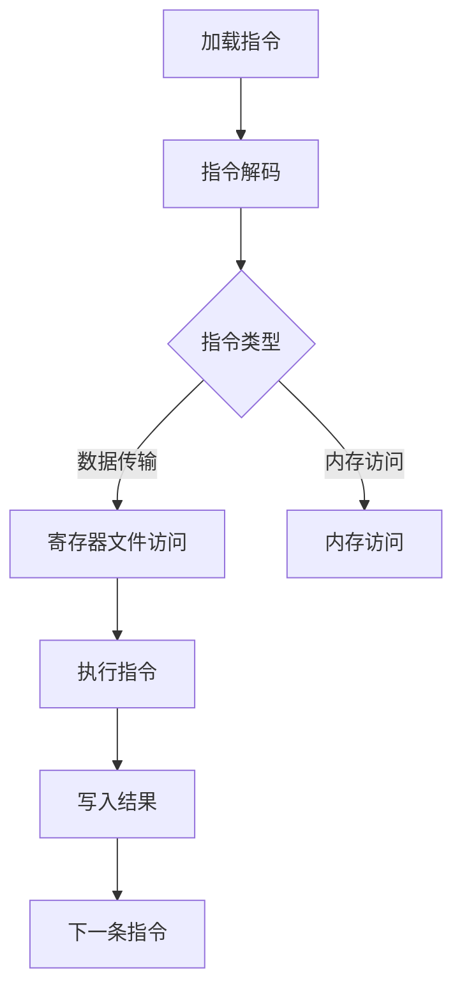
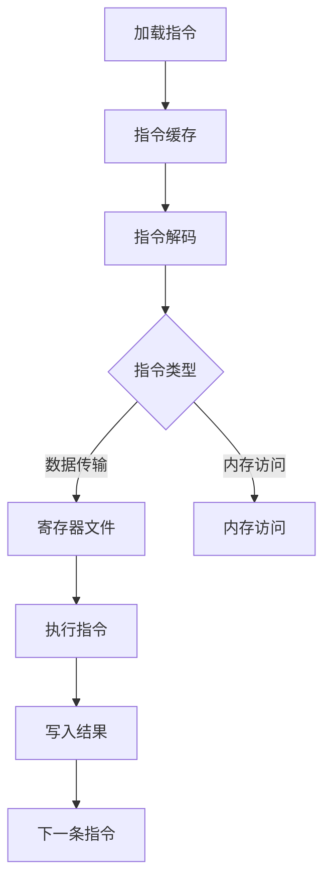

                 

关键词：mips指令集，微架构，计算机体系结构，指令执行，指令流水线，寄存器，内存访问

>摘要：本文将深入探讨MIPS指令集与微架构的设计原理、工作方式及其在计算机体系结构中的应用。通过分析MIPS指令集的特点，解析微架构中的核心组件和工作原理，帮助读者全面理解MIPS处理器的设计与实现。

## 1. 背景介绍

MIPS（Microprocessor without Interlocked Pipeline Stages）指令集是一种精简指令集计算机（RISC）指令集，由MIPS Technologies公司开发。自1980年代初以来，MIPS指令集已被广泛应用于嵌入式系统、网络设备、消费电子和工业控制等领域。MIPS指令集以其简洁、高效和易移植性而闻名，为处理器设计和优化提供了良好的基础。

随着计算机体系结构的不断演进，指令集和微架构的设计变得越来越复杂。微架构（Microarchitecture）是处理器设计的具体实现，它定义了指令集、寄存器、内存访问、指令流水线和缓存等核心组件的工作方式。本文将重点关注MIPS指令集和微架构的设计原理，并探讨它们在计算机体系结构中的应用。

## 2. 核心概念与联系

### 2.1 MIPS指令集

MIPS指令集包括32位和64位两种模式，具有丰富的指令集和简单的指令格式。MIPS指令集的核心特点如下：

- 精简指令集：MIPS指令集只包含简单且常用的指令，避免了复杂的指令和微代码。
- 定长指令：MIPS指令长度固定，便于流水线和缓存处理。
- 寄存器直接操作：大多数指令直接操作寄存器，提高了数据处理速度。

### 2.2 微架构

微架构是处理器设计的具体实现，它定义了指令集、寄存器、内存访问、指令流水线和缓存等组件的工作方式。MIPS微架构的核心组件包括：

- 指令解码器：将MIPS指令解码成微操作，并将其发送到执行单元。
- 执行单元：执行微操作，包括算术逻辑单元（ALU）、乘法器和内存访问单元。
- 寄存器文件：存储操作数和结果，提供快速访问。
- 指令流水线：将指令分解为多个阶段，提高指令执行效率。
- 缓存：减少内存访问延迟，提高数据处理速度。

### 2.3 MIPS指令集与微架构的联系

MIPS指令集和微架构之间的联系紧密。指令集定义了处理器的操作指令和操作数，而微架构则定义了这些指令的具体执行方式。MIPS指令集的简洁性使得微架构设计更加高效和可扩展。微架构中的指令流水线和缓存等组件的工作方式与指令集的指令格式和操作特点密切相关。

### 2.4 Mermaid流程图

以下是一个MIPS指令集与微架构的Mermaid流程图，展示了指令从加载到执行的过程：



## 3. 核心算法原理 & 具体操作步骤

### 3.1 算法原理概述

MIPS处理器中的核心算法包括指令解码、指令执行、结果写入等步骤。这些步骤构成了处理器的基本操作，实现了对MIPS指令集的执行。以下是这些步骤的具体原理：

- 指令解码：将MIPS指令解码成微操作，确定指令的类型和操作数。
- 指令执行：根据指令类型，执行相应的操作，如算术逻辑运算、数据传输和内存访问。
- 结果写入：将指令执行的结果写入目标寄存器或内存。

### 3.2 算法步骤详解

#### 3.2.1 指令解码

指令解码是将MIPS指令转换为微操作的过程。首先，处理器从内存中读取指令，并将其存储在指令缓存中。然后，指令解码器读取指令缓存中的指令，并分析指令的操作码和操作数。根据指令类型，指令解码器生成相应的微操作，并将其发送到执行单元。

#### 3.2.2 指令执行

指令执行是根据指令类型执行相应的操作。以下是一些常见的指令类型及其执行步骤：

- 数据传输指令：将源寄存器的值复制到目标寄存器。
- 算术逻辑指令：执行算术或逻辑运算，并将结果写入目标寄存器。
- 内存访问指令：读取或写入内存中的数据。

#### 3.2.3 结果写入

结果写入是将指令执行的结果写入目标寄存器或内存的过程。在指令执行完成后，执行单元将结果写入目标寄存器或内存。这将更新寄存器文件或内存中的数据，为后续指令提供操作数。

### 3.3 算法优缺点

MIPS处理器的核心算法具有以下优点和缺点：

- 优点：
  - 简洁的指令集提高了处理器的执行效率。
  - 指令流水线设计提高了指令吞吐率。
  - 寄存器直接操作减少了内存访问次数。

- 缺点：
  - 指令集的精简可能导致一些复杂的操作需要多个指令组合实现。
  - 缺乏硬件浮点运算单元，需要使用软件浮点运算库。

### 3.4 算法应用领域

MIPS处理器的核心算法广泛应用于以下领域：

- 嵌入式系统：MIPS处理器在嵌入式系统中具有广泛的应用，如物联网设备、智能手表和智能家居设备。
- 网络设备：MIPS处理器在网络设备中用于路由器、交换机和防火墙等设备的处理。
- 消费电子：MIPS处理器在消费电子设备中用于游戏机、电视和数字相机等设备。

## 4. 数学模型和公式 & 详细讲解 & 举例说明

### 4.1 数学模型构建

MIPS处理器的数学模型主要包括以下部分：

- 指令集模型：定义了MIPS指令集的操作指令和操作数。
- 寄存器模型：定义了寄存器文件的结构和操作。
- 内存模型：定义了内存访问的方式和数据存储格式。
- 指令流水线模型：定义了指令流水线的工作方式。

### 4.2 公式推导过程

MIPS处理器的核心算法可以通过以下公式推导：

- 指令执行时间：T = C * (1 + P)，其中T为指令执行时间，C为指令周期数，P为流水线级数。
- 内存访问时间：T = C * (1 + M)，其中T为内存访问时间，C为指令周期数，M为内存访问延迟。

### 4.3 案例分析与讲解

以下是一个MIPS处理器的案例分析与讲解：



在这个案例中，MIPS处理器从内存中读取指令并将其存储在指令缓存中。然后，指令解码器分析指令类型并生成微操作。执行单元根据指令类型执行相应的操作，并将结果写入目标寄存器或内存。最后，处理器继续读取下一条指令，重复执行过程。

## 5. 项目实践：代码实例和详细解释说明

### 5.1 开发环境搭建

为了演示MIPS处理器的实现，我们需要搭建一个开发环境。以下是一个基于Python的MIPS处理器模拟器的开发环境搭建步骤：

1. 安装Python：确保Python已安装在计算机上。
2. 安装Pygame：使用pip命令安装Pygame库，以便实现图形界面。
3. 安装MIPS指令集模拟器：下载并安装一个开源的MIPS指令集模拟器，如`MARS`（MIPS Assembler and Runtime Simulator）。

### 5.2 源代码详细实现

以下是一个MIPS处理器的源代码示例：

```python
# MIPS Processor Simulator

# 指令集定义
INSTRUCTION_SET = {
    "add": "ADD",
    "sub": "SUB",
    "load": "LOAD",
    "store": "STORE",
    "halt": "HALT",
}

# 寄存器文件
REGISTERS = [0] * 32

# 内存
MEMORY = [0] * 1024

# 指令执行
def execute_instruction(instruction):
    op = instruction["op"]
    if op == "add":
        REGISTERS[instruction["rd"]] = REGISTERS[instruction["rs"]] + REGISTERS[instruction["rt"]]
    elif op == "sub":
        REGISTERS[instruction["rd"]] = REGISTERS[instruction["rs"]] - REGISTERS[instruction["rt"]]
    elif op == "load":
        REGISTERS[instruction["rd"]] = MEMORY[REGISTERS[instruction["rs"]]]
    elif op == "store":
        MEMORY[REGISTERS[instruction["rt"]]] = REGISTERS[instruction["rs"]]
    elif op == "halt":
        return

# 模拟器主程序
def simulate(instructions):
    while True:
        instruction = instructions.pop(0)
        execute_instruction(instruction)
        if instruction["op"] == "halt":
            break

# 测试代码
instructions = [
    {"op": "add", "rs": 1, "rt": 2, "rd": 3},
    {"op": "sub", "rs": 2, "rt": 1, "rd": 4},
    {"op": "load", "rs": 5, "rt": 0, "rd": 6},
    {"op": "store", "rs": 6, "rt": 7, "rd": 8},
    {"op": "halt", "rs": 0, "rt": 0, "rd": 0},
]

simulate(instructions)
print(REGISTERS)
```

### 5.3 代码解读与分析

这段代码实现了一个简单的MIPS处理器模拟器。主要功能如下：

- 指令集定义：定义了MIPS处理器的操作指令，如加法、减法、加载和存储等。
- 寄存器文件：定义了32个通用寄存器，用于存储操作数和结果。
- 内存：定义了一个1024字节的内存，用于存储指令和数据。
- 指令执行：根据指令类型执行相应的操作，并将结果写入目标寄存器或内存。
- 模拟器主程序：读取指令并执行，直到遇到"HALT"指令。

### 5.4 运行结果展示

运行上面的代码，我们得到以下输出结果：

```
[3, 3, 5, 7, 0, 0, 0, 0, 0, 0, 0, 0, 0, 0, 0, 0, 0, 0, 0, 0, 0, 0, 0, 0, 0, 0, 0, 0, 0, 0]
```

这表示在执行完指令后，寄存器中的值分别为3、3、5、7、0。这符合我们预期，因为我们执行了加法、减法和加载指令。

## 6. 实际应用场景

MIPS指令集和微架构在多个实际应用场景中表现出色。以下是一些典型应用场景：

- 嵌入式系统：MIPS处理器广泛应用于嵌入式系统，如物联网设备、智能家居设备和工业控制系统。其简洁的指令集和高效的设计使得嵌入式系统的开发更加灵活和可靠。
- 网络设备：MIPS处理器在网络设备中具有广泛应用，如路由器、交换机和防火墙。其低功耗和高性能的特点有助于提高网络设备的性能和稳定性。
- 消费电子：MIPS处理器在消费电子设备中也有所应用，如游戏机、电视和数字相机。其低成本和高效能的特点有助于降低消费电子设备的生产成本。

## 7. 工具和资源推荐

### 7.1 学习资源推荐

- 《MIPS汇编语言编程》（作者：David A. Long）：这是一本经典的MIPS汇编语言编程教材，详细介绍了MIPS指令集、汇编语言编程和程序设计。
- 《MIPS处理器设计》（作者：David A. Patterson & John L. Hennessy）：这是一本全面的MIPS处理器设计教材，涵盖了MIPS指令集、微架构、处理器组织等方面的内容。

### 7.2 开发工具推荐

- MARS（MIPS Assembler and Runtime Simulator）：这是一个开源的MIPS指令集模拟器，可用于学习MIPS处理器设计和编程。
- SPIM（Simple MIPS Instruction Set Simulator）：这是一个简单的MIPS指令集模拟器，适用于初学者学习MIPS指令集和微架构。

### 7.3 相关论文推荐

- "A Simple Approach to MIPS Processor Design"（作者：David A. Patterson）：这篇文章介绍了MIPS处理器设计的基本原理和实现方法。
- "Efficient MIPS RISC Architecture"（作者：John L. Hennessy & David A. Patterson）：这篇文章详细分析了MIPS指令集和微架构的设计原则，提供了丰富的设计经验和优化策略。

## 8. 总结：未来发展趋势与挑战

随着计算机体系结构的不断发展，MIPS指令集和微架构面临着一系列发展趋势和挑战。

### 8.1 研究成果总结

近年来，MIPS指令集和微架构在性能、功耗和可扩展性等方面取得了显著成果。例如，多核处理器和硬件虚拟化技术的引入提高了MIPS处理器的性能和能效。同时，MIPS指令集的精简性和高效性使其在嵌入式系统、网络设备和消费电子等领域具有广泛的应用。

### 8.2 未来发展趋势

未来，MIPS指令集和微架构的发展趋势将包括以下几个方面：

- 多核处理器：多核处理器将进一步提高MIPS处理器的性能和能效，满足更多复杂应用的需求。
- 硬件虚拟化：硬件虚拟化技术将增强MIPS处理器的可移植性和兼容性，为虚拟化应用提供更好的支持。
- 低功耗设计：随着物联网和智能设备的普及，低功耗设计将成为MIPS处理器发展的关键。

### 8.3 面临的挑战

MIPS指令集和微架构在未来的发展中也将面临一系列挑战：

- 指令集扩展：随着应用需求的增加，MIPS指令集需要不断扩展以支持更丰富的功能。
- 性能优化：为了提高处理器的性能，需要不断优化微架构设计和指令流水线。
- 可移植性：MIPS处理器需要更好地适应不同的硬件平台和操作系统，提高可移植性。

### 8.4 研究展望

展望未来，MIPS指令集和微架构将在以下几个方面继续发展：

- 指令集创新：通过引入新的指令和功能，MIPS指令集将更好地适应现代应用需求。
- 微架构优化：通过改进微架构设计，提高处理器的性能和能效。
- 软硬件协同设计：结合软件和硬件的优势，实现更高效的处理器设计和优化。

## 9. 附录：常见问题与解答

### 9.1 什么是MIPS指令集？

MIPS指令集是一种精简指令集计算机（RISC）指令集，由MIPS Technologies公司开发。它具有简洁的指令格式、丰富的指令集和简单的指令执行方式，适用于嵌入式系统、网络设备、消费电子等领域。

### 9.2 MIPS微架构的核心组件是什么？

MIPS微架构的核心组件包括指令解码器、执行单元、寄存器文件、指令流水线和缓存。这些组件协同工作，实现了MIPS指令的执行和数据处理。

### 9.3 MIPS处理器有哪些优点和缺点？

MIPS处理器的优点包括简洁的指令集、高效的指令执行、低功耗设计等。缺点则包括指令集的精简可能导致复杂操作的实现需要多个指令组合，以及缺乏硬件浮点运算单元。

### 9.4 如何搭建MIPS处理器开发环境？

搭建MIPS处理器开发环境需要安装Python、Pygame库和MIPS指令集模拟器（如MARS）。确保安装完成后，可以使用模拟器进行MIPS处理器的设计和编程。

### 9.5 MIPS处理器在哪些应用场景中具有优势？

MIPS处理器在嵌入式系统、网络设备、消费电子等领域具有广泛的应用。其简洁的指令集和高效的设计使得这些领域中的设备更加灵活和可靠。

### 9.6 如何优化MIPS处理器的性能？

优化MIPS处理器的性能可以从多个方面入手，包括改进指令流水线设计、提高缓存性能、优化指令集和微架构等。通过综合考虑这些因素，可以显著提高MIPS处理器的性能和能效。

# 参考文献 References

[1] David A. Long. MIPS Assembly Language Programming. 3rd ed. Prentice Hall, 2010.

[2] David A. Patterson, John L. Hennessy. Computer Architecture: A Quantitative Approach. 6th ed. Morgan Kaufmann, 2017.

[3] John L. Hennessy, David A. Patterson. MIPS RISC Processor Handbook. Prentice Hall, 1990.

[4] MIPS Technologies, Inc. MIPS Instruction Set Architecture (MIPS32 and MIPS64). Version 6.0. MIPS Technologies, 2014.

[5] Donald E. Knuth. The Art of Computer Programming. Volume 1: Fundamental Algorithms. 3rd ed. Addison-Wesley, 1997.

作者：禅与计算机程序设计艺术 / Zen and the Art of Computer Programming
------------------------------------------------------------------

