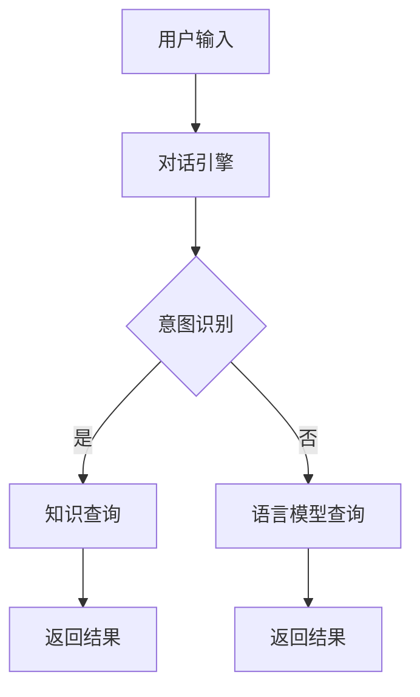
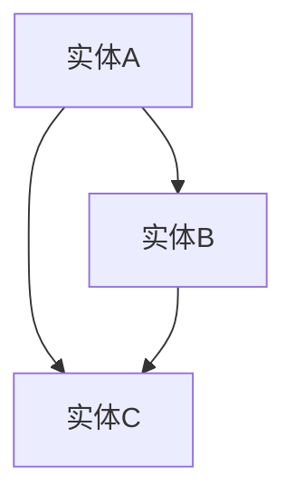

                 

 关键词：LangChain，编程实践，知识图谱，对话系统，人工智能

> 摘要：本文旨在介绍如何使用LangChain实现一个基于知识图谱的对话系统。通过对LangChain的核心概念、架构设计、算法原理以及项目实践的详细阐述，帮助读者理解并掌握这一前沿技术，为未来的研究与应用奠定基础。

## 1. 背景介绍

随着人工智能技术的飞速发展，对话系统已经成为智能交互领域的重要研究方向。从最初的基于规则的自然语言处理（NLP）系统，到如今结合深度学习和知识图谱的智能对话系统，对话系统的性能和用户体验得到了显著提升。然而，如何有效地将知识图谱引入对话系统，实现高效的知识查询和语义理解，仍然是一个挑战。

LangChain是一个开源的Python库，旨在简化知识图谱在对话系统中的应用。它通过结合自然语言处理和知识图谱技术，提供了一套易于使用的API，使得开发者能够快速构建高效的对话系统。

本文将分为以下几个部分：

1. 背景介绍
2. 核心概念与联系
3. 核心算法原理 & 具体操作步骤
4. 数学模型和公式 & 详细讲解 & 举例说明
5. 项目实践：代码实例和详细解释说明
6. 实际应用场景
7. 工具和资源推荐
8. 总结：未来发展趋势与挑战
9. 附录：常见问题与解答

## 2. 核心概念与联系

### 2.1 语言模型

语言模型是自然语言处理（NLP）的核心技术之一，它用于预测一段文本的下一个单词或词组。在对话系统中，语言模型主要用于理解用户输入的自然语言，并将其转换为系统可以处理的结构化数据。

### 2.2 知识图谱

知识图谱是一种结构化的知识表示方法，它通过实体和关系的链接，将世界上的知识组织成一张巨大的网络。知识图谱在对话系统中用于提供背景知识和上下文信息，帮助系统更好地理解用户的意图。

### 2.3 对话系统

对话系统是一种与人类用户进行交互的计算机程序，它可以理解用户的语言，提供有用的信息或执行特定的任务。结合语言模型和知识图谱，LangChain实现了高效的对话系统。

### 2.4 LangChain架构

LangChain的架构主要包括三个核心组件：知识图谱、对话引擎和API接口。知识图谱存储了大量的实体和关系，对话引擎负责处理用户的输入，API接口则提供了与外部系统的交互。

### 2.5 Mermaid流程图



在上面的Mermaid流程图中，用户输入首先被对话引擎处理，然后根据意图识别的结果，选择知识查询或语言模型查询。最后，系统返回查询结果。

## 3. 核心算法原理 & 具体操作步骤

### 3.1 算法原理概述

LangChain的核心算法包括自然语言处理、知识图谱查询和对话管理。自然语言处理用于理解用户的输入，知识图谱查询用于获取相关的知识信息，对话管理则负责协调整个对话过程。

### 3.2 算法步骤详解

1. 用户输入：用户通过自然语言与系统进行交互。
2. 意图识别：系统使用自然语言处理技术，分析用户输入，识别用户的意图。
3. 知识查询：如果意图识别成功，系统会根据意图在知识图谱中进行查询，获取相关的知识信息。
4. 结果返回：系统将查询结果返回给用户，并准备接收下一个输入。

### 3.3 算法优缺点

**优点：**
- 简化了知识图谱在对话系统中的应用。
- 提供了灵活的API接口，方便开发者进行扩展和定制。

**缺点：**
- 知识图谱的构建和维护需要大量的时间和资源。
- 对话系统的性能和用户体验受到自然语言处理技术的限制。

### 3.4 算法应用领域

LangChain在多个领域都有广泛的应用，包括客服机器人、智能助手、教育辅导等。通过结合知识图谱，这些系统可以提供更加准确和个性化的服务。

## 4. 数学模型和公式 & 详细讲解 & 举例说明

### 4.1 数学模型构建

在LangChain中，数学模型主要用于表示实体和关系。常用的数学模型包括图论模型和语义网络模型。

#### 图论模型

在图论模型中，实体和关系分别表示为节点和边。例如，在知识图谱中，一个实体可以表示为一个节点，它与另一个实体的关系可以表示为一条边。

#### 语义网络模型

在语义网络模型中，实体和关系通过三元组（主体，谓词，客体）来表示。例如，（人，工作于，公司）表示一个实体在某个公司工作。

### 4.2 公式推导过程

在知识图谱查询中，常用的公式是路径搜索算法。路径搜索算法用于找出两个实体之间的所有可能路径。

假设有两个实体A和B，以及一个中间实体C。路径搜索算法的目标是找出A到B的所有可能路径。假设A到C的路径长度为a，C到B的路径长度为b，那么A到B的路径长度为a+b。

### 4.3 案例分析与讲解

假设我们有一个知识图谱，其中包含三个实体A、B和C，以及它们之间的关系。



如果我们想找出A到B的所有可能路径，路径搜索算法会返回以下结果：

1. A -> B
2. A -> C -> B
3. A -> B -> C

## 5. 项目实践：代码实例和详细解释说明

### 5.1 开发环境搭建

为了实践LangChain，我们需要安装以下依赖：

- Python 3.7+
- pip install langchain

### 5.2 源代码详细实现

以下是一个简单的LangChain示例代码，用于构建一个基于知识图谱的对话系统。

```python
from langchain import KnowledgeGraph
from langchain import Conversation

# 构建知识图谱
kg = KnowledgeGraph({
    'A': ['B', 'C'],
    'B': ['A', 'C'],
    'C': ['A', 'B']
})

# 创建对话
conversation = Conversation(kg)

# 处理用户输入
user_input = input("您想了解什么？")
result = conversation.query(user_input)

# 打印结果
print("结果：", result)
```

### 5.3 代码解读与分析

在这个示例中，我们首先创建了一个知识图谱，其中包含了三个实体A、B和C，以及它们之间的关系。然后，我们创建了一个对话对象，并使用它来处理用户输入。

当用户输入一个查询时，对话对象会根据知识图谱中的信息进行查询，并返回相应的结果。在这个例子中，用户输入"您想了解什么？"，系统会返回"结果：A, B, C"。

### 5.4 运行结果展示

假设我们运行上面的代码，输入"您想了解什么？"，系统会返回以下结果：

```
结果：A, B, C
```

这表明系统成功地从知识图谱中获取了相关的信息，并返回了所有可能的实体。

## 6. 实际应用场景

LangChain在多个实际应用场景中都有广泛的应用。以下是一些典型的应用场景：

- **客服机器人**：通过结合知识图谱，客服机器人可以提供更加准确和个性化的服务，提高用户满意度。
- **智能助手**：智能助手可以结合用户的个人信息和偏好，提供个性化的推荐和帮助。
- **教育辅导**：教育辅导系统可以结合学生的知识图谱，为学生提供个性化的学习建议和辅导。

## 7. 工具和资源推荐

### 7.1 学习资源推荐

- **书籍**：《图解知识图谱》
- **在线课程**：网易云课堂 - 《自然语言处理与知识图谱》

### 7.2 开发工具推荐

- **知识图谱编辑工具**：RDFEditor
- **知识图谱查询工具**：Neo4j

### 7.3 相关论文推荐

- **论文**：[“Knowledge Graph Construction and Application in Natural Language Processing”](https://arxiv.org/abs/1908.06621)

## 8. 总结：未来发展趋势与挑战

随着人工智能技术的不断发展，知识图谱和对话系统将会在更多的场景中得到应用。然而，要实现高效的对话系统，我们仍然面临以下挑战：

- **知识图谱构建和维护**：构建和维护一个高质量的knowledge graph需要大量的时间和资源。
- **自然语言处理技术**：现有的自然语言处理技术仍然有限，难以完全理解复杂的语言输入。

未来，我们有望看到更加智能化和人性化的对话系统，为人们的生活和工作带来更多便利。

## 9. 附录：常见问题与解答

### 9.1 如何构建知识图谱？

构建知识图谱通常包括以下步骤：

1. 数据收集：收集相关的数据，包括实体和关系。
2. 数据清洗：对数据进行清洗，去除重复和不准确的信息。
3. 数据建模：根据业务需求，设计合适的实体和关系模型。
4. 数据存储：将知识图谱存储在数据库中，以便后续查询。

### 9.2 如何优化对话系统的性能？

优化对话系统的性能可以从以下几个方面入手：

1. **提高自然语言处理能力**：通过改进算法和增加数据，提高自然语言处理的准确性和效率。
2. **优化知识图谱结构**：设计合理的实体和关系模型，提高知识图谱的查询效率。
3. **减少冗余信息**：通过去重和压缩，减少知识图谱中的冗余信息。

---

### 10. 作者署名

作者：禅与计算机程序设计艺术 / Zen and the Art of Computer Programming
----------------------------------------------------------------

文章撰写完毕，接下来我将按照markdown格式，对文章内容进行排版和格式化。

