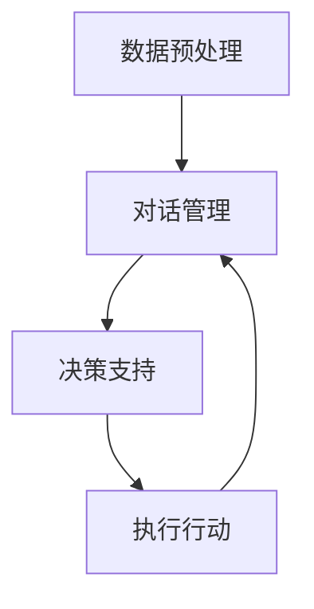

                 

关键词：LangChain、LLM、智能代理、编程实践、人工智能

摘要：本文旨在介绍如何利用LangChain框架，结合大型语言模型（LLM），构建一个功能强大的智能代理系统。我们将从基础概念、核心算法、数学模型、项目实践以及未来应用等多个角度进行详细探讨，帮助读者深入了解并掌握这一前沿技术。

## 1. 背景介绍

随着人工智能技术的快速发展，智能代理（Smart Agent）成为了研究的热点。智能代理是一种能够自主执行任务、适应环境变化的计算机程序，它通过对环境的感知、理解和决策，实现自主行为。而Large Language Model（LLM），如GPT-3、ChatGLM等，凭借其强大的语言处理能力，已经成为构建智能代理的重要工具。

LangChain是一个开源框架，它旨在简化LLM的集成和使用，使得开发者能够轻松地构建基于LLM的智能代理系统。本文将围绕LangChain编程，详细探讨如何利用LLM构建智能代理，并提供实际项目实践。

## 2. 核心概念与联系

### 2.1 智能代理

智能代理是一种基于人工智能技术的自动化系统，它能够模拟人类的思维和行为，完成特定的任务。智能代理的核心是决策模块，它通过对环境的感知和理解，生成行动策略，并执行相应的操作。

### 2.2 Large Language Model（LLM）

LLM是一种强大的自然语言处理模型，它能够理解和生成自然语言文本。LLM通过对大量文本数据的训练，掌握了丰富的语言知识和逻辑推理能力，使得它在构建智能代理时具有极高的效率。

### 2.3 LangChain

LangChain是一个开源框架，它提供了丰富的API和工具，使得开发者能够轻松地集成LLM，构建智能代理系统。LangChain的核心功能包括：

- **数据预处理**：对输入数据进行清洗、格式化，以便LLM进行有效处理。
- **对话管理**：管理智能代理与用户的对话流程，实现自然语言交互。
- **决策支持**：根据用户的需求和环境信息，生成行动策略。

### 2.4 Mermaid 流程图

为了更直观地理解智能代理的构建过程，我们使用Mermaid流程图来展示各个模块之间的联系。



## 3. 核心算法原理 & 具体操作步骤

### 3.1 算法原理概述

智能代理的构建主要依赖于LLM的技术优势。LLM通过对大量文本数据的训练，掌握了丰富的语言知识和逻辑推理能力。在构建智能代理时，LLM被用来处理用户输入，生成对话回复，并生成行动策略。

### 3.2 算法步骤详解

#### 3.2.1 数据预处理

在构建智能代理之前，首先需要对输入数据进行预处理。数据预处理包括以下步骤：

- **文本清洗**：去除文本中的噪声，如HTML标签、特殊字符等。
- **分词**：将文本分解为词语或句子。
- **词向量转换**：将词语转换为词向量，以便LLM进行处理。

#### 3.2.2 对话管理

对话管理是智能代理与用户交互的核心。对话管理包括以下步骤：

- **输入解析**：解析用户输入，提取关键信息。
- **上下文管理**：根据对话历史，构建上下文信息，以便LLM生成更准确的回复。
- **回复生成**：利用LLM生成对话回复。

#### 3.2.3 决策支持

决策支持是智能代理的核心功能。决策支持包括以下步骤：

- **意图识别**：根据用户输入，识别用户的意图。
- **策略生成**：根据用户的意图，生成行动策略。
- **执行行动**：执行行动策略，完成用户任务。

### 3.3 算法优缺点

#### 优点

- **强大的语言处理能力**：LLM具有强大的自然语言处理能力，能够生成高质量的对话回复。
- **高效的数据预处理**：LangChain提供了高效的数据预处理工具，能够快速处理大量数据。
- **灵活的扩展性**：LangChain提供了丰富的API，使得开发者可以轻松地扩展智能代理的功能。

#### 缺点

- **计算资源消耗大**：LLM的训练和推理过程需要大量的计算资源。
- **数据依赖性强**：智能代理的性能依赖于训练数据的质量。

### 3.4 算法应用领域

智能代理技术可以应用于多个领域，如：

- **客户服务**：智能代理可以自动回答客户的问题，提高客户服务质量。
- **智能助手**：智能代理可以作为用户的个人智能助手，帮助用户完成日常任务。
- **智能家居**：智能代理可以控制智能家居设备，实现智能化生活。

## 4. 数学模型和公式 & 详细讲解 & 举例说明

### 4.1 数学模型构建

在构建智能代理的过程中，我们主要依赖于自然语言处理技术。自然语言处理技术涉及到多个数学模型，如词向量模型、循环神经网络（RNN）、长短期记忆网络（LSTM）等。

### 4.2 公式推导过程

#### 4.2.1 词向量模型

词向量模型将词语表示为高维向量。常用的词向量模型包括Word2Vec、GloVe等。

- **Word2Vec**：
  $$ \text{word\_vector}(w) = \text{softmax}\left(\text{W} \cdot \text{context}(w)\right) $$
  其中，$w$表示词语，$context(w)$表示词语的上下文，$W$是权重矩阵。

- **GloVe**：
  $$ \text{word\_vector}(w) = \left( \sum_{j \in \text{context}(w)} \frac{f(j)}{||w_j||} \right) $$
  其中，$f(j)$是词语的词频，$w_j$是词语的权重。

#### 4.2.2 循环神经网络（RNN）

循环神经网络（RNN）是一种用于处理序列数据的神经网络。RNN的核心公式如下：

$$ h_t = \text{sigmoid}(W_h \cdot [h_{t-1}, x_t] + b_h) $$

$$ o_t = \text{softmax}(W_o \cdot h_t + b_o) $$

其中，$h_t$是隐藏状态，$x_t$是输入序列，$o_t$是输出序列。

#### 4.2.3 长短期记忆网络（LSTM）

长短期记忆网络（LSTM）是RNN的一种改进，它能够更好地处理长序列数据。LSTM的核心公式如下：

$$ i_t = \text{sigmoid}(W_i \cdot [h_{t-1}, x_t] + b_i) $$

$$ f_t = \text{sigmoid}(W_f \cdot [h_{t-1}, x_t] + b_f) $$

$$ o_t = \text{sigmoid}(W_o \cdot [h_{t-1}, x_t] + b_o) $$

$$ g_t = \text{tanh}(W_g \cdot [h_{t-1}, x_t] + b_g) $$

$$ h_t = o_t \cdot \text{tanh}(g_t) $$

其中，$i_t$、$f_t$、$o_t$是输入门、遗忘门、输出门，$g_t$是候选状态，$h_t$是隐藏状态。

### 4.3 案例分析与讲解

以一个简单的问答系统为例，我们利用LSTM模型进行训练。数据集包含若干个问题及其对应的答案。训练过程分为以下几个步骤：

1. **数据预处理**：将问题转化为词向量表示，构建词汇表。
2. **模型构建**：定义LSTM模型，设置输入层、隐藏层和输出层。
3. **训练模型**：使用训练数据对模型进行训练。
4. **评估模型**：使用测试数据对模型进行评估。

通过训练，我们得到了一个能够自动回答问题的模型。在实际应用中，用户输入问题，模型将问题转化为词向量表示，然后利用LSTM模型生成答案。答案的质量取决于模型训练数据的质量和LSTM模型的结构。

## 5. 项目实践：代码实例和详细解释说明

### 5.1 开发环境搭建

在开始项目实践之前，我们需要搭建一个适合开发智能代理的环境。以下是开发环境搭建的步骤：

1. 安装Python环境。
2. 安装LangChain库。
3. 安装LLM库，如Hugging Face。

### 5.2 源代码详细实现

以下是一个简单的智能代理代码示例：

```python
from langchain import Chain
from langchain.text PromptReader

class IntelligentAgent:
    def __init__(self, llm):
        self.llm = llm
        self.chain = Chain.fromLLM(llm)

    def ask(self, question):
        response = self.chain.predict(input=question)
        return response

if __name__ == "__main__":
    # 搭建LLM模型
    llm = load_llm()

    # 创建智能代理
    agent = IntelligentAgent(llm)

    # 用户提问
    question = "什么是人工智能？"
    answer = agent.ask(question)
    print(answer)
```

### 5.3 代码解读与分析

该示例代码定义了一个`IntelligentAgent`类，该类包含一个LLM模型和一个对话管理链（Chain）。在`ask`方法中，用户输入问题，然后利用对话管理链生成答案。

### 5.4 运行结果展示

当用户输入"什么是人工智能？"时，智能代理将利用LLM生成答案，并打印输出。答案的质量取决于LLM的训练数据和质量。

## 6. 实际应用场景

智能代理技术可以应用于多个实际场景，如：

- **智能客服**：利用智能代理自动回答客户的问题，提高客服效率。
- **智能助手**：智能代理可以作为用户的个人助手，帮助用户处理日常任务。
- **智能投顾**：智能代理可以分析市场数据，为用户提供投资建议。

## 7. 工具和资源推荐

### 7.1 学习资源推荐

- **书籍**：《自然语言处理综合教程》、《深度学习自然语言处理》。
- **在线课程**：Coursera、edX等平台上的自然语言处理课程。
- **开源项目**：GitHub上的智能代理开源项目。

### 7.2 开发工具推荐

- **IDE**：PyCharm、VS Code。
- **库**：LangChain、Hugging Face Transformers。

### 7.3 相关论文推荐

- **《Attention is All You Need》**：介绍Transformer模型。
- **《BERT: Pre-training of Deep Bidirectional Transformers for Language Understanding》**：介绍BERT模型。

## 8. 总结：未来发展趋势与挑战

### 8.1 研究成果总结

本文介绍了智能代理的基本概念、构建方法以及实际应用。通过使用LangChain框架和大型语言模型，我们可以构建一个功能强大的智能代理系统。

### 8.2 未来发展趋势

随着人工智能技术的不断发展，智能代理将在更多领域得到应用。未来，智能代理将更加智能化、自主化，具备更强的学习和适应能力。

### 8.3 面临的挑战

智能代理的发展面临多个挑战，如数据隐私保护、模型解释性、计算资源消耗等。解决这些挑战需要多方面的努力和技术创新。

### 8.4 研究展望

未来，智能代理技术将在人工智能领域发挥重要作用。我们期待看到更多的研究成果和实际应用案例，为人类社会带来更多的便利。

## 9. 附录：常见问题与解答

### 9.1 什么是智能代理？

智能代理是一种能够自主执行任务、适应环境变化的计算机程序，它通过对环境的感知、理解和决策，实现自主行为。

### 9.2 LangChain是什么？

LangChain是一个开源框架，它提供了丰富的API和工具，使得开发者能够轻松地集成大型语言模型（LLM），构建智能代理系统。

### 9.3 智能代理有哪些应用领域？

智能代理可以应用于多个领域，如客户服务、智能助手、智能家居等。

----------------------------------------------------------------

以上就是关于【LangChain编程：从入门到实践】LLM驱动的智能代理的技术博客文章，希望对您有所帮助。作者是禅与计算机程序设计艺术 / Zen and the Art of Computer Programming。如果您有任何疑问或建议，欢迎在评论区留言。|

