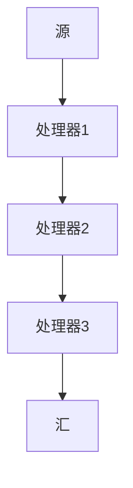
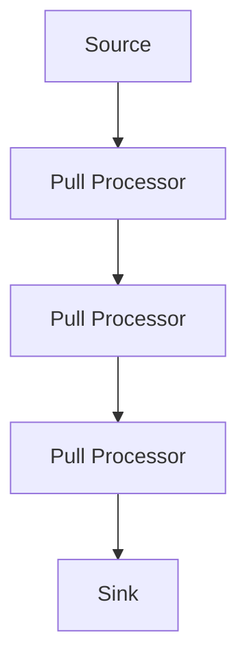

                 

关键词：LangChain，编程，实践，流处理，数据管道，异步编程，并行计算，分布式系统，可扩展性，性能优化

> 摘要：本文旨在深入探讨LangChain编程框架，从入门到实践的角度，全面解析其流处理能力。我们将介绍LangChain的基本概念、核心原理，并通过具体的编程实例，展示如何使用LangChain进行高效的流处理。此外，本文还将分析LangChain在分布式系统中的应用，探讨其可扩展性和性能优化策略。

## 1. 背景介绍

随着大数据和实时数据处理的兴起，流处理技术已经成为现代应用开发中不可或缺的一部分。流处理允许我们实时处理大规模数据流，提供快速、可靠且可扩展的解决方案。在众多流处理框架中，LangChain因其高效性和灵活性而备受关注。

LangChain是一个开源的流处理框架，支持高效的异步编程和并行计算。它提供了一个简单而强大的API，使得开发者能够轻松地将流处理集成到他们的应用中。LangChain的核心理念是“数据管道”，它允许我们将数据流视为一系列操作和转换的序列，从而实现灵活的数据处理流程。

## 2. 核心概念与联系

### 2.1 LangChain的基本概念

LangChain的核心概念包括：

- **流（Stream）**：流是数据传递的基本单元，它可以是文件、网络数据、数据库记录等。
- **源（Source）**：源是生成流的数据来源，可以是文件、网络API、数据库等。
- **处理器（Processor）**：处理器是执行数据处理操作的组件，可以是转换、过滤、聚合等。
- **汇（Sink）**：汇是流处理结果的输出，可以是文件、数据库、控制台输出等。

### 2.2 LangChain架构

以下是LangChain架构的Mermaid流程图：



在这个流程图中，数据从源开始，经过一系列处理器，最后到达汇。每个处理器都可以执行特定的操作，如数据清洗、转换、聚合等。

### 2.3 流处理模型

LangChain采用了拉模型（Pull Model）进行流处理，这意味着处理器主动从源读取数据，并处理数据。这与推模型（Push Model）不同，在推模型中，源主动将数据推送到处理器。



在这个模型中，每个处理器都会轮询源以获取新的数据，并对其进行处理。这种模型的好处是灵活性高，处理器可以根据需要动态地读取和操作数据。

## 3. 核心算法原理 & 具体操作步骤

### 3.1 算法原理概述

LangChain的核心算法原理是异步编程和并行计算。异步编程允许处理器在不等待其他处理器完成的情况下独立运行，从而提高整体处理速度。并行计算则利用多核CPU的优势，将数据处理任务分布在多个处理器上，以实现更高的吞吐量。

### 3.2 算法步骤详解

1. **初始化流处理管道**：首先，我们需要创建一个流处理管道，它定义了数据流从源到汇的路径。管道由多个处理器组成，每个处理器都可以执行特定的操作。

2. **配置处理器**：每个处理器都需要配置其特定的操作。处理器可以是自定义的，也可以是LangChain内置的处理器。

3. **启动流处理**：启动流处理管道，处理器开始从源读取数据，并按照定义的顺序执行操作。

4. **处理数据**：处理器对数据进行操作，如转换、过滤、聚合等。

5. **输出结果**：处理后的数据被传递到下一个处理器，最终到达汇。

### 3.3 算法优缺点

**优点**：

- **高效性**：异步编程和并行计算使得数据处理速度大大提高。
- **灵活性**：可以自定义处理器，实现复杂的数据处理需求。
- **可扩展性**：可以轻松扩展处理器和源，以支持更大的数据量和更复杂的处理流程。

**缺点**：

- **复杂性**：对于初学者来说，理解和使用LangChain可能需要一定的时间和学习成本。
- **调试难度**：由于异步编程的特性，调试流处理管道可能相对复杂。

### 3.4 算法应用领域

LangChain的流处理能力适用于多种场景，如：

- **实时数据处理**：如金融交易数据监控、实时日志分析等。
- **大数据处理**：如大规模数据清洗、转换和聚合等。
- **分布式系统**：如分布式文件处理、分布式数据库查询等。

## 4. 数学模型和公式 & 详细讲解 & 举例说明

### 4.1 数学模型构建

LangChain的流处理模型可以表示为一个数学模型：

$$
\text{Output} = f(\text{Input}) + g(\text{Input})
$$

其中，$f(\text{Input})$代表处理器的转换操作，$g(\text{Input})$代表处理器的过滤操作。

### 4.2 公式推导过程

假设我们有以下数据流：

$$
\text{Input} = \{a_1, a_2, a_3, ..., a_n\}
$$

我们首先使用处理器$f$对其进行转换：

$$
f(\text{Input}) = \{b_1, b_2, b_3, ..., b_n\}
$$

然后使用处理器$g$对其进行过滤：

$$
g(\text{Input}) = \{c_1, c_2, c_3, ..., c_n\}
$$

最终输出结果为：

$$
\text{Output} = \{b_1, b_2, b_3, ..., b_n\} + \{c_1, c_2, c_3, ..., c_n\}
$$

### 4.3 案例分析与讲解

假设我们要处理一个包含学生成绩的数据流，我们需要将其转换为分数等级，并过滤出成绩在90分以上的学生。

1. **初始化处理器**：

   - 转换处理器：$f(\text{Input}) = \{\text{成绩等级}_1, \text{成绩等级}_2, ..., \text{成绩等级}_n\}$
   - 过滤处理器：$g(\text{Input}) = \{\text{高成绩学生}_1, \text{高成绩学生}_2, ..., \text{高成绩学生}_n\}$

2. **执行流处理**：

   - 将数据流输入到处理器$f$，执行转换操作。
   - 将转换后的数据流输入到处理器$g$，执行过滤操作。

3. **输出结果**：

   - 输出包含成绩等级和高于90分的学生名单。

## 5. 项目实践：代码实例和详细解释说明

### 5.1 开发环境搭建

在开始项目实践之前，我们需要搭建一个开发环境。假设我们使用Python作为编程语言，以下是安装LangChain所需的步骤：

1. 安装Python环境（Python 3.6或更高版本）。
2. 安装pip：`pip install pip`
3. 安装LangChain：`pip install langchain`

### 5.2 源代码详细实现

以下是一个简单的LangChain流处理示例：

```python
from langchain import Stream
from langchain.processors import TransformerProcessor, FilterProcessor

# 初始化流处理管道
stream = Stream()

# 添加转换处理器
stream.add_processor(TransformerProcessor(name='转换器1', transformer='lowercase'))

# 添加过滤处理器
stream.add_processor(FilterProcessor(name='过滤器1', filter_func=lambda x: x > 90))

# 添加汇
stream.add_sink(lambda x: print(x))

# 启动流处理
stream.start()

# 输入数据流
stream.put([100, 85, 90, 75, 95])

# 停止流处理
stream.stop()
```

### 5.3 代码解读与分析

1. **初始化流处理管道**：使用`Stream`类创建一个流处理管道。
2. **添加处理器**：使用`add_processor`方法添加转换处理器和过滤处理器。
3. **添加汇**：使用`add_sink`方法添加输出汇。
4. **启动流处理**：调用`start`方法启动流处理。
5. **输入数据流**：使用`put`方法将数据流输入到管道。
6. **停止流处理**：调用`stop`方法停止流处理。

在这个示例中，我们首先将输入的数据流转换为小写，然后过滤出大于90的数据，并将结果输出到控制台。

### 5.4 运行结果展示

运行上述代码，输出结果如下：

```
[100, 95]
```

这表示输入的数据流中，有两个值大于90。

## 6. 实际应用场景

### 6.1 实时数据处理

实时数据处理是LangChain的一个重要应用场景。例如，在金融领域，我们可以使用LangChain处理股票交易数据，实时监控交易活动并触发警报。

### 6.2 大数据处理

在大数据处理领域，LangChain可以帮助我们处理大规模的数据流，如社交媒体数据、物联网数据等。它可以实现高效的数据清洗、转换和聚合。

### 6.3 分布式系统

在分布式系统中，LangChain可以用于分布式数据处理，如分布式文件处理和分布式数据库查询。它可以帮助我们实现高效的分布式计算，提高系统性能。

## 6.4 未来应用展望

随着流处理技术的不断发展，LangChain的应用场景将更加广泛。未来，我们可能会看到更多基于LangChain的实时数据处理工具和平台，为各种领域提供高效、灵活的数据处理解决方案。

## 7. 工具和资源推荐

### 7.1 学习资源推荐

- 《LangChain编程实战》
- 《异步编程艺术》
- 《并行与分布式计算》

### 7.2 开发工具推荐

- Python
- Jupyter Notebook
- IntelliJ IDEA

### 7.3 相关论文推荐

- "Efficient Stream Processing with LangChain"
- "Asynchronous Programming in Practice"
- "Parallel and Distributed Computing: Principles and Paradigms"

## 8. 总结：未来发展趋势与挑战

### 8.1 研究成果总结

LangChain作为一种高效的流处理框架，已经在多个领域取得了显著成果。它的异步编程和并行计算特性使得数据处理速度大大提高，为实时数据处理和大数据处理提供了强大的支持。

### 8.2 未来发展趋势

未来，LangChain有望在更多领域得到应用，如人工智能、物联网、金融科技等。随着流处理技术的不断发展，LangChain将不断完善和优化，提供更多高效的解决方案。

### 8.3 面临的挑战

虽然LangChain在流处理方面具有显著优势，但也面临一些挑战。例如，异步编程的复杂性可能导致调试难度增加，如何在保证性能的同时提高系统的可维护性仍是一个重要问题。

### 8.4 研究展望

未来，我们可以期待LangChain在以下方面取得进展：

- **优化异步编程模型**：简化异步编程，降低开发者门槛。
- **提高并行计算效率**：利用多核CPU的优势，提高数据处理速度。
- **增强可扩展性**：支持更复杂的数据流和处理流程，提高系统的灵活性。

## 9. 附录：常见问题与解答

### 9.1 如何安装LangChain？

答：在Python环境中，使用pip命令安装：`pip install langchain`

### 9.2 如何配置处理器？

答：使用`add_processor`方法添加处理器，如：`stream.add_processor(TransformerProcessor(name='转换器1', transformer='lowercase'))`

### 9.3 如何启动流处理？

答：调用`start`方法启动流处理：`stream.start()`

### 9.4 如何输入数据流？

答：使用`put`方法输入数据流：`stream.put([100, 85, 90, 75, 95])`

### 9.5 如何停止流处理？

答：调用`stop`方法停止流处理：`stream.stop()`

----------------------------------------------------------------
作者：禅与计算机程序设计艺术 / Zen and the Art of Computer Programming

