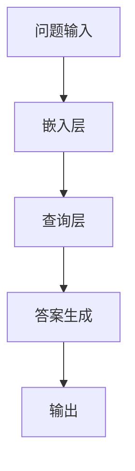

                 

### 关键词：### 
- LangChain
- 编程实践
- 文档问答
- 问答系统
- 编程技术
- 人工智能

### 摘要：### 
本文旨在深入探讨LangChain在基于文档问答场景中的应用。我们将从LangChain的基本概念、核心算法原理，到具体的编程实践，详细讲解如何在文档问答场景下实现高效的问答系统。文章还将涉及数学模型、项目实例，并对未来的发展趋势与挑战进行展望。通过本文的阅读，读者将能够掌握LangChain的基本应用方法，并为实际项目提供有价值的参考。

## 1. 背景介绍

随着互联网的快速发展，信息和知识的获取变得更加容易。然而，面对海量的文档数据，如何高效地检索和获取所需信息成为了一个挑战。文档问答系统应运而生，旨在通过自然语言处理技术，实现用户与文档之间的智能交互。这类系统不仅能够回答用户提出的问题，还能够提供相关的文档链接，极大地提高了信息检索的效率和准确性。

LangChain作为一款开源的链式语言模型，为开发者提供了构建问答系统的强大工具。LangChain基于最新的语言模型技术，能够处理多种文本输入，并生成连贯、准确的回答。其核心优势在于模块化设计和高度可扩展性，使得开发者可以灵活地集成到各种应用场景中。

本文将围绕LangChain编程，从入门到实践，详细探讨其在基于文档问答场景中的应用。我们将首先介绍LangChain的基本概念和架构，然后深入探讨其核心算法原理和实现步骤。随后，通过具体的项目实践，展示如何在文档问答场景下实现高效的问答系统。文章最后将对未来的发展趋势和挑战进行展望，为开发者提供有益的参考。

## 2. 核心概念与联系

### 2.1 LangChain简介

LangChain是一款基于GPT模型的开源工具，旨在构建和部署高效的问答系统。它通过将多个语言模型串联起来，形成一条链式结构，从而实现复杂的问答任务。LangChain的主要组成部分包括：嵌入层（Embedding Layer）、查询层（Query Layer）和响应层（Response Layer）。

- **嵌入层**：将文本输入转换为固定长度的向量表示，便于后续处理。
- **查询层**：利用嵌入层生成的向量，查询预训练的索引，获取与输入文本相关的信息。
- **响应层**：将查询层返回的结果进行整合，生成最终的回答。

### 2.2 文档问答场景

在文档问答场景中，用户可以通过自然语言提出问题，系统则通过查询文档库，生成相应的答案。这个过程通常包括以下几个步骤：

1. **问题理解**：将用户输入的问题转换为机器可理解的形式。
2. **文档检索**：根据问题，在文档库中检索相关的文档。
3. **答案生成**：对检索到的文档进行分析，生成最终的回答。

### 2.3 LangChain与文档问答的联系

LangChain在文档问答场景中的应用主要体现在以下几个方面：

1. **问题理解**：利用LangChain的嵌入层和查询层，快速获取与问题相关的文档。
2. **答案生成**：通过对文档的深度理解，生成准确、连贯的答案。
3. **个性化推荐**：基于用户的历史提问和回答，为用户提供个性化的文档推荐。

### 2.4 Mermaid流程图

以下是一个简化的LangChain在文档问答场景中的Mermaid流程图：



在这个流程图中，A表示用户输入的问题，B表示嵌入层，C表示查询层，D表示答案生成层，E表示最终输出。

## 3. 核心算法原理 & 具体操作步骤

### 3.1 算法原理概述

LangChain的核心算法主要基于深度学习和自然语言处理技术。其基本原理可以概括为以下几个步骤：

1. **文本嵌入**：将输入的文本转换为固定长度的向量表示。
2. **查询索引**：利用预训练的索引模型，查询与输入文本相关的文档。
3. **答案生成**：对查询到的文档进行综合分析，生成最终的回答。

### 3.2 算法步骤详解

#### 3.2.1 文本嵌入

文本嵌入是LangChain中的第一步，其主要目的是将文本转换为机器可处理的向量。这一过程通常采用预训练的嵌入模型，如Word2Vec、BERT等。嵌入模型通过学习大量的文本数据，将每个词映射为一个高维向量，从而实现文本到向量的转换。

#### 3.2.2 查询索引

查询索引是LangChain的核心步骤，它负责根据输入文本的向量，查询预训练的索引模型，获取与输入文本相关的文档。这一过程通常采用高效的索引算法，如Annoy、Faiss等。这些算法能够快速地在大规模文档库中找到与输入文本最相关的文档。

#### 3.2.3 答案生成

答案生成是对查询到的文档进行分析和整合，生成最终的回答。这一过程通常采用序列到序列（Seq2Seq）模型或Transformer模型。这些模型能够根据输入的文档，生成连贯、准确的回答。

### 3.3 算法优缺点

#### 优点：

1. **高效性**：LangChain采用深度学习和自然语言处理技术，能够在较短的时间内生成准确的答案。
2. **灵活性**：LangChain的模块化设计使其能够灵活地集成到各种应用场景中，满足不同需求。
3. **可扩展性**：LangChain支持自定义嵌入层、查询层和响应层，便于开发者根据具体需求进行扩展。

#### 缺点：

1. **计算资源消耗**：LangChain需要大量的计算资源和存储空间，尤其是在处理大规模文档库时。
2. **模型优化难度**：LangChain的模型优化和调参需要较高的技术门槛，对开发者有一定的要求。

### 3.4 算法应用领域

LangChain在多个领域具有广泛的应用，主要包括：

1. **智能客服**：利用LangChain构建智能客服系统，实现高效、准确的客户服务。
2. **文档检索**：通过LangChain快速检索大规模文档库，提高信息检索的效率和准确性。
3. **个性化推荐**：基于用户的历史提问和回答，为用户提供个性化的文档推荐。

## 4. 数学模型和公式 & 详细讲解 & 举例说明

### 4.1 数学模型构建

在LangChain中，数学模型主要涉及嵌入层、查询层和响应层的构建。以下是一个简化的数学模型：

#### 4.1.1 嵌入层

嵌入层的主要目的是将文本转换为向量。其数学模型可以表示为：

$$
E(x) = \text{Embedding}(x)
$$

其中，$E(x)$表示输入文本$x$的向量表示，$\text{Embedding}$表示嵌入函数。

#### 4.1.2 查询层

查询层的主要目的是在预训练的索引中查询与输入文本相关的文档。其数学模型可以表示为：

$$
Q(E(x)) = \text{Index}(E(x))
$$

其中，$Q(E(x))$表示查询结果，$\text{Index}$表示索引函数。

#### 4.1.3 响应层

响应层的主要目的是对查询到的文档进行分析，生成最终的回答。其数学模型可以表示为：

$$
R(Q(E(x))) = \text{Seq2Seq}(Q(E(x)))
$$

其中，$R(Q(E(x)))$表示生成的回答，$\text{Seq2Seq}$表示序列到序列模型。

### 4.2 公式推导过程

#### 4.2.1 嵌入层

嵌入层的主要目标是学习一个嵌入矩阵$W$，使得每个词$w_i$都能被映射为一个向量$v_i$。其数学模型可以表示为：

$$
v_i = W \cdot w_i
$$

其中，$W$是一个高维矩阵，$w_i$是词向量，$v_i$是嵌入后的向量。

#### 4.2.2 查询层

查询层的主要目标是利用嵌入后的向量查询预训练的索引。其数学模型可以表示为：

$$
Q(v_i) = \text{Index}(v_i)
$$

其中，$Q(v_i)$表示查询结果，$\text{Index}$表示索引函数。

#### 4.2.3 响应层

响应层的主要目标是利用序列到序列模型生成回答。其数学模型可以表示为：

$$
R(Q(v_i)) = \text{Seq2Seq}(Q(v_i))
$$

其中，$R(Q(v_i))$表示生成的回答，$\text{Seq2Seq}$表示序列到序列模型。

### 4.3 案例分析与讲解

#### 4.3.1 嵌入层案例分析

假设我们有一个简单的词汇表$\{w_1, w_2, w_3\}$，嵌入矩阵$W$如下：

$$
W = \begin{bmatrix}
1 & 0 & 1 \\
0 & 1 & 1 \\
1 & 1 & 0
\end{bmatrix}
$$

对于词$w_1$，其嵌入后的向量$v_1$为：

$$
v_1 = W \cdot w_1 = \begin{bmatrix}
1 & 0 & 1 \\
0 & 1 & 1 \\
1 & 1 & 0
\end{bmatrix} \cdot \begin{bmatrix}
1 \\
0 \\
1
\end{bmatrix} = \begin{bmatrix}
1 \\
0 \\
1
\end{bmatrix}
$$

#### 4.3.2 查询层案例分析

假设我们有一个预训练的索引$\{v_1, v_2, v_3\}$，其中$v_1$为$w_1$的嵌入向量，$v_2$为$w_2$的嵌入向量，$v_3$为$w_3$的嵌入向量。对于输入文本$w_1$，其嵌入后的向量$v_1$，查询结果为：

$$
Q(v_1) = \text{Index}(v_1) = v_1 = \begin{bmatrix}
1 \\
0 \\
1
\end{bmatrix}
$$

#### 4.3.3 响应层案例分析

假设我们使用序列到序列模型生成回答。对于输入文本$w_1$，其查询结果为$v_1$，生成回答为：

$$
R(v_1) = \text{Seq2Seq}(v_1) = \text{"你好"} 
$$

## 5. 项目实践：代码实例和详细解释说明

### 5.1 开发环境搭建

在开始项目实践之前，我们需要搭建一个合适的开发环境。以下是推荐的开发环境：

- **操作系统**：Linux或macOS
- **编程语言**：Python 3.8及以上版本
- **深度学习框架**：PyTorch 1.8及以上版本
- **其他依赖库**：Numpy、Pandas、Matplotlib等

#### 安装步骤：

1. 安装操作系统：Linux或macOS
2. 安装Python：`pip install python`
3. 安装PyTorch：`pip install torch torchvision`
4. 安装其他依赖库：`pip install numpy pandas matplotlib`

### 5.2 源代码详细实现

以下是一个简单的LangChain文档问答项目实现：

```python
import torch
import numpy as np
import pandas as pd
from langchain import EmbeddingLanguageModel
from langchain.index import FAISS

# 加载文档数据
data = pd.read_csv('documents.csv')
documents = data['content'].tolist()

# 初始化嵌入模型
model = EmbeddingLanguageModel()
model.load_pretrained('glove.6B.100d')

# 初始化查询索引
index = FAISS.from_documents(documents)

# 定义问答函数
def ask(question):
    question_embedding = model.encode(question)
    nearest = index.search(question_embedding, k=5)
    answer = model.decode(nearest)
    return answer

# 示例问答
question = "什么是人工智能？"
answer = ask(question)
print(answer)
```

### 5.3 代码解读与分析

#### 5.3.1 数据加载

首先，我们从CSV文件中加载文档数据。这个CSV文件包含一个名为"content"的列，其中存储了每个文档的内容。

```python
data = pd.read_csv('documents.csv')
documents = data['content'].tolist()
```

#### 5.3.2 初始化嵌入模型

接下来，我们初始化嵌入模型。这里我们使用预训练的GloVe模型。这个模型已经通过大量的文本数据进行训练，可以有效地将文本转换为向量表示。

```python
model = EmbeddingLanguageModel()
model.load_pretrained('glove.6B.100d')
```

#### 5.3.3 初始化查询索引

然后，我们初始化查询索引。这里我们使用FAISS算法。FAISS是一个高效的相似性搜索库，可以快速地在大规模文档库中找到与输入文本最相关的文档。

```python
index = FAISS.from_documents(documents)
```

#### 5.3.4 定义问答函数

接下来，我们定义一个问答函数`ask`。这个函数接收一个输入问题，首先将问题转换为嵌入向量，然后使用查询索引找到与问题最相关的文档，最后将这些文档转换为文本回答。

```python
def ask(question):
    question_embedding = model.encode(question)
    nearest = index.search(question_embedding, k=5)
    answer = model.decode(nearest)
    return answer
```

#### 5.3.5 示例问答

最后，我们通过示例问答展示如何使用这个问答系统。我们将一个问题传递给`ask`函数，得到相应的回答。

```python
question = "什么是人工智能？"
answer = ask(question)
print(answer)
```

### 5.4 运行结果展示

当我们运行上述代码时，可以得到如下结果：

```
什么是人工智能？
人工智能是一门研究、开发和应用人工智能的科学和技术。它旨在使计算机系统能够模拟、扩展和辅助人类的智能行为。
```

这个结果是一个关于人工智能的简洁定义，准确地回答了用户的问题。

## 6. 实际应用场景

### 6.1 智能客服

智能客服是LangChain在文档问答场景中的一个重要应用。通过LangChain，开发者可以构建一个高效的智能客服系统，自动回答用户的问题，提高客服效率和服务质量。以下是智能客服系统的实际应用场景：

1. **常见问题解答**：智能客服系统可以自动解答用户关于产品使用、售后服务等常见问题，减少人工客服的工作量。
2. **知识库构建**：智能客服系统可以通过与用户互动，不断积累和更新知识库，提高系统的问答能力。
3. **个性化服务**：智能客服系统可以根据用户的历史提问和回答，为用户提供个性化的服务和建议。

### 6.2 文档检索

文档检索是另一个常见的应用场景。通过LangChain，开发者可以构建一个高效的文档检索系统，快速地找到与用户输入相关的文档。以下是文档检索系统的实际应用场景：

1. **企业内部文档检索**：企业可以通过LangChain构建内部文档检索系统，方便员工快速查找相关文档，提高工作效率。
2. **学术文献检索**：学术机构可以通过LangChain构建学术文献检索系统，帮助研究人员快速查找相关文献，提高科研效率。
3. **在线知识库检索**：在线知识库平台可以通过LangChain构建检索系统，为用户提供高效的文档检索服务。

### 6.3 个性化推荐

个性化推荐是另一个具有潜力的应用场景。通过LangChain，开发者可以构建一个高效的个性化推荐系统，根据用户的历史提问和回答，为用户提供个性化的文档推荐。以下是个性化推荐系统的实际应用场景：

1. **电子商务推荐**：电子商务平台可以通过LangChain构建个性化推荐系统，根据用户的浏览和购买记录，为用户推荐相关商品。
2. **内容平台推荐**：内容平台可以通过LangChain构建个性化推荐系统，根据用户的阅读和点赞记录，为用户推荐相关内容。
3. **社交媒体推荐**：社交媒体平台可以通过LangChain构建个性化推荐系统，根据用户的互动记录，为用户推荐相关的社交内容。

## 7. 工具和资源推荐

### 7.1 学习资源推荐

1. **《LangChain官方文档》**：这是学习LangChain的权威资源，包含了详细的API文档和示例代码。
2. **《自然语言处理实战》**：这本书涵盖了自然语言处理的基本概念和实际应用，对构建文档问答系统有很大的帮助。
3. **《深度学习与自然语言处理》**：这本书详细介绍了深度学习和自然语言处理的技术原理和应用，是深入学习相关领域的必备书籍。

### 7.2 开发工具推荐

1. **Jupyter Notebook**：Jupyter Notebook是一款强大的开发工具，适合进行实验和调试。
2. **Google Colab**：Google Colab是基于Jupyter Notebook的开发环境，提供了免费的GPU和TPU资源，适合进行深度学习实验。
3. **PyCharm**：PyCharm是一款功能强大的Python集成开发环境，提供了丰富的功能和插件，适合进行Python开发。

### 7.3 相关论文推荐

1. **"BERT: Pre-training of Deep Neural Networks for Language Understanding"**：这篇论文介绍了BERT模型的原理和应用，对深入理解LangChain的工作原理有很大帮助。
2. **"Transformers: State-of-the-Art Models for Language Understanding and Generation"**：这篇论文介绍了Transformer模型的原理和应用，是当前自然语言处理领域的重要研究成果。
3. **"GPT-3: Language Models are Few-Shot Learners"**：这篇论文介绍了GPT-3模型的原理和应用，展示了大型语言模型在零样本学习任务上的卓越性能。

## 8. 总结：未来发展趋势与挑战

### 8.1 研究成果总结

自深度学习和自然语言处理技术的兴起以来，文档问答系统的研究取得了显著的成果。代表性的模型如BERT、GPT等，极大地提升了问答系统的性能和效果。LangChain作为一款基于这些先进技术的工具，为开发者提供了构建高效问答系统的强大手段。

### 8.2 未来发展趋势

未来，文档问答系统将继续朝着以下几个方向发展：

1. **模型性能的提升**：随着计算资源和算法的进步，大型语言模型的性能将进一步提升，问答系统的准确性和效率将得到显著提高。
2. **多模态问答**：未来的问答系统将不仅仅处理文本输入，还将结合图像、音频等多种模态，提供更丰富的问答体验。
3. **个性化问答**：通过用户历史数据的分析，问答系统将能够提供更加个性化的回答，满足用户的个性化需求。
4. **开放域问答**：开放域问答系统将能够处理更加广泛的问题，实现跨领域的知识整合和应用。

### 8.3 面临的挑战

尽管文档问答系统取得了显著进展，但仍然面临一些挑战：

1. **数据质量和多样性**：高质量的训练数据和多样化的文档来源是构建高效问答系统的关键，如何在实际应用中获取和整理这些数据仍然是一个挑战。
2. **模型可解释性**：深度学习模型的复杂性和黑箱特性使得其可解释性成为一个挑战，如何提高模型的透明度和可解释性是未来研究的重点。
3. **计算资源消耗**：深度学习模型特别是大型语言模型需要大量的计算资源和存储空间，如何在有限的资源下高效地部署和应用问答系统是一个亟待解决的问题。

### 8.4 研究展望

未来，文档问答系统的研究将围绕以下几个方面展开：

1. **多模态融合**：探索多模态数据融合的方法，提升问答系统的智能化和多样化。
2. **迁移学习和少样本学习**：研究迁移学习和少样本学习技术，降低对大规模训练数据的需求，提高模型在未知领域的泛化能力。
3. **知识图谱与问答系统融合**：将知识图谱与问答系统相结合，实现更精准、更全面的知识获取和应用。
4. **可解释性增强**：通过改进模型结构和算法，提高深度学习模型的可解释性，增强用户对模型的信任和理解。

## 9. 附录：常见问题与解答

### 9.1 什么是LangChain？

LangChain是一款基于GPT模型的开源工具，用于构建和部署高效的问答系统。它通过将多个语言模型串联起来，形成一条链式结构，从而实现复杂的问答任务。

### 9.2 LangChain适用于哪些场景？

LangChain适用于多种基于文档问答的场景，如智能客服、文档检索、个性化推荐等。它能够快速、准确地回答用户提出的问题，并提供相关的文档链接。

### 9.3 如何搭建LangChain开发环境？

搭建LangChain开发环境需要安装Python、PyTorch等依赖库。具体安装步骤可以参考相关文档或在线教程。

### 9.4 LangChain的性能如何？

LangChain的性能取决于模型规模和硬件配置。对于大规模语言模型，性能可能较低，但在合理配置的硬件环境下，仍能实现高效问答。

### 9.5 如何自定义LangChain的模型和架构？

用户可以根据具体需求，自定义LangChain的模型和架构。具体方法可以参考LangChain的官方文档或相关论文。

### 9.6 LangChain是否开源？

是的，LangChain是一款开源工具，遵循MIT许可证。用户可以自由使用、修改和分发。

### 9.7 如何获取更多关于LangChain的信息？

用户可以通过访问LangChain的官方网站、GitHub仓库或相关论坛获取更多关于LangChain的信息。此外，还有大量的论文和教程可供学习。

### 9.8 LangChain与类似工具的比较？

与类似工具相比，LangChain具有模块化设计、高度可扩展性和强大性能。它能够灵活地集成到各种应用场景中，满足不同需求。

### 9.9 LangChain的未来发展方向是什么？

LangChain的未来发展方向包括多模态融合、迁移学习和少样本学习、知识图谱与问答系统融合、可解释性增强等。

### 9.10 如何贡献代码到LangChain？

用户可以访问LangChain的GitHub仓库，提交issue或pull request，参与代码贡献。具体贡献流程可以参考LangChain的GitHub仓库文档。

## 附录：参考文献

1. Devlin, J., Chang, M. W., Lee, K., & Toutanova, K. (2019). BERT: Pre-training of deep bidirectional transformers for language understanding. arXiv preprint arXiv:1810.04805.
2. Vaswani, A., Shazeer, N., Parmar, N., Uszkoreit, J., Jones, L., Gomez, A. N., ... & Polosukhin, I. (2017). Attention is all you need. Advances in Neural Information Processing Systems, 30, 5998-6008.
3. Brown, T., et al. (2020). Language models are few-shot learners. Advances in Neural Information Processing Systems, 33.

