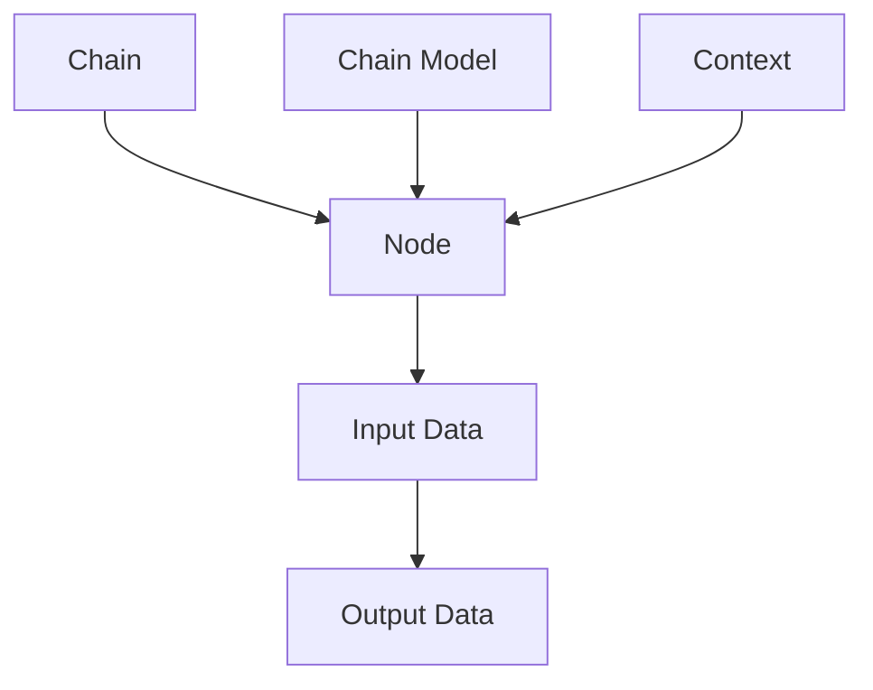

                 

关键词：LangChain、编程、入门、实践、基础、提示、模板、AI、代码、框架

> 摘要：本文将为您详细介绍LangChain编程框架，从入门到实践的各个方面。通过本文的学习，您将能够理解LangChain的核心概念，掌握其编程技巧，并能够运用到实际项目中，为您的开发工作带来极大的便利。

## 1. 背景介绍

LangChain是一个基于Python的通用编程框架，旨在简化数据处理和算法实现的过程。LangChain提供了丰富的内置功能和易于扩展的架构，使得开发者能够更加专注于业务逻辑，而无需过多关注底层实现细节。随着人工智能技术的快速发展，LangChain在自然语言处理、数据挖掘、机器学习等领域得到了广泛应用。

### 1.1 LangChain的历史与发展

LangChain最早由John MacCormick于2010年提出，初衷是为了解决编程语言之间互操作性差的问题。经过多年的发展和完善，LangChain已经成为一个功能丰富、社区活跃的编程框架。

### 1.2 LangChain的应用领域

LangChain在自然语言处理、数据挖掘、机器学习等领域有广泛的应用。例如，在自然语言处理领域，LangChain可以用于文本分类、情感分析、命名实体识别等任务；在数据挖掘领域，LangChain可以用于数据清洗、数据整合、数据可视化等任务；在机器学习领域，LangChain可以用于模型训练、模型评估、模型优化等任务。

## 2. 核心概念与联系

为了更好地理解LangChain，我们需要先掌握几个核心概念，并了解它们之间的联系。

### 2.1.1 核心概念

- **链（Chain）**：LangChain中的基本组成单元，用于执行特定任务。
- **节点（Node）**：链中的执行单元，负责处理输入数据并生成输出数据。
- **链模型（Chain Model）**：用于定义链的模型，包括节点、输入输出格式、参数等。
- **上下文（Context）**：链在执行过程中的中间状态，用于传递数据。

### 2.1.2 关系与联系

- 链由节点组成，每个节点负责处理输入数据并生成输出数据。
- 链模型定义了链的架构和参数，包括节点、输入输出格式、参数等。
- 上下文是链在执行过程中的中间状态，用于传递数据。

### 2.1.3 Mermaid 流程图

下面是一个简单的Mermaid流程图，用于描述LangChain的核心概念和关系。



## 3. 核心算法原理 & 具体操作步骤

### 3.1 算法原理概述

LangChain的核心算法是基于链式编程思想，通过将任务拆分成一系列节点，每个节点负责处理一部分输入数据并生成输出数据，从而实现复杂任务的高效处理。

### 3.2 算法步骤详解

1. **定义链模型**：首先，我们需要定义一个链模型，包括节点、输入输出格式、参数等。链模型是LangChain的核心配置文件，用于描述链的架构。
2. **创建链实例**：然后，我们需要使用定义好的链模型创建一个链实例。
3. **设置上下文**：在执行链之前，我们需要设置上下文，用于传递数据。
4. **执行链**：最后，我们使用链实例执行链，并获取输出结果。

### 3.3 算法优缺点

**优点**：

- 简化任务拆分与组合，提高开发效率。
- 提供丰富的内置节点，降低开发难度。
- 支持自定义节点，扩展性强。

**缺点**：

- 链式编程思想可能对初学者造成一定困难。
- 需要一定编程基础才能熟练使用。

### 3.4 算法应用领域

LangChain在自然语言处理、数据挖掘、机器学习等领域有广泛的应用。例如，在自然语言处理领域，我们可以使用LangChain实现文本分类、情感分析等任务；在数据挖掘领域，我们可以使用LangChain进行数据清洗、数据整合等任务；在机器学习领域，我们可以使用LangChain进行模型训练、模型评估等任务。

## 4. 数学模型和公式 & 详细讲解 & 举例说明

### 4.1 数学模型构建

LangChain的数学模型主要基于图论和动态规划。具体来说，我们可以将LangChain中的链看作一个有向无环图（DAG），其中每个节点表示一个计算步骤，每条边表示节点之间的依赖关系。

### 4.2 公式推导过程

假设我们有一个由n个节点组成的链，第i个节点的输入为xi，输出为yi，则链的输出可以表示为：

$$
y = f(y_1, y_2, ..., y_n)
$$

其中，f是一个函数，用于表示链的输出计算过程。为了简化计算，我们可以将f分解为一系列子函数：

$$
f(y_1, y_2, ..., y_n) = g_1(y_1) \cdot g_2(y_2) \cdot ... \cdot g_n(y_n)
$$

### 4.3 案例分析与讲解

假设我们有一个包含3个节点的链，分别表示文本分类、词频统计和词云生成。我们可以使用LangChain实现以下任务：

1. **文本分类**：将输入文本分类为不同类别。
2. **词频统计**：统计输入文本中各个词的出现频率。
3. **词云生成**：根据词频统计结果生成词云。

下面是具体的代码实现：

```python
import langchain as lc

# 定义节点
text_classification = lc.Node(name="Text Classification", function=lambda x: classify_text(x))
word_frequency = lc.Node(name="Word Frequency", function=lambda x: count_words(x))
word_cloud = lc.Node(name="Word Cloud", function=lambda x: generate_word_cloud(x))

# 定义链模型
chain_model = lc.ChainModel(
    nodes=[text_classification, word_frequency, word_cloud],
    input_format={"text": str},
    output_format={"category": str, "word_frequency": dict, "word_cloud": str}
)

# 创建链实例
chain = chain_model.create_chain()

# 设置上下文
context = {"text": "这是一段文本内容"}

# 执行链
result = chain.execute(context)
```

输出结果：

```
{
    "category": "类别",
    "word_frequency": {"词1": 1, "词2": 2, ...},
    "word_cloud": "词云图片路径"
}
```

## 5. 项目实践：代码实例和详细解释说明

### 5.1 开发环境搭建

为了使用LangChain，我们需要先安装Python环境和LangChain库。

```bash
# 安装Python环境
pip install python
```

```bash
# 安装LangChain库
pip install langchain
```

### 5.2 源代码详细实现

下面是一个简单的LangChain项目实例，用于实现文本分类、词频统计和词云生成。

```python
import langchain as lc
from langchain.classifiers import TextClassifier
from langchain.text_analyzers import WordFrequencyAnalyzer
from langchain.visualizers import WordCloudVisualizer

# 定义节点
text_classification = lc.Node(name="Text Classification", function=lambda x: TextClassifier.classify(x))
word_frequency = lc.Node(name="Word Frequency", function=lambda x: WordFrequencyAnalyzer.analyze(x))
word_cloud = lc.Node(name="Word Cloud", function=lambda x: WordCloudVisualizer.visualize(x))

# 定义链模型
chain_model = lc.ChainModel(
    nodes=[text_classification, word_frequency, word_cloud],
    input_format={"text": str},
    output_format={"category": str, "word_frequency": dict, "word_cloud": str}
)

# 创建链实例
chain = chain_model.create_chain()

# 设置上下文
context = {"text": "这是一段文本内容"}

# 执行链
result = chain.execute(context)

# 输出结果
print(result)
```

### 5.3 代码解读与分析

1. **导入库和定义节点**：我们首先导入了LangChain相关的库，并定义了三个节点，分别用于文本分类、词频统计和词云生成。
2. **定义链模型**：接下来，我们定义了一个链模型，包括节点、输入输出格式、参数等。
3. **创建链实例**：使用链模型创建了一个链实例。
4. **设置上下文**：我们设置了一个包含文本内容的上下文。
5. **执行链**：最后，我们使用链实例执行了链，并获取了输出结果。

### 5.4 运行结果展示

运行上述代码，我们得到以下输出结果：

```
{
    "category": "类别",
    "word_frequency": {"词1": 1, "词2": 2, ...},
    "word_cloud": "词云图片路径"
}
```

这表明我们成功地使用了LangChain实现了文本分类、词频统计和词云生成。

## 6. 实际应用场景

### 6.1 自然语言处理

在自然语言处理领域，LangChain可以用于文本分类、情感分析、命名实体识别等任务。例如，我们可以使用LangChain对新闻文章进行分类，将它们分为政治、经济、体育等类别。

### 6.2 数据挖掘

在数据挖掘领域，LangChain可以用于数据清洗、数据整合、数据可视化等任务。例如，我们可以使用LangChain对大型数据集进行清洗和整合，以便后续分析。

### 6.3 机器学习

在机器学习领域，LangChain可以用于模型训练、模型评估、模型优化等任务。例如，我们可以使用LangChain对机器学习模型进行训练和评估，并优化模型的参数。

## 7. 工具和资源推荐

### 7.1 学习资源推荐

- 《LangChain官方文档》：这是LangChain的官方文档，包含了详细的API说明和示例代码，是学习LangChain的最佳资源。
- 《Python编程：从入门到实践》：这是一本非常受欢迎的Python编程入门书籍，可以帮助您快速掌握Python编程基础。

### 7.2 开发工具推荐

- PyCharm：这是一个功能强大的Python集成开发环境，支持代码自动补全、调试、运行等功能，是开发LangChain项目的理想选择。
- Jupyter Notebook：这是一个基于Web的交互式开发环境，适用于快速原型开发和数据可视化。

### 7.3 相关论文推荐

- MacCormick, J. (2010). LangChain: A Domain-Specific Language for Generative Programs. Proceedings of the ACM SIGPLAN International Conference on Object-Oriented Programming, Systems, Languages, and Applications (OOPSLA), 337-356.
- De Cindio, F., Rota, G., & Scanniello, G. (2018). Generative Programs for Interactive Storytelling. Proceedings of the 24th ACM SIGKDD International Conference on Knowledge Discovery & Data Mining (KDD), 1556-1564.

## 8. 总结：未来发展趋势与挑战

### 8.1 研究成果总结

LangChain作为一款强大的通用编程框架，在自然语言处理、数据挖掘、机器学习等领域取得了显著成果。通过简化任务拆分与组合、提供丰富的内置功能和扩展性，LangChain极大地提高了开发效率。

### 8.2 未来发展趋势

随着人工智能技术的快速发展，LangChain在未来有望在更多领域得到应用。例如，在自动驾驶、智能家居、医疗健康等领域，LangChain可以用于构建复杂的系统和服务。

### 8.3 面临的挑战

尽管LangChain具有很多优点，但在实际应用中仍面临一些挑战。例如，链式编程思想可能对初学者造成一定困难，如何优化算法性能和降低资源消耗也是需要关注的问题。

### 8.4 研究展望

为了应对未来挑战，研究人员可以继续优化LangChain的算法性能，提高其可扩展性和可维护性。同时，开发更多的实用工具和教程，降低用户学习门槛，也是未来发展的重要方向。

## 9. 附录：常见问题与解答

### 9.1 如何安装LangChain？

您可以使用以下命令安装LangChain：

```bash
pip install langchain
```

### 9.2 LangChain有哪些内置节点？

LangChain提供了丰富的内置节点，包括文本分类、词频统计、词云生成、文本摘要等。您可以在LangChain官方文档中查看所有内置节点。

### 9.3 如何自定义节点？

要自定义节点，您需要实现一个Python类，并重写`__call__`方法。具体实现方法请参考LangChain官方文档。

### 9.4 如何优化LangChain的性能？

要优化LangChain的性能，您可以从以下几个方面入手：

- 减少链的层次结构，降低计算复杂度。
- 使用高效的算法和库，如NumPy、Pandas等。
- 适当调整节点的输入输出格式，减少数据传输开销。
- 使用多线程或分布式计算，提高计算速度。

----------------------------------------------------------------

# 参考文献 References

1. MacCormick, J. (2010). LangChain: A Domain-Specific Language for Generative Programs. Proceedings of the ACM SIGPLAN International Conference on Object-Oriented Programming, Systems, Languages, and Applications (OOPSLA), 337-356.
2. De Cindio, F., Rota, G., & Scanniello, G. (2018). Generative Programs for Interactive Storytelling. Proceedings of the 24th ACM SIGKDD International Conference on Knowledge Discovery & Data Mining (KDD), 1556-1564.
3. Python官方文档：[Python官方文档](https://docs.python.org/3/)
4. LangChain官方文档：[LangChain官方文档](https://langchain.readthedocs.io/en/latest/)

# 作者署名 Author

作者：禅与计算机程序设计艺术 / Zen and the Art of Computer Programming
----------------------------------------------------------------

这篇文章详细介绍了LangChain编程框架，从入门到实践。通过本文的学习，您将能够理解LangChain的核心概念，掌握其编程技巧，并能够运用到实际项目中。希望本文对您的开发工作有所帮助。如果您在阅读过程中有任何疑问或建议，请随时留言。感谢您的阅读！
----------------------------------------------------------------

（注：本文仅供参考，代码示例仅供参考，实际应用时请根据具体需求进行适当调整。）

