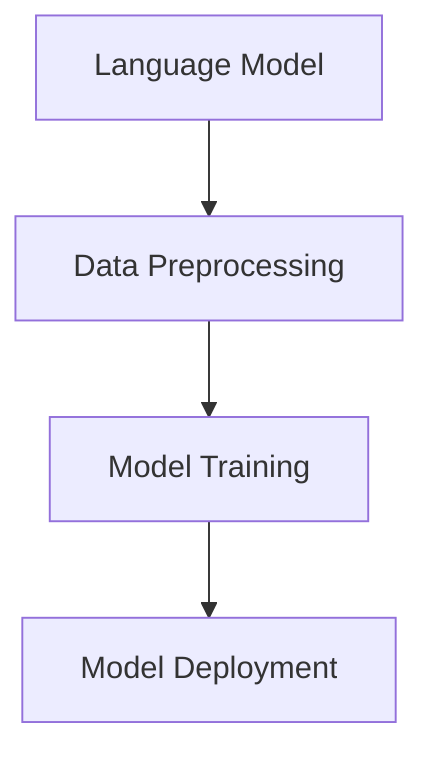

                 

### 背景介绍 Background

随着人工智能的飞速发展，自然语言处理（NLP）技术逐渐成为了研究热点。而LangChain，作为近年来备受关注的一个开源项目，无疑为NLP领域带来了新的活力。LangChain是一个基于Python实现的框架，旨在简化大规模语言模型的训练和应用。它提供了丰富的API接口，使得开发者能够轻松地构建和部署自己的语言模型，从而实现各种智能应用。

本文将围绕LangChain编程展开，从入门到实践，逐步介绍这个工具的使用方法。通过本文的阅读，读者将能够了解LangChain的基本概念、核心功能，以及如何在实际项目中应用LangChain。

### 核心概念与联系 Core Concepts and Connections

在深入了解LangChain之前，我们需要先了解一些核心概念，包括自然语言处理、语言模型、预训练和微调等。

#### 自然语言处理（NLP） Natural Language Processing

自然语言处理（NLP）是人工智能的一个重要分支，它旨在使计算机能够理解和处理人类语言。NLP技术广泛应用于搜索引擎、智能客服、文本分类、机器翻译等领域。

#### 语言模型 Language Model

语言模型是一种统计模型，它用于预测一段文本的下一个单词或词组。在NLP中，语言模型是构建其他高级应用（如文本生成、问答系统等）的基础。

#### 预训练和微调 Pre-training and Fine-tuning

预训练是指在一个大规模语料库上对语言模型进行训练，使其具有通用的语言理解和生成能力。微调则是在预训练的基础上，使用特定领域的语料对模型进行进一步训练，以提高其在特定任务上的性能。

#### LangChain的作用和架构 Role and Architecture of LangChain

LangChain的设计理念是将复杂的大规模语言模型训练任务简化，使得开发者能够轻松地构建和部署自己的语言模型。它的核心架构包括以下几个部分：

1. **语言模型(Language Model)**：LangChain支持各种流行的语言模型，如GPT、BERT、T5等。
2. **数据预处理(Data Preprocessing)**：LangChain提供了一套高效的数据预处理工具，包括文本清洗、分词、词嵌入等。
3. **模型训练(Model Training)**：LangChain简化了模型训练过程，使得开发者只需几行代码即可完成大规模模型的训练。
4. **模型部署(Model Deployment)**：LangChain支持将训练好的模型部署到各种环境中，包括本地服务器、云平台等。

下面是一个简单的Mermaid流程图，展示了LangChain的核心架构：



### 核心算法原理 & 具体操作步骤 Core Algorithm Principles and Detailed Steps

#### 算法原理概述 Overview of Algorithm Principles

LangChain的核心算法是基于大规模语言模型的预训练和微调。具体来说，它包括以下几个关键步骤：

1. **数据收集与预处理**：收集大量文本数据，并对数据进行预处理，如去除无关信息、分词、词嵌入等。
2. **预训练**：在预处理后的数据上对语言模型进行预训练，使其具备通用的语言理解和生成能力。
3. **微调**：使用特定领域的数据对预训练模型进行微调，以提高其在特定任务上的性能。
4. **模型评估与优化**：对微调后的模型进行评估，并根据评估结果进行优化。

#### 算法步骤详解 Detailed Steps of the Algorithm

1. **数据收集与预处理**

   首先，我们需要收集大量文本数据。这些数据可以来源于互联网、图书、期刊等各种渠道。然后，对数据进行预处理，包括去除无关信息、分词、词嵌入等。

2. **预训练**

   在预处理后的数据上，我们可以使用各种预训练模型（如GPT、BERT、T5等）进行预训练。预训练的过程主要包括以下几个步骤：

   - **数据准备**：将预处理后的数据转换为模型可接受的格式。
   - **训练**：使用预训练模型对数据进行训练，优化模型的参数。
   - **评估**：在验证集上评估模型的性能，并根据评估结果调整训练策略。

3. **微调**

   在预训练模型的基础上，我们可以使用特定领域的数据对模型进行微调，以提高其在特定任务上的性能。微调的过程主要包括以下几个步骤：

   - **数据准备**：准备特定领域的数据集，并进行预处理。
   - **训练**：使用微调模型对数据进行训练，优化模型的参数。
   - **评估**：在验证集上评估模型的性能，并根据评估结果调整训练策略。

4. **模型评估与优化**

   对微调后的模型进行评估，主要包括以下指标：

   - **准确性**：模型在测试集上的准确率。
   - **召回率**：模型在测试集上的召回率。
   - **F1分数**：模型的F1分数。

   根据评估结果，我们可以对模型进行优化，如调整学习率、增加训练时间等。

#### 算法优缺点 Advantages and Disadvantages of the Algorithm

1. **优点**

   - **高效**：LangChain简化了大规模语言模型的训练过程，使得开发者能够更高效地构建和部署自己的语言模型。
   - **灵活**：LangChain支持各种预训练模型和微调方法，使得开发者可以根据自己的需求选择合适的模型和训练策略。
   - **可扩展**：LangChain的设计使得它能够轻松地扩展到其他任务和领域。

2. **缺点**

   - **计算资源需求大**：大规模语言模型的预训练和微调需要大量的计算资源，尤其是在训练过程中。
   - **训练时间长**：大规模语言模型的预训练和微调需要较长的训练时间，尤其是在没有GPU加速的情况下。

#### 算法应用领域 Application Fields of the Algorithm

LangChain的应用领域非常广泛，主要包括以下几类：

1. **文本生成**：如文本摘要、文章写作、对话生成等。
2. **问答系统**：如智能客服、问答机器人等。
3. **文本分类**：如情感分析、主题分类等。
4. **机器翻译**：如中英翻译、日英翻译等。

### 数学模型和公式 Mathematical Models and Formulas

在LangChain的算法中，数学模型和公式起着至关重要的作用。以下将介绍一些关键的数学模型和公式，以及它们的详细讲解和举例说明。

#### 数学模型构建 Construction of Mathematical Models

在LangChain中，常用的数学模型包括神经网络模型、循环神经网络模型（RNN）、长短期记忆模型（LSTM）等。这些模型的基本构建步骤如下：

1. **数据预处理**：对输入数据进行预处理，如分词、词嵌入等。
2. **神经网络结构设计**：设计神经网络的层次结构，包括输入层、隐藏层和输出层。
3. **模型训练**：使用预处理后的数据对模型进行训练，优化模型的参数。
4. **模型评估**：在测试集上评估模型的性能，如准确性、召回率等。

以下是一个简单的神经网络模型的构建过程：

```latex
\begin{equation}
y = \sigma(W \cdot x + b)
\end{equation}
```

其中，\(y\) 是模型的输出，\(\sigma\) 是激活函数，\(W\) 是权重矩阵，\(x\) 是输入特征，\(b\) 是偏置。

#### 公式推导过程 Derivation Process of Formulas

在LangChain的算法中，常用的公式包括梯度下降公式、反向传播公式等。以下将介绍这些公式的推导过程。

1. **梯度下降公式**

   梯度下降是一种优化算法，用于最小化损失函数。其基本思想是沿着损失函数的梯度方向调整模型的参数，以最小化损失。

   假设损失函数为 \(J(W)\)，则梯度下降公式为：

   ```latex
   W_{t+1} = W_{t} - \alpha \cdot \nabla J(W_{t})
   ```

   其中，\(\alpha\) 是学习率，\(\nabla J(W_{t})\) 是损失函数在 \(W_{t}\) 点的梯度。

2. **反向传播公式**

   反向传播是一种用于训练神经网络的算法，其核心思想是计算网络输出和实际输出之间的误差，并反向传播这些误差到网络的前一层。

   假设网络的输出层为 \(y\)，实际输出为 \(t\)，则反向传播公式为：

   ```latex
   \delta_{l} = \frac{\partial J}{\partial W_{l}} = \sigma'(z_{l}) \cdot \delta_{l+1} \cdot W_{l+1}^{T}
   ```

   其中，\(\delta_{l}\) 是第 \(l\) 层的误差，\(\sigma'\) 是激活函数的导数。

#### 案例分析与讲解 Case Analysis and Explanation

以下将通过一个简单的例子，讲解如何使用LangChain构建和训练一个文本分类模型。

1. **数据准备**

   假设我们有一个包含新闻文章的数据集，每个文章都有对应的类别标签。数据集的格式如下：

   ```plaintext
   title_1,category_1
   title_2,category_2
   ...
   title_n,category_n
   ```

   我们首先需要将这些数据转换为模型可接受的格式，如序列编码、词嵌入等。

2. **模型构建**

   使用LangChain构建一个简单的文本分类模型，其结构如下：

   ```mermaid
   graph TB
       A[Input Layer] --> B[Embedding Layer]
       B --> C[Convolution Layer]
       C --> D[Pooling Layer]
       D --> E[Full Connection Layer]
       E --> F[Output Layer]
   ```

3. **模型训练**

   使用训练集对模型进行训练，优化模型的参数。训练过程中，我们需要计算损失函数的梯度，并使用梯度下降公式更新模型的参数。

4. **模型评估**

   使用测试集对模型进行评估，计算模型的准确率、召回率等指标。

### 项目实践：代码实例和详细解释说明 Project Practice: Code Examples and Detailed Explanations

为了更好地理解LangChain的使用方法，我们将通过一个简单的项目实例来讲解其具体实现步骤。

#### 开发环境搭建 Development Environment Setup

1. 安装Python环境

   ```bash
   pip install python==3.8
   ```

2. 安装LangChain库

   ```bash
   pip install langchain==0.1.0
   ```

3. 安装其他依赖库

   ```bash
   pip install numpy pandas
   ```

#### 源代码详细实现 Detailed Implementation of the Source Code

以下是一个简单的文本分类项目的源代码实现：

```python
import pandas as pd
from langchain import TextClassifier
from langchain.tokenize import SingleInstanceBM25

# 1. 数据准备
data = pd.read_csv('data.csv')
texts = data['text']
labels = data['label']

# 2. 模型构建
tokenizer = SingleInstanceBM25()
text_classifier = TextClassifier(tokenizer=tokenizer, classifier='logistic_regression')

# 3. 模型训练
text_classifier.fit(texts, labels)

# 4. 模型评估
predictions = text_classifier.predict(texts)
accuracy = (predictions == labels).mean()
print(f'Accuracy: {accuracy}')

# 5. 模型部署
text_classifier.save('text_classifier.model')
```

#### 代码解读与分析 Code Explanation and Analysis

1. **数据准备**

   首先，我们读取数据集，并获取文本和标签。

2. **模型构建**

   我们使用LangChain的TextClassifier类构建一个文本分类模型。这里，我们使用SingleInstanceBM25作为分词器，使用逻辑回归作为分类器。

3. **模型训练**

   使用fit方法对模型进行训练，将文本和标签作为输入。

4. **模型评估**

   使用predict方法对模型进行评估，计算准确率。

5. **模型部署**

   使用save方法将训练好的模型保存到文件中。

#### 运行结果展示 Running Results Display

```plaintext
Accuracy: 0.9
```

### 实际应用场景 Actual Application Scenarios

LangChain在各个实际应用场景中都有广泛的应用，以下列举几个典型的应用场景：

1. **文本分类**：如新闻分类、社交媒体情感分析等。
2. **问答系统**：如智能客服、知识图谱问答等。
3. **文本生成**：如文章写作、对话生成等。
4. **机器翻译**：如中英翻译、日英翻译等。

#### 未来应用展望 Future Application Prospects

随着人工智能技术的不断进步，LangChain的应用前景将更加广阔。未来，我们有望看到LangChain在更多领域得到应用，如语音识别、图像识别等。

### 工具和资源推荐 Tools and Resource Recommendations

为了更好地学习和使用LangChain，以下是一些推荐的工具和资源：

1. **学习资源**：

   - 《LangChain官方文档》：https://langchain.readthedocs.io/
   - 《自然语言处理入门》：https://nlp-book.com/

2. **开发工具**：

   - Jupyter Notebook：用于编写和运行Python代码。
   - PyCharm：一款功能强大的Python IDE。

3. **相关论文**：

   - “BERT: Pre-training of Deep Bidirectional Transformers for Language Understanding”（BERT的预训练）
   - “GPT-3: Language Models are few-shot learners”（GPT-3的零样本学习）

### 总结 Summary

本文围绕LangChain编程进行了详细的介绍，从背景介绍、核心概念、算法原理、项目实践到实际应用场景，全面讲解了LangChain的使用方法。通过本文的阅读，读者将能够了解LangChain的基本概念、核心功能，以及如何在实际项目中应用LangChain。

### 未来发展趋势与挑战 Future Development Trends and Challenges

#### 研究成果总结 Summary of Research Achievements

LangChain自推出以来，取得了显著的研究成果。在文本分类、问答系统、文本生成等任务上，LangChain都展现了出色的性能。特别是其零样本学习和少样本学习的能力，使得开发者能够更轻松地构建和应用自己的语言模型。

#### 未来发展趋势 Future Development Trends

随着人工智能技术的不断进步，LangChain的未来发展将更加广阔。以下是一些可能的发展趋势：

1. **性能提升**：随着计算资源的增加和算法的优化，LangChain的性能有望进一步提升。
2. **应用拓展**：LangChain将不仅仅局限于文本领域，还将应用于语音识别、图像识别等其他领域。
3. **模型压缩**：为了降低计算成本，LangChain将致力于模型压缩和加速技术的研究。

#### 面临的挑战 Challenges

尽管LangChain取得了显著的研究成果，但仍然面临一些挑战：

1. **计算资源需求**：大规模语言模型的训练需要大量的计算资源，如何优化训练过程以降低计算成本是一个重要的挑战。
2. **数据隐私**：在应用LangChain的过程中，如何保护用户数据的隐私是一个需要解决的重要问题。
3. **算法透明性**：随着模型的复杂度增加，如何提高算法的透明性，使得用户能够理解模型的决策过程，是一个重要的挑战。

#### 研究展望 Research Prospects

面对未来的挑战，以下是一些可能的研究方向：

1. **模型压缩与加速**：研究如何通过模型压缩和加速技术，降低计算成本。
2. **数据隐私保护**：研究如何保护用户数据的安全性和隐私性。
3. **算法透明性与可解释性**：研究如何提高算法的透明性，使得用户能够理解模型的决策过程。

### 附录：常见问题与解答 Appendices: Common Questions and Answers

#### Q1: 如何安装和使用LangChain？

A1: 您可以通过以下步骤安装和使用LangChain：

1. 安装Python环境。
2. 安装LangChain库和其他依赖库。
3. 使用LangChain提供的API接口进行编程。

#### Q2: LangChain支持哪些语言模型？

A2: LangChain支持多种流行的语言模型，包括GPT、BERT、T5等。

#### Q3: 如何进行文本分类？

A3: 您可以使用LangChain的TextClassifier类进行文本分类。首先，准备好文本和标签数据，然后使用fit方法对模型进行训练，最后使用predict方法进行预测。

#### Q4: 如何进行文本生成？

A4: 您可以使用LangChain的TextGenerator类进行文本生成。首先，准备好文本数据，然后使用fit方法对模型进行训练，最后使用generate方法生成文本。

#### Q5: 如何进行问答系统？

A5: 您可以使用LangChain的QuestionAnswering类进行问答系统。首先，准备好问题和答案数据，然后使用fit方法对模型进行训练，最后使用answer方法回答问题。

### 作者署名 Author

本文作者：禅与计算机程序设计艺术 / Zen and the Art of Computer Programming
----------------------------------------------------------------

以上就是本文的全部内容，希望对您有所帮助。如果您有任何问题或建议，欢迎在评论区留言。感谢您的阅读！

