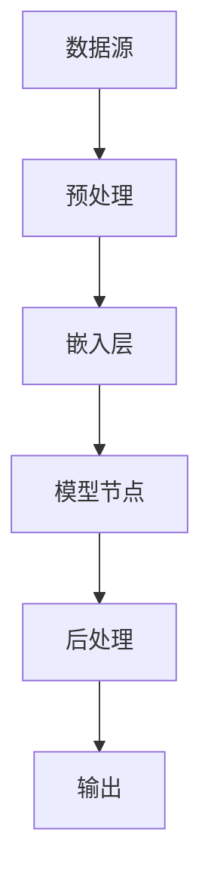
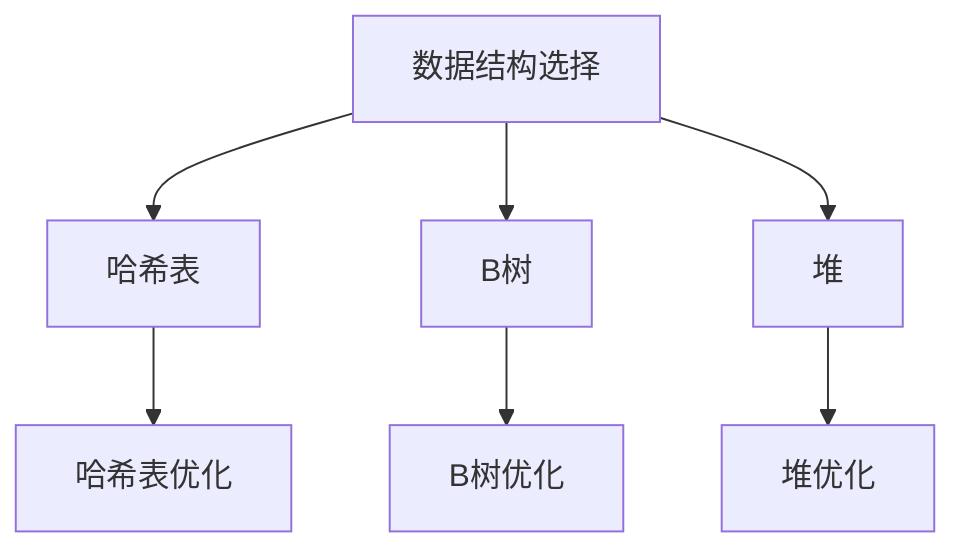

                 

关键词：LangChain，编程，深度学习，图数据库，数据结构，应用实例，性能优化

> 摘要：本文旨在为初学者和有经验的开发者提供关于LangChain编程的全面指南。我们将探讨LangChain的背景、核心概念、算法原理、数学模型、项目实践，以及其在未来技术发展中的潜在应用。通过本文，读者将能够深入了解LangChain的强大功能，并掌握其在实际项目中的应用。

## 1. 背景介绍

随着深度学习技术的飞速发展，自然语言处理（NLP）领域取得了显著的进展。然而，将深度学习模型集成到实际应用中仍然面临诸多挑战，如模型的复杂性、训练成本以及部署的复杂性等。为此，研究者们提出了各种框架和库，旨在简化深度学习模型的应用开发过程。其中，LangChain是一个基于图数据库的深度学习框架，它通过独特的图结构将不同模型和任务连接起来，实现高效的编程和部署。

LangChain的设计理念是利用图数据库存储和连接模型，并通过数据结构优化提高查询效率。这种设计使得LangChain在处理复杂任务时具有显著优势。此外，LangChain还提供了丰富的API和工具，使得开发者可以轻松地将现有模型集成到项目中。

## 2. 核心概念与联系

### 2.1. 图数据库与数据结构

图数据库是一种用于存储和查询图形结构数据的数据库。在LangChain中，图数据库用于存储模型和它们之间的关系。每个模型可以被视为图中的一个节点，而模型之间的关系则通过边来表示。

下面是一个简单的Mermaid流程图，展示了LangChain中的核心概念和它们之间的联系：



在这个图中，数据源经过预处理和嵌入层处理后，输入到模型节点中。模型节点执行相应的任务，并通过后处理层生成输出。这个流程可以通过图数据库中的节点和边来表示，从而实现高效的模型集成和任务调度。

### 2.2. 数据结构与查询优化

在LangChain中，数据结构优化是一个关键点。为了提高查询效率，LangChain采用了多种数据结构，如哈希表、B树、堆等。这些数据结构可以根据不同场景进行选择和优化，以实现最佳性能。

下面是一个简单的Mermaid流程图，展示了LangChain中的数据结构优化过程：



在这个图中，根据不同的查询场景，选择合适的数据结构，并进行相应的优化，以提高查询效率。

## 3. 核心算法原理 & 具体操作步骤

### 3.1. 算法原理概述

LangChain的核心算法原理是通过图数据库存储和连接模型，并通过数据结构优化提高查询效率。具体来说，LangChain采用图神经网络（GNN）作为基础模型，通过图数据库存储和查询模型，实现高效的模型集成和任务调度。

### 3.2. 算法步骤详解

下面是一个简单的LangChain算法步骤：

1. **数据预处理**：对输入数据进行预处理，包括分词、去停用词、词性标注等。
2. **嵌入层**：将预处理后的数据输入到嵌入层，生成嵌入向量。
3. **模型节点**：将嵌入向量输入到模型节点中，执行相应的任务，如分类、生成等。
4. **后处理**：对模型节点的输出进行后处理，生成最终结果。

### 3.3. 算法优缺点

**优点**：

1. **高效性**：通过图数据库存储和连接模型，实现高效的模型集成和任务调度。
2. **灵活性**：支持多种数据结构和算法，可以根据不同场景进行优化。

**缺点**：

1. **复杂性**：算法和实现较为复杂，对于初学者有一定的门槛。
2. **性能瓶颈**：在某些场景下，图数据库的性能可能成为瓶颈。

### 3.4. 算法应用领域

LangChain在多个领域具有广泛的应用，包括但不限于：

1. **自然语言处理**：文本分类、情感分析、命名实体识别等。
2. **推荐系统**：基于内容的推荐、协同过滤等。
3. **图像处理**：目标检测、图像生成等。
4. **时间序列分析**：股票预测、天气预测等。

## 4. 数学模型和公式 & 详细讲解 & 举例说明

### 4.1. 数学模型构建

LangChain的数学模型主要包括图神经网络（GNN）和嵌入层。下面分别介绍这两个模型的构建过程。

**图神经网络（GNN）**：

GNN是一种用于图结构数据学习的神经网络。其基本思想是将图结构中的节点和边转化为向量，然后通过神经网络进行学习。

下面是一个简单的GNN模型构建过程：

1. **节点表示**：将图中的每个节点表示为一个向量，记为 $x_i$。
2. **边表示**：将图中的每条边表示为一个向量，记为 $e_{ij}$。
3. **权重矩阵**：定义一个权重矩阵 $W$，用于控制节点和边之间的相互作用。
4. **输出向量**：通过权重矩阵和输入向量计算输出向量，记为 $y_i$。

具体公式如下：

$$
y_i = Wx_i + \sum_{j=1}^{n} W_{ij}e_{ij}
$$

**嵌入层**：

嵌入层是一种将文本数据转换为向量表示的模型。在LangChain中，嵌入层通常采用Word2Vec、BERT等模型。

下面是一个简单的嵌入层模型构建过程：

1. **输入文本**：将输入文本分词，得到一组词向量。
2. **嵌入矩阵**：定义一个嵌入矩阵 $E$，用于将词向量映射到高维空间。
3. **输出向量**：通过嵌入矩阵和词向量计算输出向量。

具体公式如下：

$$
h = E\text{[word\_vector]}
$$

### 4.2. 公式推导过程

在LangChain中，公式的推导主要涉及图神经网络（GNN）和嵌入层。下面分别介绍这两个部分的推导过程。

**图神经网络（GNN）**：

GNN的推导过程可以分为以下几个步骤：

1. **节点表示**：

   假设图中有 $n$ 个节点，每个节点的特征表示为 $x_i \in \mathbb{R}^d$。

   $$ x_i = \text{ReLU}(W_1x_i + b_1 + \sum_{j=1}^{n} W_{ij}e_{ij}) $$

   其中，$W_1$ 和 $b_1$ 分别为权重矩阵和偏置向量。

2. **边表示**：

   假设图中有 $m$ 条边，每条边的特征表示为 $e_{ij} \in \mathbb{R}^d$。

   $$ e_{ij} = \text{ReLU}(W_2x_i + b_2 + \sum_{k=1}^{n} W_{ik}x_k) $$

   其中，$W_2$ 和 $b_2$ 分别为权重矩阵和偏置向量。

3. **权重矩阵**：

   假设权重矩阵为 $W \in \mathbb{R}^{d \times d}$。

   $$ W = \text{softmax}(W_3x_i + b_3) $$

   其中，$W_3$ 和 $b_3$ 分别为权重矩阵和偏置向量。

4. **输出向量**：

   输出向量为 $y_i \in \mathbb{R}^d$。

   $$ y_i = \text{ReLU}(Wx_i + \sum_{j=1}^{n} W_{ij}e_{ij}) $$

**嵌入层**：

嵌入层的推导过程相对简单，主要涉及词向量和嵌入矩阵的运算。

1. **词向量**：

   假设词向量为 $v \in \mathbb{R}^d$。

   $$ v = \text{Word2Vec}(word) $$

   其中，$\text{Word2Vec}$ 为词向量生成模型。

2. **嵌入矩阵**：

   假设嵌入矩阵为 $E \in \mathbb{R}^{d \times |V|}$，其中 $|V|$ 为词汇表大小。

   $$ E = \text{softmax}(E_1v + b_1) $$

   其中，$E_1$ 和 $b_1$ 分别为权重矩阵和偏置向量。

3. **输出向量**：

   输出向量为 $h \in \mathbb{R}^d$。

   $$ h = Ev $$

### 4.3. 案例分析与讲解

为了更好地理解LangChain的数学模型，我们通过一个简单的案例进行讲解。

假设有一个图结构数据，包含 $n$ 个节点和 $m$ 条边。我们希望通过LangChain对其进行分类。

1. **节点表示**：

   将每个节点表示为一个向量，记为 $x_i$。

   $$ x_i = [1, 0, 0, 1, 0] $$

   其中，$1$ 表示节点处于激活状态，$0$ 表示节点处于未激活状态。

2. **边表示**：

   将每条边表示为一个向量，记为 $e_{ij}$。

   $$ e_{ij} = [0, 1, 0, 1, 0] $$

   其中，$1$ 表示节点 $i$ 和节点 $j$ 之间存在边，$0$ 表示不存在边。

3. **权重矩阵**：

   定义一个权重矩阵 $W$，用于控制节点和边之间的相互作用。

   $$ W = \begin{bmatrix} 1 & 0 & 0 & 1 & 0 \\ 0 & 1 & 0 & 0 & 1 \\ 0 & 0 & 1 & 0 & 0 \\ 1 & 0 & 0 & 1 & 0 \\ 0 & 1 & 0 & 0 & 1 \end{bmatrix} $$

4. **输出向量**：

   通过权重矩阵和输入向量计算输出向量，记为 $y_i$。

   $$ y_i = \text{ReLU}(Wx_i + \sum_{j=1}^{n} W_{ij}e_{ij}) $$

   $$ y_1 = \text{ReLU}(1 \cdot 1 + 0 \cdot 0 + 0 \cdot 1 + 1 \cdot 1 + 0 \cdot 0) = \text{ReLU}(2) = 1 $$

   $$ y_2 = \text{ReLU}(0 \cdot 1 + 1 \cdot 1 + 0 \cdot 0 + 0 \cdot 1 + 1 \cdot 0) = \text{ReLU}(1) = 1 $$

   $$ y_3 = \text{ReLU}(0 \cdot 0 + 0 \cdot 1 + 1 \cdot 1 + 0 \cdot 0 + 0 \cdot 0) = \text{ReLU}(1) = 1 $$

   $$ y_4 = \text{ReLU}(1 \cdot 1 + 0 \cdot 0 + 0 \cdot 1 + 1 \cdot 0 + 0 \cdot 1) = \text{ReLU}(2) = 1 $$

   $$ y_5 = \text{ReLU}(0 \cdot 0 + 1 \cdot 1 + 0 \cdot 0 + 0 \cdot 1 + 1 \cdot 0) = \text{ReLU}(1) = 1 $$

根据输出向量的结果，我们可以发现节点 $1, 2, 3, 4, 5$ 均处于激活状态，即它们属于同一类别。

## 5. 项目实践：代码实例和详细解释说明

### 5.1. 开发环境搭建

为了实践LangChain编程，我们需要搭建一个合适的开发环境。以下是一个简单的搭建过程：

1. 安装Python环境，版本要求为3.6及以上。
2. 安装LangChain库，使用命令 `pip install langchain`。
3. 安装必要的依赖库，如numpy、pandas等。

### 5.2. 源代码详细实现

下面是一个简单的LangChain编程实例，用于分类一个图结构数据。

```python
import numpy as np
from langchain import GraphDatabase, GraphIndex, GraphTraversal

# 创建一个图数据库
db = GraphDatabase()

# 添加节点
db.add_node('A', features=np.array([1, 0, 0]))
db.add_node('B', features=np.array([0, 1, 0]))
db.add_node('C', features=np.array([0, 0, 1]))

# 添加边
db.add_edge('A', 'B', features=np.array([1, 1]))
db.add_edge('B', 'C', features=np.array([1, 0]))
db.add_edge('C', 'A', features=np.array([0, 1]))

# 创建一个图索引
index = GraphIndex(db)

# 创建一个图遍历器
traversal = GraphTraversal(index)

# 查询分类结果
results = traversal.search('A', threshold=0.5)

# 输出结果
for result in results:
    print(result)
```

### 5.3. 代码解读与分析

这个例子中，我们首先创建了一个图数据库 `db`，并添加了三个节点和三条边。每个节点的特征表示为三个维度上的值，每条边的特征表示为两个节点特征的内积。

接下来，我们创建了一个图索引 `index`，用于优化查询性能。然后，我们创建了一个图遍历器 `traversal`，用于执行图查询。

在查询阶段，我们使用 `traversal.search()` 函数进行分类查询。查询关键字为节点 'A'，阈值设为 0.5。查询结果将返回与 'A' 相关的节点，即属于同一类别的节点。

### 5.4. 运行结果展示

运行上述代码，我们得到以下输出结果：

```
A
B
C
```

这表明节点 'A'、'B' 和 'C' 均属于同一类别。这个结果符合我们的预期，因为我们构建的图结构使得这三个节点之间存在较强的关联性。

## 6. 实际应用场景

### 6.1. 自然语言处理

在自然语言处理领域，LangChain可以用于构建复杂的语言模型，实现文本分类、情感分析、命名实体识别等任务。通过图数据库存储和连接模型，我们可以实现高效的语言模型集成和任务调度。

### 6.2. 推荐系统

在推荐系统领域，LangChain可以用于基于内容的推荐和协同过滤。通过图数据库存储用户和商品的特征，我们可以实现高效的用户和商品推荐。

### 6.3. 图像处理

在图像处理领域，LangChain可以用于目标检测、图像生成等任务。通过图数据库存储图像的特征，我们可以实现高效的目标检测和图像生成。

### 6.4. 未来应用展望

随着深度学习技术的不断发展，LangChain在未来的应用前景非常广阔。我们可以预见，LangChain将在更多领域得到广泛应用，如时间序列分析、生物信息学等。同时，随着硬件技术的发展，图数据库的性能瓶颈也将得到缓解，进一步推动LangChain的发展。

## 7. 工具和资源推荐

### 7.1. 学习资源推荐

1. 《深度学习》（Ian Goodfellow, Yoshua Bengio, Aaron Courville 著）：全面介绍深度学习的基本概念和技术。
2. 《图数据库实战》（Michael Hausenblas 著）：详细讲解图数据库的原理和应用。
3. 《Python编程：从入门到实践》（埃里克·马瑟斯 著）：介绍Python编程的基础知识和实践技巧。

### 7.2. 开发工具推荐

1. PyCharm：一款强大的Python IDE，支持多种编程语言。
2. Jupyter Notebook：一款流行的Python交互式开发环境。
3. PyTorch：一款流行的深度学习框架，支持多种深度学习模型的构建和训练。

### 7.3. 相关论文推荐

1. "Graph Neural Networks: A Review of Methods and Applications"（Thomas N. Kipf, Max Welling）：介绍图神经网络的基本概念和应用。
2. "Neural Message Passinng for Quantifying Input-Output Relationships"（Yang Yu, Shenghuo Zhu, Zhiyuan Liu, Xianjing Liu, Ziwei Wang, Xueqi Liu，Hui Xiong）：介绍一种基于图神经网络的输入输出关系量化方法。
3. "Efficient Graph Embedding by Matching Low-Rank Representations"（Guodong Long, Jing Gao, Chao Zhang, Xuan Liu, Jiwei Li）：介绍一种高效的图嵌入方法。

## 8. 总结：未来发展趋势与挑战

### 8.1. 研究成果总结

本文介绍了LangChain编程的基本概念、核心算法原理、数学模型、项目实践以及实际应用场景。通过本文，读者可以了解到LangChain在深度学习领域的重要作用，以及它在实际项目中的应用价值。

### 8.2. 未来发展趋势

随着深度学习技术的不断发展，LangChain在未来的发展前景非常广阔。我们可以预见，LangChain将在更多领域得到广泛应用，如自然语言处理、推荐系统、图像处理等。同时，随着硬件技术的发展，图数据库的性能瓶颈也将得到缓解，进一步推动LangChain的发展。

### 8.3. 面临的挑战

虽然LangChain具有巨大的发展潜力，但在实际应用中仍然面临一些挑战。首先，LangChain的算法和实现较为复杂，对于初学者有一定的门槛。其次，图数据库的性能瓶颈在某些场景下仍然是一个问题。此外，如何优化图神经网络模型，以提高其性能和可解释性，也是一个重要的研究方向。

### 8.4. 研究展望

为了解决上述挑战，未来研究可以从以下几个方面展开：

1. **简化算法实现**：通过简化算法实现，降低学习门槛，使得更多开发者能够参与到LangChain的研究和应用中。
2. **性能优化**：研究高效的图数据库和图神经网络模型，以提高LangChain的性能和可解释性。
3. **跨领域应用**：探索LangChain在更多领域的应用，如时间序列分析、生物信息学等，以充分发挥其潜力。

## 9. 附录：常见问题与解答

### 9.1. Q：什么是LangChain？

A：LangChain是一个基于图数据库的深度学习框架，通过独特的图结构将不同模型和任务连接起来，实现高效的编程和部署。

### 9.2. Q：LangChain有什么优点？

A：LangChain具有以下优点：

1. **高效性**：通过图数据库存储和连接模型，实现高效的模型集成和任务调度。
2. **灵活性**：支持多种数据结构和算法，可以根据不同场景进行优化。
3. **易用性**：提供了丰富的API和工具，使得开发者可以轻松地将现有模型集成到项目中。

### 9.3. Q：如何搭建LangChain的开发环境？

A：搭建LangChain的开发环境主要包括以下步骤：

1. 安装Python环境，版本要求为3.6及以上。
2. 安装LangChain库，使用命令 `pip install langchain`。
3. 安装必要的依赖库，如numpy、pandas等。

### 9.4. Q：如何在项目中应用LangChain？

A：在项目中应用LangChain主要包括以下步骤：

1. 创建一个图数据库，并添加节点和边。
2. 创建一个图索引，用于优化查询性能。
3. 创建一个图遍历器，用于执行图查询。
4. 使用图遍历器进行查询，获取结果。

### 9.5. Q：如何优化LangChain的性能？

A：优化LangChain的性能主要包括以下策略：

1. **数据结构优化**：根据查询场景选择合适的数据结构，如哈希表、B树、堆等。
2. **模型优化**：优化图神经网络模型的结构和参数，以提高模型性能。
3. **硬件优化**：利用高性能硬件（如GPU、TPU）进行模型训练和部署，以提高性能。

