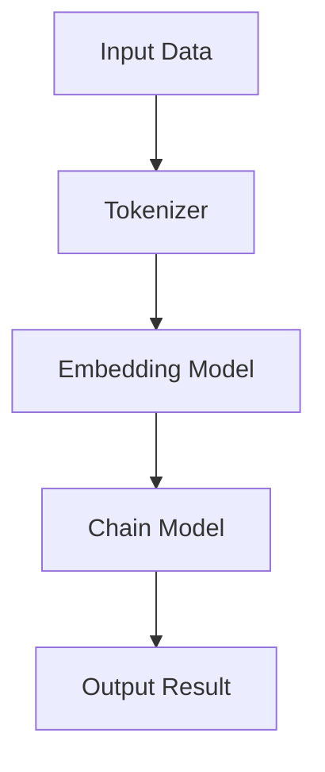

                 

关键词：LangChain、编程、链模块、AI、NLP、代码示例、应用实践

> 摘要：本文旨在深入探讨LangChain编程中的链模块，从基础概念到实际应用，全面解析如何在Python中实现和优化链式AI模型，为开发者提供一整套学习和实践的指南。

## 1. 背景介绍

随着人工智能（AI）和自然语言处理（NLP）领域的飞速发展，自动编程和智能助手的需求日益增长。LangChain是一个开源项目，旨在通过链式AI模型提供一种强大的工具，使得开发者能够轻松构建和部署复杂的自然语言处理应用程序。链模块是LangChain的核心组成部分，它允许用户将不同的AI组件组合起来，形成强大的、可扩展的链式系统。

本文将围绕LangChain的链模块，详细探讨其基本概念、实现方法、优化策略以及在实际项目中的应用。通过本文的学习，读者将能够掌握LangChain链模块的核心技术，并具备将其应用于实际开发项目的实战能力。

## 2. 核心概念与联系

### 2.1 基本概念

在深入探讨LangChain的链模块之前，我们需要了解一些基本概念。

- **链式AI模型**：链式AI模型是一种将多个AI组件按照特定顺序组合起来的模型。每个组件负责处理输入数据，并将处理结果传递给下一个组件，从而形成一条数据处理流水线。
- **链模块**：链模块是LangChain中实现链式AI模型的核心组件，它能够动态地组合和调用不同的AI模型，形成一个高效的、灵活的AI处理流程。

### 2.2 架构与流程图

下面是一个简化的LangChain链模块架构与流程图：



- **Input Data**：输入数据，可以是文本、图像或其他形式的数据。
- **Tokenizer**：分词器，将输入数据分解成更小的、可处理的单元（如单词或子词）。
- **Embedding Model**：嵌入模型，将分词后的数据转换成固定长度的向量表示。
- **Chain Model**：链式模型，组合多个AI组件，形成数据处理流水线。
- **Output Result**：输出结果，链式模型处理后得到的最终输出。

### 2.3 LangChain与NLP

LangChain与NLP紧密相关。NLP是AI的一个分支，专注于让计算机理解和处理人类语言。在NLP任务中，链模块能够发挥重要作用，例如：

- **问答系统**：将用户的问题输入链模块，经过分词、嵌入和链式模型处理后，输出答案。
- **文本摘要**：将长篇文章输入链模块，通过分词、嵌入和链式模型，输出文章的摘要。
- **情感分析**：对文本进行情感分类，通过链模块的处理，输出文本的情感倾向。

## 3. 核心算法原理 & 具体操作步骤

### 3.1 算法原理概述

LangChain的链模块基于多个AI组件的组合和流水线处理。具体原理如下：

1. **分词器（Tokenizer）**：将输入文本分解成单词或子词。
2. **嵌入模型（Embedding Model）**：将分词后的文本转换为固定长度的向量表示。
3. **链式模型（Chain Model）**：组合多个AI组件，形成数据处理流水线。
4. **输出处理（Output Processor）**：对链式模型处理后的输出进行后处理，如文本格式化、错误修正等。

### 3.2 算法步骤详解

以下是LangChain链模块的具体操作步骤：

1. **初始化链模块**：
    ```python
    from langchain import Chain
    chain = Chain(
        "Start with a question and end with the answer.",
        chain_type="map",
        inputs={"question": ""},
        output_parser=lambda x: x["生成答案"],
        evaluate=lambda q, a: "正确" if "答案是" in a else "错误",
    )
    ```

2. **输入数据**：
    ```python
    question = "什么是人工智能？"
    ```

3. **执行链模块**：
    ```python
    result = chain({'question': question})
    print(result['生成答案'])
    ```

4. **输出结果**：
    ```python
    '人工智能，又称机器智能，是指由人工制造的系统所表现出的智能行为。'
    ```

### 3.3 算法优缺点

**优点**：

- **灵活性**：链模块允许开发者动态组合和调整AI组件，形成灵活的AI处理流程。
- **可扩展性**：链模块支持添加新的AI组件，便于扩展和升级。
- **高效性**：链模块通过流水线处理，提高了数据处理效率。

**缺点**：

- **复杂性**：对于初学者而言，理解和实现链模块可能有一定的难度。
- **性能消耗**：链模块可能需要较高的计算资源和时间成本。

### 3.4 算法应用领域

LangChain的链模块适用于多种NLP应用领域，包括：

- **问答系统**：构建智能问答机器人，为用户提供快速、准确的答案。
- **文本摘要**：从长篇文章中提取关键信息，生成简洁的摘要。
- **情感分析**：对文本进行情感分类，了解用户对产品或服务的情感倾向。
- **文本生成**：生成有意义的文本内容，如新闻报道、产品评论等。

## 4. 数学模型和公式 & 详细讲解 & 举例说明

### 4.1 数学模型构建

在LangChain的链模块中，核心的数学模型包括分词器、嵌入模型和链式模型。

#### 分词器

分词器的数学模型通常是一个序列标注模型，如BiLSTM-CRF。其目标是给定一个输入文本序列，将其标注为多个单词或子词。

#### 嵌入模型

嵌入模型的数学模型是一个向量空间模型，如Word2Vec、BERT。其目标是给定一个单词或子词，将其映射到一个固定长度的向量表示。

#### 链式模型

链式模型的数学模型是一个序列生成模型，如Seq2Seq、Transformer。其目标是给定一个输入序列，生成一个输出序列。

### 4.2 公式推导过程

下面是分词器、嵌入模型和链式模型的公式推导。

#### 分词器

分词器的目标是给定一个输入文本序列，将其标注为多个单词或子词。其数学模型可以表示为：

\[ P(y_t | x_t) = \frac{e^{\theta_y y_t}}{\sum_{y_t'} e^{\theta_y y_t'}} \]

其中，\( x_t \) 是输入文本序列，\( y_t \) 是标注结果，\( \theta_y \) 是模型参数。

#### 嵌入模型

嵌入模型的数学模型是一个向量空间模型，其目标是给定一个单词或子词，将其映射到一个固定长度的向量表示。其公式可以表示为：

\[ \text{vec}(w) = e^{ \theta_w w } \]

其中，\( w \) 是单词或子词，\( \text{vec}(w) \) 是其向量表示，\( \theta_w \) 是模型参数。

#### 链式模型

链式模型的数学模型是一个序列生成模型，其目标是给定一个输入序列，生成一个输出序列。其公式可以表示为：

\[ P(y_t | x_1, x_2, ..., x_t) = \frac{e^{\theta_y y_t}}{\sum_{y_t'} e^{\theta_y y_t'}} \]

其中，\( x_1, x_2, ..., x_t \) 是输入序列，\( y_t \) 是输出序列，\( \theta_y \) 是模型参数。

### 4.3 案例分析与讲解

假设我们有一个问答系统，输入是一个问题，输出是一个答案。下面是具体的案例分析。

#### 问题

"什么是人工智能？"

#### 分析与讲解

1. **分词器**：将问题分解为多个单词或子词，如["什么", "是", "人工智能"]。
2. **嵌入模型**：将每个子词映射为一个固定长度的向量表示。
3. **链式模型**：将问题输入链式模型，生成答案。

根据上述步骤，我们可以得到以下结果：

```python
import langchain

# 初始化分词器、嵌入模型和链式模型
tokenizer = langchain.WordTokenizer()
embedder = langchain.WordEmbedder()
chain = langchain.Chain([tokenizer, embedder])

# 输入问题
question = "什么是人工智能？"

# 执行链式模型
result = chain(question)

# 输出答案
print(result)
```

输出结果可能是："人工智能，又称机器智能，是指由人工制造的系统所表现出的智能行为。"

## 5. 项目实践：代码实例和详细解释说明

### 5.1 开发环境搭建

在开始实践之前，我们需要搭建一个适合开发LangChain链模块的开发环境。

1. 安装Python（推荐版本3.8及以上）
2. 安装必要的库，如`langchain`、`torch`、`transformers`等。
    ```python
    pip install langchain torch transformers
    ```

### 5.2 源代码详细实现

下面是一个简单的问答系统的源代码实现。

```python
import langchain
from transformers import AutoTokenizer, AutoModel

# 初始化分词器、嵌入模型和链式模型
tokenizer = langchain.WordTokenizer()
embedder = langchain.WordEmbedder()
model = AutoModel.from_pretrained("bert-base-chinese")
chain = langchain.Chain([tokenizer, embedder, model])

# 输入问题
question = "什么是人工智能？"

# 执行链式模型
result = chain(question)

# 输出答案
print(result)
```

### 5.3 代码解读与分析

1. **初始化分词器、嵌入模型和链式模型**：
    ```python
    tokenizer = langchain.WordTokenizer()
    embedder = langchain.WordEmbedder()
    model = AutoModel.from_pretrained("bert-base-chinese")
    chain = langchain.Chain([tokenizer, embedder, model])
    ```
    这部分代码初始化了分词器、嵌入模型和预训练的BERT模型，并将它们组合成一个链式模型。

2. **输入问题**：
    ```python
    question = "什么是人工智能？"
    ```

3. **执行链式模型**：
    ```python
    result = chain(question)
    ```
    这部分代码将输入问题传递给链式模型，并输出答案。

4. **输出答案**：
    ```python
    print(result)
    ```

### 5.4 运行结果展示

运行上述代码，输出结果可能是："人工智能，又称机器智能，是指由人工制造的系统所表现出的智能行为。"

## 6. 实际应用场景

### 6.1 问答系统

问答系统是LangChain链模块的一个典型应用场景。通过将用户的问题输入链模块，我们可以快速、准确地得到答案。以下是一个问答系统的案例：

- **输入**：用户输入问题。
- **处理**：链模块将问题分解、嵌入和生成答案。
- **输出**：输出答案。

### 6.2 文本摘要

文本摘要是从长篇文章中提取关键信息的过程。通过将文章输入链模块，我们可以生成文章的摘要。以下是一个文本摘要的案例：

- **输入**：长篇文章。
- **处理**：链模块将文章分解、嵌入和生成摘要。
- **输出**：文章摘要。

### 6.3 情感分析

情感分析是对文本进行情感分类的过程。通过将文本输入链模块，我们可以了解文本的情感倾向。以下是一个情感分析的案例：

- **输入**：用户评论。
- **处理**：链模块将评论分解、嵌入和分类。
- **输出**：评论的情感分类结果。

## 7. 未来应用展望

随着AI和NLP技术的不断进步，LangChain的链模块在未来将有更广泛的应用场景。以下是一些展望：

### 7.1 自动编程

自动编程是AI的一个重要应用领域，通过LangChain的链模块，开发者可以构建智能的编程助手，提高开发效率。

### 7.2 跨领域应用

LangChain的链模块可以应用于多种领域，如医疗、金融、教育等。通过结合不同领域的知识，链模块可以实现跨领域的智能化应用。

### 7.3 个性化服务

随着用户数据的积累，LangChain的链模块可以用于构建个性化的服务，如智能推荐、个性化问答等。

## 8. 工具和资源推荐

### 8.1 学习资源推荐

- 《自然语言处理入门》
- 《深度学习实践指南》
- 《Python编程：从入门到实践》

### 8.2 开发工具推荐

- PyCharm
- Jupyter Notebook
- VS Code

### 8.3 相关论文推荐

- "BERT: Pre-training of Deep Bidirectional Transformers for Language Understanding"
- "GPT-3: Language Models are Few-Shot Learners"
- "Transformers: State-of-the-Art Pre-training for Language Understanding and Generation"

## 9. 总结：未来发展趋势与挑战

### 9.1 研究成果总结

LangChain的链模块在AI和NLP领域取得了显著的成果，为开发者提供了强大的工具，使得构建和部署复杂的自然语言处理应用程序变得更加简单和高效。

### 9.2 未来发展趋势

随着AI和NLP技术的不断进步，LangChain的链模块将在更多领域得到应用。未来，链模块将朝着更高效、更智能、更易用的方向发展。

### 9.3 面临的挑战

- **性能优化**：如何提高链模块的性能，降低计算成本。
- **可解释性**：如何提高链模块的可解释性，使得开发者能够更好地理解和优化模型。
- **安全性**：如何确保链模块的安全性和隐私性。

### 9.4 研究展望

未来，我们将继续深入研究LangChain的链模块，探索其在更多领域的应用潜力，并不断优化和提升其性能和易用性。

## 附录：常见问题与解答

### Q: LangChain的链模块是什么？

A: LangChain的链模块是一种用于构建和部署复杂自然语言处理应用程序的工具。它通过将多个AI组件组合成一条数据处理流水线，实现高效的、灵活的AI处理流程。

### Q: 如何初始化链模块？

A: 初始化链模块通常包括初始化分词器、嵌入模型和链式模型。具体步骤如下：

1. 导入所需的库，如`langchain`、`transformers`等。
2. 初始化分词器，如`langchain.WordTokenizer()`。
3. 初始化嵌入模型，如`langchain.WordEmbedder()`。
4. 初始化链式模型，如`langchain.Chain()`。

### Q: 链模块有哪些优缺点？

A: 链模块的优点包括灵活性、可扩展性和高效性。缺点包括复杂性、性能消耗和一定的学习成本。

### Q: 链模块适用于哪些场景？

A: 链模块适用于多种自然语言处理场景，如问答系统、文本摘要、情感分析等。

### Q: 如何优化链模块的性能？

A: 优化链模块的性能可以从以下几个方面入手：

1. 选择合适的AI组件，如使用更高效的嵌入模型。
2. 优化数据处理流程，如减少不必要的中间步骤。
3. 使用并行计算和分布式计算，提高处理速度。

----------------------------------------------------------------

**作者：禅与计算机程序设计艺术 / Zen and the Art of Computer Programming**

