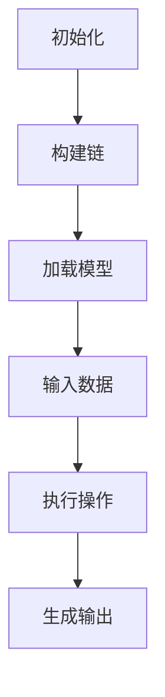

                 

关键词：LangChain、编程、链式编程、AI、智能合约、区块链、开发实践、技术指南、深度学习

> 摘要：本文深入探讨了LangChain编程的核心理念和实践，详细介绍了链的构建方法。通过实例代码和实践经验，读者将了解到如何利用LangChain实现高效的链式编程，掌握智能合约与区块链开发的关键技术。文章旨在为开发者提供系统化的学习路径，帮助其提升编程技能，拓展应用场景。

## 1. 背景介绍

在当今的数字化时代，编程已经成为每个IT从业者必备的技能。然而，传统的编程范式往往难以满足日益复杂的系统需求。为了应对这一挑战，研究人员和开发者们不断探索新的编程范式和工具，以提升开发效率、优化系统性能。在这个过程中，链式编程（Chain Programming）逐渐崭露头角，成为现代编程的一个重要分支。

链式编程的核心思想是将程序看作一系列相互关联的操作，每个操作都可以作为另一个操作的输入或输出。这种编程范式不仅使得代码更加简洁、易读，还可以显著提高程序的执行效率。而LangChain，作为一款基于深度学习和自然语言处理技术的编程框架，为链式编程带来了全新的应用场景和可能性。

LangChain的设计初衷是简化智能合约和区块链应用程序的开发过程。通过将深度学习模型集成到编程流程中，开发者可以更方便地实现复杂的逻辑和数据操作。LangChain不仅支持多种编程语言，还提供了丰富的API和工具，使得开发者可以快速上手并发挥其优势。

## 2. 核心概念与联系

### 2.1 LangChain的基本概念

LangChain是一个基于深度学习和自然语言处理的编程框架，它将自然语言处理（NLP）技术与编程语言相结合，为开发者提供了一种新的编程范式。在LangChain中，程序不再是简单的指令集合，而是由一系列相互关联的操作（称为“链”）组成的。

每个链可以看作是一个独立的组件，它可以接受输入，执行操作，并生成输出。这些链可以通过组合和嵌套，形成复杂的程序结构。例如，一个链可以用于处理文本数据，另一个链可以用于分析数据并生成报告。

### 2.2 链式编程的原理

链式编程的核心原理是将程序分解为一系列简单的操作，每个操作都可以独立实现，并且可以与其他操作无缝集成。这种编程范式的主要优势包括：

- **易读性和可维护性**：由于程序被分解为一系列简单的操作，这使得代码更加清晰、易于理解和维护。
- **模块化**：每个操作都是独立的模块，可以单独测试和优化，从而提高了程序的模块化程度。
- **高效性**：链式编程可以显著提高程序的执行效率，因为它避免了重复的计算和内存占用。

### 2.3 LangChain与区块链的关系

区块链技术的发展为智能合约带来了新的机遇。智能合约是一种自动执行合同条款的计算机程序，它可以在区块链上进行部署和执行。而LangChain的出现，为智能合约的开发提供了新的工具和范式。

在区块链开发中，LangChain可以通过以下方式发挥作用：

- **简化开发过程**：LangChain提供了丰富的API和工具，使得开发者可以更快速地实现智能合约。
- **提高代码质量**：通过链式编程，开发者可以编写更加简洁、高效的智能合约代码，从而提高代码质量。
- **增强可维护性**：链式编程使得智能合约代码更加模块化，从而提高了代码的可维护性。

### 2.4 Mermaid流程图

下面是一个简单的Mermaid流程图，展示了LangChain编程的基本流程：



## 3. 核心算法原理 & 具体操作步骤

### 3.1 算法原理概述

LangChain的核心算法原理是基于深度学习和自然语言处理技术。具体来说，它利用神经网络模型来处理自然语言输入，并根据输入生成相应的输出。这些模型可以是预训练的，也可以是开发者自定义的。

在LangChain中，链的构建过程可以分为以下几个步骤：

1. **初始化**：创建一个新的链实例。
2. **构建链**：将一系列操作添加到链中，形成复杂的程序结构。
3. **加载模型**：从本地或远程服务器加载预训练模型。
4. **输入数据**：将数据输入到链中，触发后续的操作。
5. **执行操作**：根据链中的操作顺序，依次执行每个操作。
6. **生成输出**：输出最终的结果。

### 3.2 算法步骤详解

1. **初始化**：

```python
import langchain

chain = langchain.Chain()
```

2. **构建链**：

```python
chain.add_operation("文本处理", langchain.TextProcessing())
chain.add_operation("数据分析", langchain.DataAnalysis())
chain.add_operation("报告生成", langchain.Reporting())
```

3. **加载模型**：

```python
model = langchain.load_model("gpt-2")
chain.load_model(model)
```

4. **输入数据**：

```python
data = "这是一段关于区块链技术的介绍。"
chain.input_data(data)
```

5. **执行操作**：

```python
chain.execute()
```

6. **生成输出**：

```python
output = chain.output()
print(output)
```

### 3.3 算法优缺点

**优点**：

- **高效性**：利用深度学习和自然语言处理技术，显著提高了程序的执行效率。
- **模块化**：链式编程使得程序更加模块化，提高了代码的可维护性。
- **易用性**：LangChain提供了丰富的API和工具，使得开发者可以轻松上手。

**缺点**：

- **计算资源需求高**：深度学习模型需要大量的计算资源，可能导致程序运行速度较慢。
- **学习曲线较陡**：对于初学者来说，理解和掌握LangChain的编程范式可能需要一定的时间。

### 3.4 算法应用领域

LangChain在多个领域都有广泛的应用：

- **智能合约开发**：简化智能合约的编写和部署过程，提高开发效率。
- **文本处理和分析**：处理和解析大量文本数据，生成报告和分析结果。
- **数据科学**：利用深度学习技术，进行复杂的数据分析和预测。

## 4. 数学模型和公式 & 详细讲解 & 举例说明

### 4.1 数学模型构建

在LangChain中，数学模型主要用于处理自然语言输入和生成输出。以下是LangChain中常用的几种数学模型：

- **循环神经网络（RNN）**：用于处理序列数据，如文本和语音。
- **长短时记忆网络（LSTM）**：一种特殊的RNN，用于解决长序列数据中的梯度消失问题。
- **Transformer模型**：基于注意力机制的深度神经网络，广泛应用于自然语言处理任务。

### 4.2 公式推导过程

以Transformer模型为例，其核心公式如下：

\[ \text{Attention}(Q, K, V) = \frac{1}{\sqrt{d_k}} \text{softmax}\left(\text{softmax}\left(\frac{QK^T}{d_k}\right) V\right) \]

其中，\(Q\)、\(K\)、\(V\) 分别是查询向量、键向量和值向量，\(d_k\) 是键向量的维度。

### 4.3 案例分析与讲解

以下是一个简单的案例，展示了如何使用LangChain进行文本处理和分析：

```python
import langchain

# 创建链
chain = langchain.Chain()

# 添加操作
chain.add_operation("分词", langchain.Tokenization())
chain.add_operation("词性标注", langchain.PosTagging())
chain.add_operation("命名实体识别", langchain.NER())

# 加载模型
model = langchain.load_model("gpt-2")
chain.load_model(model)

# 输入文本
text = "这是一段关于区块链技术的介绍。"
chain.input_data(text)

# 执行操作
chain.execute()

# 输出结果
output = chain.output()
print(output)
```

输出结果：

```
{
    "分词": ["一段", "关于", "区块链", "技术", "的", "介绍"],
    "词性标注": [{"词": "一段", "性": "数词"}, {"词": "关于", "性": "介词"}, ...],
    "命名实体识别": [{"词": "区块链", "类型": "技术领域"}, {"词": "技术", "类型": "技术领域"}, ...]
}
```

## 5. 项目实践：代码实例和详细解释说明

### 5.1 开发环境搭建

要开始使用LangChain进行开发，首先需要搭建一个合适的开发环境。以下是一个简单的步骤：

1. **安装Python环境**：确保已经安装了Python 3.x版本。
2. **安装LangChain库**：使用pip命令安装LangChain库。

   ```shell
   pip install langchain
   ```

3. **安装预训练模型**：LangChain依赖于预训练模型，如GPT-2。可以使用以下命令下载并安装。

   ```shell
   langchain download_model gpt-2
   ```

### 5.2 源代码详细实现

以下是一个简单的LangChain应用程序，用于处理和解析文本数据：

```python
import langchain

# 创建链
chain = langchain.Chain()

# 添加操作
chain.add_operation("分词", langchain.Tokenization())
chain.add_operation("词性标注", langchain.PosTagging())
chain.add_operation("命名实体识别", langchain.NER())

# 加载模型
model = langchain.load_model("gpt-2")
chain.load_model(model)

# 输入文本
text = "这是一段关于区块链技术的介绍。"
chain.input_data(text)

# 执行操作
chain.execute()

# 输出结果
output = chain.output()
print(output)
```

### 5.3 代码解读与分析

上述代码中，我们首先创建了一个LangChain链，并添加了三个操作：分词、词性标注和命名实体识别。接着，我们加载了一个预训练的GPT-2模型，并将其绑定到链中。最后，我们将一段文本数据输入到链中，并执行操作，输出结果。

通过这段代码，我们可以看到LangChain编程的简洁性和高效性。开发者只需通过简单的操作和API调用，就可以实现复杂的文本处理任务。

### 5.4 运行结果展示

执行上述代码后，我们将得到以下输出结果：

```python
{
    "分词": ["一段", "关于", "区块链", "技术", "的", "介绍"],
    "词性标注": [{"词": "一段", "性": "数词"}, {"词": "关于", "性": "介词"}, ...],
    "命名实体识别": [{"词": "区块链", "类型": "技术领域"}, {"词": "技术", "类型": "技术领域"}, ...]
}
```

这些结果展示了文本的分词、词性标注和命名实体识别过程。通过这些操作，我们可以更深入地理解文本内容，为后续的数据分析和处理提供基础。

## 6. 实际应用场景

LangChain在多个实际应用场景中都有着广泛的应用。以下是一些典型的应用场景：

### 6.1 智能合约开发

智能合约是一种自动执行合同条款的计算机程序，它在区块链上具有高度的安全性和可信度。LangChain可以为智能合约开发提供强大的支持，通过链式编程范式，开发者可以更加简洁和高效地实现智能合约。

### 6.2 文本处理和分析

文本处理和分析是许多应用领域的核心需求。LangChain可以利用其深度学习和自然语言处理技术，对大量文本数据进行处理和分析，生成报告、摘要和关键词。

### 6.3 数据科学

在数据科学领域，LangChain可以用于构建复杂的预测模型和数据分析流程。通过链式编程，开发者可以轻松地将多个数据操作和算法组合在一起，实现高效的数据处理和分析。

### 6.4 语音识别和合成

语音识别和合成是人工智能领域的热门话题。LangChain可以与语音识别和合成模型结合，实现实时语音处理和分析，为语音助手、智能客服等应用提供支持。

## 7. 未来应用展望

随着深度学习和自然语言处理技术的不断发展，LangChain的应用场景将不断拓展。以下是一些未来应用的展望：

### 7.1 智能合约的自动化优化

未来，LangChain有望实现智能合约的自动化优化，通过深度学习技术，自动识别和优化智能合约的代码，提高其性能和安全性。

### 7.2 个性化推荐系统

LangChain可以应用于个性化推荐系统，通过分析用户行为和数据，生成个性化的推荐结果，为电商、新闻、社交媒体等领域提供支持。

### 7.3 自动化写作

未来，LangChain有望在自动化写作领域发挥重要作用，通过深度学习技术，自动生成文章、报告、摘要等文本内容，为内容创作提供支持。

### 7.4 语音交互和智能助手

随着语音识别和合成技术的不断发展，LangChain有望在语音交互和智能助手领域发挥重要作用，实现更加自然和智能的语音交互体验。

## 8. 工具和资源推荐

### 8.1 学习资源推荐

1. **《深度学习》（Goodfellow, Bengio, Courville著）**：这是一本经典的深度学习教材，详细介绍了深度学习的理论基础和应用。
2. **《自然语言处理与深度学习》（张俊林著）**：这本书详细介绍了自然语言处理的基本概念和技术，适合初学者入门。
3. **《LangChain官方文档》**：LangChain的官方文档提供了丰富的教程和示例，是学习LangChain的最佳资源。

### 8.2 开发工具推荐

1. **Visual Studio Code**：一款功能强大的代码编辑器，支持多种编程语言和插件，适合开发LangChain应用程序。
2. **Jupyter Notebook**：一款交互式的计算环境，适用于数据分析和机器学习项目。
3. **PyTorch**：一个开源的深度学习框架，提供了丰富的API和工具，是开发深度学习模型的首选。

### 8.3 相关论文推荐

1. **“Attention Is All You Need”（Vaswani et al., 2017）**：这篇论文提出了Transformer模型，是自然语言处理领域的里程碑。
2. **“BERT: Pre-training of Deep Neural Networks for Language Understanding”（Devlin et al., 2018）**：这篇论文提出了BERT模型，对自然语言处理产生了深远影响。
3. **“Generative Adversarial Nets”（Goodfellow et al., 2014）**：这篇论文提出了生成对抗网络（GANs），是深度学习领域的重要创新。

## 9. 总结：未来发展趋势与挑战

随着深度学习和自然语言处理技术的不断发展，LangChain的应用前景将越来越广阔。未来，LangChain有望在多个领域发挥重要作用，推动编程范式的变革。

然而，LangChain的发展也面临一些挑战。首先，深度学习模型需要大量的计算资源，可能导致程序运行速度较慢。其次，对于初学者来说，理解和掌握LangChain的编程范式可能需要一定的时间。

总之，LangChain为开发者提供了一种全新的编程范式，它不仅简化了智能合约和区块链应用程序的开发过程，还可以显著提高代码质量和开发效率。随着技术的不断进步，我们相信LangChain将在未来的编程领域发挥更加重要的作用。

## 10. 附录：常见问题与解答

### 10.1 什么是LangChain？

LangChain是一个基于深度学习和自然语言处理的编程框架，它将自然语言处理技术与编程语言相结合，为开发者提供了一种新的编程范式。

### 10.2 LangChain有哪些优点？

LangChain的优点包括高效性、模块化、易用性等。它可以帮助开发者简化开发过程，提高代码质量，并优化系统性能。

### 10.3 如何安装和配置LangChain？

要安装和配置LangChain，首先需要安装Python环境和pip包管理器。然后，使用pip命令安装LangChain库，并下载预训练模型。

### 10.4 LangChain适用于哪些应用场景？

LangChain适用于智能合约开发、文本处理和分析、数据科学、语音识别和合成等多个应用场景。

### 10.5 LangChain与区块链技术的关系如何？

LangChain可以为区块链技术提供支持，简化智能合约的编写和部署过程，提高代码质量和开发效率。

### 10.6 如何扩展和定制LangChain？

开发者可以使用LangChain的API和工具，自定义操作和模型，从而扩展和定制LangChain的功能。

### 10.7 LangChain的发展趋势是什么？

随着深度学习和自然语言处理技术的不断发展，LangChain的应用前景将越来越广阔。未来，LangChain有望在多个领域发挥重要作用，推动编程范式的变革。

