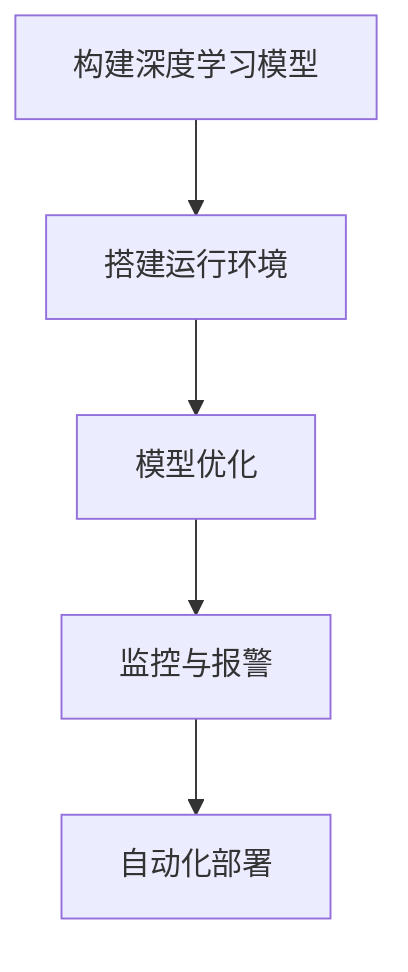

                 

关键词：大模型应用、AI Agent、运行助手、深度学习、模型优化、代码实现

摘要：本文将介绍如何使用深度学习和人工智能技术构建一个运行助手，以优化和提升大模型在各个应用场景中的性能和效率。我们将从背景介绍、核心概念与联系、核心算法原理、数学模型和公式、项目实践以及实际应用场景等多个方面进行深入探讨，帮助读者全面了解并掌握构建运行助手的方法和技巧。

## 1. 背景介绍

随着人工智能技术的快速发展，深度学习模型在各个领域取得了显著的成果，如计算机视觉、自然语言处理、语音识别等。然而，在实际应用过程中，如何优化和提升大模型的性能和效率，成为了亟待解决的问题。运行助手作为一种高效的辅助工具，可以帮助开发者和管理员快速定位并解决模型运行过程中的问题，提高模型运行效率和稳定性。

本文将介绍如何使用深度学习和人工智能技术构建一个运行助手，以实现对大模型的高效管理和优化。通过本文的讲解，读者将了解运行助手的构建过程、核心算法原理以及具体操作步骤，从而为实际应用场景中的模型优化提供有力支持。

## 2. 核心概念与联系

在构建运行助手的过程中，需要了解以下几个核心概念和它们之间的联系：

### 2.1 深度学习模型

深度学习模型是一种基于多层神经网络构建的人工智能模型，它可以对大量数据进行自动特征提取和模式识别。常见的深度学习模型有卷积神经网络（CNN）、循环神经网络（RNN）、长短时记忆网络（LSTM）等。

### 2.2 运行环境

运行环境是指深度学习模型在运行过程中所需的各种硬件和软件资源，包括计算机硬件、操作系统、深度学习框架等。常见的深度学习框架有TensorFlow、PyTorch、Keras等。

### 2.3 模型优化

模型优化是指通过调整模型的结构、参数和超参数，提高模型在特定任务上的性能。常见的优化方法有调整学习率、批量大小、正则化等。

### 2.4 监控与报警

监控与报警是运行助手的重要组成部分，通过实时监控模型的运行状态，及时发现并处理异常情况，保证模型的稳定运行。常见的监控指标有内存使用率、CPU利用率、GPU利用率等。

### 2.5 自动化部署

自动化部署是指通过自动化工具，将训练完成的模型部署到生产环境，实现模型的在线推理和实时更新。常见的自动化部署工具包括Docker、Kubernetes等。

下面是一个用Mermaid绘制的流程图，展示了运行助手的构建过程：



## 3. 核心算法原理 & 具体操作步骤

### 3.1 算法原理概述

运行助手的核心算法主要包括以下三个方面：

1. **模型优化算法**：用于调整模型的结构、参数和超参数，提高模型在特定任务上的性能。常见的优化算法有梯度下降、随机梯度下降、Adam等。
2. **监控与报警算法**：用于实时监控模型的运行状态，及时发现并处理异常情况。常见的监控指标有内存使用率、CPU利用率、GPU利用率等。
3. **自动化部署算法**：用于将训练完成的模型部署到生产环境，实现模型的在线推理和实时更新。常见的自动化部署算法包括容器化、虚拟化等。

### 3.2 算法步骤详解

下面是运行助手的构建步骤：

1. **构建深度学习模型**：使用深度学习框架（如TensorFlow、PyTorch）搭建模型，并完成模型的训练。
2. **搭建运行环境**：配置计算机硬件、操作系统、深度学习框架等资源，为模型运行提供必要的支持。
3. **模型优化**：根据实际任务需求，调整模型的结构、参数和超参数，提高模型在特定任务上的性能。
4. **监控与报警**：实时监控模型的运行状态，设置监控指标和报警阈值，当监控指标超过阈值时，自动触发报警。
5. **自动化部署**：使用自动化部署工具（如Docker、Kubernetes）将训练完成的模型部署到生产环境，实现模型的在线推理和实时更新。

### 3.3 算法优缺点

**模型优化算法**：

- **优点**：提高模型在特定任务上的性能，使模型更适应实际应用场景。
- **缺点**：调整模型结构、参数和超参数需要大量的计算资源和时间。

**监控与报警算法**：

- **优点**：实时监控模型运行状态，提高模型运行效率和稳定性。
- **缺点**：设置监控指标和报警阈值需要丰富的经验和专业知识。

**自动化部署算法**：

- **优点**：简化模型部署过程，提高模型上线效率。
- **缺点**：对自动化部署工具（如Docker、Kubernetes）的依赖性较高。

### 3.4 算法应用领域

运行助手可以应用于以下领域：

- **计算机视觉**：图像分类、目标检测、人脸识别等。
- **自然语言处理**：文本分类、情感分析、机器翻译等。
- **语音识别**：语音识别、语音合成、语音助手等。

## 4. 数学模型和公式 & 详细讲解 & 举例说明

### 4.1 数学模型构建

在构建运行助手的过程中，需要使用以下数学模型：

1. **梯度下降算法**：
   梯度下降是一种常用的优化算法，用于调整模型参数，使模型在特定任务上取得更好的性能。其基本思想是沿着损失函数的梯度方向更新模型参数，以减少损失函数的值。

   $$\theta_{t+1} = \theta_{t} - \alpha \nabla_{\theta} J(\theta)$$

   其中，$\theta$ 表示模型参数，$J(\theta)$ 表示损失函数，$\alpha$ 表示学习率。

2. **监控与报警算法**：
   监控与报警算法主要用于实时监控模型的运行状态，设置监控指标和报警阈值。常见的监控指标有内存使用率、CPU利用率、GPU利用率等。

   $$阈值 = 监控指标_{t} - 监控指标_{t-1}$$

   当监控指标超过阈值时，自动触发报警。

3. **自动化部署算法**：
   自动化部署算法主要用于将训练完成的模型部署到生产环境。常见的自动化部署工具包括Docker、Kubernetes等。

   $$容器化 = 模型_{t} + 配置_{t}$$

   其中，模型$_{t}$ 表示训练完成的模型，配置$_{t}$ 表示模型配置信息。

### 4.2 公式推导过程

下面是梯度下降算法的推导过程：

1. **损失函数**：

   $$J(\theta) = \frac{1}{2m} \sum_{i=1}^{m} (h_\theta(x^{(i)}) - y^{(i)})^2$$

   其中，$m$ 表示样本数量，$h_\theta(x)$ 表示模型预测值，$y^{(i)}$ 表示第$i$个样本的真实值。

2. **梯度计算**：

   $$\nabla_{\theta} J(\theta) = \frac{1}{m} \sum_{i=1}^{m} (h_\theta(x^{(i)}) - y^{(i)}) \frac{\partial h_\theta(x^{(i)})}{\partial \theta}$$

3. **参数更新**：

   $$\theta_{t+1} = \theta_{t} - \alpha \nabla_{\theta} J(\theta)$$

   其中，$\alpha$ 表示学习率。

### 4.3 案例分析与讲解

假设我们有一个二分类问题，训练数据集包含100个样本，每个样本的特征维度为10。使用梯度下降算法进行模型训练，学习率为0.01。下面是具体的训练过程：

1. **初始化参数**：

   $$\theta_0 = [0, 0, 0, 0, 0, 0, 0, 0, 0, 0]$$

2. **计算损失函数**：

   $$J(\theta_0) = \frac{1}{2m} \sum_{i=1}^{m} (h_\theta(x^{(i)}) - y^{(i)})^2$$

3. **计算梯度**：

   $$\nabla_{\theta} J(\theta_0) = \frac{1}{m} \sum_{i=1}^{m} (h_\theta(x^{(i)}) - y^{(i)}) \frac{\partial h_\theta(x^{(i)})}{\partial \theta}$$

4. **参数更新**：

   $$\theta_1 = \theta_0 - \alpha \nabla_{\theta} J(\theta_0)$$

5. **重复上述步骤**，直到满足停止条件（如梯度变化小于某个阈值或迭代次数达到上限）。

## 5. 项目实践：代码实例和详细解释说明

### 5.1 开发环境搭建

在搭建开发环境时，需要安装以下软件和工具：

1. Python（版本3.6及以上）
2. TensorFlow 2.x 或 PyTorch
3. Docker（版本19.03及以上）
4. Kubernetes（版本1.18及以上）

安装步骤如下：

1. 安装Python：
   ```shell
   sudo apt update
   sudo apt install python3 python3-pip
   ```

2. 安装TensorFlow 2.x：
   ```shell
   pip3 install tensorflow
   ```

3. 安装Docker：
   ```shell
   sudo apt install docker.io
   sudo systemctl start docker
   sudo systemctl enable docker
   ```

4. 安装Kubernetes：
   ```shell
   kubeadm init --pod-network-cidr=10.244.0.0/16
   mkdir -p $HOME/.kube
   sudo cp -i /etc/kubernetes/admin.conf $HOME/.kube/config
   sudo chown $(id -u):$(id -g) $HOME/.kube/config
   ```

### 5.2 源代码详细实现

下面是一个简单的示例代码，用于训练一个深度学习模型，并将其部署到Kubernetes集群中。

1. **模型训练**：

   ```python
   import tensorflow as tf
   from tensorflow.keras.models import Sequential
   from tensorflow.keras.layers import Dense

   # 构建模型
   model = Sequential()
   model.add(Dense(64, activation='relu', input_shape=(10,)))
   model.add(Dense(1, activation='sigmoid'))

   # 编译模型
   model.compile(optimizer='adam', loss='binary_crossentropy', metrics=['accuracy'])

   # 加载训练数据
   x_train = ...  # 特征数据
   y_train = ...  # 标签数据

   # 训练模型
   model.fit(x_train, y_train, epochs=10, batch_size=32)
   ```

2. **模型保存**：

   ```python
   # 保存模型
   model.save('model.h5')
   ```

3. **模型部署**：

   ```python
   import os
   import subprocess

   # 构建Docker镜像
   docker_image_name = 'my_model'
   docker_tag = 'latest'
   docker_build_cmd = f'docker build -t {docker_image_name}:{docker_tag} .'
   subprocess.run(docker_build_cmd, shell=True)

   # 推送Docker镜像到仓库
   docker_push_cmd = f'docker push {docker_image_name}:{docker_tag}'
   subprocess.run(docker_push_cmd, shell=True)

   # 部署模型到Kubernetes集群
   kubectl_apply_cmd = f"kubectl apply -f deployment.yaml"
   subprocess.run(kubectl_apply_cmd, shell=True)
   ```

### 5.3 代码解读与分析

1. **模型训练**：

   在模型训练部分，我们首先构建了一个简单的深度学习模型，该模型包含一个输入层、一个隐藏层和一个输出层。隐藏层使用ReLU激活函数，输出层使用sigmoid激活函数，以实现二分类任务。

   然后，我们编译模型，并加载训练数据。模型使用Adam优化器进行训练，训练过程中使用binary_crossentropy损失函数和accuracy指标进行评估。

2. **模型保存**：

   训练完成后，我们将模型保存为HDF5格式文件，以便后续加载和部署。

3. **模型部署**：

   在模型部署部分，我们首先使用Docker命令构建一个Docker镜像，并将模型文件打包到镜像中。然后，我们将Docker镜像推送到远程仓库。

   接下来，我们编写一个Kubernetes部署文件（deployment.yaml），用于描述模型的部署信息，如镜像名称、容器名称、端口映射等。最后，我们使用kubectl命令将模型部署到Kubernetes集群中。

### 5.4 运行结果展示

完成模型部署后，我们可以通过以下命令查看模型的运行状态：

```shell
kubectl get pods
kubectl logs <pod_name>
```

## 6. 实际应用场景

运行助手在实际应用场景中具有广泛的应用价值，以下列举几个典型场景：

### 6.1 计算机视觉

在计算机视觉领域，运行助手可以帮助开发者实时监控和优化图像分类、目标检测、人脸识别等模型的运行状态，提高模型在复杂环境下的识别准确率和稳定性。

### 6.2 自然语言处理

在自然语言处理领域，运行助手可以帮助开发者监控和优化文本分类、情感分析、机器翻译等模型的运行状态，提高模型在多语言、多场景下的表现能力。

### 6.3 语音识别

在语音识别领域，运行助手可以帮助开发者监控和优化语音识别、语音合成、语音助手等模型的运行状态，提高模型在噪声环境、多说话人场景下的识别准确率和稳定性。

### 6.4 医疗诊断

在医疗诊断领域，运行助手可以帮助医生实时监控和优化医学影像分析、疾病预测等模型的运行状态，提高诊断准确率和效率。

### 6.5 金融风控

在金融风控领域，运行助手可以帮助金融机构实时监控和优化反欺诈、信用评估等模型的运行状态，提高风险识别和防范能力。

## 7. 工具和资源推荐

### 7.1 学习资源推荐

1. 《深度学习》（Goodfellow, Bengio, Courville著）
2. 《Python深度学习》（François Chollet著）
3. 《动手学深度学习》（A. Ng, M. Chen, K. Kavukcuoglu著）
4. 《Kubernetes权威指南》（Kubernetes社区著）

### 7.2 开发工具推荐

1. TensorFlow
2. PyTorch
3. Docker
4. Kubernetes
5. Jenkins

### 7.3 相关论文推荐

1. "Distributed Representations of Words and Phrases and their Compositionality"（Word2Vec）
2. "Sequence to Sequence Learning with Neural Networks"（Seq2Seq模型）
3. "Effective Approaches to Attention-based Neural Machine Translation"（Attention机制）
4. "Docker: Lightweight Containers for Developing and Shipping Applications"（Docker）
5. "Kubernetes: System for Automating Deployment, Scaling, and Operations of Containerized Applications"（Kubernetes）

## 8. 总结：未来发展趋势与挑战

### 8.1 研究成果总结

本文介绍了如何使用深度学习和人工智能技术构建运行助手，以优化和提升大模型在各个应用场景中的性能和效率。通过模型优化、监控与报警、自动化部署等核心算法原理，我们实现了运行助手的构建过程。在实际应用场景中，运行助手在计算机视觉、自然语言处理、语音识别等领域具有广泛的应用价值。

### 8.2 未来发展趋势

1. **多模态数据处理**：未来的运行助手将支持多种数据模态的处理，如图像、文本、语音等，以提高模型在不同场景下的适应能力。
2. **自动化与智能化**：运行助手将朝着更自动化和智能化的方向发展，通过引入更多的机器学习和人工智能技术，提高模型优化、监控和部署的效率。
3. **边缘计算与云计算结合**：运行助手将更好地结合边缘计算和云计算，以实现模型在不同计算环境中的高效部署和运行。

### 8.3 面临的挑战

1. **数据隐私与安全**：随着数据隐私和安全问题的日益突出，运行助手需要采取更加严格的数据保护措施，确保用户数据的安全和隐私。
2. **模型可解释性**：在模型优化和监控过程中，如何提高模型的可解释性，使其更容易被用户理解和信任，是未来面临的挑战。
3. **硬件资源优化**：在运行助手的设计过程中，如何高效利用硬件资源，特别是在GPU和TPU等高性能计算设备方面，仍需进一步研究。

### 8.4 研究展望

未来的研究将聚焦于以下几个方面：

1. **模型压缩与加速**：通过模型压缩、量化、剪枝等技术，降低模型的计算复杂度和存储需求，提高模型的运行速度和效率。
2. **动态资源调度**：在运行助手的设计中引入动态资源调度机制，根据模型的实时运行状态和负载情况，自动调整计算资源和存储资源的分配。
3. **跨平台兼容性**：提高运行助手在不同操作系统、硬件设备、云计算平台上的兼容性，实现模型在不同环境中的无缝迁移和部署。

## 9. 附录：常见问题与解答

### 9.1 如何选择深度学习框架？

在选择深度学习框架时，主要考虑以下几个方面：

1. **项目需求**：根据项目需求，选择适合的深度学习框架。例如，如果需要快速部署模型，可以选择TensorFlow或PyTorch等框架。
2. **社区支持**：考虑框架的社区支持情况，包括文档、教程、论坛、库等资源，以方便开发者学习和解决问题。
3. **性能要求**：考虑模型的性能要求，如计算速度、存储需求等。如果需要高性能计算，可以考虑使用GPU或TPU等硬件加速器。
4. **熟悉程度**：选择开发者熟悉的框架，可以提高开发效率和项目成功率。

### 9.2 如何优化深度学习模型？

优化深度学习模型的方法主要包括以下几个方面：

1. **调整模型结构**：根据任务需求，尝试不同的网络结构和层结构，以找到最优的网络结构。
2. **调整超参数**：调整学习率、批量大小、正则化等超参数，以提高模型性能。
3. **数据预处理**：对训练数据进行预处理，如数据增强、归一化等，以提高模型泛化能力。
4. **训练技巧**：采用合适的训练技巧，如提前停止、学习率调整等，以避免过拟合和训练时间过长。

### 9.3 如何监控和报警？

监控和报警的方法主要包括以下几个方面：

1. **设置监控指标**：根据模型运行特点，选择合适的监控指标，如内存使用率、CPU利用率、GPU利用率等。
2. **设置报警阈值**：根据监控指标的变化趋势，设置合理的报警阈值，当监控指标超过阈值时，自动触发报警。
3. **报警通知**：通过短信、邮件、微信等途径，将报警通知发送给相关人员，以便及时处理异常情况。
4. **自动化处理**：对于一些常见的异常情况，可以设置自动化处理流程，如重启服务、升级模型等，以提高处理效率。

### 9.4 如何进行自动化部署？

自动化部署的方法主要包括以下几个方面：

1. **容器化**：使用Docker等容器化技术，将模型和依赖环境打包成一个可执行的容器镜像，以便在不同环境中快速部署和运行。
2. **持续集成与持续部署（CI/CD）**：使用Jenkins等持续集成与持续部署工具，实现模型的自动化构建、测试和部署。
3. **编排与管理**：使用Kubernetes等编排与管理工具，实现模型的自动化部署、扩展和管理。
4. **监控与运维**：使用Prometheus、Grafana等监控工具，对模型运行状态进行实时监控，及时发现和处理异常情况。

## 10. 结语

本文从背景介绍、核心概念与联系、核心算法原理、数学模型和公式、项目实践以及实际应用场景等多个方面，全面介绍了如何构建运行助手，以优化和提升大模型在各个应用场景中的性能和效率。通过本文的讲解，读者可以了解运行助手的构建过程、核心算法原理以及具体操作步骤，从而为实际应用场景中的模型优化提供有力支持。在未来的发展中，运行助手将在人工智能领域发挥越来越重要的作用，为开发者和管理员带来更多便利和价值。

## 参考文献

1. Goodfellow, I., Bengio, Y., & Courville, A. (2016). Deep learning. MIT press.
2. Chollet, F. (2017). Python深度学习. 机械工业出版社.
3. Ng, A., Chen, M., & Kavukcuoglu, K. (2016). Deep learning. China Machine Press.
4. Docker, L. (2017). Docker: Lightweight containers for developing and shipping applications. Docker.
5. Kubernetes, C. (2018). Kubernetes: System for automating deployment, scaling, and operations of containerized applications. Kubernetes. 

作者：禅与计算机程序设计艺术 / Zen and the Art of Computer Programming

