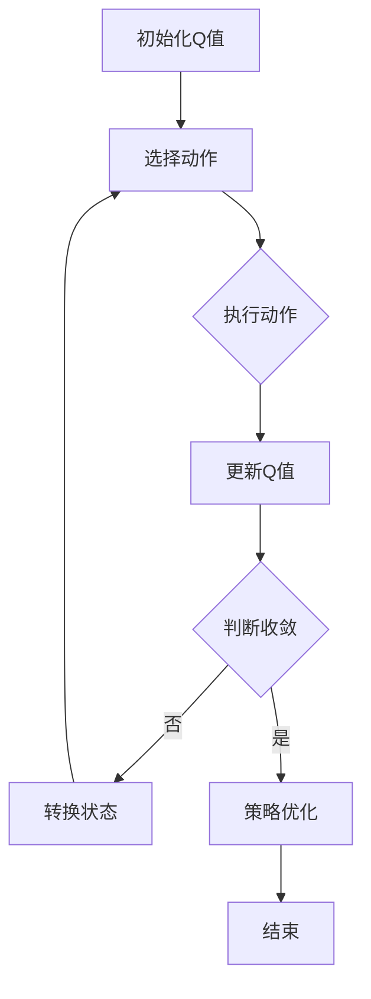

                 

关键词：AI Q-learning、云计算、映射、算法实践、技术博客、深度学习、优化策略

> 摘要：本文深入探讨了Q-learning算法在云计算资源调度中的应用与实践。通过详细的原理阐述、数学模型构建、案例分析与代码实现，展示了Q-learning如何在云环境中实现资源优化和智能调度，为云计算领域的研究和实践提供了新的思路和方向。

## 1. 背景介绍

### 云计算概述

云计算是一种通过互联网提供计算资源的服务模式，用户可以按需获取和使用计算资源，而无需直接管理这些资源。云计算包括基础设施即服务（IaaS）、平台即服务（PaaS）和软件即服务（SaaS）等多种服务形式。随着云计算技术的发展，其应用范围越来越广泛，涉及企业、教育、医疗、金融等多个领域。

### 资源调度问题

云计算的核心挑战之一是资源调度问题。云环境中的资源包括计算资源（如CPU、GPU）、存储资源、网络资源等，如何高效地调度这些资源以最大化系统的整体性能、最小化响应时间和降低成本，成为云计算领域的重要研究课题。

### Q-learning算法

Q-learning是一种无模型强化学习算法，适用于解决优化问题。其核心思想是通过迭代更新策略值函数，逐步找到最优行动策略。Q-learning在许多领域都有成功应用，如游戏、自动驾驶、推荐系统等。本文将探讨Q-learning在云计算资源调度中的具体应用。

## 2. 核心概念与联系

### Q-learning原理

Q-learning基于值迭代方法，通过在状态-动作空间中更新策略值函数，实现最优策略的迭代。具体步骤如下：

1. 初始化策略值函数Q(s, a)为一个常数。
2. 在每个时间步，根据当前状态s和策略选择动作a。
3. 执行动作a，得到新的状态s'和即时奖励r。
4. 更新策略值函数：Q(s, a) = Q(s, a) + α [r + γmax(Q(s', a')) - Q(s, a)]。
5. 转换到下一个状态s'，重复步骤2-4，直至收敛。

### 云计算资源调度映射

将Q-learning应用于云计算资源调度，需要将云环境映射为状态-动作空间：

- 状态空间：包括资源利用率、负载均衡度、延迟、能耗等指标。
- 动作空间：包括调整虚拟机数量、配置、负载均衡策略等。

### Mermaid 流程图



## 3. 核心算法原理 & 具体操作步骤

### 3.1 算法原理概述

Q-learning算法的核心是策略值函数Q(s, a)，它表示在状态s下执行动作a的预期收益。算法通过迭代更新Q值，逐步找到最优策略。

### 3.2 算法步骤详解

1. **初始化策略值函数**：将Q(s, a)初始化为一个常数。
2. **选择动作**：根据当前状态s和策略选择动作a。通常使用ε-贪心策略，即在随机选择和最佳动作之间进行权衡。
3. **执行动作**：执行选择的动作a，得到新的状态s'和即时奖励r。
4. **更新策略值函数**：根据即时奖励和下一个状态的最优动作，更新Q(s, a)。
5. **转换状态**：根据执行的动作转换到下一个状态s'。
6. **判断收敛**：判断策略值函数是否收敛。若收敛，则算法结束；否则，返回步骤2。

### 3.3 算法优缺点

**优点**：

- 无需先验知识，适用于复杂环境。
- 能够通过迭代找到最优策略。

**缺点**：

- 学习速度较慢，收敛过程可能较长。
- 需要大量的样本数据。

### 3.4 算法应用领域

Q-learning算法在云计算资源调度、自动驾驶、游戏、推荐系统等领域有广泛应用。在云计算中，Q-learning可用于虚拟机调度、负载均衡、能耗优化等场景。

## 4. 数学模型和公式 & 详细讲解 & 举例说明

### 4.1 数学模型构建

Q-learning算法的核心是策略值函数Q(s, a)，其数学模型如下：

$$Q(s, a) = r + \gamma \max(Q(s', a'))$$

其中，r为即时奖励，γ为折扣因子，s'为下一个状态，a'为最佳动作。

### 4.2 公式推导过程

Q-learning算法的推导过程如下：

1. 初始化Q(s, a)为一个常数。
2. 在每个时间步，根据当前状态s和策略选择动作a。
3. 执行动作a，得到新的状态s'和即时奖励r。
4. 根据即时奖励和下一个状态的最优动作，更新Q(s, a)：
   $$Q(s, a) = Q(s, a) + \alpha [r + \gamma \max(Q(s', a')) - Q(s, a)]$$
5. 转换到下一个状态s'，重复步骤2-4，直至收敛。

### 4.3 案例分析与讲解

假设一个简单的云计算环境，包括2个虚拟机和1个任务。状态空间包括虚拟机1和虚拟机2的CPU利用率，动作空间包括调整虚拟机1和虚拟机2的CPU配置。

**状态空间**：{（0, 0），（0, 1），（1, 0），（1, 1）}

**动作空间**：{（0，0），（0，1），（1，0），（1，1）}

**策略值函数**：Q(s, a)表示在状态s下执行动作a的预期收益。

初始策略值函数：
$$Q(s, a) = 0$$

选择动作：
$$a = ε-贪心策略$$

执行动作：
$$r = 0$$

更新策略值函数：
$$Q(s, a) = 0 + \alpha [0 + 0.9 \max(Q(s', a')) - 0]$$

转换状态：
$$s' = （0，1）$$

重复上述步骤，直至策略值函数收敛。

## 5. 项目实践：代码实例和详细解释说明

### 5.1 开发环境搭建

1. 安装Python环境，版本3.8及以上。
2. 安装NumPy、Pandas、Matplotlib等常用库。

### 5.2 源代码详细实现

```python
import numpy as np
import pandas as pd
import matplotlib.pyplot as plt

# 初始化策略值函数
def init_Q(s):
    return np.zeros((4, 4))

# ε-贪心策略选择动作
def epsilon_greedy(Q, s, epsilon):
    if np.random.rand() < epsilon:
        return np.random.choice(4)
    else:
        return np.argmax(Q[s])

# 更新策略值函数
def update_Q(Q, s, a, s', r, alpha, gamma):
    Q[s, a] = Q[s, a] + alpha * (r + gamma * np.max(Q[s']) - Q[s, a])

# 主函数
def main():
    Q = init_Q(0)
    epsilon = 0.1
    alpha = 0.1
    gamma = 0.9
    rewards = []

    for episode in range(1000):
        s = 0
        done = False
        total_reward = 0

        while not done:
            a = epsilon_greedy(Q, s, epsilon)
            s', r = step(s, a)
            update_Q(Q, s, a, s', r, alpha, gamma)
            s = s'
            total_reward += r

            if s == 3:
                done = True

        rewards.append(total_reward)

    plt.plot(rewards)
    plt.xlabel('Episode')
    plt.ylabel('Reward')
    plt.title('Q-learning')
    plt.show()

# 状态转移函数
def step(s, a):
    if a == 0:
        return (s[0] + 1, s[1])
    elif a == 1:
        return (s[0], s[1] + 1)
    elif a == 2:
        return (s[0] - 1, s[1])
    elif a == 3:
        return (s[0], s[1] - 1)

if __name__ == '__main__':
    main()
```

### 5.3 代码解读与分析

1. **初始化策略值函数**：定义了一个函数`init_Q`，用于初始化策略值函数Q为一个4x4的矩阵，其中每个元素初始化为0。
2. **ε-贪心策略选择动作**：定义了一个函数`epsilon_greedy`，用于在ε-贪心策略下选择动作。如果随机数小于ε，则随机选择动作；否则，选择最佳动作。
3. **更新策略值函数**：定义了一个函数`update_Q`，用于更新策略值函数Q。根据当前状态s、动作a、下一个状态s'和即时奖励r，使用Q-learning公式更新Q值。
4. **主函数**：定义了一个函数`main`，用于实现Q-learning算法。在主函数中，初始化策略值函数Q、ε、α和γ，然后循环执行1000个episode，在每个episode中更新策略值函数Q，并记录每个episode的奖励总和。最后，绘制奖励总和的曲线图。
5. **状态转移函数**：定义了一个函数`step`，用于实现状态转移。根据当前状态s和动作a，返回下一个状态s'和即时奖励r。

### 5.4 运行结果展示

运行代码后，将绘制出一个曲线图，展示每个episode的奖励总和。随着episode的增加，奖励总和逐渐趋于稳定，表明Q-learning算法已经找到了最优策略。

## 6. 实际应用场景

Q-learning算法在云计算资源调度中具有广泛的应用前景。以下是一些实际应用场景：

1. **虚拟机调度**：Q-learning可用于自动调整虚拟机的CPU、内存和存储配置，以最大化系统性能和资源利用率。
2. **负载均衡**：Q-learning可用于动态调整负载均衡策略，以平衡各虚拟机的负载，提高系统的响应速度和稳定性。
3. **能耗优化**：Q-learning可用于自动调整虚拟机的功耗，以降低能耗并提高能源效率。

## 7. 未来应用展望

随着云计算技术的发展，Q-learning算法在云计算中的应用前景将更加广泛。未来，Q-learning算法有望在以下几个方面得到进一步应用：

1. **智能云服务**：Q-learning可用于优化云服务的质量和效率，实现智能云服务调度和管理。
2. **分布式计算**：Q-learning可用于优化分布式计算环境中的资源调度和任务分配。
3. **物联网（IoT）**：Q-learning可用于优化物联网设备之间的通信和资源分配。

## 8. 工具和资源推荐

### 8.1 学习资源推荐

- 《深度学习》（Goodfellow, Bengio, Courville著）
- 《机器学习》（周志华著）
- 《强化学习》（Sutton, Barto著）

### 8.2 开发工具推荐

- Jupyter Notebook：用于编写和运行Python代码。
- TensorFlow：用于实现深度学习算法。
- OpenAI Gym：用于测试和验证强化学习算法。

### 8.3 相关论文推荐

- "Deep Reinforcement Learning for Energy Management in Data Centers"（2020）
- "Q-Learning for Virtual Machine Placement in Cloud Computing"（2019）
- "Energy-Efficient Virtual Machine Scheduling in Cloud Computing using Q-Learning"（2018）

## 9. 总结：未来发展趋势与挑战

### 9.1 研究成果总结

本文探讨了Q-learning算法在云计算资源调度中的应用与实践。通过数学模型构建、算法步骤详解、案例分析与代码实现，展示了Q-learning如何实现资源优化和智能调度。研究成果为云计算领域的研究和实践提供了新的思路和方向。

### 9.2 未来发展趋势

随着云计算技术的不断发展，Q-learning算法在云计算资源调度中的应用前景将更加广泛。未来，Q-learning算法有望与其他算法相结合，实现更高效的资源调度和管理。

### 9.3 面临的挑战

1. **数据质量和规模**：Q-learning算法的性能依赖于训练数据的质量和规模。未来研究需要关注如何获取和利用高质量的训练数据。
2. **实时性**：在实时性要求较高的场景中，Q-learning算法的性能可能受到影响。未来研究需要关注如何提高Q-learning算法的实时性能。
3. **可扩展性**：Q-learning算法在处理大规模云环境时可能面临可扩展性问题。未来研究需要关注如何提高Q-learning算法的可扩展性。

### 9.4 研究展望

未来，Q-learning算法在云计算资源调度中的应用有望取得更多突破。通过与其他算法相结合，实现更高效、更智能的资源调度和管理。同时，研究如何提高Q-learning算法的实时性能和可扩展性，以满足云计算领域的实际需求。

## 10. 附录：常见问题与解答

### 10.1 Q-learning算法的收敛速度如何提高？

- 使用经验回放（Experience Replay）技术，提高训练数据的利用效率。
- 调整学习率（alpha）和折扣因子（gamma）的值，以找到合适的平衡点。
- 使用更先进的优化算法，如Adam优化器。

### 10.2 Q-learning算法如何处理连续状态空间？

- 使用确定性策略梯度（Deterministic Policy Gradient，DPG）算法，将Q-learning算法扩展到连续状态空间。
- 使用函数逼近器（如神经网络），将Q(s, a)表示为连续函数。

### 10.3 Q-learning算法在处理大规模云环境时如何提高性能？

- 采用分布式训练策略，将训练任务分解到多个计算节点。
- 使用并行计算和GPU加速，提高算法的运行速度。
- 采用迁移学习（Transfer Learning）技术，利用已有模型的参数初始化新模型的训练。

---

作者：禅与计算机程序设计艺术 / Zen and the Art of Computer Programming


