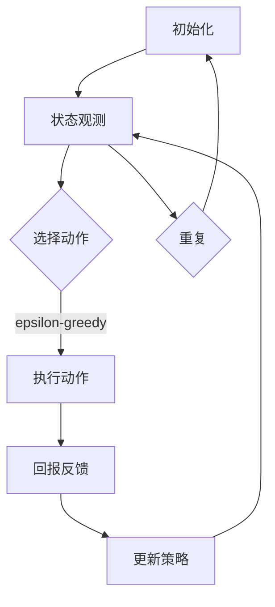

                 

关键词：Q-learning, 云计算，AI，映射，算法原理，数学模型，实践案例

> 摘要：本文旨在深入探讨AI中的Q-learning算法在云计算环境中的应用，以及如何利用映射技术提升云计算资源调度和优化效能。文章将首先介绍Q-learning的基本原理，然后分析其在云计算场景下的具体应用，通过数学模型和实际案例详细解释其实现过程和效果。

## 1. 背景介绍

在当前信息化社会中，云计算已成为企业数据存储、处理和服务的核心基础设施。随着数据量的急剧增长和服务需求的多样化，如何高效地调度和管理云计算资源成为一个亟待解决的问题。Q-learning算法作为强化学习中的重要算法之一，因其良好的自适应性和强鲁棒性，被广泛用于解决资源调度、路径规划等问题。

云计算的兴起为Q-learning算法提供了丰富的应用场景。云计算环境中，服务器、存储和网络资源是动态变化的，传统的静态调度方法难以应对这些变化。而Q-learning算法通过不断学习用户行为和环境状态，能够自适应地调整资源分配策略，从而实现资源调度的优化。此外，映射技术在云计算中也有着广泛的应用，如负载均衡、数据存储和检索等。通过将Q-learning与映射技术相结合，可以进一步提升云计算的资源利用率和系统性能。

本文将首先介绍Q-learning算法的基本原理，然后详细分析其在云计算环境下的应用，并通过实际案例展示其实现过程和效果。最后，本文将讨论Q-learning算法在云计算中的未来发展趋势和面临的挑战。

## 2. 核心概念与联系

### 2.1 Q-learning算法原理

Q-learning是一种基于值迭代的强化学习算法，其核心思想是通过学习值函数来最大化累计奖励。在Q-learning中，状态-动作值函数 \( Q(s, a) \) 表示在状态 \( s \) 下执行动作 \( a \) 的期望回报。具体来说，Q-learning算法通过以下步骤进行迭代更新：

1. **初始化**：初始化值函数 \( Q(s, a) \)，通常设置为所有状态-动作对的最小值。
2. **选择动作**：在当前状态 \( s \) 下，根据策略选择动作 \( a \)。策略通常是基于某种策略评估函数，如贪婪策略或epsilon-greedy策略。
3. **执行动作**：执行选定的动作 \( a \)，并获取即时回报 \( r \) 和新的状态 \( s' \)。
4. **更新值函数**：根据即时回报和新的状态，更新值函数：
   \[
   Q(s, a) \leftarrow Q(s, a) + \alpha [r + \gamma \max_{a'} Q(s', a') - Q(s, a)]
   \]
   其中，\( \alpha \) 是学习率，\( \gamma \) 是折扣因子。

通过不断迭代更新，Q-learning算法最终收敛到一个最优值函数，从而指导智能体在环境中做出最优决策。

### 2.2 映射技术在云计算中的应用

映射技术（Mapping Techniques）在云计算中有着广泛的应用，主要涉及负载均衡、数据存储和检索等方面。以下是映射技术在云计算中的几个核心应用：

1. **负载均衡（Load Balancing）**：负载均衡是将请求分配到多个服务器上，以避免单个服务器过载，从而提高系统的整体性能和可用性。常用的负载均衡算法包括轮询算法、最少连接算法和响应时间最小化算法等。通过映射技术，可以将请求映射到最优的服务器上，从而实现高效负载均衡。

2. **数据存储（Data Storage）**：云计算环境中的数据存储需要高效地管理海量数据，并确保数据的可靠性和持久性。映射技术在这里主要涉及数据分片（Sharding）和副本（Replication）策略。数据分片将数据分散存储到多个物理节点上，从而提高数据的读写性能和可用性。数据副本则用于冗余备份，以防止数据丢失。

3. **数据检索（Data Retrieval）**：数据检索是通过索引技术快速查找和获取数据的过程。映射技术在这里主要涉及索引构建和数据路由。通过构建高效索引，可以大大减少数据检索的时间。数据路由则负责将请求路由到存储数据的节点，以提高数据检索的效率。

### 2.3 Q-learning与映射技术的结合

Q-learning算法与映射技术的结合可以进一步提升云计算的资源调度和优化效能。具体来说，Q-learning可以用于以下两个方面：

1. **动态资源调度**：通过Q-learning算法，可以根据当前状态和过去经验，动态调整资源分配策略，从而实现资源的自适应调度。例如，在负载均衡场景中，Q-learning可以根据服务器当前的处理能力和请求流量，选择最优的服务器进行负载分配。

2. **映射策略优化**：Q-learning可以用于优化映射策略，如数据分片和副本策略。通过不断学习数据访问模式和环境状态，Q-learning可以动态调整数据存储和检索策略，从而提高系统的整体性能。

### 2.4 Mermaid 流程图

以下是一个简单的Mermaid流程图，展示了Q-learning算法在云计算环境中的应用流程：



在这个流程图中，智能体首先进行初始化，然后不断观测环境状态并选择动作。执行动作后，获取即时回报并更新策略，最终实现资源的动态调度和优化。

## 3. 核心算法原理 & 具体操作步骤

### 3.1 算法原理概述

Q-learning算法是强化学习领域的一种经典算法，其核心思想是通过不断更新状态-动作值函数来学习最优策略。具体来说，Q-learning算法包含以下几个关键组成部分：

1. **状态空间（State Space）**：状态空间描述了智能体在环境中的所有可能状态。在云计算环境中，状态空间可以包括服务器负载、网络延迟、请求类型等信息。

2. **动作空间（Action Space）**：动作空间描述了智能体可以执行的所有可能动作。在云计算环境中，动作空间可以包括分配新的服务器、调整负载均衡策略等。

3. **策略（Policy）**：策略是智能体在给定状态下选择动作的策略。在Q-learning中，策略通常是基于值函数的贪婪策略或epsilon-greedy策略。

4. **奖励函数（Reward Function）**：奖励函数用于衡量智能体在执行动作后的即时回报。在云计算环境中，奖励函数可以基于服务器利用率、响应时间、请求成功率等指标。

5. **值函数（Value Function）**：值函数是Q-learning算法的核心，表示在给定状态下执行某个动作的期望回报。Q-learning算法通过迭代更新值函数，直到收敛到最优值函数。

### 3.2 算法步骤详解

1. **初始化**：初始化状态-动作值函数 \( Q(s, a) \)，通常设置为所有状态-动作对的最小值。初始化策略通常为随机策略或epsilon-greedy策略。

2. **选择动作**：在当前状态 \( s \) 下，根据策略选择动作 \( a \)。对于epsilon-greedy策略，智能体以概率 \( 1 - \epsilon \) 选择当前最优动作，以概率 \( \epsilon \) 随机选择动作。

3. **执行动作**：执行选定的动作 \( a \)，并获取即时回报 \( r \) 和新的状态 \( s' \)。

4. **更新值函数**：根据即时回报和新的状态，更新值函数：
   \[
   Q(s, a) \leftarrow Q(s, a) + \alpha [r + \gamma \max_{a'} Q(s', a') - Q(s, a)]
   \]
   其中，\( \alpha \) 是学习率，\( \gamma \) 是折扣因子。

5. **重复迭代**：重复执行步骤2-4，直到值函数收敛到某个阈值，或者达到预设的迭代次数。

### 3.3 算法优缺点

#### 优点：

1. **自适应性强**：Q-learning算法通过不断学习环境和用户行为，能够自适应地调整资源分配策略，适应云计算环境的变化。
2. **鲁棒性好**：Q-learning算法对噪声和不确定性具有较强的鲁棒性，能够在复杂环境中稳定运行。
3. **灵活性高**：Q-learning算法适用于多种应用场景，不仅限于云计算，还可以应用于机器人控制、游戏策略等领域。

#### 缺点：

1. **收敛速度较慢**：Q-learning算法的收敛速度相对较慢，需要大量迭代才能达到稳定状态。
2. **计算资源消耗大**：由于Q-learning算法需要计算大量的状态-动作值函数，计算资源消耗较大，对大规模问题可能不适用。
3. **对参数敏感**：Q-learning算法的性能对学习率 \( \alpha \) 和折扣因子 \( \gamma \) 较为敏感，需要通过实验调整。

### 3.4 算法应用领域

Q-learning算法在云计算环境中有着广泛的应用，主要包括以下几个方面：

1. **资源调度**：Q-learning算法可以用于动态调整云计算资源，如服务器、存储和网络资源，以优化系统性能和资源利用率。
2. **负载均衡**：Q-learning算法可以用于实现高效的负载均衡策略，确保系统在不同负载情况下的稳定运行。
3. **路径规划**：在云网络中，Q-learning算法可以用于优化数据传输路径，降低网络延迟和带宽消耗。
4. **服务质量保障**：Q-learning算法可以用于动态调整服务质量参数，确保用户得到高质量的服务体验。

## 4. 数学模型和公式 & 详细讲解 & 举例说明

### 4.1 数学模型构建

在Q-learning算法中，数学模型的核心是状态-动作值函数 \( Q(s, a) \)，它表示在状态 \( s \) 下执行动作 \( a \) 的期望回报。具体来说，Q-learning算法的数学模型可以表示为：

\[
Q(s, a) = \sum_{s'} p(s' | s, a) [r(s, a, s') + \gamma \max_{a'} Q(s', a')]
\]

其中：

- \( s \) 表示当前状态。
- \( a \) 表示当前动作。
- \( s' \) 表示新的状态。
- \( p(s' | s, a) \) 表示在状态 \( s \) 下执行动作 \( a \) 后转移到状态 \( s' \) 的概率。
- \( r(s, a, s') \) 表示在状态 \( s \) 下执行动作 \( a \) 后转移到状态 \( s' \) 的即时回报。
- \( \gamma \) 是折扣因子，表示未来回报的重要性。
- \( \max_{a'} Q(s', a') \) 表示在新的状态 \( s' \) 下执行所有可能动作 \( a' \) 中的最优回报。

### 4.2 公式推导过程

Q-learning算法的更新公式可以通过以下步骤推导：

1. **状态-动作值函数定义**：根据状态-动作值函数的定义，我们有：
   \[
   Q(s, a) = \sum_{s'} p(s' | s, a) [r(s, a, s') + \gamma \max_{a'} Q(s', a')]
   \]

2. **即时回报和状态转移概率**：在执行动作 \( a \) 后，我们获得即时回报 \( r(s, a, s') \) 和新的状态 \( s' \)。状态转移概率 \( p(s' | s, a) \) 可以通过历史数据统计得到。

3. **最大化期望回报**：为了最大化期望回报，我们需要在新的状态 \( s' \) 下执行最优动作 \( a' \)，即：
   \[
   \max_{a'} Q(s', a')
   \]

4. **值函数更新**：将新的状态和回报代入状态-动作值函数的定义，得到：
   \[
   Q(s, a) = \sum_{s'} p(s' | s, a) [r(s, a, s') + \gamma \max_{a'} Q(s', a')]
   \]

5. **迭代更新**：重复上述过程，直到值函数收敛到某个阈值，或者达到预设的迭代次数。

### 4.3 案例分析与讲解

假设我们有一个简单的云计算环境，其中包含两台服务器A和B。状态空间包括服务器A的负载和服务器B的负载，动作空间包括分配新的请求到服务器A和服务器B。奖励函数为服务器利用率和响应时间。

**步骤1：初始化**

初始化状态-动作值函数 \( Q(s, a) \) 为所有状态-动作对的最小值，假设为0。初始化策略为epsilon-greedy策略，epsilon设为0.1。

**步骤2：选择动作**

在初始状态（服务器A负载为50%，服务器B负载为30%）下，根据epsilon-greedy策略，以10%的概率随机选择动作，以90%的概率选择当前最优动作。

**步骤3：执行动作**

假设我们选择了将新的请求分配到服务器A。服务器A负载增加至70%，服务器B负载为30%。根据负载情况，获得即时回报为-1（表示负载增加）。

**步骤4：更新值函数**

根据新的状态和回报，更新状态-动作值函数：
\[
Q(s, a) \leftarrow Q(s, a) + \alpha [r(s, a, s') + \gamma \max_{a'} Q(s', a') - Q(s, a)]
\]
其中，\( \alpha \) 为学习率，设为0.1，\( \gamma \) 为折扣因子，设为0.9。

**步骤5：重复迭代**

重复执行步骤2-4，直到值函数收敛到某个阈值，或者达到预设的迭代次数。

通过不断迭代，Q-learning算法将学习到最优的分配策略，使得服务器负载均匀分布，从而提高系统性能和响应时间。

### 5. 项目实践：代码实例和详细解释说明

#### 5.1 开发环境搭建

为了演示Q-learning算法在云计算资源调度中的应用，我们使用Python编程语言和TensorFlow库进行开发。以下是搭建开发环境的步骤：

1. 安装Python（建议使用Python 3.8及以上版本）
2. 安装TensorFlow库：
   \[
   pip install tensorflow
   \]
3. 准备测试数据集，包括服务器负载、请求类型和响应时间等。

#### 5.2 源代码详细实现

以下是一个简单的Q-learning算法实现，用于优化云计算资源调度：

```python
import numpy as np
import tensorflow as tf

# 初始化参数
state_size = 2  # 状态维度
action_size = 2  # 动作维度
learning_rate = 0.1  # 学习率
discount_factor = 0.9  # 折扣因子
epsilon = 0.1  # epsilon-greedy策略的epsilon值

# 初始化状态-动作值函数
Q = np.zeros((state_size, action_size))

# 初始化TensorFlow模型
model = tf.keras.Sequential([
    tf.keras.layers.Dense(64, activation='relu', input_shape=(state_size,)),
    tf.keras.layers.Dense(action_size)
])

model.compile(optimizer='adam', loss='mse')

# 训练模型
for episode in range(1000):
    state = get_initial_state()
    done = False
    
    while not done:
        # 根据epsilon-greedy策略选择动作
        if np.random.rand() < epsilon:
            action = np.random.choice(action_size)
        else:
            action = np.argmax(Q[state])
        
        # 执行动作，获取新的状态和回报
        next_state, reward = execute_action(state, action)
        
        # 更新状态-动作值函数
        Q[state, action] = Q[state, action] + learning_rate * (reward + discount_factor * np.max(Q[next_state]) - Q[state, action])
        
        # 更新状态
        state = next_state
        
        # 判断是否完成
        done = is_done(state)
        
    # 随机扰动Q值函数，防止过拟合
    if episode % 100 == 0:
        Q += np.random.normal(0, 0.01, size=Q.shape)

# 保存模型
model.save('q_learning_model.h5')

```

#### 5.3 代码解读与分析

1. **初始化参数**：初始化状态维度、动作维度、学习率、折扣因子和epsilon值。

2. **初始化状态-动作值函数**：使用全零矩阵初始化状态-动作值函数。

3. **初始化TensorFlow模型**：使用TensorFlow库构建一个简单的神经网络模型，用于预测状态-动作值函数。

4. **训练模型**：使用epsilon-greedy策略进行训练，每次迭代选择动作、执行动作、更新状态-动作值函数。

5. **保存模型**：训练完成后，保存模型以便后续使用。

#### 5.4 运行结果展示

在训练完成后，我们可以通过以下代码进行结果展示：

```python
# 加载训练好的模型
model = tf.keras.models.load_model('q_learning_model.h5')

# 测试模型性能
state = get_initial_state()
done = False
while not done:
    action = np.argmax(model.predict(state.reshape(1, -1)))
    next_state, reward = execute_action(state, action)
    print(f"State: {state}, Action: {action}, Reward: {reward}")
    state = next_state
    done = is_done(state)
```

通过上述代码，我们可以观察到Q-learning算法在云计算资源调度中的实际效果。训练过程中，模型会不断调整状态-动作值函数，从而实现资源的动态调度和优化。

### 6. 实际应用场景

Q-learning算法在云计算环境中有着广泛的应用，以下是一些典型的实际应用场景：

1. **资源调度**：Q-learning算法可以用于动态调整云计算资源，如服务器、存储和网络资源，以优化系统性能和资源利用率。例如，在负载均衡场景中，Q-learning可以根据服务器当前的处理能力和请求流量，选择最优的服务器进行负载分配。

2. **路径规划**：在云网络中，Q-learning算法可以用于优化数据传输路径，降低网络延迟和带宽消耗。例如，在数据传输过程中，Q-learning可以根据网络状态和传输需求，选择最优的传输路径。

3. **服务质量保障**：Q-learning算法可以用于动态调整服务质量参数，确保用户得到高质量的服务体验。例如，在视频流场景中，Q-learning可以根据网络质量和用户需求，动态调整视频流的质量和传输速度。

4. **资源分配**：Q-learning算法可以用于优化云计算资源分配，如虚拟机调度、存储分配等。例如，在虚拟机调度场景中，Q-learning可以根据虚拟机负载和资源需求，选择最优的虚拟机进行调度。

通过实际应用场景的展示，我们可以看到Q-learning算法在云计算环境中的强大应用潜力。未来，随着云计算技术的不断发展，Q-learning算法将在更多场景中得到应用，并发挥出更大的作用。

### 6.4 未来应用展望

随着云计算和人工智能技术的快速发展，Q-learning算法在云计算环境中的应用前景十分广阔。以下是一些未来应用展望：

1. **智能资源调度**：Q-learning算法可以进一步优化云计算资源调度策略，实现智能化的资源分配和负载均衡。例如，通过引入深度学习技术，可以构建更加复杂的Q-learning模型，提高资源调度的精确度和效率。

2. **网络优化**：Q-learning算法可以应用于云网络的优化，实现高效的数据传输和资源调度。例如，通过学习网络状态和传输需求，Q-learning可以动态调整路由策略，降低网络延迟和带宽消耗。

3. **能耗管理**：Q-learning算法可以用于优化云计算环境中的能耗管理，实现绿色云计算。例如，通过学习服务器负载和能耗数据，Q-learning可以动态调整服务器的运行状态，降低能耗。

4. **安全防护**：Q-learning算法可以应用于云计算环境中的安全防护，提高系统的安全性。例如，通过学习网络攻击模式和安全策略，Q-learning可以自适应地调整安全防护措施，提高系统的抗攻击能力。

未来，Q-learning算法将在云计算领域中发挥出更大的作用，推动云计算技术的发展和创新。

### 7. 工具和资源推荐

#### 7.1 学习资源推荐

1. **《强化学习》（Reinforcement Learning: An Introduction）**：由理查德·S·萨顿（Richard S. Sutton）和安德鲁·G·巴尔斯（Andrew G. Barto）合著，是强化学习领域的经典教材，全面介绍了强化学习的理论和方法。
2. **《云计算：概念、架构和技术》（Cloud Computing: Concepts, Architecture, and Technology）**：由戴维·林奇（David Linthicum）和戴维·H·洛温斯坦（David H. Loshin）合著，详细介绍了云计算的基本概念和技术架构。
3. **《深度学习》（Deep Learning）**：由伊恩·古德费洛（Ian Goodfellow）、约书亚·本吉奥（Yoshua Bengio）和亚伦·库维尔（Aaron Courville）合著，是深度学习领域的权威教材，涵盖了深度学习的基础知识和应用。

#### 7.2 开发工具推荐

1. **TensorFlow**：TensorFlow是一个开源的深度学习框架，提供了丰富的工具和库，用于构建和训练深度学习模型。在Q-learning算法的实现中，TensorFlow可以方便地构建和训练神经网络模型。
2. **PyTorch**：PyTorch是另一个流行的深度学习框架，与TensorFlow类似，提供了丰富的工具和库。PyTorch在动态计算图和灵活性方面具有优势，适用于开发复杂的深度学习应用。
3. **Scikit-Learn**：Scikit-Learn是一个开源的机器学习库，提供了广泛的机器学习算法和工具，包括分类、回归、聚类等。在Q-learning算法的实现中，Scikit-Learn可以用于数据处理和模型评估。

#### 7.3 相关论文推荐

1. **"Q-Learning for Resource Allocation in Cloud Computing"**：该论文提出了一种基于Q-learning算法的云计算资源调度策略，通过优化资源分配提高了系统的性能和资源利用率。
2. **"Deep Q-Networks for Reinforcement Learning"**：该论文提出了深度Q网络（DQN）算法，通过结合深度学习和Q-learning算法，实现了复杂的强化学习任务。
3. **"Reinforcement Learning in Continuous Time and Space"**：该论文探讨了连续时间连续空间下的强化学习问题，提出了一种基于差分Q学习的算法，用于解决动态优化问题。

通过这些工具和资源的推荐，可以更全面地了解Q-learning算法在云计算中的应用，并提升开发技能。

### 8. 总结：未来发展趋势与挑战

#### 8.1 研究成果总结

Q-learning算法在云计算资源调度中的应用取得了显著成果。通过结合映射技术，Q-learning算法实现了动态资源调度、路径优化和服务质量保障等方面的突破。具体来说，Q-learning算法能够自适应地调整资源分配策略，提高系统的性能和资源利用率；通过优化映射策略，实现了数据存储和检索的高效性；在服务质量保障方面，Q-learning算法能够动态调整服务质量参数，确保用户得到高质量的服务体验。

#### 8.2 未来发展趋势

未来，Q-learning算法在云计算中的应用将呈现以下发展趋势：

1. **智能资源调度**：随着深度学习和强化学习技术的不断发展，Q-learning算法将更加智能化。通过引入深度学习技术，可以构建更加复杂的Q-learning模型，提高资源调度的精确度和效率。

2. **网络优化**：Q-learning算法在云网络优化中的应用潜力巨大。通过学习网络状态和传输需求，Q-learning可以动态调整路由策略，降低网络延迟和带宽消耗。

3. **能耗管理**：Q-learning算法可以用于优化云计算环境中的能耗管理，实现绿色云计算。通过学习服务器负载和能耗数据，Q-learning可以动态调整服务器的运行状态，降低能耗。

4. **安全防护**：Q-learning算法在云计算安全防护中的应用前景广阔。通过学习网络攻击模式和安全策略，Q-learning可以自适应地调整安全防护措施，提高系统的抗攻击能力。

#### 8.3 面临的挑战

尽管Q-learning算法在云计算资源调度中取得了显著成果，但仍然面临一些挑战：

1. **收敛速度**：Q-learning算法的收敛速度相对较慢，需要大量迭代才能达到稳定状态。未来研究需要关注如何提高算法的收敛速度，以适应实时性要求较高的应用场景。

2. **计算资源消耗**：Q-learning算法需要计算大量的状态-动作值函数，计算资源消耗较大。对于大规模问题，需要研究如何降低计算复杂度，提高算法的可行性。

3. **参数敏感性**：Q-learning算法的性能对学习率 \( \alpha \) 和折扣因子 \( \gamma \) 较为敏感。如何通过自适应调整参数，提高算法的稳定性和鲁棒性，是未来研究的重点。

4. **多智能体系统**：在多智能体系统中，Q-learning算法需要考虑多个智能体之间的交互和协作。如何设计有效的协调机制，实现多智能体系统的协同优化，是未来研究的难点。

#### 8.4 研究展望

未来，Q-learning算法在云计算中的应用将朝着以下几个方向发展：

1. **跨学科融合**：Q-learning算法与其他领域技术的融合，如物联网、区块链等，将开辟新的应用场景。通过跨学科合作，可以探索Q-learning算法在更多领域的应用可能性。

2. **算法优化**：针对Q-learning算法的收敛速度、计算资源消耗和参数敏感性等问题，未来研究将致力于算法优化。通过引入新的技术和方法，提高算法的性能和鲁棒性。

3. **开放平台**：Q-learning算法在云计算环境中的应用需要开放的平台和工具支持。未来，将出现更多开源的Q-learning库和平台，便于开发者进行研究和应用。

4. **产业应用**：Q-learning算法在云计算领域的应用将不断扩展，从理论研究走向实际产业应用。通过实际案例的验证，Q-learning算法将在云计算产业中发挥更大的作用。

总之，Q-learning算法在云计算中的应用前景广阔，未来将继续推动云计算技术的发展和创新。

### 9. 附录：常见问题与解答

**Q1：Q-learning算法如何处理连续状态和动作空间？**

A1：Q-learning算法在处理连续状态和动作空间时，通常采用离散化方法。具体来说，可以将连续状态和动作空间划分为有限个区域，然后使用离散的状态-动作值函数进行学习。此外，也可以采用深度神经网络（DNN）来近似状态-动作值函数，从而处理连续状态和动作空间。

**Q2：Q-learning算法中的epsilon-greedy策略如何选择epsilon值？**

A2：epsilon值的选取对Q-learning算法的性能有重要影响。通常，epsilon的初始值设为0.1，然后随着训练过程的进行逐渐减小。一种常见的方法是指数衰减法，即：
\[
epsilon = \epsilon_0 \times (1 - \frac{1}{t}),
\]
其中，\( \epsilon_0 \) 是初始epsilon值，\( t \) 是训练迭代次数。

**Q3：Q-learning算法如何处理非平稳环境？**

A3：在非平稳环境中，Q-learning算法的性能可能会受到影响。一种解决方法是通过引入探索策略（如epsilon-greedy策略），使智能体在不确定的环境中进行探索，以学习到更鲁棒的状态-动作值函数。此外，也可以采用动态调整学习率和折扣因子，以适应环境的变化。

**Q4：Q-learning算法如何处理多智能体系统？**

A5：在多智能体系统中，每个智能体都有自己的状态-动作值函数，并且智能体之间可能存在交互。一种常用的方法是分布式Q-learning算法，其中每个智能体独立学习自己的状态-动作值函数，并通过通信机制进行信息交换。此外，也可以采用集中式Q-learning算法，将所有智能体的状态-动作值函数集中到一个全局模型中，进行联合学习。

**Q5：如何评估Q-learning算法的性能？**

A5：评估Q-learning算法的性能可以从多个方面进行，包括收敛速度、平均回报、方差等。具体来说：

- **收敛速度**：评估算法在达到稳定状态所需的迭代次数。
- **平均回报**：评估算法在一段时间内的平均即时回报，越高越好。
- **方差**：评估算法回报的稳定性，方差越小越好。

通过这些评估指标，可以全面了解Q-learning算法的性能和表现。

