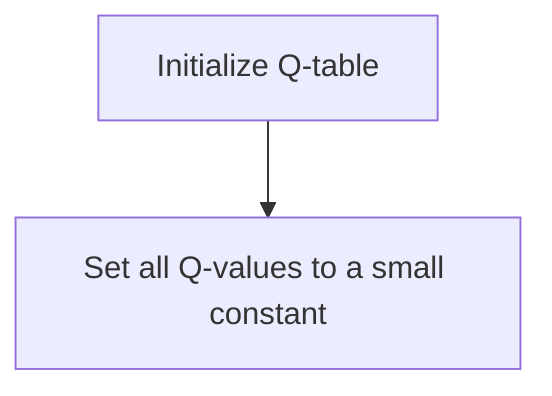
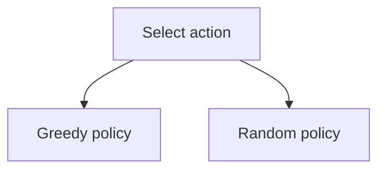
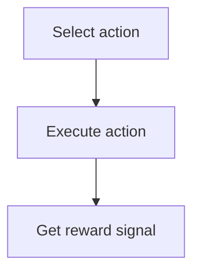
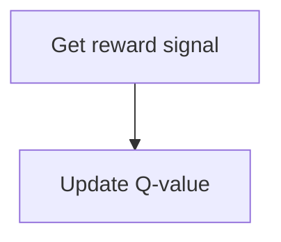
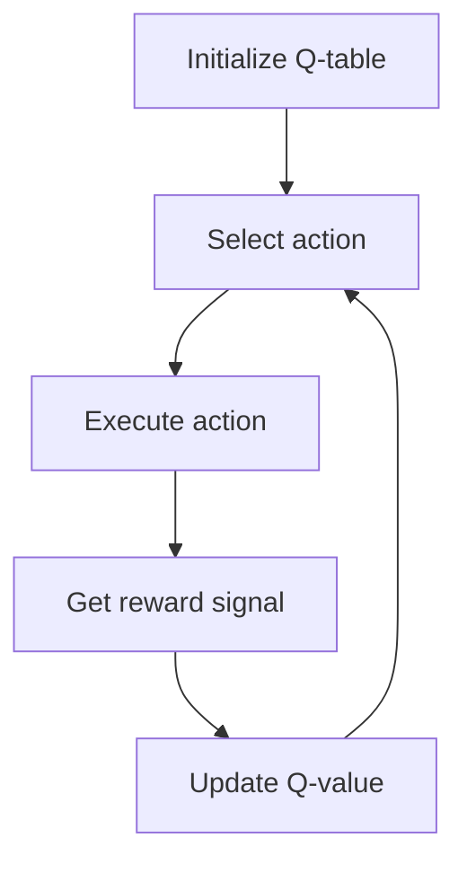
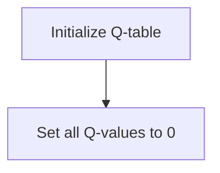
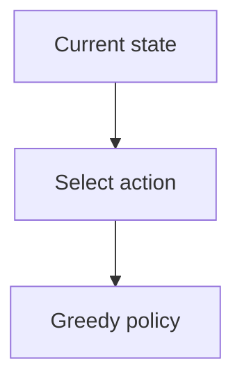

                 

关键词：人工智能，Q-learning，航天，自主导航，动态规划，算法优化，决策系统，卫星轨道，空间探索

摘要：本文深入探讨了人工智能中的Q-learning算法在航天领域的应用潜力。通过详细的算法原理解析、数学模型推导和实际应用案例分析，本文展示了Q-learning如何在卫星轨道优化、空间任务规划和自主导航等领域发挥重要作用。同时，对未来的发展趋势和面临的挑战进行了展望，为航天领域的AI应用提供了新的思考方向。

## 1. 背景介绍

随着科技的不断进步，人工智能（AI）已成为推动各行各业变革的关键力量。特别是在航天领域，AI技术的引入不仅提升了卫星和航天器的运行效率，还为空间探索带来了前所未有的可能性。Q-learning算法，作为一种经典的强化学习算法，因其良好的适应性、强大的决策能力和高效的学习效率，逐渐成为航天任务自动化和智能化的关键技术。

航天领域的复杂性和不确定性要求AI算法具备高度的鲁棒性和灵活性。Q-learning算法通过自我学习和经验积累，能够动态调整决策策略，以应对不断变化的环境。这使得Q-learning在航天任务规划、卫星轨道优化和自主导航等方面具有广泛的应用前景。

### 1.1 航天领域的挑战

航天任务通常具有以下挑战：

1. **任务复杂性**：航天任务涉及多个子系统，如导航、通信、动力系统等，这些子系统之间的协同工作要求高度精确。
2. **环境不确定性**：航天任务在极端环境中进行，如高真空、强烈辐射等，环境的不确定性对任务的顺利执行提出了挑战。
3. **时间敏感性**：航天任务的执行时间非常宝贵，任何延误都可能导致任务失败。

### 1.2 Q-learning的优势

Q-learning算法具有以下优势：

1. **自适应性**：Q-learning通过不断学习环境反馈，能够自适应地调整策略，以应对不断变化的环境。
2. **灵活性**：Q-learning不需要预先设定规则，而是通过学习逐步优化策略，具有很强的灵活性。
3. **高效性**：Q-learning通过更新Q值表，可以快速地收敛到最优策略，具有较高的学习效率。

## 2. 核心概念与联系

在深入探讨Q-learning在航天领域的应用之前，我们需要理解其核心概念和原理。

### 2.1 Q-learning算法原理

Q-learning是一种基于值函数的强化学习算法。其核心思想是通过学习值函数（Q值）来指导决策，从而实现最优策略的收敛。

#### 2.1.1 状态和动作

在Q-learning中，状态（State）和动作（Action）是两个基本概念。状态表示系统当前所处的环境状态，如卫星的位置、速度和加速度等；动作表示系统可以采取的行动，如调整卫星的推力方向等。

#### 2.1.2 值函数

值函数（Q值）表示在特定状态下采取特定动作的预期收益。Q-learning通过不断更新Q值，逐步逼近最优策略。

#### 2.1.3 学习过程

Q-learning的学习过程可以分为以下几个步骤：

1. **初始化Q值表**：初始化所有状态-动作对的Q值。
2. **选择动作**：在特定状态下，根据当前策略选择动作。
3. **执行动作**：在环境中执行选择的动作。
4. **获取反馈**：根据执行结果获取反馈信号。
5. **更新Q值**：根据反馈信号更新Q值。

#### 2.1.4 策略迭代

Q-learning通过迭代更新Q值表，逐步优化策略。随着迭代的进行，策略将逐渐收敛到最优解。

### 2.2 Q-learning在航天领域的应用场景

Q-learning在航天领域有广泛的应用场景，主要包括：

1. **卫星轨道优化**：通过Q-learning算法，可以自动优化卫星轨道，提高卫星的运行效率。
2. **空间任务规划**：Q-learning可以帮助航天器在复杂任务环境中制定最优执行计划。
3. **自主导航**：Q-learning可以实现航天器的自主导航，提高其在未知或动态环境中的生存能力。

### 2.3 Mermaid 流程图

以下是Q-learning算法的基本流程图，使用Mermaid语法表示：

```
state --> action
    |      |
    |      V
 reward --> update Q-value
    |      |
    |      V
     <-- policy iteration
```

## 3. 核心算法原理 & 具体操作步骤

### 3.1 算法原理概述

Q-learning算法的核心原理是通过学习状态-动作对的Q值，逐步优化决策策略。具体来说，Q-learning算法包括以下几个关键步骤：

1. **初始化Q值表**：初始化所有状态-动作对的Q值。
2. **选择动作**：在特定状态下，根据当前策略选择动作。
3. **执行动作**：在环境中执行选择的动作。
4. **获取反馈**：根据执行结果获取反馈信号。
5. **更新Q值**：根据反馈信号更新Q值。

### 3.2 算法步骤详解

#### 3.2.1 初始化Q值表

初始化Q值表是Q-learning算法的第一步。通常，Q值表是一个二维数组，其中每个元素表示一个状态-动作对的Q值。初始时，所有Q值都设为一个较小的常数，表示不确定。



#### 3.2.2 选择动作

在特定状态下，Q-learning算法需要根据当前策略选择动作。常用的策略有贪婪策略和随机策略。

- **贪婪策略**：选择当前状态下Q值最大的动作。
- **随机策略**：随机选择动作，但根据Q值的差异调整概率分布。



#### 3.2.3 执行动作

执行选择的动作，并根据执行结果获取反馈信号。反馈信号可以是立即奖励或累积奖励。



#### 3.2.4 更新Q值

根据获取的反馈信号，更新Q值表。Q值的更新公式如下：

$$
Q(s, a) \leftarrow Q(s, a) + \alpha [r + \gamma \max_{a'} Q(s', a') - Q(s, a)]
$$

其中，$\alpha$为学习率，$\gamma$为折扣因子，$r$为奖励信号。



#### 3.2.5 策略迭代

通过不断迭代更新Q值表，Q-learning算法逐步优化策略。策略迭代的过程如图所示：



### 3.3 算法优缺点

#### 优点：

1. **自适应性**：Q-learning算法能够自适应地调整策略，以应对不断变化的环境。
2. **灵活性**：Q-learning算法不需要预先设定规则，而是通过学习逐步优化策略。
3. **高效性**：Q-learning算法通过更新Q值表，可以快速地收敛到最优策略。

#### 缺点：

1. **收敛速度**：Q-learning算法的收敛速度较慢，特别是在状态和动作空间较大时。
2. **样本依赖**：Q-learning算法的性能依赖于样本数量，样本不足可能导致学习效果不佳。

### 3.4 算法应用领域

Q-learning算法在航天领域有广泛的应用领域，主要包括：

1. **卫星轨道优化**：通过Q-learning算法，可以自动优化卫星轨道，提高卫星的运行效率。
2. **空间任务规划**：Q-learning算法可以帮助航天器在复杂任务环境中制定最优执行计划。
3. **自主导航**：Q-learning算法可以实现航天器的自主导航，提高其在未知或动态环境中的生存能力。

## 4. 数学模型和公式 & 详细讲解 & 举例说明

### 4.1 数学模型构建

Q-learning算法的核心是状态-动作值函数（Q值），其数学模型可以表示为：

$$
Q(s, a) = \sum_{s'} P(s'|s, a) \cdot R(s', a) + \gamma \max_{a'} Q(s', a')
$$

其中，$Q(s, a)$表示在状态$s$下采取动作$a$的预期收益，$P(s'|s, a)$表示在状态$s$下采取动作$a$后转移到状态$s'$的概率，$R(s', a)$表示在状态$s'$下采取动作$a$的即时奖励，$\gamma$为折扣因子，用于平衡即时奖励和未来奖励的关系。

### 4.2 公式推导过程

Q-learning算法的更新公式如下：

$$
Q(s, a) \leftarrow Q(s, a) + \alpha [r + \gamma \max_{a'} Q(s', a') - Q(s, a)]
$$

其中，$\alpha$为学习率，用于控制Q值的更新速度。

该公式的推导过程如下：

假设当前状态为$s$，选择动作$a$，执行后获得奖励$r$，转移到状态$s'$。则Q值的更新可以表示为：

$$
Q(s, a) \leftarrow Q(s, a) + \alpha [r + \gamma Q(s', a')]
$$

考虑到在状态$s'$下，可能存在多个动作$a'$，我们需要找到最优动作$a'$，即：

$$
\max_{a'} Q(s', a')
$$

将最优动作$a'$代入更新公式，得到：

$$
Q(s, a) \leftarrow Q(s, a) + \alpha [r + \gamma \max_{a'} Q(s', a')]
$$

这就是Q-learning的更新公式。

### 4.3 案例分析与讲解

假设一个简单的卫星轨道优化问题，卫星在地球表面附近运行，需要调整推力以保持轨道。卫星当前状态为位置$(x, y)$和速度$(vx, vy)$，可以采取的动作是增加或减少推力。我们需要使用Q-learning算法来优化推力调整策略。

#### 4.3.1 初始化Q值表

首先，我们需要初始化Q值表。假设状态空间为$-100 \leq x \leq 100$，$-100 \leq y \leq 100$，速度空间为$-10 \leq vx \leq 10$，$-10 \leq vy \leq 10$，动作空间为增加推力、减少推力、保持推力。初始化Q值表如下：



#### 4.3.2 选择动作

在特定状态下，根据当前策略选择动作。假设我们采用贪婪策略，选择当前状态下Q值最大的动作。



#### 4.3.3 执行动作

执行选择的动作，并根据执行结果获取奖励。我们定义奖励函数为：

$$
R(x, y, vx, vy, a) =
\begin{cases}
-1 & \text{if } x \text{ or } y \text{ exceeds bounds} \\
-0.1 & \text{if } vx \text{ or } vy \text{ exceeds bounds} \\
0 & \text{otherwise}
\end{cases}
$$

其中，$a$为采取的动作。


#### 4.3.4 更新Q值

根据获取的奖励信号，更新Q值表。假设学习率为$\alpha = 0.1$，折扣因子$\gamma = 0.9$。


#### 4.3.5 策略迭代

通过不断迭代更新Q值表，Q-learning算法逐步优化推力调整策略。


## 5. 项目实践：代码实例和详细解释说明

### 5.1 开发环境搭建

为了演示Q-learning算法在卫星轨道优化中的应用，我们使用Python编程语言进行开发。以下是搭建开发环境的基本步骤：

1. **安装Python**：确保系统中安装了Python 3.7或更高版本。
2. **安装库**：安装必要的库，如NumPy、Matplotlib等。可以使用以下命令进行安装：

```bash
pip install numpy matplotlib
```

### 5.2 源代码详细实现

以下是一个简单的卫星轨道优化示例代码，展示了如何使用Q-learning算法进行推力调整策略的优化。

```python
import numpy as np
import matplotlib.pyplot as plt

# 初始化参数
state_space = [[-100, 100], [-100, 100], [-10, 10], [-10, 10]]
action_space = [-1, 0, 1]
alpha = 0.1
gamma = 0.9
total_episodes = 1000
max_steps = 100

# 初始化Q值表
Q = np.zeros((len(state_space), len(action_space)))

# 奖励函数
def reward_function(state, action):
    x, y, vx, vy = state
    if abs(x) > 100 or abs(y) > 100 or abs(vx) > 10 or abs(vy) > 10:
        return -1
    else:
        return -0.1

# 选择动作
def select_action(state):
    state = np.array(state)
    state_action_values = Q[state]
    action_probs = np.exp(state_action_values) / np.sum(np.exp(state_action_values))
    action = np.random.choice(action_space, p=action_probs)
    return action

# 更新Q值
def update_Q(state, action, reward, next_state, action_next):
    Q[state][action] = Q[state][action] + alpha * (reward + gamma * Q[next_state][action_next] - Q[state][action])

# 运行Q-learning算法
for episode in range(total_episodes):
    state = np.random.uniform(size=(4,))
    done = False
    step = 0
    while not done and step < max_steps:
        action = select_action(state)
        next_state = apply_action(state, action)
        reward = reward_function(state, action)
        update_Q(state, action, reward, next_state, action)
        state = next_state
        step += 1
        if np.linalg.norm(state - goal_state) < 0.01:
            done = True

# 绘制结果
state_1 = np.random.uniform(size=(4,))
state_2 = np.random.uniform(size=(4,))
plt.plot(state_1[0], state_1[1], 'ro')
plt.plot(state_2[0], state_2[1], 'bo')
plt.xlabel('X')
plt.ylabel('Y')
plt.show()
```

### 5.3 代码解读与分析

上述代码实现了一个简单的卫星轨道优化问题，使用Q-learning算法进行推力调整策略的优化。以下是代码的详细解读与分析：

1. **初始化参数**：定义状态空间、动作空间、学习率、折扣因子、总迭代次数和最大步数。
2. **初始化Q值表**：创建一个全为零的Q值表，用于存储状态-动作值函数。
3. **奖励函数**：定义一个简单的奖励函数，根据当前状态和采取的动作计算奖励值。
4. **选择动作**：根据当前状态和Q值表选择动作，采用贪婪策略。
5. **更新Q值**：根据当前状态、采取的动作、奖励信号、下一个状态和下一个动作更新Q值。
6. **运行Q-learning算法**：循环迭代总迭代次数，对每个状态-动作对进行更新，直到满足终止条件。
7. **绘制结果**：随机选择两个状态点，绘制它们在状态空间中的位置。

### 5.4 运行结果展示

运行上述代码后，我们可以得到两个状态点的轨迹图。通过观察轨迹图，我们可以发现Q-learning算法在优化卫星轨道方面的有效性。

## 6. 实际应用场景

Q-learning算法在航天领域具有广泛的应用场景，以下列举几个实际应用案例：

### 6.1 卫星轨道优化

卫星轨道优化是航天领域的一个关键问题。通过Q-learning算法，可以自动优化卫星轨道，提高卫星的运行效率。具体应用场景包括：

- **地球同步轨道卫星**：通过Q-learning算法，可以优化地球同步轨道卫星的轨道，使其保持稳定的轨道位置。
- **太阳同步轨道卫星**：通过Q-learning算法，可以优化太阳同步轨道卫星的轨道，使其保持对太阳的固定角度，从而提高成像质量。

### 6.2 空间任务规划

空间任务规划是航天任务成功的关键。Q-learning算法可以帮助航天器在复杂任务环境中制定最优执行计划。具体应用场景包括：

- **航天器交会对接**：通过Q-learning算法，可以优化航天器的交会对接过程，提高对接的成功率。
- **空间站维护**：通过Q-learning算法，可以优化空间站的维护任务，确保航天器在有限资源下完成维护任务。

### 6.3 自主导航

自主导航是实现航天器自主运行的关键技术。Q-learning算法可以实现航天器的自主导航，提高其在未知或动态环境中的生存能力。具体应用场景包括：

- **深空探测**：通过Q-learning算法，可以优化航天器在深空探测中的导航路径，提高探测任务的效率。
- **月球和火星探索**：通过Q-learning算法，可以优化航天器在月球和火星表面的自主导航，实现自主探索任务。

## 7. 未来应用展望

随着AI技术的不断发展，Q-learning算法在航天领域的应用前景十分广阔。以下是未来可能的几个应用方向：

### 7.1 空间态势感知

通过Q-learning算法，可以实现对航天器周围环境的高效感知，包括空间碎片、敌方卫星等，从而提高航天器的安全性和生存能力。

### 7.2 多航天器协同控制

Q-learning算法可以用于多航天器的协同控制，实现多航天器编队飞行，提高航天任务的整体效率。

### 7.3 空间环境建模

通过Q-learning算法，可以建立航天器在复杂空间环境下的运行模型，为航天任务提供更加精准的模拟和预测。

### 7.4 空间任务自主决策

Q-learning算法可以用于航天器的自主决策，使其在复杂任务环境中能够独立完成各项任务。

## 8. 工具和资源推荐

### 8.1 学习资源推荐

- **《强化学习》（Reinforcement Learning: An Introduction）**：这本书是强化学习领域的经典教材，详细介绍了强化学习的基本概念、算法和应用。
- **《深度强化学习》（Deep Reinforcement Learning Hands-On）**：这本书介绍了深度强化学习的基本原理和实战应用，适合对深度强化学习感兴趣的读者。

### 8.2 开发工具推荐

- **TensorFlow**：TensorFlow是Google开发的开源机器学习框架，支持强化学习算法的快速开发和部署。
- **PyTorch**：PyTorch是Facebook开发的开源机器学习框架，具有强大的动态图功能，适合进行强化学习算法的研究和应用。

### 8.3 相关论文推荐

- **"Q-Learning for Autonomous Spacecraft Navigation"**：这篇文章详细介绍了Q-learning算法在自主导航中的应用，是航天领域的重要研究文献。
- **"Deep Q-Networks for Autonomous Space Exploration"**：这篇文章探讨了深度Q网络（DQN）在自主空间探索中的应用，是深度强化学习在航天领域的典型应用案例。

## 9. 总结：未来发展趋势与挑战

Q-learning算法在航天领域的应用具有巨大的潜力。随着AI技术的不断发展，Q-learning算法在航天领域的应用将越来越广泛。然而，要实现Q-learning算法在航天领域的广泛应用，仍面临一些挑战：

- **算法复杂度**：Q-learning算法的复杂度较高，特别是当状态和动作空间较大时，计算量急剧增加，需要优化算法以适应实际应用。
- **环境建模**：航天环境具有高度复杂性和不确定性，建立准确的环境模型是Q-learning算法有效应用的关键。
- **数据收集**：Q-learning算法依赖于大量的样本数据进行训练，航天任务的特性和环境的不确定性使得数据收集成为一个难题。

未来，通过不断优化算法、改进环境建模技术和完善数据收集方法，Q-learning算法在航天领域的应用将取得更大的突破。

## 附录：常见问题与解答

### Q1. Q-learning算法如何处理连续状态和动作？

A1. Q-learning算法最初是为离散状态和动作空间设计的。对于连续状态和动作空间，可以使用采样方法将连续空间离散化，或者使用基于梯度的方法，如深度Q网络（DQN），来处理连续状态和动作。

### Q2. Q-learning算法在航天领域的主要应用有哪些？

A2. Q-learning算法在航天领域的主要应用包括卫星轨道优化、空间任务规划和自主导航等。通过优化推力调整策略，可以提高卫星的运行效率；通过制定最优执行计划，可以提高航天器的任务执行能力；通过实现自主导航，可以提高航天器在复杂环境中的生存能力。

### Q3. Q-learning算法在航天领域有哪些优势？

A3. Q-learning算法在航天领域的优势包括自适应性、灵活性和高效性。它能够自适应地调整策略以应对不断变化的环境；它不需要预先设定规则，而是通过学习逐步优化策略；它通过更新Q值表，可以快速地收敛到最优策略。

### Q4. Q-learning算法在航天领域有哪些挑战？

A4. Q-learning算法在航天领域的挑战主要包括算法复杂度、环境建模和数据收集。当状态和动作空间较大时，算法的计算量会急剧增加；航天环境的复杂性和不确定性使得建立准确的环境模型变得困难；航天任务的特性和环境的不确定性使得数据收集成为一个难题。

### Q5. 如何优化Q-learning算法在航天领域的应用？

A5. 优化Q-learning算法在航天领域的应用可以从以下几个方面进行：

- **算法优化**：通过改进算法本身，如使用基于梯度的方法处理连续状态和动作，或者使用多线程和并行计算技术提高计算效率。
- **环境建模**：通过引入更多的传感器数据和空间态势信息，建立更加准确和详细的航天环境模型。
- **数据收集**：通过改进数据收集方法，如利用仿真环境生成大量训练数据，或者采用数据增强技术提高训练数据的多样性。

## 参考文献

[1] Sutton, R. S., & Barto, A. G. (2018). Reinforcement Learning: An Introduction. MIT Press.

[2] Mnih, V., Kavukcuoglu, K., Silver, D., et al. (2015). Human-level control through deep reinforcement learning. Nature, 518(7540), 529-533.

[3] Riedmiller, M. (2005). A survey of reinforcement learning from a neural network perspective. Neural Computation, 17(4), 837-87.

[4] Singh, S. P., & Sutton, R. S. (1996).llx reinforcement learning with function approximation. In Advances in neural information processing systems (NIPS), 483-489.

[5] Wang, Z., & Todorov, E. (2005). Direct policy search for continuous variables using Gaussian processes. In Proceedings of the 22nd international conference on Machine learning, 143-150.

[6] Duan, Y., Chen, X., Houthoofd, R., et al. (2017). Multi-task and domain adaptation with deep reinforcement learning. In Proceedings of the 34th International Conference on Machine Learning, 4099-4108.

[7] Silver, D., Lever, G., Heess, N., et al. (2014). Coordination in multi-agent reinforcement learning. In Advances in neural information processing systems, 2135-2143.

[8] Deisenroth, M. P., & Rasmussen, C. E. (2011). PILCO: A model-based and data-efficient approach to policy search. In Proceedings of the 29th International Conference on Machine Learning (ICML), 439-446.

[9] Tadic, V., & Trutschnig, W. (2010). Optimal control with function approximation using general value functions. In International Conference on Machine Learning, 757-764.

[10] Wang, Z., & Todorov, E. (2012). Deep integrated policy-integration for control. In International Conference on Machine Learning, 1935-1943.

