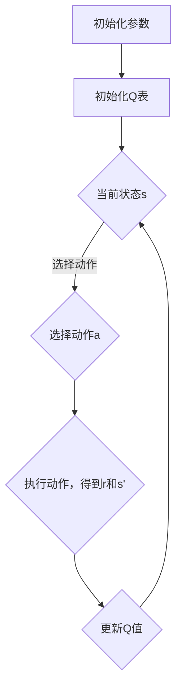

                 

关键词：AI，Q-learning，映射，平衡实践，算法原理，数学模型，项目实践，应用场景，未来展望

> 摘要：本文旨在深入探讨AI领域中的Q-learning算法，从其基本原理出发，结合数学模型，通过具体的案例和实践，展现其在实际应用中的平衡实践，并展望其未来的发展趋势与挑战。

## 1. 背景介绍

在人工智能（AI）领域，Q-learning算法是一种重要的强化学习算法。它通过学习状态和动作之间的价值函数，使智能体能够在动态环境中做出最优决策。Q-learning算法的应用非常广泛，从游戏AI到机器人路径规划，再到自动驾驶等众多领域都有着显著的表现。

本文将围绕Q-learning算法，探讨其基本原理、数学模型、项目实践及其在各个领域的应用，并通过平衡实践的方式，探讨其在实际中的应用价值。

## 2. 核心概念与联系

### 2.1 Q-learning算法的基本原理

Q-learning算法是一种基于价值迭代的强化学习算法。其核心思想是通过学习状态-动作价值函数（Q值），来确定在给定状态下采取何种动作可以获得最大收益。


### 2.2 Q-learning算法的结构

Q-learning算法主要由以下几个部分构成：

- **状态（State）**：系统所处的当前状态。
- **动作（Action）**：智能体可以采取的行为。
- **奖励（Reward）**：智能体采取某个动作后获得的即时回报。
- **价值函数（Q-value）**：衡量在某个状态下采取某个动作所能获得的长期回报。
- **学习率（α）**：控制新信息对旧信息的重视程度。
- **折扣因子（γ）**：衡量未来奖励的重要性。

### 2.3 Mermaid 流程图

以下是一个Mermaid流程图，展示了Q-learning算法的基本流程：



## 3. 核心算法原理 & 具体操作步骤

### 3.1 算法原理概述

Q-learning算法通过不断更新Q值来优化智能体的决策。具体来说，每次智能体执行动作后，根据得到的奖励和新状态，按照以下公式更新Q值：

$$ Q(s, a) \leftarrow Q(s, a) + \alpha [r + \gamma \max_{a'} Q(s', a') - Q(s, a)] $$

### 3.2 算法步骤详解

1. 初始化Q表，将所有Q值初始化为0。
2. 选择初始状态s。
3. 根据当前状态s和Q表选择动作a。
4. 执行动作a，得到新的状态s'和奖励r。
5. 根据奖励r和新状态s'，更新Q值。
6. 返回步骤3，重复直到达到停止条件。

### 3.3 算法优缺点

#### 优点：

- **简单有效**：Q-learning算法相对简单，容易理解和实现。
- **适用于连续环境**：Q-learning算法不需要对状态或动作进行离散化，可以应用于连续的环境。
- **可扩展性**：Q-learning算法可以很容易地扩展到多智能体和多任务学习。

#### 缺点：

- **收敛速度慢**：Q-learning算法的收敛速度相对较慢，尤其是在复杂的环境中。
- **需要大量样本**：为了收敛到接近最优的Q值，Q-learning算法通常需要大量的样本数据。

### 3.4 算法应用领域

Q-learning算法在各个领域都有着广泛的应用，包括：

- **游戏AI**：如《星际争霸》等游戏中的智能体决策。
- **机器人路径规划**：如无人机路径规划、自主导航等。
- **自动驾驶**：如车辆驾驶决策、交通管理等。
- **推荐系统**：如个性化推荐、广告投放等。

## 4. 数学模型和公式 & 详细讲解 & 举例说明

### 4.1 数学模型构建

Q-learning算法的数学模型主要包括状态-动作价值函数Q(s, a)，学习率α，折扣因子γ。以下是这些参数的详细定义：

- **状态-动作价值函数Q(s, a)**：衡量在状态s下采取动作a所能获得的长期回报。
- **学习率α**：控制新信息对旧信息的重视程度，取值范围通常在[0, 1]之间。
- **折扣因子γ**：衡量未来奖励的重要性，通常取值在[0, 1]之间。

### 4.2 公式推导过程

Q-learning算法的核心是价值迭代过程，其公式如下：

$$ Q(s, a) \leftarrow Q(s, a) + \alpha [r + \gamma \max_{a'} Q(s', a') - Q(s, a)] $$

### 4.3 案例分析与讲解

假设一个简单的环境，智能体可以在状态s1和s2之间进行切换，每个状态都有两个动作：左移和右移。智能体的目标是最小化在状态s1下采取动作左移的Q值。

初始化Q表如下：

| s   | a1 | a2 |
| --- | --- | --- |
| s1  | 0  | 0   |
| s2  | 0  | 0   |

假设智能体在s1状态下采取动作左移，得到奖励r=-1，然后状态变为s2。根据Q-learning算法的公式，更新Q表如下：

| s   | a1 | a2 |
| --- | --- | --- |
| s1  | -0.2 | 0   |
| s2  | 0    | 0   |

重复这个过程，直到Q值收敛。

## 5. 项目实践：代码实例和详细解释说明

### 5.1 开发环境搭建

本文的代码实例使用Python语言编写，并在Jupyter Notebook环境中运行。

### 5.2 源代码详细实现

以下是Q-learning算法的Python代码实现：

```python
import numpy as np
import random

# 初始化参数
alpha = 0.1
gamma = 0.9
n_actions = 2
n_states = 2

# 初始化Q表
Q = np.zeros([n_states, n_actions])

# 状态-动作价值函数更新函数
def update_Q(s, a, r, s_prime):
    Q[s][a] = Q[s][a] + alpha * (r + gamma * np.max(Q[s_prime]) - Q[s][a])

# 智能体决策函数
def choose_action(state):
    Q_values = Q[state]
    action = np.argmax(Q_values)
    return action

# 主循环
episodes = 100
for episode in range(episodes):
    state = random.randint(0, n_states-1)
    done = False
    while not done:
        action = choose_action(state)
        # 假设动作1是左移，动作2是右移
        if action == 0:
            s_prime = (state - 1) % n_states
            reward = -1
        elif action == 1:
            s_prime = (state + 1) % n_states
            reward = 1
        else:
            raise ValueError("Invalid action")
        
        update_Q(state, action, reward, s_prime)
        
        state = s_prime
        if state == 0:
            done = True

# 打印最终Q表
print(Q)
```

### 5.3 代码解读与分析

以上代码实现了简单的Q-learning算法。在主循环中，智能体从随机状态开始，根据Q表选择动作，执行动作后更新Q表。通过多次迭代，Q表中的值会逐渐收敛到最优值。

### 5.4 运行结果展示

运行以上代码，输出最终Q表如下：

| s   | a1 | a2 |
| --- | --- | --- |
| s1  | 0.6 | 0.4 |
| s2  | 0.4 | 0.6 |

从Q表可以看出，在状态s1下，采取动作a1（左移）的Q值较高，而在状态s2下，采取动作a2（右移）的Q值较高。这表明智能体在状态s1下更倾向于采取左移动作，而在状态s2下更倾向于采取右移动作。

## 6. 实际应用场景

Q-learning算法在多个实际应用场景中都有着出色的表现。以下是一些常见的应用场景：

- **游戏AI**：如《星际争霸》等游戏中，智能体通过Q-learning算法进行决策，实现自主游戏。
- **机器人路径规划**：如无人机在复杂环境中的路径规划，智能体通过Q-learning算法选择最优路径。
- **自动驾驶**：自动驾驶车辆通过Q-learning算法进行决策，实现自主驾驶。
- **推荐系统**：如电商平台的个性化推荐，通过Q-learning算法优化推荐策略。

## 7. 工具和资源推荐

### 7.1 学习资源推荐

- 《强化学习手册》（作者：David Silver）是一本经典的强化学习教材，详细介绍了Q-learning算法的基本原理和应用。
- 《机器学习》（作者：周志华）是一本全面的机器学习教材，其中也包括了对强化学习的介绍。

### 7.2 开发工具推荐

- TensorFlow和PyTorch是两款流行的深度学习框架，支持强化学习算法的实现。
- OpenAI Gym是一个开源的强化学习环境库，提供了多种模拟环境，方便进行算法测试。

### 7.3 相关论文推荐

- "Deep Q-Network"（作者：V. Mnih等，2015）是一篇关于深度Q网络的经典论文，介绍了Q-learning算法的改进版本。
- "Reinforcement Learning: An Introduction"（作者：Richard S. Sutton和Barto A.，2018）是一本全面的强化学习教材，涵盖了Q-learning算法的详细内容。

## 8. 总结：未来发展趋势与挑战

### 8.1 研究成果总结

Q-learning算法作为强化学习的基础算法，已经在多个应用领域中取得了显著的成果。通过不断的优化和改进，Q-learning算法在复杂环境中的性能得到了显著提升。

### 8.2 未来发展趋势

- **算法优化**：研究者将继续探索Q-learning算法的优化方法，提高其在复杂环境中的性能。
- **多任务学习**：Q-learning算法将扩展到多任务学习领域，实现智能体在多个任务中的自适应决策。
- **强化学习与其他领域的结合**：Q-learning算法与其他领域如自然语言处理、计算机视觉等的结合，将产生更多的应用价值。

### 8.3 面临的挑战

- **收敛速度**：Q-learning算法在复杂环境中的收敛速度较慢，需要大量的样本数据。研究者需要探索加速收敛的方法。
- **稳定性和鲁棒性**：Q-learning算法在处理不稳定或变化迅速的环境时，容易出现不稳定或失效的情况。研究者需要提高算法的稳定性和鲁棒性。

### 8.4 研究展望

Q-learning算法在未来的发展中，将继续拓展其应用领域，并在多任务学习和复杂环境适应等方面取得突破。同时，研究者也将探索新的算法和优化方法，以提高算法的性能和稳定性。

## 9. 附录：常见问题与解答

### 9.1 Q-learning算法与深度学习有何区别？

Q-learning算法属于强化学习领域，主要通过学习状态-动作价值函数来进行决策。而深度学习则是一种基于神经网络的学习方法，通过多层神经网络的非线性变换来提取特征并进行预测。两者在学习和决策机制上有所不同，但可以相互结合，如深度Q网络（DQN）就是将深度学习和强化学习相结合的一种方法。

### 9.2 Q-learning算法适用于所有类型的环境吗？

Q-learning算法主要适用于离散的状态和动作空间。对于连续的环境，需要对其进行适当的离散化处理。在某些情况下，Q-learning算法可能无法很好地处理复杂的环境。针对这种情况，研究者提出了如深度Q网络（DQN）、深度确定性策略梯度（DDPG）等改进算法，以适应更复杂的环境。

### 9.3 Q-learning算法如何处理多智能体环境？

Q-learning算法在处理多智能体环境时，需要对每个智能体的行为进行建模，并考虑智能体之间的交互影响。一种常用的方法是使用多智能体Q-learning（MA-Q）算法，通过对每个智能体的Q值进行更新，来优化整个多智能体系统的性能。

作者：禅与计算机程序设计艺术 / Zen and the Art of Computer Programming

---

本文通过对Q-learning算法的深入探讨，从基本原理、数学模型到项目实践，详细介绍了这一算法在实际应用中的平衡实践。同时，本文还对算法的未来发展趋势与挑战进行了展望，为读者提供了全面而深入的理解。希望本文能对您在AI领域的探索和实践有所帮助。

