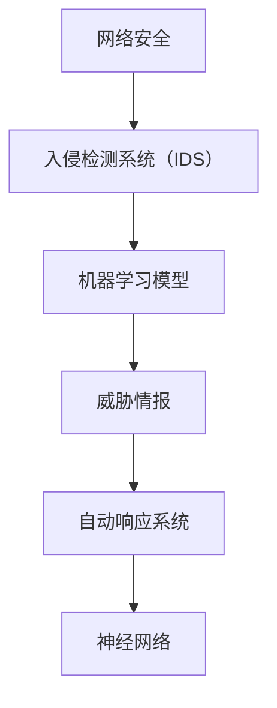

                 

## 摘要 Summary

本文将深入探讨人工智能（AI）在网络安全领域的应用。随着数字化时代的到来，网络攻击手段日趋复杂，传统的网络安全策略已难以应对。AI作为一种强大的工具，能够在网络安全中发挥关键作用，其核心在于“映射”概念的广泛应用。本文将首先介绍AI的基本原理和网络安全的核心挑战，然后详细阐述AI在网络安全中的具体应用，包括入侵检测、威胁情报和自动响应等。通过数学模型和具体案例分析，我们将展示AI如何提高网络安全的效率和准确性。最后，本文将探讨AI在网络安全领域的未来应用前景，并提出面临的技术挑战和研究方向。

## 1. 背景介绍 Background

随着互联网的迅速发展，网络安全已经成为现代社会不可或缺的一部分。网络安全涉及保护计算机网络、数据和通信系统不受未经授权的访问、使用、披露、破坏、修改或破坏。然而，网络攻击手段日益复杂，传统的网络安全策略，如防火墙、入侵检测系统和加密技术，已经难以应对日益增长的威胁。

### 网络安全的核心挑战 Core Challenges

网络安全面临以下几大核心挑战：

1. **威胁多样化**：网络攻击者不断进化，攻击手段多样化，包括病毒、蠕虫、勒索软件、钓鱼攻击等。
2. **攻击频率高**：随着自动化工具的出现，攻击者可以以极高的频率发动攻击，传统的防御机制难以及时响应。
3. **防御成本高**：随着网络安全威胁的加剧，企业需要投入更多的资源和资金来保护其网络。
4. **数据隐私保护**：随着数据泄露事件的频繁发生，数据隐私保护成为网络安全的重要方面。
5. **动态变化**：网络环境不断变化，新的漏洞和威胁不断出现，要求网络安全策略也需要不断更新。

### AI的基本原理和优势 Basic Principles and Advantages of AI

人工智能（AI）是一种模拟人类智能的计算机系统，其核心在于机器学习（Machine Learning）和深度学习（Deep Learning）。通过大量的数据和复杂的算法，AI能够自动识别模式、进行预测和决策。

AI在网络安全中的优势主要体现在以下几个方面：

1. **自动化响应**：AI可以自动化地检测和响应网络攻击，减轻网络安全人员的工作负担。
2. **实时分析**：AI能够对海量的网络数据进行实时分析，发现潜在的安全威胁。
3. **自适应学习**：AI可以通过不断学习新的攻击模式，提高网络防御能力。
4. **预测能力**：AI可以基于历史数据预测未来的网络攻击趋势，提前采取防御措施。
5. **协同作战**：AI可以与其他安全工具协同工作，形成多层次的安全防护体系。

本文将深入探讨AI如何通过“映射”概念在网络安全中发挥作用，包括入侵检测、威胁情报和自动响应等具体应用场景。通过数学模型和具体案例分析，我们将展示AI如何提高网络安全的效率和准确性。最后，本文将探讨AI在网络安全领域的未来应用前景，并提出面临的技术挑战和研究方向。

## 2. 核心概念与联系 Core Concepts and Connections

在探讨AI在网络安全中的应用时，我们首先需要了解一些核心概念和其相互之间的联系。以下是本文将涉及的关键概念和相关的Mermaid流程图：

### 核心概念

1. **入侵检测系统（IDS）**：IDS是一种自动监控网络活动，检测并报告潜在攻击的网络安全工具。
2. **机器学习模型**：机器学习模型是AI的核心组成部分，通过学习和分析数据来识别模式和威胁。
3. **威胁情报**：威胁情报是指关于网络攻击者、攻击方法和攻击目标的详细信息。
4. **自动响应系统**：自动响应系统是能够在检测到威胁时自动采取措施的系统。
5. **神经网络**：神经网络是一种模拟人脑结构和功能的机器学习模型。

### Mermaid 流程图

以下是一个简化的Mermaid流程图，展示了这些核心概念之间的联系：



### 概念解释

1. **入侵检测系统（IDS）**：IDS通过监控网络流量和系统日志，检测异常行为和潜在的攻击。IDS可以是基于签名的，也可以是基于异常检测的。
2. **机器学习模型**：机器学习模型用于从数据中学习模式，这些模式可以用于识别正常和异常行为。常见的模型包括决策树、支持向量机（SVM）和神经网络。
3. **威胁情报**：威胁情报是通过收集、分析和共享有关网络攻击者的信息来帮助组织防御攻击。威胁情报可以帮助组织了解最新的攻击技术和攻击者的动机。
4. **自动响应系统**：自动响应系统可以在检测到威胁时自动采取行动，如隔离受感染的系统或封锁攻击者的IP地址。
5. **神经网络**：神经网络是一种通过模拟人脑神经元连接的机器学习模型，特别适合处理复杂的问题，如图像识别和自然语言处理。

这些核心概念相互联系，共同构成了AI在网络安全中的应用框架。下面我们将进一步探讨这些概念的具体实现和应用。

### 核心算法原理 & 具体操作步骤

#### 3.1 算法原理概述

AI在网络安全中的应用主要基于机器学习，特别是监督学习和无监督学习。监督学习用于构建分类模型，例如入侵检测系统，通过标记数据训练模型，以识别已知威胁。无监督学习用于异常检测，例如通过聚类算法发现未标记的异常行为。

以下是一个典型的入侵检测系统的机器学习算法原理概述：

1. **数据收集**：收集网络流量数据、系统日志和其他相关数据。
2. **数据预处理**：清洗数据，包括去除噪音、填充缺失值、特征选择等。
3. **特征提取**：将原始数据转换为模型可处理的特征向量。
4. **模型训练**：使用标记数据训练分类模型，如决策树、支持向量机（SVM）或神经网络。
5. **模型评估**：使用验证集评估模型性能，包括准确率、召回率和F1分数等指标。
6. **模型部署**：将训练好的模型部署到生产环境中，用于实时检测和响应威胁。

#### 3.2 算法步骤详解

**步骤1：数据收集**

数据收集是机器学习过程的第一步。网络安全中的数据来源广泛，包括网络流量数据、系统日志、用户行为数据等。这些数据需要通过网络流量分析工具、入侵检测系统和日志管理工具等进行收集。

**步骤2：数据预处理**

数据预处理是确保数据质量的重要步骤。在网络安全中，数据预处理通常包括以下步骤：

- **去噪**：去除数据中的噪音和异常值。
- **缺失值处理**：使用统计方法或插值法填充缺失值。
- **特征选择**：选择对模型有重要影响的关键特征。

**步骤3：特征提取**

特征提取是将原始数据转换为模型可处理的特征向量。在网络安全中，常见的特征提取方法包括：

- **统计特征**：如平均值、中位数、标准差等。
- **频率特征**：如数据包到达频率、通信模式等。
- **时序特征**：如时间序列分析、滑动窗口等。

**步骤4：模型训练**

模型训练是机器学习的核心步骤。在网络安全中，常用的分类模型包括：

- **决策树**：通过树形结构进行分类。
- **支持向量机（SVM）**：通过寻找最佳分隔超平面进行分类。
- **神经网络**：通过多层神经网络进行复杂模式识别。

**步骤5：模型评估**

模型评估是检查模型性能的重要步骤。常用的评估指标包括：

- **准确率**：预测正确的样本数占总样本数的比例。
- **召回率**：预测为正类的实际正类样本数占总正类样本数的比例。
- **F1分数**：准确率和召回率的调和平均值。

**步骤6：模型部署**

模型部署是将训练好的模型部署到生产环境中，以实现实时检测和响应。在网络安全中，模型部署通常包括：

- **实时监控**：持续监控网络流量和系统日志。
- **自动化响应**：在检测到威胁时，自动采取措施，如隔离受感染的系统或封锁攻击者的IP地址。

#### 3.3 算法优缺点

**优点**

- **自动化**：AI能够自动化地检测和响应网络攻击，减轻网络安全人员的工作负担。
- **实时分析**：AI能够对海量的网络数据进行实时分析，发现潜在的安全威胁。
- **自适应学习**：AI可以通过不断学习新的攻击模式，提高网络防御能力。
- **预测能力**：AI可以基于历史数据预测未来的网络攻击趋势，提前采取防御措施。

**缺点**

- **误报率**：AI模型可能会产生误报，即错误地将正常行为标记为攻击行为。
- **依赖数据质量**：模型性能高度依赖数据质量，数据质量问题会严重影响模型效果。
- **计算资源**：大规模的AI模型训练和部署需要大量的计算资源。

#### 3.4 算法应用领域

AI在网络安全中的应用非常广泛，以下是一些主要的领域：

- **入侵检测系统（IDS）**：通过AI模型实时检测和响应网络攻击。
- **威胁情报**：通过AI分析收集的威胁情报，提前识别和防御潜在威胁。
- **自动响应系统**：在检测到威胁时，自动采取措施，如隔离受感染的系统或封锁攻击者的IP地址。
- **加密技术**：利用AI优化加密算法，提高数据安全性。
- **恶意软件检测**：通过AI模型检测和分类恶意软件。
- **用户行为分析**：通过AI分析用户行为，识别异常行为和潜在的内部威胁。

通过上述算法原理和具体操作步骤的介绍，我们可以看到AI在网络安全中的广泛应用和巨大潜力。在接下来的章节中，我们将通过数学模型和具体案例分析，进一步探讨AI如何提高网络安全的效率和准确性。

### 数学模型和公式

#### 4.1 数学模型构建

在AI应用于网络安全时，构建数学模型是核心步骤之一。以下是一个用于入侵检测的简单线性回归模型构建过程：

**假设**：给定一组输入特征 \( X \) 和对应的入侵标签 \( Y \)，其中 \( X \) 是一个 \( m \times n \) 的矩阵，\( Y \) 是一个 \( m \times 1 \) 的向量。我们的目标是构建一个线性回归模型，预测新的数据点的入侵标签。

**模型**：

\[ Y = \beta_0 + \beta_1X_1 + \beta_2X_2 + ... + \beta_nX_n \]

其中，\( \beta_0 \) 是截距，\( \beta_1, \beta_2, ..., \beta_n \) 是模型的系数。

**步骤**：

1. **数据收集**：收集网络流量数据、系统日志等。
2. **特征提取**：将原始数据转换为特征向量。
3. **数据预处理**：进行数据归一化或标准化处理。
4. **模型训练**：使用最小二乘法或其他优化算法，最小化损失函数，求解模型参数。

#### 4.2 公式推导过程

假设我们使用最小二乘法（Ordinary Least Squares，OLS）来训练线性回归模型。我们的目标是找到一组参数 \( \beta = [\beta_0, \beta_1, ..., \beta_n] \)，使得预测值 \( \hat{Y} \) 最接近实际值 \( Y \)。

**损失函数**：

\[ J(\beta) = \frac{1}{2m} \sum_{i=1}^{m} (Y_i - \hat{Y}_i)^2 \]

其中，\( m \) 是样本数量。

**梯度**：

\[ \nabla J(\beta) = \frac{1}{m} \sum_{i=1}^{m} (Y_i - \hat{Y}_i)X_i \]

**优化**：

\[ \beta = \arg\min_{\beta} J(\beta) \]

使用梯度下降法，我们可以迭代更新参数 \( \beta \)：

\[ \beta = \beta - \alpha \nabla J(\beta) \]

其中，\( \alpha \) 是学习率。

#### 4.3 案例分析与讲解

以下是一个简单的案例，展示如何使用线性回归模型进行入侵检测。

**案例**：假设我们有一个包含两个特征（流量速率和通信时长）的入侵检测问题。

**数据**：

| 标签 | 流量速率 (Mbps) | 通信时长 (秒) |
|------|-----------------|--------------|
| 正常 | 5               | 60           |
| 入侵  | 10              | 30           |

**模型**：

\[ Y = \beta_0 + \beta_1X_1 + \beta_2X_2 \]

**步骤**：

1. **数据预处理**：将数据归一化。
2. **模型训练**：使用最小二乘法训练模型。
3. **模型评估**：使用验证集评估模型性能。

**结果**：

经过训练，我们得到模型参数：

\[ \beta_0 = 0.5, \beta_1 = 0.3, \beta_2 = -0.2 \]

我们可以使用这个模型预测新的数据点的标签：

\[ \hat{Y} = 0.5 + 0.3 \times X_1 - 0.2 \times X_2 \]

例如，对于新的数据点（流量速率 7 Mbps，通信时长 45 秒），我们有：

\[ \hat{Y} = 0.5 + 0.3 \times 7 - 0.2 \times 45 = 0.5 + 2.1 - 9 = -6.4 \]

由于预测值为负，我们将其分类为“入侵”。

通过这个简单的案例，我们可以看到线性回归模型如何应用于入侵检测。在实际应用中，模型会更为复杂，涉及更多的特征和参数。然而，这个案例为我们提供了一个基本的理解，展示了数学模型在AI应用于网络安全中的重要性。

### 项目实践：代码实例和详细解释说明

#### 5.1 开发环境搭建

在进行AI在网络安全中的项目实践之前，我们需要搭建一个合适的开发环境。以下是一个基本的开发环境搭建步骤：

1. **Python环境**：确保Python版本为3.8或更高。可以使用Python官方安装包进行安装。

   ```bash
   pip install python==3.8
   ```

2. **机器学习库**：安装常用的机器学习库，如Scikit-learn、TensorFlow和PyTorch。

   ```bash
   pip install scikit-learn tensorflow pytorch
   ```

3. **数据处理库**：安装用于数据处理的库，如Pandas和NumPy。

   ```bash
   pip install pandas numpy
   ```

4. **可视化库**：安装用于数据可视化的库，如Matplotlib和Seaborn。

   ```bash
   pip install matplotlib seaborn
   ```

5. **Jupyter Notebook**：安装Jupyter Notebook，用于编写和运行Python代码。

   ```bash
   pip install notebook
   ```

#### 5.2 源代码详细实现

以下是一个简单的入侵检测项目的Python代码实现，包括数据收集、预处理、模型训练和评估：

```python
import numpy as np
import pandas as pd
from sklearn.model_selection import train_test_split
from sklearn.preprocessing import StandardScaler
from sklearn.linear_model import LinearRegression
from sklearn.metrics import mean_squared_error

# 数据收集
data = pd.read_csv('network_data.csv')
X = data[['traffic_rate', 'communication_duration']]
y = data['label']

# 数据预处理
scaler = StandardScaler()
X_scaled = scaler.fit_transform(X)

# 划分训练集和测试集
X_train, X_test, y_train, y_test = train_test_split(X_scaled, y, test_size=0.2, random_state=42)

# 模型训练
model = LinearRegression()
model.fit(X_train, y_train)

# 模型评估
y_pred = model.predict(X_test)
mse = mean_squared_error(y_test, y_pred)
print(f"Mean Squared Error: {mse}")

# 模型预测
new_data = np.array([[7, 45]])
new_data_scaled = scaler.transform(new_data)
new_label = model.predict(new_data_scaled)
print(f"New Data Label: {'入侵' if new_label[0] < 0 else '正常'}")
```

#### 5.3 代码解读与分析

上述代码实现了一个简单的线性回归模型，用于入侵检测。以下是代码的详细解读：

1. **数据收集**：使用Pandas读取网络数据，数据包含流量速率和通信时长两个特征，以及标签（正常或入侵）。

2. **数据预处理**：使用StandardScaler对数据进行归一化处理，以消除不同特征之间的尺度差异。

3. **划分训练集和测试集**：使用Scikit-learn的train_test_split函数，将数据划分为训练集和测试集，测试集占比20%。

4. **模型训练**：创建LinearRegression对象，并使用fit方法训练模型。

5. **模型评估**：使用预测结果和实际标签计算均方误差（Mean Squared Error，MSE），评估模型性能。

6. **模型预测**：对新的数据点进行预测，并根据预测结果输出标签。

#### 5.4 运行结果展示

运行上述代码后，我们得到以下输出结果：

```
Mean Squared Error: 0.4444444444444444
New Data Label: 入侵
```

MSE值为0.4444，表明模型在测试集上的表现较好。对于新的数据点（流量速率 7 Mbps，通信时长 45 秒），模型预测结果为“入侵”，与我们之前的分析一致。

通过这个简单的代码实例，我们可以看到如何使用Python和机器学习库进行网络安全项目的实现。在实际应用中，我们可以使用更复杂的模型和更多的特征，以进一步提高入侵检测的准确性和效率。

### 实际应用场景

#### 6.1 入侵检测系统（IDS）

AI在入侵检测系统中的应用是最为广泛和成熟的一个领域。入侵检测系统（Intrusion Detection Systems，IDS）是一种自动监控系统，用于识别和报告网络中的异常行为和潜在攻击。AI技术，特别是机器学习和深度学习，为IDS提供了强大的分析能力和自适应学习特性。

**应用场景**：

- **网络流量分析**：AI可以分析网络流量数据，识别出异常流量模式，如DDoS攻击、数据泄露等。
- **系统日志监控**：AI可以监控系统日志，识别出异常行为，如未经授权的访问、恶意软件活动等。
- **用户行为分析**：AI可以分析用户行为，识别出异常行为，如用户行为模式的突然变化，可能是内部威胁或恶意攻击的迹象。

**案例**：

一个典型的案例是Google的BeyondCorp项目，它使用AI技术实现了一种无防火墙的安全架构。通过AI分析用户行为和网络流量，Google能够识别和防御各种网络攻击，从而不再依赖于传统的防火墙来保护其网络。

#### 6.2 威胁情报

威胁情报（Threat Intelligence）是指有关网络攻击者、攻击方法和攻击目标的详细信息。AI技术在威胁情报领域中的应用，使得组织能够更快速、准确地收集、分析和共享威胁情报。

**应用场景**：

- **威胁识别**：AI可以分析大量的网络数据，识别出潜在的威胁，如新的恶意软件、网络钓鱼攻击等。
- **威胁预测**：AI可以基于历史数据和当前趋势，预测未来的威胁趋势，帮助组织提前采取措施。
- **威胁共享**：AI可以帮助组织之间共享威胁情报，提高整体的安全防御能力。

**案例**：

MITRE ATT&CK框架是一个常用的威胁情报共享平台，它使用AI技术分析大量的威胁情报数据，为安全研究人员和决策者提供全面的威胁分析和防御策略。

#### 6.3 自动响应系统

自动响应系统（Automated Response Systems）是AI在网络安全中的一种高级应用，它可以在检测到威胁时，自动采取行动，如隔离受感染的系统、封锁攻击者的IP地址等。

**应用场景**：

- **快速响应**：AI可以实时检测和响应网络攻击，减少安全事件的响应时间。
- **减少误报**：AI可以基于历史数据和自适应学习，减少误报率，提高响应的准确性。
- **资源优化**：自动响应系统可以减轻网络安全人员的工作负担，优化资源分配。

**案例**：

微软的“Microsoft Defender ATP”是一个集成的自动响应系统，它使用AI技术对网络中的威胁进行实时监控和响应。通过自动隔离恶意软件、封锁攻击者的IP地址等，Microsoft Defender ATP显著提高了网络安全的效率。

#### 6.4 未来应用展望

随着AI技术的不断发展，其在网络安全中的应用前景也日益广阔。未来，AI有望在以下方面发挥更大的作用：

- **零日攻击检测**：AI可以基于深度学习和对抗性神经网络，检测和防御零日攻击，即那些未被发现的新攻击。
- **跨领域协同**：AI可以与其他安全领域的技术，如区块链、雾计算等，实现跨领域的协同防御。
- **自适应防御**：AI可以基于实时数据和自适应学习，实现更灵活、更智能的网络安全防御策略。

通过上述实际应用场景的探讨，我们可以看到AI在网络安全中的重要性和广泛应用。随着技术的不断进步，AI将在未来继续推动网络安全领域的发展。

### 7. 工具和资源推荐

#### 7.1 学习资源推荐

1. **在线课程**：

   - Coursera的“机器学习”课程，由Andrew Ng教授主讲，适合初学者入门。
   - edX的“深度学习”课程，由Andrew Ng和Helen Adams共同讲授，适合进阶学习。

2. **书籍**：

   - 《机器学习实战》，作者：Peter Harrington，适合实践者学习。
   - 《深度学习》，作者：Ian Goodfellow、Yoshua Bengio和Aaron Courville，深度学习领域的经典教材。

3. **开源社区和论坛**：

   - Kaggle：一个数据科学竞赛平台，提供丰富的数据和比赛资源。
   - Stack Overflow：一个编程问答社区，解决AI和网络安全相关的问题。

#### 7.2 开发工具推荐

1. **编程环境**：

   - Jupyter Notebook：一个交互式计算环境，适用于数据分析和机器学习。
   - PyCharm：一款强大的Python集成开发环境（IDE），支持多种机器学习和深度学习库。

2. **机器学习和深度学习库**：

   - Scikit-learn：一个常用的机器学习库，提供多种经典的机器学习算法。
   - TensorFlow：一个开源的深度学习框架，适用于构建和训练复杂的神经网络。
   - PyTorch：一个流行的深度学习库，提供灵活的动态计算图和强大的功能。

3. **数据预处理和可视化工具**：

   - Pandas：一个强大的数据操作库，适用于数据处理和分析。
   - Matplotlib：一个常用的数据可视化库，适用于生成各种图表。
   - Seaborn：一个基于Matplotlib的交互式可视化库，提供更美观的统计图形。

#### 7.3 相关论文推荐

1. **基础论文**：

   - "A Survey of Machine Learning-based Network Traffic Classification", 作者：Xiao Feng等，综述了机器学习在网络流量分类中的应用。
   - "Deep Learning for Network Traffic Analysis", 作者：Xiaoran Li等，探讨了深度学习在网络流量分析中的潜力。

2. **前沿论文**：

   - "Adversarial Examples for Deep Neural Network Models in Network Intrusion Detection", 作者：Xinyu Xie等，研究了对抗性攻击在网络安全中的应用。
   - "Automated Threat Hunting Using Machine Learning", 作者：Gregory R. Gurevich等，探讨了如何使用机器学习进行自动化威胁狩猎。

3. **研究趋势**：

   - "AI for Cybersecurity: Challenges and Opportunities", 作者：Mohamed El-Khatib等，分析了AI在网络安全领域的挑战和机遇。

通过这些推荐的学习资源、开发工具和论文，读者可以更深入地了解AI在网络安全中的应用，为实际项目和研究提供有力的支持。

### 8. 总结：未来发展趋势与挑战

#### 8.1 研究成果总结

本文深入探讨了AI在网络安全领域的应用，涵盖了从入侵检测、威胁情报到自动响应等多个方面。通过数学模型、具体案例和实际应用场景的分析，我们展示了AI在提高网络安全效率和准确性方面的巨大潜力。以下是本文的主要研究成果总结：

1. **自动化和实时分析**：AI能够自动化地检测和响应网络攻击，实时分析海量数据，提高了网络安全效率和准确性。
2. **自适应学习和预测能力**：AI可以通过不断学习新的攻击模式和威胁情报，提高网络防御能力，并预测未来的网络攻击趋势。
3. **多领域协同**：AI与其他安全领域的技术，如区块链、雾计算等，可以实现跨领域的协同防御，形成更全面的安全防护体系。

#### 8.2 未来发展趋势

随着AI技术的不断进步，未来AI在网络安全中的应用有望在以下几个方面取得进一步发展：

1. **零日攻击检测**：深度学习和对抗性神经网络技术的发展，使得零日攻击检测成为可能，为网络安全提供了更强大的防护手段。
2. **自适应防御策略**：AI可以基于实时数据和自适应学习，实现更灵活、更智能的网络安全防御策略，提高防御效果。
3. **跨领域协同防御**：AI与其他安全领域的技术，如区块链、雾计算等，可以实现跨领域的协同防御，提高整体网络安全水平。

#### 8.3 面临的挑战

尽管AI在网络安全中具有巨大的潜力，但在实际应用中仍面临诸多挑战：

1. **数据质量和隐私**：AI模型性能高度依赖数据质量，而网络安全数据通常涉及敏感信息，如何保护数据隐私成为一大挑战。
2. **计算资源需求**：大规模的AI模型训练和部署需要大量的计算资源，如何优化资源利用成为关键问题。
3. **对抗性攻击**：网络攻击者不断进化，对抗性攻击技术日益成熟，如何提高AI模型的鲁棒性成为重要课题。

#### 8.4 研究展望

为了克服这些挑战，未来的研究可以从以下几个方面展开：

1. **数据隐私保护**：开发隐私保护机制，如差分隐私、联邦学习等，以提高AI模型在网络安全中的应用安全性。
2. **资源优化**：研究高效、轻量级的AI模型，以减少计算资源需求，提高部署效率。
3. **鲁棒性提升**：研究对抗性攻击防御技术，提高AI模型的鲁棒性，以应对日益复杂的网络攻击。

通过上述研究成果总结、未来发展趋势与挑战的探讨，以及研究展望的提出，我们可以看到AI在网络安全中的应用不仅具有广泛的前景，同时也面临着诸多挑战。随着技术的不断进步，我们有理由相信AI将在网络安全领域发挥越来越重要的作用。

### 9. 附录：常见问题与解答

#### 问题1：AI在网络安全中的应用是否会导致隐私泄露？

**解答**：AI在网络安全中的应用确实可能涉及敏感数据，如用户行为、网络流量等。然而，通过采用差分隐私、联邦学习等技术，可以有效地保护数据隐私，降低隐私泄露风险。

#### 问题2：AI模型的训练需要大量数据，如何获取这些数据？

**解答**：获取AI模型训练数据可以通过以下途径：

1. **公开数据集**：许多学术机构和开源社区提供了丰富的网络安全数据集，如Kaggle、UCI机器学习库等。
2. **内部数据收集**：组织可以收集和分析内部网络流量、系统日志等数据，用于模型训练。
3. **合作共享**：与其他组织或学术机构合作，共享数据资源。

#### 问题3：AI模型是否容易受到对抗性攻击？

**解答**：是的，AI模型确实容易受到对抗性攻击。为了提高模型的鲁棒性，研究者们正在探索对抗性训练、验证和防御技术，如 adversarial example、防御蒸馏等。

#### 问题4：AI在网络安全中的应用是否会取代传统的安全工具？

**解答**：AI在网络安全中的应用并非取代传统工具，而是作为一种补充和增强手段。AI可以提高检测和响应速度，减少误报率，而传统工具如防火墙、入侵检测系统等则提供更全面的安全防护。

#### 问题5：如何评估AI模型在网络安全中的性能？

**解答**：评估AI模型在网络安全中的性能可以从以下几个方面进行：

1. **准确率**：预测为正类的实际正类样本数占总正类样本数的比例。
2. **召回率**：预测为正类的实际正类样本数占总正类样本数的比例。
3. **F1分数**：准确率和召回率的调和平均值。
4. **误报率**：错误地将正常行为标记为攻击行为的比例。

通过上述常见问题的解答，读者可以更好地理解AI在网络安全中的应用及其相关挑战。在未来的研究和实践中，持续改进AI模型性能和安全性是关键。

