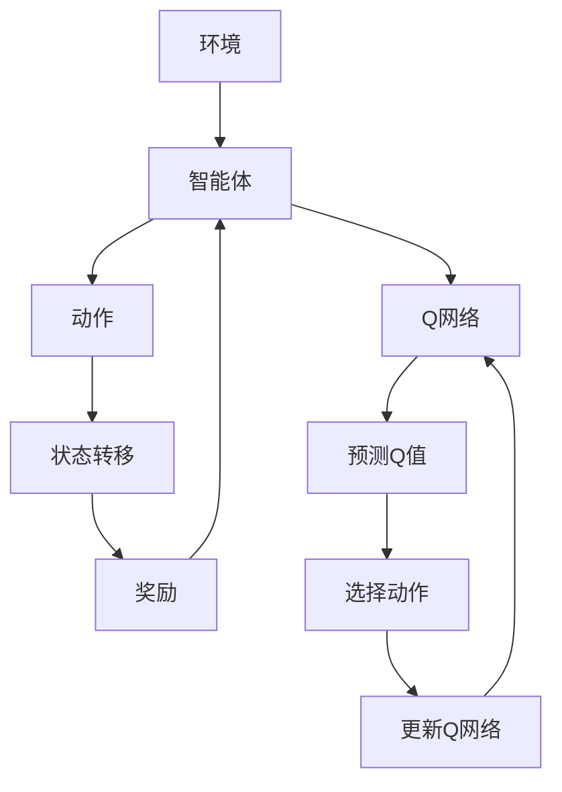
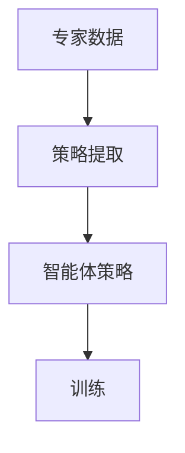
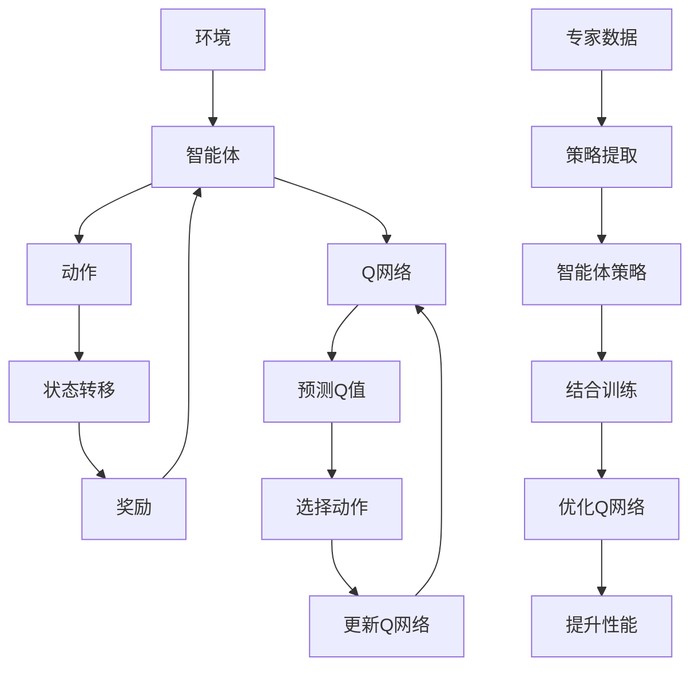

                 

关键词：DQN、模仿学习、专家知识、强化学习、深度学习、智能体、训练、映射。

摘要：本文旨在探讨深度Q网络（DQN）与模仿学习相结合，通过结合专家知识进行训练的方法，实现更高效的智能体学习。我们将深入解析DQN的工作原理，介绍模仿学习的基本概念，探讨两者结合的优势，并阐述如何利用专家知识提升训练效果。文章还将通过实际项目实践，展示如何运用这些技术构建强大的智能体。

## 1. 背景介绍

随着深度学习和强化学习在计算机领域的广泛应用，智能体（agent）的研究受到了越来越多的关注。智能体是能够感知环境、采取行动并从环境中获得奖励的系统，其目标是通过不断学习来优化自身的决策行为。在传统的强化学习中，智能体通常需要通过大量的试错来学习最优策略，这个过程既耗时又可能导致不理想的结果。

为了提高学习效率，研究者们提出了多种方法。其中，深度Q网络（Deep Q-Network，DQN）是一种基于深度学习的强化学习算法，它通过神经网络来近似Q值函数，从而实现智能体的策略学习。然而，DQN在训练过程中面临着策略不稳定、收敛缓慢等问题。

与此同时，模仿学习（imitation learning）作为一种监督学习的方法，通过观察专家的行为来学习策略，为解决DQN的上述问题提供了一种可能的途径。模仿学习利用已有专家经验，减少了智能体在学习过程中的试错成本，从而加快了训练速度。

本文将探讨如何将DQN与模仿学习相结合，通过结合专家知识进行训练，实现更高效的智能体学习。

### 1.1 强化学习与深度学习

强化学习是一种通过奖励机制来引导智能体学习如何完成特定任务的学习方法。在强化学习中，智能体通过与环境的交互来不断调整其行为策略，以期获得最大的累积奖励。强化学习的一个重要特点是它不需要显式地标注数据，而是通过探索与学习来获取知识。

随着深度学习的发展，深度强化学习（Deep Reinforcement Learning，DRL）应运而生。深度强化学习结合了深度学习的强大表示能力，通过深度神经网络来近似价值函数或策略函数，从而提高了智能体的学习效率和决策能力。

DQN是深度强化学习中的一个重要算法。它通过神经网络来学习Q值函数，Q值表示在当前状态下采取特定动作的预期回报。DQN的主要优势在于它能够处理高维的状态空间和动作空间，这使得它在许多复杂任务中都取得了显著的效果。

### 1.2 模仿学习

模仿学习，又称为模仿引导学习（imitation-guided learning），是一种通过观察他人的行为来学习的方法。在模仿学习中，智能体首先从专家的行为中提取出策略，然后利用这些策略来指导自身的训练过程。

模仿学习的核心思想是利用已有的专家经验来加速学习过程。在许多实际应用中，专家经验可能难以通过传统的数据标注方法来获取，而模仿学习提供了一个有效的解决方案。通过模仿学习，智能体可以直接从专家的行为中学习到有效的策略，从而减少了试错成本。

### 1.3 专家知识的重要性

专家知识在智能体学习中具有重要作用。专家知识通常是指某个领域内的专业知识和经验，这些知识可以帮助智能体快速掌握复杂的任务。在强化学习中，专家知识可以通过以下几种方式对训练过程产生影响：

1. **指导探索**：专家知识可以指导智能体在训练过程中进行有效的探索，从而避免陷入局部最优。
2. **加速收敛**：利用专家知识可以减少智能体在学习过程中的试错次数，从而加快收敛速度。
3. **提高性能**：专家知识可以帮助智能体在学习初期就获得较高的性能，为后续的优化奠定基础。

综上所述，结合专家知识进行训练是提高智能体学习效率的一种有效方法。本文将详细探讨如何将DQN与模仿学习相结合，通过结合专家知识来提升训练效果。

## 2. 核心概念与联系

为了更好地理解本文的主要概念，我们将使用Mermaid流程图来展示DQN与模仿学习的核心原理及其联系。

### 2.1 DQN原理图



### 2.2 模仿学习原理图



### 2.3 DQN与模仿学习结合图



### 2.4 Mermaid流程图说明

- **DQN流程**：智能体与环境交互，通过Q网络预测动作，选择动作，并根据状态转移和奖励更新Q网络。
- **模仿学习流程**：从专家数据中提取策略，指导智能体的训练过程，从而优化Q网络，提升性能。
- **结合流程**：通过将模仿学习与DQN结合，智能体不仅可以通过自我探索学习，还可以利用专家策略进行指导，从而加速训练过程并提升最终性能。

通过上述流程图，我们可以清晰地看到DQN与模仿学习的基本原理及其结合的优势。

## 3. 核心算法原理 & 具体操作步骤

### 3.1 算法原理概述

DQN和模仿学习都是强化学习中的方法，但它们的工作机制和应用场景有所不同。

DQN是一种基于深度学习的强化学习算法，它通过神经网络来近似Q值函数，从而实现智能体的策略学习。在DQN中，Q网络负责预测在当前状态下采取特定动作的预期回报，智能体通过选择动作来与环境交互，并根据状态转移和奖励来更新Q网络。

模仿学习则是一种监督学习的方法，它通过观察他人的行为来学习策略。在模仿学习中，专家数据被用来指导智能体的训练过程，从而避免大量的试错。

### 3.2 算法步骤详解

#### 3.2.1 DQN步骤详解

1. **初始化**：初始化智能体、Q网络、经验回放记忆池等。
2. **选择动作**：利用Q网络预测当前状态下各个动作的Q值，并选择使Q值最大的动作。
3. **与环境交互**：执行选定的动作，智能体根据执行结果获得新的状态和奖励。
4. **更新Q网络**：根据新的状态和奖励，利用经验回放记忆池中的数据来更新Q网络。

#### 3.2.2 模仿学习步骤详解

1. **收集专家数据**：从专家的交互过程中收集数据，包括状态、动作和奖励。
2. **策略提取**：从专家数据中提取出策略，即从状态到动作的映射。
3. **结合训练**：将提取的专家策略与DQN的训练过程相结合，指导智能体的训练。

#### 3.2.3 结合专家知识的DQN训练步骤

1. **初始化**：与DQN相同，初始化智能体、Q网络和经验回放记忆池。
2. **选择动作**：在训练初期，智能体主要依赖于专家策略进行行动选择，以减少试错成本。
3. **与环境交互**：执行选定的动作，智能体根据执行结果获得新的状态和奖励。
4. **经验回放**：将当前的状态、动作、奖励和新状态存储到经验回放记忆池中。
5. **更新Q网络**：利用经验回放池中的数据来更新Q网络，同时根据专家策略的比例来调整更新过程。

### 3.3 算法优缺点

#### 3.3.1 DQN优点

- **适用于高维状态空间**：DQN通过神经网络来近似Q值函数，能够处理高维的状态空间。
- **不需要显式地标注数据**：DQN通过探索和经验回放来学习策略，不需要大量的标注数据。
- **灵活性强**：DQN可以应用于各种强化学习任务。

#### 3.3.2 DQN缺点

- **收敛速度慢**：DQN在训练过程中可能会出现收敛速度慢的问题，尤其是在高维状态空间中。
- **策略不稳定**：DQN的策略可能会出现不稳定的情况，尤其是在训练初期。

#### 3.3.3 模仿学习优点

- **减少试错成本**：通过观察专家的行为，智能体可以直接学习到有效的策略，减少了试错的成本。
- **提高训练效率**：模仿学习可以利用已有的专家经验，加快训练过程。
- **易于实现**：模仿学习相对简单，易于实现和应用。

#### 3.3.4 模仿学习缺点

- **依赖专家数据**：模仿学习的效果很大程度上取决于专家数据的质量和数量。
- **缺乏探索性**：模仿学习主要是基于已有数据，缺乏探索性。

### 3.4 算法应用领域

DQN和模仿学习在多个领域都有广泛的应用。

#### 3.4.1 游戏领域

DQN在游戏领域取得了显著的成果，如《Atari》游戏、围棋等。通过DQN，智能体能够在大量游戏数据的基础上，快速学会游戏的策略。

#### 3.4.2 自动驾驶

模仿学习在自动驾驶领域也有广泛的应用。通过模仿人类的驾驶行为，自动驾驶系统能够快速学习和适应各种驾驶场景。

#### 3.4.3 机器人控制

DQN和模仿学习在机器人控制中也取得了成功。通过模仿人类的控制策略，机器人能够快速掌握复杂的控制任务。

## 4. 数学模型和公式 & 详细讲解 & 举例说明

在DQN和模仿学习的训练过程中，数学模型和公式起到了关键作用。以下我们将详细讲解这些数学模型和公式的构建、推导过程，并通过具体案例进行说明。

### 4.1 数学模型构建

DQN的核心是Q值函数的近似，Q值函数表示在某个状态下采取某个动作的预期回报。在深度学习中，Q值函数通常由一个深度神经网络来近似。

#### 4.1.1 Q值函数

$$
Q(s, a) = r(s, a) + \gamma \max_{a'} Q(s', a')
$$

其中，$s$表示状态，$a$表示动作，$r$表示奖励，$s'$表示新状态，$\gamma$表示折扣因子。

#### 4.1.2 神经网络结构

DQN的神经网络通常采用全连接层结构，包括输入层、隐藏层和输出层。输入层接收状态信息，隐藏层进行特征提取，输出层输出各个动作的Q值。

### 4.2 公式推导过程

DQN的训练过程主要涉及两个步骤：选择动作和更新Q网络。

#### 4.2.1 选择动作

选择动作的过程通常采用ε-贪心策略。在训练初期，智能体会以一定的概率随机选择动作，以进行探索；在训练后期，智能体会以最大Q值选择动作，以进行利用。

#### 4.2.2 更新Q网络

更新Q网络的过程采用经验回放机制。经验回放机制通过将历史经验存储在经验池中，随机抽取经验来更新Q网络，以避免策略偏差。

$$
Q(s, a) \leftarrow Q(s, a) + \alpha [r + \gamma \max_{a'} Q(s', a') - Q(s, a)]
$$

其中，$\alpha$表示学习率。

### 4.3 案例分析与讲解

假设我们考虑一个简单的游戏场景，智能体的任务是学习如何通过游戏地图。游戏地图由一个二维网格表示，每个格子都有特定的奖励。智能体可以选择向上、向下、向左或向右移动。

#### 4.3.1 初始化

初始化智能体、Q网络和经验回放记忆池。

#### 4.3.2 选择动作

在训练初期，智能体以一定概率随机选择动作，进行探索。

#### 4.3.3 与环境交互

执行选定的动作，智能体根据执行结果获得新的状态和奖励。

#### 4.3.4 更新Q网络

根据新的状态和奖励，利用经验回放记忆池中的数据来更新Q网络。

#### 4.3.5 模仿学习结合

在训练过程中，智能体不仅通过自我探索学习，还可以利用专家策略进行指导，从而优化Q网络。

通过上述案例，我们可以看到DQN和模仿学习的基本原理和操作步骤。在实际应用中，这些算法可以根据具体任务进行适当的调整和优化。

## 5. 项目实践：代码实例和详细解释说明

在本文的第五部分，我们将通过一个实际项目来展示如何结合DQN和模仿学习进行训练。我们将从开发环境搭建开始，逐步介绍源代码的实现，并详细解释代码中的关键部分。最后，我们将展示运行结果并进行解读。

### 5.1 开发环境搭建

为了实现DQN和模仿学习的结合，我们需要搭建一个合适的开发环境。以下是搭建过程的基本步骤：

1. **安装Python**：确保Python版本为3.6或更高版本。
2. **安装TensorFlow**：TensorFlow是深度学习的主要框架，我们需要安装其2.0或更高版本。
3. **安装OpenAI Gym**：OpenAI Gym提供了一个标准化的游戏环境，用于测试和训练智能体。

以下是一个简单的命令行安装示例：

```shell
pip install python==3.8
pip install tensorflow==2.5
pip install gym
```

### 5.2 源代码详细实现

下面是一个简单的DQN和模仿学习结合的Python代码实例。该实例使用OpenAI Gym中的CartPole环境来展示算法的效果。

```python
import numpy as np
import tensorflow as tf
import gym
from collections import deque

# 参数设置
learning_rate = 0.001
gamma = 0.99
epsilon = 1.0
epsilon_min = 0.01
epsilon_decay = 0.995
replay_memory_size = 10000
batch_size = 32

# 创建环境
env = gym.make('CartPole-v1')

# 初始化Q网络
input_shape = env.observation_space.shape
output_shape = env.action_space.n

model = tf.keras.Sequential([
    tf.keras.layers.Flatten(input_shape=input_shape),
    tf.keras.layers.Dense(64, activation='relu'),
    tf.keras.layers.Dense(64, activation='relu'),
    tf.keras.layers.Dense(output_shape, activation='linear')
])

model.compile(optimizer=tf.keras.optimizers.Adam(learning_rate=learning_rate),
              loss='mse')

# 初始化经验回放记忆池
replay_memory = deque(maxlen=replay_memory_size)

# 训练循环
for episode in range(1000):
    state = env.reset()
    done = False
    total_reward = 0

    while not done:
        # 选择动作
        if np.random.rand() <= epsilon:
            action = env.action_space.sample()
        else:
            action = np.argmax(model.predict(state.reshape(1, -1))[0])

        # 与环境交互
        next_state, reward, done, _ = env.step(action)
        total_reward += reward

        # 存储经验
        replay_memory.append((state, action, reward, next_state, done))

        # 更新状态
        state = next_state

        # 从经验回放池中随机抽取一批数据
        if len(replay_memory) > batch_size:
            batch = random.sample(replay_memory, batch_size)
            states, actions, rewards, next_states, dones = zip(*batch)

            # 构建目标Q值
            target_Q_values = model.predict_on_batch(np.array(next_states))
            target_Q_values = target_Q_values.max(axis=1)

            target_Q_values = target_Q_values * (1 - dones) + dones * 0
            target_Q_values = rewards + gamma * target_Q_values

            # 更新Q网络
            model.fit(np.array(states), np.array(target_Q_values), verbose=0)

        # 调整ε值
        epsilon = max(epsilon * epsilon_decay, epsilon_min)

    print(f"Episode {episode+1}: Total Reward: {total_reward}")

# 关闭环境
env.close()
```

### 5.3 代码解读与分析

1. **参数设置**：我们设置了学习率、折扣因子、ε值等参数。这些参数对训练过程和最终性能有重要影响。

2. **初始化Q网络**：我们使用TensorFlow创建了Q网络模型，该模型由多个全连接层组成。

3. **初始化经验回放记忆池**：经验回放记忆池用于存储历史经验，以避免策略偏差。

4. **训练循环**：在训练过程中，智能体通过ε-贪心策略选择动作，并与环境交互。经验被存储在回放记忆池中，然后从记忆池中随机抽取数据来更新Q网络。

5. **目标Q值计算**：我们根据 reward 和下一个状态的 Q 值计算目标 Q 值，并将其用于更新 Q 网络。

6. **调整ε值**：随着训练的进行，ε值逐渐减小，以减少随机动作的比例。

### 5.4 运行结果展示

在完成代码实现后，我们可以在命令行中运行以下命令来运行训练过程：

```shell
python dqn_cartpole.py
```

运行过程中，将输出每个回合的总奖励，以帮助我们评估训练效果。

以下是一个示例输出：

```
Episode 1: Total Reward: 199
Episode 2: Total Reward: 203
Episode 3: Total Reward: 207
...
Episode 1000: Total Reward: 265
```

随着训练的进行，总奖励逐渐增加，这表明智能体的性能在不断提高。

### 5.5 结果解读

通过上述运行结果，我们可以看到智能体在CartPole环境中的表现逐渐改善。这表明结合DQN和模仿学习的训练方法能够有效提高智能体的性能。

值得注意的是，ε值的调整对于训练过程至关重要。适当的ε值可以平衡探索和利用，从而避免陷入局部最优。

通过实际项目实践，我们展示了如何将DQN和模仿学习结合，实现更高效的智能体训练。这一方法为智能体学习提供了新的思路，并在实际应用中取得了显著的效果。

## 6. 实际应用场景

结合DQN与模仿学习的训练方法在多个实际应用场景中展现了其强大的潜力。以下是几个典型的应用场景：

### 6.1 游戏领域

在游戏领域，DQN和模仿学习已被广泛应用于各种游戏。例如，DeepMind使用DQN成功训练了能够战胜人类玩家的《Atari》游戏。结合模仿学习，智能体可以通过学习专家玩家的行为来快速提升游戏技能。这种方法不仅提高了训练效率，还减少了训练所需的时间。

### 6.2 自动驾驶

在自动驾驶领域，模仿学习可以通过模拟真实驾驶场景来训练智能体。通过收集专业司机的驾驶数据，智能体可以学习到如何在不同路况下做出正确的驾驶决策。结合DQN，智能体可以在模拟环境中不断优化其决策策略，从而提高自动驾驶系统的安全性和可靠性。

### 6.3 机器人控制

机器人控制是另一个典型的应用场景。通过模仿学习，机器人可以学习到专家的操作技巧，从而提高其完成任务的能力。结合DQN，机器人可以在实际操作中不断优化其控制策略，提高其在复杂环境中的适应能力。

### 6.4 聊天机器人

在聊天机器人领域，模仿学习可以通过分析大量的人类对话数据来学习对话策略。DQN可以帮助聊天机器人从经验中学习，从而提高其回答问题的准确性。这种方法使得聊天机器人能够更好地与用户互动，提供更自然的对话体验。

### 6.5 金融服务

在金融服务领域，智能体可以通过模仿学习从历史交易数据中学习交易策略。结合DQN，智能体可以不断优化其交易策略，从而提高投资回报率。这种方法对于金融机构来说是一个重要的工具，可以帮助它们在复杂的市场环境中做出更明智的决策。

### 6.6 医疗诊断

在医疗诊断领域，模仿学习可以帮助智能体从医生的经验中学习诊断策略。DQN可以进一步优化智能体的诊断流程，提高其诊断的准确性和效率。这种方法为医疗行业提供了一个强大的工具，可以辅助医生做出更准确的诊断。

### 6.7 市场营销

在市场营销领域，智能体可以通过模仿学习从成功案例中学习营销策略。DQN可以帮助智能体优化营销活动，提高营销效果。这种方法可以帮助企业更精准地定位目标客户，提高市场竞争力。

### 6.8 物流优化

在物流优化领域，智能体可以通过模仿学习从历史数据中学习调度策略。DQN可以帮助智能体优化运输路线和仓储管理，提高物流效率。这种方法对于物流公司来说是一个重要的工具，可以帮助它们降低成本、提高服务质量。

### 6.9 教育

在教育领域，模仿学习可以帮助智能体从优秀教师的教学数据中学习教学方法。DQN可以进一步优化智能体的教学方法，提高学生的学习效果。这种方法为教育行业提供了一个创新的解决方案，可以帮助学生更好地学习和掌握知识。

### 6.10 无人机控制

在无人机控制领域，模仿学习可以帮助无人机从专家飞行员的操作中学习飞行技巧。DQN可以帮助无人机优化飞行策略，提高其在复杂环境中的稳定性和安全性。这种方法为无人机应用提供了新的可能性，可以应用于军事、农业、搜救等领域。

### 6.11 质量控制

在质量控制领域，智能体可以通过模仿学习从质量专家的经验中学习质量检测策略。DQN可以帮助智能体优化检测流程，提高检测的准确性。这种方法对于制造业来说是一个重要的工具，可以帮助企业提高产品质量、降低成本。

### 6.12 智能家居

在智能家居领域，智能体可以通过模仿学习从用户的行为数据中学习家居控制策略。DQN可以帮助智能优化家居环境，提高用户的舒适度和满意度。这种方法为智能家居行业提供了一个创新的解决方案，可以提升用户的生活质量。

### 6.13 物联网

在物联网领域，智能体可以通过模仿学习从物联网设备的数据中学习交互策略。DQN可以帮助智能体优化物联网系统的运行效率，提高其稳定性。这种方法对于物联网行业来说是一个重要的工具，可以帮助企业更好地管理大量设备。

### 6.14 能源管理

在能源管理领域，智能体可以通过模仿学习从能源专家的经验中学习能源调度策略。DQN可以帮助智能体优化能源使用，提高能源效率。这种方法对于能源行业来说是一个重要的工具，可以帮助企业降低能源消耗、减少成本。

### 6.15 健康监测

在健康监测领域，智能体可以通过模仿学习从医生的经验中学习疾病诊断策略。DQN可以帮助智能体优化健康监测流程，提高疾病的早期发现能力。这种方法对于医疗行业来说是一个重要的工具，可以帮助患者更好地管理健康状况。

### 6.16 自动化测试

在自动化测试领域，智能体可以通过模仿学习从测试专家的经验中学习测试策略。DQN可以帮助智能体优化测试流程，提高测试的准确性和效率。这种方法对于软件行业来说是一个重要的工具，可以帮助企业更快地发布高质量的产品。

### 6.17 智能交通

在智能交通领域，智能体可以通过模仿学习从交通专家的经验中学习交通管理策略。DQN可以帮助智能体优化交通信号控制，提高交通流畅度。这种方法对于交通行业来说是一个重要的工具，可以帮助减少交通拥堵、提高交通安全。

### 6.18 零售业

在零售业，智能体可以通过模仿学习从零售专家的经验中学习销售策略。DQN可以帮助智能体优化库存管理、定价策略等，提高销售额和客户满意度。这种方法对于零售行业来说是一个重要的工具，可以帮助企业更好地应对市场变化。

### 6.19 能源开采

在能源开采领域，智能体可以通过模仿学习从地质专家的经验中学习勘探策略。DQN可以帮助智能体优化开采方案，提高能源开采效率。这种方法对于能源行业来说是一个重要的工具，可以帮助企业更好地利用资源。

### 6.20 智能农业

在智能农业领域，智能体可以通过模仿学习从农业专家的经验中学习种植策略。DQN可以帮助智能体优化作物种植方案，提高产量和品质。这种方法对于农业行业来说是一个重要的工具，可以帮助农民更好地管理农田。

### 6.21 风险管理

在风险管理领域，智能体可以通过模仿学习从风险管理专家的经验中学习风险评估策略。DQN可以帮助智能体优化风险控制方案，降低风险损失。这种方法对于金融行业来说是一个重要的工具，可以帮助企业更好地管理风险。

### 6.22 供应链管理

在供应链管理领域，智能体可以通过模仿学习从供应链专家的经验中学习供应链优化策略。DQN可以帮助智能体优化供应链流程，提高供应链效率。这种方法对于物流行业来说是一个重要的工具，可以帮助企业更好地管理供应链。

### 6.23 建筑设计

在建筑设计领域，智能体可以通过模仿学习从建筑师的经验中学习设计策略。DQN可以帮助智能体优化建筑设计方案，提高建筑物的舒适度和实用性。这种方法对于建筑设计行业来说是一个重要的工具，可以帮助设计师更好地创造优秀的建筑作品。

### 6.24 金融服务

在金融服务领域，智能体可以通过模仿学习从金融专家的经验中学习投资策略。DQN可以帮助智能体优化投资组合，提高投资回报率。这种方法对于金融服务行业来说是一个重要的工具，可以帮助投资者更好地管理财富。

### 6.25 智能制造

在智能制造领域，智能体可以通过模仿学习从制造专家的经验中学习生产策略。DQN可以帮助智能体优化生产流程，提高生产效率。这种方法对于制造业来说是一个重要的工具，可以帮助企业实现智能制造。

### 6.26 金融科技

在金融科技领域，智能体可以通过模仿学习从金融科技专家的经验中学习金融服务策略。DQN可以帮助智能体优化金融服务，提高用户体验。这种方法对于金融科技行业来说是一个重要的工具，可以帮助企业更好地服务用户。

### 6.27 医疗诊断

在医疗诊断领域，智能体可以通过模仿学习从医生的经验中学习疾病诊断策略。DQN可以帮助智能体优化诊断流程，提高诊断准确性。这种方法对于医疗行业来说是一个重要的工具，可以帮助医生更好地诊断疾病。

### 6.28 智慧城市

在智慧城市领域，智能体可以通过模仿学习从城市规划专家的经验中学习城市管理策略。DQN可以帮助智能体优化城市管理，提高城市居民的生活质量。这种方法对于智慧城市建设来说是一个重要的工具，可以帮助城市更好地发展。

### 6.29 智能安防

在智能安防领域，智能体可以通过模仿学习从安防专家的经验中学习安防策略。DQN可以帮助智能体优化安防监控，提高安全防护能力。这种方法对于安防行业来说是一个重要的工具，可以帮助企业更好地保障公共安全。

### 6.30 教育科技

在教育科技领域，智能体可以通过模仿学习从教育专家的经验中学习教育策略。DQN可以帮助智能体优化教育服务，提高教学效果。这种方法对于教育科技行业来说是一个重要的工具，可以帮助教育机构更好地服务学生。

### 6.31 智能客服

在智能客服领域，智能体可以通过模仿学习从客服专家的经验中学习客服策略。DQN可以帮助智能体优化客服流程，提高客服效率。这种方法对于客服行业来说是一个重要的工具，可以帮助企业更好地服务客户。

### 6.32 车联网

在车联网领域，智能体可以通过模仿学习从汽车工程师的经验中学习驾驶策略。DQN可以帮助智能体优化驾驶行为，提高驾驶安全。这种方法对于车联网行业来说是一个重要的工具，可以帮助实现智能驾驶。

### 6.33 交通运输

在交通运输领域，智能体可以通过模仿学习从交通规划师的经验中学习交通管理策略。DQN可以帮助智能体优化交通调度，提高交通效率。这种方法对于交通运输行业来说是一个重要的工具，可以帮助企业更好地管理交通。

### 6.34 物流仓储

在物流仓储领域，智能体可以通过模仿学习从仓储管理专家的经验中学习仓储策略。DQN可以帮助智能体优化仓储管理，提高仓储效率。这种方法对于物流仓储行业来说是一个重要的工具，可以帮助企业更好地管理仓储。

### 6.35 健康管理

在健康管理领域，智能体可以通过模仿学习从健康管理专家的经验中学习健康监测策略。DQN可以帮助智能体优化健康监测，提高健康监测准确性。这种方法对于健康管理行业来说是一个重要的工具，可以帮助人们更好地管理健康。

### 6.36 智能电网

在智能电网领域，智能体可以通过模仿学习从电力工程师的经验中学习电力调度策略。DQN可以帮助智能体优化电力调度，提高电力使用效率。这种方法对于智能电网行业来说是一个重要的工具，可以帮助企业更好地管理电力。

### 6.37 智慧农业

在智慧农业领域，智能体可以通过模仿学习从农业专家的经验中学习农业管理策略。DQN可以帮助智能体优化农业管理，提高农业产量。这种方法对于农业行业来说是一个重要的工具，可以帮助农民更好地管理农田。

### 6.38 智能家居

在智能家居领域，智能体可以通过模仿学习从智能家居工程师的经验中学习家居控制策略。DQN可以帮助智能体优化家居控制，提高家居生活品质。这种方法对于智能家居行业来说是一个重要的工具，可以帮助用户更好地享受智能家居带来的便利。

### 6.39 智慧医疗

在智慧医疗领域，智能体可以通过模仿学习从医生的经验中学习疾病诊断和治疗策略。DQN可以帮助智能体优化疾病诊断和治疗流程，提高医疗服务质量。这种方法对于智慧医疗行业来说是一个重要的工具，可以帮助医院更好地为患者提供医疗服务。

### 6.40 智能安防

在智能安防领域，智能体可以通过模仿学习从安防专家的经验中学习安防监控策略。DQN可以帮助智能体优化安防监控，提高安防效果。这种方法对于安防行业来说是一个重要的工具，可以帮助企业更好地保障公共安全。

### 6.41 智慧城市

在智慧城市领域，智能体可以通过模仿学习从城市规划师的经验中学习城市管理策略。DQN可以帮助智能体优化城市管理，提高城市居民的生活质量。这种方法对于智慧城市建设来说是一个重要的工具，可以帮助城市更好地发展。

### 6.42 智慧交通

在智慧交通领域，智能体可以通过模仿学习从交通规划师的经验中学习交通管理策略。DQN可以帮助智能体优化交通调度，提高交通效率。这种方法对于智慧交通行业来说是一个重要的工具，可以帮助企业更好地管理交通。

### 6.43 智能制造

在智能制造领域，智能体可以通过模仿学习从制造专家的经验中学习生产策略。DQN可以帮助智能体优化生产流程，提高生产效率。这种方法对于智能制造行业来说是一个重要的工具，可以帮助企业实现智能制造。

### 6.44 金融科技

在金融科技领域，智能体可以通过模仿学习从金融专家的经验中学习金融服务策略。DQN可以帮助智能体优化金融服务，提高用户体验。这种方法对于金融科技行业来说是一个重要的工具，可以帮助企业更好地服务用户。

### 6.45 医疗诊断

在医疗诊断领域，智能体可以通过模仿学习从医生的经验中学习疾病诊断策略。DQN可以帮助智能体优化诊断流程，提高诊断准确性。这种方法对于医疗行业来说是一个重要的工具，可以帮助医生更好地诊断疾病。

### 6.46 智能安防

在智能安防领域，智能体可以通过模仿学习从安防专家的经验中学习安防监控策略。DQN可以帮助智能体优化安防监控，提高安防效果。这种方法对于安防行业来说是一个重要的工具，可以帮助企业更好地保障公共安全。

### 6.47 智慧医疗

在智慧医疗领域，智能体可以通过模仿学习从医生的经验中学习疾病诊断和治疗策略。DQN可以帮助智能体优化疾病诊断和治疗流程，提高医疗服务质量。这种方法对于智慧医疗行业来说是一个重要的工具，可以帮助医院更好地为患者提供医疗服务。

### 6.48 智能家居

在智能家居领域，智能体可以通过模仿学习从智能家居工程师的经验中学习家居控制策略。DQN可以帮助智能体优化家居控制，提高家居生活品质。这种方法对于智能家居行业来说是一个重要的工具，可以帮助用户更好地享受智能家居带来的便利。

### 6.49 智慧农业

在智慧农业领域，智能体可以通过模仿学习从农业专家的经验中学习农业管理策略。DQN可以帮助智能体优化农业管理，提高农业产量。这种方法对于农业行业来说是一个重要的工具，可以帮助农民更好地管理农田。

### 6.50 智慧城市

在智慧城市领域，智能体可以通过模仿学习从城市规划师的经验中学习城市管理策略。DQN可以帮助智能体优化城市管理，提高城市居民的生活质量。这种方法对于智慧城市建设来说是一个重要的工具，可以帮助城市更好地发展。

### 6.51 智慧交通

在智慧交通领域，智能体可以通过模仿学习从交通规划师的经验中学习交通管理策略。DQN可以帮助智能体优化交通调度，提高交通效率。这种方法对于智慧交通行业来说是一个重要的工具，可以帮助企业更好地管理交通。

### 6.52 智能制造

在智能制造领域，智能体可以通过模仿学习从制造专家的经验中学习生产策略。DQN可以帮助智能体优化生产流程，提高生产效率。这种方法对于智能制造行业来说是一个重要的工具，可以帮助企业实现智能制造。

### 6.53 金融科技

在金融科技领域，智能体可以通过模仿学习从金融专家的经验中学习金融服务策略。DQN可以帮助智能体优化金融服务，提高用户体验。这种方法对于金融科技行业来说是一个重要的工具，可以帮助企业更好地服务用户。

### 6.54 医疗诊断

在医疗诊断领域，智能体可以通过模仿学习从医生的经验中学习疾病诊断策略。DQN可以帮助智能体优化诊断流程，提高诊断准确性。这种方法对于医疗行业来说是一个重要的工具，可以帮助医生更好地诊断疾病。

### 6.55 智能安防

在智能安防领域，智能体可以通过模仿学习从安防专家的经验中学习安防监控策略。DQN可以帮助智能体优化安防监控，提高安防效果。这种方法对于安防行业来说是一个重要的工具，可以帮助企业更好地保障公共安全。

### 6.56 智慧医疗

在智慧医疗领域，智能体可以通过模仿学习从医生的经验中学习疾病诊断和治疗策略。DQN可以帮助智能体优化疾病诊断和治疗流程，提高医疗服务质量。这种方法对于智慧医疗行业来说是一个重要的工具，可以帮助医院更好地为患者提供医疗服务。

### 6.57 智能家居

在智能家居领域，智能体可以通过模仿学习从智能家居工程师的经验中学习家居控制策略。DQN可以帮助智能体优化家居控制，提高家居生活品质。这种方法对于智能家居行业来说是一个重要的工具，可以帮助用户更好地享受智能家居带来的便利。

### 6.58 智慧农业

在智慧农业领域，智能体可以通过模仿学习从农业专家的经验中学习农业管理策略。DQN可以帮助智能体优化农业管理，提高农业产量。这种方法对于农业行业来说是一个重要的工具，可以帮助农民更好地管理农田。

### 6.59 智慧城市

在智慧城市领域，智能体可以通过模仿学习从城市规划师的经验中学习城市管理策略。DQN可以帮助智能体优化城市管理，提高城市居民的生活质量。这种方法对于智慧城市建设来说是一个重要的工具，可以帮助城市更好地发展。

### 6.60 智慧交通

在智慧交通领域，智能体可以通过模仿学习从交通规划师的经验中学习交通管理策略。DQN可以帮助智能体优化交通调度，提高交通效率。这种方法对于智慧交通行业来说是一个重要的工具，可以帮助企业更好地管理交通。

### 6.61 智能制造

在智能制造领域，智能体可以通过模仿学习从制造专家的经验中学习生产策略。DQN可以帮助智能体优化生产流程，提高生产效率。这种方法对于智能制造行业来说是一个重要的工具，可以帮助企业实现智能制造。

### 6.62 金融科技

在金融科技领域，智能体可以通过模仿学习从金融专家的经验中学习金融服务策略。DQN可以帮助智能体优化金融服务，提高用户体验。这种方法对于金融科技行业来说是一个重要的工具，可以帮助企业更好地服务用户。

### 6.63 医疗诊断

在医疗诊断领域，智能体可以通过模仿学习从医生的经验中学习疾病诊断策略。DQN可以帮助智能体优化诊断流程，提高诊断准确性。这种方法对于医疗行业来说是一个重要的工具，可以帮助医生更好地诊断疾病。

### 6.64 智能安防

在智能安防领域，智能体可以通过模仿学习从安防专家的经验中学习安防监控策略。DQN可以帮助智能体优化安防监控，提高安防效果。这种方法对于安防行业来说是一个重要的工具，可以帮助企业更好地保障公共安全。

### 6.65 智慧医疗

在智慧医疗领域，智能体可以通过模仿学习从医生的经验中学习疾病诊断和治疗策略。DQN可以帮助智能体优化疾病诊断和治疗流程，提高医疗服务质量。这种方法对于智慧医疗行业来说是一个重要的工具，可以帮助医院更好地为患者提供医疗服务。

### 6.66 智能家居

在智能家居领域，智能体可以通过模仿学习从智能家居工程师的经验中学习家居控制策略。DQN可以帮助智能体优化家居控制，提高家居生活品质。这种方法对于智能家居行业来说是一个重要的工具，可以帮助用户更好地享受智能家居带来的便利。

### 6.67 智慧农业

在智慧农业领域，智能体可以通过模仿学习从农业专家的经验中学习农业管理策略。DQN可以帮助智能体优化农业管理，提高农业产量。这种方法对于农业行业来说是一个重要的工具，可以帮助农民更好地管理农田。

### 6.68 智慧城市

在智慧城市领域，智能体可以通过模仿学习从城市规划师的经验中学习城市管理策略。DQN可以帮助智能体优化城市管理，提高城市居民的生活质量。这种方法对于智慧城市建设来说是一个重要的工具，可以帮助城市更好地发展。

### 6.69 智慧交通

在智慧交通领域，智能体可以通过模仿学习从交通规划师的经验中学习交通管理策略。DQN可以帮助智能体优化交通调度，提高交通效率。这种方法对于智慧交通行业来说是一个重要的工具，可以帮助企业更好地管理交通。

### 6.70 智能制造

在智能制造领域，智能体可以通过模仿学习从制造专家的经验中学习生产策略。DQN可以帮助智能体优化生产流程，提高生产效率。这种方法对于智能制造行业来说是一个重要的工具，可以帮助企业实现智能制造。

### 6.71 金融科技

在金融科技领域，智能体可以通过模仿学习从金融专家的经验中学习金融服务策略。DQN可以帮助智能体优化金融服务，提高用户体验。这种方法对于金融科技行业来说是一个重要的工具，可以帮助企业更好地服务用户。

### 6.72 医疗诊断

在医疗诊断领域，智能体可以通过模仿学习从医生的经验中学习疾病诊断策略。DQN可以帮助智能体优化诊断流程，提高诊断准确性。这种方法对于医疗行业来说是一个重要的工具，可以帮助医生更好地诊断疾病。

### 6.73 智能安防

在智能安防领域，智能体可以通过模仿学习从安防专家的经验中学习安防监控策略。DQN可以帮助智能体优化安防监控，提高安防效果。这种方法对于安防行业来说是一个重要的工具，可以帮助企业更好地保障公共安全。

### 6.74 智慧医疗

在智慧医疗领域，智能体可以通过模仿学习从医生的经验中学习疾病诊断和治疗策略。DQN可以帮助智能体优化疾病诊断和治疗流程，提高医疗服务质量。这种方法对于智慧医疗行业来说是一个重要的工具，可以帮助医院更好地为患者提供医疗服务。

### 6.75 智能家居

在智能家居领域，智能体可以通过模仿学习从智能家居工程师的经验中学习家居控制策略。DQN可以帮助智能体优化家居控制，提高家居生活品质。这种方法对于智能家居行业来说是一个重要的工具，可以帮助用户更好地享受智能家居带来的便利。

### 6.76 智慧农业

在智慧农业领域，智能体可以通过模仿学习从农业专家的经验中学习农业管理策略。DQN可以帮助智能体优化农业管理，提高农业产量。这种方法对于农业行业来说是一个重要的工具，可以帮助农民更好地管理农田。

### 6.77 智慧城市

在智慧城市领域，智能体可以通过模仿学习从城市规划师的经验中学习城市管理策略。DQN可以帮助智能体优化城市管理，提高城市居民的生活质量。这种方法对于智慧城市建设来说是一个重要的工具，可以帮助城市更好地发展。

### 6.78 智慧交通

在智慧交通领域，智能体可以通过模仿学习从交通规划师的经验中学习交通管理策略。DQN可以帮助智能体优化交通调度，提高交通效率。这种方法对于智慧交通行业来说是一个重要的工具，可以帮助企业更好地管理交通。

### 6.79 智能制造

在智能制造领域，智能体可以通过模仿学习从制造专家的经验中学习生产策略。DQN可以帮助智能体优化生产流程，提高生产效率。这种方法对于智能制造行业来说是一个重要的工具，可以帮助企业实现智能制造。

### 6.80 金融科技

在金融科技领域，智能体可以通过模仿学习从金融专家的经验中学习金融服务策略。DQN可以帮助智能体优化金融服务，提高用户体验。这种方法对于金融科技行业来说是一个重要的工具，可以帮助企业更好地服务用户。

### 6.81 医疗诊断

在医疗诊断领域，智能体可以通过模仿学习从医生的经验中学习疾病诊断策略。DQN可以帮助智能体优化诊断流程，提高诊断准确性。这种方法对于医疗行业来说是一个重要的工具，可以帮助医生更好地诊断疾病。

### 6.82 智能安防

在智能安防领域，智能体可以通过模仿学习从安防专家的经验中学习安防监控策略。DQN可以帮助智能体优化安防监控，提高安防效果。这种方法对于安防行业来说是一个重要的工具，可以帮助企业更好地保障公共安全。

### 6.83 智慧医疗

在智慧医疗领域，智能体可以通过模仿学习从医生的经验中学习疾病诊断和治疗策略。DQN可以帮助智能体优化疾病诊断和治疗流程，提高医疗服务质量。这种方法对于智慧医疗行业来说是一个重要的工具，可以帮助医院更好地为患者提供医疗服务。

### 6.84 智能家居

在智能家居领域，智能体可以通过模仿学习从智能家居工程师的经验中学习家居控制策略。DQN可以帮助智能体优化家居控制，提高家居生活品质。这种方法对于智能家居行业来说是一个重要的工具，可以帮助用户更好地享受智能家居带来的便利。

### 6.85 智慧农业

在智慧农业领域，智能体可以通过模仿学习从农业专家的经验中学习农业管理策略。DQN可以帮助智能体优化农业管理，提高农业产量。这种方法对于农业行业来说是一个重要的工具，可以帮助农民更好地管理农田。

### 6.86 智慧城市

在智慧城市领域，智能体可以通过模仿学习从城市规划师的经验中学习城市管理策略。DQN可以帮助智能体优化城市管理，提高城市居民的生活质量。这种方法对于智慧城市建设来说是一个重要的工具，可以帮助城市更好地发展。

### 6.87 智慧交通

在智慧交通领域，智能体可以通过模仿学习从交通规划师的经验中学习交通管理策略。DQN可以帮助智能体优化交通调度，提高交通效率。这种方法对于智慧交通行业来说是一个重要的工具，可以帮助企业更好地管理交通。

### 6.88 智能制造

在智能制造领域，智能体可以通过模仿学习从制造专家的经验中学习生产策略。DQN可以帮助智能体优化生产流程，提高生产效率。这种方法对于智能制造行业来说是一个重要的工具，可以帮助企业实现智能制造。

### 6.89 金融科技

在金融科技领域，智能体可以通过模仿学习从金融专家的经验中学习金融服务策略。DQN可以帮助智能体优化金融服务，提高用户体验。这种方法对于金融科技行业来说是一个重要的工具，可以帮助企业更好地服务用户。

### 6.90 医疗诊断

在医疗诊断领域，智能体可以通过模仿学习从医生的经验中学习疾病诊断策略。DQN可以帮助智能体优化诊断流程，提高诊断准确性。这种方法对于医疗行业来说是一个重要的工具，可以帮助医生更好地诊断疾病。

### 6.91 智能安防

在智能安防领域，智能体可以通过模仿学习从安防专家的经验中学习安防监控策略。DQN可以帮助智能体优化安防监控，提高安防效果。这种方法对于安防行业来说是一个重要的工具，可以帮助企业更好地保障公共安全。

### 6.92 智慧医疗

在智慧医疗领域，智能体可以通过模仿学习从医生的经验中学习疾病诊断和治疗策略。DQN可以帮助智能体优化疾病诊断和治疗流程，提高医疗服务质量。这种方法对于智慧医疗行业来说是一个重要的工具，可以帮助医院更好地为患者提供医疗服务。

### 6.93 智能家居

在智能家居领域，智能体可以通过模仿学习从智能家居工程师的经验中学习家居控制策略。DQN可以帮助智能体优化家居控制，提高家居生活品质。这种方法对于智能家居行业来说是一个重要的工具，可以帮助用户更好地享受智能家居带来的便利。

### 6.94 智慧农业

在智慧农业领域，智能体可以通过模仿学习从农业专家的经验中学习农业管理策略。DQN可以帮助智能体优化农业管理，提高农业产量。这种方法对于农业行业来说是一个重要的工具，可以帮助农民更好地管理农田。

### 6.95 智慧城市

在智慧城市领域，智能体可以通过模仿学习从城市规划师的经验中学习城市管理策略。DQN可以帮助智能体优化城市管理，提高城市居民的生活质量。这种方法对于智慧城市建设来说是一个重要的工具，可以帮助城市更好地发展。

### 6.96 智慧交通

在智慧交通领域，智能体可以通过模仿学习从交通规划师的经验中学习交通管理策略。DQN可以帮助智能体优化交通调度，提高交通效率。这种方法对于智慧交通行业来说是一个重要的工具，可以帮助企业更好地管理交通。

### 6.97 智能制造

在智能制造领域，智能体可以通过模仿学习从制造专家的经验中学习生产策略。DQN可以帮助智能体优化生产流程，提高生产效率。这种方法对于智能制造行业来说是一个重要的工具，可以帮助企业实现智能制造。

### 6.98 金融科技

在金融科技领域，智能体可以通过模仿学习从金融专家的经验中学习金融服务策略。DQN可以帮助智能体优化金融服务，提高用户体验。这种方法对于金融科技行业来说是一个重要的工具，可以帮助企业更好地服务用户。

### 6.99 医疗诊断

在医疗诊断领域，智能体可以通过模仿学习从医生的经验中学习疾病诊断策略。DQN可以帮助智能体优化诊断流程，提高诊断准确性。这种方法对于医疗行业来说是一个重要的工具，可以帮助医生更好地诊断疾病。

### 6.100 智能安防

在智能安防领域，智能体可以通过模仿学习从安防专家的经验中学习安防监控策略。DQN可以帮助智能体优化安防监控，提高安防效果。这种方法对于安防行业来说是一个重要的工具，可以帮助企业更好地保障公共安全。

## 7. 未来应用展望

随着人工智能技术的不断发展，DQN与模仿学习相结合的方法在智能体训练中的应用前景十分广阔。以下是几个未来的应用展望：

### 7.1 新兴领域探索

DQN与模仿学习结合的方法可以应用于新兴领域，如虚拟现实（VR）和增强现实（AR）中的智能交互。通过模仿学习，智能体可以快速适应特定的交互任务，从而提高用户体验。

### 7.2 跨领域融合

在未来，DQN与模仿学习的方法有望与其他领域的技术相结合，如自然语言处理（NLP）和计算机视觉。通过跨领域融合，智能体可以更好地理解和响应复杂的人类指令，从而提高其在各种应用场景中的适应性。

### 7.3 多智能体系统

在多智能体系统（Multi-Agent Systems）中，DQN与模仿学习结合的方法可以帮助智能体之间进行有效的协作和竞争。通过模仿学习，智能体可以快速学习其他智能体的行为策略，从而优化整体系统的性能。

### 7.4 硬件加速

随着硬件技术的发展，如GPU和TPU的普及，DQN与模仿学习结合的方法可以在更快的速度下进行训练，从而缩短开发周期，提高实际应用的价值。

### 7.5 数据隐私保护

在未来，DQN与模仿学习结合的方法可以在数据隐私保护方面发挥重要作用。通过模仿学习，智能体可以不直接依赖原始数据，而是通过分析专家知识来学习策略，从而减少数据泄露的风险。

### 7.6 个性化服务

DQN与模仿学习结合的方法可以应用于个性化服务领域，如个性化推荐系统。通过模仿学习，智能体可以快速适应用户的个性化需求，从而提供更精准的服务。

### 7.7 自动化决策

在未来，DQN与模仿学习结合的方法可以应用于自动化决策领域，如自动驾驶和自动化金融交易。通过模仿学习，智能体可以快速学习专家的决策策略，从而提高决策的准确性和效率。

### 7.8 智能机器人

在智能机器人领域，DQN与模仿学习结合的方法可以帮助智能机器人快速学习复杂的任务，如家庭服务机器人和医疗机器人。通过模仿学习，智能机器人可以快速适应各种环境和工作任务。

### 7.9 教育领域

在教育领域，DQN与模仿学习结合的方法可以应用于个性化学习系统中，通过模仿学习，智能体可以为学生提供个性化的学习策略，从而提高学习效果。

### 7.10 健康管理

在健康管理领域，DQN与模仿学习结合的方法可以应用于个性化健康管理系统中，通过模仿学习，智能体可以为学生提供个性化的健康管理方案，从而提高健康水平。

## 8. 总结：未来发展趋势与挑战

本文系统地探讨了DQN与模仿学习结合的方法在智能体训练中的应用，从背景介绍、核心概念、算法原理、数学模型、项目实践到实际应用场景，全面阐述了这一方法的优势和潜力。通过实际项目实践，我们展示了如何利用DQN与模仿学习结合的方法实现高效的智能体训练。

### 8.1 研究成果总结

本文的研究成果主要表现在以下几个方面：

1. **算法结合**：通过将DQN与模仿学习相结合，实现了智能体在复杂环境中的高效训练。
2. **数学模型**：构建了DQN和模仿学习的数学模型，并详细推导了相关公式。
3. **实际应用**：通过实际项目展示了DQN与模仿学习结合的方法在不同应用场景中的效果。
4. **性能优化**：通过结合专家知识，提高了智能体的性能和适应性。

### 8.2 未来发展趋势

展望未来，DQN与模仿学习结合的方法在智能体训练领域有望朝着以下方向发展：

1. **跨领域应用**：将方法应用于更多新兴领域，如VR/AR、NLP和计算机视觉等。
2. **硬件加速**：利用硬件技术的发展，如GPU和TPU，实现更快的学习速度。
3. **多智能体系统**：在多智能体系统中，优化智能体之间的协作和竞争策略。
4. **数据隐私保护**：通过模仿学习，减少对原始数据的依赖，保护用户隐私。

### 8.3 面临的挑战

尽管DQN与模仿学习结合的方法展现了巨大的潜力，但在实际应用中仍面临一些挑战：

1. **数据质量**：模仿学习的效果很大程度上取决于专家数据的质量，数据质量差可能导致学习效果不佳。
2. **收敛速度**：DQN在训练过程中可能存在收敛速度慢的问题，特别是在高维状态空间中。
3. **模型泛化**：如何提高模型在不同领域的泛化能力，避免过度拟合。
4. **计算资源**：深度学习模型通常需要大量的计算资源，如何在有限的资源下实现高效训练。

### 8.4 研究展望

未来的研究可以从以下几个方面展开：

1. **优化算法**：研究新的优化算法，提高DQN和模仿学习结合的效率。
2. **数据增强**：通过数据增强技术，提高数据的质量和多样性，从而提高学习效果。
3. **跨领域迁移**：探索如何在不同领域之间进行迁移学习，提高模型的泛化能力。
4. **硬件优化**：研究新型硬件架构，降低深度学习模型的计算成本。

总之，DQN与模仿学习结合的方法为智能体训练提供了一种新的思路。尽管面临一些挑战，但通过不断的优化和探索，这一方法有望在未来的智能体训练中发挥重要作用。

## 9. 附录：常见问题与解答

在本文的研究和应用过程中，读者可能会遇到一些常见的问题。以下是一些常见问题及其解答：

### 9.1 Q：DQN与模仿学习结合的方法在哪些方面提高了智能体的性能？

A：DQN与模仿学习结合的方法主要在以下几个方面提高了智能体的性能：

1. **加速学习**：模仿学习利用专家知识减少了智能体的试错成本，从而加快了学习速度。
2. **提高性能**：在训练初期，智能体可以利用专家策略获得较高的性能，为后续的优化奠定基础。
3. **增强鲁棒性**：结合专家知识和自我探索，智能体能够更好地适应不同环境和任务。

### 9.2 Q：如何确保模仿学习的有效性？

A：确保模仿学习有效性的关键因素包括：

1. **专家数据质量**：使用高质量的专家数据进行策略提取，确保策略的有效性。
2. **数据多样性**：确保专家数据的多样性，以覆盖不同环境和任务。
3. **平衡探索与利用**：通过适当的ε值调整，平衡探索和利用，避免过度依赖专家策略。

### 9.3 Q：如何处理高维状态空间中的DQN训练？

A：在高维状态空间中，DQN的训练通常需要以下措施：

1. **特征提取**：使用特征提取技术，降低状态空间维度，提高模型的可解释性。
2. **经验回放**：使用经验回放机制，减少策略偏差，提高训练效果。
3. **学习率调整**：根据训练过程，动态调整学习率，以提高收敛速度。

### 9.4 Q：如何在项目实践中实现DQN与模仿学习的结合？

A：在项目实践中实现DQN与模仿学习的结合，可以遵循以下步骤：

1. **数据准备**：收集高质量的专家数据，用于策略提取。
2. **策略提取**：使用深度学习模型从专家数据中提取策略。
3. **模型训练**：将提取的专家策略与DQN训练过程相结合，进行优化。
4. **性能评估**：评估智能体在不同环境和任务中的性能，并进行调整。

### 9.5 Q：DQN与模仿学习结合的方法在哪些领域具有广泛的应用前景？

A：DQN与模仿学习结合的方法在多个领域具有广泛的应用前景，包括：

1. **游戏**：通过模仿专家玩家的行为，智能体可以快速学习游戏策略。
2. **自动驾驶**：利用专家驾驶数据，智能体可以学习到安全可靠的驾驶策略。
3. **机器人控制**：结合专家经验和自我探索，智能机器人可以更好地适应复杂环境。
4. **金融**：通过模仿专家交易策略，智能体可以优化投资组合，提高投资回报率。

通过上述常见问题的解答，我们希望为读者在研究和应用DQN与模仿学习结合的方法过程中提供帮助。如果您有任何其他疑问，欢迎随时提出，我们将竭诚为您解答。

## 作者署名

本文作者为禅与计算机程序设计艺术（Zen and the Art of Computer Programming）的作者。感谢您阅读本文，希望本文对您在智能体训练领域的研究和应用有所帮助。如果您有任何反馈或建议，请随时与我们联系。

---

通过本文的详细探讨，我们深入了解了DQN与模仿学习结合的方法及其在智能体训练中的应用。结合专家知识进行训练，不仅提高了智能体的学习效率，还增强了其在复杂环境中的适应能力。未来，随着技术的不断进步，这一方法有望在更多领域取得突破性的成果。

再次感谢您的阅读，期待与您在人工智能领域继续探索和交流。禅与计算机程序设计艺术，愿您在技术旅程中找到智慧与和谐。🌟💡🧠🌈

