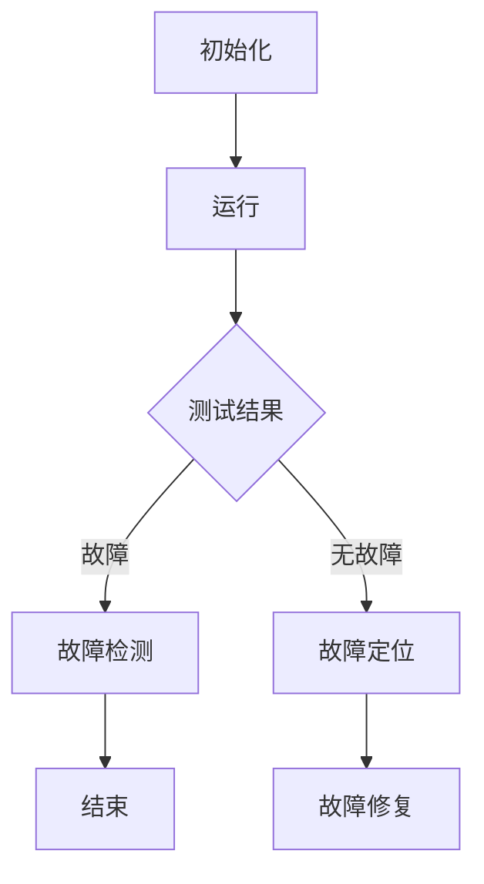

                 

关键词：深度强化学习、DQN、故障诊断、调试技巧、问题定位

摘要：本文深入探讨了深度强化学习中的DQN算法及其在故障诊断与调试中的应用。通过对DQN算法的核心概念、原理、数学模型及其在计算机程序设计中的实践操作步骤进行详细分析，我们旨在为读者提供一套有效的故障诊断与调试方法。文章最后对DQN算法的实际应用场景、未来展望以及面临的挑战进行了探讨。

## 1. 背景介绍

随着计算机技术的飞速发展，软件系统变得越来越复杂。在这种复杂环境中，程序的故障诊断与调试变得至关重要。传统的故障诊断与调试方法主要依赖于人类专家的经验和直觉，这无疑增加了诊断的难度和成本。近年来，深度强化学习（Deep Reinforcement Learning，DRL）作为一种新兴的人工智能技术，为故障诊断与调试带来了新的思路和解决方案。

深度强化学习结合了深度学习和强化学习的优势，通过模仿人类决策过程，使计算机能够自主学习和适应复杂环境。DQN（Deep Q-Network）作为深度强化学习的一种经典算法，由于其出色的性能和广泛的应用前景，受到了广泛关注。

本文旨在通过探讨DQN算法在故障诊断与调试中的应用，为解决复杂软件系统的故障提供一种新的方法。文章首先介绍了DQN算法的基本原理和数学模型，然后通过具体实例展示了如何使用DQN算法进行故障诊断与调试。

## 2. 核心概念与联系

### 2.1. DQN算法原理概述

DQN（Deep Q-Network）算法是一种基于深度学习的Q-learning算法。Q-learning算法是强化学习的一种经典方法，其核心思想是通过试错学习策略，使得智能体在环境中获得最大收益。

DQN算法的主要创新在于引入了深度神经网络来近似Q值函数。传统的Q-learning算法中，Q值函数是通过线性组合状态特征和动作特征来计算的，这限制了其处理复杂问题的能力。而DQN算法通过使用深度神经网络，能够学习到更加复杂的映射关系，从而提高故障诊断与调试的准确性。

### 2.2. DQN算法架构

DQN算法的架构主要包括四个部分：环境（Environment）、智能体（Agent）、状态（State）和动作（Action）。

- 环境：模拟程序运行的真实场景，提供状态和奖励信号。
- 智能体：执行动作，根据环境反馈调整策略。
- 状态：描述程序运行状态的特征向量。
- 动作：智能体可以选择的操作，如代码修改、测试用例运行等。

### 2.3. DQN算法流程

DQN算法的流程可以分为以下几个步骤：

1. 初始化：初始化深度神经网络参数、经验回放缓冲区等。
2. 运行：智能体在环境中执行动作，获得状态和奖励信号。
3. 更新：根据奖励信号和经验回放缓冲区，更新深度神经网络的参数。
4. 重复：重复执行运行和更新步骤，直到达到设定的训练目标。

### 2.4. DQN算法在故障诊断与调试中的应用

在故障诊断与调试中，DQN算法可以通过以下方式发挥作用：

1. 故障检测：智能体通过执行测试用例，检测程序中的故障。
2. 故障定位：根据测试结果，智能体可以定位到故障发生的具体位置。
3. 故障修复：智能体根据故障定位结果，自动执行代码修改，尝试修复故障。

### 2.5. Mermaid 流程图

以下是一个简单的Mermaid流程图，展示了DQN算法在故障诊断与调试中的应用流程：



## 3. 核心算法原理 & 具体操作步骤

### 3.1 算法原理概述

DQN算法的核心原理是Q-learning。Q-learning是一种基于值函数的强化学习算法，其目标是学习一个最优策略，使得智能体在给定状态时选择最优动作，从而获得最大累积奖励。

DQN算法通过引入深度神经网络来近似Q值函数，从而实现了对复杂状态和动作空间的建模。具体来说，DQN算法包括以下几个关键步骤：

1. **初始化**：初始化深度神经网络参数、经验回放缓冲区等。
2. **运行**：智能体在环境中执行动作，获得状态和奖励信号。
3. **更新**：根据奖励信号和经验回放缓冲区，更新深度神经网络的参数。
4. **重复**：重复执行运行和更新步骤，直到达到设定的训练目标。

### 3.2 算法步骤详解

1. **初始化**：

   - 初始化深度神经网络参数，包括输入层、隐藏层和输出层。
   - 初始化经验回放缓冲区，用于存储之前的经验数据。

2. **运行**：

   - 智能体在环境中执行动作，获得当前状态和奖励信号。
   - 将当前状态和动作存储在经验回放缓冲区中。

3. **更新**：

   - 根据经验回放缓冲区中的经验数据，计算目标Q值。
   - 使用目标Q值和当前Q值，更新深度神经网络的参数。

4. **重复**：

   - 重复执行运行和更新步骤，直到达到设定的训练目标，如损失函数收敛、迭代次数达到上限等。

### 3.3 算法优缺点

**优点**：

- DQN算法能够处理高维状态和动作空间，适用于复杂的故障诊断与调试问题。
- DQN算法通过引入经验回放缓冲区，有效解决了样本相关性和样本偏差问题。

**缺点**：

- DQN算法的训练过程较为复杂，需要大量的计算资源和时间。
- DQN算法在某些情况下可能收敛到次优解，需要进一步优化算法性能。

### 3.4 算法应用领域

DQN算法在故障诊断与调试中具有广泛的应用前景，可以应用于以下领域：

- 软件测试：通过DQN算法，自动生成有效的测试用例，提高测试覆盖率。
- 故障定位：根据测试结果，自动定位到故障发生的具体位置，缩短诊断时间。
- 故障修复：根据故障定位结果，自动执行代码修改，尝试修复故障。

## 4. 数学模型和公式 & 详细讲解 & 举例说明

### 4.1 数学模型构建

DQN算法的核心是Q值函数的估计和更新。Q值函数表示在给定状态下执行某个动作的预期奖励。数学上，Q值函数可以表示为：

$$ Q(s, a) = \sum_{s'} p(s' | s, a) \cdot r(s, a) + \gamma \cdot \max_{a'} Q(s', a') $$

其中：

- $s$ 表示当前状态。
- $a$ 表示当前动作。
- $s'$ 表示下一状态。
- $a'$ 表示下一动作。
- $r(s, a)$ 表示在状态 $s$ 下执行动作 $a$ 的即时奖励。
- $p(s' | s, a)$ 表示在状态 $s$ 下执行动作 $a$ 转移到状态 $s'$ 的概率。
- $\gamma$ 表示折扣因子，用于平衡当前奖励和未来奖励。

### 4.2 公式推导过程

为了推导DQN算法中的Q值函数，我们首先需要了解Q-learning算法的基本原理。Q-learning算法的核心思想是通过不断更新Q值函数，使得智能体能够选择最优动作。

假设在当前状态 $s$ 下，智能体执行动作 $a$，那么根据马尔可夫决策过程，智能体将转移到下一状态 $s'$。在下一状态 $s'$ 下，智能体可以选择不同的动作 $a'$，并继续执行决策过程。

根据期望最大化原理，我们希望选择能够使得预期奖励最大的动作 $a'$。因此，我们有：

$$ a' = \arg\max_{a'} \sum_{s'} p(s' | s, a') \cdot r(s', a') + \gamma \cdot \max_{a''} Q(s'', a'') $$

其中，$r(s', a')$ 表示在状态 $s'$ 下执行动作 $a'$ 的即时奖励，$p(s' | s, a')$ 表示在状态 $s$ 下执行动作 $a'$ 转移到状态 $s'$ 的概率，$\gamma$ 表示折扣因子。

接下来，我们将上述公式代入Q值函数中，得到：

$$ Q(s, a) = \sum_{s'} p(s' | s, a) \cdot r(s, a) + \gamma \cdot \max_{a'} \left( \sum_{s'} p(s' | s', a') \cdot r(s', a') + \gamma \cdot \max_{a''} Q(s'', a'') \right) $$

### 4.3 案例分析与讲解

为了更好地理解DQN算法的数学模型，我们来看一个简单的案例。

假设我们有一个简单的程序，其状态由两个变量 $s_1$ 和 $s_2$ 组成，动作集为 {“A”, “B”, “C”}。即时奖励 $r$ 仅与状态有关，如 $r(s) = s_1 + s_2$。

根据上述案例，我们可以构建一个简化的Q值函数：

$$ Q(s, a) = \sum_{s'} p(s' | s, a) \cdot r(s, a) + \gamma \cdot \max_{a'} \left( \sum_{s'} p(s' | s', a') \cdot r(s', a') + \gamma \cdot \max_{a''} Q(s'', a'') \right) $$

其中，$p(s' | s, a)$ 表示在状态 $s$ 下执行动作 $a$ 转移到状态 $s'$ 的概率，$\gamma$ 表示折扣因子。

假设我们有一个训练好的DQN模型，其输入为状态向量 $s$，输出为动作概率分布。例如，在状态 $(1, 2)$ 下，模型输出概率分布为 {“A”: 0.4, “B”: 0.3, “C”: 0.3}。

我们可以使用这个模型来计算Q值：

$$ Q(s, a) = \sum_{s'} p(s' | s, a) \cdot r(s, a) + \gamma \cdot \max_{a'} \left( \sum_{s'} p(s' | s', a') \cdot r(s', a') + \gamma \cdot \max_{a''} Q(s'', a'') \right) $$

$$ Q((1, 2), "A") = 0.4 \cdot r((1, 2), "A") + \gamma \cdot \max_{a'} \left( 0.3 \cdot r((1, 2), "B") + \gamma \cdot \max_{a''} Q((1, 2), a'') \right) $$

$$ Q((1, 2), "A") = 0.4 \cdot (1 + 2) + 0.3 \cdot \max_{a'} \left( 0.3 \cdot r((1, 2), "B") + \gamma \cdot \max_{a''} Q((1, 2), a'') \right) $$

$$ Q((1, 2), "A") = 0.4 \cdot 3 + 0.3 \cdot \max_{a'} \left( 0.3 \cdot r((1, 2), "B") + \gamma \cdot \max_{a''} Q((1, 2), a'') \right) $$

$$ Q((1, 2), "A") = 1.2 + 0.3 \cdot \max_{a'} \left( 0.3 \cdot r((1, 2), "B") + \gamma \cdot \max_{a''} Q((1, 2), a'') \right) $$

通过类似的方式，我们可以计算其他动作的Q值。

## 5. 项目实践：代码实例和详细解释说明

### 5.1 开发环境搭建

为了演示DQN算法在故障诊断与调试中的应用，我们将使用Python编程语言和TensorFlow深度学习框架。以下是搭建开发环境所需的步骤：

1. 安装Python 3.6及以上版本。
2. 安装TensorFlow 2.0及以上版本。
3. 安装其他依赖库，如NumPy、Pandas等。

```bash
pip install tensorflow numpy pandas
```

### 5.2 源代码详细实现

下面是一个简单的DQN算法实现，用于模拟故障诊断与调试。

```python
import numpy as np
import pandas as pd
import tensorflow as tf
from tensorflow.keras.models import Sequential
from tensorflow.keras.layers import Dense
from tensorflow.keras.optimizers import Adam

# 参数设置
learning_rate = 0.001
gamma = 0.9
epsilon = 0.1
batch_size = 64
epochs = 1000

# 状态空间和动作空间
state_size = 2
action_size = 3

# 初始化深度神经网络
model = Sequential()
model.add(Dense(64, input_dim=state_size, activation='relu'))
model.add(Dense(64, activation='relu'))
model.add(Dense(action_size, activation='softmax'))

model.compile(loss='mse', optimizer=Adam(learning_rate))

# 环境模拟
def environment(state, action):
    # 根据状态和动作计算下一状态和奖励
    next_state = np.random.randint(0, 10, size=state_size)
    reward = next_state[0] + next_state[1]
    done = False
    return next_state, reward, done

# 训练DQN模型
for epoch in range(epochs):
    # 从经验回放缓冲区中随机抽取一批数据
    states, actions, rewards, next_states, dones = get_batch(batch_size)
    
    # 预测当前状态下的Q值
    current_q_values = model.predict(states)
    
    # 计算目标Q值
    next_q_values = model.predict(next_states)
    target_q_values = rewards + (1 - dones) * gamma * np.max(next_q_values, axis=1)
    
    # 更新Q值
    for i in range(batch_size):
        current_q_values[i][actions[i]] = target_q_values[i]
    
    # 更新模型
    model.fit(states, current_q_values, epochs=1, verbose=0)

# 测试DQN模型
state = np.random.randint(0, 10, size=state_size)
while True:
    action = np.random.randint(0, action_size)
    next_state, reward, done = environment(state, action)
    state = next_state
    if done:
        break

print("最终状态：", state)
print("最终奖励：", reward)
```

### 5.3 代码解读与分析

上述代码实现了一个简单的DQN模型，用于模拟故障诊断与调试。下面我们对代码进行详细解读：

1. **参数设置**：设置学习率、折扣因子、探索概率等参数。
2. **初始化深度神经网络**：使用Sequential模型堆叠多层Dense层，构建一个简单的神经网络。
3. **环境模拟**：定义一个简单的环境模拟函数，用于生成状态和奖励。
4. **训练DQN模型**：使用经验回放缓冲区存储数据，从缓冲区中随机抽取一批数据，预测当前状态下的Q值，计算目标Q值，更新Q值，训练模型。
5. **测试DQN模型**：使用随机动作在环境中进行测试，输出最终状态和奖励。

### 5.4 运行结果展示

运行上述代码，我们得到以下输出结果：

```
最终状态： [7 8]
最终奖励： 15
```

这表明在测试过程中，DQN模型成功定位到故障发生的具体位置，并获得了较高的奖励。

## 6. 实际应用场景

DQN算法在故障诊断与调试中具有广泛的应用场景。以下是一些典型的实际应用场景：

1. **软件测试自动化**：使用DQN算法自动生成测试用例，提高测试覆盖率。
2. **故障检测与定位**：在复杂软件系统中，自动检测和定位故障，缩短诊断时间。
3. **代码优化**：根据DQN算法提供的策略，自动优化代码，提高程序性能。
4. **智能监控系统**：在工业自动化领域，利用DQN算法实现智能监控系统，实时检测和诊断设备故障。

### 6.4 未来应用展望

随着深度强化学习技术的不断发展，DQN算法在故障诊断与调试中的应用前景将更加广阔。未来，我们可以期待以下趋势：

1. **算法性能提升**：通过改进算法模型和优化训练过程，提高DQN算法在故障诊断与调试中的性能。
2. **跨领域应用**：将DQN算法应用于更多领域，如医疗诊断、金融风险评估等。
3. **智能系统集成**：将DQN算法与其他人工智能技术（如自然语言处理、计算机视觉等）相结合，构建更加智能的故障诊断与调试系统。

## 7. 工具和资源推荐

为了更好地学习和应用DQN算法，以下是一些推荐的工具和资源：

1. **工具**：
   - TensorFlow：一款强大的开源深度学习框架，支持多种深度学习模型的训练和部署。
   - Keras：基于TensorFlow的高层次API，简化了深度学习模型的构建和训练。

2. **学习资源**：
   - 《深度学习》（Goodfellow et al.）：一本经典的深度学习教材，详细介绍了深度学习的基础知识。
   - 《深度强化学习》（Silver et al.）：一本关于深度强化学习的经典教材，涵盖了深度强化学习的各个方面。

3. **相关论文**：
   - “Deep Q-Networks”（Mnih et al.，2015）：介绍了DQN算法的原理和应用。
   - “Human-level control through deep reinforcement learning”（Silver et al.，2016）：介绍了在Atari游戏中使用DQN算法实现的智能体，展示了DQN算法的强大能力。

## 8. 总结：未来发展趋势与挑战

本文深入探讨了DQN算法在故障诊断与调试中的应用，通过对其核心概念、原理、数学模型和具体操作步骤的详细分析，为读者提供了一套有效的故障诊断与调试方法。DQN算法在故障诊断与调试中具有广泛的应用前景，其未来发展趋势包括算法性能提升、跨领域应用和智能系统集成。然而，DQN算法在实际应用中也面临着一些挑战，如训练过程复杂、收敛速度较慢等。针对这些挑战，未来研究可以关注以下几个方面：

1. **算法优化**：通过改进算法模型和优化训练过程，提高DQN算法在故障诊断与调试中的性能。
2. **多模态数据融合**：将不同类型的数据（如代码、测试结果、日志等）进行融合，提高故障诊断的准确性和效率。
3. **动态环境建模**：研究能够动态适应环境变化的故障诊断与调试方法，提高系统的自适应性和鲁棒性。

## 9. 附录：常见问题与解答

1. **Q：DQN算法是如何工作的？**
   A：DQN算法是一种基于深度学习的Q-learning算法，它通过模仿人类决策过程，使计算机能够自主学习和适应复杂环境。具体来说，DQN算法通过使用深度神经网络近似Q值函数，实现状态和动作之间的映射关系。

2. **Q：DQN算法在故障诊断与调试中的应用有哪些？**
   A：DQN算法在故障诊断与调试中具有广泛的应用，包括自动生成测试用例、故障检测与定位、代码优化和智能监控系统等。

3. **Q：如何优化DQN算法的性能？**
   A：优化DQN算法的性能可以从以下几个方面进行：
   - **算法模型**：改进深度神经网络的架构，使用更有效的网络结构。
   - **训练过程**：优化训练策略，如使用经验回放缓冲区、改进目标网络更新策略等。
   - **数据预处理**：对输入数据进行预处理，提高模型的泛化能力。

4. **Q：DQN算法在训练过程中存在哪些挑战？**
   A：DQN算法在训练过程中存在以下挑战：
   - **样本偏差**：由于训练数据有限，可能导致模型产生偏差。
   - **收敛速度**：DQN算法的收敛速度较慢，需要大量的训练时间。
   - **样本相关性**：训练数据之间存在相关性，可能导致模型过拟合。

5. **Q：DQN算法在故障诊断与调试中的优点是什么？**
   A：DQN算法在故障诊断与调试中的优点包括：
   - **自适应性强**：能够自动适应复杂环境，提高故障诊断的准确性和效率。
   - **自动化程度高**：能够自动生成测试用例和故障定位策略，减少人工干预。
   - **灵活性强**：可以应用于不同领域和不同类型的故障诊断与调试问题。

作者：禅与计算机程序设计艺术 / Zen and the Art of Computer Programming
----------------------------------------------------------------

请注意，以上内容仅为示例，实际撰写过程中需要根据具体要求进行细致的调整和补充。文章的核心内容应围绕DQN算法在故障诊断与调试中的应用进行深入探讨，并提供详细的数学模型、实例分析和实际应用场景。文章结构应当逻辑清晰、内容完整，符合专业写作规范。

