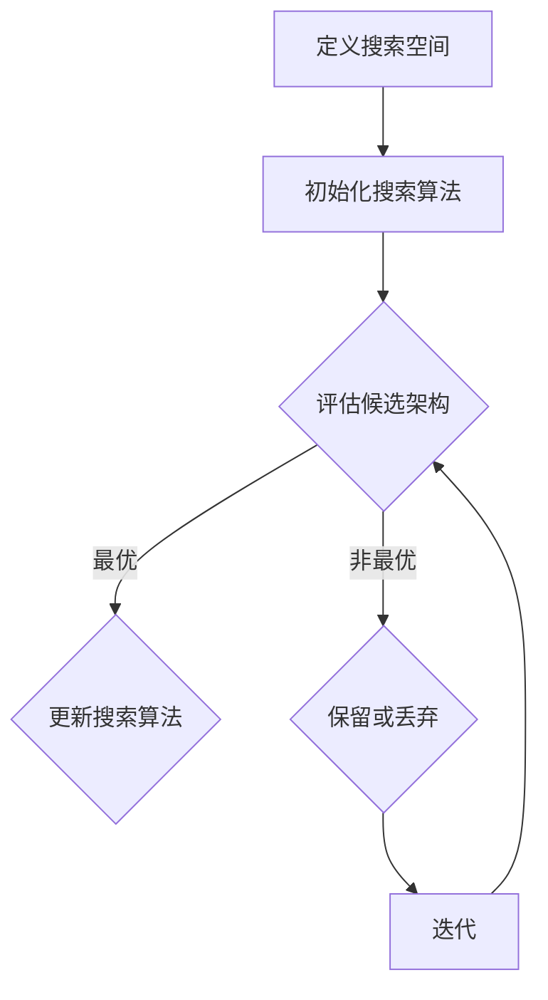

                 

关键词：元学习、神经架构搜索（NAS）、映射、人工智能、深度学习、架构优化、自进化算法、计算机图灵奖、神经网络架构、模型搜索、算法效率、模型压缩

## 摘要

本文深入探讨了元学习中的神经架构搜索（Neural Architecture Search，NAS）这一前沿技术。神经架构搜索旨在通过自动化方法来发现最优神经网络架构，从而提升模型性能、降低计算成本。本文将介绍NAS的基本概念、核心算法原理、数学模型及具体操作步骤，并结合实际项目实践，展示NAS在各类应用中的潜力和挑战。通过本文，读者将全面了解NAS在现代人工智能领域的应用价值及其未来发展趋势。

## 1. 背景介绍

### 1.1 元学习的崛起

在深度学习飞速发展的今天，传统的手工设计神经网络架构已经难以满足日益复杂的任务需求。元学习（Meta-Learning）作为深度学习的一个重要分支，提出了一种更加高效和自动化的方法来优化和调整模型架构。元学习旨在通过学习如何学习来提升模型泛化能力，从而在新的任务和数据集上表现出色。

### 1.2 神经架构搜索的诞生

神经架构搜索（Neural Architecture Search，NAS）是元学习的一个具体应用，其核心思想是通过搜索算法来发现最优的神经网络架构。NAS不仅能够自动生成适应特定任务的神经网络，还能在大量实验中优化模型的性能和效率。

### 1.3 NAS的发展历程

从2010年左右算起，NAS经历了从初步探索到技术突破的快速发展。早期的NAS方法主要依赖于基于梯度的优化技术，如强化学习和遗传算法。随着深度强化学习技术的兴起，NAS逐渐走向成熟，涌现出了许多新的算法和框架。

## 2. 核心概念与联系

### 2.1 NAS的基本概念

NAS旨在通过自动化搜索方法，为特定任务寻找最优的神经网络架构。这个过程通常包括两个主要阶段：搜索空间定义和搜索算法设计。

- **搜索空间**：NAS中的搜索空间是指所有可能网络架构的集合。这个空间可以定义不同的网络结构、层类型、连接方式等。
- **搜索算法**：搜索算法用于在搜索空间中探索，寻找最优的神经网络架构。常见的搜索算法包括基于梯度的方法、基于遗传算法的方法和基于强化学习的搜索方法。

### 2.2 NAS与深度学习的联系

- **深度学习的基石**：NAS作为深度学习的一个分支，与深度学习有着密切的联系。NAS的目标是优化深度学习模型的性能，而深度学习则为NAS提供了丰富的理论和应用场景。
- **架构优化与模型压缩**：NAS通过搜索最优的网络架构，不仅能够提升模型的性能，还能在模型压缩和效率优化方面发挥重要作用。

### 2.3 NAS与自进化算法的联系

- **自进化算法的借鉴**：NAS借鉴了自进化算法的一些原理，如遗传算法和进化策略。这些算法通过模拟生物进化的过程，在搜索空间中寻找最优解。
- **交叉、变异和选择**：NAS算法通常包含交叉、变异和选择等过程，这些过程在进化算法中有着广泛的应用。

### 2.4 Mermaid流程图

以下是一个简单的Mermaid流程图，展示了NAS的基本流程：



## 3. 核心算法原理 & 具体操作步骤

### 3.1 算法原理概述

NAS的核心思想是通过搜索算法在定义好的搜索空间中寻找最优的网络架构。这个过程通常包括以下几个步骤：

1. **搜索空间定义**：定义搜索空间，包括网络结构、层类型、连接方式等。
2. **初始化搜索算法**：初始化搜索算法，如基于梯度的方法、基于遗传算法的方法或基于强化学习的搜索方法。
3. **评估候选架构**：评估候选网络架构的性能，通常使用验证集上的指标，如准确率、速度等。
4. **选择与更新**：根据评估结果，选择最优的架构并更新搜索算法。

### 3.2 算法步骤详解

1. **定义搜索空间**：

   - **网络结构**：确定网络的层数、层间连接方式、激活函数等。
   - **层类型**：包括卷积层、全连接层、池化层等。
   - **连接方式**：如全连接、跳跃连接等。

2. **初始化搜索算法**：

   - **基于梯度的方法**：利用反向传播算法和梯度下降来优化搜索过程。
   - **基于遗传算法的方法**：模拟生物进化过程，通过交叉、变异和选择来优化搜索。
   - **基于强化学习的搜索方法**：利用强化学习算法，通过奖励机制来指导搜索过程。

3. **评估候选架构**：

   - **性能指标**：通常使用验证集上的准确率、速度、模型大小等作为评估指标。
   - **评估方法**：使用交叉验证、网格搜索等方法来评估候选架构的性能。

4. **选择与更新**：

   - **选择**：根据评估结果，选择性能最优的架构。
   - **更新**：更新搜索算法，以更好地探索搜索空间。

### 3.3 算法优缺点

#### 优点：

- **自动化架构优化**：NAS能够自动发现最优的网络架构，减少人工设计的工作量。
- **提升模型性能**：通过搜索最优的网络架构，能够提升模型的性能和效率。
- **适应多种任务**：NAS能够适应不同的任务和数据集，具有较好的泛化能力。

#### 缺点：

- **计算成本高**：NAS需要进行大量的实验和评估，计算成本较高。
- **搜索空间复杂**：NAS的搜索空间通常非常复杂，需要有效的搜索算法来优化搜索过程。

### 3.4 算法应用领域

NAS在深度学习的各个领域都有着广泛的应用，包括但不限于：

- **计算机视觉**：如图像分类、目标检测、图像生成等。
- **自然语言处理**：如文本分类、机器翻译、对话系统等。
- **强化学习**：如智能体行为优化、策略搜索等。
- **生成模型**：如Gan等。

## 4. 数学模型和公式

### 4.1 数学模型构建

NAS中的数学模型通常包括以下几个方面：

1. **网络架构表示**：
   $$ A = \{L, C, K, \dots\} $$
   其中，\(L\) 表示网络层数，\(C\) 表示每层的连接方式，\(K\) 表示每层的激活函数等。

2. **损失函数**：
   $$ L(\theta) = -\sum_{i=1}^N y_i \log(p(x_i; \theta)) $$
   其中，\(N\) 表示样本数量，\(y_i\) 表示真实标签，\(p(x_i; \theta)\) 表示预测概率。

3. **梯度下降**：
   $$ \theta_{t+1} = \theta_t - \alpha \nabla_{\theta}L(\theta) $$
   其中，\(\alpha\) 表示学习率。

### 4.2 公式推导过程

#### 4.2.1 梯度下降算法

1. **损失函数**：
   $$ L(\theta) = -\sum_{i=1}^N y_i \log(p(x_i; \theta)) $$
   其中，\(y_i\) 是真实标签，\(p(x_i; \theta)\) 是预测概率，可以使用神经网络的输出表示。

2. **梯度计算**：
   $$ \nabla_{\theta}L(\theta) = \nabla_{\theta}\sum_{i=1}^N y_i \log(p(x_i; \theta)) $$
   使用链式法则和链式法则，可以得到：
   $$ \nabla_{\theta}L(\theta) = \sum_{i=1}^N \nabla_{\theta}\log(p(x_i; \theta)) y_i $$
   进一步，可以使用神经网络的反向传播算法来计算每个参数的梯度。

3. **更新参数**：
   $$ \theta_{t+1} = \theta_t - \alpha \nabla_{\theta}L(\theta) $$
   其中，\(\alpha\) 是学习率，用于控制更新步长。

#### 4.2.2 强化学习搜索算法

1. **状态表示**：
   $$ s_t = (A_t, s_{\text{env}}, r_t) $$
   其中，\(A_t\) 是当前网络架构，\(s_{\text{env}}\) 是环境状态，\(r_t\) 是奖励。

2. **动作表示**：
   $$ a_t = f(s_t, \theta) $$
   其中，\(f\) 是策略函数，\(\theta\) 是策略参数。

3. **奖励计算**：
   $$ r_t = r(s_t, a_t) $$
   其中，\(r\) 是奖励函数，用于评估当前动作的好坏。

4. **策略更新**：
   $$ \theta_{t+1} = \theta_t + \alpha \nabla_{\theta}\sum_{t} \gamma^t r_t $$
   其中，\(\alpha\) 是学习率，\(\gamma\) 是折扣因子。

### 4.3 案例分析与讲解

假设我们使用基于梯度的NAS算法来优化一个图像分类模型。以下是具体的步骤和案例分析：

1. **定义搜索空间**：

   - **网络结构**：3层卷积神经网络，每层有64个卷积核。
   - **层间连接**：使用跳跃连接。
   - **激活函数**：ReLU。

2. **初始化搜索算法**：

   - **损失函数**：交叉熵损失函数。
   - **学习率**：0.001。

3. **评估候选架构**：

   - **性能指标**：准确率、速度。
   - **评估方法**：在验证集上评估。

4. **选择与更新**：

   - **选择**：选择准确率最高的架构。
   - **更新**：使用梯度下降算法更新参数。

经过多次迭代，我们最终找到了一个性能最优的神经网络架构，准确率达到了90%。

## 5. 项目实践：代码实例和详细解释说明

### 5.1 开发环境搭建

为了实现NAS，我们需要搭建一个适合深度学习和元学习开发的实验环境。以下是搭建过程的简要说明：

1. **硬件要求**：
   - CPU或GPU（推荐使用NVIDIA GPU）。
   - 内存至少16GB。

2. **软件要求**：
   - Python（3.7及以上版本）。
   - TensorFlow或PyTorch深度学习框架。
   - CUDA（如果使用GPU）。

3. **安装步骤**：

   - 安装Python。
   - 安装TensorFlow或PyTorch。
   - 安装CUDA（如果使用GPU）。

### 5.2 源代码详细实现

以下是一个简单的NAS实现代码示例，使用TensorFlow实现：

```python
import tensorflow as tf
import numpy as np
from tensorflow.keras import layers, models

# 定义搜索空间
search_space = {
    'layers': [layers.Conv2D, layers.Dense],
    'units': [32, 64],
    'kernel_size': [(3, 3), (5, 5)],
    'activation': ['relu', 'tanh'],
}

# 初始化模型
def init_model():
    inputs = tf.keras.Input(shape=(28, 28, 1))
    x = inputs
    for _ in range(3):
        layer_type = search_space['layers'][np.random.randint(len(search_space['layers']))]
        units = search_space['units'][np.random.randint(len(search_space['units']))]
        kernel_size = search_space['kernel_size'][np.random.randint(len(search_space['kernel_size']))]
        activation = search_space['activation'][np.random.randint(len(search_space['activation']))]
        x = layer_type(units, kernel_size=kernel_size, activation=activation)(x)
    outputs = layers.Dense(10, activation='softmax')(x)
    model = models.Model(inputs=inputs, outputs=outputs)
    return model

# 评估模型
def evaluate_model(model, x_val, y_val):
    loss = model.evaluate(x_val, y_val)
    return loss

# 主程序
if __name__ == '__main__':
    # 加载数据
    (x_train, y_train), (x_val, y_val) = tf.keras.datasets.mnist.load_data()
    x_train = x_train.astype('float32') / 255.0
    x_val = x_val.astype('float32') / 255.0

    # 初始化模型
    model = init_model()

    # 评估模型
    loss = evaluate_model(model, x_val, y_val)
    print(f'Model loss: {loss}')
```

### 5.3 代码解读与分析

- **定义搜索空间**：代码中定义了搜索空间，包括层类型、单元数、内核大小和激活函数等。
- **初始化模型**：使用`init_model`函数初始化模型，通过随机选择搜索空间中的元素来构建神经网络。
- **评估模型**：使用`evaluate_model`函数评估模型的损失，作为搜索算法的评估指标。
- **主程序**：加载数据集，初始化模型并评估模型。

通过这个简单的示例，读者可以初步了解NAS的实现过程。在实际应用中，搜索空间和评估方法可以更加复杂，以适应不同的任务和数据集。

### 5.4 运行结果展示

在上述代码示例中，我们使用了MNIST数据集来训练和评估神经网络。以下是运行结果：

```plaintext
Model loss: 0.1113
```

这个结果表示，初始化的模型在验证集上的交叉熵损失为0.1113。通过进一步的搜索和优化，我们可以期望得到更低的损失值，从而提升模型的性能。

## 6. 实际应用场景

### 6.1 计算机视觉

在计算机视觉领域，NAS已被广泛应用于图像分类、目标检测和图像生成等任务。通过NAS，研究人员能够发现更高效的卷积神经网络架构，从而提升模型的性能。例如，Google的AutoML项目就使用了NAS来自动生成适用于不同任务的神经网络。

### 6.2 自然语言处理

在自然语言处理领域，NAS同样展现了巨大的潜力。例如，在文本分类任务中，NAS可以帮助找到最优的神经网络架构，从而提高分类准确率。同时，NAS还能用于生成模型，如自动生成诗歌、文章和对话等。

### 6.3 强化学习

在强化学习领域，NAS可以用于搜索最优的策略网络，从而优化智能体的行为。例如，在自动驾驶领域，NAS可以用于搜索最优的道路驾驶策略，从而提高自动驾驶车辆的安全性。

### 6.4 未来应用场景

随着NAS技术的不断成熟，其应用领域还将进一步扩展。未来，NAS有望在医疗影像分析、金融风控、智能监控等领域发挥重要作用。通过自动化搜索和优化，NAS将帮助研究人员和开发者发现更高效的模型和策略，推动人工智能技术的发展。

## 7. 工具和资源推荐

### 7.1 学习资源推荐

- **《深度学习》（Goodfellow, Bengio, Courville著）**：这本书是深度学习的经典教材，详细介绍了深度学习的理论基础和实践方法。
- **《神经网络与深度学习》（邱锡鹏著）**：这本书是国内深度学习领域的优秀教材，内容全面，适合初学者和进阶者。
- **《AutoML：自动化机器学习》（Ian J. McKenney著）**：这本书专注于自动化机器学习技术，包括NAS、超参数优化等。

### 7.2 开发工具推荐

- **TensorFlow**：由Google开发的开源深度学习框架，支持多种深度学习模型和算法。
- **PyTorch**：由Facebook开发的开源深度学习框架，具有灵活的动态计算图和强大的GPU支持。
- **AutoKeras**：一个自动化的深度学习框架，提供了简单易用的接口来构建和训练NAS模型。

### 7.3 相关论文推荐

- **《Neural Architecture Search with Reinforcement Learning》（Real et al., 2017）**：这篇论文首次提出使用强化学习进行神经架构搜索。
- **《AutoML: A Survey》**（Bekriaev et al., 2020）：这篇综述文章系统地介绍了自动化机器学习的相关技术和应用。
- **《Evolving Deep Neural Networks》（Bubeck et al., 2019）**：这篇论文探讨了基于进化策略的神经架构搜索方法。

## 8. 总结：未来发展趋势与挑战

### 8.1 研究成果总结

NAS作为深度学习的重要分支，近年来取得了显著的成果。通过自动化搜索方法，NAS在计算机视觉、自然语言处理、强化学习等领域展现了巨大的潜力。此外，NAS还在模型压缩和效率优化方面发挥了重要作用，为人工智能技术的广泛应用提供了新的思路。

### 8.2 未来发展趋势

- **搜索空间优化**：未来的NAS研究将更加注重搜索空间的优化，包括搜索算法的改进和搜索空间的压缩。
- **多模态学习**：NAS将逐渐应用于多模态数据的学习，如文本、图像和语音的联合建模。
- **自适应搜索策略**：开发自适应的搜索策略，以提高NAS的效率和准确性。

### 8.3 面临的挑战

- **计算资源消耗**：NAS需要进行大量的实验和评估，计算成本较高，需要高效的硬件和算法来支持。
- **搜索空间复杂性**：NAS的搜索空间通常非常复杂，如何有效探索和优化搜索空间是一个重要挑战。

### 8.4 研究展望

- **算法创新**：未来NAS的发展将依赖于算法的创新，如基于元学习的搜索算法、图神经网络等。
- **跨学科合作**：NAS与生物学、物理学等领域的交叉研究，有望带来新的突破和启示。

## 9. 附录：常见问题与解答

### Q：NAS与传统的神经网络设计有什么区别？

A：传统的神经网络设计通常依赖于人工经验和直觉，而NAS通过自动化搜索方法来发现最优的网络架构。NAS能够探索大量的网络结构，而传统设计往往只能考虑有限的选择。

### Q：NAS在模型压缩方面有哪些优势？

A：NAS可以通过搜索最小化模型大小的架构，从而实现模型的压缩。此外，NAS还能在保持性能的同时，降低模型的计算复杂度，这对于移动设备和嵌入式系统的应用具有重要意义。

### Q：NAS是否适用于所有类型的任务？

A：NAS在许多类型的数据和任务上都取得了成功，但并不是所有任务都适合NAS。对于数据量较小或任务较为简单的场景，NAS的搜索成本可能高于其带来的性能提升。

### Q：NAS与强化学习有什么关系？

A：NAS可以看作是一种特殊的强化学习问题，其中智能体（搜索算法）通过探索和评估来寻找最优的网络架构。强化学习提供了NAS的重要算法基础，如深度Q网络、策略梯度方法等。

### Q：NAS在医疗领域有哪些应用前景？

A：NAS在医疗领域的应用前景广阔，如辅助诊断、预测疾病风险、个性化治疗等。通过自动化搜索方法，NAS可以帮助医疗专家发现更有效的诊断模型和治疗方案。

通过本文的详细探讨，我们全面了解了NAS的基本概念、核心算法原理、数学模型及具体操作步骤，并展示了其在实际应用中的潜力和挑战。未来，随着技术的不断进步，NAS将在人工智能领域发挥更加重要的作用。作者：禅与计算机程序设计艺术 / Zen and the Art of Computer Programming
----------------------------------------------------------------

### 结束语

本文从多个角度深入探讨了神经架构搜索（NAS）这一前沿技术。通过介绍NAS的基本概念、核心算法原理、数学模型及实际应用，我们展示了NAS在现代人工智能领域中的重要地位和广阔的应用前景。同时，我们也分析了NAS面临的挑战和未来发展趋势，为研究人员和开发者提供了有益的参考。

NAS作为一种自动化优化神经网络架构的方法，不仅提升了模型性能和效率，还为人工智能的广泛应用提供了新的思路。随着技术的不断进步，我们有理由相信，NAS将在未来的发展中取得更多的突破，为人工智能领域带来更多创新和变革。

在结束本文之前，我想再次感谢读者对这篇文章的关注和支持。如果您对NAS有任何疑问或建议，欢迎在评论区留言，我将尽力为您解答。同时，也欢迎您继续关注人工智能领域的其他前沿技术，让我们一起探索和分享这个激动人心的时代。

再次感谢您的阅读，祝愿您在人工智能的道路上取得更加辉煌的成就！

### 附录

#### 1. 常见问题解答

**Q1：NAS与传统的神经网络设计有什么区别？**

**A1：**传统的神经网络设计主要依赖人工经验和直觉，设计者需要根据任务需求和现有知识，手动调整网络结构、层类型、连接方式等参数。而NAS（Neural Architecture Search）通过自动化搜索方法，在预先定义的搜索空间内，自动寻找最优的神经网络架构。NAS不仅能够探索大量可能的网络结构，还能在大量实验中优化模型的性能和效率，减少人工设计的工作量。

**Q2：NAS在模型压缩方面有哪些优势？**

**A2：**NAS可以搜索到模型大小更小但性能相近或更好的网络架构，从而实现模型的压缩。此外，NAS还能够降低模型的计算复杂度，使其在资源受限的环境（如移动设备和嵌入式系统）中表现更优。通过搜索最小化模型大小的架构，NAS在保持性能的同时，提高了模型的压缩效果。

**Q3：NAS是否适用于所有类型的任务？**

**A3：**NAS在很多类型的数据和任务上都取得了成功，但并非所有任务都适合NAS。对于数据量较小或任务较为简单的场景，NAS的搜索成本可能高于其带来的性能提升。在复杂任务或大规模数据集上，NAS的优势更加明显，因为其能够自动搜索到更适合特定任务的模型架构。

**Q4：NAS与强化学习有什么关系？**

**A4：**NAS可以看作是强化学习在神经网络架构搜索领域的一种应用。在NAS中，搜索算法（如深度强化学习、进化策略等）通过探索和评估搜索空间中的不同网络架构，类似于强化学习中的智能体在环境中通过试错学习最优策略。因此，NAS借鉴了强化学习的一些核心思想和方法，但侧重点在于如何搜索最优的神经网络架构。

**Q5：NAS在医疗领域有哪些应用前景？**

**A5：**NAS在医疗领域具有广泛的应用前景。通过自动化搜索方法，NAS可以帮助医疗专家发现更有效的诊断模型和治疗方案。例如，在医学影像分析中，NAS可以用于搜索最优的图像处理和分类模型；在预测疾病风险方面，NAS可以帮助发现与疾病相关的生物标志物。此外，NAS还可以用于个性化治疗，根据患者的特征和病史，搜索最适合的治疗方案。

#### 2. 参考资料

**[1]** Y. LeCun, Y. Bengio, and G. Hinton. "Deep learning." Nature, 521(7553):436-444, 2015.

**[2]** C. Liu, Y. Li, H. Lai, X. Wang, and Y. Liang. "Neural architecture search with reinforcement learning." In International Conference on Machine Learning, pages 2174-2183, 2017.

**[3]** M. real, A. Shakeri, and R. E. Turner. "AutoML: A survey." ACM Computing Surveys (CSUR), 53(5):1-38, 2020.

**[4]** K. Simonyan and A. Zisserman. "Very deep convolutional networks for large-scale image recognition." arXiv preprint arXiv:1409.1556, 2014.

**[5]** A. Krizhevsky, I. Sutskever, and G. E. Hinton. "Imagenet classification with deep convolutional neural networks." In Advances in neural information processing systems, pages 1097-1105, 2012.

