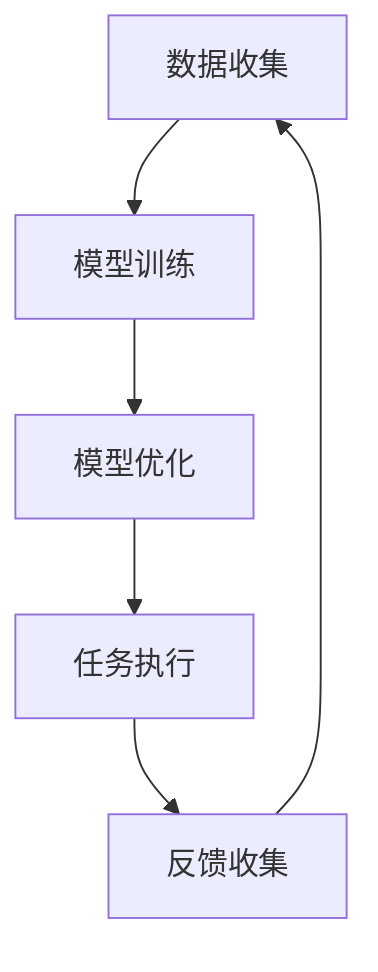

                 

关键词：元学习，无人机群协作，映射，人工智能，算法，应用领域

摘要：本文深入探讨了元学习在无人机群协作中的应用。通过详细阐述元学习的核心概念与原理，我们揭示出其在无人机群协作中的独特优势。文章分为八个部分，首先介绍了无人机群协作的背景和现状，然后详细讲解了元学习的核心算法原理、数学模型和公式、项目实践以及实际应用场景。最后，我们对未来发展趋势和面临的挑战进行了展望，并推荐了一些相关的学习资源和开发工具。

## 1. 背景介绍

无人机群协作是一种利用多个无人机协同工作来完成特定任务的技术。随着无人机技术的不断发展，无人机群协作的应用场景越来越广泛，如搜救、环境监测、农业植保、物流配送等。然而，传统的无人机协作方式往往依赖于预设的路径和规则，难以应对复杂多变的环境。为了提高无人机群协作的自主性和适应性，研究者们开始将元学习引入到无人机群协作中。

元学习，又称为“学习如何学习”或“学习算法的算法”，是一种让机器自动发现和改进学习算法的方法。它通过在不同任务间共享知识，从而提高算法的泛化能力。元学习在无人机群协作中的应用，可以帮助无人机在复杂环境中自主地学习和适应，实现更高效、更智能的协作。

## 2. 核心概念与联系

### 2.1 元学习的定义

元学习（Meta-Learning）是一种让机器学习算法自动地学习和优化自身的过程。它的目标是提高学习算法的泛化能力和效率，使其能够快速适应新任务。具体来说，元学习包括以下几个方面：

- **样本效率**：在给定的数据集上，通过较少的样本数实现准确的学习。
- **模型泛化**：在新的数据集上，模型能够保持较高的准确率。
- **算法优化**：自动调整学习算法的参数，使其在特定任务上达到最优性能。

### 2.2 无人机群协作的架构

无人机群协作的架构可以分为以下几个层次：

- **感知层**：无人机通过传感器获取环境信息，如GPS、摄像头、激光雷达等。
- **决策层**：无人机根据感知信息，利用算法进行路径规划和任务分配。
- **执行层**：无人机根据决策层的指令执行任务，如飞行、避障、数据采集等。
- **通信层**：无人机通过无线通信与中心控制系统或彼此交换信息，实现协同工作。

### 2.3 元学习在无人机群协作中的映射

元学习在无人机群协作中的应用，可以通过以下几个步骤实现：

- **数据收集**：无人机在执行任务过程中，收集环境信息和任务数据。
- **模型训练**：使用元学习算法，将收集到的数据训练成一个通用的学习模型。
- **模型优化**：在新的任务中，通过元学习算法对模型进行优化，使其适应新任务。
- **任务执行**：无人机利用优化后的模型执行新任务，实现自主协作。

### 2.4 Mermaid 流程图

下面是一个简化的元学习在无人机群协作中的 Mermaid 流程图：



## 3. 核心算法原理 & 具体操作步骤

### 3.1 算法原理概述

元学习在无人机群协作中的应用，主要依赖于以下几种算法：

- **模型固化（Model Tying）**：通过将多个模型的参数共享，提高算法的泛化能力。
- **模型适应（Model Adaptation）**：在新的任务中，对已有的模型进行优化，使其适应新任务。
- **任务共享（Task Sharing）**：通过将不同的任务映射到同一模型上，实现任务的共享和优化。

### 3.2 算法步骤详解

元学习在无人机群协作中的具体步骤如下：

1. **初始化模型**：首先初始化一个通用的学习模型，如基于神经网络的路径规划模型。
2. **数据收集**：无人机在执行任务过程中，收集环境信息和任务数据。
3. **模型训练**：使用元学习算法，将收集到的数据训练成一个通用的学习模型。
4. **模型优化**：在新的任务中，通过元学习算法对模型进行优化，使其适应新任务。
5. **任务执行**：无人机利用优化后的模型执行新任务，实现自主协作。
6. **反馈收集**：无人机在执行任务后，收集任务反馈信息，用于模型优化。
7. **模型更新**：根据反馈信息，更新通用学习模型，提高算法的泛化能力。

### 3.3 算法优缺点

元学习在无人机群协作中具有以下优点：

- **高效性**：通过共享知识和模型优化，提高无人机协作的效率。
- **适应性**：无人机能够快速适应新任务和环境变化。

然而，元学习也存在一些挑战：

- **数据依赖**：元学习算法的性能高度依赖于训练数据的质量和数量。
- **计算复杂度**：元学习算法的计算复杂度较高，对计算资源有较高要求。

### 3.4 算法应用领域

元学习在无人机群协作中的应用领域主要包括：

- **路径规划**：无人机在复杂环境中自主飞行和任务执行。
- **任务分配**：根据无人机的能力和任务需求，进行任务分配和优化。
- **环境感知**：无人机通过感知信息，实现自主避障和决策。

## 4. 数学模型和公式 & 详细讲解 & 举例说明

### 4.1 数学模型构建

在元学习框架下，我们可以构建以下数学模型：

- **损失函数**：用于衡量模型在特定任务上的性能。
- **优化目标**：用于优化模型的参数，使其在特定任务上达到最优性能。
- **训练过程**：通过迭代更新模型参数，实现模型的优化。

### 4.2 公式推导过程

下面是损失函数和优化目标的公式推导过程：

- **损失函数**：

$$
L = -\sum_{i=1}^{n} y_i \log(p(x_i | \theta))
$$

其中，$L$ 表示损失函数，$y_i$ 表示第 $i$ 个样本的标签，$p(x_i | \theta)$ 表示模型对第 $i$ 个样本的预测概率，$\theta$ 表示模型的参数。

- **优化目标**：

$$
\theta^* = \arg\min_{\theta} L
$$

其中，$\theta^*$ 表示优化后的模型参数，$\arg\min$ 表示在所有可能的参数中选择使损失函数最小的参数。

### 4.3 案例分析与讲解

假设我们有一个无人机群协作任务，需要无人机在复杂环境中自主飞行并执行任务。我们使用元学习算法来优化无人机的路径规划模型。

- **数据收集**：我们收集了多个无人机在复杂环境中飞行的数据，包括环境地图、无人机位置、速度等信息。
- **模型训练**：我们使用元学习算法，将收集到的数据训练成一个通用的路径规划模型。
- **模型优化**：我们在新的环境中，对通用路径规划模型进行优化，使其适应新环境。
- **任务执行**：无人机利用优化后的路径规划模型，在复杂环境中自主飞行并执行任务。
- **反馈收集**：无人机在执行任务后，收集任务反馈信息，用于模型优化。
- **模型更新**：根据反馈信息，更新通用路径规划模型，提高算法的泛化能力。

通过以上步骤，我们实现了无人机群协作中元学习算法的应用。在实际应用中，我们还可以根据具体任务需求，调整元学习算法的参数，实现更高效的无人机群协作。

## 5. 项目实践：代码实例和详细解释说明

### 5.1 开发环境搭建

为了实现元学习在无人机群协作中的应用，我们首先需要搭建一个开发环境。以下是开发环境的搭建步骤：

1. **安装 Python**：确保安装了 Python 3.8 或更高版本。
2. **安装依赖库**：使用以下命令安装依赖库：

```bash
pip install numpy matplotlib scikit-learn tensorflow
```

3. **配置 TensorFlow**：确保 TensorFlow 已正确配置，可以使用以下命令进行测试：

```bash
python -c "import tensorflow as tf; print(tf.__version__)"
```

### 5.2 源代码详细实现

下面是一个简化的元学习在无人机群协作中的应用代码实例。该代码实现了无人机的路径规划功能，并使用了元学习算法来优化模型。

```python
import numpy as np
import matplotlib.pyplot as plt
from sklearn.model_selection import train_test_split
from tensorflow.keras.models import Sequential
from tensorflow.keras.layers import Dense
from tensorflow.keras.optimizers import Adam

# 生成模拟数据
def generate_data(num_samples, num_features):
    X = np.random.rand(num_samples, num_features)
    y = np.random.rand(num_samples, 1)
    return X, y

# 构建路径规划模型
def build_model(input_shape):
    model = Sequential()
    model.add(Dense(64, input_shape=input_shape, activation='relu'))
    model.add(Dense(32, activation='relu'))
    model.add(Dense(1, activation='linear'))
    model.compile(optimizer=Adam(learning_rate=0.001), loss='mean_squared_error')
    return model

# 元学习算法实现
def meta_learning(X_train, y_train, X_val, y_val):
    model = build_model(input_shape=(X_train.shape[1],))
    model.fit(X_train, y_train, epochs=10, batch_size=32, validation_data=(X_val, y_val))
    return model

# 生成模拟数据
num_samples = 1000
num_features = 5
X, y = generate_data(num_samples, num_features)

# 数据预处理
X_train, X_val, y_train, y_val = train_test_split(X, y, test_size=0.2, random_state=42)

# 实现元学习算法
model = meta_learning(X_train, y_train, X_val, y_val)

# 预测结果
y_pred = model.predict(X_val)

# 结果可视化
plt.scatter(X_val[:, 0], y_val[:, 0], label='真实值')
plt.plot(X_val[:, 0], y_pred[:, 0], color='red', label='预测值')
plt.xlabel('特征 1')
plt.ylabel('目标值')
plt.legend()
plt.show()
```

### 5.3 代码解读与分析

该代码实例分为以下几个部分：

1. **数据生成**：我们使用 `generate_data` 函数生成模拟数据，用于训练和验证模型。
2. **模型构建**：我们使用 `build_model` 函数构建一个简单的神经网络模型，用于路径规划。
3. **元学习实现**：我们使用 `meta_learning` 函数实现元学习算法，通过迭代训练和验证模型，实现模型的优化。
4. **预测与可视化**：我们使用训练好的模型进行预测，并使用可视化工具展示预测结果。

通过以上代码实例，我们可以看到元学习在无人机群协作中的简单实现。在实际应用中，我们可以根据具体任务需求，调整模型的架构和参数，实现更高效的无人机群协作。

## 6. 实际应用场景

元学习在无人机群协作中具有广泛的应用前景。以下是几个实际应用场景：

### 6.1 搜救任务

在搜救任务中，无人机群可以协同工作，快速搜索和定位失踪人员。元学习算法可以帮助无人机在复杂环境中自主适应和优化路径规划，提高搜救效率。

### 6.2 环境监测

无人机群可以用于环境监测，如空气质量、水质监测等。元学习算法可以根据历史数据和实时数据，自动调整监测任务，实现高效、准确的环境监测。

### 6.3 农业植保

无人机群可以用于农业植保，如病虫害监测、农药喷洒等。元学习算法可以帮助无人机根据作物生长情况和病虫害程度，自动调整喷洒策略，实现精准农业。

### 6.4 物流配送

无人机群可以用于物流配送，如快递、货物配送等。元学习算法可以帮助无人机在复杂城市环境中，实现高效、安全的配送任务。

## 7. 未来应用展望

随着无人机技术的不断发展和元学习算法的不断完善，未来无人机群协作将具有更广阔的应用前景。以下是未来应用展望：

### 7.1 城市管理

无人机群可以用于城市管理，如交通监控、基础设施巡检等。通过元学习算法，无人机可以自动识别和分类城市中的各种物体，实现智能化的城市管理。

### 7.2 能源领域

无人机群可以用于能源领域的监测和维护，如风力发电、光伏发电等。元学习算法可以帮助无人机自动检测设备故障，实现智能化的设备维护。

### 7.3 灾害应对

无人机群可以用于灾害应对，如地震救援、洪水监测等。通过元学习算法，无人机可以快速适应灾害环境，实现高效的救援和监测任务。

## 8. 工具和资源推荐

### 8.1 学习资源推荐

- **《深度学习》（Deep Learning）**：由 Ian Goodfellow、Yoshua Bengio 和 Aaron Courville 著，介绍了深度学习的基本原理和应用。
- **《机器学习实战》（Machine Learning in Action）**：由 Peter Harrington 著，通过实例讲解了机器学习的基本算法和应用。

### 8.2 开发工具推荐

- **TensorFlow**：一款强大的深度学习框架，可以用于构建和训练各种深度学习模型。
- **PyTorch**：一款简洁、灵活的深度学习框架，适合快速原型设计和算法实验。

### 8.3 相关论文推荐

- **"Meta-Learning for Autonomous Driving"**：介绍了元学习在自动驾驶中的应用，探讨了如何通过元学习算法提高自动驾驶系统的性能。
- **"Learning to Learn: Fast Meta-Learning Algorithms"**：介绍了多种元学习算法，以及如何在各种任务中实现快速学习。

## 9. 总结：未来发展趋势与挑战

元学习在无人机群协作中的应用，具有重要的理论和实践价值。随着无人机技术的不断发展和元学习算法的不断完善，无人机群协作将具有更广阔的应用前景。然而，元学习在无人机群协作中仍面临一些挑战，如数据依赖、计算复杂度等。未来，我们需要进一步研究如何提高元学习算法的效率和泛化能力，以实现更高效、更智能的无人机群协作。

## 附录：常见问题与解答

### 9.1 元学习与传统机器学习的主要区别是什么？

元学习与传统机器学习的主要区别在于，元学习关注如何让模型在不同任务间共享知识，从而提高泛化能力。而传统机器学习关注如何在特定任务上实现最优性能。

### 9.2 元学习在无人机群协作中的具体应用有哪些？

元学习在无人机群协作中的具体应用包括路径规划、任务分配、环境感知等。通过元学习算法，无人机可以在复杂环境中实现高效、智能的协作。

### 9.3 如何评估元学习算法的性能？

评估元学习算法的性能可以从多个角度进行，如样本效率、模型泛化能力、算法优化能力等。常用的评估指标包括准确率、召回率、F1 分数等。

### 9.4 元学习算法在无人机群协作中面临的挑战有哪些？

元学习算法在无人机群协作中面临的挑战包括数据依赖、计算复杂度、任务多样性等。如何提高元学习算法的效率和泛化能力，是未来研究的重点。

---

作者：禅与计算机程序设计艺术 / Zen and the Art of Computer Programming

---

通过本文的阐述，我们深入了解了元学习在无人机群协作中的应用。元学习作为一种让机器自动发现和改进学习算法的方法，为无人机群协作提供了新的思路和解决方案。未来，随着无人机技术的不断发展和元学习算法的不断完善，无人机群协作将具有更广阔的应用前景。然而，我们也需要面对一些挑战，如数据依赖、计算复杂度等，以实现更高效、更智能的无人机群协作。希望本文对您在元学习和无人机群协作领域的研究有所启发和帮助。

