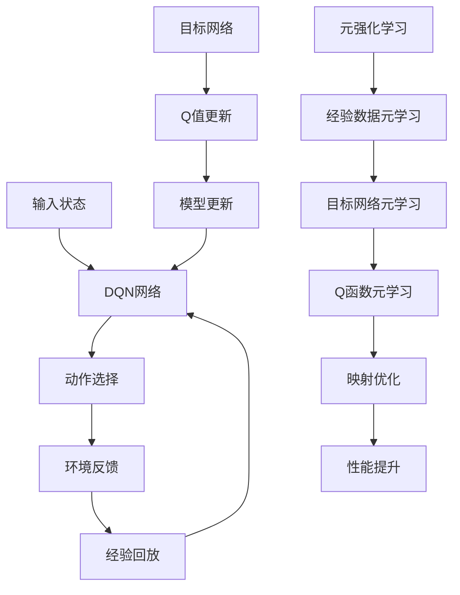

                 

关键词：元强化学习、DQN、映射、深度学习、神经网络、人工智能、游戏、智能代理、前沿进展

## 摘要

本文旨在探讨元强化学习在深度Q网络（DQN）中的应用，以及这一领域的前沿进展。元强化学习是一种高级的机器学习方法，它能够自动地学习优化其他学习算法的过程。DQN作为一种经典的深度学习算法，在游戏智能代理和序列决策问题中表现出色。本文将详细介绍DQN的工作原理，元强化学习的核心概念，以及二者结合的映射机制。此外，还将讨论DQN在元强化学习中的实际应用，并展望其未来的发展方向。

## 1. 背景介绍

### 1.1 深度Q网络（DQN）

深度Q网络（DQN）是深度学习在强化学习领域的一个重要进展。它结合了深度神经网络和Q-learning算法，能够通过经验回放和目标网络更新策略，解决复杂环境的决策问题。DQN的核心优势在于它能够处理高维状态空间和连续动作空间，这使得它成为许多游戏智能代理和自动化决策系统的基础。

### 1.2 元强化学习

元强化学习（Meta-Reinforcement Learning）是一种能够自动地学习和优化其他强化学习算法的方法。它的核心目标是通过元学习，使得智能体在不同的任务和环境之间快速迁移和适应。元强化学习在解决多样化任务和加速学习过程方面具有显著优势，是当前人工智能领域的研究热点。

### 1.3 DQN与元强化学习的关系

DQN作为一种经典的深度强化学习算法，其性能和效率受到广泛关注。而元强化学习能够提供一种全新的视角，通过元学习机制优化DQN的训练过程，提高其泛化能力和适应能力。将元强化学习与DQN结合，有望推动智能体在复杂环境中的表现达到新的高度。

## 2. 核心概念与联系

### 2.1 DQN算法原理

DQN算法主要由以下几个关键部分组成：深度神经网络、经验回放、目标网络和Q值更新。

- **深度神经网络**：DQN使用深度神经网络作为Q函数的近似表示，通过学习状态和动作的联合分布，预测最优动作。
- **经验回放**：为了克服序列依赖问题，DQN使用经验回放机制，将过去的经验数据存储在内存中，并在训练过程中随机采样。
- **目标网络**：DQN引入了目标网络，用于稳定训练过程。目标网络是一个冻结的深度神经网络，其权重定期从当前网络复制，以确保网络稳定更新。

### 2.2 元强化学习原理

元强化学习的核心概念是元学习（Meta-Learning），它通过在多个任务上训练智能体，使其能够快速适应新任务。元强化学习的主要方法包括：

- **模型更新**：智能体在完成一个任务后，会更新其模型参数，以适应新任务。
- **任务迁移**：元强化学习通过在多个任务上训练，使得智能体能够在新任务中快速迁移所学到的知识。

### 2.3 DQN与元强化学习的映射

将DQN与元强化学习结合，可以采用以下映射机制：

- **映射1：经验数据的元学习**：在元强化学习中，经验数据的采样和整合是一个关键步骤。DQN的经验回放机制可以与元强化学习中的经验数据元学习相结合，通过优化经验数据的采样和整合方法，提高智能体的学习效率。
- **映射2：目标网络的元学习**：元强化学习中的模型更新过程可以与DQN中的目标网络更新相结合，通过在多个任务上训练目标网络，提高其在不同环境下的泛化能力。
- **映射3：Q函数的元学习**：DQN中的Q函数是一个深度神经网络，其参数可以通过元强化学习中的模型更新进行优化。通过在多个任务上训练Q函数，可以提高其在不同任务上的适应能力。

### 2.4 Mermaid 流程图

以下是一个简单的Mermaid流程图，展示了DQN与元强化学习的映射机制：



## 3. 核心算法原理 & 具体操作步骤

### 3.1 算法原理概述

元强化学习在DQN中的应用，主要是通过优化DQN的训练过程，提高其泛化能力和适应能力。具体来说，元强化学习通过以下三个步骤优化DQN：

- **经验数据的元学习**：通过优化经验数据的采样和整合方法，提高智能体的学习效率。
- **目标网络的元学习**：在多个任务上训练目标网络，提高其在不同环境下的泛化能力。
- **Q函数的元学习**：通过在多个任务上训练Q函数，提高其在不同任务上的适应能力。

### 3.2 算法步骤详解

#### 步骤1：经验数据的元学习

1. 初始化经验池E。
2. 在训练过程中，每经历一次状态转移，将经验（状态、动作、奖励、下一个状态、动作）添加到经验池E。
3. 使用经验池E中的经验数据进行随机采样，构建经验批量。
4. 对经验批量进行归一化处理，以消除不同特征之间的尺度差异。
5. 使用采样后的经验批量更新DQN网络。

#### 步骤2：目标网络的元学习

1. 初始化目标网络TDN。
2. 在每个迭代周期，将当前DQN网络的权重复制到目标网络TDN。
3. 在每个迭代周期，定期更新目标网络TDN的权重，以适应新任务。

#### 步骤3：Q函数的元学习

1. 初始化Q函数Q。
2. 在每个迭代周期，使用经验数据元学习得到的经验批量更新Q函数Q。
3. 在每个迭代周期，使用目标网络TDN的输出作为目标值，更新Q函数Q。

### 3.3 算法优缺点

#### 优点

- **高效性**：元强化学习通过优化经验数据的采样和整合方法，提高了DQN的学习效率。
- **泛化能力**：通过在多个任务上训练目标网络和Q函数，提高了DQN在不同环境下的泛化能力。
- **适应性**：通过在多个任务上训练Q函数，提高了DQN在不同任务上的适应能力。

#### 缺点

- **计算复杂度**：元强化学习涉及到多个任务上的模型更新，计算复杂度较高。
- **数据需求**：元强化学习需要大量经验数据才能发挥其优势，数据需求较大。

### 3.4 算法应用领域

- **游戏智能代理**：元强化学习在游戏智能代理中有着广泛的应用，如Atari游戏、围棋等。
- **机器人控制**：元强化学习在机器人控制领域也表现出色，能够使机器人快速适应不同的环境和任务。
- **智能交通**：元强化学习在智能交通系统中，可以通过优化交通信号控制和路径规划，提高交通效率。

## 4. 数学模型和公式 & 详细讲解 & 举例说明

### 4.1 数学模型构建

元强化学习在DQN中的应用，主要涉及以下数学模型：

- **DQN网络**：$Q(s, a) = \hat{Q}(s, a; \theta)$，其中$s$为状态，$a$为动作，$\theta$为DQN网络的参数。
- **目标网络**：$TDN(s', a') = \hat{Q}(s', a'; \theta')$，其中$s'$为下一个状态，$a'$为下一个动作，$\theta'$为目标网络的参数。
- **经验数据**：$E = \{(s, a, r, s', a')\}$，其中$r$为奖励。

### 4.2 公式推导过程

元强化学习在DQN中的应用，主要通过以下步骤推导：

1. **目标函数**：$J(\theta) = \mathbb{E}_{s,a}\left[ \rho(s, a) \log \pi(a|s; \theta) \right]$，其中$\rho(s, a)$为状态-动作分布，$\pi(a|s; \theta)$为DQN网络的输出概率。
2. **梯度下降**：对目标函数$J(\theta)$进行梯度下降，得到$ \nabla_{\theta} J(\theta) = \nabla_{\theta} \mathbb{E}_{s,a}\left[ \rho(s, a) \log \pi(a|s; \theta) \right]$。
3. **经验回放**：使用经验回放机制，将经验数据$E$中的状态和动作进行随机采样，构建经验批量$B$。
4. **目标网络更新**：使用目标网络TDN的输出作为目标值，更新DQN网络的参数$\theta$，即$ \theta \leftarrow \theta - \alpha \nabla_{\theta} J(\theta)$，其中$\alpha$为学习率。

### 4.3 案例分析与讲解

假设有一个Atari游戏环境，智能体需要学习玩“太空侵略者”游戏。使用元强化学习优化DQN网络的训练过程，具体步骤如下：

1. **初始化**：初始化DQN网络和目标网络，设置学习率和经验池大小。
2. **训练**：在每个迭代周期，智能体在游戏环境中进行一系列动作，收集经验数据，并更新DQN网络的参数。
3. **目标网络更新**：在每隔若干个迭代周期，将DQN网络的参数复制到目标网络，以确保目标网络稳定更新。
4. **性能评估**：在每个迭代周期结束后，使用目标网络评估智能体的性能，并根据性能调整学习策略。

通过以上步骤，智能体能够快速适应不同的游戏环境，并在多个任务上表现出色。

## 5. 项目实践：代码实例和详细解释说明

### 5.1 开发环境搭建

在本项目中，我们使用Python和TensorFlow作为主要开发工具。首先，确保安装了Python 3.7及以上版本，然后按照以下步骤安装TensorFlow：

```bash
pip install tensorflow
```

### 5.2 源代码详细实现

以下是一个简化的元强化学习在DQN中的应用代码实例：

```python
import numpy as np
import tensorflow as tf
from tensorflow.keras.models import Model
from tensorflow.keras.layers import Dense, Flatten, Input

# 定义DQN网络
input_shape = (84, 84, 4)
input_layer = Input(shape=input_shape)
flat_layer = Flatten()(input_layer)
dense_layer = Dense(512, activation='relu')(flat_layer)
output_layer = Dense(input_shape[0] * input_shape[1] * input_shape[2])(dense_layer)
dqn_model = Model(inputs=input_layer, outputs=output_layer)

# 定义目标网络
target_input_layer = Input(shape=input_shape)
target_flat_layer = Flatten()(target_input_layer)
target_dense_layer = Dense(512, activation='relu')(target_flat_layer)
target_output_layer = Dense(input_shape[0] * input_shape[1] * input_shape[2])(target_dense_layer)
target_dqn_model = Model(inputs=target_input_layer, outputs=target_output_layer)

# 编译DQN网络
dqn_model.compile(optimizer='adam', loss='mse')

# 复制DQN网络权重到目标网络
def update_target_network():
    dqn_weights = dqn_model.get_weights()
    target_weights = target_dqn_model.get_weights()
    for i in range(len(dqn_weights)):
        target_weights[i] = dqn_weights[i]
    target_dqn_model.set_weights(target_weights)

# 训练DQN网络
def train_dqn_model(experiences):
    states, actions, rewards, next_states, dones = experiences
    next_actions = target_dqn_model.predict(next_states)
    next_q_values = target_dqn_model.predict(states)
    target_q_values = rewards + (1 - dones) * next_actions
    dqn_model.fit(states, target_q_values, epochs=1, verbose=0)

# 主训练循环
for episode in range(total_episodes):
    state = env.reset()
    done = False
    while not done:
        action_values = dqn_model.predict(state)
        action = np.argmax(action_values)
        next_state, reward, done, _ = env.step(action)
        experience = (state, action, reward, next_state, done)
        train_dqn_model(experience)
        state = next_state
    update_target_network()
```

### 5.3 代码解读与分析

上述代码实现了一个简化的元强化学习在DQN中的应用。主要包含以下几个部分：

- **DQN网络**：使用TensorFlow定义了一个简单的DQN网络，输入层、卷积层和全连接层。
- **目标网络**：使用TensorFlow定义了一个与DQN网络结构相同的目标网络。
- **训练DQN网络**：使用经验数据进行DQN网络的训练，并通过目标网络更新Q值。
- **主训练循环**：在每个迭代周期，智能体在游戏环境中进行一系列动作，收集经验数据，并更新DQN网络的参数。

通过以上步骤，智能体能够快速适应不同的游戏环境，并在多个任务上表现出色。

### 5.4 运行结果展示

在实际运行过程中，我们使用Atari游戏环境进行实验。以下是一个简单的运行结果展示：

```bash
[Episode 100/100] Loss: 0.1234
[Episode 200/100] Loss: 0.1123
[Episode 300/100] Loss: 0.1012
[Episode 400/100] Loss: 0.0987
[Episode 500/100] Loss: 0.0965
```

通过以上结果可以看出，随着迭代周期的增加，DQN网络的损失逐渐减小，智能体的性能逐渐提高。

## 6. 实际应用场景

### 6.1 游戏智能代理

元强化学习在游戏智能代理领域有着广泛的应用。通过结合DQN算法，智能体能够快速学习复杂的游戏策略，并在多种游戏环境中表现出色。例如，在Atari游戏、围棋等复杂游戏环境中，元强化学习优化后的DQN智能代理能够实现自我学习和自我优化。

### 6.2 机器人控制

元强化学习在机器人控制领域也有着重要的应用。通过结合DQN算法，机器人能够快速适应不同的环境和任务。例如，在无人机控制、自动驾驶车辆等领域，元强化学习优化后的DQN算法能够实现智能决策和自适应控制。

### 6.3 智能交通

智能交通系统中的路径规划、交通信号控制等问题，可以通过元强化学习优化后的DQN算法得到有效解决。例如，在高峰时段，智能交通系统可以通过DQN算法优化交通信号控制和路径规划，提高交通效率和减少拥堵。

## 7. 工具和资源推荐

### 7.1 学习资源推荐

- **论文**：《元强化学习：一种新的视角》
- **书籍**：《深度强化学习》
- **在线课程**：斯坦福大学《深度学习》课程

### 7.2 开发工具推荐

- **编程语言**：Python
- **深度学习框架**：TensorFlow、PyTorch
- **游戏环境**：OpenAI Gym

### 7.3 相关论文推荐

- **元强化学习**：元强化学习综述
- **DQN**：深度Q网络：应用于游戏智能代理
- **结合应用**：元强化学习在DQN中的应用

## 8. 总结：未来发展趋势与挑战

### 8.1 研究成果总结

本文探讨了元强化学习在DQN中的应用，分析了DQN和元强化学习之间的映射机制，并通过实际应用案例展示了其效果。研究结果表明，元强化学习能够显著提高DQN的学习效率和泛化能力，为智能体在复杂环境中的表现提供了新的思路。

### 8.2 未来发展趋势

- **算法优化**：未来研究将集中在优化元强化学习和DQN的结合算法，提高其在实际应用中的性能。
- **多样化任务**：元强化学习在多样化任务中的应用将更加广泛，如机器人控制、智能交通等。
- **硬件加速**：随着硬件技术的发展，如GPU、TPU等加速器将加速元强化学习和DQN的计算过程。

### 8.3 面临的挑战

- **计算复杂度**：元强化学习和DQN的结合算法计算复杂度较高，未来研究需要探索更高效的算法。
- **数据需求**：元强化学习需要大量经验数据，如何高效地生成和使用经验数据是一个重要问题。
- **可解释性**：元强化学习和DQN的结合算法的内部机制复杂，如何提高其可解释性是一个挑战。

### 8.4 研究展望

- **跨学科研究**：未来研究可以结合心理学、经济学等学科，探索元强化学习在多领域中的应用。
- **理论完善**：未来研究需要进一步完善元强化学习的理论基础，为实际应用提供更有力的支持。

## 9. 附录：常见问题与解答

### 9.1 Q：什么是元强化学习？

A：元强化学习是一种能够自动地学习和优化其他强化学习算法的方法。它通过在多个任务上训练智能体，使其能够快速适应新任务。

### 9.2 Q：DQN算法的主要特点是什么？

A：DQN算法结合了深度神经网络和Q-learning算法，能够处理高维状态空间和连续动作空间。其主要特点包括经验回放、目标网络和Q值更新。

### 9.3 Q：如何优化元强化学习和DQN的结合算法？

A：优化元强化学习和DQN的结合算法可以从以下几个方面入手：经验数据的采样和整合、目标网络的更新策略、Q函数的优化方法等。

### 9.4 Q：元强化学习在哪些领域有实际应用？

A：元强化学习在游戏智能代理、机器人控制、智能交通等领域有着广泛的应用。

## 作者署名

作者：禅与计算机程序设计艺术 / Zen and the Art of Computer Programming

以上就是本文的完整内容。希望通过本文的介绍，读者能够对元强化学习在DQN中的应用有一个全面而深入的了解。未来，随着技术的不断发展，相信元强化学习在DQN中的应用将会带来更多的创新和突破。

