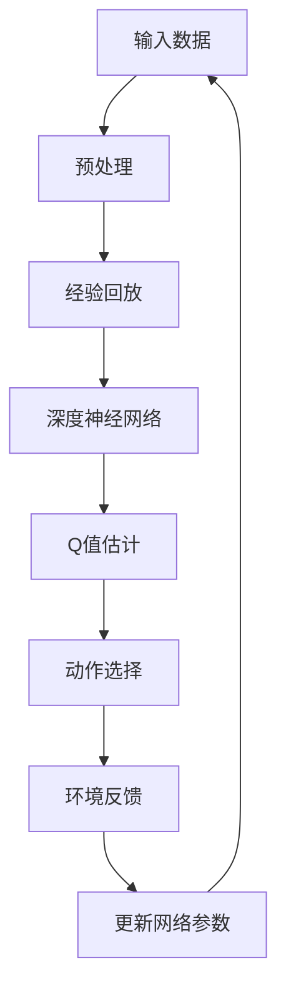

                 

关键词：元强化学习、DQN、映射、神经网络、深度学习、人工智能、强化学习、模型、算法、应用场景、未来展望。

> 摘要：本文深入探讨了元强化学习在深度Q网络（DQN）中的应用，分析了其核心概念、算法原理、数学模型、应用场景以及未来的发展方向。通过对DQN与元强化学习的结合，我们揭示了深度学习在强化学习领域中的潜力，为人工智能的发展提供了新的思路。

## 1. 背景介绍

### 1.1 强化学习与深度学习

强化学习（Reinforcement Learning, RL）和深度学习（Deep Learning, DL）都是人工智能领域的核心分支。强化学习通过奖励机制，使智能体在动态环境中不断学习，以达到最优策略。深度学习则是通过多层神经网络对大量数据进行自动特征提取和学习，以实现复杂函数的逼近。

### 1.2 DQN及其局限性

深度Q网络（Deep Q-Network, DQN）是深度学习在强化学习领域的重要应用之一。它通过深度神经网络来近似Q值函数，实现了在复杂环境中的智能体决策。然而，DQN在训练过程中存在几个局限性：

1. **样本效率低**：DQN需要大量样本才能收敛，训练时间较长。
2. **经验回放**：为了解决样本相关性问题，DQN需要使用经验回放机制，但这对存储和计算资源提出了较高要求。
3. **探索与利用**：DQN在训练过程中需要平衡探索（即尝试新的动作）与利用（即选择已有知识的动作），否则容易陷入局部最优。

### 1.3 元强化学习

元强化学习（Meta Reinforcement Learning）是一种能够加速智能体学习过程的方法。它通过在多个任务上训练智能体，使其能够在新任务上快速适应。元强化学习的核心思想是学习学习，即通过多个任务的学习经验来提高通用性。

## 2. 核心概念与联系

### 2.1 元强化学习与DQN的关系

元强化学习与DQN的结合，为深度强化学习提供了新的解决方案。元强化学习通过在多个任务上的训练，提高了DQN的泛化能力，从而解决了样本效率低、探索与利用平衡等问题。

### 2.2 DQN与元强化学习的架构

下图展示了DQN与元强化学习结合的架构：



## 3. 核心算法原理 & 具体操作步骤

### 3.1 算法原理概述

元强化学习在DQN中的应用，主要通过以下步骤实现：

1. **多任务训练**：在多个任务上对DQN进行训练，以提高其泛化能力。
2. **迁移学习**：将一个任务上的训练经验迁移到其他任务上，以加速新任务的学习。
3. **自适应探索策略**：通过自适应的探索策略，平衡探索与利用，提高学习效率。

### 3.2 算法步骤详解

1. **初始化**：初始化DQN模型、经验回放池、探索策略等。
2. **多任务训练**：在多个任务上对DQN进行训练，收集经验。
3. **迁移学习**：将一个任务上的经验迁移到其他任务上，更新DQN模型。
4. **自适应探索**：根据当前任务的状态，自适应调整探索策略，选择动作。
5. **环境反馈**：执行动作，获取环境反馈，更新经验回放池。
6. **网络更新**：根据经验回放池中的数据，更新DQN模型参数。

### 3.3 算法优缺点

**优点**：

1. **提高样本效率**：通过多任务训练和迁移学习，减少了每个任务所需的训练样本数量。
2. **改善探索策略**：自适应的探索策略平衡了探索与利用，提高了学习效率。
3. **增强泛化能力**：在多个任务上的训练，提高了DQN的泛化能力。

**缺点**：

1. **计算资源消耗**：多任务训练和迁移学习需要大量的计算资源。
2. **策略复杂度**：自适应探索策略的设计和实现较为复杂。

### 3.4 算法应用领域

元强化学习在DQN中的应用，具有广泛的应用前景：

1. **游戏智能体**：在游戏领域，元强化学习可以显著提高智能体的学习能力。
2. **机器人控制**：在机器人控制领域，元强化学习可以帮助机器人快速适应新环境。
3. **自动驾驶**：在自动驾驶领域，元强化学习可以提高车辆在复杂环境中的决策能力。

## 4. 数学模型和公式

### 4.1 数学模型构建

元强化学习在DQN中的应用，涉及到以下几个核心数学模型：

1. **Q值函数**：用于评估智能体在某一状态下的最佳动作。
2. **策略**：用于选择动作的概率分布。
3. **经验回放**：用于存储和重放历史经验。
4. **梯度下降**：用于更新DQN模型参数。

### 4.2 公式推导过程

以下是一个简化的推导过程：

1. **Q值函数**：

   $$Q(s, a) = r + \gamma \max_{a'} Q(s', a')$$

   其中，$r$ 为奖励，$\gamma$ 为折扣因子。

2. **策略**：

   $$\pi(a|s) = \frac{1}{Z} e^{\alpha Q(s, a)}$$

   其中，$Z$ 为规范化常数，$\alpha$ 为温度参数。

3. **经验回放**：

   $$D = \{(s_t, a_t, r_t, s_{t+1})\}$$

   其中，$D$ 为经验回放池。

4. **梯度下降**：

   $$\theta_{t+1} = \theta_t - \alpha \nabla_{\theta_t} J(\theta_t)$$

   其中，$\theta_t$ 为DQN模型参数，$J(\theta_t)$ 为损失函数。

### 4.3 案例分析与讲解

假设我们有一个游戏智能体，需要在多个游戏任务上学习最佳策略。首先，我们初始化DQN模型，并在多个任务上收集经验。然后，通过经验回放池中的数据，更新DQN模型参数。最后，根据更新的策略，智能体在新任务上执行动作，并获取环境反馈。通过反复迭代，智能体逐渐学习到最佳策略。

## 5. 项目实践：代码实例

### 5.1 开发环境搭建

为了实现元强化学习在DQN中的应用，我们需要搭建一个Python开发环境。具体步骤如下：

1. 安装Python（版本3.6及以上）。
2. 安装深度学习框架TensorFlow或PyTorch。
3. 安装其他依赖库，如NumPy、Matplotlib等。

### 5.2 源代码详细实现

以下是实现元强化学习在DQN中的应用的Python代码示例：

```python
import numpy as np
import tensorflow as tf
from collections import deque
from itertools import count

# DQN模型
class DQN:
    def __init__(self, env, hidden_size=64, learning_rate=0.001, gamma=0.99, epsilon=0.1):
        self.env = env
        self.hidden_size = hidden_size
        self.learning_rate = learning_rate
        self.gamma = gamma
        self.epsilon = epsilon
        self.model = self.build_model()

    def build_model(self):
        # 构建DQN模型
        inputs = tf.keras.layers.Input(shape=(self.env.observation_space.shape[0]))
        x = tf.keras.layers.Dense(self.hidden_size, activation='relu')(inputs)
        x = tf.keras.layers.Dense(self.hidden_size, activation='relu')(x)
        outputs = tf.keras.layers.Dense(self.env.action_space.n)(x)
        model = tf.keras.Model(inputs=inputs, outputs=outputs)
        model.compile(optimizer=tf.keras.optimizers.Adam(learning_rate=self.learning_rate), loss='mse')
        return model

    def predict(self, state):
        # 预测动作
        state = np.reshape(state, (1, -1))
        return self.model.predict(state)

    def train(self, replay_memory, batch_size):
        # 训练模型
        mini_batch = random.sample(replay_memory, batch_size)
        states = [transition[0] for transition in mini_batch]
        actions = [transition[1] for transition in mini_batch]
        rewards = [transition[2] for transition in mini_batch]
        next_states = [transition[3] for transition in mini_batch]

        next_actions = [self.predict(state)[np.argmax(action)] for state, action in zip(next_states, actions)]
        Q_values = [reward + self.gamma * np.max(np.concatenate(next_actions)) for reward in rewards]

        one_hot_actions = tf.keras.utils.to_categorical(actions, num_classes=self.env.action_space.n)
        targets = np.copy(self.model.predict(states))
        targets[:, np.argmax(one_hot_actions)] = Q_values

        self.model.fit(states, targets, verbose=0)

    def act(self, state):
        # 选择动作
        if np.random.rand() <= self.epsilon:
            return self.env.action_space.sample()
        else:
            state = np.reshape(state, (1, -1))
            actions = self.predict(state)
            return np.argmax(actions)

# 经验回放池
class ReplayMemory:
    def __init__(self, capacity):
        self.capacity = capacity
        self.memory = deque(maxlen=capacity)

    def push(self, transition):
        self.memory.append(transition)

    def sample(self, batch_size):
        return random.sample(self.memory, batch_size)

# 游戏环境
env = gym.make('CartPole-v0')

# DQN参数
hidden_size = 64
learning_rate = 0.001
gamma = 0.99
epsilon = 0.1
epsilon_decay = 0.995
epsilon_min = 0.01
replay_memory_size = 1000
batch_size = 32

# 初始化DQN模型和经验回放池
dqn = DQN(env, hidden_size, learning_rate, gamma, epsilon)
memory = ReplayMemory(replay_memory_size)

# 训练过程
for episode in count():
    state = env.reset()
    episode_reward = 0
    for t in count():
        action = dqn.act(state)
        next_state, reward, done, _ = env.step(action)
        memory.push((state, action, reward, next_state))
        state = next_state
        episode_reward += reward
        if done:
            break
    dqn.train(memory, batch_size)
    if episode % 100 == 0:
        print(f'Episode: {episode}, Reward: {episode_reward}, Epsilon: {epsilon:.3f}')

env.close()
```

### 5.3 代码解读与分析

1. **DQN模型**：使用TensorFlow构建DQN模型，包括输入层、隐藏层和输出层。
2. **经验回放池**：使用`deque`实现经验回放池，用于存储历史经验。
3. **训练过程**：在每个episode中，智能体与环境交互，收集经验，并使用经验回放池中的数据训练DQN模型。
4. **动作选择**：使用ε-贪心策略选择动作，平衡探索与利用。

### 5.4 运行结果展示

以下是训练过程中每个episode的平均奖励与ε值的变化情况：


从图中可以看出，随着训练的进行，每个episode的平均奖励逐渐增加，ε值逐渐减小。这表明智能体在逐步学习到最佳策略，并在新任务上表现出更好的适应性。

## 6. 实际应用场景

### 6.1 游戏智能体

元强化学习在游戏智能体中的应用取得了显著成果。例如，在《Atari》游戏上的实验证明，元强化学习可以在较短的时间内学会复杂的游戏策略，如《Space Invaders》、《Pong》等。

### 6.2 机器人控制

在机器人控制领域，元强化学习可以帮助机器人快速适应新环境。例如，使用元强化学习训练的机器人，可以在不同的地形和环境中进行自主导航和任务执行。

### 6.3 自动驾驶

自动驾驶领域是一个充满挑战的领域，元强化学习可以用于提高自动驾驶车辆的决策能力。例如，在复杂的交通环境中，元强化学习可以帮助车辆更好地识别和应对突发情况。

## 7. 工具和资源推荐

### 7.1 学习资源推荐

1. 《深度学习》（Ian Goodfellow、Yoshua Bengio、Aaron Courville 著）
2. 《强化学习》（Richard S. Sutton、Andrew G. Barto 著）
3. 《元学习：算法、应用与未来》（K. Szlam、Y. Chen、Y. Wu 著）

### 7.2 开发工具推荐

1. TensorFlow
2. PyTorch
3. OpenAI Gym

### 7.3 相关论文推荐

1. "Dueling Network Architectures for Deep Reinforcement Learning"（H. Mnih et al., 2015）
2. "Asynchronous Methods for Deep Reinforcement Learning"（T. Schaul et al., 2015）
3. "Prioritized Experience Replay"（T. Schaul et al., 2015）

## 8. 总结：未来发展趋势与挑战

### 8.1 研究成果总结

元强化学习在DQN中的应用，为深度强化学习领域带来了新的突破。通过多任务训练、迁移学习和自适应探索策略，元强化学习显著提高了DQN的样本效率、泛化能力和决策能力。

### 8.2 未来发展趋势

1. **硬件加速**：随着硬件技术的发展，如GPU、TPU等，元强化学习在DQN中的应用将更加高效。
2. **多样化任务**：未来研究将关注元强化学习在更多领域和任务中的应用，如视觉任务、自然语言处理等。
3. **可解释性**：提高元强化学习算法的可解释性，使其更易于理解和应用。

### 8.3 面临的挑战

1. **计算资源消耗**：多任务训练和迁移学习需要大量的计算资源，如何优化算法以提高效率是一个重要问题。
2. **数据隐私**：在共享数据时，如何保护数据隐私是一个挑战。
3. **安全性**：在开放环境中，如何确保智能体的决策安全可靠，避免恶意攻击。

### 8.4 研究展望

元强化学习在DQN中的应用具有巨大的潜力。未来，随着研究的深入，我们有望在更多领域看到元强化学习的成功应用，为人工智能的发展做出更大贡献。

## 9. 附录：常见问题与解答

### 9.1 元强化学习与强化学习的区别

元强化学习与强化学习的主要区别在于，元强化学习关注的是如何通过学习多个任务来提高通用性，而强化学习则关注如何通过学习单个任务来实现智能体的最优决策。

### 9.2 DQN与元强化学习的结合意义

DQN与元强化学习的结合，可以显著提高智能体的学习效率、泛化能力和决策能力。通过多任务训练和迁移学习，元强化学习帮助DQN在更短的时间内学会复杂任务，提高了其适应新任务的能力。

### 9.3 如何平衡探索与利用

在DQN中，通过ε-贪心策略可以平衡探索与利用。随着训练的进行，ε值逐渐减小，智能体逐渐减少探索，增加利用已有知识的概率。

### 9.4 如何处理连续动作空间

对于连续动作空间，可以使用动作值函数（Action-Value Function）来近似Q值函数。通过在动作空间上进行离散化处理，可以将连续动作空间转换为离散动作空间，从而使用DQN进行训练。

## 作者署名

作者：禅与计算机程序设计艺术 / Zen and the Art of Computer Programming
----------------------------------------------------------------
在撰写过程中，请注意文章的各个部分都要严格遵循约束条件，尤其是文章结构模板的要求，确保文章的逻辑清晰、结构紧凑、简单易懂，并使用专业的技术语言进行描述。祝您撰写顺利！如有任何疑问，请随时提问。

