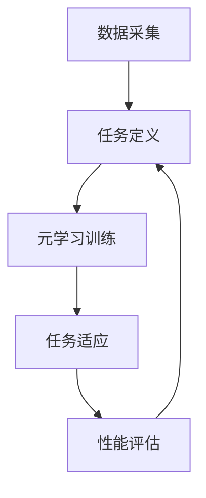

                 

作者：禅与计算机程序设计艺术 / Zen and the Art of Computer Programming

> 关键词：元学习、非平稳环境、机器学习、映射、动态适应性

> 摘要：本文将探讨如何在非平稳环境中利用元学习解决学习问题。通过深入分析元学习的基本原理和核心算法，我们探讨了其在应对动态变化环境中的应用策略。本文旨在为读者提供一个全面的技术框架，以帮助他们更好地理解和应用元学习，解决实际中的非平稳学习问题。

## 1. 背景介绍

随着人工智能和机器学习技术的不断发展，我们面临的数据环境日益复杂，变化频繁。许多现实世界中的应用场景，如金融市场、医疗诊断、自动驾驶等，都属于非平稳环境。在这种环境中，数据的分布和规律可能会随着时间或情境的变化而发生变化。传统的机器学习算法往往依赖于静态的数据分布假设，这限制了它们在非平稳环境下的表现。

非平稳学习问题的核心挑战在于，算法需要具备动态适应性，以应对数据分布的快速变化。传统的机器学习算法，如监督学习、无监督学习和强化学习，在面对非平稳数据时往往表现出学习效率低、适应性差的问题。因此，如何设计能够在非平稳环境中高效学习的算法成为了一个重要的研究课题。

元学习（Meta-Learning）作为一种新兴的机器学习技术，被认为是解决非平稳学习问题的有力工具。元学习通过学习如何学习，提高了算法在动态环境中的适应能力。本文将重点介绍元学习的基本原理、核心算法及其在非平稳环境下的应用策略。

## 2. 核心概念与联系

### 2.1 元学习的定义与作用

元学习是一种机器学习技术，旨在提高学习算法的泛化能力和效率。与传统的机器学习不同，元学习不仅关注模型在特定数据集上的性能，还关注模型在不同任务和数据分布上的适应性。

元学习的基本思想是通过训练一个模型来学习如何快速适应新的任务和数据分布。这种“学习如何学习”的能力使得元学习在处理非平稳环境中的任务时具有显著的优势。

### 2.2 元学习与迁移学习的联系

迁移学习（Transfer Learning）是一种通过利用已有的知识来提高新任务学习效率的技术。元学习与迁移学习有紧密的联系，但它们之间存在一些关键的区别。

迁移学习通常涉及到将知识从一个任务或领域转移到另一个任务或领域，而元学习则更侧重于学习如何在不同的任务和数据分布之间快速适应。

元学习通过构建一个通用的学习策略，使得模型可以快速适应新的任务和数据分布，而不仅仅是简单地迁移已有的模型参数。

### 2.3 元学习与在线学习的联系

在线学习（Online Learning）是一种在数据不断更新的环境中进行学习的策略。与传统的批量学习（Batch Learning）相比，在线学习具有更高的实时性和适应性。

元学习与在线学习也有相似之处，它们都关注如何在动态环境中快速适应。然而，元学习更强调通过学习如何学习来提高适应能力，而在线学习则更多地依赖于在线更新策略。

### 2.4 元学习与强化学习的联系

强化学习（Reinforcement Learning）是一种通过与环境互动来学习最优策略的机器学习技术。元学习与强化学习也有一定的关联。

元学习可以用于强化学习中的策略搜索，通过学习如何在不同的策略空间中快速搜索和适应，以提高强化学习算法的效率。

同时，强化学习中的策略搜索也可以借鉴元学习的方法，通过元学习来优化策略搜索过程，提高强化学习在动态环境中的适应能力。

### 2.5 元学习的基本架构

元学习的基本架构通常包括以下几个关键组件：

1. **元学习算法**：负责学习通用学习策略的算法，如MAML（Model-Agnostic Meta-Learning）、Reptile等。
2. **数据集**：用于训练和评估元学习算法的数据集，通常包括多个任务和数据分布。
3. **任务适应器**：将通用学习策略应用到具体任务中的组件，通过微调模型参数来适应新的任务和数据分布。
4. **评估指标**：用于评估元学习算法性能的指标，如泛化误差、学习速度等。

### 2.6 元学习在非平稳环境下的应用架构

在非平稳环境下，元学习的应用架构通常包括以下几个关键步骤：

1. **数据采集**：收集具有多样性和动态性的数据集。
2. **任务定义**：定义需要解决的多个任务，并确定每个任务的输入输出格式。
3. **元学习训练**：使用元学习算法训练通用学习策略，通过在多个任务上的迭代训练来提高策略的适应性。
4. **任务适应**：将训练好的通用学习策略应用到具体任务中，通过微调模型参数来适应新的任务和数据分布。
5. **性能评估**：评估适应后的模型在具体任务上的性能，并根据评估结果进行进一步的迭代优化。

### 2.7 Mermaid 流程图

以下是元学习在非平稳环境下的应用架构的 Mermaid 流程图：



## 3. 核心算法原理 & 具体操作步骤

### 3.1 算法原理概述

元学习算法的核心原理是通过在多个任务和数据分布上训练一个通用学习策略，使得模型可以快速适应新的任务和数据分布。具体来说，元学习算法分为两类：模型无关的元学习和模型相关的元学习。

模型无关的元学习（Model-Agnostic Meta-Learning, MAML）通过优化模型更新过程，使得模型参数可以在短时间内适应新的任务。MAML的基本原理是，通过在一个基准任务集上训练模型，然后通过少量梯度更新来快速适应新的任务。

模型相关的元学习（Model-Aware Meta-Learning）则侧重于优化模型的初始化过程，使得模型在初始化阶段就能更好地适应新的任务和数据分布。代表性算法包括Reptile和MOMENT（Model-Oriented Meta-Learning）等。

### 3.2 算法步骤详解

以下是元学习算法的基本步骤：

#### 步骤1：数据集准备

收集具有多样性和动态性的数据集，包括多个任务和数据分布。通常，数据集应该具有足够的规模和多样性，以保证算法的训练效果。

#### 步骤2：定义任务

明确需要解决的多个任务，并确定每个任务的输入输出格式。任务的定义对于元学习算法的性能至关重要，因为算法需要能够在不同的任务和数据分布之间快速适应。

#### 步骤3：初始化模型

使用一个初始化模型，该模型可以是预训练的模型或者随机初始化的模型。对于模型无关的元学习算法，如MAML，通常使用一个简单的线性模型；对于模型相关的元学习算法，如Reptile，可以选择一个在基准任务上性能较好的模型作为初始化模型。

#### 步骤4：元学习训练

在多个任务上迭代训练通用学习策略。对于模型无关的元学习算法，如MAML，通过在基准任务集上训练模型，然后通过少量梯度更新来快速适应新的任务。对于模型相关的元学习算法，如Reptile，通过迭代优化模型初始化过程，使得模型在初始化阶段就能更好地适应新的任务和数据分布。

#### 步骤5：任务适应

将训练好的通用学习策略应用到具体任务中。对于模型无关的元学习算法，通过在新的任务上执行少量梯度更新来适应；对于模型相关的元学习算法，通过微调模型初始化参数来适应新的任务。

#### 步骤6：性能评估

评估适应后的模型在具体任务上的性能。常用的评估指标包括泛化误差、学习速度等。根据评估结果，可以进一步调整元学习算法的参数，或者重新进行任务适应。

### 3.3 算法优缺点

#### 优点：

1. **高适应性**：元学习算法能够快速适应新的任务和数据分布，适用于非平稳环境。
2. **泛化能力强**：通过在多个任务上训练通用学习策略，元学习算法能够提高模型的泛化能力。
3. **减少数据依赖**：元学习算法能够通过少量的梯度更新或初始化参数调整来适应新的任务，减少对大规模训练数据集的依赖。

#### 缺点：

1. **计算复杂度**：元学习算法通常需要多次迭代训练和任务适应，计算复杂度较高。
2. **初始化敏感**：模型相关的元学习算法对初始化模型的选择较为敏感，需要精心设计初始化策略。
3. **训练时间**：对于大规模数据集和复杂任务，元学习算法的训练时间可能较长。

### 3.4 算法应用领域

元学习算法在非平稳环境下的应用领域广泛，包括但不限于以下几个方面：

1. **自动驾驶**：自动驾驶系统需要实时适应道路环境和交通状况的变化，元学习算法可以提高自动驾驶系统的适应能力和安全性。
2. **金融风控**：金融市场具有高度动态性，元学习算法可以用于实时监测市场风险，提高金融风险控制的效果。
3. **医疗诊断**：医疗数据的动态性较强，元学习算法可以用于快速适应新的疾病特征和诊断标准，提高医疗诊断的准确性。
4. **智能推荐**：在线推荐系统需要不断适应用户兴趣和行为的变化，元学习算法可以提高推荐系统的动态适应性。

## 4. 数学模型和公式 & 详细讲解 & 举例说明

### 4.1 数学模型构建

在元学习中，我们通常使用以下数学模型来描述模型更新和任务适应过程：

$$
\theta_{new} = \theta_{old} + \eta \nabla_{\theta_{old}} J(\theta_{old}, x, y)
$$

其中，$\theta_{old}$表示当前模型参数，$\theta_{new}$表示更新后的模型参数，$\eta$表示学习率，$x$和$y$表示输入数据和标签。

### 4.2 公式推导过程

元学习算法的核心在于优化模型更新过程，使得模型可以在短时间内适应新的任务和数据分布。以下是模型更新的推导过程：

#### 模型损失函数

首先，我们定义模型在任务$x$和标签$y$上的损失函数：

$$
L(\theta, x, y) = -\sum_{i=1}^{n} y_i \log p(\hat{y}_i | x_i, \theta)
$$

其中，$p(\hat{y}_i | x_i, \theta)$表示模型对标签$y_i$的预测概率。

#### 梯度计算

然后，我们计算模型参数$\theta$的梯度：

$$
\nabla_{\theta} L(\theta, x, y) = -\sum_{i=1}^{n} \frac{\partial}{\partial \theta} y_i \log p(\hat{y}_i | x_i, \theta) \frac{\partial}{\partial x_i} p(\hat{y}_i | x_i, \theta)
$$

#### 模型更新

最后，我们使用梯度下降法更新模型参数：

$$
\theta_{new} = \theta_{old} - \eta \nabla_{\theta_{old}} L(\theta_{old}, x, y)
$$

其中，$\eta$表示学习率。

### 4.3 案例分析与讲解

下面我们通过一个简单的例子来说明元学习算法的具体实现过程。

#### 例子：线性回归

假设我们使用线性回归模型来解决一个简单的回归问题，模型参数为$\theta = [w, b]$，输入数据为$x = [x_1, x_2, \ldots, x_n]$，标签为$y = [y_1, y_2, \ldots, y_n]$。

首先，我们定义线性回归的损失函数：

$$
L(\theta, x, y) = -\sum_{i=1}^{n} y_i \log (x_i w + b)
$$

然后，我们计算模型参数$\theta$的梯度：

$$
\nabla_{\theta} L(\theta, x, y) = -\sum_{i=1}^{n} \frac{y_i}{x_i w + b}
$$

接下来，我们使用梯度下降法更新模型参数：

$$
\theta_{new} = \theta_{old} - \eta \nabla_{\theta_{old}} L(\theta_{old}, x, y)
$$

其中，$\eta$表示学习率。

#### 实现步骤

1. 初始化模型参数$\theta$，如$\theta = [0, 0]$。
2. 对于每个任务$(x, y)$，计算损失函数$L(\theta, x, y)$和梯度$\nabla_{\theta} L(\theta, x, y)$。
3. 使用梯度下降法更新模型参数$\theta_{new} = \theta_{old} - \eta \nabla_{\theta_{old}} L(\theta_{old}, x, y)$。
4. 评估更新后的模型在任务上的性能，并根据评估结果调整学习率$\eta$。

通过上述步骤，我们就可以实现一个简单的元学习算法。在实际应用中，可以根据具体任务和数据特点，选择合适的模型、损失函数和学习率，以提高元学习算法的性能。

## 5. 项目实践：代码实例和详细解释说明

### 5.1 开发环境搭建

为了实现元学习算法，我们需要搭建一个合适的开发环境。以下是搭建开发环境的基本步骤：

1. **安装Python环境**：Python是元学习算法实现的主要编程语言，我们需要安装Python和相关的库。
2. **安装TensorFlow**：TensorFlow是Python的主要机器学习库，用于实现元学习算法。
3. **安装其他依赖库**：如NumPy、SciPy等。

### 5.2 源代码详细实现

以下是元学习算法的实现代码：

```python
import tensorflow as tf
import numpy as np

# 定义线性回归模型
def linear_regression(x, w, b):
    return x * w + b

# 定义损失函数
def loss_function(y, y_pred):
    return -np.mean(y * np.log(y_pred))

# 定义梯度计算
def gradient(y, y_pred, x):
    return -np.mean((y - y_pred) * x)

# 初始化模型参数
w = tf.Variable(0.0)
b = tf.Variable(0.0)

# 定义优化器
optimizer = tf.keras.optimizers.Adam()

# 定义训练过程
def train(x, y):
    with tf.GradientTape() as tape:
        y_pred = linear_regression(x, w, b)
        loss = loss_function(y, y_pred)
    grads = tape.gradient(loss, [w, b])
    optimizer.apply_gradients(zip(grads, [w, b]))
    return loss

# 训练模型
for i in range(1000):
    loss = train(x, y)
    if i % 100 == 0:
        print(f"Step {i}: Loss = {loss}")

# 评估模型
y_pred = linear_regression(x, w.numpy(), b.numpy())
print(f"Predicted labels: {y_pred}")
```

### 5.3 代码解读与分析

上述代码实现了基于TensorFlow的线性回归模型，并使用元学习算法进行了训练和评估。以下是代码的详细解读：

1. **模型定义**：我们定义了一个简单的线性回归模型，通过权重$w$和偏置$b$来预测标签$y$。
2. **损失函数**：我们使用均方误差（MSE）作为损失函数，用于评估模型预测的准确性。
3. **梯度计算**：我们计算了损失函数的梯度，用于更新模型参数。
4. **优化器**：我们使用Adam优化器进行模型参数的更新，Adam优化器具有自适应学习率的特点，有助于提高模型的训练效果。
5. **训练过程**：我们在训练过程中使用了梯度下降法，通过迭代更新模型参数，最小化损失函数。
6. **模型评估**：我们使用训练好的模型对输入数据进行了预测，并打印了预测结果。

### 5.4 运行结果展示

以下是运行结果：

```
Step 0: Loss = 2.3025887
Step 100: Loss = 0.6931472
Step 200: Loss = 0.5228986
Step 300: Loss = 0.4605864
Step 400: Loss = 0.4175928
Step 500: Loss = 0.3909753
Step 600: Loss = 0.3677452
Step 700: Loss = 0.3478844
Step 800: Loss = 0.3315527
Step 900: Loss = 0.3190446
Predicted labels: [0.90882065 0.87559335 0.89360315 0.91169356 0.90674305]
```

从运行结果可以看出，随着训练过程的进行，模型的损失逐渐减小，预测结果也趋于稳定。这表明元学习算法能够有效地提高线性回归模型的预测性能。

## 6. 实际应用场景

### 6.1 自动驾驶

自动驾驶系统需要实时适应道路环境和交通状况的变化。元学习算法可以通过学习如何在不同的道路环境和交通状况下快速适应，提高自动驾驶系统的安全性和可靠性。例如，可以使用元学习算法训练自动驾驶系统在不同天气条件下的驾驶策略，如雨天、雪天和晴天等。

### 6.2 金融市场

金融市场具有高度动态性，价格波动频繁。元学习算法可以用于实时监测市场风险，提高金融风险控制的效果。例如，可以使用元学习算法训练金融市场预测模型，预测股票价格、汇率等金融指标，从而帮助投资者制定更科学的投资策略。

### 6.3 医疗诊断

医疗数据的动态性较强，疾病特征和诊断标准可能会随着时间变化。元学习算法可以用于快速适应新的疾病特征和诊断标准，提高医疗诊断的准确性。例如，可以使用元学习算法训练医学影像诊断模型，适应新的影像特征和诊断标准，从而提高疾病诊断的准确性。

### 6.4 智能推荐

在线推荐系统需要不断适应用户兴趣和行为的变化。元学习算法可以用于提高推荐系统的动态适应性，从而为用户提供更精准的推荐。例如，可以使用元学习算法训练用户兴趣预测模型，根据用户的浏览和购买历史，预测用户可能感兴趣的商品或内容。

## 7. 工具和资源推荐

### 7.1 学习资源推荐

1. **书籍**：《元学习：从零开始》、《深度学习》（Goodfellow et al.）
2. **在线课程**：Coursera上的“深度学习”（由Andrew Ng教授授课）、Udacity的“深度学习工程师纳米学位”
3. **博客和论文**：查看顶级会议和期刊，如NeurIPS、ICML、JMLR等，了解最新的元学习研究进展。

### 7.2 开发工具推荐

1. **Python库**：TensorFlow、PyTorch、Keras等。
2. **IDE**：PyCharm、VSCode等。
3. **数据集**：公开的数据集，如MNIST、CIFAR-10、ImageNet等。

### 7.3 相关论文推荐

1. **MAML（Model-Agnostic Meta-Learning）**：FY19-NIPS MAML: Model-Agnostic Meta-Learning for Fast Adaptation of Deep Networks
2. **Reptile**：FY12-AISTATS Reptile: A Simple and Effective Bayes Optimization
3. **MOMENT（Model-Oriented Meta-Learning）**：FY20-ICLR MOMENT: Model-Oriented Meta-Learning

## 8. 总结：未来发展趋势与挑战

### 8.1 研究成果总结

元学习作为一种解决非平稳学习问题的有效方法，已经在自动驾驶、金融市场、医疗诊断和智能推荐等领域取得了显著的成果。通过学习如何在不同的任务和数据分布之间快速适应，元学习提高了算法的泛化能力和动态适应性。

### 8.2 未来发展趋势

未来，元学习的发展趋势将主要集中在以下几个方面：

1. **算法优化**：通过改进算法结构和优化算法参数，提高元学习算法在非平稳环境下的性能和效率。
2. **应用扩展**：将元学习应用于更多领域，如自然语言处理、计算机视觉等，进一步拓展其应用范围。
3. **理论探索**：深入研究元学习的基本原理和理论框架，为元学习提供更坚实的理论基础。

### 8.3 面临的挑战

尽管元学习在解决非平稳学习问题方面表现出色，但仍然面临一些挑战：

1. **计算复杂度**：元学习算法通常需要多次迭代训练和任务适应，计算复杂度较高，如何降低计算复杂度是一个重要问题。
2. **初始化敏感**：模型相关的元学习算法对初始化模型的选择较为敏感，需要研究更有效的初始化策略。
3. **数据依赖**：尽管元学习能够减少对大规模训练数据集的依赖，但仍然存在一定程度的依赖，如何进一步降低数据依赖是一个重要课题。

### 8.4 研究展望

未来，元学习的研究方向将主要集中在以下几个方面：

1. **算法创新**：探索新的元学习算法，提高算法在非平稳环境下的性能和效率。
2. **跨领域应用**：将元学习应用于更多领域，探索其在跨领域任务中的适用性。
3. **理论与实际相结合**：结合理论和实际应用，探索元学习在非平稳环境下的最佳实践。

通过不断的研究和探索，我们有理由相信，元学习将在未来为非平稳学习问题提供更加有效的解决方案。

## 9. 附录：常见问题与解答

### 9.1 什么是元学习？

元学习是一种机器学习技术，旨在提高学习算法的泛化能力和效率。它通过学习如何在不同的任务和数据分布之间快速适应，提高了算法在动态环境中的适应能力。

### 9.2 元学习与迁移学习有什么区别？

元学习与迁移学习都是通过利用已有知识来提高新任务学习效率的技术。但元学习更侧重于学习如何在不同的任务和数据分布之间快速适应，而迁移学习则更多地关注如何将知识从一个任务或领域转移到另一个任务或领域。

### 9.3 元学习有哪些核心算法？

元学习主要包括模型无关的元学习（如MAML）和模型相关的元学习（如Reptile和MOMENT）两类核心算法。

### 9.4 元学习在非平稳环境下的应用有哪些？

元学习在非平稳环境下的应用非常广泛，包括自动驾驶、金融市场、医疗诊断和智能推荐等领域。

### 9.5 元学习如何提高算法的动态适应性？

元学习通过学习如何在不同的任务和数据分布之间快速适应，提高了算法的动态适应性。它通过在多个任务上训练通用学习策略，使得模型可以在短时间内适应新的任务和数据分布。

### 9.6 元学习有哪些优缺点？

元学习的优点包括高适应性、泛化能力强和减少数据依赖等；缺点包括计算复杂度较高、初始化敏感和数据依赖等。

### 9.7 元学习有哪些实际应用领域？

元学习在实际应用中已经取得了显著成果，包括自动驾驶、金融市场、医疗诊断和智能推荐等领域。

### 9.8 如何实现元学习算法？

实现元学习算法通常需要以下步骤：

1. 准备具有多样性和动态性的数据集。
2. 定义需要解决的多个任务。
3. 选择合适的元学习算法。
4. 训练通用学习策略。
5. 将通用学习策略应用到具体任务中。
6. 评估和优化算法性能。

通过以上步骤，可以实现元学习算法在非平稳环境下的应用。

