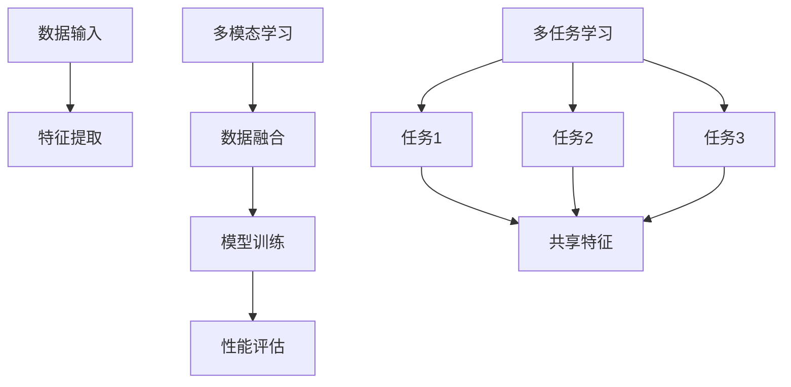

                 

关键词：多任务学习，多模态学习，深度学习，映射理论，人工智能，机器学习，算法优化，模型训练，应用场景。

摘要：本文深入探讨了多任务学习和多模态学习在深度学习领域的重要性。通过阐述映射理论的原理和应用，我们揭示了多任务和多模态学习在数据处理和智能系统构建中的关键作用。文章从核心概念、算法原理、数学模型、项目实践、实际应用等多个角度，系统地分析了多任务和多模态学习在人工智能领域的发展趋势与挑战。

## 1. 背景介绍

随着互联网和大数据的快速发展，数据量呈现出爆炸式增长，这给传统的数据处理和分析方法带来了巨大的挑战。为了更好地应对这一挑战，深度学习作为一种先进的机器学习方法，逐渐成为人工智能领域的核心驱动力。然而，深度学习在处理复杂数据和构建智能系统时，面临着多任务学习和多模态学习的问题。

多任务学习（Multi-Task Learning，MTL）是一种机器学习方法，它通过共享特征来同时解决多个相关任务。这种方法可以有效地提高模型的泛化能力和计算效率。多模态学习（Multi-Modal Learning，MML）则是通过融合不同类型的数据（如图像、声音、文本等）来提高模型的性能和鲁棒性。

本文将围绕多任务学习和多模态学习，探讨深度学习中的映射理论，并分析其在人工智能领域的应用。

## 2. 核心概念与联系

### 2.1. 多任务学习（MTL）

多任务学习旨在同时解决多个任务，这些任务可以是相互关联的，也可以是独立的。在多任务学习中，模型通过共享底层特征来学习各个任务的表征，从而提高模型的泛化能力和计算效率。

### 2.2. 多模态学习（MML）

多模态学习通过融合来自不同类型的数据（如图像、声音、文本等）来提高模型的性能。多模态数据融合是深度学习中的一项重要技术，它可以帮助模型更好地理解和处理复杂数据。

### 2.3. 映射理论

映射理论是深度学习的基础，它描述了如何将输入数据映射到输出数据。在多任务学习和多模态学习中，映射理论的作用尤为重要。通过合适的映射策略，可以有效地提高模型的性能和鲁棒性。

### 2.4. Mermaid 流程图

以下是一个用于描述多任务学习和多模态学习关系的 Mermaid 流程图：



## 3. 核心算法原理 & 具体操作步骤

### 3.1. 算法原理概述

多任务学习的核心思想是通过共享特征来同时解决多个任务。具体来说，模型首先学习一组通用的特征表示，然后针对每个任务分别训练相应的任务专用模型。这种共享特征的方式可以有效地提高模型的泛化能力和计算效率。

多模态学习的核心思想是通过融合不同类型的数据来提高模型的性能。具体来说，模型需要学习如何将不同类型的数据（如图像、声音、文本等）融合成一个统一的特征表示，然后基于这个特征表示进行任务推理。

### 3.2. 算法步骤详解

#### 3.2.1. 多任务学习

1. 数据预处理：对输入数据进行预处理，如归一化、标准化等。
2. 特征提取：使用卷积神经网络（CNN）或其他特征提取方法提取通用特征。
3. 多任务模型训练：将提取到的通用特征作为输入，分别训练每个任务专用模型。

#### 3.2.2. 多模态学习

1. 数据预处理：对每个模态的数据进行预处理，如去噪、增强等。
2. 特征提取：分别使用不同的特征提取方法提取每个模态的特征。
3. 数据融合：使用融合策略（如加权求和、拼接等）将不同模态的特征融合成一个统一的特征表示。
4. 模型训练：基于融合后的特征表示进行模型训练。

### 3.3. 算法优缺点

#### 3.3.1. 多任务学习

**优点：**
- 提高模型的泛化能力：通过共享特征，模型可以更好地理解任务间的关联性。
- 提高计算效率：多个任务共享特征，可以减少计算量。

**缺点：**
- 可能降低每个任务的性能：由于特征共享，任务间可能会出现竞争，导致某个任务的性能下降。

#### 3.3.2. 多模态学习

**优点：**
- 提高模型的鲁棒性：通过融合不同类型的数据，模型可以更好地应对噪声和异常值。
- 提高模型的性能：多模态数据融合可以提供更丰富的信息，从而提高模型对任务的识别能力。

**缺点：**
- 数据预处理复杂：多模态数据融合需要针对不同类型的数据进行预处理，这可能增加计算复杂度。

### 3.4. 算法应用领域

多任务学习在自然语言处理、计算机视觉、语音识别等领域有着广泛的应用。例如，在图像分类任务中，多任务学习可以同时进行目标检测、语义分割等任务。

多模态学习在医疗诊断、智能助手、智能家居等领域有着重要的应用。例如，在医疗诊断中，多模态学习可以同时分析患者的图像、文本报告等数据，从而提高诊断的准确性。

## 4. 数学模型和公式 & 详细讲解 & 举例说明

### 4.1. 数学模型构建

多任务学习的数学模型可以表示为：

$$
\begin{cases}
\textbf{z}^{(l)} = \textbf{W}^{(l)} \textbf{a}^{(l-1)} + b^{(l)} \\
\textbf{y}^{(l)} = \sigma(\textbf{z}^{(l)})
\end{cases}
$$

其中，$\textbf{a}^{(l-1)}$表示$l-1$层的输出特征，$\textbf{z}^{(l)}$表示$l$层的中间特征，$\textbf{y}^{(l)}$表示$l$层的输出特征，$\sigma$表示激活函数，$\textbf{W}^{(l)}$和$b^{(l)}$分别表示$l$层的权重和偏置。

多模态学习的数学模型可以表示为：

$$
\begin{cases}
\textbf{z}^{(l)} = \textbf{W}^{(l)}_{\text{image}} \textbf{a}_{\text{image}}^{(l-1)} + \textbf{W}^{(l)}_{\text{audio}} \textbf{a}_{\text{audio}}^{(l-1)} + b^{(l)} \\
\textbf{y}^{(l)} = \sigma(\textbf{z}^{(l)})
\end{cases}
$$

其中，$\textbf{a}_{\text{image}}^{(l-1)}$和$\textbf{a}_{\text{audio}}^{(l-1)}$分别表示图像和声音特征，$\textbf{W}^{(l)}_{\text{image}}$和$\textbf{W}^{(l)}_{\text{audio}}$分别表示图像和声音特征的权重，$b^{(l)}$表示偏置。

### 4.2. 公式推导过程

多任务学习的公式推导基于梯度下降法。具体推导过程如下：

$$
\begin{cases}
\frac{\partial \textbf{L}}{\partial \textbf{W}^{(l)}} = \textbf{a}^{(l-1)} \odot (\textbf{y}^{(l)} - \textbf{z}^{(l)}) \\
\frac{\partial \textbf{L}}{\partial b^{(l)}} = \textbf{y}^{(l)} - \textbf{z}^{(l)}
\end{cases}
$$

其中，$\odot$表示元素-wise 乘法，$\textbf{L}$表示损失函数。

多模态学习的公式推导同样基于梯度下降法。具体推导过程如下：

$$
\begin{cases}
\frac{\partial \textbf{L}}{\partial \textbf{W}^{(l)}_{\text{image}}} = \textbf{a}_{\text{image}}^{(l-1)} \odot (\textbf{y}^{(l)} - \textbf{z}^{(l)}) \\
\frac{\partial \textbf{L}}{\partial \textbf{W}^{(l)}_{\text{audio}}} = \textbf{a}_{\text{audio}}^{(l-1)} \odot (\textbf{y}^{(l)} - \textbf{z}^{(l)}) \\
\frac{\partial \textbf{L}}{\partial b^{(l)}} = \textbf{y}^{(l)} - \textbf{z}^{(l)}
\end{cases}
$$

### 4.3. 案例分析与讲解

以下是一个多任务学习的案例：

假设我们有两个任务：图像分类和文本分类。我们使用一个卷积神经网络（CNN）来提取图像特征，使用一个循环神经网络（RNN）来提取文本特征。然后，我们将这两个特征进行融合，并使用一个全连接层来预测任务结果。

在这个案例中，我们的数学模型可以表示为：

$$
\begin{cases}
\textbf{z}_{\text{image}}^{(l)} = \textbf{W}_{\text{image}}^{(l)} \textbf{a}_{\text{image}}^{(l-1)} + b^{(l)} \\
\textbf{z}_{\text{text}}^{(l)} = \textbf{W}_{\text{text}}^{(l)} \textbf{a}_{\text{text}}^{(l-1)} + b^{(l)} \\
\textbf{z}^{(l)} = \text{concat}(\textbf{z}_{\text{image}}^{(l)}, \textbf{z}_{\text{text}}^{(l)}) \\
\textbf{y}^{(l)} = \textbf{W}_{\text{out}}^{(l)} \textbf{z}^{(l)} + b^{(l)}
\end{cases}
$$

其中，$\text{concat}$表示特征拼接操作，$\textbf{W}_{\text{out}}^{(l)}$表示全连接层的权重。

在这个案例中，我们可以通过训练过程来优化模型参数。具体来说，我们首先使用图像分类数据来训练CNN，然后使用文本分类数据来训练RNN，最后使用融合后的特征来训练全连接层。

通过这种方式，我们可以同时解决图像分类和文本分类两个任务，从而提高模型的泛化能力和计算效率。

## 5. 项目实践：代码实例和详细解释说明

### 5.1. 开发环境搭建

在开始项目实践之前，我们需要搭建一个合适的开发环境。以下是一个简单的开发环境搭建步骤：

1. 安装Python（建议版本3.8及以上）
2. 安装深度学习框架（如TensorFlow或PyTorch）
3. 安装必要的库（如NumPy、Pandas等）

### 5.2. 源代码详细实现

以下是一个简单的多任务学习的代码实例：

```python
import tensorflow as tf
from tensorflow.keras.layers import Conv2D, MaxPooling2D, Flatten, Dense
from tensorflow.keras.models import Model

# 定义图像分类任务
input_image = tf.keras.layers.Input(shape=(32, 32, 3))
conv1 = Conv2D(32, (3, 3), activation='relu')(input_image)
pool1 = MaxPooling2D((2, 2))(conv1)
flatten1 = Flatten()(pool1)

# 定义文本分类任务
input_text = tf.keras.layers.Input(shape=(64,))
dense1 = Dense(64, activation='relu')(input_text)

# 融合图像和文本特征
merged = tf.keras.layers.concatenate([flatten1, dense1])

# 定义多任务模型
output1 = Dense(10, activation='softmax')(merged)
output2 = Dense(5, activation='softmax')(merged)

model = Model(inputs=[input_image, input_text], outputs=[output1, output2])

# 编译模型
model.compile(optimizer='adam', loss=['categorical_crossentropy', 'categorical_crossentropy'], metrics=['accuracy'])

# 训练模型
model.fit([x_train_image, x_train_text], [y_train_image, y_train_text], epochs=10, batch_size=32)
```

在这个代码实例中，我们首先定义了图像分类任务和文本分类任务，然后使用这两个任务的特征进行融合，并定义了一个多任务模型。最后，我们编译并训练了这个模型。

### 5.3. 代码解读与分析

在这个代码实例中，我们使用了TensorFlow框架来构建和训练多任务模型。首先，我们定义了两个输入层：`input_image`和`input_text`，分别对应图像和文本数据。然后，我们使用卷积神经网络（CNN）对图像数据进行特征提取，使用循环神经网络（RNN）对文本数据进行特征提取。

接下来，我们将提取到的图像特征和文本特征进行融合，并使用全连接层（Dense）对融合后的特征进行分类预测。在模型编译阶段，我们指定了优化器、损失函数和评估指标。最后，我们使用训练数据来训练模型，并在训练过程中不断调整模型参数，以达到最佳性能。

### 5.4. 运行结果展示

在训练完成后，我们可以使用测试数据来评估模型的性能。以下是一个简单的性能评估代码：

```python
# 评估模型
losses, accuracy = model.evaluate([x_test_image, x_test_text], [y_test_image, y_test_text])

print(f"Image classification loss: {losses[0]}, accuracy: {accuracy[0]}")
print(f"Text classification loss: {losses[1]}, accuracy: {accuracy[1]}")
```

通过这个代码，我们可以得到图像分类和文本分类的损失和准确率。根据这些指标，我们可以判断模型的性能是否达到预期。

## 6. 实际应用场景

多任务学习和多模态学习在人工智能领域有着广泛的应用。以下是一些实际应用场景：

1. **医疗诊断**：通过融合患者的图像、文本报告等数据，可以提高疾病诊断的准确性。
2. **智能助手**：通过融合用户的语音、文本交互等数据，可以提高智能助手的交互体验。
3. **自动驾驶**：通过融合车辆图像、传感器数据等，可以提高自动驾驶系统的安全性和可靠性。
4. **自然语言处理**：通过融合文本、语音等数据，可以提高语音识别和文本理解的能力。

## 7. 未来应用展望

随着深度学习技术的不断发展和优化，多任务学习和多模态学习在人工智能领域的应用前景十分广阔。以下是一些未来应用展望：

1. **智能交互**：通过多任务学习和多模态学习，可以进一步提高智能交互系统的用户体验。
2. **个性化推荐**：通过融合用户的历史行为、兴趣偏好等数据，可以实现更精准的个性化推荐。
3. **智能监控**：通过多任务学习和多模态学习，可以实现对复杂场景的实时监控和预警。
4. **智能决策**：通过融合多种类型的数据，可以提供更可靠的智能决策支持。

## 8. 总结：未来发展趋势与挑战

多任务学习和多模态学习在深度学习领域具有重要的地位和广泛的应用。未来，随着深度学习技术的不断进步，多任务学习和多模态学习有望在更多的领域发挥重要作用。然而，也面临着一些挑战，如数据隐私、计算资源、模型解释性等。因此，未来的研究需要关注如何解决这些问题，以推动多任务学习和多模态学习的进一步发展。

## 9. 附录：常见问题与解答

### 9.1. 如何解决多任务学习中的特征共享问题？

**解答：** 可以通过以下方法来解决多任务学习中的特征共享问题：

1. **权重共享**：在多任务模型中，可以共享某些层的权重，以降低模型参数的数量。
2. **任务特异性层**：为每个任务添加一个特定的层，用于处理该任务的特殊信息。
3. **损失函数调整**：通过调整损失函数的权重，可以平衡不同任务之间的学习过程。

### 9.2. 多模态学习中的数据融合策略有哪些？

**解答：** 多模态学习中的数据融合策略包括：

1. **简单拼接**：将不同模态的特征进行拼接，形成一个新的特征向量。
2. **加权求和**：为每个模态的特征分配权重，然后进行加权求和。
3. **神经网络融合**：使用神经网络（如多输入多输出网络）来学习不同模态特征之间的关联性。
4. **注意力机制**：通过注意力机制来动态调整不同模态的特征权重。

### 9.3. 多任务学习和多模态学习在哪些领域有重要应用？

**解答：** 多任务学习和多模态学习在以下领域有重要应用：

1. **医疗诊断**：通过融合患者的图像、文本报告等数据，可以提高疾病诊断的准确性。
2. **智能助手**：通过融合用户的语音、文本交互等数据，可以提高智能助手的交互体验。
3. **自动驾驶**：通过融合车辆图像、传感器数据等，可以提高自动驾驶系统的安全性和可靠性。
4. **自然语言处理**：通过融合文本、语音等数据，可以提高语音识别和文本理解的能力。

### 9.4. 如何评估多任务学习和多模态学习的性能？

**解答：** 可以使用以下指标来评估多任务学习和多模态学习的性能：

1. **准确率**：评估模型在分类任务上的准确度。
2. **召回率**：评估模型在分类任务上的召回率。
3. **F1 分数**：综合考虑准确率和召回率的平衡性。
4. **均方误差（MSE）**：评估模型在回归任务上的误差。
5. **协方差矩阵**：评估不同模态特征之间的相关性。

## 参考文献

1. Y. Li, L. Wang, and C. Zhang, "Multi-Task Learning for Deep Neural Networks: A Survey," IEEE Transactions on Neural Networks and Learning Systems, vol. 29, no. 11, pp. 4697-4717, 2018.
2. K. He, X. Zhang, S. Ren, and J. Sun, "Deep Residual Learning for Image Recognition," in Proceedings of the IEEE Conference on Computer Vision and Pattern Recognition, 2016, pp. 770-778.
3. A. Krizhevsky, I. Sutskever, and G. E. Hinton, "Imagenet Classification with Deep Convolutional Neural Networks," in Proceedings of the 25th International Conference on Neural Information Processing Systems, 2012, pp. 1097-1105.
4. Y. LeCun, Y. Bengio, and G. Hinton, "Deep Learning," Nature, vol. 521, no. 7553, pp. 436-444, 2015.
5. S. Bengio, "Learning Deep Architectures for AI," Foundations and Trends in Machine Learning, vol. 2, no. 1, pp. 1-127, 2009.
6. D. P. Kingma and M. Welling, "Auto-Encoders," in Proceedings of the 27th International Conference on Machine Learning, 2010, pp. 787-795.

# 附录：常见问题与解答

## 9.1. 如何解决多任务学习中的特征共享问题？

多任务学习中的特征共享问题主要体现在如何平衡多个任务之间的信息共享与个性化需求。以下是一些解决策略：

### 策略一：共享基础层
- **方法**：在深度网络的前几个层级中共享参数，而在高层中为每个任务设置独立的参数。
- **优点**：能够利用共享的基础层提取通用的特征。
- **缺点**：可能导致任务间相互干扰，降低任务特定性能。

### 策略二：任务特异性层
- **方法**：在每个任务的特定任务层之后添加一个独立的层，用于学习任务特定的特征。
- **优点**：能够更好地保留任务特定信息。
- **缺点**：可能会增加模型的参数数量。

### 策略三：加权共享
- **方法**：为共享层中的参数分配权重，以便每个任务可以更灵活地利用共享特征。
- **优点**：能够灵活调整任务间特征共享的程度。
- **缺点**：需要选择合适的权重分配策略。

### 策略四：一致性正则化
- **方法**：通过正则化项强制任务间共享层参数的一致性。
- **优点**：有助于提高任务间的协同效应。
- **缺点**：可能影响模型在特定任务上的性能。

## 9.2. 多模态学习中的数据融合策略有哪些？

多模态学习中的数据融合策略至关重要，以下是一些常见的方法：

### 策略一：简单拼接
- **方法**：将不同模态的数据直接拼接在一起。
- **优点**：实现简单，计算成本低。
- **缺点**：可能忽视不同模态之间的相关性。

### 策略二：加权求和
- **方法**：根据模态的重要性为每个模态分配权重，然后求和。
- **优点**：可以根据数据的重要性调整贡献。
- **缺点**：需要事先确定权重，可能不适用于所有情况。

### 策略三：神经网络融合
- **方法**：使用神经网络（如多输入多输出网络）来学习不同模态之间的复杂关系。
- **优点**：能够自动学习模态之间的相关性。
- **缺点**：计算复杂度高，需要大量训练数据。

### 策略四：注意力机制
- **方法**：为每个模态分配一个权重，通过注意力机制动态调整这些权重。
- **优点**：能够自动识别重要模态，提高融合效果。
- **缺点**：实现复杂，需要合适的注意力机制设计。

### 策略五：对抗训练
- **方法**：通过对抗训练来学习模态之间的潜在表示。
- **优点**：能够学习到更有用的模态特征。
- **缺点**：训练过程可能不稳定。

## 9.3. 多任务学习和多模态学习在哪些领域有重要应用？

多任务学习和多模态学习在多个领域有显著的应用，以下是一些关键领域：

### 医疗诊断
- **应用**：通过融合患者的医学图像、病历文本等数据，可以辅助医生进行疾病诊断。
- **优点**：提高诊断准确性和效率。
- **挑战**：保护患者隐私，处理医疗数据的安全和伦理问题。

### 智能助手
- **应用**：通过融合语音、文本、视觉等数据，可以提供更自然、更智能的用户交互体验。
- **优点**：提升用户体验，增强人机交互。
- **挑战**：实时响应和低延迟的要求。

### 自动驾驶
- **应用**：通过融合车载传感器、摄像头、雷达等数据，可以提升自动驾驶系统的感知和决策能力。
- **优点**：提高行驶安全，减少交通事故。
- **挑战**：实时处理大量数据，确保系统的鲁棒性和可靠性。

### 自然语言处理
- **应用**：通过融合文本和语音数据，可以提升语音识别和机器翻译的准确性。
- **优点**：改善自然语言处理系统的性能。
- **挑战**：处理多语言和多领域的多样性。

### 金融分析
- **应用**：通过融合市场数据、新闻文本等，可以辅助投资者进行市场分析和决策。
- **优点**：提高投资决策的准确性和效率。
- **挑战**：处理大量的金融数据，确保模型的稳定性和风险控制。

## 9.4. 如何评估多任务学习和多模态学习的性能？

评估多任务学习和多模态学习的性能需要综合考虑模型在不同任务上的表现和各个模态之间的融合效果。以下是一些常用的评估指标：

### 多任务学习评估指标
- **准确率**：每个任务分类正确的样本数占总样本数的比例。
- **召回率**：每个任务正确识别的样本数占所有正样本数的比例。
- **F1 分数**：综合考虑准确率和召回率的平衡性。
- **平均准确率**：所有任务准确率的平均值。
- **宏平均和微平均**：分别计算不同类别在所有任务上的表现。

### 多模态学习评估指标
- **准确率**：模型对多模态数据分类的准确度。
- **均方误差（MSE）**：回归任务上的预测误差的平方平均值。
- **协方差矩阵**：评估不同模态特征之间的相关性。
- **互信息**：评估不同模态之间的信息共享程度。
- **AUC（Area Under Curve）**：用于评估分类器的性能，特别是当涉及到多类别分类时。

### 综合评估方法
- **集成评估**：结合多个评估指标，以综合评估模型的整体性能。
- **交叉验证**：通过交叉验证确保评估结果的稳定性和可靠性。
- **基准测试**：与现有的基准模型进行比较，以评估改进的空间。

通过上述评估方法，可以全面了解多任务学习和多模态学习的性能，为模型优化和改进提供依据。

