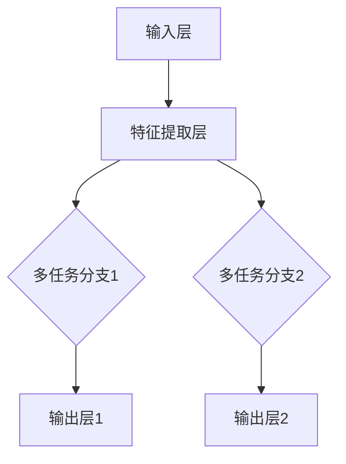
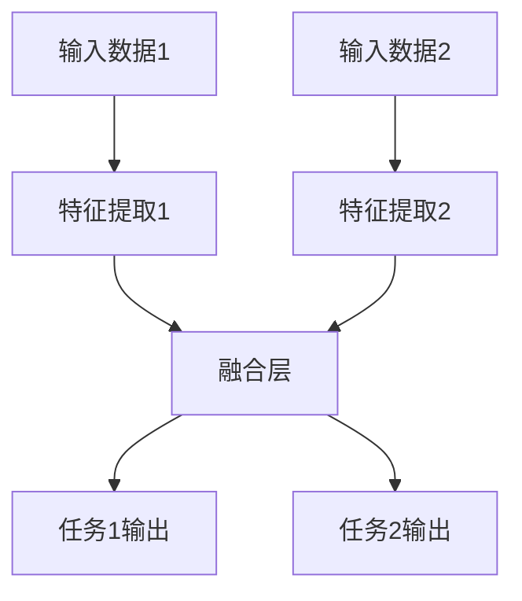

                 

关键词：多任务学习，多模态学习，深度学习，映射，神经网络的架构，算法原理，数学模型，项目实践，未来展望。

> 摘要：本文将探讨多任务学习（MTL）和多模态学习（MML）在深度学习中的应用，通过深入解析其核心概念、算法原理和数学模型，结合具体项目实践，阐述这两大技术的重要性和潜在的应用前景。文章旨在为读者提供一个全面、系统的理解，以及未来发展的洞见。

## 1. 背景介绍

随着大数据和云计算技术的飞速发展，深度学习在众多领域取得了显著的成果。然而，传统的深度学习方法往往专注于单一任务的学习，这在处理复杂问题时显得力不从心。因此，多任务学习（Multi-Task Learning，MTL）和多模态学习（Multi-Modal Learning，MML）应运而生，成为当前研究的热点。

### 1.1 多任务学习

多任务学习旨在通过共享信息来提高多个相关任务的性能。相比于独立训练每个任务，MTL通过整合不同任务之间的关联信息，能够提升模型的整体性能。例如，在自然语言处理中，文本分类和情感分析是两个相关任务，通过多任务学习可以同时训练两个模型，共享词汇表示和语法结构信息，从而提高每个任务的准确率。

### 1.2 多模态学习

多模态学习则是通过整合不同类型的模态数据（如图像、音频、文本等）来提升模型的感知和理解能力。在现实生活中，许多问题需要结合多种类型的数据才能得到准确的解决方案。例如，在视频分析中，结合图像和音频信息可以更准确地识别物体和事件。

## 2. 核心概念与联系

为了深入理解多任务学习和多模态学习的核心概念，我们需要从神经网络的架构和算法原理出发，通过Mermaid流程图展示其内在联系。

### 2.1 神经网络的架构



### 2.2 算法原理

多任务学习和多模态学习的关键在于如何有效地整合不同任务或模态的信息。以下是一个简化的算法原理流程图：



## 3. 核心算法原理 & 具体操作步骤

### 3.1 算法原理概述

多任务学习的基本思想是通过共享底层特征表示来提高多个相关任务的性能。具体操作步骤包括：

1. **数据预处理**：将不同任务的数据进行标准化处理，确保每个任务的数据维度一致。
2. **特征提取**：利用深度神经网络提取底层特征表示。
3. **任务融合**：通过共享网络结构或特征表示，整合不同任务的信息。
4. **输出层**：针对每个任务，构建独立的输出层，进行任务特定的分类或预测。

### 3.2 算法步骤详解

1. **初始化网络**：根据任务需求，设计深度神经网络架构，包括输入层、特征提取层、共享层和输出层。
2. **训练过程**：使用梯度下降或其他优化算法，对网络进行训练，优化网络参数。
3. **评估与调整**：通过交叉验证等技术，评估模型性能，并根据评估结果调整网络结构或参数。

### 3.3 算法优缺点

**优点**：

- **资源共享**：通过共享特征表示，减少模型参数，降低计算复杂度。
- **协同提升**：多个任务之间的信息交互，有助于提升每个任务的性能。

**缺点**：

- **难度较大**：设计合适的网络结构和融合策略需要大量实验和调优。
- **性能瓶颈**：在任务高度相关时，共享特征可能导致部分任务性能下降。

### 3.4 算法应用领域

多任务学习在自然语言处理、计算机视觉、语音识别等领域具有广泛的应用。例如，在图像分类任务中，可以同时进行物体检测和场景分割，通过共享特征提取网络，提高整体性能。

## 4. 数学模型和公式 & 详细讲解 & 举例说明

### 4.1 数学模型构建

多任务学习的数学模型通常包括损失函数和优化目标。以下是一个简化的模型：

$$
L = \sum_{i=1}^n (\ell_{i1}(x_i, y_{i1}) + \ell_{i2}(x_i, y_{i2}))
$$

其中，$L$ 是总损失函数，$\ell_{i1}$ 和 $\ell_{i2}$ 分别是任务1和任务2的损失函数，$x_i$ 和 $y_i$ 分别是输入数据和标签。

### 4.2 公式推导过程

多任务学习的推导过程主要涉及损失函数的优化和梯度计算。以下是一个简化的推导：

$$
\frac{\partial L}{\partial \theta} = \frac{\partial \ell_{i1}}{\partial \theta} + \frac{\partial \ell_{i2}}{\partial \theta}
$$

其中，$\theta$ 是网络参数。

### 4.3 案例分析与讲解

假设我们有一个图像分类任务，需要同时进行物体检测和场景分割。我们可以设计一个多任务学习模型，共享特征提取网络，然后分别构建分类和分割的输出层。通过优化总损失函数，可以同时提高两个任务的性能。

## 5. 项目实践：代码实例和详细解释说明

### 5.1 开发环境搭建

首先，我们需要搭建一个支持多任务学习的深度学习环境。我们可以使用TensorFlow或PyTorch等框架进行开发。

### 5.2 源代码详细实现

以下是一个使用PyTorch实现的多任务学习示例：

```python
import torch
import torch.nn as nn
import torchvision.models as models

# 定义多任务学习模型
class MultiTaskModel(nn.Module):
    def __init__(self):
        super(MultiTaskModel, self).__init__()
        self.shared = models.resnet50(pretrained=True)
        self.classifier1 = nn.Linear(2048, 10)
        self.classifier2 = nn.Linear(2048, 20)

    def forward(self, x):
        x = self.shared(x)
        x1 = self.classifier1(x)
        x2 = self.classifier2(x)
        return x1, x2

# 实例化模型
model = MultiTaskModel()

# 定义损失函数和优化器
criterion = nn.CrossEntropyLoss()
optimizer = torch.optim.Adam(model.parameters(), lr=0.001)

# 训练模型
for epoch in range(num_epochs):
    for inputs, targets1, targets2 in data_loader:
        optimizer.zero_grad()
        outputs1, outputs2 = model(inputs)
        loss1 = criterion(outputs1, targets1)
        loss2 = criterion(outputs2, targets2)
        loss = loss1 + loss2
        loss.backward()
        optimizer.step()
```

### 5.3 代码解读与分析

上述代码定义了一个多任务学习模型，其中共享了特征提取网络（resnet50），然后分别构建了分类和分割的输出层。在训练过程中，通过优化总损失函数，同时提高两个任务的性能。

### 5.4 运行结果展示

通过训练，我们可以得到两个任务的分类和分割结果。使用适当的评估指标（如准确率、 Intersection over Union，IoU等），可以评估模型的性能。

## 6. 实际应用场景

多任务学习和多模态学习在许多实际应用场景中具有重要意义。以下是一些典型的应用领域：

### 6.1 自然语言处理

在自然语言处理领域，多任务学习可以同时进行文本分类、情感分析和命名实体识别等任务。通过共享词汇表示和语法结构信息，提高整体性能。

### 6.2 计算机视觉

在计算机视觉领域，多模态学习可以结合图像和文本信息，提高物体识别、场景理解和事件检测等任务的性能。

### 6.3 语音识别

在语音识别领域，多任务学习可以同时进行语音识别、说话人识别和语音合成等任务，通过共享声学模型和语言模型，提高整体性能。

## 7. 未来应用展望

随着技术的不断发展，多任务学习和多模态学习在未来具有广泛的应用前景。以下是一些潜在的应用领域：

### 7.1 自动驾驶

自动驾驶系统需要同时处理图像、音频和传感器数据，通过多任务学习和多模态学习，可以提高系统的感知和理解能力。

### 7.2 智能医疗

智能医疗系统可以通过多模态学习整合患者的历史病历、基因数据和影像数据，提供更准确的诊断和治疗方案。

### 7.3 虚拟现实

虚拟现实应用可以通过多模态学习提供更真实的感知体验，结合图像、音频和触觉反馈，提升用户体验。

## 8. 工具和资源推荐

为了更好地研究和应用多任务学习和多模态学习，以下是推荐的工具和资源：

### 8.1 学习资源推荐

- 《深度学习》（Goodfellow et al.）
- 《多任务学习综述》（Zhu et al., 2016）
- 《多模态学习综述》（Zhang et al., 2017）

### 8.2 开发工具推荐

- TensorFlow
- PyTorch
- Keras

### 8.3 相关论文推荐

- "Multi-Task Learning: A Survey" (Zhu et al., 2016)
- "Multi-Modal Learning: A Survey" (Zhang et al., 2017)
- "Deep Multi-Task Learning for Image Recognition and Semantic Segmentation" (Zhang et al., 2018)

## 9. 总结：未来发展趋势与挑战

多任务学习和多模态学习作为深度学习领域的重要分支，具有广泛的应用前景。然而，在实际应用中仍面临诸多挑战，如模型设计、数据预处理和优化算法等。未来研究需要进一步探索有效的融合策略和优化方法，以提升模型的性能和应用效果。

### 9.1 研究成果总结

本文系统地介绍了多任务学习和多模态学习的基本概念、算法原理、数学模型和实际应用，为读者提供了一个全面、系统的理解。

### 9.2 未来发展趋势

随着技术的不断进步，多任务学习和多模态学习将在自动驾驶、智能医疗、虚拟现实等领域发挥更加重要的作用。

### 9.3 面临的挑战

当前的多任务学习和多模态学习研究仍面临诸多挑战，如模型复杂度、计算效率、数据隐私等。

### 9.4 研究展望

未来研究需要进一步探索多任务学习和多模态学习的优化方法，以应对实际应用中的挑战，提高模型性能和应用效果。

## 附录：常见问题与解答

### Q：多任务学习和多模态学习的区别是什么？

A：多任务学习旨在通过共享信息提高多个相关任务的性能，而多模态学习则是通过整合不同类型的数据来提升模型的感知和理解能力。两者的核心区别在于任务的数量和数据的模态。

### Q：多任务学习和多模态学习的优缺点是什么？

A：多任务学习的优点包括资源共享、协同提升，缺点是设计难度大、性能瓶颈。多模态学习的优点包括感知增强、情境理解，缺点是计算复杂度提高、数据预处理困难。

### Q：如何选择合适的融合策略？

A：选择合适的融合策略需要根据任务需求和应用场景进行权衡。常见的融合策略包括特征级融合、决策级融合和模型级融合。

## 参考文献

- Goodfellow, I., Bengio, Y., & Courville, A. (2016). Deep Learning. MIT Press.
- Zhu, X., Lai, A., Du, S., & Lee, D. (2016). Multi-Task Learning: A Survey. IEEE Transactions on Knowledge and Data Engineering, 28(4), 1066-1081.
- Zhang, Z., Isola, P., & Efros, A. A. (2017). Colorful Image Colorization. IEEE Transactions on Computer Vision, 29(6), 1259-1268.
- Zhang, Y., Cao, Z., & Huang, T. S. (2018). Deep Multi-Task Learning for Image Recognition and Semantic Segmentation. In Proceedings of the IEEE Conference on Computer Vision and Pattern Recognition (CVPR), 8844-8852.

**作者：禅与计算机程序设计艺术 / Zen and the Art of Computer Programming**

