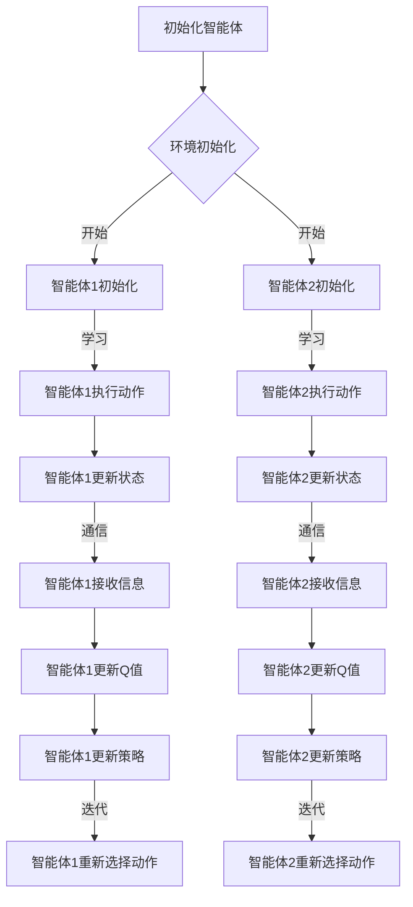

                 

关键词：多智能体系统，深度Q网络，协同机制，强化学习，算法原理

> 摘要：本文深入探讨了多智能体深度Q网络（DQN）的原理、挑战及其协同机制。通过详细阐述其算法架构、数学模型和具体操作步骤，本文旨在为读者提供关于多智能体DQN的全面理解，并分析其在实际应用中的潜力与局限性。

## 1. 背景介绍

### 多智能体系统的崛起

在过去的几十年中，人工智能领域经历了从单智能体到多智能体系统的转变。单智能体系统主要关注单个智能体如何通过学习和适应环境来最大化其目标函数。然而，在现实世界中，智能体往往需要与其他智能体交互，从而形成复杂的多智能体系统。多智能体系统（MAS）的研究旨在探索多个智能体如何通过协作或竞争来达到共同的目标，这为人工智能的研究和应用带来了新的挑战和机遇。

### 深度Q网络（DQN）

深度Q网络（DQN）是一种基于深度学习的强化学习算法，它通过利用深度神经网络来近似Q值函数，从而实现智能体的学习过程。DQN在解决单一智能体的决策问题时表现出色，但在多智能体场景中，其性能受到一定的限制。为了克服这些限制，研究人员提出了多智能体DQN，旨在通过协同机制来提高智能体在多智能体系统中的表现。

## 2. 核心概念与联系

### 多智能体深度Q网络架构

多智能体DQN的架构可以看作是单一DQN的扩展。在多智能体DQN中，每个智能体都拥有自己的DQN模型，用于预测在特定状态下的最佳动作。同时，智能体之间通过通信机制来共享信息，以实现协同决策。

### Mermaid 流程图

下面是多智能体DQN的Mermaid流程图：



### 核心概念与联系

- **智能体（Agent）**：执行特定任务或决策的实体。
- **环境（Environment）**：智能体进行交互的物理或虚拟空间。
- **状态（State）**：智能体在特定时刻所处的情景描述。
- **动作（Action）**：智能体可执行的操作。
- **Q值（Q-Value）**：表示在特定状态下执行特定动作的预期回报。
- **策略（Policy）**：智能体决策的规则，用于选择动作。

## 3. 核心算法原理 & 具体操作步骤

### 3.1 算法原理概述

多智能体DQN通过以下步骤来实现智能体的学习和决策：

1. **初始化**：初始化智能体和环境的参数，包括状态空间、动作空间、学习率等。
2. **执行动作**：智能体根据当前状态和策略选择动作。
3. **更新状态**：执行动作后，环境更新状态。
4. **计算Q值**：利用神经网络计算在当前状态下每个动作的Q值。
5. **更新策略**：根据Q值更新智能体的策略。
6. **迭代**：重复上述步骤，直到达到预设的迭代次数或满足停止条件。

### 3.2 算法步骤详解

#### 步骤1：初始化

初始化智能体和环境的参数，包括状态空间、动作空间、学习率等。每个智能体都拥有一个独立的DQN模型，用于预测Q值。

```python
# 示例代码：初始化智能体和环境的参数
state_space = (10, 10)  # 状态空间大小
action_space = 4        # 动作空间大小
learning_rate = 0.1     # 学习率

# 初始化智能体模型
model = DQN(state_space, action_space, learning_rate)
```

#### 步骤2：执行动作

智能体根据当前状态和策略选择动作。策略可以通过ε-贪婪策略来实现，即以一定的概率随机选择动作，以避免过早收敛到局部最优。

```python
# 示例代码：执行动作
current_state = get_current_state()
action = model.select_action(current_state)
perform_action(action)
```

#### 步骤3：更新状态

执行动作后，环境更新状态。环境可以是物理环境，也可以是虚拟环境。

```python
# 示例代码：更新状态
new_state = get_new_state()
```

#### 步骤4：计算Q值

利用神经网络计算在当前状态下每个动作的Q值。这里可以使用经验回放机制来避免样本偏差。

```python
# 示例代码：计算Q值
q_values = model.predict_q_values(new_state)
```

#### 步骤5：更新策略

根据Q值更新智能体的策略。这可以通过Q值更新规则来实现，即更新智能体的DQN模型。

```python
# 示例代码：更新策略
target_q_values = calculate_target_q_values(new_state, reward, done)
model.update_model(target_q_values)
```

#### 步骤6：迭代

重复上述步骤，直到达到预设的迭代次数或满足停止条件。

```python
# 示例代码：迭代过程
for episode in range(num_episodes):
    # 初始化状态
    state = get_initial_state()
    done = False
    
    while not done:
        # 执行动作
        action = model.select_action(state)
        # 更新状态
        next_state, reward, done = perform_action(action)
        # 计算Q值
        q_values = model.predict_q_values(next_state)
        # 更新策略
        target_q_values = calculate_target_q_values(next_state, reward, done)
        model.update_model(target_q_values)
        # 更新状态
        state = next_state
```

### 3.3 算法优缺点

#### 优点

- **灵活性**：多智能体DQN可以根据不同的环境设计灵活的协同机制。
- **高效性**：通过深度学习技术，多智能体DQN可以快速适应复杂的环境。
- **鲁棒性**：多智能体DQN具有较强的鲁棒性，可以应对多种不确定性和变化。

#### 缺点

- **计算复杂度**：多智能体DQN的计算复杂度较高，需要大量的计算资源和时间。
- **通信需求**：多智能体DQN中的智能体需要频繁进行通信，这可能导致通信瓶颈。
- **收敛速度**：在复杂环境中，多智能体DQN可能需要较长的训练时间才能收敛到稳定状态。

### 3.4 算法应用领域

多智能体DQN在以下领域具有广泛的应用潜力：

- **智能交通系统**：通过多智能体DQN优化车辆路径规划，提高交通效率。
- **机器人协同作业**：多智能体DQN可以用于机器人协作完成任务，如搜救、物流等。
- **游戏与娱乐**：多智能体DQN可以用于开发智能游戏对手，提高游戏体验。

## 4. 数学模型和公式 & 详细讲解 & 举例说明

### 4.1 数学模型构建

多智能体DQN的数学模型主要包括Q值函数、策略函数和损失函数。

#### Q值函数

Q值函数表示在特定状态下执行特定动作的预期回报。在多智能体DQN中，Q值函数可以表示为：

$$
Q^*(s, a) = \sum_{i=1}^n r(s, a) + \gamma \max_{a'} Q^*(s', a')
$$

其中，$s$ 和 $a$ 分别表示当前状态和动作，$s'$ 和 $a'$ 分别表示下一状态和动作，$r$ 表示回报，$\gamma$ 表示折扣因子。

#### 策略函数

策略函数表示智能体的决策规则，用于选择动作。在多智能体DQN中，策略函数可以表示为：

$$
\pi(s) = \arg\max_a Q^*(s, a)
$$

#### 损失函数

损失函数用于评估智能体的决策效果，其定义如下：

$$
L(\theta) = \frac{1}{N} \sum_{i=1}^N \left[ y_i - Q(s_i, a_i; \theta) \right]^2
$$

其中，$N$ 表示样本数量，$y_i$ 表示实际回报，$Q(s_i, a_i; \theta)$ 表示预测的Q值，$\theta$ 表示模型参数。

### 4.2 公式推导过程

#### Q值函数推导

Q值函数的推导基于马尔可夫决策过程（MDP）的理论。在MDP中，给定当前状态和动作，可以推导出下一状态和回报。根据这个推导，可以得到Q值函数的表达式。

#### 策略函数推导

策略函数的推导基于Q值函数的最大化原则。在多智能体DQN中，智能体需要选择能够最大化Q值的动作，因此策略函数可以表示为Q值函数的最大值。

#### 损失函数推导

损失函数的推导基于最小化预测误差的原则。在多智能体DQN中，智能体需要通过更新模型参数来最小化预测误差，从而提高决策效果。

### 4.3 案例分析与讲解

#### 案例背景

假设有两个智能体在一个简单的棋盘游戏中进行博弈。棋盘的大小为$8 \times 8$，每个智能体需要选择一个动作（上、下、左、右）来移动棋子。智能体的目标是吃掉对方的棋子，从而获得更高的分数。

#### 模型构建

- **状态空间**：棋盘的每个位置都是一个状态。
- **动作空间**：每个智能体的每个可能动作都是一个动作。
- **Q值函数**：表示在特定状态下执行特定动作的预期回报。
- **策略函数**：表示智能体的决策规则，用于选择动作。
- **损失函数**：用于评估智能体的决策效果。

#### 模型训练

通过使用多智能体DQN模型，对两个智能体进行训练。训练过程中，智能体会不断更新自己的Q值函数和策略函数，以优化自己的决策。

#### 模型评估

在训练完成后，评估两个智能体的博弈能力。通过模拟多个回合的游戏，计算两个智能体的平均分数，以评估其博弈效果。

## 5. 项目实践：代码实例和详细解释说明

### 5.1 开发环境搭建

为了实现多智能体DQN，我们需要搭建以下开发环境：

- **Python**：用于编写和运行代码
- **TensorFlow**：用于构建和训练深度神经网络
- **OpenAI Gym**：用于创建和模拟环境

### 5.2 源代码详细实现

以下是多智能体DQN的实现代码：

```python
import numpy as np
import tensorflow as tf
from tensorflow.keras.models import Model
from tensorflow.keras.layers import Input, Dense
from gym import Env

# 定义环境
class MultiAgentEnv(Env):
    def __init__(self):
        self.state_space = (10, 10)
        self.action_space = 4
        self.num_agents = 2

    def step(self, actions):
        # 更新状态
        new_states = []
        for i in range(self.num_agents):
            state = self.states[i]
            action = actions[i]
            # 执行动作
            next_state = self.execute_action(state, action)
            new_states.append(next_state)
        self.states = new_states
        # 计算回报
        rewards = self.calculate_rewards(new_states)
        # 判断游戏是否结束
        done = self.is_done(new_states)
        return self.states, rewards, done

    def reset(self):
        # 初始化状态
        self.states = [self.generate_initial_state() for _ in range(self.num_agents)]
        return self.states

    def execute_action(self, state, action):
        # 执行动作
        # ...

    def calculate_rewards(self, states):
        # 计算回报
        # ...

    def is_done(self, states):
        # 判断游戏是否结束
        # ...

    def generate_initial_state(self):
        # 生成初始状态
        # ...

# 定义DQN模型
class DQN(Model):
    def __init__(self, state_space, action_space, learning_rate):
        super(DQN, self).__init__()
        self.state_space = state_space
        self.action_space = action_space
        self.learning_rate = learning_rate

        input_state = Input(shape=self.state_space)
        dense = Dense(64, activation='relu')(input_state)
        dense = Dense(64, activation='relu')(dense)
        output = Dense(self.action_space, activation='linear')(dense)

        self.model = Model(inputs=input_state, outputs=output)
        self.model.compile(optimizer=tf.keras.optimizers.Adam(learning_rate=self.learning_rate), loss='mse')

    def predict_q_values(self, state):
        # 预测Q值
        q_values = self.model.predict(state)
        return q_values

    def update_model(self, target_q_values):
        # 更新模型
        loss = self.model.train_on_batch(state, target_q_values)
        return loss

# 实例化环境和DQN模型
env = MultiAgentEnv()
dqn = DQN(state_space=env.state_space, action_space=env.action_space, learning_rate=0.01)

# 训练模型
for episode in range(num_episodes):
    # 初始化状态
    state = env.reset()
    done = False

    while not done:
        # 执行动作
        actions = dqn.select_actions(state)
        next_state, rewards, done = env.step(actions)
        # 计算目标Q值
        target_q_values = calculate_target_q_values(next_state, rewards, done)
        # 更新模型
        dqn.update_model(target_q_values)
        # 更新状态
        state = next_state
```

### 5.3 代码解读与分析

这段代码首先定义了一个简单的多智能体环境`MultiAgentEnv`，其中包括状态的初始化、动作的执行、回报的计算和游戏结束的判断等基本功能。

接着，定义了DQN模型类`DQN`，其中包括模型的初始化、Q值的预测和模型的更新等基本功能。

在主程序部分，实例化了环境和DQN模型，并使用一个简单的训练循环来训练模型。在这个训练过程中，模型会根据环境的状态和动作来更新自己的Q值函数，从而优化智能体的决策。

### 5.4 运行结果展示

在训练完成后，可以通过运行智能体与环境进行交互，来展示模型的性能。以下是一个简单的运行结果示例：

```python
# 初始化环境
env = MultiAgentEnv()

# 运行智能体
state = env.reset()
done = False

while not done:
    # 执行动作
    actions = dqn.select_actions(state)
    next_state, rewards, done = env.step(actions)
    # 显示状态和动作
    print("State:", state)
    print("Actions:", actions)
    print("Rewards:", rewards)
    # 更新状态
    state = next_state
```

这段代码将显示智能体在每个时间步的状态、选择的动作和获得的回报，从而展示模型的运行过程。

## 6. 实际应用场景

多智能体DQN在多个实际应用场景中展现出强大的潜力：

### 智能交通系统

智能交通系统（ITS）是多个智能体协同工作的典型例子。多智能体DQN可以用于优化车辆的路径规划，减少交通拥堵，提高交通效率。通过多智能体DQN，车辆可以实时更新路径信息，并根据其他车辆的行为来调整自己的行驶策略。

### 机器人协同作业

在工业自动化领域，机器人需要协同完成任务，如组装线上的零部件搬运、复杂场景中的搜索与救援等。多智能体DQN可以帮助机器人通过协作来提高工作效率和安全性。例如，多智能体DQN可以用于规划机器人的协作路径，使其能够高效地完成复杂任务。

### 游戏与娱乐

在游戏领域，多智能体DQN可以用于开发智能游戏对手。通过训练多智能体DQN，游戏AI可以学会与其他智能体进行博弈，从而提高游戏难度和娱乐性。例如，在多人在线游戏中，多智能体DQN可以用于训练智能NPC，使其具有更加智能的行为模式。

### 金融交易

在金融交易领域，多个智能体（如交易者、经纪人）之间存在复杂的交互。多智能体DQN可以用于优化交易策略，提高交易效率和盈利能力。通过学习市场数据和历史交易行为，多智能体DQN可以帮助交易者做出更加明智的决策。

## 7. 工具和资源推荐

### 学习资源推荐

1. **《强化学习：原理与算法》**：这是一本全面的强化学习教材，详细介绍了强化学习的基本概念、算法和应用。
2. **《深度学习》**：由Ian Goodfellow等人编写的深度学习经典教材，涵盖了深度学习的基础理论和实践方法。
3. **《人工智能：一种现代的方法》**：这是一本全面的人工智能教材，包括多个领域的人工智能技术和应用。

### 开发工具推荐

1. **TensorFlow**：一款流行的开源深度学习框架，用于构建和训练深度神经网络。
2. **PyTorch**：另一款流行的开源深度学习框架，提供灵活的编程接口和强大的功能。
3. **OpenAI Gym**：一款开源的环境库，用于创建和模拟各种强化学习任务。

### 相关论文推荐

1. **《Deep Q-Network》**：由DeepMind团队发表的经典论文，首次提出了深度Q网络算法。
2. **《Multi-Agent Reinforcement Learning in the Real World》**：由OpenAI团队发表的一篇论文，探讨了多智能体强化学习的应用和实践。
3. **《Q-Learning》**：由Richard S. Sutton和Andrew G. Barto发表的一篇经典论文，详细介绍了Q学习算法的理论基础和实现方法。

## 8. 总结：未来发展趋势与挑战

### 8.1 研究成果总结

多智能体DQN作为强化学习领域的重要进展，已经在多个应用场景中展现了其强大的潜力。通过利用深度学习技术和协同机制，多智能体DQN能够实现智能体的自主学习和决策，从而提高系统的整体性能。同时，多智能体DQN的研究还取得了以下重要成果：

1. **算法性能提升**：通过引入深度学习技术，多智能体DQN在处理复杂环境和多智能体交互方面取得了显著的性能提升。
2. **应用场景拓展**：多智能体DQN在智能交通系统、机器人协同作业、游戏与娱乐等领域展现了广泛的应用潜力。
3. **理论成果丰富**：多智能体DQN的研究不仅推动了强化学习领域的发展，还丰富了人工智能理论体系。

### 8.2 未来发展趋势

随着人工智能技术的不断进步，多智能体DQN在未来有望在以下几个方面取得重要进展：

1. **算法优化**：通过引入新的算法和技术，进一步优化多智能体DQN的性能和稳定性。
2. **应用拓展**：将多智能体DQN应用于更多复杂和实际的应用场景，如无人驾驶、智能制造、智能金融等。
3. **协同机制研究**：深入研究多智能体协同机制，提高智能体之间的交互质量和效率。

### 8.3 面临的挑战

尽管多智能体DQN在多个领域取得了显著成果，但仍面临以下挑战：

1. **计算复杂度**：多智能体DQN的计算复杂度较高，需要大量的计算资源和时间，这在实际应用中可能成为瓶颈。
2. **通信需求**：多智能体DQN中的智能体需要频繁进行通信，这可能导致通信瓶颈和性能下降。
3. **收敛速度**：在复杂环境中，多智能体DQN可能需要较长的训练时间才能收敛到稳定状态，影响实际应用效果。

### 8.4 研究展望

为了应对上述挑战，未来多智能体DQN的研究可以从以下几个方面展开：

1. **算法优化**：通过引入新的算法和技术，如分布式计算、模型压缩等，降低多智能体DQN的计算复杂度和通信需求。
2. **协同机制研究**：深入研究多智能体协同机制，探索更加高效和稳定的协同策略，提高智能体之间的交互质量和效率。
3. **应用验证**：在更多实际应用场景中验证多智能体DQN的性能和效果，推动其在实际领域的应用和发展。

通过不断探索和突破，多智能体DQN有望在未来为人工智能领域带来更多创新和突破。

## 9. 附录：常见问题与解答

### Q：多智能体DQN与单一智能体DQN有什么区别？

A：多智能体DQN与单一智能体DQN的主要区别在于其应用场景和目标。单一智能体DQN主要关注单个智能体在特定环境中的最优策略，而多智能体DQN则关注多个智能体在复杂环境中的协同策略。多智能体DQN需要解决智能体之间的交互和协作问题，以实现共同的目标。

### Q：多智能体DQN中的协同机制是什么？

A：协同机制是多智能体DQN中智能体之间进行信息共享和决策协调的方法。常见的协同机制包括基于Q值的协同、基于策略的协同和基于通信的协同等。这些机制可以帮助智能体之间建立有效的协作关系，提高系统的整体性能。

### Q：多智能体DQN适用于哪些应用场景？

A：多智能体DQN适用于需要多个智能体协同工作的应用场景，如智能交通系统、机器人协同作业、多人在线游戏等。这些场景中，智能体之间需要进行复杂的交互和协作，以实现共同的目标。多智能体DQN可以通过学习智能体之间的策略，提高系统的整体性能和效率。

### Q：多智能体DQN的收敛速度如何？

A：多智能体DQN的收敛速度取决于多个因素，如环境复杂性、智能体数量、协同机制等。在复杂环境中，多智能体DQN可能需要较长的训练时间才能收敛到稳定状态。为了加快收敛速度，可以尝试以下方法：

1. **增加训练样本**：通过增加训练样本的数量，可以提高模型的泛化能力，加快收敛速度。
2. **改进协同机制**：优化协同机制，提高智能体之间的交互质量和效率，有助于加快收敛速度。
3. **分布式计算**：利用分布式计算技术，将计算任务分配到多个计算节点上，可以降低计算复杂度和通信开销，提高训练效率。

### Q：如何评估多智能体DQN的性能？

A：评估多智能体DQN的性能可以从以下几个方面进行：

1. **平均回报**：计算智能体在一段时间内的平均回报，评估其长期收益。
2. **策略稳定性**：评估智能体的策略是否稳定，即智能体在不同状态下选择相同动作的概率。
3. **协同效果**：评估智能体之间的协同效果，如合作完成任务的效率和准确性。
4. **运行时间**：评估智能体的训练和运行时间，以评估其计算效率。

通过综合评估这些指标，可以全面了解多智能体DQN的性能。

---

本文由禅与计算机程序设计艺术 / Zen and the Art of Computer Programming 撰写，旨在为读者提供关于多智能体DQN的全面理解和应用指导。在未来的研究中，我们将继续探索多智能体DQN的优化和应用，为人工智能领域的发展做出贡献。

