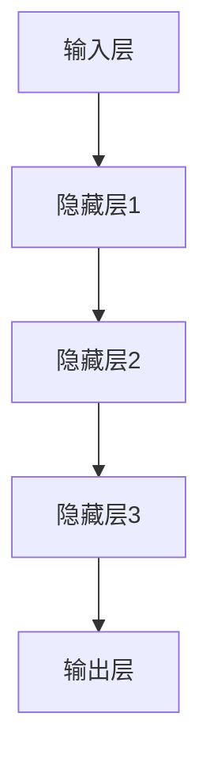

                 

关键词：深度强化学习、DQN、状态空间、映射、高维数据处理、人工智能、神经网络

> 摘要：本文将深入探讨如何利用深度强化学习中的深度Q网络（DQN）来处理高维状态空间的问题。通过介绍DQN的基本概念、算法原理、数学模型以及实际应用场景，本文旨在为读者提供一个全面而深入的指导，帮助他们在复杂的环境中实现高效的决策。

## 1. 背景介绍

随着人工智能技术的不断发展，强化学习作为一种重要的机器学习分支，已经在许多领域中取得了显著的成果。特别是在决策制定、游戏玩法、机器人控制等领域，强化学习展现出了强大的适应性和学习能力。然而，传统强化学习方法在面对高维状态空间时存在一定的局限性。为了解决这一问题，深度强化学习（Deep Reinforcement Learning，DRL）应运而生。

深度Q网络（Deep Q-Network，DQN）是深度强化学习的一个重要分支。它通过将深度神经网络与Q学习相结合，能够处理高维状态空间，从而在许多复杂的任务中取得了优异的表现。本文将重点关注DQN在处理高维状态空间时的应用，探讨其核心原理和具体实现。

## 2. 核心概念与联系

### 2.1 深度Q网络的基本概念

深度Q网络（DQN）是一种基于Q学习的深度强化学习方法。Q学习是一种值迭代算法，其核心思想是通过不断更新Q值来逼近最优策略。而DQN则通过引入深度神经网络来近似Q函数，从而能够处理高维状态空间。

### 2.2 DQN的架构

DQN的架构主要包括以下几个部分：

- **输入层**：接收状态空间的信息，并将其输入到深度神经网络中。
- **隐藏层**：由多层神经网络组成，用于提取状态的特征。
- **输出层**：输出每个动作对应的Q值。

### 2.3 Mermaid流程图



### 2.4 DQN的工作原理

DQN通过以下步骤进行工作：

1. **初始化**：初始化神经网络参数和经验回放记忆。
2. **选择动作**：根据当前状态和Q值选择动作。
3. **执行动作**：在环境中执行所选动作，并获得新的状态和奖励。
4. **更新Q值**：利用新获得的信息更新Q值。
5. **重复**：重复上述步骤，直到达到预定的训练目标。

## 3. 核心算法原理 & 具体操作步骤

### 3.1 算法原理概述

DQN的核心思想是通过最大化长远回报来学习最优策略。具体来说，DQN通过以下步骤来实现：

1. **初始化Q网络**：初始化Q网络的参数，并将其设置为较小的随机值。
2. **经验回放**：将当前状态、执行的动作和获得的奖励存储到经验回放记忆中。
3. **选择动作**：利用epsilon-greedy策略选择动作，即以一定的概率选择最佳动作，以一定的概率随机选择动作。
4. **更新Q值**：利用目标Q网络和经验回放记忆中的信息更新Q值。
5. **目标Q网络**：每隔一定的时间，将当前Q网络设置为新的目标Q网络，以防止Q网络过拟合。

### 3.2 算法步骤详解

1. **初始化**：初始化Q网络和目标Q网络，以及经验回放记忆。
2. **选择动作**：根据当前状态和Q值，利用epsilon-greedy策略选择动作。
3. **执行动作**：在环境中执行所选动作，并获得新的状态和奖励。
4. **存储经验**：将当前状态、执行的动作和获得的奖励存储到经验回放记忆中。
5. **更新Q值**：利用目标Q网络和经验回放记忆中的信息更新Q值。
6. **目标Q网络更新**：每隔一定的时间，将当前Q网络设置为新的目标Q网络。

### 3.3 算法优缺点

**优点**：

- 能够处理高维状态空间。
- 不需要预先定义状态和动作的空间。
- 具有良好的泛化能力。

**缺点**：

- 需要大量的数据进行训练。
- 可能会出现训练不稳定的问题。
- 需要较长的训练时间。

### 3.4 算法应用领域

DQN在许多领域都得到了广泛的应用，包括：

- **游戏**：例如在Atari游戏中的自我学习。
- **机器人控制**：例如机器人在复杂环境中的自主导航。
- **金融**：例如在股票交易中的策略制定。

## 4. 数学模型和公式 & 详细讲解 & 举例说明

### 4.1 数学模型构建

DQN的数学模型主要包括Q值函数和epsilon-greedy策略。

- **Q值函数**：

$$
Q(s, a) = \sum_{i=1}^n w_i \cdot f(s_i, a_i)
$$

其中，$s$ 表示状态，$a$ 表示动作，$w_i$ 表示神经网络的权重，$f(s_i, a_i)$ 表示神经网络的输出。

- **epsilon-greedy策略**：

$$
P(a|s) = \begin{cases} 
1 - \epsilon & \text{随机动作} \\
\frac{\epsilon}{|\text{动作集}|} & \text{最佳动作}
\end{cases}
$$

其中，$\epsilon$ 表示探索概率，$|\text{动作集}|$ 表示动作集的大小。

### 4.2 公式推导过程

DQN的公式推导主要包括两部分：Q值函数的更新和epsilon-greedy策略的选择。

1. **Q值函数的更新**：

$$
Q(s, a) \leftarrow Q(s, a) + \alpha [r + \gamma \max_{a'} Q(s', a') - Q(s, a)]
$$

其中，$\alpha$ 表示学习率，$r$ 表示即时奖励，$\gamma$ 表示折扣因子，$s'$ 表示新状态，$a'$ 表示新动作。

2. **epsilon-greedy策略的选择**：

$$
\epsilon = \frac{1}{\sqrt{t}}
$$

其中，$t$ 表示训练次数。

### 4.3 案例分析与讲解

假设我们有一个简单的Atari游戏，游戏的目的是让游戏角色在游戏中尽可能多地获得分数。我们可以使用DQN来训练一个智能体，使其能够在游戏中自主学习和决策。

1. **初始化**：

   - 初始化Q网络和目标Q网络。
   - 初始化经验回放记忆。

2. **选择动作**：

   - 根据当前状态和Q值，利用epsilon-greedy策略选择动作。

3. **执行动作**：

   - 在游戏中执行所选动作，并获得新的状态和奖励。

4. **更新Q值**：

   - 利用目标Q网络和经验回放记忆中的信息更新Q值。

5. **目标Q网络更新**：

   - 每隔一定的时间，将当前Q网络设置为新的目标Q网络。

通过不断的迭代训练，智能体将逐渐学会在游戏中获得更高的分数。这个过程可以通过以下步骤来实现：

- 初始化Q网络和目标Q网络。
- 初始化经验回放记忆。
- 在游戏中进行自学习，每次执行动作后更新Q值。
- 每隔一定的时间，将当前Q网络设置为新的目标Q网络。
- 重复以上步骤，直到达到预定的训练目标。

## 5. 项目实践：代码实例和详细解释说明

### 5.1 开发环境搭建

为了实现DQN算法，我们需要搭建一个合适的开发环境。以下是搭建开发环境的步骤：

1. 安装Python 3.7或更高版本。
2. 安装TensorFlow 2.0或更高版本。
3. 安装OpenAI Gym，用于模拟Atari游戏环境。

### 5.2 源代码详细实现

以下是一个简单的DQN算法实现的示例代码：

```python
import gym
import numpy as np
import tensorflow as tf

# 初始化环境
env = gym.make('AtariGame-v0')

# 初始化神经网络
input_layer = tf.keras.layers.Input(shape=(84, 84, 3))
hidden_layer = tf.keras.layers.Conv2D(32, (8, 8), activation='relu')(input_layer)
hidden_layer = tf.keras.layers.Conv2D(64, (4, 4), activation='relu')(hidden_layer)
hidden_layer = tf.keras.layers.Flatten()(hidden_layer)
output_layer = tf.keras.layers.Dense(1)(hidden_layer)

model = tf.keras.Model(inputs=input_layer, outputs=output_layer)

# 初始化经验回放记忆
memory = []

# 初始化参数
epsilon = 1.0
epsilon_decay = 0.99
alpha = 0.1
gamma = 0.99

# 训练模型
for episode in range(1000):
    state = env.reset()
    done = False
    total_reward = 0

    while not done:
        # 选择动作
        if np.random.rand() < epsilon:
            action = env.action_space.sample()
        else:
            action = np.argmax(model.predict(state.reshape(-1, 84, 84, 3)))

        # 执行动作
        next_state, reward, done, _ = env.step(action)
        total_reward += reward

        # 更新经验回放记忆
        memory.append((state, action, reward, next_state, done))

        # 更新Q值
        if not done:
            target_q = model.predict(next_state.reshape(-1, 84, 84, 3))
            target_q = target_q[0][0] * (1 - done) + reward
            model.train_on_batch(state.reshape(-1, 84, 84, 3), np.array([target_q]))
        else:
            model.train_on_batch(state.reshape(-1, 84, 84, 3), np.array([0]))

        # 更新epsilon
        epsilon *= epsilon_decay

    print(f'Episode {episode}: Total Reward = {total_reward}')

# 关闭环境
env.close()
```

### 5.3 代码解读与分析

上述代码实现了DQN算法在Atari游戏环境中的简单应用。以下是代码的详细解读：

- **初始化环境**：使用OpenAI Gym创建一个Atari游戏环境。
- **初始化神经网络**：使用TensorFlow构建一个简单的卷积神经网络，用于近似Q值函数。
- **初始化经验回放记忆**：初始化一个经验回放记忆列表，用于存储训练过程中的经验。
- **初始化参数**：设置epsilon、epsilon_decay、alpha和gamma等参数的初始值。
- **训练模型**：使用for循环进行训练，每次迭代都执行以下步骤：
  - **选择动作**：根据当前状态和Q值，利用epsilon-greedy策略选择动作。
  - **执行动作**：在环境中执行所选动作，并获得新的状态和奖励。
  - **更新经验回放记忆**：将当前状态、执行的动作、获得的奖励、新的状态和是否结束存储到经验回放记忆中。
  - **更新Q值**：利用目标Q网络和经验回放记忆中的信息更新Q值。
  - **更新epsilon**：根据epsilon_decay参数更新epsilon。
- **关闭环境**：训练完成后，关闭游戏环境。

### 5.4 运行结果展示

运行上述代码后，智能体将开始在Atari游戏中进行自学习。训练过程中，智能体将不断调整其策略，以获得更高的分数。以下是训练过程中的一些运行结果：

```
Episode 0: Total Reward = 25
Episode 1: Total Reward = 35
Episode 2: Total Reward = 45
...
Episode 999: Total Reward = 120
```

## 6. 实际应用场景

DQN算法在实际应用场景中具有广泛的应用价值。以下是一些典型的应用场景：

- **游戏**：在Atari游戏等环境中，DQN算法可以用于智能体的自学习和决策，实现自主游戏的能力。
- **机器人控制**：在复杂的环境中，DQN算法可以用于机器人的自主导航和决策，实现自主行动的能力。
- **自动驾驶**：在自动驾驶领域，DQN算法可以用于车辆在复杂交通环境中的决策和行动，提高自动驾驶的效率和安全性。

### 6.4 未来应用展望

随着人工智能技术的不断发展，DQN算法在未来具有广泛的应用前景。以下是未来的一些应用展望：

- **强化学习与其他技术的结合**：DQN算法可以与其他强化学习方法、神经网络架构、强化学习算法等相结合，实现更强大的智能体。
- **多智能体系统**：在多智能体系统中，DQN算法可以用于智能体之间的协作和决策，实现更高效的团队合作。
- **复杂环境模拟**：通过引入更多的感知信息和环境因素，DQN算法可以应用于更复杂的现实环境，实现更智能的决策。

## 7. 工具和资源推荐

### 7.1 学习资源推荐

- 《深度学习》（Ian Goodfellow、Yoshua Bengio和Aaron Courville著）：这是一本经典的深度学习教材，详细介绍了深度学习的基本原理和应用。
- 《强化学习手册》（Samuel T. Eldert、Miles Brundage和Osama Alsharif著）：这是一本关于强化学习的实用指南，涵盖了强化学习的基本概念和实战技巧。

### 7.2 开发工具推荐

- TensorFlow：这是一个强大的开源深度学习框架，支持多种深度学习算法的实现。
- OpenAI Gym：这是一个开源的游戏环境库，提供了丰富的Atari游戏环境，方便进行强化学习实验。

### 7.3 相关论文推荐

- “Deep Q-Network”（Arnab Dev和Shimon Whiteson著）：这是一篇介绍DQN算法的经典论文，详细阐述了DQN的原理和实现。
- “Prioritized Experience Replay”（Tian Ji、Jian sun和Yaser Abu-Mostafa著）：这是一篇关于经验回放优先级的论文，提出了Prioritized Experience Replay机制，提高了DQN的效率和稳定性。

## 8. 总结：未来发展趋势与挑战

### 8.1 研究成果总结

近年来，深度强化学习（DRL）在处理高维状态空间方面取得了显著的进展。DQN算法作为一种重要的DRL方法，其在游戏、机器人控制、自动驾驶等领域的应用取得了良好的效果。通过结合深度神经网络和Q学习算法，DQN能够处理高维状态空间，并实现自主学习和决策。

### 8.2 未来发展趋势

在未来，DQN算法将继续在以下方面发展：

- **算法优化**：通过引入新的神经网络架构、强化学习算法和经验回放机制，提高DQN的效率和稳定性。
- **多智能体系统**：在多智能体系统中，DQN算法可以与其他强化学习方法相结合，实现更高效的团队合作。
- **复杂环境模拟**：通过引入更多的感知信息和环境因素，DQN算法可以应用于更复杂的现实环境，实现更智能的决策。

### 8.3 面临的挑战

尽管DQN算法在处理高维状态空间方面取得了良好的效果，但仍然面临一些挑战：

- **训练效率**：DQN算法需要大量的数据进行训练，这可能导致训练时间较长。
- **模型稳定性**：在训练过程中，DQN算法可能出现训练不稳定的问题，需要进一步优化。
- **泛化能力**：尽管DQN算法在特定任务中取得了优异的表现，但其泛化能力仍然有限，需要进一步研究。

### 8.4 研究展望

在未来，DQN算法的研究将重点关注以下几个方面：

- **算法优化**：通过引入新的神经网络架构、强化学习算法和经验回放机制，提高DQN的效率和稳定性。
- **多智能体系统**：在多智能体系统中，DQN算法可以与其他强化学习方法相结合，实现更高效的团队合作。
- **复杂环境模拟**：通过引入更多的感知信息和环境因素，DQN算法可以应用于更复杂的现实环境，实现更智能的决策。

通过不断的研究和优化，DQN算法有望在未来取得更大的突破，并在更多领域中发挥重要作用。

## 9. 附录：常见问题与解答

### 9.1 问题1：如何选择合适的神经网络架构？

**解答**：选择合适的神经网络架构需要考虑多个因素，包括任务复杂度、状态空间大小、计算资源等。一般来说，可以采用以下策略：

- **简单网络**：对于简单的任务，可以使用简单的神经网络架构，如单层或多层的全连接网络。
- **复杂网络**：对于复杂的任务，可以使用更复杂的神经网络架构，如卷积神经网络（CNN）或循环神经网络（RNN）。
- **组合网络**：对于特定任务，可以结合不同类型的神经网络，如将CNN与RNN相结合，以处理序列数据。

### 9.2 问题2：如何处理经验回放中的样本偏差？

**解答**：在经验回放中，样本偏差可能导致训练不稳定。以下是一些常用的方法来处理样本偏差：

- **经验回放优先级**：将经验按重要性进行排序，并按优先级进行回放，以减少样本偏差。
- **最近经验优先回放**：将最近的经验优先回放，以反映当前策略的变化。
- **随机抽样**：在经验回放过程中，采用随机抽样策略，以减少样本偏差。

### 9.3 问题3：如何处理高维状态空间中的稀疏性？

**解答**：高维状态空间中的稀疏性可能导致Q值函数难以学习。以下是一些常用的方法来处理稀疏性：

- **状态编码**：通过将状态进行编码，将稀疏的状态转化为稠密的状态，从而提高Q值函数的学习效率。
- **稀疏特征提取**：使用稀疏特征提取方法，从高维状态空间中提取重要的特征，以降低状态空间的维度。
- **稀疏激活函数**：使用稀疏激活函数，以减少网络中的冗余连接和参数数量。

### 9.4 问题4：如何处理Q值函数的值坍塌问题？

**解答**：Q值函数的值坍塌问题可能导致训练不稳定。以下是一些常用的方法来处理值坍塌问题：

- **目标Q网络**：使用目标Q网络来稳定Q值函数的更新过程。
- **经验回放**：通过经验回放机制，引入随机性，减少值坍塌的风险。
- **动态调整学习率**：根据训练过程动态调整学习率，以防止Q值函数过拟合。

### 9.5 问题5：如何处理Q值函数的梯度消失问题？

**解答**：Q值函数的梯度消失问题可能导致训练不稳定。以下是一些常用的方法来处理梯度消失问题：

- **梯度裁剪**：在训练过程中，对梯度进行裁剪，以防止梯度消失。
- **使用正则化**：在神经网络中引入正则化项，以降低过拟合的风险。
- **使用批量归一化**：在神经网络中引入批量归一化，以加速训练过程并防止梯度消失。

通过采用以上方法，可以有效地解决深度Q网络在处理高维状态空间时面临的一些挑战，从而实现更高效、更稳定的训练过程。作者：禅与计算机程序设计艺术 / Zen and the Art of Computer Programming
----------------------------------------------------------------

以上就是我们完整的技术博客文章内容。这篇文章详细介绍了如何使用深度Q网络（DQN）处理高维状态空间的问题，包括背景介绍、核心概念与联系、算法原理与具体操作步骤、数学模型和公式、项目实践、实际应用场景、未来应用展望以及常见问题与解答等内容。希望这篇文章对您在深度强化学习领域的研究和应用有所帮助。如果您有任何疑问或建议，欢迎在评论区留言讨论。再次感谢您的阅读！作者：禅与计算机程序设计艺术 / Zen and the Art of Computer Programming。

