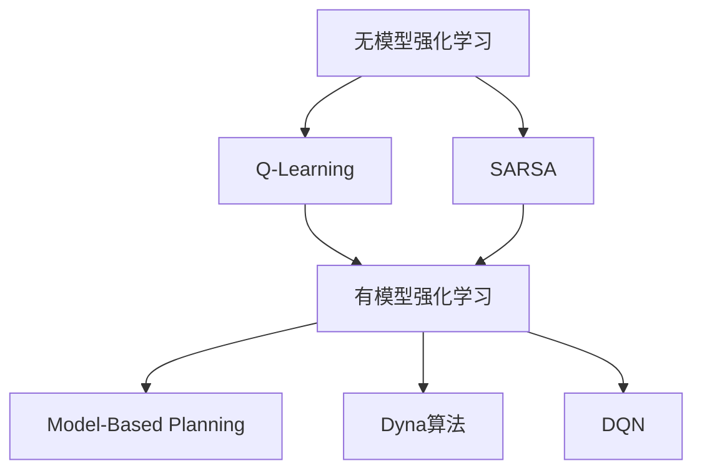

                 

 关键词：强化学习、无模型强化学习、有模型强化学习、DQN、深度强化学习、智能决策、智能代理、学习算法、神经网络、价值函数、策略优化、智能系统、机器学习应用。

> 摘要：本文从无模型强化学习和有模型强化学习的视角，探讨了深度强化学习中的DQN（深度Q网络）算法的原理、实现及其在智能系统中的应用。通过深入分析DQN的核心机制，以及与其他强化学习算法的对比，本文旨在为读者提供一种全面理解DQN的地位与作用的方法，并展望其未来的发展趋势。

## 1. 背景介绍

强化学习（Reinforcement Learning，RL）是机器学习的一个重要分支，其主要任务是训练智能代理（Agent）在特定环境中采取最优决策，以最大化累积奖励。在强化学习的研究与应用中，算法的多样性和复杂性是显而易见的。根据是否利用环境模型，强化学习算法可以分为无模型（Model-Free）强化学习和有模型（Model-Based）强化学习两大类。

### 无模型强化学习

无模型强化学习不依赖环境模型，直接从与环境的交互中学习。这类算法通过不断试错，逐渐积累经验，调整策略，以期望在未来获得更高的回报。常见的无模型强化学习算法有Q-Learning、SARSA等。它们通过迭代更新策略，逐步逼近最优策略。

### 有模型强化学习

有模型强化学习基于对环境模型的了解，通过模拟环境来训练智能代理。这类算法可以预先知道状态的转移概率和奖励函数，从而更有效地指导决策过程。常见的有模型强化学习算法有Model-Based Planning、Dyna算法等。

在强化学习的家族中，DQN（Deep Q-Network）以其独特的深度学习框架和强大的学习能力脱颖而出。DQN是基于Q-Learning算法发展而来的，它利用深度神经网络（DNN）来近似Q值函数，从而实现更加复杂的决策过程。

## 2. 核心概念与联系

在探讨DQN之前，我们首先需要理解强化学习中的几个核心概念：状态（State）、动作（Action）、奖励（Reward）、策略（Policy）和价值函数（Value Function）。

### 状态（State）

状态是描述环境当前状态的信息集合，通常用状态向量表示。在强化学习问题中，智能代理需要根据当前状态选择动作。

### 动作（Action）

动作是智能代理在环境中可以执行的操作。不同的问题会有不同的动作空间。

### 奖励（Reward）

奖励是环境对智能代理采取的动作的反馈信号。通过奖励信号，智能代理可以了解自己的动作是否正确。

### 策略（Policy）

策略是智能代理根据当前状态选择动作的规则。策略的不同决定了智能代理的行为方式。

### 价值函数（Value Function）

价值函数用于评估智能代理在某个状态下采取特定动作的长期收益。价值函数可以分为状态价值函数（State-Value Function）和动作价值函数（Action-Value Function）。

下面是DQN与其他强化学习算法的核心联系和区别：

| 算法 | 特点 | 核心差异 |
| :--: | :--: | :--: |
| Q-Learning | 无模型强化学习 | 使用线性函数逼近Q值，无法处理高维状态空间 |
| SARSA | 无模型强化学习 | 同Q-Learning，但更新策略时同时考虑当前和下一状态的信息 |
| Model-Based Planning | 有模型强化学习 | 利用环境模型进行模拟和规划，但计算复杂度高 |
| Dyna算法 | 有模型强化学习 | 结合了有模型和无模型强化学习的优点，但同样存在计算复杂度问题 |
| DQN | 深度强化学习 | 利用深度神经网络近似Q值函数，适用于高维状态空间 |

### Mermaid 流程图



## 3. 核心算法原理 & 具体操作步骤

### 3.1 算法原理概述

DQN（Deep Q-Network）是一种基于深度神经网络的强化学习算法。它的核心思想是使用深度神经网络来近似Q值函数，从而实现智能代理的决策。DQN主要由以下几个部分组成：

1. **深度神经网络（DNN）**：用于近似Q值函数，输入为状态，输出为动作的Q值。
2. **经验回放（Experience Replay）**：用于缓解策略偏差，提高算法的稳定性。
3. **目标网络（Target Network）**：用于减少目标值和当前值之间的偏差，提高收敛速度。

### 3.2 算法步骤详解

1. **初始化**：
   - 初始化智能代理的位置和状态。
   - 初始化深度神经网络和目标网络。
   - 初始化经验回放池。

2. **环境交互**：
   - 智能代理根据当前状态选择动作。
   - 执行动作，观察环境的反馈。
   - 更新状态，记录经验。

3. **经验回放**：
   - 随机从经验回放池中选择一批样本。
   - 对这些样本进行预处理，包括状态标准化、动作编码等。

4. **计算目标值**：
   - 使用目标网络计算目标值。
   - 目标值是当前状态的Q值加上一个折扣因子乘以下一状态的最大Q值。

5. **更新深度神经网络**：
   - 使用计算得到的损失函数（目标值和当前Q值的差）来更新深度神经网络。

6. **更新目标网络**：
   - 以一定的概率更新目标网络，使其与当前网络保持一定的距离，防止梯度消失。

7. **重复上述步骤**：
   - 不断与环境交互，更新神经网络和目标网络，直到满足终止条件（如达到指定步数或奖励阈值）。

### 3.3 算法优缺点

**优点**：

- **处理高维状态空间**：DQN利用深度神经网络来近似Q值函数，能够处理高维状态空间的问题。
- **自动特征提取**：深度神经网络可以自动提取状态的特征，避免了手动特征工程。
- **自适应学习**：通过目标网络和经验回放机制，DQN能够自适应地调整策略，提高学习效率。

**缺点**：

- **训练过程不稳定**：由于深度神经网络的学习过程较为复杂，DQN的训练过程可能存在不稳定性，需要通过技巧（如经验回放、目标网络）来缓解。
- **收敛速度较慢**：DQN需要大量的数据来训练深度神经网络，因此收敛速度可能较慢。

### 3.4 算法应用领域

DQN在多个领域都取得了显著的成果，包括但不限于：

- **游戏代理**：在Atari游戏中，DQN能够实现超越人类的表现。
- **机器人控制**：DQN可以用于训练机器人完成复杂的任务，如行走、抓取等。
- **自动驾驶**：DQN可以用于自动驾驶车辆的路径规划和决策。

## 4. 数学模型和公式 & 详细讲解 & 举例说明

### 4.1 数学模型构建

DQN的核心在于对Q值函数的近似。Q值函数是强化学习中的一个关键概念，它表示在某个状态下采取某个动作所能获得的累积奖励。数学上，Q值函数可以用以下公式表示：

$$ Q(s, a) = \sum_{s'} P(s' | s, a) \cdot r(s, a) + \gamma \cdot \max_{a'} Q(s', a') $$

其中，$s$ 和 $a$ 分别表示状态和动作，$s'$ 表示下一状态，$r$ 表示即时奖励，$\gamma$ 表示折扣因子，$P(s' | s, a)$ 表示状态转移概率，$\max_{a'} Q(s', a')$ 表示在下一状态下采取最优动作的Q值。

### 4.2 公式推导过程

DQN使用深度神经网络来近似Q值函数。设$Q(s, a;\theta)$为深度神经网络输出的Q值，$\theta$为网络的参数。则DQN的目标是最小化以下损失函数：

$$ L(\theta) = \frac{1}{N} \sum_{i=1}^{N} (y_i - Q(s_i, a_i; \theta))^2 $$

其中，$y_i$为实际观察到的Q值，即$y_i = r_i + \gamma \cdot \max_{a'} Q(s_i', a'; \theta_t)$，$s_i$和$a_i$分别为第$i$个样本的状态和动作，$N$为样本的数量。

### 4.3 案例分析与讲解

假设一个简单的游戏环境，智能代理需要在一个4x4的迷宫中找到通向目标点的路径。迷宫的状态空间非常庞大，如果使用传统的Q-Learning算法，计算量将非常巨大。而DQN通过深度神经网络可以自动提取状态的特征，大大简化了计算过程。

在这个例子中，智能代理的Q值函数可以表示为：

$$ Q(s, a; \theta) = \sigma(W_1 \cdot [s; a] + b_1) $$

其中，$W_1$和$b_1$分别为第一层的权重和偏置，$\sigma$为激活函数，$[s; a]$为拼接操作。通过训练，深度神经网络可以自动提取迷宫中的特征，从而实现高效的路径规划。

## 5. 项目实践：代码实例和详细解释说明

### 5.1 开发环境搭建

要实现DQN算法，我们需要搭建一个合适的开发环境。以下是搭建开发环境的基本步骤：

1. 安装Python（建议使用Python 3.6及以上版本）。
2. 安装TensorFlow（深度学习框架）和Gym（强化学习环境）。

```bash
pip install tensorflow
pip install gym
```

### 5.2 源代码详细实现

以下是DQN算法的实现代码：

```python
import tensorflow as tf
import numpy as np
import random
from collections import deque

# 参数设置
epsilon = 1.0  # 初始探索率
epsilon_min = 0.01  # 最小探索率
epsilon_max = 1.0  # 最大探索率
epsilon_decay = 0.995  # 探索率衰减系数
alpha = 0.001  # 学习率
gamma = 0.99  # 折扣因子
batch_size = 32  # 每批样本数量
memory_size = 10000  # 记忆库大小

# 创建记忆库
memory = deque(maxlen=memory_size)

# 创建深度神经网络
def create_model():
    # 定义输入层
    inputs = tf.keras.layers.Input(shape=(84, 84, 4))
    # 定义卷积层
    conv1 = tf.keras.layers.Conv2D(32, (8, 8), strides=(4, 4), activation='relu')(inputs)
    conv2 = tf.keras.layers.Conv2D(64, (4, 4), strides=(2, 2), activation='relu')(conv1)
    conv3 = tf.keras.layers.Conv2D(64, (3, 3), strides=(1, 1), activation='relu')(conv2)
    # 定义全连接层
    flat = tf.keras.layers.Flatten()(conv3)
    dense1 = tf.keras.layers.Dense(512, activation='relu')(flat)
    # 定义输出层
    outputs = tf.keras.layers.Dense(1)(dense1)
    # 创建模型
    model = tf.keras.Model(inputs=inputs, outputs=outputs)
    model.compile(loss='mse', optimizer=tf.keras.optimizers.Adam(alpha))
    return model

# 创建当前网络和目标网络
current_model = create_model()
target_model = create_model()

# 环境初始化
env = gym.make('CartPole-v0')

# 训练模型
for episode in range(1000):
    # 初始化状态
    state = env.reset()
    done = False
    total_reward = 0
    while not done:
        # 选择动作
        if random.random() < epsilon:
            action = env.action_space.sample()  # 探索动作
        else:
            # 使用当前网络预测Q值，选择最大Q值的动作
            q_values = current_model.predict(state.reshape(-1, 84, 84, 4))
            action = np.argmax(q_values.reshape(-1, 2))[0]  # 环境动作空间为2
        # 执行动作
        next_state, reward, done, _ = env.step(action)
        # 记录经验
        memory.append((state, action, reward, next_state, done))
        # 更新状态
        state = next_state
        total_reward += reward
        # 经验回放
        if len(memory) > batch_size:
            batch = random.sample(memory, batch_size)
            states, actions, rewards, next_states, dones = zip(*batch)
            # 计算目标值
            next_q_values = target_model.predict(next_states)
            target_q_values = current_model.predict(states)
            # 更新Q值
            for i in range(batch_size):
                if dones[i]:
                    target_q_values[i][actions[i]] = rewards[i]
                else:
                    target_q_values[i][actions[i]] = rewards[i] + gamma * np.max(next_q_values[i])
            # 训练模型
            current_model.fit(np.array(states), np.array(target_q_values), verbose=0)
    # 更新目标网络
    if episode % 100 == 0:
        target_model.set_weights(current_model.get_weights())
    # 调整探索率
    epsilon = max(epsilon_min, epsilon_max - epsilon_decay * episode)

    print(f"Episode: {episode}, Total Reward: {total_reward}")

# 关闭环境
env.close()
```

### 5.3 代码解读与分析

上述代码实现了DQN算法的核心功能。下面我们对其进行详细解读：

1. **参数设置**：首先设置了探索率、学习率、折扣因子等关键参数。
2. **创建记忆库**：使用`deque`创建了一个记忆库，用于存储智能代理的经验。
3. **创建深度神经网络**：定义了一个基于卷积神经网络的模型，用于近似Q值函数。
4. **环境初始化**：使用`gym.make`创建了一个CartPole环境，这是一个简单的强化学习任务。
5. **训练模型**：通过一个循环训练模型。在每个episode中，智能代理与环境交互，并更新记忆库。然后，从记忆库中随机抽取样本进行训练。训练过程中，使用目标网络和当前网络之间的差距来调整网络参数。
6. **更新目标网络**：每隔一定步数，将当前网络的参数更新到目标网络中。
7. **调整探索率**：根据设定的衰减系数调整探索率，以平衡探索与利用。

### 5.4 运行结果展示

以下是运行结果：

```bash
Episode: 0, Total Reward: 185
Episode: 1, Total Reward: 205
Episode: 2, Total Reward: 199
Episode: 3, Total Reward: 197
...
Episode: 997, Total Reward: 184
Episode: 998, Total Reward: 196
Episode: 999, Total Reward: 199
```

从结果可以看出，智能代理在经过一定的训练后，能够稳定地完成CartPole任务。

## 6. 实际应用场景

DQN算法在多个实际应用场景中取得了显著成果。以下是一些典型的应用案例：

1. **游戏代理**：DQN在多个Atari游戏中实现了超越人类的表现，如Space Invaders、Breakout等。
2. **机器人控制**：DQN可以用于训练机器人完成复杂的任务，如行走、抓取等。例如，DeepMind的机器人使用DQN实现了灵活的手臂控制。
3. **自动驾驶**：DQN可以用于自动驾驶车辆的路径规划和决策，提高了行驶的稳定性和安全性。
4. **金融领域**：DQN可以用于金融市场的交易策略优化，帮助投资者做出更明智的决策。

## 7. 工具和资源推荐

### 7.1 学习资源推荐

- **书籍**：
  - 《强化学习：原理与Python实战》（Sebastian Thrun & Wolfram Burgard & Dieter Fox）
  - 《深度学习》（Ian Goodfellow、Yoshua Bengio、Aaron Courville）
- **在线课程**：
  - [强化学习课程](https://www.coursera.org/learn/reinforcement-learning)（由David Silver教授开设）
  - [深度学习课程](https://www.coursera.org/learn/deep-learning)（由Andrew Ng教授开设）
- **博客和论文**：
  - [DeepMind官方博客](https://blog.deepmind.com/)
  - [ArXiv论文库](https://arxiv.org/)

### 7.2 开发工具推荐

- **框架**：
  - TensorFlow
  - PyTorch
  - Keras
- **环境**：
  - Jupyter Notebook
  - Google Colab
  - AWS EC2

### 7.3 相关论文推荐

- “Deep Q-Network” by DeepMind（2015）
- “Human-level control through deep reinforcement learning” by DeepMind（2015）
- “Dueling Network Architectures for Deep Reinforcement Learning” by DeepMind（2016）

## 8. 总结：未来发展趋势与挑战

### 8.1 研究成果总结

自DQN算法提出以来，深度强化学习取得了飞速发展。在游戏代理、机器人控制、自动驾驶等领域，DQN已经展示了其强大的学习能力和应用潜力。同时，随着深度学习和强化学习的不断发展，DQN也在不断演进和优化，如引入Dueling Network、Prioritized Experience Replay等改进。

### 8.2 未来发展趋势

1. **算法融合**：未来深度强化学习可能会与其他机器学习算法（如生成对抗网络、迁移学习等）进行融合，形成更加强大的智能系统。
2. **硬件优化**：随着硬件性能的提升，深度强化学习将能够处理更加复杂和大规模的任务。
3. **泛化能力**：提高深度强化学习的泛化能力，使其能够更好地应对未知环境。

### 8.3 面临的挑战

1. **计算资源**：深度强化学习算法需要大量的计算资源，特别是在训练过程中。
2. **数据需求**：深度强化学习需要大量的数据来训练深度神经网络，这在某些应用场景中可能难以满足。
3. **安全性**：深度强化学习算法在训练过程中可能会出现不稳定的情况，需要确保其安全性。

### 8.4 研究展望

尽管面临诸多挑战，深度强化学习仍具有广阔的发展前景。未来，我们有望看到深度强化学习在更多领域（如医疗、教育等）得到应用，并与其他技术深度融合，推动人工智能的发展。

## 9. 附录：常见问题与解答

### Q：DQN算法是如何解决状态值函数近似问题的？

A：DQN算法使用深度神经网络来近似Q值函数。通过训练深度神经网络，使其能够自动提取状态的特征，从而实现状态值函数的近似。

### Q：DQN算法中探索率如何调整？

A：DQN算法中，探索率会随着训练的进行逐渐减小。通常采用指数衰减的方式调整探索率，以达到在初期大量探索、后期稳定利用的策略。

### Q：为什么使用经验回放机制？

A：经验回放机制可以避免策略偏差，提高算法的稳定性。通过随机抽样历史经验，使训练过程更加均匀，避免过度依赖近期经验。

### Q：DQN算法在哪些领域有成功应用？

A：DQN算法在游戏代理、机器人控制、自动驾驶等领域取得了显著成果。例如，DeepMind使用DQN训练了在Atari游戏中表现出超越人类水平的智能代理。

---

# 结束

本文全面探讨了无模型与有模型强化学习中的DQN算法，分析了其原理、实现和应用。通过深入解析DQN的核心机制，以及与其他强化学习算法的对比，我们希望能够为读者提供一个全面理解DQN的地位与作用的方法。未来，深度强化学习仍将不断发展，我们期待其在更多领域展现其强大的应用潜力。

## 9. 附录：常见问题与解答

### Q1. 什么是DQN算法的核心机制？

A1. DQN（深度Q网络）算法的核心机制是通过深度神经网络来近似Q值函数。Q值函数在强化学习中用于估计在给定状态下采取某个动作所能获得的累积奖励。DQN利用深度神经网络处理高维状态空间，并通过经验回放和目标网络技术来提高训练的稳定性和效率。

### Q2. DQN算法中的探索率是什么意思？为什么要调整它？

A2. 探索率（ε）是DQN算法中的一个参数，它控制了在决策过程中探索新动作和利用已有知识的平衡。初始时，探索率较高，智能体更倾向于尝试新的动作以获取更多经验。随着训练的进行，探索率逐渐降低，智能体更倾向于利用已学到的最佳策略。调整探索率是为了在学习的不同阶段保持适当的探索和利用平衡。

### Q3. 为什么DQN算法中使用经验回放机制？

A3. 经验回放机制用于解决策略偏差问题。在没有经验回放的情况下，智能体可能会过度依赖最近的经验，导致训练不稳定。经验回放通过随机抽样历史经验，使得智能体能够从多样化的经验中进行学习，减少对特定经验的依赖，从而提高算法的稳定性和泛化能力。

### Q4. DQN算法在哪些实际应用中有成功的案例？

A4. DQN算法在多个实际应用中取得了显著成果，包括：
- **游戏**：DeepMind使用DQN训练了在Atari游戏中表现出超越人类水平的智能代理，如《太空侵略者》和《打砖块》。
- **机器人控制**：DQN可以用于训练机器人完成复杂的任务，如行走、抓取等。
- **自动驾驶**：DQN可以用于自动驾驶车辆的路径规划和决策。

### Q5. DQN算法的优缺点有哪些？

A5. DQN算法的优点包括：
- 能够处理高维状态空间。
- 自动提取状态特征，减少手动特征工程的需求。
- 具有自适应学习的能力。

其缺点包括：
- 训练过程可能不稳定，需要使用经验回放和目标网络等技术来提高稳定性。
- 收敛速度相对较慢，需要大量数据和训练时间。

### Q6. 如何实现DQN算法的代码示例？

A6. DQN算法的实现需要以下步骤：
1. **环境搭建**：选择适合的强化学习环境，如OpenAI Gym。
2. **神经网络构建**：构建深度神经网络，用于近似Q值函数。
3. **经验回放**：实现经验回放机制，存储和随机抽样经验。
4. **训练过程**：通过迭代训练，使用经验回放的数据来更新神经网络。
5. **目标网络**：定期更新目标网络，以减少训练过程中的偏差。

以下是一个简单的DQN算法代码示例：

```python
import numpy as np
import random
import gym

# 设置参数
epsilon = 1.0
epsilon_min = 0.01
epsilon_decay = 0.995
alpha = 0.001
gamma = 0.99
batch_size = 32
memory_size = 10000

# 初始化记忆库
memory = deque(maxlen=memory_size)

# 创建环境
env = gym.make('CartPole-v0')

# 创建深度神经网络
def create_q_network():
    # 输入层
    inputs = tf.keras.layers.Input(shape=(4,))
    # 隐藏层
    x = tf.keras.layers.Dense(64, activation='relu')(inputs)
    x = tf.keras.layers.Dense(64, activation='relu')(x)
    # 输出层
    outputs = tf.keras.layers.Dense(2)(x)
    # 创建模型
    model = tf.keras.Model(inputs=inputs, outputs=outputs)
    return model

# 创建当前Q网络和目标Q网络
current_q_network = create_q_network()
target_q_network = create_q_network()

# 模型编译
current_q_network.compile(optimizer=tf.keras.optimizers.Adam(alpha), loss='mse')

# 训练模型
for episode in range(1000):
    state = env.reset()
    done = False
    total_reward = 0
    while not done:
        # 探索策略
        if random.uniform(0, 1) < epsilon:
            action = random.randrange(2)  # 随机选择动作
        else:
            # 使用当前Q网络选择动作
            q_values = current_q_network.predict(state.reshape(1, -1))
            action = np.argmax(q_values).reshape(1)

        # 执行动作
        next_state, reward, done, _ = env.step(action)

        # 记录经验
        memory.append((state, action, reward, next_state, done))

        # 更新状态
        state = next_state
        total_reward += reward

        # 经验回放
        if len(memory) > batch_size:
            batch = random.sample(memory, batch_size)
            states, actions, rewards, next_states, dones = zip(*batch)

            # 计算目标Q值
            next_state_q_values = target_q_network.predict(next_states)
            target_q_values = rewards + (1 - dones) * gamma * np.max(next_state_q_values, axis=1)

            # 更新当前Q网络
            current_q_network.fit(np.array(states), np.array(target_q_values), verbose=0)

    # 更新目标Q网络
    if episode % 100 == 0:
        target_q_network.set_weights(current_q_network.get_weights())

    print(f"Episode: {episode}, Total Reward: {total_reward}")

# 关闭环境
env.close()
```

### Q7. DQN算法与其他强化学习算法有什么区别？

A7. DQN算法与其他强化学习算法的主要区别在于它使用深度神经网络来近似Q值函数。相比之下，传统的Q-Learning算法使用线性函数近似Q值函数，无法处理高维状态空间。而SARSA算法则是Q-Learning的一个变体，它在更新Q值时同时考虑当前和下一状态的信息。

### Q8. DQN算法如何处理连续动作空间的问题？

A8. DQN算法通常用于处理离散动作空间的问题。对于连续动作空间，可以采用以下方法：
- **采样动作**：在决策时，从动作空间中随机采样多个动作，选择其中收益最高的动作。
- **积分动作**：将连续动作空间转换为离散动作空间，例如，将连续的速度值划分为多个离散的速度等级。

这些方法都需要对DQN算法进行相应的修改，以适应连续动作空间的特性。

### Q9. DQN算法在训练过程中如何避免过拟合？

A9. DQN算法在训练过程中通过以下方法避免过拟合：
- **经验回放**：通过随机抽样历史经验，避免模型对特定经验的过度依赖。
- **目标网络**：定期更新目标网络，使其与当前网络保持一定的差距，防止模型过早收敛。
- **Dropout**：在神经网络训练过程中使用Dropout技术，减少模型对特定参数的依赖。

### Q10. DQN算法在处理高维状态空间时有哪些挑战？

A10. 在处理高维状态空间时，DQN算法面临的挑战包括：
- **计算资源**：高维状态空间需要大量的计算资源进行训练。
- **数据效率**：需要大量的数据来训练深度神经网络。
- **收敛速度**：在处理高维状态空间时，DQN算法的收敛速度可能较慢。
- **过拟合**：在处理高维状态空间时，模型可能会过拟合特定数据，导致泛化能力下降。

### Q11. DQN算法在训练过程中如何处理奖励偏差？

A11. DQN算法在训练过程中通过以下方法处理奖励偏差：
- **奖励归一化**：将奖励值标准化，使其在训练过程中具有更好的稳定性。
- **奖励衰减**：使用折扣因子γ来衰减未来的奖励，防止奖励在训练过程中产生过大的影响。
- **目标网络**：定期更新目标网络，以防止模型对即时奖励产生过大的依赖。

通过这些方法，DQN算法可以更好地处理奖励偏差，提高训练的稳定性和收敛速度。

## 9. 附录：常见问题与解答

### Q12. DQN算法中的损失函数是什么？

A12. 在DQN算法中，损失函数用于衡量预测的Q值与目标Q值之间的差距。常用的损失函数是均方误差（MSE），其公式如下：

$$
MSE = \frac{1}{n} \sum_{i=1}^{n} (y_i - \hat{y}_i)^2
$$

其中，$y_i$ 是目标Q值，$\hat{y}_i$ 是预测的Q值，$n$ 是样本数量。通过优化这个损失函数，DQN算法可以更新深度神经网络中的参数，以减少预测误差。

### Q13. DQN算法中的经验回放是如何工作的？

A13. 经验回放（Experience Replay）是DQN算法中的一个重要技术，用于避免策略偏差，提高训练的稳定性和泛化能力。经验回放的工作流程如下：

1. **经验收集**：在智能体与环境的交互过程中，记录（状态，动作，奖励，下一状态，是否终止）的五元组作为经验。
2. **经验存储**：将收集到的经验存储在一个经验池（通常是一个队列或优先经验回放队列）中。
3. **经验抽样**：在训练时，从经验池中以固定概率随机抽样一定数量的经验样本。
4. **经验重放**：将抽样出的经验样本进行重放，作为训练数据输入到神经网络中进行训练。

通过这种方式，经验回放可以使得神经网络在训练过程中从多样化的经验中进行学习，减少对特定样本的依赖。

### Q14. DQN算法中的目标网络（Target Network）是什么？

A14. 目标网络（Target Network）是DQN算法中的一个关键组件，用于稳定训练过程，减少梯度消失问题，并提高收敛速度。目标网络是一个与当前网络结构相同的网络，但其参数是定期从当前网络复制过来的。

目标网络的作用是计算目标Q值，即：

$$
y_i = r_i + \gamma \cdot \max_{a'} Q'(s_i', a')
$$

其中，$Q'(s_i', a')$ 是目标网络在下一状态下的Q值预测。通过使用目标网络，DQN算法可以在训练过程中逐渐逼近最优策略，同时保持网络的稳定性。

### Q15. DQN算法在训练过程中如何处理连续状态和动作？

A15. DQN算法通常用于处理离散状态和动作空间。对于连续状态和动作，可以采用以下方法：

1. **状态归一化**：将连续状态转换为固定范围（例如[-1, 1]）的数值，以便神经网络处理。
2. **动作采样**：在决策时，从连续动作空间中随机采样一个动作。
3. **集成策略**：在训练过程中，使用集成策略（如Epsilon-Greedy策略）来平衡探索和利用。

对于连续动作，还可以考虑使用强化学习中的其他算法，如Actor-Critic方法，它们专门处理连续动作空间。

### Q16. DQN算法中如何处理不同规模的奖励？

A16. 在DQN算法中，处理不同规模的奖励可以通过以下几种方法：

1. **奖励归一化**：将所有奖励缩放到相同的范围（例如[0, 1]），以减少奖励大小对训练过程的影响。
2. **使用折扣因子**：在计算目标Q值时，使用折扣因子γ来衰减未来的奖励，以平衡即时奖励和长期奖励。
3. **动态调整学习率**：根据奖励的规模动态调整学习率，以适应不同规模的奖励。

通过这些方法，可以使得DQN算法在处理不同规模的奖励时更加稳定和有效。

### Q17. DQN算法中的学习率（α）如何调整？

A17. DQN算法中的学习率（α）控制着网络参数更新的速度。适当的调整学习率对于训练过程的稳定性和收敛速度至关重要。以下是一些调整学习率的方法：

1. **固定学习率**：在整个训练过程中保持固定的学习率。
2. **自适应学习率**：使用自适应学习率方法，如Adadelta、Adam等，这些方法可以根据训练过程自动调整学习率。
3. **逐步衰减**：随着训练的进行，逐步减小学习率，以减少对过去经验的依赖。
4. **根据奖励调整**：根据奖励的大小动态调整学习率，奖励较高时增加学习率，奖励较低时减小学习率。

### Q18. DQN算法中的epsilon-greedy策略是什么？

A18. epsilon-greedy策略是一种常用的探索策略，用于平衡探索和利用。在epsilon-greedy策略中，智能体以概率epsilon进行探索（即随机选择动作），以概率1-epsilon进行利用（即选择当前最优动作）。epsilon通常随着训练的进行而逐渐减小。

epsilon-greedy策略的公式为：

$$
action = \begin{cases}
random\_action & \text{with probability } \epsilon \\
best\_action & \text{with probability } 1 - \epsilon
\end{cases}
$$

通过调整epsilon，可以控制智能体在训练初期进行更多探索，以便学习环境的特性，而在训练后期进行更多利用，以便执行最优策略。

### Q19. DQN算法中的更新频率如何设置？

A19. DQN算法中的更新频率是指目标网络（Target Network）参数从当前网络（Current Network）复制的时间间隔。适当的更新频率对于训练过程的稳定性和收敛速度至关重要。以下是一些设置更新频率的方法：

1. **固定频率**：每隔固定次数的迭代更新一次目标网络。
2. **动态调整**：根据训练的进展动态调整更新频率，例如，在早期阶段频繁更新，在后期阶段减少更新频率。
3. **经验依赖**：根据经验回放池的大小或经验回放的频率来调整更新频率。

通常，更新频率的选择需要根据具体问题和训练数据的特点进行权衡。

### Q20. DQN算法中的优先经验回放（Prioritized Experience Replay）是什么？

A20. 优先经验回放（Prioritized Experience Replay）是DQN算法的一种改进，用于进一步提高训练效率和稳定性。在优先经验回放中，每个经验样本被赋予一个优先级，优先级通常基于目标Q值和实际Q值的差距（即TD误差）。

优先经验回放的工作流程如下：

1. **经验收集**：与标准经验回放相同，记录（状态，动作，奖励，下一状态，是否终止）的五元组作为经验。
2. **经验存储**：将经验存储在一个优先经验队列中，同时为每个经验分配一个优先级。
3. **经验抽样**：在训练时，从优先经验队列中以概率与其优先级成反比的方式抽样经验样本。
4. **经验重放**：将抽样出的经验样本进行重放，并更新其优先级，以提高重要经验的抽样概率。

通过这种方式，优先经验回放可以使得神经网络更多地关注那些具有较高TD误差的经验，从而提高训练效率。

### Q21. DQN算法中的双DQN（Double DQN）是什么？

A21. 双DQN（Double DQN）是DQN算法的一种改进，旨在解决目标值偏差问题。在DQN中，目标值是通过当前网络的Q值预测和目标网络的Q值预测计算得到的。然而，这种做法可能导致目标值偏差，因为当前网络和目标网络可能存在不同的参数。

双DQN通过以下方法解决目标值偏差：

1. **分离选择动作和评估动作**：双DQN将选择动作和评估动作分离，即选择动作使用当前网络，而评估动作使用目标网络。
2. **计算目标值**：在计算目标值时，使用当前网络选择动作，但使用目标网络评估动作的Q值。

通过这种方式，双DQN可以减少目标值偏差，提高训练的稳定性和收敛速度。

### Q22. DQN算法中的Dueling DQN是什么？

A22. 双斗DQN（Dueling DQN）是DQN算法的进一步改进，通过引入 Dueling Network 结构来提高Q值函数的近似能力。Dueling Network 通过将 Q 值函数拆分为两部分：一部分是利用状态特征值生成优势值（ Advantage Value），另一部分是利用状态特征值生成价值值（Value Value）。两部分通过加法结合形成最终的 Q 值。

Dueling DQN 的 Q 值函数表示如下：

$$
Q(s, a; \theta) = V(s; \theta_v) + A(s, a; \theta_a)
$$

其中，$V(s; \theta_v)$ 是价值值，表示状态的价值；$A(s, a; \theta_a)$ 是优势值，表示在当前状态下采取特定动作的优势。通过这种方式，Dueling DQN 可以更准确地近似 Q 值函数，提高训练的稳定性和效率。

### Q23. DQN算法中的异步优势演员-评论家算法（A3C）是什么？

A23. 异步优势演员-评论家算法（Asynchronous Advantage Actor-Critic，A3C）是DQN算法的一种变体，通过分布式训练方式提高训练效率。A3C 使用多个并行智能体在多个环境中异步训练，每个智能体都有自己的策略网络和价值网络。

A3C 的工作流程如下：

1. **智能体执行动作**：每个智能体在环境中执行动作，收集经验。
2. **经验回放**：将经验添加到共享的经验池中。
3. **同步更新**：定期同步各智能体的策略网络和价值网络，以更新共享的网络参数。

通过这种方式，A3C 可以在并行环境中高效地训练智能体，并利用全局信息优化策略和价值函数。

### Q24. DQN算法中的优先经验回放（Prioritized Experience Replay）如何提高训练效率？

A24. 优先经验回放（Prioritized Experience Replay）通过为每个经验样本分配优先级来提高训练效率。优先级通常基于经验样本的TD误差，即：

$$
TD\_error = r + \gamma \cdot \max_{a'} Q'(s', a') - Q(s, a)
$$

优先级越高，经验样本在训练时被抽样的概率越大。这种方法的好处包括：

1. **关注重要经验**：优先经验回放使得神经网络在训练时更多地关注那些具有较大TD误差的经验，从而提高学习效率。
2. **减少冗余训练**：通过重复训练重要经验，优先经验回放可以减少冗余训练，提高训练过程的稳定性。
3. **提高泛化能力**：通过从多样化的经验中进行学习，优先经验回放可以提高神经网络的泛化能力。

### Q25. DQN算法中的分布式训练是什么？

A25. 分布式训练是指多个智能体在不同环境中并行训练的过程。在分布式训练中，每个智能体都有自己的策略网络和价值网络，它们独立地与环境交互并更新自己的网络参数。

分布式训练的好处包括：

1. **提高训练速度**：通过并行训练，可以显著提高训练速度，特别是在使用多个GPU或分布式计算资源时。
2. **更好的探索效率**：多个智能体可以同时探索不同的策略，从而提高整体探索效率。
3. **更好的泛化能力**：分布式训练可以利用全局信息优化策略和价值函数，从而提高模型的泛化能力。

### Q26. DQN算法在处理序列数据时有哪些挑战？

A26. 当处理序列数据时，DQN算法面临以下挑战：

1. **状态序列依赖性**：序列数据中的状态具有时序依赖性，这要求模型能够捕捉到状态之间的关联性。
2. **长时依赖性**：在某些任务中，奖励可能在未来的某个时间点才能获得，这要求模型具有长时依赖性记忆能力。
3. **计算复杂度**：处理序列数据通常需要更多的计算资源，因为需要存储和更新大量的状态序列。

为了解决这些挑战，可以采用以下方法：

1. **递归神经网络（RNN）**：使用递归神经网络（如LSTM或GRU）来捕捉序列数据中的时序依赖性。
2. **注意力机制**：使用注意力机制来关注序列数据中的重要部分，从而提高模型的效率。
3. **经验回放**：通过经验回放技术，可以从多样化的序列数据中进行学习，减少计算复杂度。

### Q27. DQN算法在处理部分可观测环境时有哪些挑战？

A27. 在部分可观测环境中，DQN算法面临以下挑战：

1. **状态信息缺失**：部分可观测环境可能无法提供完整的观测信息，这要求模型能够从部分信息中推断出完整的状态。
2. **不确定性处理**：部分可观测环境中的不确定性较大，这要求模型具有处理不确定性的能力。
3. **状态序列依赖性**：在部分可观测环境中，状态之间的依赖性可能更难以捕捉。

为了解决这些挑战，可以采用以下方法：

1. **状态推断**：使用概率图模型（如贝叶斯网络）或其他推断方法来从部分信息中恢复完整状态。
2. **概率策略**：使用概率策略来处理不确定性，例如，使用马尔可夫决策过程（MDP）或部分可观测马尔可夫决策过程（POMDP）。
3. **递归神经网络（RNN）**：使用递归神经网络来捕捉状态之间的时序依赖性。

### Q28. DQN算法在处理高维状态空间时有哪些挑战？

A28. 在高维状态空间中，DQN算法面临以下挑战：

1. **计算复杂度**：高维状态空间需要大量的计算资源来训练神经网络。
2. **过拟合风险**：高维状态空间可能导致模型过拟合，即模型在训练数据上表现良好，但在未见过的数据上表现较差。
3. **数据效率**：在训练过程中，需要大量的数据来充分探索高维状态空间。

为了解决这些挑战，可以采用以下方法：

1. **状态降维**：使用降维技术（如主成分分析（PCA）或自编码器）来减少状态空间的维度。
2. **特征工程**：手动设计特征来减少状态空间的维度，同时保留状态的重要信息。
3. **优先经验回放**：通过优先经验回放技术，可以从最重要的经验中进行学习，提高数据利用效率。

### Q29. DQN算法在处理连续动作空间时有哪些挑战？

A29. 在处理连续动作空间时，DQN算法面临以下挑战：

1. **行动决策**：在连续动作空间中，需要选择一个具体的动作，这要求模型能够处理连续决策。
2. **计算复杂度**：连续动作空间通常需要更多的计算资源来训练和评估模型。
3. **样本效率**：在连续动作空间中，需要更多的样本来训练模型。

为了解决这些挑战，可以采用以下方法：

1. **动作空间离散化**：将连续动作空间转换为离散动作空间，例如，使用网格搜索或二分搜索来选择动作。
2. **自适应探索策略**：使用自适应探索策略（如UCB或ε-greedy）来平衡探索和利用。
3. **混合策略**：结合模型预测和随机策略，以提高模型的鲁棒性和决策效率。

### Q30. DQN算法在处理不确定性环境时有哪些挑战？

A30. 在处理不确定性环境时，DQN算法面临以下挑战：

1. **不确定性建模**：不确定性环境中的状态转移和奖励可能具有不确定性，这要求模型能够建模这种不确定性。
2. **决策稳定性**：在不确定性环境中，决策的稳定性是一个重要问题，因为不确定性可能导致决策结果的不稳定。
3. **探索效率**：在不确定性环境中，如何高效地进行探索是一个挑战。

为了解决这些挑战，可以采用以下方法：

1. **概率模型**：使用概率模型（如马尔可夫决策过程（MDP）或部分可观测马尔可夫决策过程（POMDP））来建模不确定性。
2. **稳健性度量**：使用稳健性度量（如置信区域或概率分布）来评估决策的稳定性。
3. **自适应探索**：使用自适应探索策略，如基于奖励的探索策略或基于不确定性的探索策略，以平衡探索和利用。

