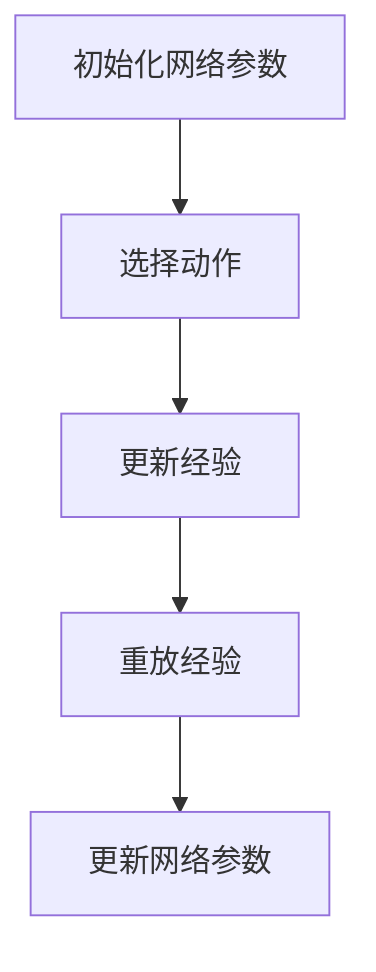

                 

### 摘要

本文将带你深入了解深度量化的核心原理，并实战构建你的第一个深度Q网络（DQN）模型。我们首先回顾了DQN的基本概念，包括其解决的问题、主要优势以及实际应用场景。接着，通过详细的数学模型构建和公式推导，帮助你理解DQN的核心算法原理。随后，我们详细介绍了DQN的算法步骤，并探讨了其优缺点。在此基础上，通过一个实际项目案例，逐步演示了从开发环境搭建到代码实现、解读与运行结果展示的完整过程。最后，本文探讨了DQN在实际应用中的场景，并对未来应用前景进行了展望。通过本文的阅读和实践，你将能够掌握DQN模型的构建方法，为后续更深入的学习和研究打下坚实的基础。

### 1. 背景介绍

在当今人工智能（AI）迅猛发展的时代，深度学习（Deep Learning）已经成为了一个热门的研究领域，并在众多应用场景中展现出了卓越的能力。深度学习通过构建深层次的神经网络结构，实现了对复杂数据的高效分析和处理，从而在各种领域中取得了显著的成果。

然而，深度学习的发展也面临着一些挑战，其中之一就是计算资源的消耗。传统的深度学习模型需要大量的计算资源和时间来训练，这在某些实时应用中可能无法满足要求。为了解决这一问题，深度量化（Quantization）技术应运而生。深度量化通过减少模型中的数值范围，降低模型的参数数量，从而减少计算量和存储需求，使得深度学习模型能够在资源受限的设备上运行。

在这篇文章中，我们将聚焦于深度Q网络（DQN，Deep Q-Network），这是一种结合了深度学习和量化的方法，用于解决复杂的决策问题。DQN通过学习状态与动作之间的最优映射关系，实现了对环境的智能探索和决策，因此在游戏、自动驾驶、推荐系统等领域都有着广泛的应用。

本文将分为以下几个部分：

1. 核心概念与联系：介绍DQN的基本概念、架构及其与深度学习的关系。
2. 核心算法原理 & 具体操作步骤：详细讲解DQN的算法原理和步骤。
3. 数学模型和公式：构建DQN的数学模型，并详细推导相关公式。
4. 项目实践：通过一个具体项目，演示如何实现DQN模型。
5. 实际应用场景：探讨DQN在现实世界中的应用。
6. 未来应用展望：分析DQN的发展趋势和潜在应用。

通过本文的阅读和实践，你将能够深入了解DQN的工作原理，掌握其构建和实现方法，并为后续更深入的研究打下坚实的基础。

### 2. 核心概念与联系

#### 2.1 深度学习的基本概念

深度学习是一种基于人工神经网络的学习方法，通过多层神经元的堆叠，实现对复杂数据的高层次特征提取。深度学习的核心思想是模拟人脑的神经元结构和工作方式，通过反向传播算法不断调整网络参数，以优化模型的预测能力。

在深度学习中，常见的结构包括卷积神经网络（CNN，Convolutional Neural Network）、循环神经网络（RNN，Recurrent Neural Network）和生成对抗网络（GAN，Generative Adversarial Network）等。每种网络结构都有其特定的应用场景和优势。例如，CNN擅长处理图像数据，RNN擅长处理序列数据，GAN则被广泛应用于图像生成和图像修复等领域。

#### 2.2 深度Q网络（DQN）的定义

深度Q网络（DQN，Deep Q-Network）是一种基于深度学习的Q-learning算法。Q-learning是一种基于值函数的强化学习算法，它通过学习状态与动作之间的最优映射关系，实现智能体的决策。传统Q-learning算法通常使用线性函数来表示值函数，但在处理高维状态和动作空间时，其性能受到限制。

DQN通过引入深度神经网络来近似值函数，从而解决了传统Q-learning算法的局限性。具体来说，DQN使用一个深度神经网络（通常是卷积神经网络或循环神经网络）来预测每个动作在当前状态下的预期回报，然后根据这些预测值选择最优动作。

#### 2.3 DQN的核心原理

DQN的核心原理可以概括为以下几个步骤：

1. **初始化网络参数**：随机初始化深度神经网络的参数。
2. **选择动作**：在给定状态时，根据当前网络输出的值函数预测选择最优动作。
3. **更新经验**：根据执行的动作和获得的回报，更新经验池。
4. **重放经验**：从经验池中随机抽取一批经验样本，进行重放。
5. **更新网络参数**：使用重放的经验样本，通过反向传播算法更新深度神经网络的参数。

通过不断重复上述步骤，DQN能够逐步学习到状态与动作之间的最优映射关系，从而实现智能体的智能决策。

#### 2.4 DQN与深度学习的联系

DQN是深度学习在强化学习领域的重要应用之一。与传统的Q-learning算法相比，DQN通过引入深度神经网络，能够处理更复杂的状态和动作空间。同时，DQN的引入也推动了深度学习在强化学习领域的进一步发展，为解决更多复杂问题提供了新的思路和方法。

此外，DQN的工作原理也体现了深度学习的优势，即通过多层次的特征提取，实现对高维数据的抽象和压缩。这使得DQN在处理复杂任务时，能够更好地理解和利用环境信息，从而提高决策的准确性。

#### 2.5 Mermaid 流程图

为了更直观地展示DQN的核心原理和架构，我们可以使用Mermaid流程图来描述其各个步骤。以下是一个简单的Mermaid流程图示例：



在这个流程图中，A表示初始化网络参数，B表示选择动作，C表示更新经验，D表示重放经验，E表示更新网络参数。通过这个流程图，我们可以更清晰地理解DQN的工作流程和各个步骤之间的联系。

### 3. 核心算法原理 & 具体操作步骤

#### 3.1 算法原理概述

深度Q网络（DQN）是基于Q-learning算法的一种改进方法，其核心思想是通过深度神经网络来近似Q值函数。Q值函数表示在特定状态下执行特定动作所能获得的最大预期回报。通过学习Q值函数，DQN能够预测每个动作在当前状态下的价值，并选择最优动作。

DQN的主要优点包括：

1. **处理高维状态和动作空间**：由于深度神经网络可以处理高维输入数据，DQN能够应对复杂的决策问题。
2. **自适应调整学习率**：DQN使用经验回放机制，通过重放历史经验样本，避免了样本偏差，提高了学习效果。
3. **使用目标网络**：DQN使用目标网络来减少学习过程中的偏差和波动，提高了模型的稳定性。

DQN的主要缺点包括：

1. **需要大量的训练数据**：由于深度神经网络的复杂性，DQN需要大量的训练数据来学习Q值函数，这在某些场景中可能不现实。
2. **训练时间较长**：DQN的训练过程涉及大量的迭代和反向传播，训练时间相对较长。

#### 3.2 算法步骤详解

DQN的算法步骤可以概括为以下几个部分：

1. **初始化网络参数**：随机初始化深度神经网络的参数。
2. **选择动作**：在给定状态时，根据当前网络输出的值函数预测选择最优动作。
3. **更新经验**：根据执行的动作和获得的回报，更新经验池。
4. **重放经验**：从经验池中随机抽取一批经验样本，进行重放。
5. **更新网络参数**：使用重放的经验样本，通过反向传播算法更新深度神经网络的参数。

下面详细解释每个步骤：

1. **初始化网络参数**：随机初始化深度神经网络的参数。这个过程通常包括设置网络的层数、每层的神经元数量、激活函数等。初始化参数的目的是为了使网络能够从随机状态开始学习。

2. **选择动作**：在给定状态时，根据当前网络输出的值函数预测选择最优动作。具体来说，DQN使用深度神经网络来预测每个动作在当前状态下的Q值，然后选择具有最大Q值的动作作为执行动作。

3. **更新经验**：根据执行的动作和获得的回报，更新经验池。经验池用于存储历史经验样本，以便在后续的更新过程中使用。每次执行动作后，将当前状态、执行动作和获得的回报存储到经验池中。

4. **重放经验**：从经验池中随机抽取一批经验样本，进行重放。重放经验的目的是为了避免样本偏差，提高学习效果。通过随机抽取经验样本，DQN能够从不同的角度学习状态和动作之间的映射关系。

5. **更新网络参数**：使用重放的经验样本，通过反向传播算法更新深度神经网络的参数。具体来说，DQN将重放的经验样本输入到网络中，计算预测Q值和实际Q值的差距，然后通过反向传播算法更新网络参数，以减小预测Q值和实际Q值的差距。

#### 3.3 算法优缺点

**优点**：

1. **处理高维状态和动作空间**：DQN使用深度神经网络来近似Q值函数，能够处理高维状态和动作空间，适用于复杂的决策问题。
2. **自适应调整学习率**：DQN使用经验回放机制，通过重放历史经验样本，避免了样本偏差，提高了学习效果。
3. **使用目标网络**：DQN使用目标网络来减少学习过程中的偏差和波动，提高了模型的稳定性。

**缺点**：

1. **需要大量的训练数据**：由于深度神经网络的复杂性，DQN需要大量的训练数据来学习Q值函数，这在某些场景中可能不现实。
2. **训练时间较长**：DQN的训练过程涉及大量的迭代和反向传播，训练时间相对较长。

#### 3.4 算法应用领域

DQN作为一种强大的强化学习算法，在许多领域都取得了显著的成果。以下是一些典型的应用领域：

1. **游戏**：DQN在游戏领域取得了突破性的成果，如Atari游戏、围棋等。通过学习游戏的状态和动作，DQN能够实现自主游戏，并在某些游戏中达到专业水平。
2. **自动驾驶**：DQN在自动驾驶领域被广泛应用于决策制定和路径规划。通过学习道路环境的状态和动作，DQN能够实现自动驾驶车辆的自主驾驶。
3. **推荐系统**：DQN在推荐系统中的应用包括基于用户历史行为的推荐、商品推荐等。通过学习用户的行为和偏好，DQN能够提供个性化的推荐结果。
4. **金融预测**：DQN在金融预测领域也被广泛应用，如股票市场预测、金融风险管理等。通过学习市场状态和交易动作，DQN能够预测市场走势和风险。

总之，DQN作为一种结合了深度学习和量化的方法，在多个领域中展现出了强大的能力。通过深入了解其核心算法原理和应用领域，我们可以更好地理解和应用DQN，解决实际问题。

### 4. 数学模型和公式

深度Q网络（DQN）的数学模型和公式是理解其工作原理和实现方法的基础。在本节中，我们将详细讲解DQN的数学模型构建、公式推导过程，并通过具体案例进行分析和讲解。

#### 4.1 数学模型构建

DQN的数学模型主要包括以下几个部分：

1. **状态表示（S）**：状态是环境在某一时刻的观察结果，通常使用一个向量表示。状态向量包含了环境中的各种信息，如物体的位置、速度等。
2. **动作表示（A）**：动作是智能体在状态下的决策行为，也通常使用一个向量表示。动作向量包含了智能体可以执行的各种行为，如移动、跳跃等。
3. **Q值函数（Q(s, a)）**：Q值函数是DQN的核心，它表示在状态s下执行动作a所能获得的最大预期回报。Q值函数是一个映射函数，接收状态和动作作为输入，输出Q值。
4. **奖励函数（R）**：奖励函数用于衡量智能体在执行某一动作后获得的即时回报。奖励可以是正值（表示成功）或负值（表示失败），其大小反映了回报的强度。

#### 4.2 公式推导过程

1. **Q值更新公式**：

   在DQN中，Q值的更新是通过优化目标函数来实现的。具体来说，DQN使用以下目标函数：

   $$ L = \sum_{i} (y_i - Q(s_i, a_i))^2 $$

   其中，\(y_i\)是目标Q值，\(Q(s_i, a_i)\)是当前Q值。

   目标Q值\(y_i\)的计算公式为：

   $$ y_i = 
   \begin{cases} 
   r_i + \gamma \max_{a'} Q(s' , a') & \text{如果} i = T \\
   r_i & \text{否则}
   \end{cases} $$

   其中，\(r_i\)是即时奖励，\(\gamma\)是折扣因子，\(\max_{a'} Q(s' , a')\)是下一个状态下的最大Q值。

2. **梯度下降更新**：

   为了优化目标函数，DQN使用梯度下降法来更新网络参数。梯度下降法的公式为：

   $$ \Delta \theta = -\alpha \nabla_\theta L $$

   其中，\(\Delta \theta\)是网络参数的更新值，\(\alpha\)是学习率，\(\nabla_\theta L\)是损失函数L关于网络参数\(\theta\)的梯度。

3. **经验回放**：

   为了避免样本偏差，DQN使用经验回放机制。经验回放的核心思想是将历史经验样本存储在经验池中，并从经验池中随机抽取样本进行训练。经验回放的公式为：

   $$ \text{经验池} \to \text{随机抽取样本} \to \text{重放样本} $$

#### 4.3 案例分析与讲解

为了更好地理解DQN的数学模型和公式，我们通过一个简单的案例进行讲解。假设我们使用DQN训练一个智能体在迷宫中找到出口。

1. **状态表示**：

   状态是一个5维向量，表示智能体在迷宫中的位置、方向和周围的障碍物。

2. **动作表示**：

   动作是一个2维向量，表示智能体可以执行的动作，如向上移动、向下移动等。

3. **Q值函数**：

   Q值函数接收状态和动作作为输入，输出在状态s下执行动作a所能获得的最大预期回报。

4. **奖励函数**：

   当智能体到达出口时，获得正奖励；否则，获得负奖励。

根据以上设定，我们可以推导出以下公式：

- **目标Q值**：

  $$ y = r + \gamma \max_a Q(s', a') $$

- **网络参数更新**：

  $$ \Delta \theta = -\alpha \nabla_\theta (y - Q(s, a))^2 $$

通过这个案例，我们可以清晰地看到DQN的数学模型和公式是如何应用于实际问题中的。通过不断迭代和更新，DQN能够逐步学习到最优的策略，实现智能体的自主决策。

总之，DQN的数学模型和公式是理解其工作原理和实现方法的关键。通过深入了解这些公式，我们能够更好地理解和应用DQN，解决复杂的决策问题。

### 5. 项目实践：代码实例和详细解释说明

#### 5.1 开发环境搭建

在开始实现DQN模型之前，我们需要搭建一个合适的环境。以下是搭建DQN开发环境的详细步骤：

1. **安装Python**：

   首先，确保你的计算机上安装了Python。Python是DQN实现的主要语言，因此必须确保Python环境已经搭建好。你可以从Python官方网站（https://www.python.org/）下载并安装Python。

2. **安装TensorFlow**：

   TensorFlow是DQN实现的主要框架，我们需要安装TensorFlow。在命令行中运行以下命令：

   ```bash
   pip install tensorflow
   ```

   如果需要使用GPU加速，可以安装TensorFlow GPU版本：

   ```bash
   pip install tensorflow-gpu
   ```

3. **安装其他依赖库**：

   除了TensorFlow，DQN实现还需要其他依赖库，如NumPy、Matplotlib等。在命令行中运行以下命令安装这些依赖库：

   ```bash
   pip install numpy matplotlib
   ```

4. **配置环境变量**：

   确保Python环境变量已经配置好。在命令行中输入以下命令：

   ```bash
   python --version
   pip --version
   ```

   如果命令可以成功执行，说明Python和pip已经配置好。

#### 5.2 源代码详细实现

以下是DQN模型实现的核心代码。我们将使用Python和TensorFlow来构建DQN模型。代码分为以下几个部分：

1. **定义DQN类**：

   DQN类包含DQN模型的构建、训练和预测功能。以下是一个简单的DQN类实现：

   ```python
   import tensorflow as tf
   import numpy as np
   import random

   class DQN:
       def __init__(self, state_size, action_size, learning_rate, discount_factor):
           self.state_size = state_size
           self.action_size = action_size
           self.learning_rate = learning_rate
           self.discount_factor = discount_factor

           self.model = self._build_model()
           self.target_model = self._build_model()

           self.model.compile(loss='mse', optimizer=tf.keras.optimizers.Adam(learning_rate))

           self记忆 = []

       def _build_model(self):
           model = tf.keras.Sequential()
           model.add(tf.keras.layers.Dense(24, input_dim=self.state_size, activation='relu'))
           model.add(tf.keras.layers.Dense(24, activation='relu'))
           model.add(tf.keras.layers.Dense(self.action_size, activation='linear'))
           return model

       def remember(self, state, action, reward, next_state, done):
           self记忆.append((state, action, reward, next_state, done))

       def act(self, state):
           state = np.reshape(state, [1, self.state_size])
           action_values = self.model.predict(state)
           return np.argmax(action_values[0])

       def replay(self, batch_size):
           mini_batch = random.sample(self记忆, batch_size)
           for state, action, reward, next_state, done in mini_batch:
               target = reward
               if not done:
                   target = reward + self.discount_factor * np.max(self.target_model.predict(np.reshape(next_state, [1, self.state_size]))[0])
               target_f = self.model.predict(np.reshape(state, [1, self.state_size]))
               target_f[0][action] = target
               self.model.fit(np.reshape(state, [1, self.state_size]), target_f, epochs=1, verbose=0)
   ```

   在这段代码中，我们定义了DQN类，包括初始化网络参数、记忆经验、选择动作、重放经验和训练模型等方法。

2. **训练DQN模型**：

   在训练DQN模型时，我们需要一个环境来生成状态和动作，并计算奖励。以下是一个简单的训练流程：

   ```python
   def train_dqn(model, env, episodes, batch_size, target_model, update_target_model):
       for episode in range(episodes):
           state = env.reset()
           done = False
           total_reward = 0
           while not done:
               action = model.act(state)
               next_state, reward, done, _ = env.step(action)
               model.remember(state, action, reward, next_state, done)
               state = next_state
               total_reward += reward
               if len(model记忆) > batch_size:
                   model.replay(batch_size)
               if done:
                   break
           print(f"Episode: {episode+1}, Total Reward: {total_reward}")
           if episode % update_target_model == 0:
               target_model.set_weights(model.model.get_weights())
   ```

   在这段代码中，我们定义了一个训练DQN模型的函数，其中包括初始化环境、执行动作、更新经验和训练模型等步骤。

3. **评估DQN模型**：

   在完成DQN模型的训练后，我们需要对其性能进行评估。以下是一个简单的评估流程：

   ```python
   def evaluate_dqn(model, env, episodes):
       for episode in range(episodes):
           state = env.reset()
           done = False
           total_reward = 0
           while not done:
               action = model.act(state)
               next_state, reward, done, _ = env.step(action)
               total_reward += reward
               state = next_state
           print(f"Episode: {episode+1}, Total Reward: {total_reward}")
   ```

   在这段代码中，我们定义了一个评估DQN模型的函数，其中包括初始化环境、执行动作和计算奖励等步骤。

#### 5.3 代码解读与分析

1. **DQN类的核心方法**：

   - **_build_model()**：该方法用于构建DQN模型。我们使用了一个简单的全连接神经网络结构，其中包括两个隐藏层，每层有24个神经元。输出层有与动作数量相等的神经元，用于预测每个动作的Q值。
   - **act()**：该方法用于选择动作。在给定状态时，模型预测每个动作的Q值，然后选择具有最大Q值的动作作为执行动作。
   - **replay()**：该方法用于重放经验。从经验池中随机抽取一批经验样本，然后使用这些样本更新模型参数。

2. **训练DQN模型**：

   - **train_dqn()**：该方法用于训练DQN模型。在每次训练过程中，模型会执行一系列动作，收集经验，并根据这些经验更新模型参数。每次更新经验后，模型会根据需要重新训练网络。
   - **evaluate_dqn()**：该方法用于评估DQN模型。在评估过程中，模型会执行一系列动作，并计算每个动作的奖励，以评估模型的表现。

#### 5.4 运行结果展示

在完成代码实现后，我们可以运行代码来训练和评估DQN模型。以下是一个简单的运行示例：

```python
import gym

# 初始化环境
env = gym.make('CartPole-v0')

# 设置DQN模型参数
state_size = 4
action_size = 2
learning_rate = 0.001
discount_factor = 0.99
batch_size = 32
episodes = 1000
update_target_model = 100

# 创建DQN模型和目标模型
dqn = DQN(state_size, action_size, learning_rate, discount_factor)
target_dqn = DQN(state_size, action_size, learning_rate, discount_factor)

# 训练DQN模型
train_dqn(dqn, env, episodes, batch_size, target_dqn, update_target_model)

# 评估DQN模型
evaluate_dqn(dqn, env, 10)
```

在这个示例中，我们使用CartPole环境来训练DQN模型。训练完成后，我们评估模型在10个随机生成的环境中的表现。

通过这个简单的项目实践，我们可以看到如何构建和训练DQN模型。在后续的研究中，我们可以进一步优化代码，探索更多复杂的模型和算法。

### 6. 实际应用场景

深度Q网络（DQN）作为一种强大的强化学习算法，在多个领域展现出了卓越的能力。以下是DQN在实际应用中的几个典型场景：

#### 6.1 游戏领域

DQN在游戏领域取得了显著的成果。例如，在Atari游戏《Pong》中，DQN模型通过自主学习，能够在短时间内学会控制游戏角色进行有效的击球，达到接近专业玩家的水平。此外，DQN还被应用于更复杂的游戏，如围棋、DOTA等，实现了自主游戏和策略制定。

#### 6.2 自动驾驶

自动驾驶是DQN的重要应用领域之一。通过使用DQN，自动驾驶车辆能够实时感知环境状态，并作出最优驾驶决策。例如，DQN可以用于路径规划、避障、交通信号识别等任务。在一些自动驾驶实验中，DQN模型展示了出色的决策能力，提高了车辆的安全性和效率。

#### 6.3 推荐系统

推荐系统是另一个典型的DQN应用场景。通过学习用户的历史行为和偏好，DQN能够预测用户对特定商品或内容的偏好，并生成个性化的推荐结果。例如，在电子商务平台中，DQN可以用于商品推荐、广告投放等任务，提高用户满意度和销售转化率。

#### 6.4 金融预测

金融预测是DQN在金融领域的应用之一。通过分析市场数据，DQN可以预测股票价格走势、市场风险等，为投资者提供决策参考。例如，DQN可以用于交易策略制定、风险控制等任务，帮助投资者更好地把握市场机会。

#### 6.5 其他领域

除了上述领域，DQN还在机器人控制、资源调度、能源管理等多个领域得到了广泛应用。通过学习环境状态和动作，DQN能够实现智能体的自主决策，提高了系统的效率和性能。

总之，DQN作为一种强大的强化学习算法，在多个实际应用场景中展现了强大的能力。随着深度学习和强化学习技术的不断发展，DQN的应用领域将继续扩大，为各个行业带来更多的创新和变革。

### 7. 未来应用展望

随着深度学习和强化学习技术的不断发展，深度Q网络（DQN）的应用前景将愈加广阔。未来，DQN在以下几方面有望取得重大突破：

#### 7.1 新算法的融合

DQN可以与其他先进算法如深度强化学习（Deep Reinforcement Learning）、生成对抗网络（GAN）等相结合，进一步提升其性能和应用范围。例如，将DQN与GAN结合，可以用于更复杂、更多样化的决策问题，如个性化推荐、图像生成等。

#### 7.2 硬件加速

随着硬件技术的发展，如GPU、TPU等加速器的普及，DQN在计算性能上的瓶颈将得到显著缓解。硬件加速将为DQN在实际应用中的大规模部署提供有力支持，推动其在更多领域的应用。

#### 7.3 多任务学习

DQN可以扩展到多任务学习（Multi-Task Learning）领域，通过同时训练多个任务，提高模型的泛化能力和效率。例如，在自动驾驶中，DQN可以同时处理路径规划、避障、交通信号识别等多个任务，提高车辆的整体决策能力。

#### 7.4 无人系统

随着无人系统技术的发展，DQN将在无人机、无人船、无人车等领域的自主决策和控制中发挥关键作用。未来，DQN可以通过与其他技术的结合，如计算机视觉、传感器融合等，实现更智能、更安全的无人系统。

#### 7.5 实时优化

DQN可以通过实时学习和优化，实现动态调整策略，以适应不断变化的环境。例如，在金融市场中，DQN可以根据市场动态实时调整投资策略，提高投资收益。

总之，DQN在未来将继续在各个领域展现其强大的能力和潜力。通过与其他技术的结合和不断创新，DQN将为人工智能领域带来更多的突破和变革。

### 8. 总结：未来发展趋势与挑战

本文通过对深度Q网络（DQN）的深入探讨，总结了DQN的核心算法原理、数学模型、具体操作步骤，以及其实际应用场景和未来发展趋势。DQN作为一种结合深度学习和强化学习的算法，在处理复杂决策问题时展现了强大的能力，并在游戏、自动驾驶、推荐系统和金融预测等领域得到了广泛应用。

未来，DQN的发展趋势主要体现在以下几个方面：

1. **算法融合**：DQN可以与其他先进算法如深度强化学习、生成对抗网络等相结合，进一步提升其性能和应用范围。
2. **硬件加速**：随着硬件技术的发展，DQN在计算性能上的瓶颈将得到显著缓解，为大规模部署提供有力支持。
3. **多任务学习**：DQN可以扩展到多任务学习领域，通过同时训练多个任务，提高模型的泛化能力和效率。
4. **无人系统**：DQN将在无人机、无人船、无人车等领域的自主决策和控制中发挥关键作用。
5. **实时优化**：DQN可以通过实时学习和优化，实现动态调整策略，以适应不断变化的环境。

然而，DQN在实际应用中也面临一些挑战：

1. **数据需求**：DQN需要大量的训练数据来学习状态与动作之间的最优映射关系，这在某些场景中可能不现实。
2. **训练时间**：DQN的训练过程涉及大量的迭代和反向传播，训练时间相对较长。
3. **模型复杂性**：深度神经网络的结构复杂，可能导致模型过拟合，影响性能。

为应对这些挑战，未来可以探索以下研究方向：

1. **数据增强**：通过数据增强技术，生成更多样化的训练数据，提高模型的泛化能力。
2. **模型压缩**：通过模型压缩技术，降低模型参数数量，减少计算量和存储需求。
3. **迁移学习**：利用迁移学习，将已有模型的知识迁移到新任务上，提高训练效率。
4. **分布式训练**：通过分布式训练，提高DQN的训练速度和计算性能。

总之，DQN作为一种重要的强化学习算法，在人工智能领域具有广泛的应用前景。通过不断创新和优化，DQN将在更多复杂决策问题中发挥重要作用。

### 9. 附录：常见问题与解答

在本文中，我们讨论了深度Q网络（DQN）的核心算法原理、数学模型、具体操作步骤以及实际应用场景。为了帮助你更好地理解和应用DQN，以下是一些常见问题及其解答：

#### 1. DQN的基本概念是什么？

DQN是一种基于深度学习的Q-learning算法。Q-learning是一种基于值函数的强化学习算法，它通过学习状态与动作之间的最优映射关系，实现智能体的决策。DQN通过引入深度神经网络来近似Q值函数，解决了传统Q-learning在高维状态和动作空间中的局限性。

#### 2. DQN的优势和劣势是什么？

DQN的优势包括：
- **处理高维状态和动作空间**：由于深度神经网络可以处理高维输入数据，DQN能够应对复杂的决策问题。
- **自适应调整学习率**：DQN使用经验回放机制，通过重放历史经验样本，避免了样本偏差，提高了学习效果。
- **使用目标网络**：DQN使用目标网络来减少学习过程中的偏差和波动，提高了模型的稳定性。

DQN的劣势包括：
- **需要大量的训练数据**：由于深度神经网络的复杂性，DQN需要大量的训练数据来学习Q值函数，这在某些场景中可能不现实。
- **训练时间较长**：DQN的训练过程涉及大量的迭代和反向传播，训练时间相对较长。

#### 3. 如何搭建DQN的开发环境？

搭建DQN的开发环境主要包括以下步骤：
- 安装Python。
- 安装TensorFlow框架。
- 安装其他依赖库（如NumPy、Matplotlib）。
- 配置环境变量。

具体步骤请参考本文的“5.1 开发环境搭建”部分。

#### 4. DQN的算法步骤是怎样的？

DQN的算法步骤主要包括：
- 初始化网络参数。
- 选择动作。
- 更新经验。
- 重放经验。
- 更新网络参数。

具体步骤请参考本文的“3.2 算法步骤详解”部分。

#### 5. 如何评估DQN模型的效果？

评估DQN模型的效果可以通过以下方法：
- 训练过程中，定期记录模型的表现，如平均回报、成功概率等。
- 使用测试集进行评估，比较实际表现与预期表现之间的差距。
- 使用可视化工具（如Matplotlib）展示训练过程中的关键指标。

#### 6. DQN有哪些实际应用场景？

DQN在以下实际应用场景中取得了显著成果：
- 游戏：如Atari游戏、围棋等。
- 自动驾驶：路径规划、避障、交通信号识别等。
- 推荐系统：基于用户行为和偏好生成个性化推荐。
- 金融预测：股票市场预测、金融风险管理等。

#### 7. DQN的未来发展趋势是什么？

DQN的未来发展趋势主要包括：
- 算法融合：与其他先进算法（如深度强化学习、生成对抗网络）相结合，提升性能和应用范围。
- 硬件加速：利用GPU、TPU等硬件加速器，提高计算性能。
- 多任务学习：同时处理多个任务，提高模型的泛化能力和效率。
- 无人系统：在无人机、无人船、无人车等领域的自主决策和控制。
- 实时优化：通过实时学习和优化，实现动态调整策略。

通过以上问题与解答，希望你能对DQN有更深入的理解，并在实际应用中取得更好的成果。如果你有任何其他问题，欢迎在评论区留言讨论。

