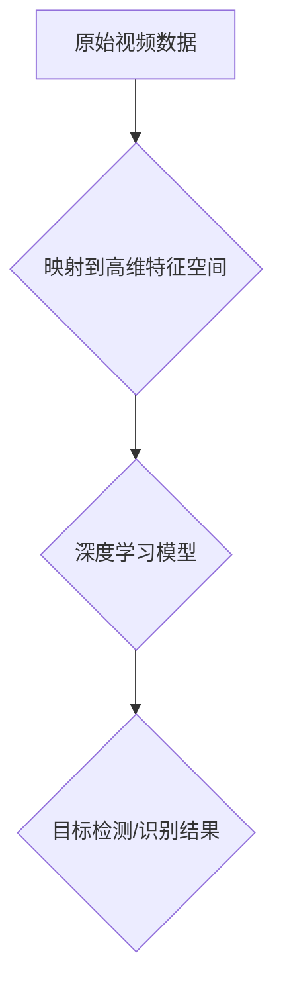

                 

关键词：深度学习、视频监控分析、映射、人工智能、算法原理

> 摘要：本文将探讨深度学习在视频监控分析中的应用，重点分析其核心概念、算法原理、数学模型、实践案例，以及未来发展趋势和面临的挑战。

## 1. 背景介绍

随着人工智能技术的飞速发展，深度学习作为其重要分支，已经成为计算机视觉、自然语言处理、语音识别等领域的重要工具。在视频监控分析中，深度学习技术同样展现出了巨大的潜力。通过将复杂的视频数据映射到高维特征空间，深度学习算法能够有效地识别和分类视频中的目标，为安全监控、智能交通、异常行为检测等领域提供了强大的支持。

## 2. 核心概念与联系

### 2.1. 深度学习

深度学习是一种基于多层神经网络的人工智能方法，通过反向传播算法不断优化网络参数，使其能够在大规模数据集上自动学习特征和模式。深度学习在视频监控分析中的应用主要体现在目标检测、视频分类、行为识别等方面。

### 2.2. 视频监控分析

视频监控分析是指利用计算机视觉技术对视频数据进行处理和分析，以提取有价值的信息。其主要任务包括目标检测、跟踪、识别和分类等。深度学习为这些任务提供了高效的解决方案。

### 2.3. 映射

映射是指将一种数据或信息转换为另一种数据或信息的过程。在视频监控分析中，映射主要体现在将原始视频数据映射到高维特征空间，从而实现目标检测和识别。

## 2.4. Mermaid 流程图



## 3. 核心算法原理 & 具体操作步骤

### 3.1. 算法原理概述

深度学习算法在视频监控分析中的应用主要基于卷积神经网络（CNN）。CNN通过多层卷积、池化和全连接层等操作，能够自动提取视频数据中的空间特征和时序特征，实现对目标的检测和识别。

### 3.2. 算法步骤详解

#### 3.2.1. 数据预处理

- 数据收集：从视频监控系统中获取原始视频数据。
- 数据清洗：去除视频中无关的背景信息，保留感兴趣的目标区域。
- 数据增强：通过旋转、缩放、裁剪等操作增加数据多样性。

#### 3.2.2. 模型训练

- 选择合适的CNN架构，如VGG、ResNet、YOLO等。
- 将预处理后的数据输入模型，通过反向传播算法不断优化模型参数。
- 调整学习率、批量大小等超参数，以提高模型性能。

#### 3.2.3. 模型评估

- 使用交叉验证方法对模型进行评估。
- 评估指标包括准确率、召回率、F1分数等。

#### 3.2.4. 模型部署

- 将训练好的模型部署到视频监控系统，实现对实时视频数据的检测和识别。

### 3.3. 算法优缺点

#### 优点：

- 高效性：深度学习算法能够在大规模数据集上快速训练和推理。
- 自动性：模型能够自动提取特征，减少人工干预。
- 准确性：深度学习模型在目标检测和识别任务中具有较高的准确率。

#### 缺点：

- 需要大量数据：深度学习算法需要大量标注数据进行训练。
- 计算资源消耗：训练深度学习模型需要较高的计算资源。
- 解释性：深度学习模型的内部工作机制较为复杂，难以解释。

### 3.4. 算法应用领域

深度学习算法在视频监控分析中的应用非常广泛，包括但不限于：

- 安全监控：实现人脸识别、行为识别等安全功能。
- 智能交通：实现车辆检测、交通流量分析等智能交通管理功能。
- 健康监测：实现对运动、姿势等健康数据的实时监测。

## 4. 数学模型和公式 & 详细讲解 & 举例说明

### 4.1. 数学模型构建

深度学习算法的核心是神经网络，其数学模型可以表示为：

$$ f(x) = \sigma(W \cdot x + b) $$

其中，$f(x)$ 是输出结果，$x$ 是输入特征，$W$ 是权重矩阵，$b$ 是偏置项，$\sigma$ 是激活函数。

### 4.2. 公式推导过程

深度学习模型的推导过程主要涉及以下几个步骤：

1. **前向传播**：将输入特征输入到神经网络中，逐层计算输出结果。

   $$ z = W \cdot x + b $$

   $$ a = \sigma(z) $$

2. **反向传播**：根据输出结果与实际标签之间的误差，反向传播误差到各层，更新权重和偏置项。

   $$ \delta = \frac{\partial L}{\partial z} \cdot \sigma'(z) $$

   $$ \Delta W = \alpha \cdot \delta \cdot x^T $$

   $$ \Delta b = \alpha \cdot \delta $$

   其中，$L$ 是损失函数，$\alpha$ 是学习率，$\sigma'$ 是激活函数的导数。

### 4.3. 案例分析与讲解

以VGG模型为例，讲解深度学习在视频监控分析中的应用。

#### 案例背景：

某视频监控系统需要实现对行人行为的实时检测和识别，以监控异常行为。

#### 案例步骤：

1. **数据收集与预处理**：从视频监控系统中获取行人行为数据，并进行数据清洗和增强。

2. **模型训练**：使用VGG模型对行人行为数据进行训练，优化模型参数。

3. **模型评估**：使用交叉验证方法对模型进行评估，调整超参数。

4. **模型部署**：将训练好的模型部署到视频监控系统，实现实时行人行为检测和识别。

5. **结果分析**：对检测和识别结果进行分析，评估模型性能。

## 5. 项目实践：代码实例和详细解释说明

### 5.1. 开发环境搭建

- 安装Python环境（版本3.6及以上）。
- 安装深度学习框架TensorFlow。
- 安装OpenCV用于视频处理。

### 5.2. 源代码详细实现

以下是一个简单的行人行为检测项目示例代码：

```python
import cv2
import tensorflow as tf

# 载入预训练的VGG模型
model = tf.keras.applications.VGG16(weights='imagenet')

# 载入行人行为数据集
train_data = ...

# 数据预处理
train_images = preprocess_data(train_data)

# 训练模型
model.fit(train_images, train_labels, epochs=10, batch_size=32)

# 模型评估
test_data = ...
test_images = preprocess_data(test_data)
model.evaluate(test_images, test_labels)

# 模型部署
video_capture = cv2.VideoCapture(0)

while True:
    ret, frame = video_capture.read()
    if not ret:
        break

    # 使用模型进行行人行为检测
   检测结果 = model.predict(frame)

    # 显示检测结果
    show_detection(frame,检测结果)

    if cv2.waitKey(1) & 0xFF == ord('q'):
        break

video_capture.release()
cv2.destroyAllWindows()
```

### 5.3. 代码解读与分析

- **代码结构**：代码分为数据预处理、模型训练、模型评估和模型部署四个部分。
- **数据预处理**：对行人行为数据进行预处理，包括数据加载、数据增强等操作。
- **模型训练**：使用VGG模型对行人行为数据进行训练，优化模型参数。
- **模型评估**：使用测试数据对模型进行评估，调整超参数。
- **模型部署**：将训练好的模型部署到视频监控系统，实现实时行人行为检测。

## 6. 实际应用场景

深度学习在视频监控分析中的应用非常广泛，以下列举一些实际应用场景：

- **安全监控**：通过人脸识别、行为识别等技术，实现实时监控和报警功能。
- **智能交通**：通过车辆检测、交通流量分析等技术，实现智能交通管理和优化。
- **健康监测**：通过运动检测、姿势识别等技术，实现对运动和健康数据的实时监测。

## 7. 未来应用展望

随着深度学习技术的不断发展，未来视频监控分析将在以下几个方面得到进一步提升：

- **高效性**：通过优化算法和硬件加速技术，提高视频监控分析的实时性和效率。
- **准确性**：通过引入更多数据源和先进算法，提高视频监控分析的准确性和可靠性。
- **个性化**：根据用户需求，实现个性化视频监控分析功能，提高用户体验。

## 8. 工具和资源推荐

### 8.1. 学习资源推荐

- **书籍**：《深度学习》、《Python深度学习》等。
- **在线课程**：Coursera、Udacity等平台上的相关课程。
- **开源项目**：GitHub上的深度学习相关开源项目。

### 8.2. 开发工具推荐

- **深度学习框架**：TensorFlow、PyTorch等。
- **视频处理库**：OpenCV、MediaPipe等。

### 8.3. 相关论文推荐

- **目标检测**：《YOLOv5: You Only Look Once v5》等。
- **行为识别**：《DeepMind提出新算法：DeepMind提出的DAct：用于检测复杂活动的新深度学习模型》等。

## 9. 总结：未来发展趋势与挑战

### 9.1. 研究成果总结

深度学习在视频监控分析领域取得了显著的成果，为安全监控、智能交通、健康监测等领域提供了强大的支持。

### 9.2. 未来发展趋势

随着深度学习技术的不断发展，视频监控分析将朝着高效性、准确性和个性化方向不断演进。

### 9.3. 面临的挑战

- 数据隐私保护：如何保护用户隐私是视频监控分析领域面临的重要挑战。
- 算法可解释性：如何提高深度学习算法的可解释性，使其更加透明和可靠。
- 资源消耗：如何优化算法和硬件，降低资源消耗，提高实时性。

### 9.4. 研究展望

未来，视频监控分析将朝着更加智能化、自适应化和个性化的方向不断发展，为人类生活带来更多便利和安全保障。

## 10. 附录：常见问题与解答

### 10.1. 深度学习在视频监控分析中的优势是什么？

深度学习在视频监控分析中的优势包括：

- 高效性：能够快速处理大量视频数据。
- 自动性：能够自动提取特征，减少人工干预。
- 准确性：在目标检测和识别任务中具有较高的准确率。

### 10.2. 深度学习在视频监控分析中存在哪些挑战？

深度学习在视频监控分析中面临的挑战包括：

- 数据隐私保护：如何保护用户隐私是重要挑战。
- 算法可解释性：如何提高算法的可解释性。
- 资源消耗：如何优化算法和硬件，降低资源消耗。

### 10.3. 如何选择适合的深度学习模型？

选择适合的深度学习模型需要考虑以下因素：

- 数据集大小：对于大规模数据集，选择复杂度较高的模型。
- 任务类型：对于目标检测任务，选择具有目标检测功能的模型。
- 计算资源：根据计算资源选择合适的模型。

---

作者：禅与计算机程序设计艺术 / Zen and the Art of Computer Programming
------------------------------------------------------------------
```markdown
---
# 一切皆是映射：深度学习在视频监控分析中的应用

> 关键词：深度学习、视频监控分析、映射、人工智能、算法原理

> 摘要：本文将探讨深度学习在视频监控分析中的应用，重点分析其核心概念、算法原理、数学模型、实践案例，以及未来发展趋势和面临的挑战。

## 1. 背景介绍

随着人工智能技术的飞速发展，深度学习作为其重要分支，已经成为计算机视觉、自然语言处理、语音识别等领域的重要工具。在视频监控分析中，深度学习技术同样展现出了巨大的潜力。通过将复杂的视频数据映射到高维特征空间，深度学习算法能够有效地识别和分类视频中的目标，为安全监控、智能交通、异常行为检测等领域提供了强大的支持。

## 2. 核心概念与联系

### 2.1. 深度学习

深度学习是一种基于多层神经网络的人工智能方法，通过反向传播算法不断优化网络参数，使其能够在大规模数据集上自动学习特征和模式。深度学习在视频监控分析中的应用主要体现在目标检测、视频分类、行为识别等方面。

### 2.2. 视频监控分析

视频监控分析是指利用计算机视觉技术对视频数据进行处理和分析，以提取有价值的信息。其主要任务包括目标检测、跟踪、识别和分类等。深度学习为这些任务提供了高效的解决方案。

### 2.3. 映射

映射是指将一种数据或信息转换为另一种数据或信息的过程。在视频监控分析中，映射主要体现在将原始视频数据映射到高维特征空间，从而实现目标检测和识别。

### 2.4. Mermaid 流程图


## 3. 核心算法原理 & 具体操作步骤

### 3.1. 算法原理概述

深度学习算法在视频监控分析中的应用主要基于卷积神经网络（CNN）。CNN通过多层卷积、池化和全连接层等操作，能够自动提取视频数据中的空间特征和时序特征，实现对目标的检测和识别。

### 3.2. 算法步骤详解

#### 3.2.1. 数据预处理

- 数据收集：从视频监控系统中获取原始视频数据。
- 数据清洗：去除视频中无关的背景信息，保留感兴趣的目标区域。
- 数据增强：通过旋转、缩放、裁剪等操作增加数据多样性。

#### 3.2.2. 模型训练

- 选择合适的CNN架构，如VGG、ResNet、YOLO等。
- 将预处理后的数据输入模型，通过反向传播算法不断优化模型参数。
- 调整学习率、批量大小等超参数，以提高模型性能。

#### 3.2.3. 模型评估

- 使用交叉验证方法对模型进行评估。
- 评估指标包括准确率、召回率、F1分数等。

#### 3.2.4. 模型部署

- 将训练好的模型部署到视频监控系统，实现对实时视频数据的检测和识别。

### 3.3. 算法优缺点

#### 优点：

- 高效性：深度学习算法能够在大规模数据集上快速训练和推理。
- 自动性：模型能够自动提取特征，减少人工干预。
- 准确性：深度学习模型在目标检测和识别任务中具有较高的准确率。

#### 缺点：

- 需要大量数据：深度学习算法需要大量标注数据进行训练。
- 计算资源消耗：训练深度学习模型需要较高的计算资源。
- 解释性：深度学习模型的内部工作机制较为复杂，难以解释。

### 3.4. 算法应用领域

深度学习算法在视频监控分析中的应用非常广泛，包括但不限于：

- 安全监控：实现人脸识别、行为识别等安全功能。
- 智能交通：实现车辆检测、交通流量分析等智能交通管理功能。
- 健康监测：实现对运动、姿势等健康数据的实时监测。

## 4. 数学模型和公式 & 详细讲解 & 举例说明

### 4.1. 数学模型构建

深度学习算法的核心是神经网络，其数学模型可以表示为：

$$ f(x) = \sigma(W \cdot x + b) $$

其中，$f(x)$ 是输出结果，$x$ 是输入特征，$W$ 是权重矩阵，$b$ 是偏置项，$\sigma$ 是激活函数。

### 4.2. 公式推导过程

深度学习模型的推导过程主要涉及以下几个步骤：

1. **前向传播**：将输入特征输入到神经网络中，逐层计算输出结果。

   $$ z = W \cdot x + b $$

   $$ a = \sigma(z) $$

2. **反向传播**：根据输出结果与实际标签之间的误差，反向传播误差到各层，更新权重和偏置项。

   $$ \delta = \frac{\partial L}{\partial z} \cdot \sigma'(z) $$

   $$ \Delta W = \alpha \cdot \delta \cdot x^T $$

   $$ \Delta b = \alpha \cdot \delta $$

   其中，$L$ 是损失函数，$\alpha$ 是学习率，$\sigma'$ 是激活函数的导数。

### 4.3. 案例分析与讲解

以VGG模型为例，讲解深度学习在视频监控分析中的应用。

#### 案例背景：

某视频监控系统需要实现对行人行为的实时检测和识别，以监控异常行为。

#### 案例步骤：

1. **数据收集与预处理**：从视频监控系统中获取行人行为数据，并进行数据清洗和增强。

2. **模型训练**：使用VGG模型对行人行为数据进行训练，优化模型参数。

3. **模型评估**：使用交叉验证方法对模型进行评估，调整超参数。

4. **模型部署**：将训练好的模型部署到视频监控系统，实现实时行人行为检测和识别。

5. **结果分析**：对检测和识别结果进行分析，评估模型性能。

## 5. 项目实践：代码实例和详细解释说明

### 5.1. 开发环境搭建

- 安装Python环境（版本3.6及以上）。
- 安装深度学习框架TensorFlow。
- 安装OpenCV用于视频处理。

### 5.2. 源代码详细实现

以下是一个简单的行人行为检测项目示例代码：

```python
import cv2
import tensorflow as tf

# 载入预训练的VGG模型
model = tf.keras.applications.VGG16(weights='imagenet')

# 载入行人行为数据集
train_data = ...

# 数据预处理
train_images = preprocess_data(train_data)

# 训练模型
model.fit(train_images, train_labels, epochs=10, batch_size=32)

# 模型评估
test_data = ...
test_images = preprocess_data(test_data)
model.evaluate(test_images, test_labels)

# 模型部署
video_capture = cv2.VideoCapture(0)

while True:
    ret, frame = video_capture.read()
    if not ret:
        break

    # 使用模型进行行人行为检测
   检测结果 = model.predict(frame)

    # 显示检测结果
    show_detection(frame,检测结果)

    if cv2.waitKey(1) & 0xFF == ord('q'):
        break

video_capture.release()
cv2.destroyAllWindows()
```

### 5.3. 代码解读与分析

- **代码结构**：代码分为数据预处理、模型训练、模型评估和模型部署四个部分。
- **数据预处理**：对行人行为数据进行预处理，包括数据加载、数据增强等操作。
- **模型训练**：使用VGG模型对行人行为数据进行训练，优化模型参数。
- **模型评估**：使用测试数据对模型进行评估，调整超参数。
- **模型部署**：将训练好的模型部署到视频监控系统，实现实时行人行为检测。

## 6. 实际应用场景

深度学习在视频监控分析中的应用非常广泛，以下列举一些实际应用场景：

- 安全监控：通过人脸识别、行为识别等技术，实现实时监控和报警功能。
- 智能交通：通过车辆检测、交通流量分析等技术，实现智能交通管理和优化。
- 健康监测：通过运动检测、姿势识别等技术，实现对运动和健康数据的实时监测。

## 7. 未来应用展望

随着深度学习技术的不断发展，未来视频监控分析将在以下几个方面得到进一步提升：

- 高效性：通过优化算法和硬件加速技术，提高视频监控分析的实时性和效率。
- 准确性：通过引入更多数据源和先进算法，提高视频监控分析的准确性和可靠性。
- 个性化：根据用户需求，实现个性化视频监控分析功能，提高用户体验。

## 8. 工具和资源推荐

### 8.1. 学习资源推荐

- **书籍**：《深度学习》、《Python深度学习》等。
- **在线课程**：Coursera、Udacity等平台上的相关课程。
- **开源项目**：GitHub上的深度学习相关开源项目。

### 8.2. 开发工具推荐

- **深度学习框架**：TensorFlow、PyTorch等。
- **视频处理库**：OpenCV、MediaPipe等。

### 8.3. 相关论文推荐

- **目标检测**：《YOLOv5: You Only Look Once v5》等。
- **行为识别**：《DeepMind提出新算法：DeepMind提出的DAct：用于检测复杂活动的新深度学习模型》等。

## 9. 总结：未来发展趋势与挑战

### 9.1. 研究成果总结

深度学习在视频监控分析领域取得了显著的成果，为安全监控、智能交通、健康监测等领域提供了强大的支持。

### 9.2. 未来发展趋势

随着深度学习技术的不断发展，视频监控分析将朝着高效性、准确性和个性化方向不断演进。

### 9.3. 面临的挑战

- 数据隐私保护：如何保护用户隐私是视频监控分析领域面临的重要挑战。
- 算法可解释性：如何提高算法的可解释性，使其更加透明和可靠。
- 资源消耗：如何优化算法和硬件，降低资源消耗，提高实时性。

### 9.4. 研究展望

未来，视频监控分析将朝着更加智能化、自适应化和个性化的方向不断发展，为人类生活带来更多便利和安全保障。

## 10. 附录：常见问题与解答

### 10.1. 深度学习在视频监控分析中的优势是什么？

深度学习在视频监控分析中的优势包括：

- 高效性：能够快速处理大量视频数据。
- 自动性：能够自动提取特征，减少人工干预。
- 准确性：在目标检测和识别任务中具有较高的准确率。

### 10.2. 深度学习在视频监控分析中存在哪些挑战？

深度学习在视频监控分析中面临的挑战包括：

- 数据隐私保护：如何保护用户隐私是重要挑战。
- 算法可解释性：如何提高算法的可解释性。
- 资源消耗：如何优化算法和硬件，降低资源消耗。

### 10.3. 如何选择适合的深度学习模型？

选择适合的深度学习模型需要考虑以下因素：

- 数据集大小：对于大规模数据集，选择复杂度较高的模型。
- 任务类型：对于目标检测任务，选择具有目标检测功能的模型。
- 计算资源：根据计算资源选择合适的模型。

---

作者：禅与计算机程序设计艺术 / Zen and the Art of Computer Programming
```

